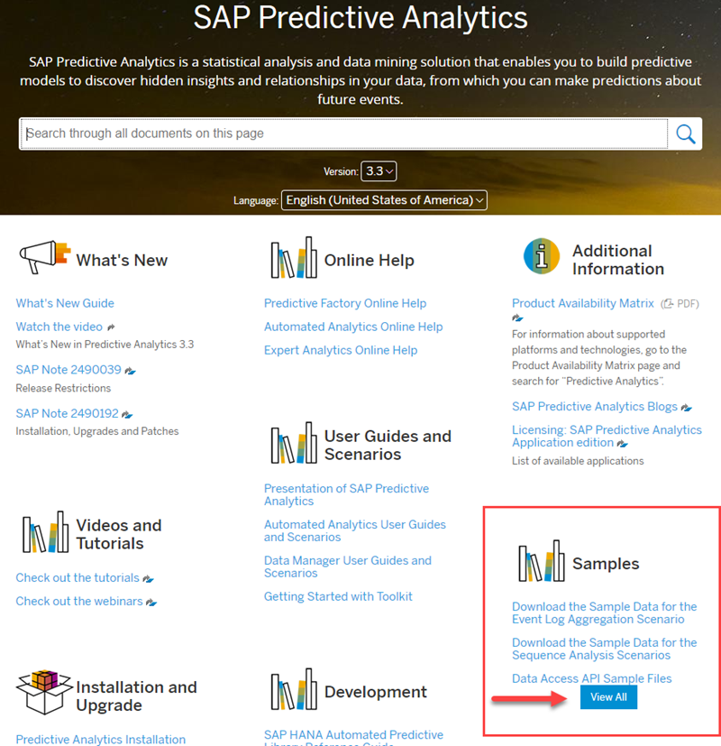

## Prerequisites  
- Proficiency: beginner

### You will learn

As part of the [SAP Predictive Analytics documentation](https://help.sap.com/viewer/p/SAP_PREDICTIVE_ANALYTICS), you can download sample datasets to address many Machine learning scenarios.

In this tutorial, you will learn how to import all the SAP Predictive Analytics sample dataset into your SAP HANA, express edition instance.

For each data set, you will be provided with the table creation DDL and IMPORT FROM SQL statement if you choose that route.

## Details

### Time to Complete
**10 Min**.

[ACCORDION-BEGIN [Prerequisite: ](Prepare your environment)]

The steps detailed in this tutorial and the related links will assume that you have completed the following tutorial:

- [Install a SQL query tool for SAP HANA, express edition](https://www.sap.com/developer/tutorials/mlb-hxe-tools-sql.html)
- [Prepare your SAP HANA, express edition instance for Machine Learning](https://www.sap.com/developer/tutorials/mlb-hxe-setup-basic.html)

[DONE]
[ACCORDION-END]

[ACCORDION-BEGIN [Prerequisite : ](Create a dedicated schema)]

In addition, it is a good practice to separate data into different schema based on their origin.

In this tutorial, you will be using the **`PA_DATA`** schema to load the SAP Predictive Analytics sample data.

If you have already created the schema, move to the next step.

Connect to the **HXE** tenant using the **`ML_USER`** user credentials and execute the following SQL statement:

```SQL
CREATE SCHEMA PA_DATA;
```

[DONE]
[ACCORDION-END]

[ACCORDION-BEGIN [Info: ](Import methods)]

Importing flat data set files like CSV can be achieved in multiple ways.

The following links provide details about the most common methods:

 - Using the [SAP HANA Tools for Eclipse](https://www.sap.com/developer/tutorials/mlb-hxe-import-data-eclipse.html)

    If you are planning on using the Import feature from the SAP HANA Tools for Eclipse, you will need to download the dataset file on the Eclipse host.

 - Using the [IMPORT FROM SQL command](https://www.sap.com/developer/tutorials/mlb-hxe-import-data-sql-import.html)

    If you are planning on using the IMPORT FROM SQL command, you will either directly download or transfer the dataset file on your SAP HANA, express edition host. The tutorial will demonstrate a direct download using WGET.

    As explained in the [IMPORT FROM SQL command](https://www.sap.com/developer/tutorials/mlb-hxe-import-data-sql-import.html) how to guide, the import is by default only possible from the `/usr/sap/HXE/HDB90` directory.

[DONE]
[ACCORDION-END]

[ACCORDION-BEGIN [Info: ](SAP Predictive Analytics Datasets)]

The SAP Predictive Analytics Datasets are available as part of the [online documentation](https://help.sap.com/viewer/p/SAP_PREDICTIVE_ANALYTICS).

Open the [online documentation](https://help.sap.com/viewer/p/SAP_PREDICTIVE_ANALYTICS) page in a browser and click on the **View All** for the **Sample** section.

This will display the list of sample dataset available.


[DONE]
[ACCORDION-END]

[ACCORDION-BEGIN [Import: ](Association Rules Dataset)]

You can refer to the following tutorial to import the dataset: [Import SAP Predictive Analytics Association Rules](https://www.sap.com/developer/tutorials/mlb-hxe-import-data-pa-association.html)

Provide an answer to the question below then click on **Validate**.

[VALIDATE_1]
[ACCORDION-END]

[ACCORDION-BEGIN [Import: ](Census Dataset)]

You can refer to the following tutorial to import the dataset: [Import SAP Predictive Analytics Census Dataset](https://www.sap.com/developer/tutorials/mlb-hxe-import-data-pa-census.html)

Provide an answer to the question below then click on **Validate**.

[VALIDATE_2]
[ACCORDION-END]
[ACCORDION-BEGIN [Import: ](Geo localization Dataset)]

You can refer to the following tutorial to import the dataset: [Import SAP Predictive Analytics Geo localization Dataset](https://www.sap.com/developer/tutorials/mlb-hxe-import-data-pa-geolocalization.html)

Provide an answer to the question below then click on **Validate**.

[VALIDATE_3]
[ACCORDION-END]

[ACCORDION-BEGIN [Import: ](Social Dataset)]

You can refer to the following tutorial to import the dataset: [Import SAP Predictive Analytics Social Datasets](https://www.sap.com/developer/tutorials/mlb-hxe-import-data-pa-social.html)

Provide an answer to the question below then click on **Validate**.

[VALIDATE_4]
[ACCORDION-END]
[ACCORDION-BEGIN [Import: ](Text Coding Dataset)]

You can refer to the following tutorial to import the dataset: [Import SAP Predictive Analytics Text Coding Datasets](https://www.sap.com/developer/tutorials/mlb-hxe-import-data-pa-textcoding.html)

Provide an answer to the question below then click on **Validate**.

[VALIDATE_5]
[ACCORDION-END]
[ACCORDION-BEGIN [Import: ](Time Series Dataset)]

You can refer to the following tutorial to import the dataset: [Import SAP Predictive Analytics Time Series Datasets](https://www.sap.com/developer/tutorials/mlb-hxe-import-data-pa-timeseries.html)

Provide an answer to the question below then click on **Validate**.

[VALIDATE_6]
[ACCORDION-END]
