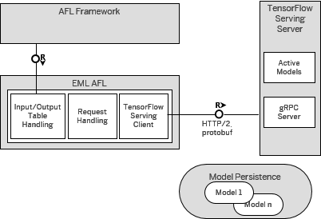

## Prerequisites  
- Proficiency: Intermediate

### You will learn

During this tutorial, you will learn how to install and configure the TensorFlow integration with SAP HANA, express edition.

First, you will download and install the required SAP HANA components.

Then, as the TensorFlow Serving `ModelServer` binaries are only available for `Debian` Linux distribution, you will learn how to compile it from scratch, deploy and expose a model for SUSE Linux Enterprise Server and Red Hat Enterprise Linux.

Finally, you will learn how to configure your SAP HANA, express edition instance to consume the exposed TensorFlow models.

## Details

### Time to Complete
**20 to 120 Min**.

[ACCORDION-BEGIN [Info: ](SAP HANA External Machine Learning Library)]

The integration of TensorFlow with SAP HANA is based on the SAP HANA Application Function Library (AFL).

This allows the application developer to elegantly embed TensorFlow function definitions and calls within `SQLScript` and submit the entire code as part of a query to the database.



The figure above shows the main components of the integrated solution:

- ***AFL Framework***:
     Allows predefined TensorFlow models to be remotely invoked through `gRPC` calls encapsulated inside AFL procedures
- ***EML AFL***:
     The TensorFlow Serving client implementation for SAP HANA
- ***TensorFlow Serving Server***:
     Makes TensorFlow exported models accessible for execution through `gRPC` remote procedure calls
- ***Active Models***:
    The models currently served and therefore available for execution
- ***`gRPC` Server***:
    The `gRPC` server interface for communication with the TensorFlow Serving `ModelServer` client
- ***Model Persistence***:
    The exported models persisted in a format in a given TensorFlow Serving `ModelServer`

[DONE]
[ACCORDION-END]

[ACCORDION-BEGIN [Info: ](Google TensorFlow)]

Google TensorFlow is an open source software library for numerical computation using data flow graphs. While it contains a wide range of functionality, TensorFlow is mainly designed for deep neural network models.

Nodes in the graph represent mathematical operations, while the graph edges represent the multidimensional data arrays (tensors) communicated between them.

As a data scientist, you can use TensorFlow to create, train, and evaluate machine learning models.

TensorFlow Serving (`a.k.a.` TensorFlow Serving `ModelServer`) provides out-of-the-box integration with TensorFlow models, and can be easily extended to serve other types of models and data.

TensorFlow Serving makes it easy to deploy new algorithms and run experiments, while keeping the same server architecture and APIs.

TensorFlow Serving is a flexible, high-performance serving system for machine learning models, designed for production environments.

A TensorFlow `ModelServer` (TMS) makes TensorFlow exported models accessible for execution through the `gRPC` (Remote Procedure Call) mechanism which involves a separate process that serves the actual machine learning functionality.

[DONE]
[ACCORDION-END]

[ACCORDION-BEGIN [Step 1: ](Install SAP HANA Required Packages)]

To download SAP HANA, express edition required packages, you can use the Download Manager either with the GUI mode or the command line mode as documented the setup tutorials.

The SAP HANA, express edition Download Manager is also now provided as part of your SAP HANA, express edition installation and located in: `/usr/sap/HXE/home/bin/`.

Here, it is assumed that the SAP HANA, express edition machine is used to install and TensorFlow Serving.

First, you will need to open a terminal console on your server and switch to the `hxeadm` user:

```bash
sudo su -l hxeadm
```

#### Download & Install the SAP HANA HDB client

Before you can proceed with the next steps, you will need to complete the **Installing SAP HANA HDB Client for Linux** from the [Install the SAP HANA, express edition clients](https://www.sap.com/developer/groups/hxe-install-clients.html) group.

#### SAP HANA External Machine Learning AFL

Before you can proceed with the next steps, you will need to complete the [Install the SAP HANA External Machine Learning Library Package for SAP HANA, express edition](https://www.sap.com/developer/tutorials/hxe-ua-eml-vm.html).

To confirm that the SAP HANA EML functions were installed successfully, you can check the following public views:

- `sys.afl_areas`
- `sys.afl_packages`
- `sys.afl_functions`

Connect to the **HXE** tenant using the **SYSTEM** user credentials and execute the following SQL statement:

```SQL
SELECT * FROM "SYS"."AFL_AREAS" WHERE AREA_NAME = 'EML';
SELECT * FROM "SYS"."AFL_PACKAGES" WHERE AREA_NAME = 'EML';
SELECT * FROM "SYS"."AFL_FUNCTIONS" WHERE AREA_NAME = 'EML';
```

The `AFL_AREAS` & `AFL_PACKAGES` should return 1 row each, and the `AFL_FUNCTIONS` should return 6 rows.

#### Run the Memory Management Script

After the installation is completed, it is recommended to run the ***Memory Management Script*** as described in the ***Best Practice*** to release all unused resources and free up some memory.

```bash
sudo su -l hxeadm

cd /usr/sap/HXE/home/bin
./hxe_gc.sh

exit
```

[DONE]
[ACCORDION-END]

[ACCORDION-BEGIN [Step 2: ](Create a Dedicated User)]

As a best practice, it is recommended to create a dedicated user to run your TensorFlow activities.

This will help avoiding side any effect on the `hxeadm` user that is running the SAP HANA, express edition instance.

To create a TensorFlow Serving `ModelServer` administrator user `tmsadm`, you can execute the following commands:

```shell
sudo useradd -m -d /home/tmsadm -c "TensorFlow Administrator" tmsadm     
sudo passwd tmsadm
```

Then, you can execute the following command to add the `tmsadm` user to the `sudoer` list which will be required to proceed will the installation:

```shell
sudo bash -c 'echo "tmsadm ALL=(ALL) NOPASSWD: ALL" >>/etc/sudoers'
```

Now, you can switch to the `tmsadm` user:

```shell
sudo su -l tmsadm
```

[DONE]
[ACCORDION-END]

[ACCORDION-BEGIN [Step 3: ](Install TensorFlow Serving dependencies)]

In order to successfully compile TensorFlow Serving `ModelServer`, you will need to install a C/C++ compiler.

Most Linux distributions provide a downloadable package group for this.

Python and related tools are also required to complete the TensorFlow compilation and setup.

By default, SAP HANA, express edition setup a Python 2.7 version, but this one doesn't include the `numpy`, `pip`, `virtualenv` & `devel` packages.

Therefore, you will add these missing packages too.

#### For Debian or Ubuntu system:

If you are planning on running TensorFlow Serving on `Debian` or `Ubuntu` system, you can simply follow the **Packages** section details from the [TensorFlow Serving setup instructions](https://www.tensorflow.org/serving/setup#packages).

Then, install the `virtualenv` package using the following command:

```shell
sudo apt-get install virtualenv
```

Make sure that you have a Python 2.7 installation:

```shell
sudo apt-get install python-numpy python-dev python-pip python-wheel
```

#### For SUSE Linux Enterprise Server (including the SAP HANA, express edition VM):

First, you need to add the required software repositories and then install the package group.

The following extensions/repositories are required to install the `Basis-Devel` package group and some additional packages in a later step:

- SUSE Linux Enterprise Software Development Kit
- SUSE Linux Package Hub
- `Toolchain` Module

You can add these extensions/repositories using the following commands:

```shell
sudo SUSEConnect -p PackageHub/12.2/x86_64
sudo SUSEConnect -p sle-sdk/12.2/x86_64
sudo SUSEConnect -p sle-module-toolchain/12/x86_64
```

Then, you can clean and refresh the repository cache:

```shell
sudo zypper clean
sudo zypper refresh
```

These commands will be successful only if you have registered your system with `SUSEConnect`:

```shell
sudo SUSEConnect -r <registration code> -e <registration email>
```

Then, you can execute the following command to install the compiler:

```shell
sudo zypper install --type pattern Basis-Devel
```

The following additional dependencies are also required:

```shell
sudo zypper install \
    wget  \
    curl \
    git \
    freetype-devel \
    libpng12-devel \
    swig \
    zip
```

Regarding Python tools, you can install them using the following command:

```shell
sudo zypper install \
    python \
    python-devel \
    python-numpy \
    python-numpy-devel \
    python-setuptools
```

As Python Pip and Virtual Environments are not part of the default SUSE repositories, you will use the ***openSUSE Python Development*** repository.

You can add the Python Modules repository using the following command:

```shell
sudo zypper addrepo 'https://download.opensuse.org/repositories/devel:/languages:/python/SLE_12_SP2/devel:languages:python.repo'
sudo zypper refresh
```

Then, install the packages using the following command:

```shell
sudo zypper install \
    python-pip \
    python-virtualenv
```

And finally remove the Python Modules repository using the following command:

```shell
sudo zypper rr 'devel_languages_python'
```

#### For Red Hat Enterprise Linux:

First, you need to add the required software repositories and then install the package group.

The following extensions/repositories are required to install the `Development Tools` package group and some additional packages in a later step:

You can add these extensions/repositories using the following commands:

```shell
sudo subscription-manager repos --enable="rhel-7-server-extras-rpms"
sudo subscription-manager repos --enable="rhel-7-server-optional-rpms"
```

Then, you can clean and refresh the repository cache:

```shell
sudo yum clean all
sudo yum repolist
```

Then, you can execute the following command to install the compiler:

```shell
sudo yum groupinstall "Development Tools"
```

The following additional dependencies are also required:

```shell
sudo yum install \
    wget \
    curl \
    git \
    freetype-devel \
    swig \
    zip
```

As Python Pip is not part of the default Red Hat repositories, you will use the ***Extra Packages for Enterprise Linux*** (EPEL) as described in the Red Hat solution note [3358](https://access.redhat.com/solutions/3358).

EPEL has an `epel-release` package that includes the `gpg` keys for package signing and repository information.

Installing this package should allow you to use normal tools such as yum to install packages and their dependencies.

Execute the following command to install the `epel-release` package:

```shell
sudo rpm -ivh https://dl.fedoraproject.org/pub/epel/epel-release-latest-7.noarch.rpm
```

Then, you can install Python tools using the following command:

```shell
sudo yum install \
    numpy \
    python \
    python-devel \
    python-pip \
    python-virtualenv
```

[DONE]
[ACCORDION-END]

[ACCORDION-BEGIN [Step 4: ](Install TensorFlow Serving Python Pre-Requisites)]

Before install the TensorFlow Serving `ModelServer`, you will need to install a set of pre-requisites.

First, you have to create and activate a Python Virtual Environment (named `tms`) using the following commands:

```shell
cd ~/
virtualenv --python=python2.7 --system-site-packages ~/tms
source ~/tms/bin/activate
```

Your terminal prompt should now look like the following:

```
(tms) tmsadm@hxehost:~>
```

#### Pip:

Now, you need to check the Pip version using the following command:

```shell
pip --version
```

The minimum version required is pip 9.0.1 and the output should look like this:

```
pip 9.0.1 from /home/tmsadm/tms/lib/python2.7/site-packages (python 2.7)
```

If you don't match this version you can run the following command to upgrade pip:

```shell
pip install --upgrade pip
```

#### `gRPC`:

`gRPC` is a high performance, open-source universal RPC framework that used by the TensorFlow Serving `ModelServer`. For more details about `gRPC` you can check the [`grpc.io`](https://grpc.io/) web site or the [`gRPC` GitHub repository](https://github.com/grpc/grpc/tree/master/src/python/grpcio).

You can install `gRPC` using the following command:

```shell
pip install grpcio
```

#### TensorFlow:

Then you can install TensorFlow using the following command:

```shell
pip install tensorflow
```

You can now test your TensorFlow installation by starting a Python session and pasting the following code:

```Python
import tensorflow as tf
hello = tf.constant('Hello, TensorFlow!')
sess = tf.Session()
print(sess.run(hello))
exit()
```

A **Hello, TensorFlow!** message should be printed out.

#### TensorFlow Serving API:

And finally, the TensorFlow Serving API:

```shell
pip install tensorflow-serving-api
```

[DONE]
[ACCORDION-END]

[ACCORDION-BEGIN [Step 5: ](Install TensorFlow Serving)]

As stated previously, TensorFlow Serving `ModelServer` installable binaries are only available for `Debian` & `Ubuntu` Linux distribution.

Therefore, on SUSE Linux Enterprise Server or Red Hat Enterprise Linux, you will need to compile the binary locally as detailed in this step.


If you are planning on running TensorFlow Serving on `Debian` or `Ubuntu`system, you can simply following the [TensorFlow Serving setup instructions](https://www.tensorflow.org/serving/setup#installing_using_apt-get) and move to the next step.

#### Bazel:

`Bazel` is an open-source build and test tool similar to `Make`, `Maven`, and `Gradle`. It uses a human-readable, high-level build language.
`Bazel` supports projects in multiple languages and builds outputs for multiple platforms.

TensorFlow uses `Bazel` for its compilation. You can find the `Bazel` installation instructions [online](https://docs.bazel.build/versions/master/install.html).

You can install `Bazel` 0.11.1 in a *user* mode using the following commands:

```shell
cd ~/
curl -L https://github.com/bazelbuild/bazel/releases/download/0.11.1/bazel-0.11.1-installer-linux-x86_64.sh -o ~/bazel-0.11.1-installer-linux-x86_64.sh
chmod +x ~/bazel-0.11.1-installer-linux-x86_64.sh
./bazel-0.11.1-installer-linux-x86_64.sh --user
export PATH="$PATH:$HOME/bin"
rm ~/bazel-0.11.1-installer-linux-x86_64.sh
```

You can now check that `Bazel` 0.11.1 was properly installed using the following command:

```shell
bazel version
```

The output should look like the following:

```
Build label: 0.11.1
Build target: bazel-out/k8-opt/bin/src/main/java/com/google/devtools/build/lib/bazel/BazelServer_deploy.jar
Build time: ...
Build timestamp: ...
Build timestamp as int: ...
```

#### Clone TensorFlow Serving Git repository:

The first step is to clone the TensorFlow Serving `ModelServer` locally using the following commands:

```shell
cd ~/
git clone --recurse-submodules https://github.com/tensorflow/serving
cd ~/serving
```

#### Compile TensorFlow Serving:

Then you will compile the source code with `Bazel` using the following command:

```shell
bazel build -c opt tensorflow_serving/...
```

Alternatively, you can compile the source code with the following recommended optimization parameters:

```shell
bazel build -c opt \
    --copt=-msse4.1 \
    --copt=-msse4.2 \
    --copt=-mavx \
    --copt=-mavx2 \
    --copt=-mfma \
    --copt=-O3  \
    tensorflow_serving/...
```

> ### Warning: Depending on your machine resources, the compilation takes between 2 and 4 hours.

Optionally, you can run the TensorFlow Serving `ModelServer` tests to validate that your environment is properly setup and the compilation was efficient:

```shell
cd ~/serving
bazel test -c opt tensorflow_serving/...
```

And last but not least, you have to *build** TensorFlow Serving `ModelServer` binary using the following command:

```shell
cd ~/serving
bazel build -c opt //tensorflow_serving/model_servers:tensorflow_model_server
```

#### Add TensorFlow Serving to the path:

In order to permanently add the TensorFlow Serving `ModelServer` executable to your user path, you will add the compiled binary directory path in your profile file:

```shell
cd ~/
echo "export PATH=$PATH:/home/tmsadm/tms/bin:/home/tmsadm/serving/bazel-bin/tensorflow_serving/model_servers/" >> ~/.profile
source .profile
```

Now you can call directly the TensorFlow Serving `ModelServer` executable without prefixing with the path.

[DONE]
[ACCORDION-END]

[ACCORDION-BEGIN [Step 6: ](Start TensorFlow Serving)]

Create a model export directory where you will store your TensorFlow Serving configuration and exported models:

```shell
mkdir -p ~/export
```

First, create the following empty model configuration file `/home/tmsadm/export/config.cnf` and add the following content:

```js
model_config_list: {
}
```
Now that your installation and configuration is completed, you can start the TensorFlow Serving using the following command:

```shell
tensorflow_model_server --port=8500 --model_config_file=/home/tmsadm/export/config.cnf
```

You can use the following command if you prefer to run it as a background process with all outputs redirected:

```shell
nohup  tensorflow_model_server -port=8500 --model_config_file=/home/tmsadm/export/config.cnf > /home/tmsadm/export/tensorflow_model_server.log 2>&1  </dev/null &
```

[DONE]
[ACCORDION-END]

[ACCORDION-BEGIN [Step 7: ](Configure SAP HANA External Machine Learning)]

Now, that the TensorFlow Serving `ModelServer` is up and running, you will need to add its configuration to your SAP HANA, express edition instance.

Before moving forward with the EML configuration, you need to grant the proper role to the `ML_USER` created during the [Prepare your SAP HANA, express edition instance for Machine Learning](https://www.sap.com/developer/tutorials/mlb-hxe-setup-basic.html).

Make also sure that the Script Server has been added to your instance.

Also for operational systems, it is recommend to use two separate users with distinctive roles:

- Administering the TensorFlow `ModelServer` and model deployments
- Calling the deployed models in your code

Connect to the **HXE** tenant using the **SYSTEM** user credentials and execute the following SQL statement:

```SQL
GRANT AFL__SYS_AFL_EML_EXECUTE TO ML_USER;
GRANT SELECT, UPDATE, DELETE, INSERT ON  _SYS_AFL.EML_MODEL_CONFIGURATION TO ML_USER;
```

You can now proceed with the rest of the configuration as `ML_USER`.

Connect to the **HXE** tenant using the **`ML_USER`** user credentials and execute the following SQL statement:

```SQL
CREATE REMOTE SOURCE "TensorFlow" ADAPTER "grpc" CONFIGURATION 'server=localhost;port=8500';
```

Now that the remote source was added, you will need to reload the EML configuration as this one is loaded once at the SAP HANA, express edition startup time.

Connect to the **HXE** tenant using the **`ML_USER`** user credentials and execute the following SQL statement:

```SQL
CREATE SCHEMA EML_DATA;
SET SCHEMA EML_DATA;
-- Uncomment the following lines if you want to re-run the script
-- DROP TABLE UPDATE_CONFIGURATION_PARAMS;
-- DROP TABLE UPDATE_CONFIGURATION_RESULT;
-- DROP PROCEDURE UPDATE_CONFIGURATION;

CREATE TABLE UPDATE_CONFIGURATION_PARAMS ("Parameter" VARCHAR(100), "Value" VARCHAR(100));
CREATE TABLE UPDATE_CONFIGURATION_RESULT ("Key" VARCHAR(100), "Value" INTEGER, "Text" VARCHAR(100));
CREATE PROCEDURE UPDATE_CONFIGURATION() AS
BEGIN
    DECLARE CURSOR CUR FOR
        SELECT VOLUME_ID FROM SYS.M_VOLUMES WHERE SERVICE_NAME = 'indexserver';
    FOR CUR_ROW AS CUR DO
        EXEC 'CALL _SYS_AFL.EML_CTL_PROC(''UpdateModelConfiguration'', UPDATE_CONFIGURATION_PARAMS, UPDATE_CONFIGURATION_RESULT)'
            || ' WITH OVERVIEW WITH HINT(ROUTE_TO(' || :CUR_ROW.VOLUME_ID || '))';
    END FOR;
END;
TRUNCATE TABLE UPDATE_CONFIGURATION_RESULT;
CALL UPDATE_CONFIGURATION();
SELECT * FROM UPDATE_CONFIGURATION_RESULT;
```

It should return the following result:

|    Key | Value |  Text |
|--------|-------|-------|
| Status |     0 |    OK |

Now, you can check the registered models:

```SQL
SET SCHEMA EML_DATA;
-- Uncomment the following lines if you want to re-run the script
-- DROP TABLE CHECK_PARAMS;
CREATE TABLE CHECK_PARAMS ("Parameter" VARCHAR(100), "Value" VARCHAR(100));
INSERT INTO CHECK_PARAMS VALUES ('Model', '*');
CALL _SYS_AFL.EML_CHECKDESTINATION_PROC(CHECK_PARAMS, ?);
```

Provide an answer to the question below then click on **Validate**.

[VALIDATE_1]
[ACCORDION-END]
