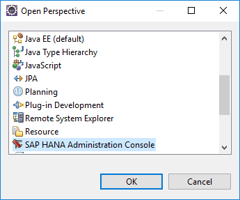
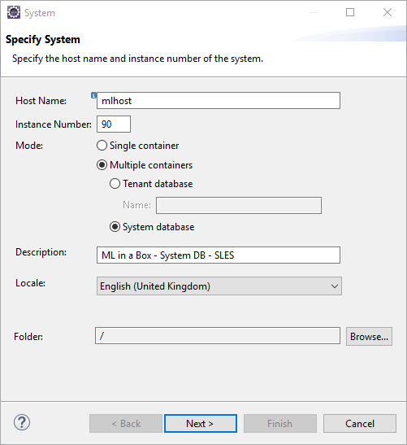
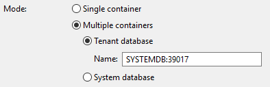
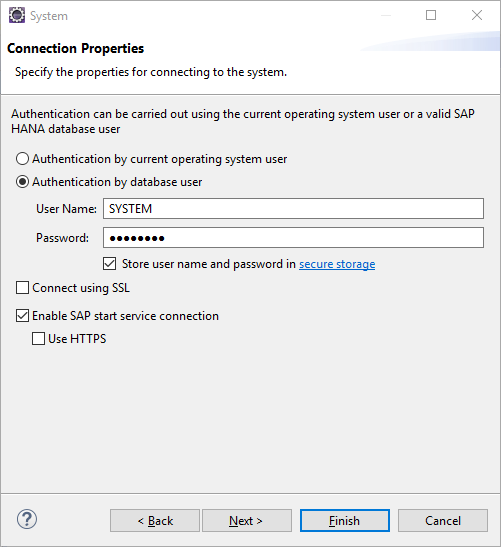
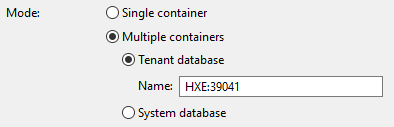
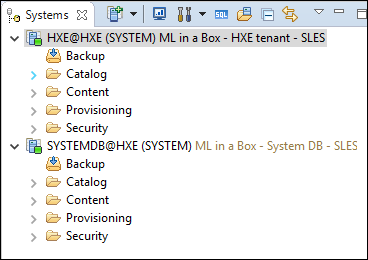
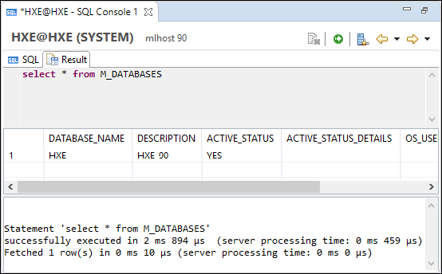
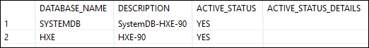

## Prerequisites  
- Proficiency: beginner
- [Eclipse IDE](https://www.eclipse.org/downloads/) installed, running and properly connected to the internet.

### You will learn

In this tutorial, you will install and configure the SAP HANA Tools for Eclipse.

Then, you will learn how to connect to the System database and the HXE tenant of your SAP HANA, express edition instance.

For alternate options, you can also check the following link: [Select a SQL query tool for SAP HANA, express edition](https://www.sap.com/developer/tutorials/mlb-hxe-tools-sql.html).

## Details

### Time to Complete
**10 Min**.

[ACCORDION-BEGIN [Prerequisite: ](Eclipse IDE)]

In order to proceed with the next steps, you must have the [Eclipse IDE](https://www.eclipse.org/downloads/) installed, running and properly connected to the internet.

[ACCORDION-END]

[ACCORDION-BEGIN [Info: ](Gather your system details)]

In order to connect to your SAP HANA, express edition, you will need to specify the following details:

### **Host name**

You can specify either the host IP address or its fully qualified name of your SAP HANA, express edition instance.

You can usually retrieve the IP address running the following command directly from the SAP HANA, express edition host:

```Shell
/sbin/ifconfig
```

> ### **Note**:
> &nbsp;
> When connecting to an SAP HANA, express edition instance hosted in the cloud, the IP address returned by the above command represents your local IP address, which may not be exposed on the internet.
> &nbsp;
> In order to connect, you will need to retrieve the host ***external IP address***. Refer to your cloud provider documentation to retrieve this information.
>
&nbsp;

Make sure that you can ***`ping`*** the host IP address or its fully qualified name from the computer you will connect using Eclipse.

We encourage you to update your local host file and add an entry to map the SAP HANA, express edition host IP address to a local name.

### **Instance number**

The instance number used by default value is **90**, unless specified otherwise during the setup.

In earlier releases (prior to version 1.0 SPS12), the default value was **00**, unless specified otherwise during the setup.

> ### **Note**:
> &nbsp;
> The ***instance number*** has a direct impact on the TCP port numbers, and therefore the firewall configuration.
> &nbsp;
> The pattern used for the port number is: **3&lt;instance number&gt;&lt;service port&gt;**.
&nbsp;
> For example, the ***SQL/MDX*** service port to access the ***system database*** of a multitenant system is **13**. It means that TCP port **39013** will be used to connect to the SYSTEMDB to run ***SQL/MDX***.
&nbsp;

Make sure that you can reach the port (using a telnet command) from the computer you will connect using Eclipse.

### **Mode**

Prior to version 1.0 SPS12, SAP HANA, express edition was delivered using a *single-database container* mode which uses the **Single Container** mode.

But since version 2.0, SAP HANA, express edition uses a *multi-database container* architecture.

During the installation process, a *System database* named ***`SYSTEMDB`*** along with a *tenant database* named ***HXE*** are created.

Therefore, you will use the **Multiple Container** mode, and then decide to connect to either the ***System database*** or a ***Tenant database*** using its name.

### **Credentials**

By default, a ***SYSTEM*** user is always created with every ***System database*** or ***Tenant database***.

Most installation will force you to setup a new password either upon the first start of the virtual machine (also referred as ***HANA Database Master*** password), during the setup with the manual binary installation or using a password configuration file with ***`Docker`***.

Make you have the proper credentials, as after 5 failed login attempts, the user account will be locked for 1440 minutes which is the database default password policy).

[ACCORDION-END]

[ACCORDION-BEGIN [Info: ](SAP HANA Tools for the Eclipse IDE)]

The SAP HANA Tools for the Eclipse IDE is available for the following versions of the Eclipse IDE with their respective software repository:

| Eclipse IDE       | Software Repository                       |
|-------------------|-------------------------------------------|
| **Oxygen (4.7)**  | `https://tools.hana.ondemand.com/oxygen/`
| Neon (4.6)        | `https://tools.hana.ondemand.com/neon/`
| Mars (4.5)        | `https://tools.hana.ondemand.com/mars/`
| Luna (4.4)        | `https://tools.hana.ondemand.com/luna/`
| Kepler (4.3)      | `https://tools.hana.ondemand.com/kepler/`

> ### **Warning**: [Docker store image for SAP HANA, express edition](https://store.docker.com/images/sap-hana-express-edition)
> &nbsp;
> The SAP HANA Tools for Eclipse prior to the Mars version are not compatible with the Docker store image for SAP HANA, express edition ([link](https://store.docker.com/images/sap-hana-express-edition)).
>

We do encourage you to use the latest version (Oxygen) in conjunction with your SAP HANA, express edition version 2.0 instances in order to benefit from the latest features and fixes.

> ### **Note**: Connecting to SAP HANA Systems on the SAP Cloud Platform
> &nbsp;
> The ***SAP Cloud Platform Tools for Connecting to SAP HANA Systems*** is no longer available starting the Oxygen version of the SAP HANA Tools for Eclipse.
> &nbsp;
> This module allows you to connect directly to a SAP HANA instance on the SAP Cloud Platform.
> &nbsp;
> You will need to [open a database tunnel using the SAP Cloud Platform Console Client](https://help.sap.com/viewer/65de2977205c403bbc107264b8eccf4b/Cloud/en-US/9e3f90f2ead74229ac5c8848ed5bf292.html).

[ACCORDION-END]

[ACCORDION-BEGIN [Step 1: ](Install the SAP HANA tools for Eclipse)]

In the Eclipse IDE, choose in the menu bar **Help > Install New Software...**


In the **Work with** field, input your ***Software Repository*** or select the entry starting with **SAP Development Tools for Eclipse**.

The ***Software Repository*** must match your current version of the Eclipse IDE (refer to the previous *Info: SAP HANA Tools for the Eclipse IDE* section).

Select the **SAP HANA Tools** from the list, then click on **Next**.


Click on **Next** again, then accept the licenses terms after reading them, then click on **Finish**

You may receive a security warning while the installation is in progress regarding unsigned content. Click on **OK**.


After the software update is completed, you will be prompted to restart Eclipse.

Click on **Yes**.


[ACCORDION-END]

[ACCORDION-BEGIN [Step 2: ](Switch perspective)]

Change your current perspective using the  **Window > Perspective > Other** menu.


Select to **SAP HANA Administrative Console** and click **OK**.



[ACCORDION-END]

[ACCORDION-BEGIN [Step 3: ](Add a connection to the System Database)]

Click on the **Add System...**  icon.


> ### **Note**:
>
> The ***Add Cloud System...*** is no longer available with the Oxygen version of the SAP HANA Tools for Eclipse.

Provide the following system details based on the ***Info: Gather your system details*** section.

Select **Multiple containers**, then select **System database**.



> ### **Warning**: For Docker image from the Docker store
> &nbsp;
> In order to connect to the System Database, you will need to select then select **Tenant database**, and input **SYSTEMDB:39017** in the name field. This is due to a specific port binding configuration.
>


We encourage you to set a **Description** as it will help identify in a more meaningful manner your instances.

For example, you can include the host name and the instance number which are not displayed afterward.

Click on **Next**.

Select **Authentication by database user**.

Enter your database credentials, usually with the **SYSTEM** database user credentials.

Select if you want to **Store user name and password in a secure storage**.

Click on **Finish**



> ### **Note**:
>
> You may be asked to change the user password if this is the first login attempt.

[ACCORDION-END]

[ACCORDION-BEGIN [Step 4: ](Add a connection to the HXE tenant)]

Click on the **Add System...**  icon.


> ### **Note**:
>
> The ***Add Cloud System...*** is no longer available with the Oxygen version of the SAP HANA Tools for Eclipse.

Provide the following system details based on the ***Info: Gather your system details*** section.

Select **Multiple containers**, then select **Tenant database**, and enter **HXE** in the name field.


> ### **Warning**: For Docker image from the Docker store
> &nbsp;
> In order to connect to the HXE tenant, you will need to select then select **Tenant database**, and input **HXE:39041** in the name field. This is due to a specific port binding configuration.
>


We encourage you to set a **Description** as it will help identify in a more meaningful manner your instances.

For example, you can include the host name and the instance number which are not displayed afterward.

Click on **Next**.

Select **Authentication by database user**.

Enter your database credentials, usually with the **SYSTEM** database user credentials.

Select if you want to **Store user name and password in a secure storage**.

Click on **Finish**


[ACCORDION-END]

[ACCORDION-BEGIN [Step 5: ](Analyze the connections)]

The new connections are displayed in the ***Systems*** view as shown below:



The green indicator  informs you that all services are properly started.

When you are logger out, the icon will be greyed out like this .

When you cannot connect, either because the host is unreachable or the credentials are not valid, a red cross will be added like this . The grey dot reflect the fact that the services status cannot be checked.

The displayed information is following this pattern: **[Tenant name]@[Instance name] ([Database user name] [Description])**.

The instance name, which is by default HXE, is directly linked to the instance number, and not to be confused with the HXE database tenant.

[ACCORDION-END]

[ACCORDION-BEGIN [Step 6: ](Test the connections with SQL)]

Select the **HXE @ HXE (SYSTEM)** item, then click on the SQL icon .

This will open a SQL console linked to the **HXE @ HXE (SYSTEM)** connection.


Execute the following SQL statement, by pasting the following content then press **F8** or click on the  icon:

```SQL
select * from M_DATABASES;
```

It should return the following result:



Now switch to the **SYSTEMDB @ HXE (SYSTEM)** connection, either by opening a new SQL console, or using the ***Switch connection***  icon.

Run the same SQL statement, and the result should be:



This implies that the tenant database cannot see the system database but the system database can.

[ACCORDION-END]
