## Prerequisites  
- Proficiency: intermediate

### You will learn

In this tutorial, you will install the SAP HANA client for SAP HANA, express edition.

Then, you will learn how to connect your SAP HANA, express edition instance using Eclipse as a JDBC based querying tool (instead of the [SAP HANA Tools for Eclipse](https://www.sap.com/developer/tutorials/mlb-hxe-tools-sql-eclipse.html)).

The **Eclipse IDE** provides a built-in perspective named **Data Source Explorer** which can be used as a JDBC based querying tool too.

This will help you configure your favorite JDBC based querying tool as they are all very similar in term of configuration needs.

Just to name a few, here are some tools you might have already considered as alternatives to the [SAP HANA Tools for Eclipse](https://www.sap.com/developer/tutorials/mlb-hxe-tools-sql-eclipse.html):

 - [`DBeaver`](http://dbeaver.jkiss.org/download/) (more details in [SQL Clients and SAP HANA 2.0 by Craig Cmehil](https://blogs.sap.com/2017/03/24/march-tip-sql-clients-and-sap-hana-2.0/))
 - [`SQLPad`](https://rickbergfalk.github.io/sqlpad/) (more details in [`SQLPad` meets SAP HANA by Craig Cmehil ](https://blogs.sap.com/2018/02/05/sqlpad-meets-sap-hana/))
 - [`SQuirrel SQL`](http://www.squirrelsql.org/)

In addition, here some that are Eclipse plugins:

 - [`DBeaver Plugin for Eclipse`](https://marketplace.eclipse.org/content/dbeaver)
 - [`DBViewer Plugin for Eclipse`](https://marketplace.eclipse.org/content/dbviewer-plugin)

This does not represent an exhaustive list of tools able to connect to SAP HANA, express edition using JDBC.

In most scenario, if the SAP HANA JDBC driver is not already pre-configured, you will need to add it before establishing your connection.

For alternate options, you can also check the following link: [Select a SQL query tool for SAP HANA, express edition](https://www.sap.com/developer/tutorials/mlb-hxe-tools-sql.html).

## Details

### Time to Complete
**10 Min**.

[ACCORDION-BEGIN [Prerequisites: ](Download & Install the SAP HANA HDB client)]

Before you can proceed with the next steps, you will need to complete the **Installing SAP HANA HDB Client** for your target platform from the [Install the SAP HANA, express edition clients](https://www.sap.com/developer/groups/hxe-install-clients.html) group.

[DONE]
[ACCORDION-END]

[ACCORDION-BEGIN [Step 1: ](Locate the JDBC Driver)]

The driver (`ngdbc.jar`), which is installed as part of the SAP HANA client, is located at (unless specified otherwise during the installation):

 - on Linux and UNIX platforms `/usr/sap/hdbclient/`
 - on Microsoft Windows platforms: `C:\Program Files\SAP\hdbclient\`

[DONE]
[ACCORDION-END]

[ACCORDION-BEGIN [Step 2: ](Configure the driver)]

Here we will use the ***Eclipse Data Source Explorer*** as an example to highlight the key information that are require to configure a new JDBC driver in your tool of preference.

Such configuration will be required if the SAP HANA JDBC driver is not pre-configured.

First, change your current perspective using the  **Window > Perspective > Other** menu.


Select to **Database Development** and click **OK**.

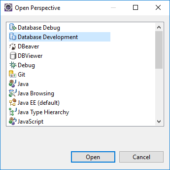

The ***Data Source Explorer*** view should now be displayed.

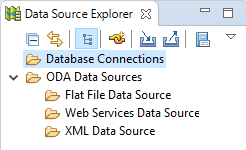

Now, using the menu, go to **Window > Preferences** and navigate to **Data Management > Connectivity > Driver Definition**.

Click on **Add...**

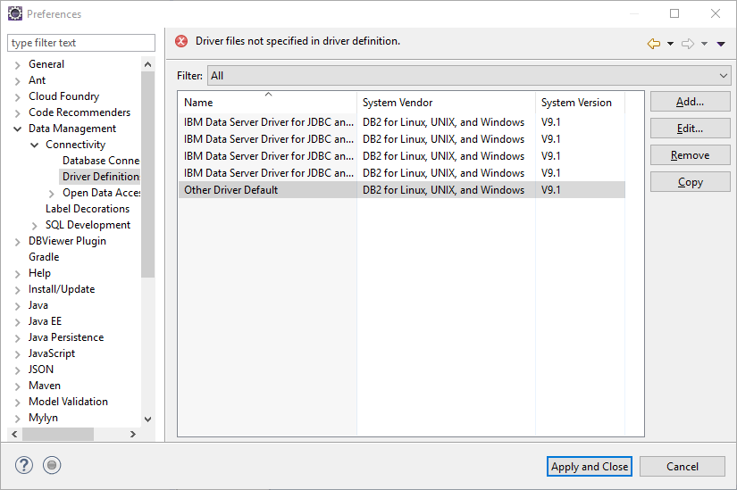

The ***New Driver Definition*** popup will appear.

On the **Name/Type** tab:

- select **Vendor Filter** as **Generic JDBC**
- select **Generic JDBC** in the **Available Driver Templates**
- input **SAP HANA, express edition** as your **Driver Name**

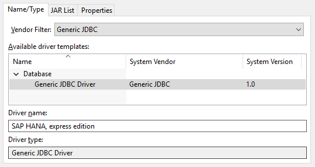

On the **JAR List** tab:

- add the **`ngdbc.jar`** to the list using the **Add JAR/Zip** button (refer to step 3 for the full path).

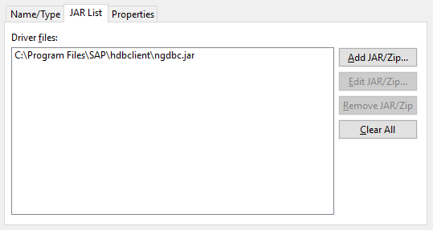

On the  **Properties** tab:

- set the ***Connection URL*** to `jdbc:sap://<server host>:<port>[/?<options>]`
- set the ***Driver*** to `com.sap.db.jdbc.Driver`

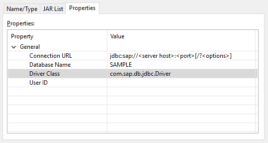

Click on **OK**

The **Drivers Definitions** list should include the new entry.

Click on **Apply and Close** to close the ***Preferences*** popup window.

[DONE]
[ACCORDION-END]

[ACCORDION-BEGIN [Step 3: ](Configure your connections)]

Now, either right-click on **Database Connections > New** or click on the  to create a new Connection Profile.


#### **Connect to the SYSTEM Database**

On the **Connection Profile** panel, select **Generic JDBC** and enter **SYSTEMDB @ HXE (SYSTEM)** in the **Name** field.

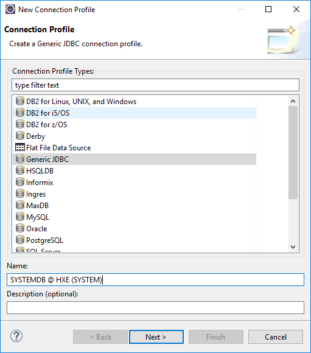

Click on **Next**.

To connect to the ***System Database***, you will need to provide the information for the *database* name, the *URL connection string* and a *user name* & *password*.

|-----------|-------------|
| Database  | SYSTEMDB
| URL       | `jdbc:sap://<server host>:<port>`
| User name | for example the SYSTEM user credentials
| Password  | for example the SYSTEM user credentials

The SQL/MDX service port for the **SYSTEMDB** is **39013** (except with Docker where it is ***39017***).

For more details about the **URL Connection String**, please check the last few steps.

With the SAP HANA, express edition default settings, it may look like this:

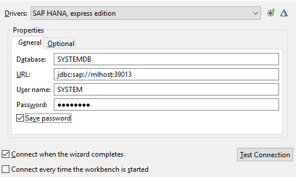

Click on **Finish**.

#### **Connect to the HXE tenant**

On the **Connection Profile** panel, select **Generic JDBC** and enter **HXE @ HXE (SYSTEM)** in the **Name** field.

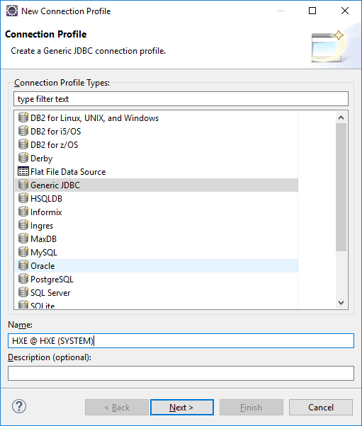

Click on **Next**.

To connect to the ***HXE tenant***, you will need to provide the same type of information.

|-----------|-------------|
| Database  | HXE
| URL       | `jdbc:sap://<server host>:<port>`
| User name | for example the SYSTEM user credentials
| Password  | for example the SYSTEM user credentials

The SQL/MDX service port for the **HXE** tenant is **39015** (except with Docker where it is ***39041***).

With the SAP HANA, express edition default settings, it may look like this:

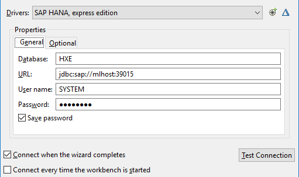

Click on **Finish**.

[DONE]
[ACCORDION-END]

[ACCORDION-BEGIN [Step 4: ](Test the connections with SQL)]

Click on the ***open scrapbook to edit SQL*** icon , then select:

|----------|--------------------|
| Type     | Generic JDBC
| Name     | HXE @ HXE (SYSTEM)
| Database | HXE

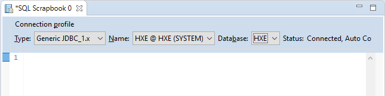

Execute the following SQL statement, by pasting the following content then press **CTRL+ALT=X** to run it:

```SQL
select * from M_DATABASES;
```

It should return the following result:

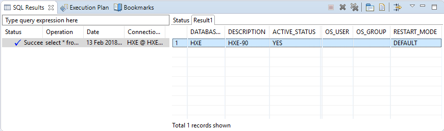

Now switch to the **SYSTEMDB @ HXE (SYSTEM)** connection and run the same SQL statement, and the result should be:

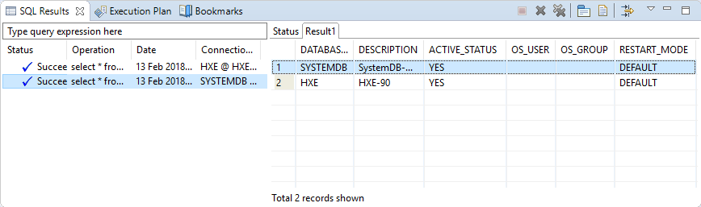

[DONE]
[ACCORDION-END]

[ACCORDION-BEGIN [Step 5: ](Validation)]

Based on the available **JDBC Connection Properties** listed in the <a href="https://help.sap.com/viewer/0eec0d68141541d1b07893a39944924e/2.0.02/en-US/109397c2206a4ab2a5386d494f4cf75e.html" target="new">online documentation</a>, provide an answer to the question below then click on **Validate**.

[VALIDATE_1]
[ACCORDION-END]

[ACCORDION-BEGIN [Connection String: ](The server host)]

You can use the IP address, the host name or the fully qualified name as long as the server host is reachable using a ping command from the machine that will run your program.

You can also specify one or more failover servers by adding additional hosts, as in the following example:

```bash
jdbc:sap://myServer:39015;failoverserver1:39015;failoverserver2:39015
```

[DONE]
[ACCORDION-END]

[ACCORDION-BEGIN [Connection String: ](The port number)]

The port number to be used in the connection string include the instance number which is assigned when a new instance is created.

And, the pattern used for port assignments is: ***3&lt;instance number&gt;&lt;service port&gt;***.

To execute SQL, you will need to connect to the ***SQL/MDX*** service port.

#### **SAP HANA, express edition 1.0 and Single Database Container**

In these earlier release, Single Database Container was the default installation mode and the default instance number was **00**.

The ***SQL/MDX*** service port to access the database of a single tenant system is **15**, so the port is **30015**.

To access a specific database, you will use the **`databasename`** in the option parameter.

#### **SAP HANA, express edition 2.0 and Multi Database Container**

With newer releases, Multi Database Container are installed by default and the instance number used by default value is **90**, unless specified otherwise during the setup.

With Multi Database Container you must consider the SQL/MDX service port to access the System database (also called SYSTEMDB) and the Tenant databases.

The ***SQL/MDX*** service port to access the **SYSTEMDB** ***System database*** of a multitenant system is **13**, so the port is **39013**

The ***SQL/MDX*** service port to access the **HXE** ***Tenant databases*** of a multitenant system is **15**, so the port is **39015**

Make sure that you can reach the port (using a telnet command) from the computer you will connect using Eclipse.

[DONE]
[ACCORDION-END]

[ACCORDION-BEGIN [Connection String: ](The options)]

The JDBC driver supports a full set of options that can become handy when developing your application.

For example, you can use the ***options*** parameter to specify the auto-commit behavior, as in the following example:

```bash
jdbc:sap://myServer:39015/?autocommit=false
```

For more information about the **JDBC Connection Properties**, you can check the <a href="https://help.sap.com/viewer/0eec0d68141541d1b07893a39944924e/2.0.02/en-US/109397c2206a4ab2a5386d494f4cf75e.html" target="new">online documentation</a>

[DONE]
[ACCORDION-END]
