 
# Create a SAP Service and Asset Manager Mobile Services App with Metrics
<!-- description -->Create and update a SAP Service and Asset Manager Mobile Services App with Metrics using transaction /MERP/CPMS_APPCREATE from the SAP GUI.

## Prerequisites
- Access to your SAP BTP Subaccount and Space.
- Access to the SAP Mobile Services service in your SAP BTP subaccount.
- Latest App Create and Metrics Updates. Please review [SAP Note 3703174](https://me.sap.com/notes/3703174) for the latest updates.

## You will learn
- How to create and update a SAP Service and Asset Manager Mobile Services App with Metrics using transaction `/MERP/CPMS_APPCREATE`.
- How to review the SAP Service and Asset Manager Mobile Services App with Metrics
- Optional Features:
  1. Use a RFC Destination (Middleware Server) to create the Mobile Services App.
  2. Use a RFC Destination to send Metrics to Cloud Reporting.
  3. Set up Satellite Systems.
  4. Enable Multiple Threads in Offline Configuration.
- Troubleshoot:
  1. Missing Offline Configuration.
  2. Usage Metering Middleware Server Missing and/or Properties Missing.
  3. Usage Metering Background Job Missing.

## Intro
In this mission you will learn to create and update a SAP Service and Asset Manager Mobile Services App with Metrics using transaction **`/MERP/CPMS_APPCREATE`** from the SAP GUI. The Mobile Services App created by the transaction may be used to onboard your SAP Service and Asset Manager mobile app.

### Gather the Required Information

1. The **Admin API** link can be found in the **Important Links** section of the SAP BTP Mobile Services service in your SAP BTP subaccount.

    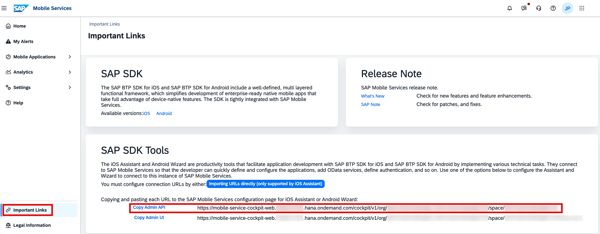

2. The **SAP Cloud Connector Location Id** and **Virtual Host** can be found in the **Cloud Connector** section of the SAP BTP Cockpit in your subaccount.

    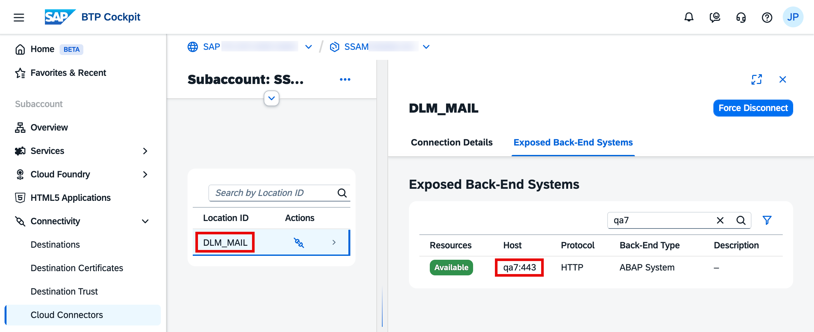

### Create a SAP Service and Asset Manager Mobile Services App with Metrics

1. Execute the transaction **`/MERP/CPMS_APPCREATE`** from the SAP GUI, then select your required variant (i.e., `SAP&SAM_<version>`).

2. Fill in the **Admin API**, **SCC Location Id** and **Virtual Host**. Please ensure the **Background Job User** will maintain authorization to run the Usage Metering background job (parameter info below). To use a RFC Destination to create the app instead of the **Admin API** please see Step 4 (optional). The app is created as the Metrics Host by default, to set up the app as the Metrics Satellite please see Step 6. Then execute the transaction.

    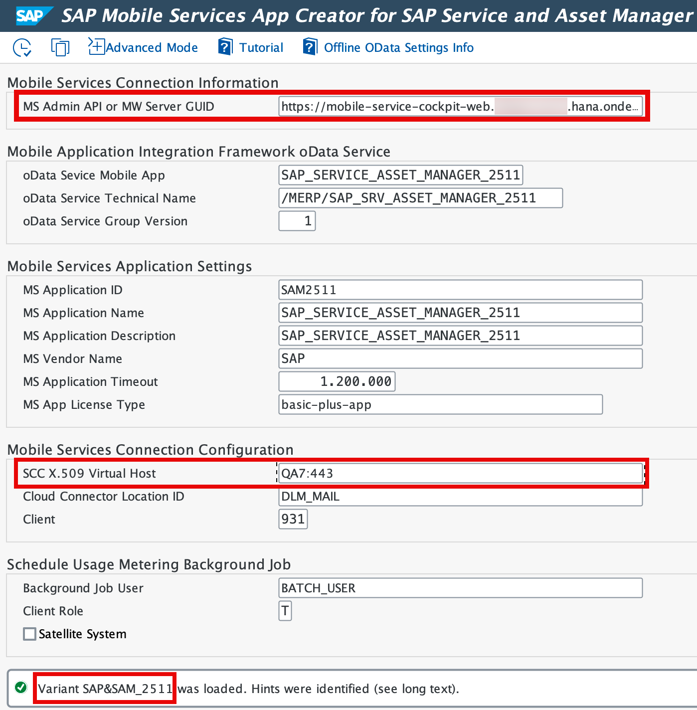

    | Parameter | What's the use? |
    | :-------- | :-------------- |
    | **MS Admin API or MW Server GUID** | Used to establish a connection from the SAP Backend to the SAP Mobile Services service. |
    | **OData Service Mobile App** | Used to generate the mobile app's offline configuration sent to the SAP Mobile Services **Mobile Offline Access** feature. |
    | **OData Service Technical Name** | Used to generate the mobile app's offline configuration sent to the SAP Mobile Services **Mobile Offline Access** feature. |
    | **OData Service Group Version** | Used to generate the mobile app's offline configuration sent to the SAP Mobile Services **Mobile Offline Access** feature. |
    | **MS Application ID** | The unique application identifier given to the SAP Mobile Services App. |
    | **MS Application Name** | The application name given to the SAP Mobile Services App. |
    | **MS Application Description** | The application description given to the SAP Mobile Services App. |
    | **MS Vendor Name** | The vendor name given to the SAP Mobile Services App. |
    | **MS Application Timeout** | The maximum time in milliseconds before a client connection times out in your environment. After that timeout period, the connection is closed. |
    | **MS App License Type** | The Service Plan used by Mobile Services. The plan `basic-plus-app` is recommended for SAP mobile applications. |
    | **SCC X.509 Virtual Host** | Used to generate the URL for the Mobile Services Mobile Destinations. |
    | **Cloud Connector Location ID** | Used to set **Cloud Connector Location Id** for the Mobile Services Mobile Destinations. |
    | **Client** | Used to set `sap-client` header for Mobile Services Mobile Destinations. Defaulted to current System Client. |
    | **Background Job User** | Used to schedule the Usage Metering background job with a daily frequency. If no user is provided, then the user executing the transaction is used. Please ensure the **Background Job User** will maintain authorization to run the background job. |
    | **Client Role** | Used by the Metrics report to determine user counts (i.e., 0 user counts sent for non-productive systems). Defaulted to System Client Role defined in transaction SCC4. Stored in MAIF Product Table. |
    | **Satellite System** | Satellite Systems can be setup to avoid duplicate User Counts when multiple Production Systems are in use. Metrics from a Satellite Sytem will be retrieved via the Metrics Report executed in the Host System ensuring duplicate SAP Users are only counted once. See Step 6 to set up Satellite Systems. |
   
    >**WARNING:** Any change that may affect the offline configuration (e.g., a new entity type is added to your mobile app configuration, or the **Defer Batch Response** setting is changed for the **OData Service Technical Name** provided when generating the offline configuration) will require you to update the offline configuration in Mobile Services and reset your mobile app. See Step 2.5 to update.

3. If you are not using a Middleware Server with a RFC Destination with Basic Authentication enabled, then you should receive a sign-in prompt after executing the transaction. Please use your SAP BTP username and password to sign in.

    >Please allow ~5 minutes to complete processing.

4. Your app should now be available in the **Native/MDK** section of the SAP Mobile Services service in your SAP BTP subaccount. Please take note of the **Mobile Services App ID**, **Middleware Server** and **Background Job** name in the output.

    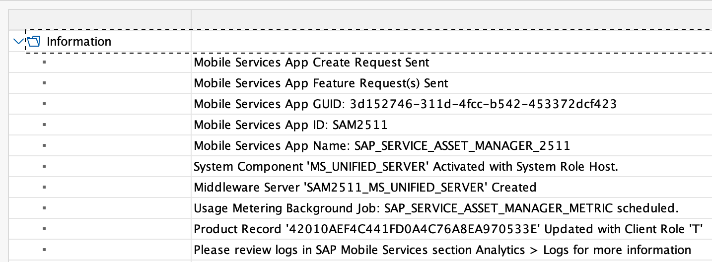

5. The Mobile Services App can be updated by re-executing the transaction and selecting the features to update when prompted. See additional info for each option below.

    | Feature | What is Updated? |
    | :------ | :--------------- |
    | **Update Mobile Offline Access** | Updates the offline configuration of your app. |
    | **Update Usage Metering** | Creates Usage Metering Middleware Server and Background Job. Existing Middleware Server and Background Job are deleted. Updates Client Role in Product Table. Updates MS_UNIFIED_SERVER system component. |
    | **Compare Offline Configuration** | Compare offline configuration properties, request groups and request download phases between the backend and the Mobile Services App. |
    | **Update Mobile Connectivity** | Updates the offline and online destination settings of your app. |
    | **Add Mobile App Update** | Assigns the feature to your app if not already assigned. |
    | **Update Mobile Push Notification** | Updates the Predefined Global Push Configuration to **SAP ASSET MANAGER**. |
    | **Add Mobile App Catalog** | Assigns the feature to your app if not already assigned. |
    | **Add Mobile Cloud Build** | Assigns the feature to your app if not already assigned. |
    | **Add Mobile Client Log Upload** | Assigns the feature to your app if not already assigned. |

### Review a SAP Service and Asset Manager Mobile Services App with Metrics

1. In the **Native/MDK** section of the SAP Mobile Services service in your SAP BTP subaccount you should see your app in a **Started State** with the **MS Application ID** you provided in Step 2.2.

    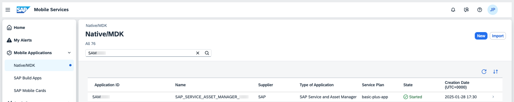

2. Select your app to see the **Assigned Features**. The following features should be assigned to your app:

    - **Connectivity**
    - **App Catalog**
    - **App Update**
    - **Client Log Upload**
    - **Cloud Build**
    - **Offline Access**
    - **Push Notification**

3. From your app's overview screen, select the **Connectivity** feature. You should see two Mobile Destinations created with the properties below. The `sap-client` header should be automatically added to the destinations **Custom Headers** section. Under the **Actions** column, selecting the **Launch in Browser** icon should return the metadata. 

    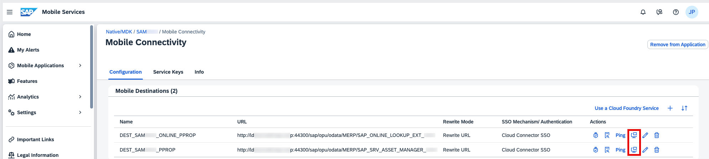

    | Destination Name | Destination URL |
    | :--------------- | :-------------- |
    | `DEST_SAM<version>_PPROP` | **`http://<host>:<port>/sap/opu/odata/MERP/SAP_SRV_ASSET_MANAGER_<version>`** |
    | `DEST_SAM<version>_ONLINE_PPROP` | **`http://<host>:<port>/sap/opu/odata/MERP/SAP_ONLINE_LOOKUP_EXT_<version>`** |

    **Custom Headers**

    | Header Name | Header Value |
    | :-----------| :----------- |
    | `sap-client` | Your client (i.e., **`800`**) |

4. From your app's **Mobile Connectivity** feature, select the **Service Keys** tab. You should see a Service Key with the properties below. The Key should be automatically maintained as the `X-API-Key` property in the Additional Properties of the Usage Metering Middleware Server which we will review in Step 3.8.

    | Field Name | Value |
    | :--------- | :---- |
    | Alias | **`<system><client>`** (i.e., **`PRD001`**) |
    | Roles | **`sap_application_metering`** |
    | Type | **`API Key`** |

5. From your app's overview screen, if you select the **Offline Access** feature you should be able to display and edit the offline configuration. If the offline configuration is missing, then please see Step 8.

6. From your app's overview screen, select the **APIs** tab to view the onboarding QR code which you can scan from the SAP Service and Asset Manager mobile app.

7. We will now check the Usage Metering Middleware Server. Execute transaction **/SYCLO/ADMIN** from the SAP GUI to open up the MAIF Admin Panel. Navigate to **Administration** > **Server Management**. Select the Middleware Server with the name noted in Step 2.4. If the Usage Metering Middleware Server is missing then please see Step 8.

    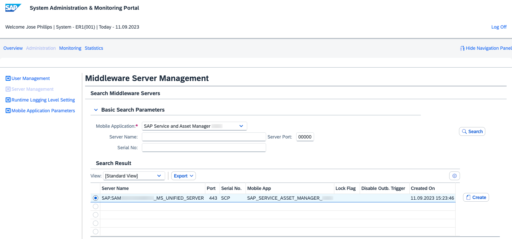

8. Verify that the Middleware Server has the following **Basic Info** and **Additional Properties**. If the Middleware Server's **Basic Info** or **Additional Properties** are not as expected then please see Step 9.

    **Basic Info**

    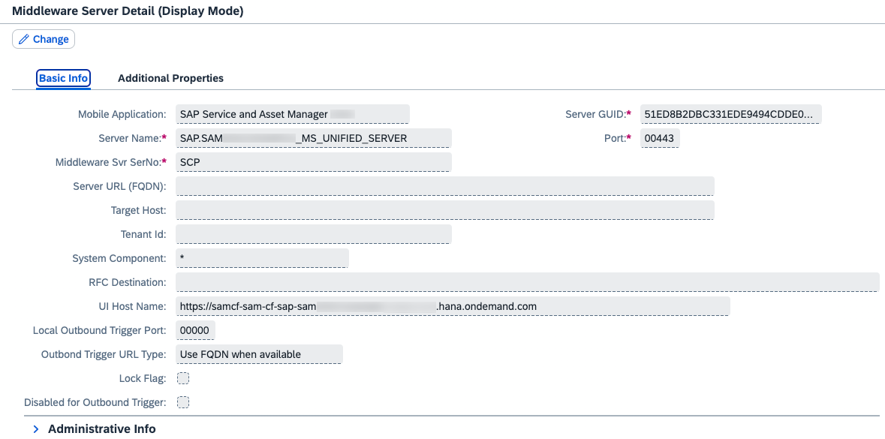

    | Field Name | Value |
    | :--------- | ----- |
    | Mobile Application | **`<mobile_app>`** |
    | Server Name | **`<ms_app_id>_MS_UNIFIED_SERVER`** |
    | `Middleware Svr SerNo` | **`SCP`** |
    | Server GUID | **`<autogenerated_guid>`** |
    | Port | **`00443`** |
    | UI Host Name | **`https://example.cfapps.sap.hana.ondemand.com`** |

    **Additional Properties**

    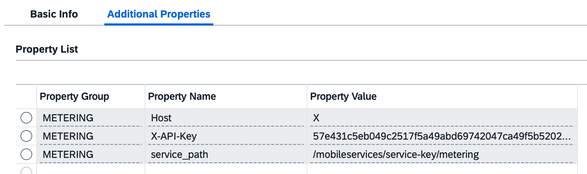

    | Property Group | Property Name | Property Value |
    | :------------- | :------------ | :------------- |
    | **`METERING`** | **`Host`** | **`X`** |
    | **`METERING`** | **`X-API-Key`** | **`<autogenerated_key>`** |
    | **`METERING`** | **`service_path`** | **`/mobileservices/service-key/metering`** |

9. To verify that the Usage Metering Background Job is scheduled, please execute transaction **SM37** from the SAP GUI and search for the job name noted in Step 2.4. If the background job is missing, then please see Step 10.

    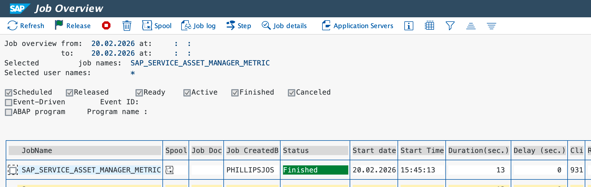

10. Execute transaction **/SYCLO/CONFIGPANEL** from the SAP GUI to open up the MAIF Configuration Panel. Navigate to **Mobile Application Configuration** > **System Components**. You should see a system component with the properties below.

    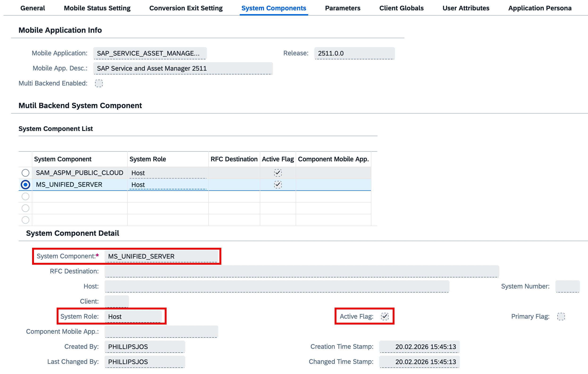

    | Field Name | Value |
    | :--------- | :---- |
    | System Component | **`MS_UNIFIED_SERVER`** |
    | System Role | **`Host`** |
    | Active Flag | Selected |

11. To ensure the Metrics Requests are sent successfully execute transaction **SE38** and execute program **`/MFND/CORE_CLOUD_METRICS_PROG`**. Provide `SAP_SERVICE_ASSET_MANAGER` in `Product Technical Name` and execute.

    **Selection Screen**
    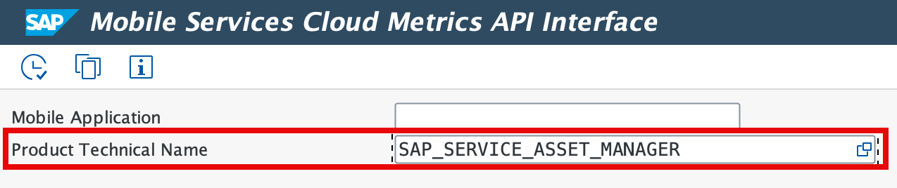

    **Successful Output**
    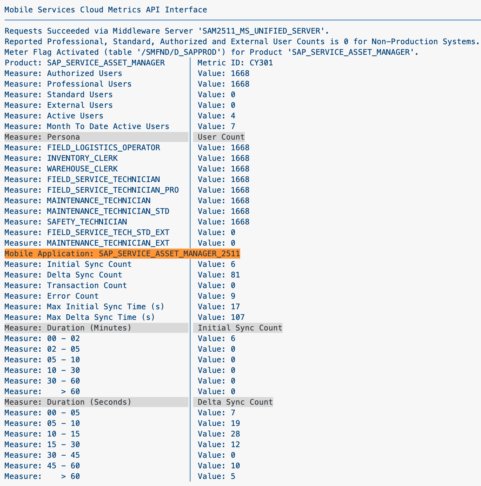

    | Output | Explanation |
    | :----- | :---------- |
    | **Authorized Users** | Total of Professional and Standard Users. |
    | **Professional Users** | Users having authorization for a Persona with Usage Type Advanced User. |
    | **Standard Users** | Users having authorization for a Persona with Usage Type Standard User. |
    | **External Users** | Users having authorization for a Persona with Usage Type External User. |
    | **Active Users** | Unique users who have completed a sync in the previous day. |
    | **Month to Date Active Users** | Unique users who have completed a sync in the previous 30 days. |
    | **Persona** | Users having authorization for the Persona. |
    | **Mobile Application** | Sync Info for the previous day. |

    >Persona Authorization configuration can be found in the MAIF Configuration Panel. Execute transaction **/SYCLO/CONFIGPANEL** from the SAP GUI to open up the MAIF Configuration Panel and navigate to **Mobile Application Configuration** > **Application Persona**.

### Optional Feature 1 - Use a RFC Destination (Middleware Server) to Create the Mobile Services App

1. Execute transaction **SM59** from the SAP GUI. Then click the create icon.

2. Provide the destination name **`Z_MS_ADMIN_API`** and set **Connection Type** to **`G HTTP Connection to External Server`**.

3. Provide the Target System Settings. The **Target Host** and **Path Prefix** are derived from the **Admin API** retrieved in Step 1.1. Please ensure you append **`/app`** to the Path Prefix as in the example below.

    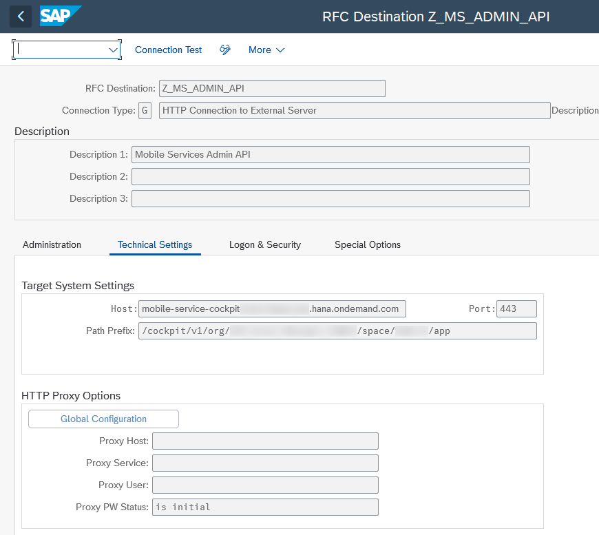

    **Admin API:** `https://mobile-service-cockpit-example.sap.hana.ondemand.com/cockpit/v1/org/ExampleOrg/space/ExampleSpace`

    | Field Name | Value |
    | :--------- | :---- |
    | Target Host | **`mobile-service-cockpit-example.sap.hana.ondemand.com`** |
    | Service No.(Port) | **`443`** |
    | Path Prefix | **`/cockpit/v1/org/ExampleOrg/space/ExampleSpace/app`** |

    >**HTTP Proxy Options** are available in the RFC Destination Technical Settings if required.
 
4. In the **Logon & Security** tab, within the **Security Options** > **Status of Secure Protocol** section, of your RFC destination please set the **SSL** radio button to **Active**.
 
    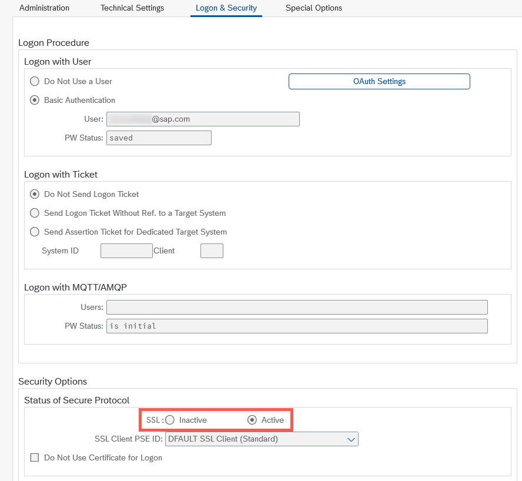

    >Enabling **Basic Authentication** is optional. Using **Basic Authentication** will skip the sign-in prompt in Step 2.3. If you choose to enable **Basic Authentication**, then please provide your SAP BTP credentials as the **User** and **Password**.

5. Save the RFC Destination.

6. We will now create the Middleware Server with the RFC Destination created. To create the Middleware Server, execute transaction **/SYCLO/ADMIN** from the SAP GUI to open up the MAIF Admin Panel.

7. Navigate to the **Administration** > **Server Management** section. 

8. Click **Create** to create a new Middleware Server.
 
9. Please fill out the **Basic Info** below and click **Save**.

    **Basic Info**

    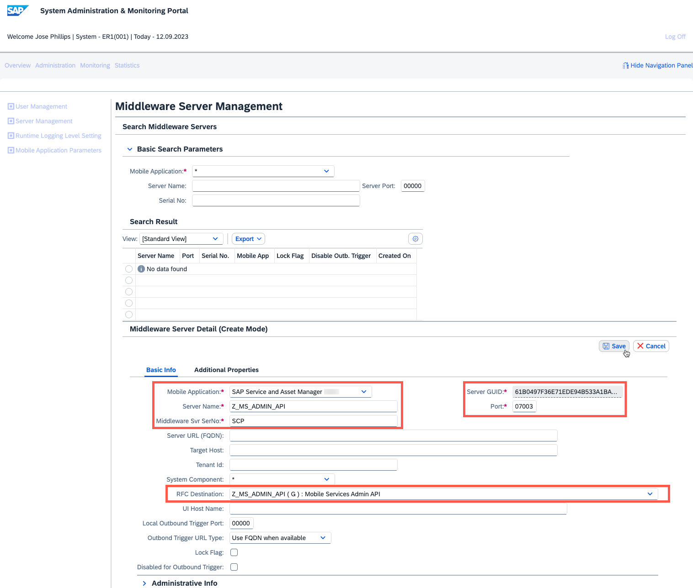

    | Field Name | Value |
    | :--------- | :---- |
    | Mobile Application | **`<mobile_app>`** |
    | Server Name | **`Z_MS_ADMIN_API`** |
    | Server GUID | **`<autogenerated_guid>`** |
    | Port | **`07003`** |
    | `Middleware Svr SerNo` | **`SCP`** |
    | RFC Destination | **`Z_MS_ADMIN_API`** |

10. You may now use the generated **Server GUID** instead of the **Admin API** in Step 2.2 . You may use F4 Help on the **Admin API or Middleware Server GUID** field to search for the created Middleware Server.

    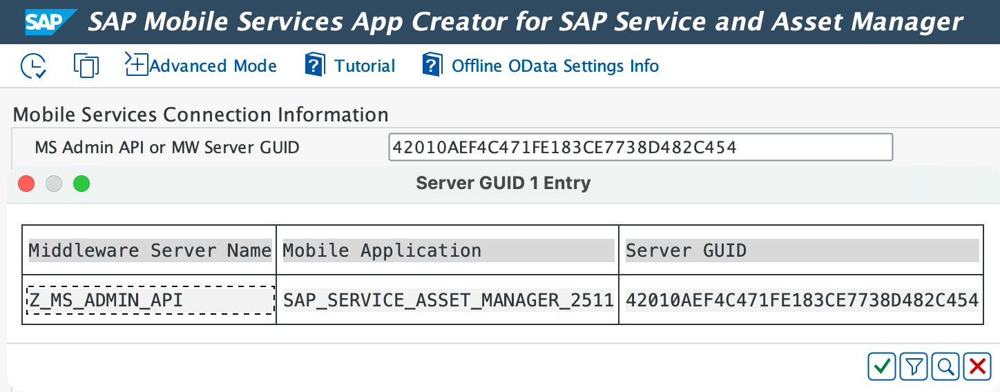

### Optional Feature 2 - Use a RFC Destination to send Metrics to Cloud Reporting

1. Copy the **URL** of the **Server API**. from the APIs tab of your Mobile Services App.

    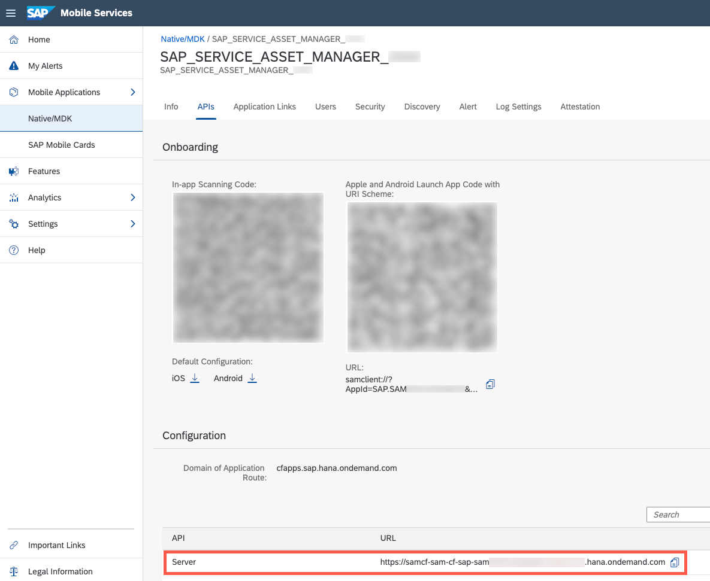

2. Execute transaction **SM59** from the SAP GUI. Then click the create icon.

3. Provide the destination name **`Z_SAM<version>_METERING`** and set **Connection Type** to **`G HTTP Connection to External Server`** (substituting `<version>` with your app version). 

4. Provide the copied URL without `https://` in **Host** field of the Target System Settings. Use the **Port** and **Path Prefix** as in the example below.

    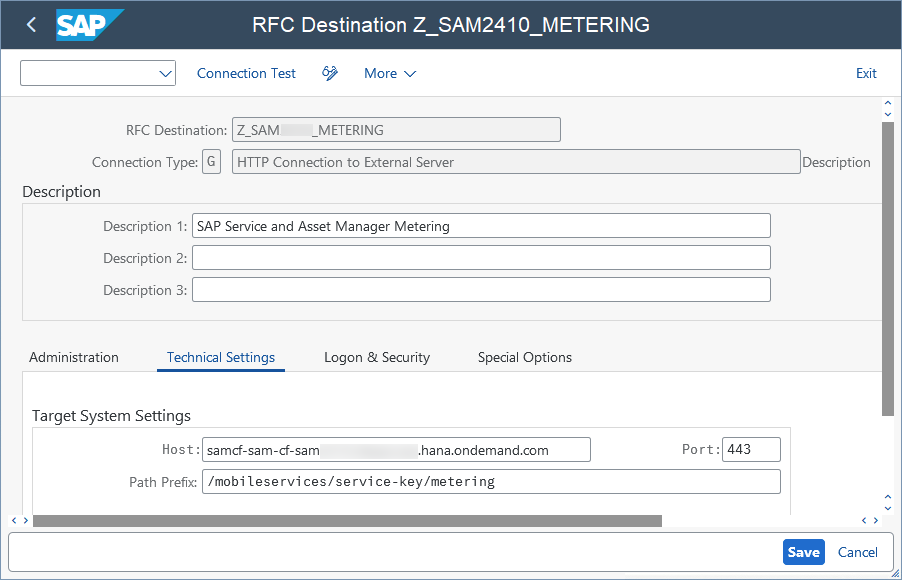

    | Field Name | Value |
    | :--------- | :---- |
    | Target Host | **`samcf-sam-cf-sam.example.hana.ondemand.com`** |
    | Service No.(Port) | **`443`** |
    | Path Prefix | **`/mobileservices/service-key/metering`** |
 
5. In the **Logon & Security** tab, within the **Security Options** > **Status of Secure Protocol** section, of your RFC destination please set the **SSL** radio button to **Active**.
 
    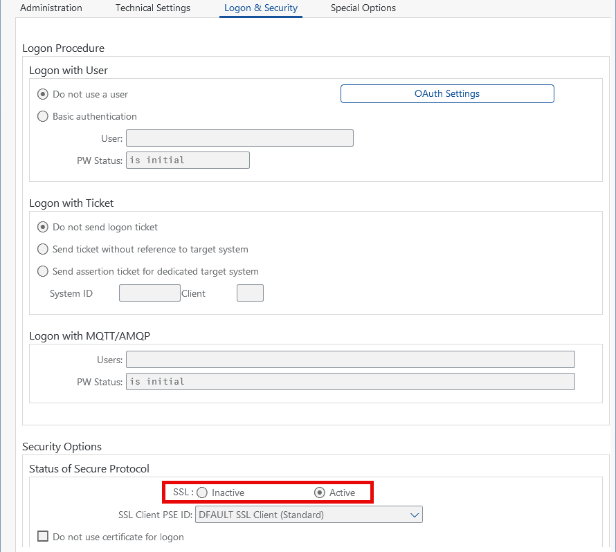

6. Save the RFC Destination.

7. We will now update the Usage Metering Middleware Server with the RFC Destination created. To update the Middleware Server, execute transaction **/SYCLO/ADMIN** from the SAP GUI to open up the MAIF Admin Panel.

8. Navigate to the **Administration** > **Server Management** section. 

9. Select the Middleware Server with the name noted in Step 2.4. If the Usage Metering Middleware Server is missing then please see Step 9.
 
10. Update the **RFC Destination** and click **Save**.

    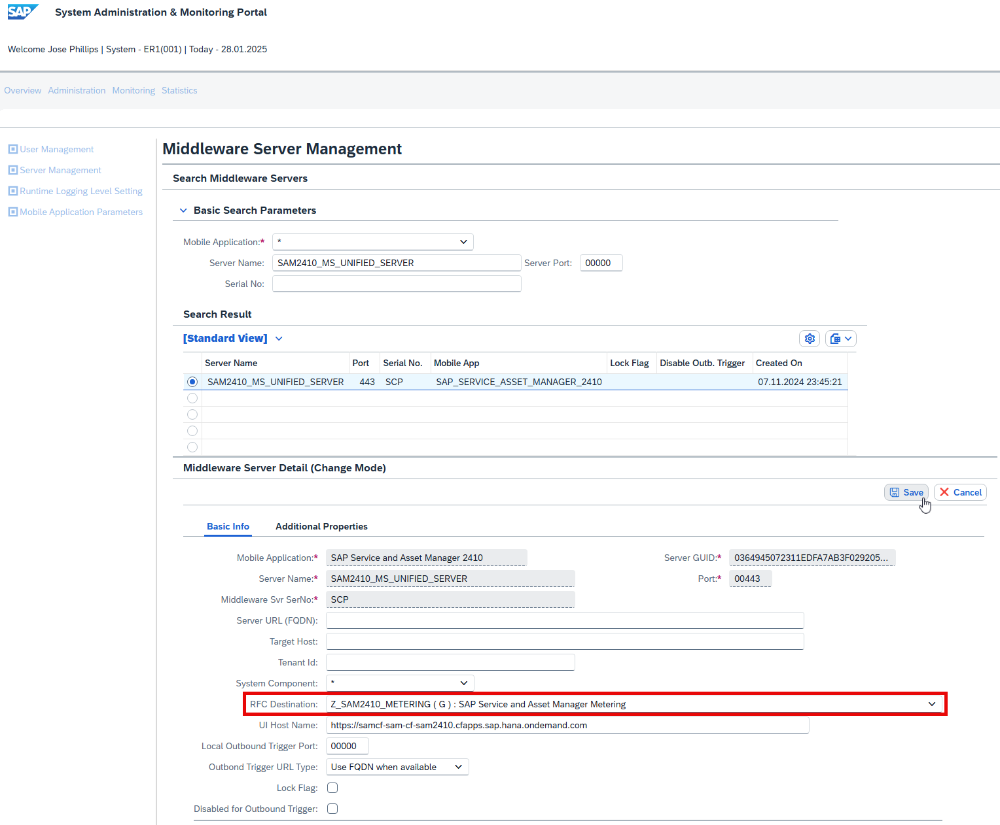

### Optional Feature 3 - Set up Satellite Systems
    
1. Please ensure app has been created and reviewed (Steps 2 and 3) in the Host System.

2. Follow Steps 1 to 2.2 then return to this Step before executing. Check the `Satellite System` checkbox. Provide the `Host RFC Destination` (recommended) to create the Satellite Middleware Server in the Host System that will be used to retrieve the Metrics from the Satellite System. If you do not provide the `Host RFC Destination` please ensure you manually create the Satellite Middleware Server in the Host System (see Step 6.5). Execute the transaction. If you are updating an existing app please select **Update Usage Metering** feature when prompted.

    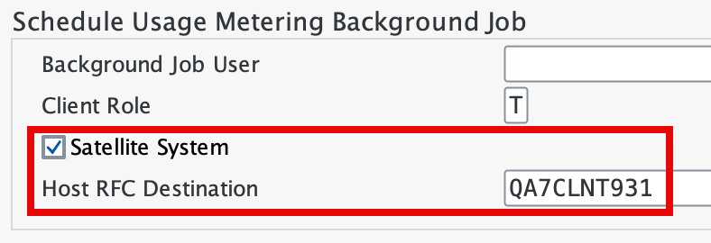

3. Please take note of the **Middleware Server** created on the Host System via RFC.

    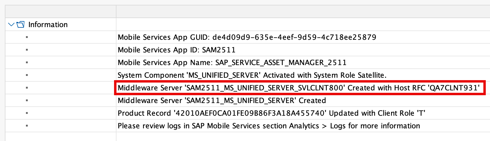

4. In the Host System execute transaction **/SYCLO/ADMIN** from the SAP GUI to open up the MAIF Admin Panel. Navigate to the **Administration** > **Server Management** section.

5. Select Middleware Server noted above. Create Satellite Middleware Server if not created automatically via RFC in the previous step. Edit the Middleware Server and provide a RFC Destination to the Satellite System. Ensure the RFC authentication is automatic.
    
    **Basic Info**
    
    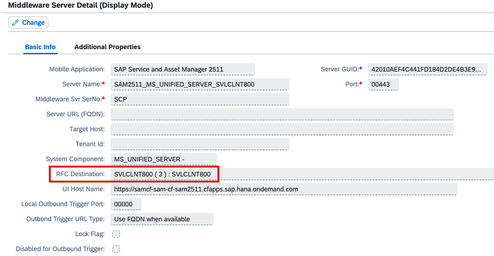

    | Field Name | Value |
    | :--------- | ----- |
    | Mobile Application | **`<mobile_app>`** |
    | Server Name | **`<ms_app_id>_MS_UNIFIED_SERVER_<sat_sys_id>CLNT<sat_client>`** |
    | System Component | **`MS_UNIFIED_SERVER`** |
    | `Middleware Svr SerNo` | **`SCP`** |
    | Server GUID | **`<autogenerated_guid>`** |
    | Port | **`00443`** |
    | UI Host Name | No Value Required |
    | RFC Destination | Provide a RFC Destination to the Satellite System |

    **Additional Properties** (case sensitive)

    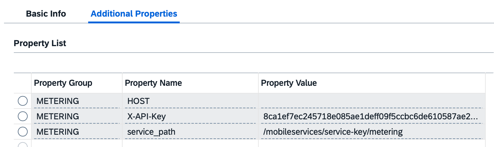

    | Property Group | Property Name | Property Value |
    | :------------- | :------------ | :------------- |
    | **`METERING`** | **`Host`** | No Value |
    | **`METERING`** | **`X-API-Key`** | No Value Required |
    | **`METERING`** | **`service_path`** | No Value Required |

    >Ensure all properties exist even with no values.

6. To ensure the Satellite Metrics are retrieved successfully execute transaction **SE38** and execute program **`/MFND/CORE_CLOUD_METRICS_PROG`** in the Host System. Provide `SAP_SERVICE_ASSET_MANAGER` in `Product Technical Name` and execute.

    **Successful Output**
    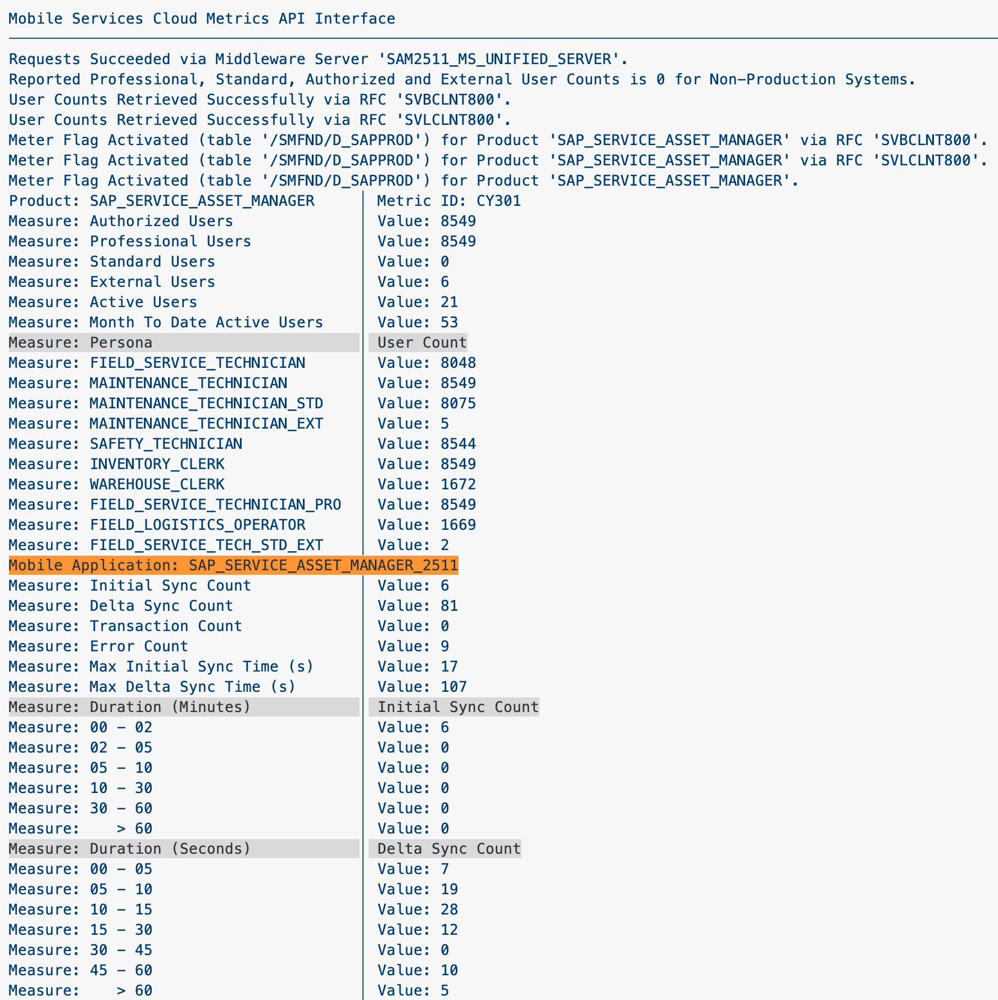

### Optional Feature 4 - Enable Multiple Threads in Offline Configuration
    
1. Follow Step 2.1 and 2.2 then return to this Step before executing. Then click **Advanced Mode**.

2. Under the **Mobile Services Offline OData Settings** section, check the `Calculate oMDO Download Phases` and `Enable Multiple Threads` options. Then, set `Number of Threads` to `3`. 

3. If your app already exists and you are updating your app, select the option **Update Mobile Offline Access** when prompted. 

4. Alternately, you may generate the offline configuration using the offline configuration program **`/MERP/CORE_OFFLINE_CONFIG_PROG`**. The generated file can then be uploaded in the SAP Mobile Services **Mobile Offline Access** feature of your app.

5. Execute the program **`/MERP/CORE_OFFLINE_CONFIG_PROG`** in transaction **SE38** from the SAP GUI, then select your required variant. 

6. Select the `Advanced Offline Configuration` radio button. Check the `Calculate oMDO Download Phases` and `Enable Multiple Threads` options. Then, set `Number of Threads` to `3`. Execute the transaction.

    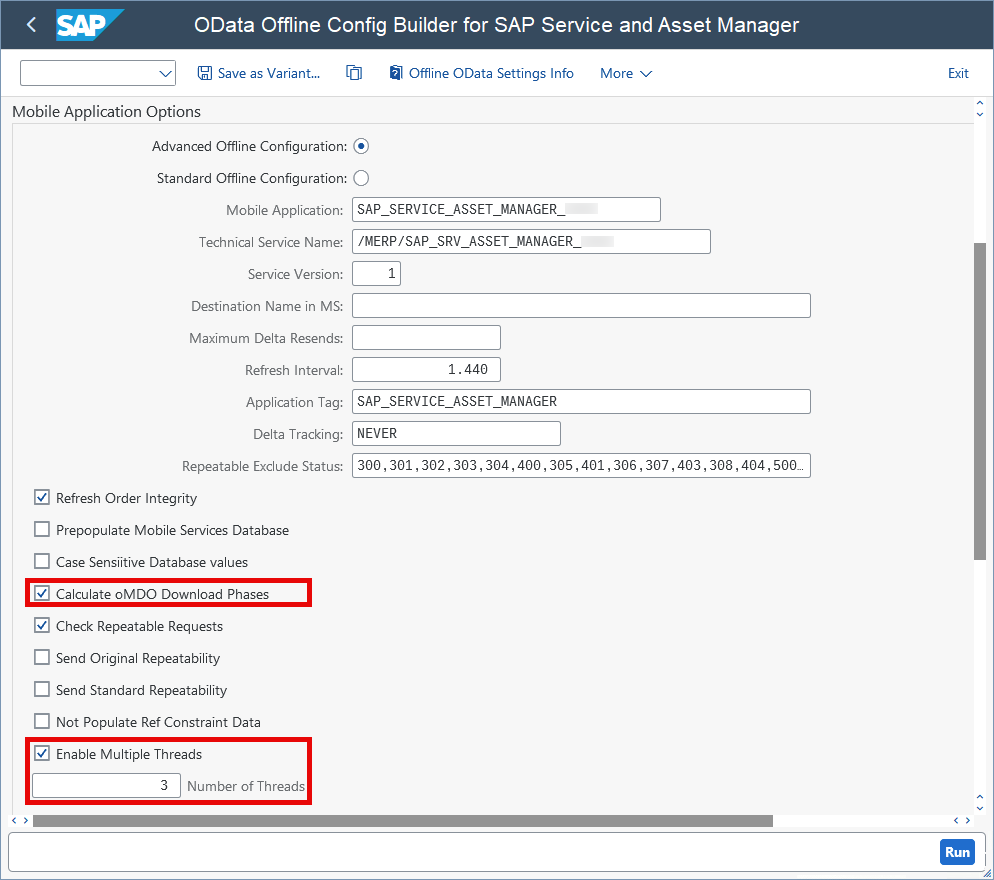

7. Please ensure to save the generated file with a `.ini` file extension.

8. Import the file in the **Mobile Offline Access** feature of your app.

    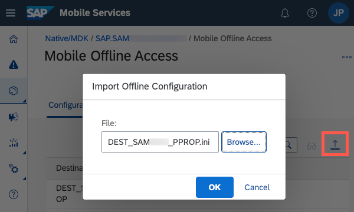

### Troubleshoot 1 - Missing Offline Configuration

1. Follow Step 2.5 and select the option **Update Mobile Offline Access** when prompted. The offline configuration will be regenerated and sent to SAP Mobile Services.

2. Alternately, you may generate the offline configuration using the offline configuration program **`/MERP/CORE_OFFLINE_CONFIG_PROG`**. The generated file can then be uploaded in the SAP Mobile Services **Mobile Offline Access** feature of your app.

3. Execute the program **`/MERP/CORE_OFFLINE_CONFIG_PROG`** in transaction **SE38** from the SAP GUI, then select your required variant. Then execute the transaction.

    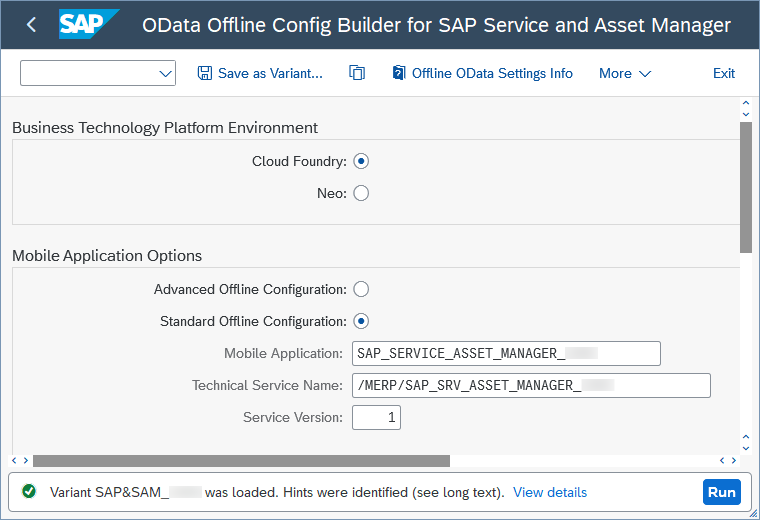

4. Please ensure to save the generated file with a `.ini` file extension.

5. Import the file in the **Mobile Offline Access** feature of your app.

    

### Troubleshoot 2 - Usage Metering Middleware Server Missing and/or Properties Missing

1. Follow Step 2.5 and select **Update Usage Metering** feature when prompted.

2. Alternately, you may create the Usage Metering Middleware Server manually. Execute transaction **/SYCLO/ADMIN** from the SAP GUI to open up the MAIF Admin Panel. 

3. Navigate to the **Administration** > **Server Management** section.

4. Click **Create** to create a new Middleware Server.
 
5. Please fill out the **Basic Info**  and **Additional Properties** below and click **Save**.

    **Basic Info**
    
    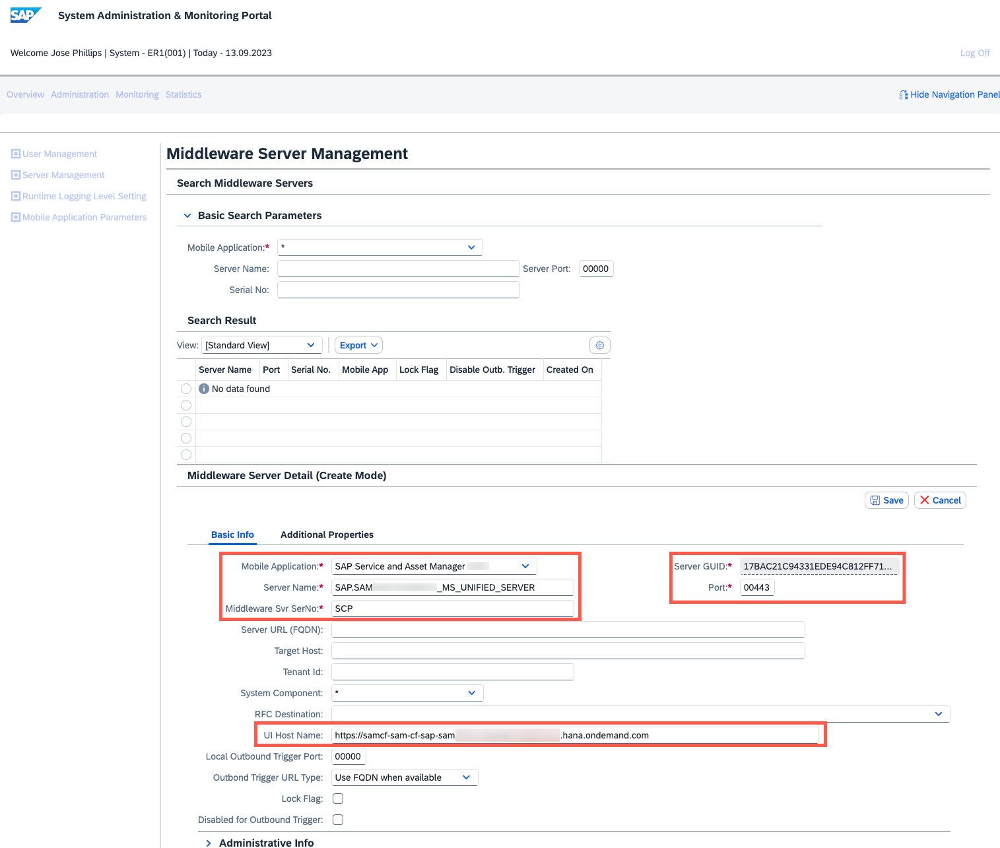

    | Field Name | Value |
    | :--------- | ----- |
    | Mobile Application | **`<mobile_app>`** |
    | Server Name | **`<ms_app_id>_MS_UNIFIED_SERVER`** |
    | `Middleware Svr SerNo` | **`SCP`** |
    | Server GUID | **`<autogenerated_guid>`** |
    | Port | **`00443`** |
    | UI Host Name | **`https://example.cfapps.sap.hana.ondemand.com`** |

    >The **UI Host Name** can be found in the **APIs** tab of your Mobile Services App. Copy the **URL** of the **Server API**.
    >
    >
&nbsp;

    **Additional Properties** (case sensitive)

    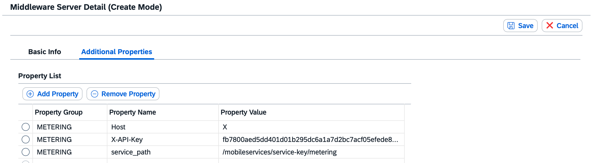

    | Property Group | Property Name | Property Value |
    | :------------- | :------------ | :------------- |
    | **`METERING`** | **`Host`** | **`X`** |
    | **`METERING`** | **`X-API-Key`** | **`<autogenerated_key>`** |
    | **`METERING`** | **`service_path`** | **`/mobileservices/service-key/metering`** |

    >To generate **X-API-Key** go to the **Mobile Connectivity** feature of your Mobile Services App and select the **Service Keys** tab. Click the add icon "**+**" to add a Service Key with the following values and copy the generated key.
    >
    >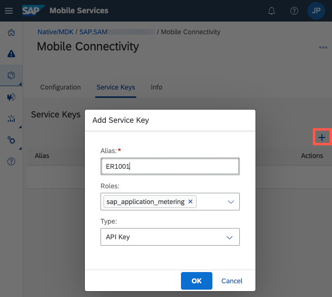
    >
    >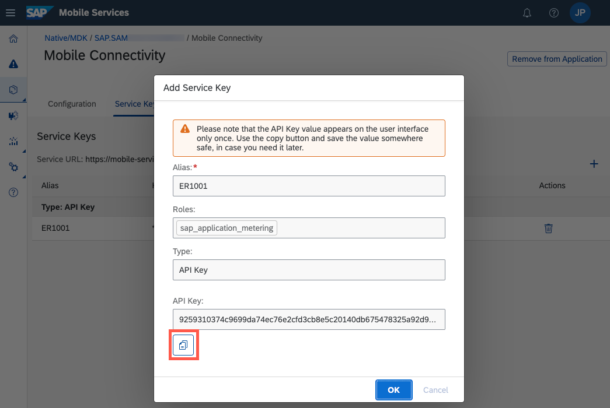
&nbsp;

    
    **Service Key Values**

    | Field Name | Value |
    | :--------- | :---- |
    | Alias | Any Alias is okay (i.e., **`PR1001`**) |
    | Roles | **`sap_application_metering`** |
    | Type | **`API Key`** |

### Troubleshoot 3 - Usage Metering Background Job Missing.

1. Follow Step 2.5 and select **Update Usage Metering** feature when prompted. If the background job is still missing, you may try the next steps.

2. Execute the program **`/MFND/CORE_CLOUD_METRICS_PROG`** in transaction **SE38** from the SAP GUI.

3. In the selection screen provide the Mobile Application. 

4. Press **F9** or select menu option **Program** > **Execute in Background**. 

5. Click **Date/Time**.

6. Provide the **Schedule Start Date** and **Time**.

7. Set the **Period Values** to **Daily**, then click **Save**.

    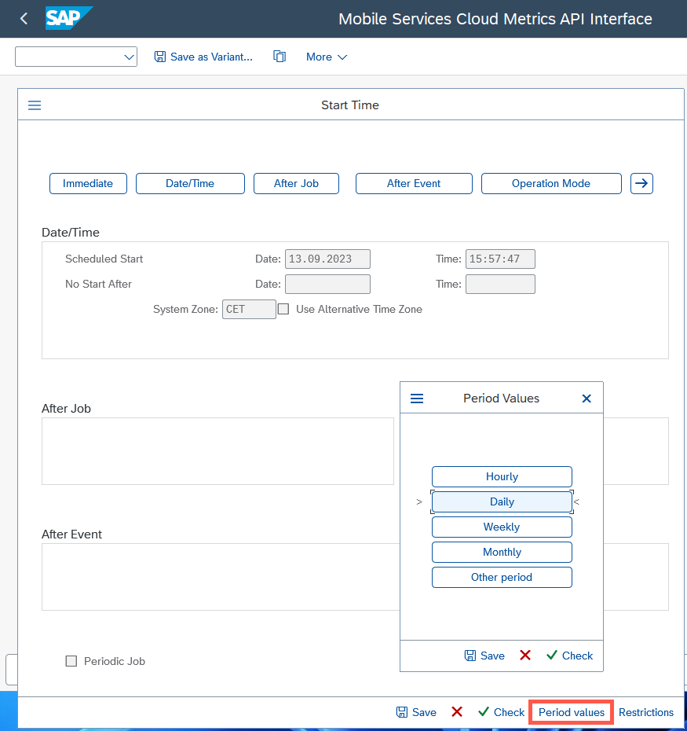
