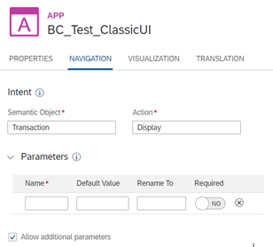
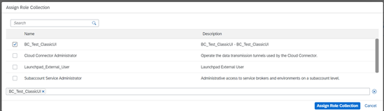

# Launch SAP GUI for Windows Applications in the Cloud with SAP Business Client
<!-- description --> The tutorial shows you how to run SAP Build Work Zone inside SAP Business Client. Here you can mix  SAP GUI for Windows transactions with state-of-the-art web applications.

## You will learn
- the definition of SAP Build Work Zone
- the prerequisites for the integration of SAP Build Work Zone
- the difference between direct and tunneled Access
- to run a cloud launchpad within SAP Business Client in 3 steps

## Prerequisites
- You have installed SAP Business Client 7.70. SAP ONE Support Launchpad ([SAP ONE Support Launchpad](https://launchpad.support.sap.com/#/softwarecenter/template/products/%20_APP=00200682500000001943&_EVENT=DISPHIER&HEADER=Y&FUNCTIONBAR=N&EVENT=TREE&NE=NAVIGATE&ENR=73554900100200012051&V=MAINT&TA=ACTUAL&PAGE=SEARCH/SAP%20BUSINESS%20CLIENT%207.70))
- You have created a **trial account on SAP BTP (Business Technology Platform)**:  [Get a Free Account on SAP BTP Trial](hcp-create-trial-account)
- You are subscribed to the SAP Build Work Zone including the Launchpad Admin role: see the following tutorial [Deliver Your First SAP Fiori Launchpad Site] (mission.cp-starter-digitalexp-portal)


## Additional Information:

**SAP Build Work Zone**
SAP Build Work Zone enables organizations to establish a central point of access to SAP, custom-built, and third-party applications, and extensions, both on the cloud and on premise.

With SAP Build Work Zone you can only use Web GUI however. SAP GUI for Windows cannot be launched.

Using the SAP Build Work Zone together with SAP Business Client SAP GUI for Windows applications can be launched from your connected on-premise system.

[SAP Build Work Zone (formerly known as SAP Launchpad Service, central launchpad running on SAP BTP, cloud foundry environment on BTP)](https://help.sap.com/docs/Launchpad_Service/8c8e1958338140699bd4811b37b82ece/fd79b232967545569d1ae4d8f691016b.html?locale=en-US)

**Direct Access and Tunneled Access**

Direct access is only possible within the corporate network (or via VPN).

Tunneled Access is possible from the corporate network or from the Internet (for which you need the Cloud Connector). The Cloud Connector is http/https based. The DIAG protocol of SAP GUI for Windows cannot be used. Therefore direct access is used here.

**Procedure**
The following steps will show you how to launch SAP GUI for Windows applications directly from the 'FLP@BTP'. As an example, we like to create an app/tile to open an SAP GUI for Windows transaction. The transaction is stored in a remote system (here U1Y*). To connect, you must create a http destination to this system (step 1 below).

>In general, there are two ways of integrating content into the
SAP Build Work Zone: Manual Integration of Business Content, and integration of content from remote content providers. In this blog, we demonstrate the manual integration of apps. Administrators who need to integrate hundreds of roles will use the federation approach, described at the end of this blog.


### Create runtime destinations to access apps
To launch apps in the SAP Build Work Zone the service must know where the content/apps are located. It is therefore necessary to create a destination to tell the BTP where your app is running.

1. Log on to the BTP cockpit and open the Destination editor (subaccount=>Overview=> Connectivity=>Destinations)


2. Choose **New Destination** and enter the name, type, description (optional), and URL as shown in the screenshot below. You can copy the URL from the landscape file or directly from Business Client (system selector, right click).

```
 https://<server>.<domain>.<ext>:<port>.

```


   

 3. Configure destinations and add additional properties as shown in the screenshot below.
 For example:
-	**`sap-login-group`**

-	**`message server`**

-	**`instance number`**

- **`sap-snc-name`**

You can copy that information from SAP Logon.


   

[Link to documentation on SAP Help Portal: Create Runtime Destinations to Access Apps](https://help.sap.com/viewer/8c8e1958338140699bd4811b37b82ece/Cloud/en-US/a57c27ce348241a89d56874bef9a7a07.html)


### Make your apps visible in the launchpad
In this step you will:

- Open the site manager
- Create and configure your app.
- Create a group and assign your app to it
- Create a catalog and assign your app to it
- Create a role and assign your app to it
- Assign your role to your app

1. Open your Site Manager in your BTP cockpit or directly via the FLP Menu (upper right corner => your profile=> Manage Site)
  

2. In the Site Manager, choose **+New** to add and create your app (in this example an SAP GUI for Windows transaction, SE80).
   

3. Select your system. The system names in the list reflect the destinations defined in the SAP BTP cockpit. Choose your destination.
  

4. Choose your App UI Technology. You have to choose SAP GUI for HTML (see documentation below) [Configure Apps for Your Subaccount](https://help.sap.com/viewer/8c8e1958338140699bd4811b37b82ece/Cloud/en-US/4ba745b26b0e4ca494d99b94a858551d.html).

5. Switch to the tab Navigation tab and configure you intend based navigation.  

In this example, no additional parameters are needed.
Choose **Save**.

6. Create a group and assign your app to it.
  
  Choose **Save**.

7. Create a catalog and assign your app to it.
    
    Choose **Save**.

8. Create a role and assign your app to it.
        
        Choose **Save**.

9. Go to your site manager and click **Site Settings** to assign your role to your site.
                
                Choose **Save**.

10. Choose **Edit** and assign your role to the site.
  

11. Choose **Save**.

12. Go to **Site Settings** and assign your role to the launchpad site.

>In the BTP Cockpit, you have to assign this role to your BTP user.
To assign the role to your BTP user, you have to go back to the cockpit. Under Security, choose Users. Enter your e-mail address and assign the role to your user.
  

13. To check if your site is working go back to the Site Manager and click on **Go to site**.

    

### Configure your system connection within SAP Business Client

As an administrator, you can provide templates for your end users. See the following documentation for details: [SAP Build Work Zone Integration](https://help.sap.com/docs/SAP_BUSINESS_CLIENT/f526c7c14c074e7b9d18c4fd0c88c593/18a609d7b8fd471f8735f4fd81c00413.html?version=7.70.07&locale=en-US)

For our example here, copy the URL from your site into the Business Client system connection properties, as shown in the screenshot below.

  

### Test yourself
