## Details
### You will learn
 - Where OData came from and why it's designed the way it is
 - What the standard OData operations are and how they relate to HTTP
 - What the public Northwind OData service has to offer
 - What OData service documents and metadata documents describe
 - The basics of OData entity types, sets and relationships

OData is an open standard that is both a data format and a protocol for consuming and manipulating data in a uniform way. It's ISO/IEC approved and managed by the [OASIS organization](https://www.oasis-open.org/).

OData has its origins in the world of weblogs and syndication, but now serves to power a great deal of the API and integration activities in typical SAP enterprise environments. This tutorial will help you understand OData from the ground up. By looking briefly at RSS and Atom, precursors of OData in some ways, you'll understand and feel more comfortable with OData and its mechanisms.

> This tutorial is based upon OData versions 2 and 3. With the advent of OData version 4, there are some differences, but none significant enough to distract from the purpose of this particular tutorial which is to give a simple overview of OData and its origins.

---

[ACCORDION-BEGIN [Step 1: ](Examine RSS, an ancestor of OData)]

You can understand OData as being the combination of two essential parts. The first is the format, the second is the protocol. The format defines how data is described, how it is serialized. The protocol defines how that data is manipulated.

The origin of OData's format comes from the world of weblogs, blogging and syndication. The Rich Site Summary (RSS) format was defined to describe a blog and the posts available in it, typically with the newest posts first, but in XML format for machine consumption. It can also describe a set of posts collected in another context, for example all posts tagged with a certain value.

> RSS is also known as "RDF Site Summary" or "Really Simple Syndication".

Look at an example of the RSS representation of blog posts - in particular, the posts tagged **ABAP Development** with this URL:

<https://blogs.sap.com/tags/833755570260738661924709785639136/>

and select the **RSS** link as shown in the screenshot.

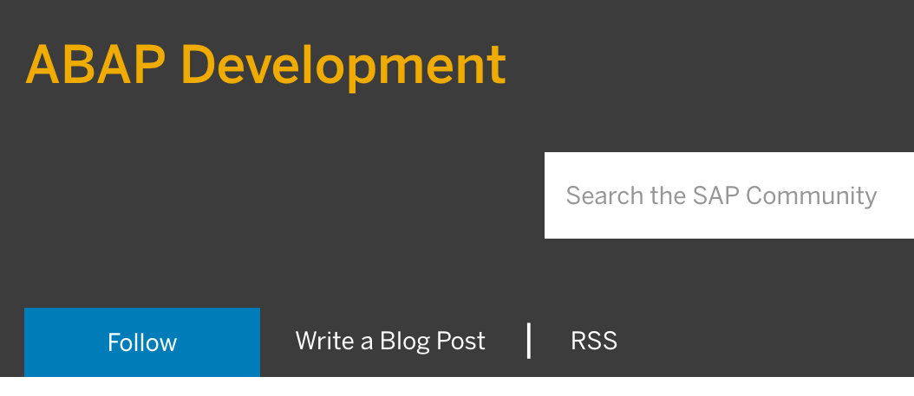


The resulting RSS content of this resource should look something like this:

```xml
<feed xmlns="http://www.w3.org/2005/Atom">
<title>Latest blog posts for ABAP Development</title>
<link rel="alternate" type="text/html" href="https://community.sap.com/"/>
<id>https://community.sap.com/</id>
<rights>© 2018 SAP SE https://www.sap.com/about/legal/copyright.html</rights>
<logo>https://www.sap.com/dam/application/shared/logos/sap-logo-svg.svg</logo>
<updated>2021-01-26T18:59:22Z</updated>
<entry>
<title>Getting Started with ABAP in 2021</title>
<link rel="alternate" href="https://blogs.sap.com/?p=1259056"/>
<category term="ABAP Development"/>
<category term="#ABAP"/>
<category term="#CDS"/>
<category term="ABAP Beginner"/>
<category term="abap beginners guide"/>
<category term="beginner guide to HANA"/>
<category term="Core Data Services (CDS)"/>
<category term="Virtual Data Model"/>
<author>
<name>Markus Haug</name>
</author>
<id>https://blogs.sap.com/?p=1259056</id>
<updated>2021-01-26T18:59:22Z</updated>
<published>2021-01-26T18:59:22Z</published>
<summary type="text">Whether you are new to ABAP or just want to learn something new this year, this blog post will give you an overview and a handful of helpful resources about all the new technologies in the ABAP cosmos. Not only the universe is expanding, but the ABAP world is also. ...</summary>
</entry>
...
</feed>
```

Observe the structure of the XML document. It describes a `feed` that has some metadata such as title, id, logo and information as to when it was last updated. That `feed` contains one or more `entry` elements, each of them representing a post in the list tagged with "ABAP Development". Think of this like a document, with a header and items.

[VALIDATE_1]

[ACCORDION-END]

[ACCORDION-BEGIN [Step 2: ](Examine Atom and the Atom Publishing Protocol)]

Atom is a format very similar to RSS, serving the same purpose, and is properly known as the [Atom Syndication Format](https://tools.ietf.org/html/rfc4287). Some may call Atom a successor to RSS. Unlike RSS, which is just a format specification, Atom also has a related protocol called the [Atom Publishing Protocol](https://tools.ietf.org/html/rfc5023) that enables the manipulation of data stored in Atom-formatted resources. This was useful for weblog authors, who could use tools that spoke the Atom Publishing Protocol to edit and publish posts to remote blogging systems.

Look at an example of the Atom format in the corresponding Wikipedia entry: <https://en.wikipedia.org/wiki/Atom_(Web_standard)> - follow the link in the "Contents" box to section 5 "Example of an Atom 1.0 feed". Notice that the general structure of the elements is the same as RSS, consisting of a root `feed` element containing `entry` child elements.

The Atom Publishing Protocol Request For Comments (RFC) document ([RFC5023](https://tools.ietf.org/html/rfc5023)) describes a series of standard operations that can be performed on entries in an Atom feed - in other words, operations on XML representations of blog posts that are in the form of XML `entry` elements. These operations are for listing multiple entries and creating, editing, retrieving & deleting individual entries, and they correspond to the standard HTTP methods (GET, POST, PUT and DELETE).

The Atom Publishing Protocol specification also details the concept of a service document that describes what collections of entries are available for a given resource. Here's an example of a service document:

```
<?xml version="1.0" encoding='utf-8'?>
<service xmlns="http://www.w3.org/2007/app"
  xmlns:atom="http://www.w3.org/2005/Atom">
  <workspace>
    <atom:title>Main Site</atom:title>
    <collection href="http://example.org/blog/main" >
      <atom:title>My Blog Entries</atom:title>
      <categories href="http://example.com/cats/forMain.cats" />
    </collection>
    <collection href="http://example.org/blog/pic" >
      <atom:title>Pictures</atom:title>
      <accept>image/png</accept>
      <accept>image/jpeg</accept>
      <accept>image/gif</accept>
    </collection>
  </workspace>
</service>
```

You will see that these fundamental building blocks of Atom are alive and well in the OData protocol today.

[VALIDATE_2]

[ACCORDION-END]

[ACCORDION-BEGIN [Step 3: ](Look at the basics of OData)]

The ideas in Atom formed the foundation of OData. OData is described in full at <https://www.odata.org/> but at a simple level, OData has:

 - a service document describing the data available in a given OData service
 - the concept of entity sets and entities, which are direct parallels of feeds and entries, respectively, in RSS and Atom
 - a basic set of operations: Create, Read, Update, Delete and Query (commonly referred to as CRUD+Q)

There is a publicly available set of OData services maintained by the OASIS organisation, which are known as the **Northwind** services because they offer a data set based on a business scenario that revolves around a company called **Northwind Traders**. This data set contains entities such as customers, products and suppliers.

Go to the OASIS OData sample service root URL <https://services.odata.org/>. You should see something like this:

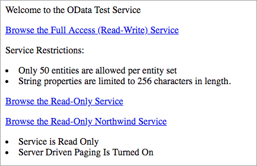

Select the link **Browse the Read-Only Northwind Service** and you will see the XML contents of this resource: <https://services.odata.org/V3/Northwind/Northwind.svc/>. This is the service document for the OData service at this location, and the start of it should look like this:


Notice how similar it is to the Atom service document, with a "service" root element and "workspace" elements containing "collection" elements that outline the types of data available. In this case you see that there are `Categories`, `CustomerDemographics`, `Customers`, `Employees` and more available in this service.

[DONE]

[ACCORDION-END]

[ACCORDION-BEGIN [Step 4: ](Look at an OData metadata document)]

In addition to the service document, an OData service also has a metadata document, a resource which describes the data in the OData service. The metadata document itself is available at a "well-known" URL, which is the service document URL with the value `$metadata` appended. For this Northwind OData service, this means that the metadata document should be available at:

<https://services.odata.org/V3/Northwind/Northwind.svc/$metadata>

Go to this URL and examine the first part of the metadata, which should look something like this:

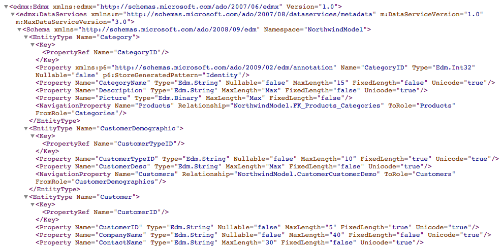

Notice that the basic structure at the start of the metadata document describes the entity types and their properties. You should see entity type definitions for the `Category` entity type, the `CustomerDemographics` entity type, and more.

You should also see that the properties within these entities are described, that some are defined as key properties, and also some are defined as navigation properties, that describe a link from one entity type to another. For example, there is a relationship between the `Category` entity type and the `Products` entity type by means of the "Products" navigation property in the definition of the `Category` entity type.

If you're interested, you can scroll through the metadata document to the `Association` definitions to find more details about this relationship identified by the ID `FK_Products_Categories`. You will find the definition of an association that looks like this:

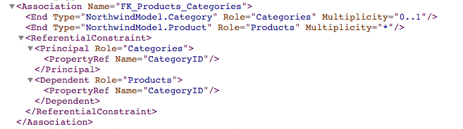

and the definition of an association set that looks like this:

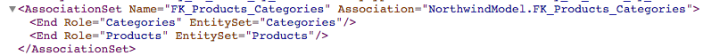

[VALIDATE_4]
[ACCORDION-END]

[ACCORDION-BEGIN [Step 5: ](View the products data in the OData service)]

In the previous step you examined entity types. These are detailed descriptions of entities available in the OData service. The entities themselves are available in so-called entity sets. The relationship between entities and entity sets with OData is the direct equivalent of the relationship between entries and feeds in RSS and Atom. In fact, you'll see that `entry` and `feed` elements live on in the OData format.

Entity sets have their own definitions in the metadata document, described by `EntitySet` elements within the `EntityContainer` element. Scroll down to find, or search for `EntityContainer`, and you will see within it a definition of all the entity sets available in this OData service. It will look something like this:

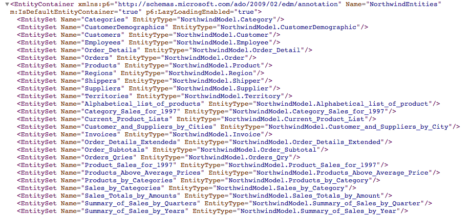

Notice there is an entity set "Products", that is a set of entities of type "Product". Search higher up in the metadata document for the entity type "Product", and examine the definition, which should look something like this:

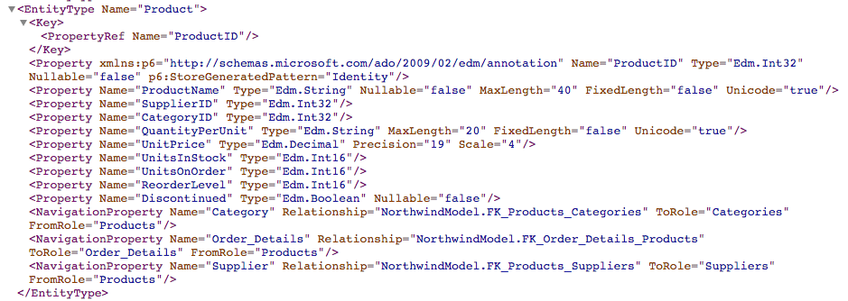

You can navigate directly to an entity set by appending its name onto the end of the service document URL. Do that now for the Products entity set, like this:

<https://services.odata.org/V3/Northwind/Northwind.svc/Products>

You will see the XML representation of the Products entity set. Unless you already have a browser feature to display XML prettily, it will look something like this:

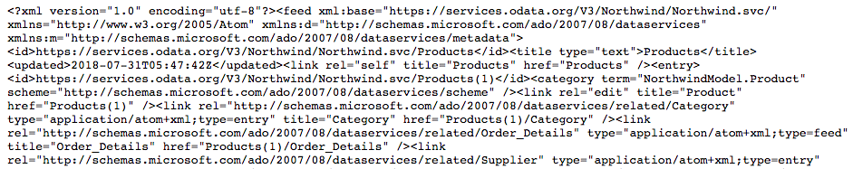

It's not easy to read like this, but you should be still able to discern, even in this rendering, features with which you're now familiar. Notice the XML `feed` element is the root element, representing a collection of things. Notice also the first `entry` element, representing the start of the first product record in this collection.

[VALIDATE_5]
[ACCORDION-END]

[ACCORDION-BEGIN [Step 6: ](Install a Chrome extension for XML rendering)]

The Chrome browser is recommended here, as it has a good choice of extensions that can make life easier. There are extensions for Chrome to render XML in a more human-friendly way. One of these extensions is [XML Tree](https://chrome.google.com/webstore/detail/xml-tree/gbammbheopgpmaagmckhpjbfgdfkpadb?hl=en). There are others, but this one will do. Install this in your Chrome browser by following the instructions on the extension page and then reload the [Products entity set resource](https://services.odata.org/V3/Northwind/Northwind.svc/Products). It should now look something like this:

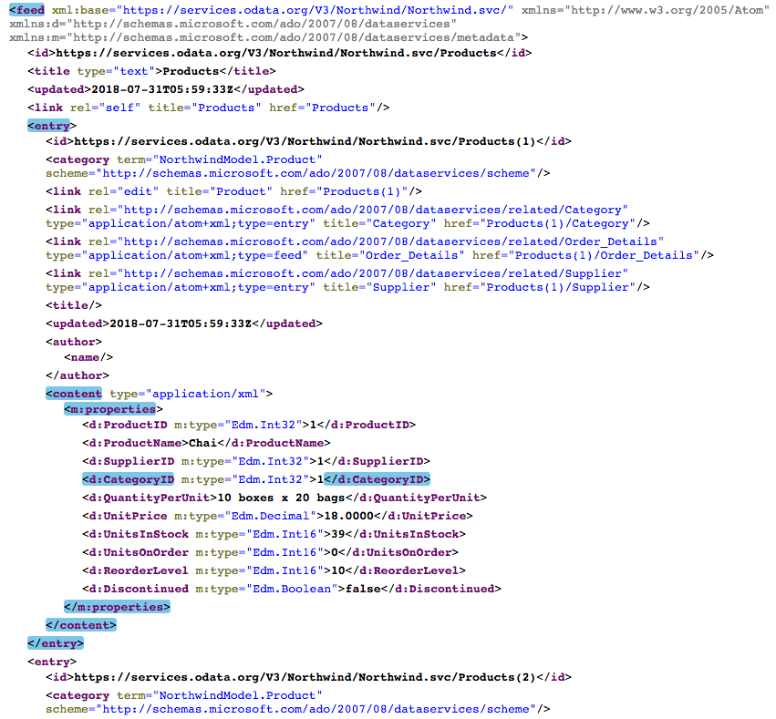

Much easier to read, and clearly visible is the structure and relationship described by the `feed` and `entry` elements. It's now also easier to see the actual product data - in this screenshot there is the `Chai` product, with 39 units in stock.

[DONE]
[ACCORDION-END]

[ACCORDION-BEGIN [Step 7: ](Explore the navigation properties from a product)]

In the screenshot in the previous step, notice the `link` XML elements, in particular the ones with the title attribute values `Category`, `Order_Details` and `Supplier`. Notice also the corresponding values of their type attributes: `entry`, `feed` and `entry` respectively:


Re-examine the [metadata document](https://services.odata.org/V3/Northwind/Northwind.svc/$metadata) to work out what these might be. Look for the Product entity type definition, which (with the new XML Tree extension) will look something like this:

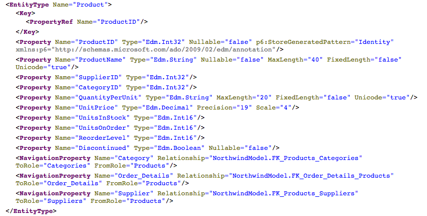

Look at the three navigation properties defined. They describe relationships between the `Product` entity type and the `Category`, `Order_Details` and `Supplier` entity types.

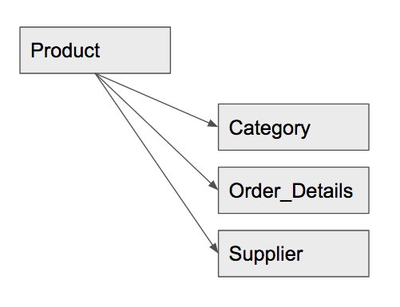

The relationship to the `Category` entity type is described with the ID `NorthwindModel.FK_Products_Categories`, with the `To_Role` attribute value being `Categories`. Search elsewhere in the metadata document for `FK_Products_Categories` to find the `Association` definition:

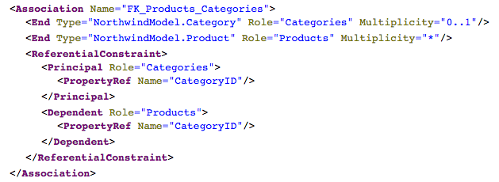

Notice that the value of the `Multiplicity` attribute for the `Categories` role is defined as "0..1". This means that there can be either zero or one categories for a product. This is why when we follow the navigation property from a `Product` entity type to a `Category` entity type (see the screenshot at the start of this step) the type of the `link` element is `entry`, not `feed`.

Follow the same path for the relationship to the `OrderDetails` navigation property described with the `To_Role` attribute value of `Order_Details`, and you will find, via the relationship `FK_Order_Details_Products`, that the `Association` definition looks like this:

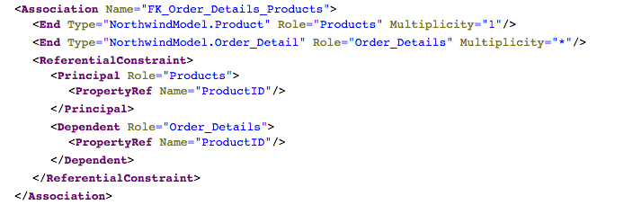

In this case, the value of the Multiplicity attribute described for this relationship is `*`. This means that there can be zero, one or more order details for a product. This is why when we follow this navigation property the type of the `link` element is `feed`, rather than `entity`.

[DONE]
[ACCORDION-END]

[ACCORDION-BEGIN [Step 8: ](Retrieve a specific product)]

The URL <https://services.odata.org/V3/Northwind/Northwind.svc/Products> shows the `Products` entity set, a feed of individual entries, each one representing a product. In each product `entry` element there is a child `id` element with the unique URL for that particular product, like in this example:

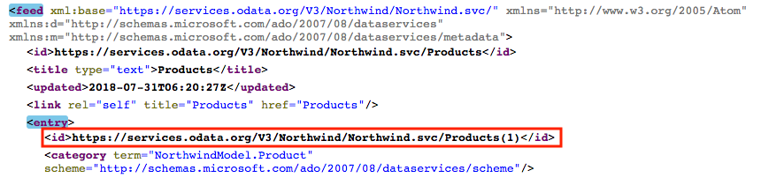

Specify that ID in the browser address bar, by adding `(1)` to the end of the existing URL:

<https://services.odata.org/V3/Northwind/Northwind.svc/Products(1)>

Note that the resource returned is the entry for that specific product.

[VALIDATE_8]
[ACCORDION-END]

[ACCORDION-BEGIN [Step 9: ](Retrieve order details for a specific product)]

To see how the navigation properties work, go from the individual property entry in the previous step to a list of the related order details. Remembering the navigation property concerned, `Order_Details`, add it to the end of the existing URL in the address bar to navigate to this URL: <https://services.odata.org/V3/Northwind/Northwind.svc/Products(1)/Order_Details>.

You should see that the resulting resource is a feed, a collection of entries representing the orders relating to the product specified.

Finally, use the OData system query option $count to retrieve the number of order details, rather than the order details themselves. Append `$count` onto the end of the existing URL like this:

<https://services.odata.org/V3/Northwind/Northwind.svc/Products(1)/Order_Details/$count>

[VALIDATE_9]
[ACCORDION-END]

