## Details
### You will learn
 - How to explore an OData service in your browser
 - How to use navigation paths
 - What the common query options are and how to use them
 - How to switch to a JSON output format

The Enterprise Procurement Model (EPM) represents a typical business scenario that is complex enough to have meaning in an enterprise context but still simple enough to use for exploring technologies and techniques at a beginner level.

EPM exists as data in a set of related tables and views, and there are also various OData services that marshal that data and provide business functionality. The EPM and the related OData services are available in the SAP Gateway demo system, and there is a specific EPM OData service, intended for use in a reference app called "Shop", that will be used in this tutorial.

---

[ACCORDION-BEGIN [Step 1: ](Find the EPM OData service)]

In this step you'll find the EPM OData service by looking for it via the maintenance transaction for the Internet Communication Framework (ICF), to understand how web-based resources in general and OData services in particular are managed within an ABAP system.

Log on to the SAP Gateway Demo system via the [Web GUI](https://sapes5.sapdevcenter.com/). If necessary, use the arrow button to make the OK Code field appear, so you can enter transaction codes.

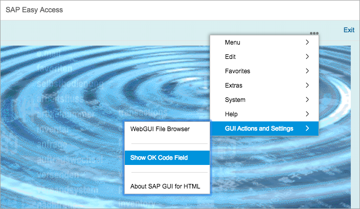

Enter transaction code **`SICF`** into the OK Code field to start the "Define Services" transaction. In the Service Path field enter **`/sap/opu/odata`** and then select the Execute function.

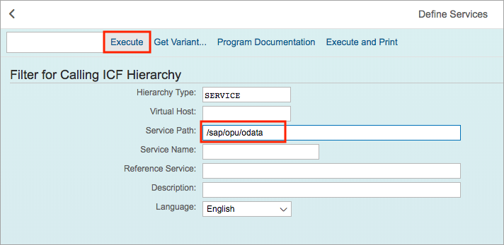

You will be presented with display of the ICF node hierarchy filtered to display only those nodes starting with the path `/sap/opu/odata`, which represents the root of the OData services. Feel free to explore the hierarchy of nodes available within the `odata` branch, and in particular the `sap` node, which is where you'll see a number of sub nodes representing OData services.

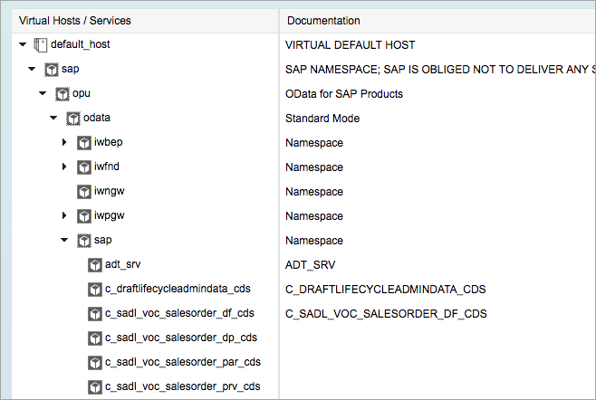

Now scroll down to find this OData service node:

`EPM_REF_APPS_SHOP_SRV`

This is the OData service you will explore. It is an EPM based service for a reference app called "Shop", which explains most of the node's name. The last part, `SRV`, short for "service", is common for OData services served from ABAP systems. This is similar to the convention you may have noticed with the Northwind service in the tutorial [Learn about OData fundamentals](https://developers.sap.com/tutorials/odata-01-intro-origins.html) where the end part of the OData service name was `svc`.

Use the information in the node hierarchy that leads down to the `EPM_REF_APPS_SHOP_SRV` node to form the part of the OData service URL that will be relative to the SAP Gateway demo system base URL:

`https://sapes5.sapdevcenter.com/sap/opu/odata/sap/EPM_REF_APPS_SHOP_SRV`

Enter your credentials for the SAP Gateway demo system if prompted.

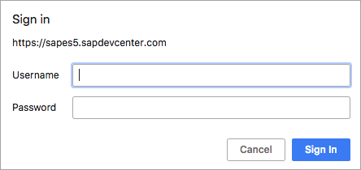

The resource returned is the OData service document, showing the collections available, such as `Suppliers`, `MainCategories` and so on.

[VALIDATE_1]
[ACCORDION-END]

[ACCORDION-BEGIN [Step 2: ](Explore entity relationships)]

At a very high level, the entity types and their relationships in this OData service look like this:

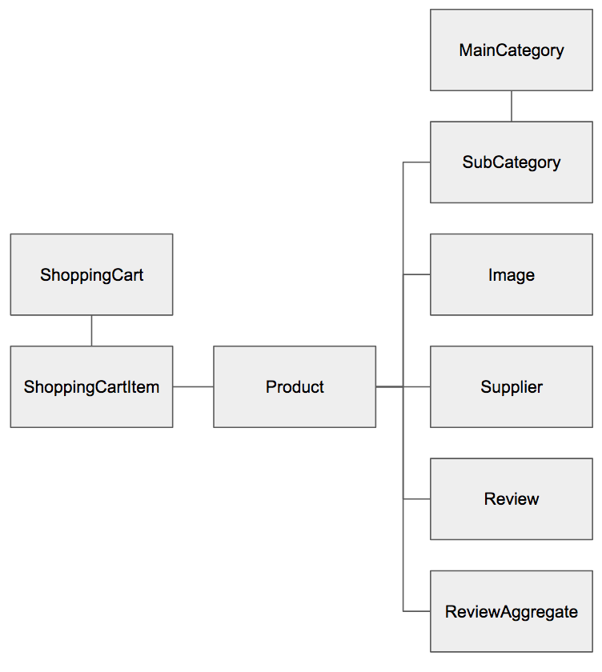

There are corresponding entity sets for each of the entity types. If you want to confirm this for yourself, look at the service's metadata document at this URL to see those relationships (look particularly at the `NavigationProperty`, `Association` and `EntitySet` elements for details):

`https://sapes5.sapdevcenter.com/sap/opu/odata/sap/EPM_REF_APPS_SHOP_SRV/$metadata`

You should now explore the `Products` entity set and see how a specific product relates to its supplier.

First, look at all of the products, using this URL for the `Products` entity set:

`https://sapes5.sapdevcenter.com/sap/opu/odata/sap/EPM_REF_APPS_SHOP_SRV/Products`

Now, find the product entry with the ID `HT-1001` and the name "Notebook Basic 17".

> If there isn't a product entry with this specific ID, you can choose another one - the IDs follow a similar pattern.

Use the entry's ID to navigate directly to that product, as an entity:

`https://sapes5.sapdevcenter.com/sap/opu/odata/sap/EPM_REF_APPS_SHOP_SRV/Products('HT-1001')`

Now you're looking at an individual product, in the form of a single entity (`Products('HT-1001')`) rather than all the products via the entire entity set (`Products`).

> Note the difference between the `Products` entity set resource and the resource for this specific `Product` entity - the former is represented by the root XML element `feed`, and the latter by the root XML element `entry`.

Next, follow the link from this product to its supplier, using the information in the relevant `link` element:

In other words, specify this URL:

`https://sapes5.sapdevcenter.com/sap/opu/odata/sap/EPM_REF_APPS_SHOP_SRV/Products('HT-1001')/Supplier`

You should see data for a single supplier, Becker Berlin, described inside a root XML `entry` element, denoting a single entity:

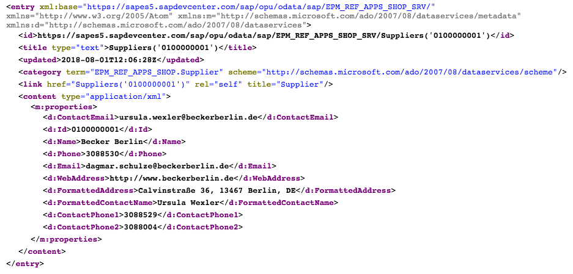

It is also possible to navigate to individual properties within an entity. Try this now. Select the supplier's web address, by specifying this URL:

`https://sapes5.sapdevcenter.com/sap/opu/odata/sap/EPM_REF_APPS_SHOP_SRV/Products('HT-1001')/Supplier/WebAddress`

[VALIDATE_2]
[ACCORDION-END]

[ACCORDION-BEGIN [Step 3: ](Page through the products with $top and $skip)]

OData has system query options `$top` and `$skip` that facilitate paging through large entity sets.

First, find out how many `Suppliers` there are, using the `$count` system query option:

`https://sapes5.sapdevcenter.com/sap/opu/odata/sap/EPM_REF_APPS_SHOP_SRV/Suppliers/$count`

At the time of writing, the number of suppliers in the `Suppliers` entity set for this service is 45. You may find there is a different number, but it doesn't matter.

Request the first 5 suppliers, using `$top`, like this:

`https://sapes5.sapdevcenter.com/sap/opu/odata/sap/EPM_REF_APPS_SHOP_SRV/Suppliers?$top=5`

> The system query options like `$top` and `$skip` are part of the query string of the URL which itself is introduced with the `?` symbol.

Now get the next 5 suppliers, by using `$skip` in conjunction with `$top`:

`https://sapes5.sapdevcenter.com/sap/opu/odata/sap/EPM_REF_APPS_SHOP_SRV/Suppliers?$top=5&$skip=5`

> Certain frameworks that process OData, like the [SAP UI5 toolkit](https://ui5.sap.com), use these system query options internally to allow comfortable paging through large data sets in list or table situations.

[DONE]
[ACCORDION-END]

[ACCORDION-BEGIN [Step 4: ](Have related data included in an entity set request)]

Instead of navigating from an entity to a related entity or entity set using two requests (one for the original entity and then another for the related data), the `$expand` system query option allows for related data to be returned in-line with resources retrieved, in a single request.

Try this out, by looking at another couple of EPM entities exposed in this OData service - the product categories. There's a `MainCategory` entity type, with a navigation property to a list of entities of type `SubCategory`. Have a quick look at the metadata document to confirm this:

`https://sapes5.sapdevcenter.com/sap/opu/odata/sap/EPM_REF_APPS_SHOP_SRV/$metadata`

Request a list of all the main categories, and ask for their sub categories to be returned in-line in the response, using the `$expand` system query option:

`https://sapes5.sapdevcenter.com/sap/opu/odata/sap/EPM_REF_APPS_SHOP_SRV/MainCategories?$expand=SubCategories`

If you look closely at the response, you'll see that there is a `feed` XML element at the root, containing `entry` elements. A typical entity set response. However, inside each `entry` element there is a nested `feed` element, itself containing further `entry` elements.

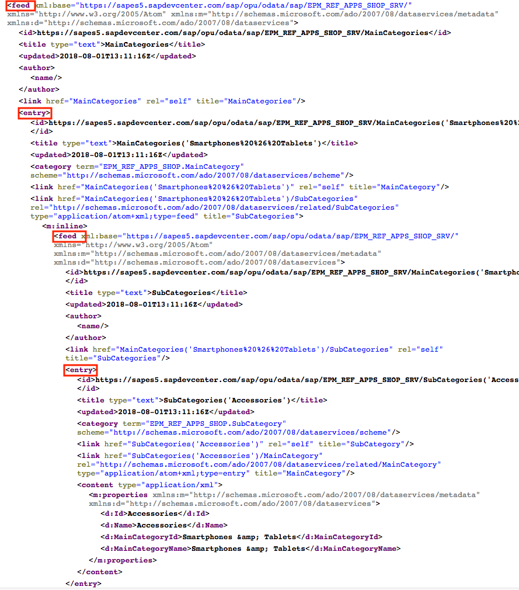

The `SubCategory` entities related to each `MainCategory` entity are returned in-line, in the response to the request for the `MainCategories` entity set.

[VALIDATE_4]
[ACCORDION-END]

[ACCORDION-BEGIN [Step 5: ](Request responses in a JSON format)]

You may have found looking through the nested XML structures in the previous step quite tedious. XML is human-readable, but not necessarily human-friendly. The OData specification describes an alternative format in JavaScript Object Notation (JSON). This is a more lightweight format and somewhat easier to read, if you have a browser extension that will format JSON for you.

First, install a JSON formatter extension for your Chrome browser. The `JSONView` extension is a good choice. Go to the [JSONView extension page](https://chrome.google.com/webstore/detail/jsonview/chklaanhfefbnpoihckbnefhakgolnmc?hl=en) and add it to your Chrome browser.

Now, reload the main and sub category structure from the previous step with this URL:

`https://sapes5.sapdevcenter.com/sap/opu/odata/sap/EPM_REF_APPS_SHOP_SRV/MainCategories?$expand=SubCategories`

Next, append the OData system query option `$format=json` to the query string, like this:

`https://sapes5.sapdevcenter.com/sap/opu/odata/sap/EPM_REF_APPS_SHOP_SRV/MainCategories?$expand=SubCategories&$format=json`

> Adding more system query options to the query string of an OData URL is just like adding query parameters to any other URL query string - they are concatenated with the '&' symbol. Don't forget the '$' prefix on each of the OData system query options, though!

The response is returned in JSON, and formatted by the `JSONView` is considerably easier to read:

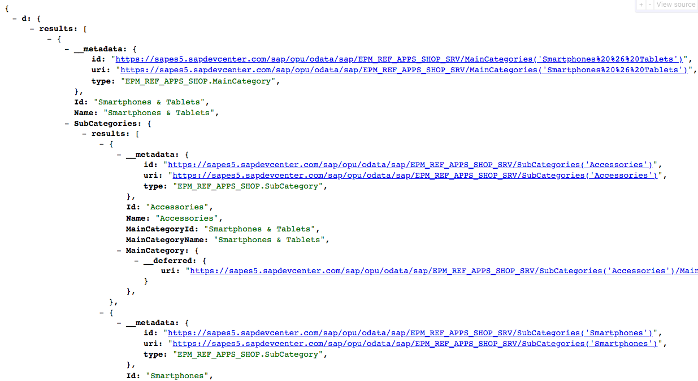

> While the entity set and entity responses can be returned in JSON format, the service document and metadata document of an OData service, at least a V2 OData service, cannot - they only exist in XML format.

[DONE]
[ACCORDION-END]

[ACCORDION-BEGIN [Step 6: ](Reduce the number of properties returned)]

An OData service may contain a definition of an entity type that has a large number of properties. If the consumer of the service really only needs a couple of them, transferring the rest is an unnecessary load on network traffic and can increase response times. The OData system query option `$select` allows you to specify a smaller list of properties that should be returned.

Looking at the metadata document of the OData service, you will see that the `Product` entity type is one that has many properties.

First, take a look at all the properties and some sample values by requesting the first entity in the `Products` entity set with this URL:

`https://sapes5.sapdevcenter.com/sap/opu/odata/sap/EPM_REF_APPS_SHOP_SRV/Products?$top=1&$format=json`

Even in the more lightweight JSON format it's still a lot of data, especially if an entire entity set is requested:

Now reduce the number of properties down to just a few: `AverageRating`, `Name` and `StockQuantity` using the `$select` system query option:

`https://sapes5.sapdevcenter.com/sap/opu/odata/sap/EPM_REF_APPS_SHOP_SRV/Products?$top=1&$format=json&$select=AverageRating,Name,StockQuantity`

You'll get a response that looks something like this - a whole lot smaller!

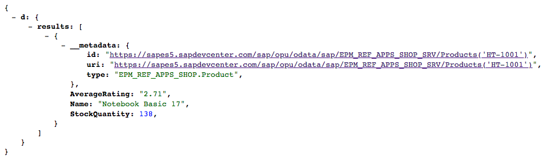

The `$select` system query option can also be used to specify properties that are part of entities that are returned in-line with `$expand`. The `Product` entity type has a `Supplier` navigation property as well as a `Reviews` navigation property - these can be returned in-line with `$expand`, and a restricted set of their properties can be specified in `$select` as well.

Specify this URL, to request the first product, along with the name of its supplier, and also the names of the users who have reviewed that product:

`https://sapes5.sapdevcenter.com/sap/opu/odata/sap/EPM_REF_APPS_SHOP_SRV/Products?$top=1&$format=json&$expand=Supplier,Reviews&$select=AverageRating,Name,StockQuantity,Supplier/Name,Supplier/FormattedAddress,Reviews/UserDisplayName`

> Depending on how the data has been modified in this demo system, you may find that the first product sometimes has no reviews. In that case, search for one using combinations of the `$top` and `$skip` that you learned about in a previous step.

The query string portion of this URL is quite long and getting difficult to read. Broken down into its parts, we have the following:

 - Get the first entity:
`$top=1`

 - Return the response in JSON format
`$format=json`

 - Include in-line the related Supplier and Reviews data as well
`$expand=Supplier,Reviews`

 - Only return these specific properties
`$select=AverageRating,Name,StockQuantity,Supplier/Name,Supplier/FormattedAddress,Reviews/UserDisplayName`

> Notice the format for specifying properties in related entity types, such as `Supplier/Name` and `Reviews/UserDisplayName`.

This request brings back exactly what we asked for:

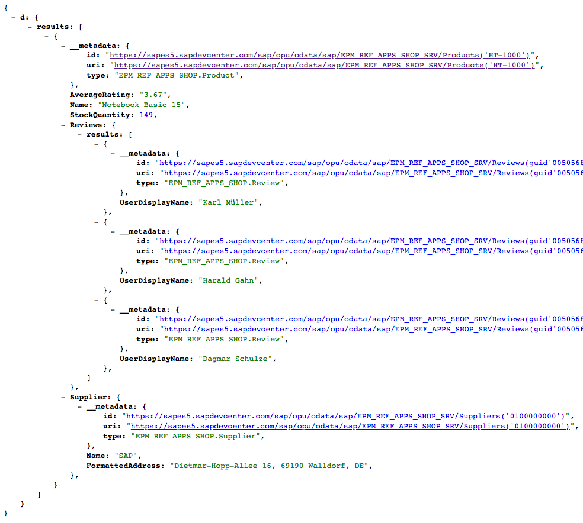

[VALIDATE_6]
[ACCORDION-END]

[ACCORDION-BEGIN [Step 7: ](Reduce the number of entities returned by filtering)]

The `$filter` system query option can be used to filter the entities according to criteria that can be expressed by a broad set of operators.

Refer back to the properties of the first product in the `Products` entity set, as shown in the screenshot in the previous step. Any of the properties here can be used with the `$filter` system query option.

First, count how many products there are, using `$count`:

`https://sapes5.sapdevcenter.com/sap/opu/odata/sap/EPM_REF_APPS_SHOP_SRV/Products/$count`

This may well vary, but at the time of writing, this shows 125.

Now, use the `$filter` system query option in conjunction with `$count` to find out how many products are in the "Computer Systems" main category:

`https://sapes5.sapdevcenter.com/sap/opu/odata/sap/EPM_REF_APPS_SHOP_SRV/Products/$count?$filter=MainCategoryId%20eq%20%27Computer%20Systems%27`

This should return a count value less than the total, earlier. At the time of writing, the value is 34.

> If you're wondering about the strange characters in this URL, they're just [URL encoded](https://en.wikipedia.org/wiki/Percent-encoding) versions of the space and single-quote characters, in other words %20 and %27 respectively. You can actually type the original space and single-quote values into the browser address bar like this: `$filter=MainCategoryId eq 'Computer Systems'` and the characters will be encoded automatically.

You can double check the results by removing the `$count` part from the URL to see that each of the product entities returned really do belong to the 'Computer Systems' main category:

`https://sapes5.sapdevcenter.com/sap/opu/odata/sap/EPM_REF_APPS_SHOP_SRV/Products/?$filter=MainCategoryId%20eq%20%27Computer%20Systems%27`

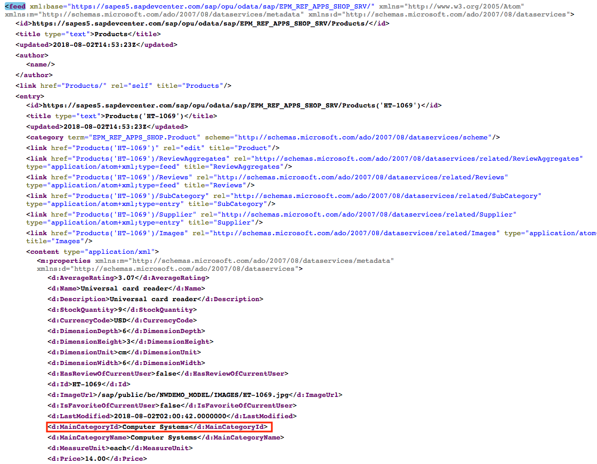

Operators can be combined. Try this, by finding out whether there are any products in the "Software" main category where the stock is low (10 units or fewer), restricting the results to just show the product name and stock information, in JSON format:

`https://sapes5.sapdevcenter.com/sap/opu/odata/sap/EPM_REF_APPS_SHOP_SRV/Products/?$filter=MainCategoryId%20eq%20%27Software%27%20and%20StockQuantity%20le%2010&$select=StockQuantity,Name&$format=json`

Again, to break this down, we have the following (before the special characters are URL encoded):

 - Restrict entries to those where the `MainCategoryId` value is "Software" and where the `StockQuantity` value is less than or equal to 10:
`$filter=MainCategoryId eq 'Software' and StockQuantity le 10`

 - Return only the values for the `StockQuantity` and `Name` properties:
`$select=StockQuantity,Name`

 - Return the response in JSON format:
`$format=json`

You can learn more about the different operators available in the [Filter System Query Option ($filter)](https://www.odata.org/documentation/odata-version-2-0/uri-conventions/#FilterSystemQueryOption) documentation on the OASIS OData website. You'll see that there are functions available for use with `$filter` too, functions such as `substringof` and `startswith`.

[VALIDATE_7]
[ACCORDION-END]

[ACCORDION-BEGIN [Step 8: ](Have entities returned in a certain order)]

The final system query option to examine in this tutorial is `$orderby`, which takes the specification of a list of one or more properties, and optional indicators to specify whether ascending order (the default) or descending order is desired.

Use the `$orderby` system query option to list the products sorted by average rating, with the most highly rated appearing first, showing the product name, price and the average rating score:

`https://sapes5.sapdevcenter.com/sap/opu/odata/sap/EPM_REF_APPS_SHOP_SRV/Products?$format=json&$orderby=AverageRating%20desc&$select=Name,Price,CurrencyCode,AverageRating`

This is the first part of what's returned - looks good:

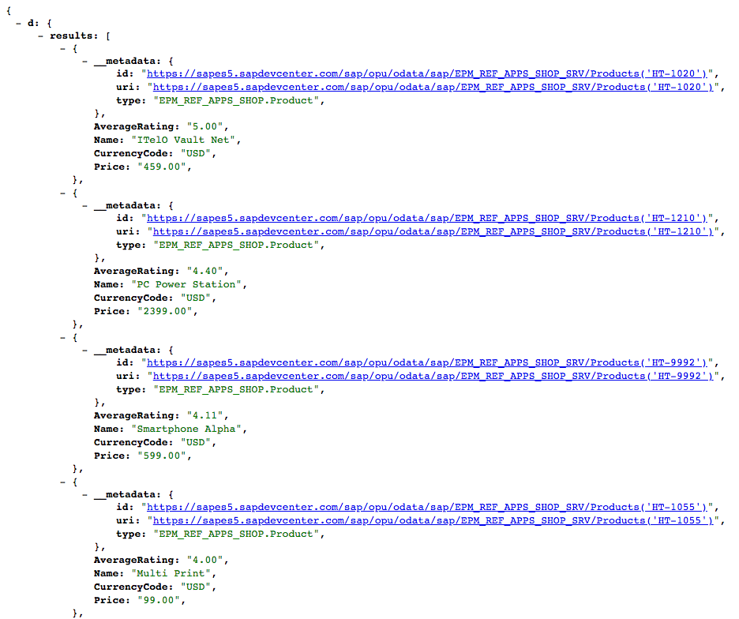

There are more system query options, but what you've seen in this tutorial are the main ones. You've been using them primarily in the context of the OData "query" operation, which makes a lot of sense. Some of the system query options are used implicitly in frameworks such as UI5 as stated earlier, but all of them are useful to know to explore, "by hand", an OData service, especially when you intend to use it in building an app.

[DONE]
[ACCORDION-END]
