## Details
### You will learn
- How to create new projects from templates in the SAP Web IDE
- What features the SAP Web IDE offers for discovering and exploring OData services
- How the SAP Web IDE template wizard can make use of OData service metadata
- What OData service calls are made when scrolling through data in a growing list

This tutorial will introduce you to SAP Web IDE features relating to OData.

> In this tutorial and others, the general name "SAP Web IDE" is used. Specifically, the "Full-Stack" version is implied throughout.

You'll create a very simple app based on a Northwind OData service, and in doing so will learn about what those features are. You'll also get a glimpse at the OData requests that are being triggered in the background by the SAPUI5 toolkit that supports OData natively.

> You'll need to be running the Chrome web browser to use the developer tools described in the last step of this tutorial.

---

[ACCORDION-BEGIN [Step 1: ](Start up the SAP Web IDE)]

Access the SAP Web IDE from your trial SAP Cloud Platform cockpit. Use the details in the tutorial [Enable the SAP Web IDE Full Stack](https://developers.sap.com/tutorials/webide-multi-cloud.html) to find out how to access it, or simply invoke it using a URL which will look like this:

`https://webidecp-XYZ.dispatcher.hanatrial.ondemand.com/`

Here, `XYZ` represents your trial subaccount name, such as `p999999trial`.

You can find out more about accessing the SAP Web IDE in the Help Portal, specifically in the "[Open SAP Web IDE](https://help.sap.com/viewer/825270ffffe74d9f988a0f0066ad59f0/CF/en-US/51321a804b1a4935b0ab7255447f5f84.html)" section.

[DONE]
[ACCORDION-END]

[ACCORDION-BEGIN [Step 2: ](Initiate a new project from template)]

Once you start the SAP Web IDE, use the menu path **File** > **New** > **Project from Template**.

You'll be presented with a multi-step wizard.

In the **Template Selection** step, choose the category **SAP Fiori Application** from the **Neo** environment, select the **SAP Fiori Worklist** application template, and proceed with **Next**.

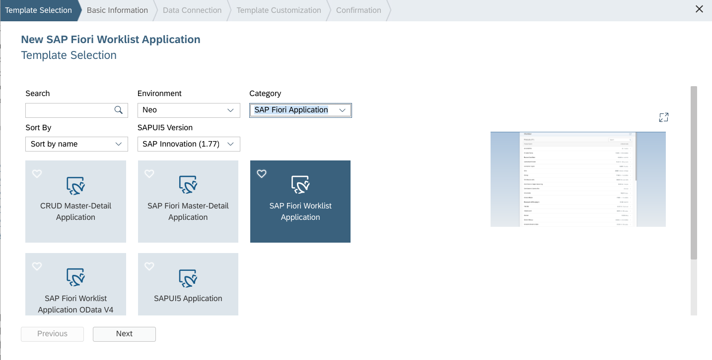

[DONE]
[ACCORDION-END]

[ACCORDION-BEGIN [Step 3: ](Enter basic information)]

In the **Basic Information** step of the wizard, enter the following:

Field            | Value
:--------------- | :-------------
Project Name     | `ProductData`
Title            | `Products`
Namespace        | `northwind`

The value you specify in the **Project Name** field becomes the name of the project's folder in the SAP Web IDE workspace. As such, there are restrictions (such as no spaces allowed). The **Title** field's value is displayed in the app itself. The value for the **Namespace** field is used in technical names for the app's artifacts and helps distinguish them from other artifacts and apps.

To understand how the namespace is used, consider the generated app, which is based on SAPUI5. It has different views that describe how the app looks. These views are defined in XML, and have corresponding controllers, where behavior is defined in JavaScript. Each view and controller artifact has a name, which starts with the namespace and the project name. The name for the main worklist controller, connected to the worklist view, which shows a list of data, will be:

`northwind.ProductData.controller.Worklist`

You can leave the values for the other fields empty. Now hit **Next** to continue on to the next step.

[DONE]
[ACCORDION-END]

[ACCORDION-BEGIN [Step 4: ](Specify the OData service)]

In the next step in the wizard, the **Data Connection** step, you get to specify an OData service upon which the app is to be based.

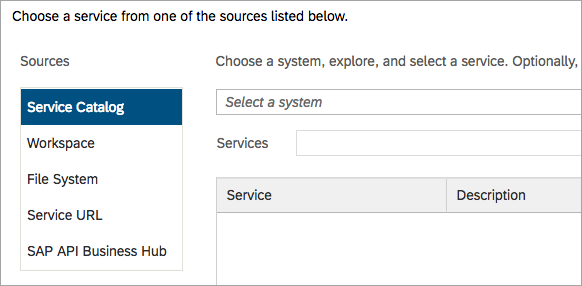

In this step's configuration, there are various possibilities for the data source, where you can direct the wizard to look for and examine the metadata document for the OData service you intend to use:

- The **Service Catalog** source is for when your OData service is provisioned by an ABAP stack Gateway system, and discovery can happen via a special OData catalogue service.

- The **Workspace** and **File System** sources are for when you wish to specify the location of a metadata document locally.

- The **Service URL** source is for generic OData services, as opposed to OData services via an SAP Gateway.

- The **SAP API Business Hub** service is for discovery of OData services through the SAP API Business Hub.

The app to be generated should use a Northwind OData service - in other words, a generic OData service. Any OData service that is to be defined via the **Service URL** or **Service Catalog** sources must be available via a destination definition in the Connectivity service of the SAP Cloud Platform.

In the [Create a destination for the Northwind OData services](https://developers.sap.com/tutorials/hcp-create-destination.html) tutorial, you will have done exactly this for the generic Northwind service endpoint. You'll now use this destination, indirectly, in this step of the wizard.

Select the **Service URL** source, then find and choose the Northwind destination.


> The values available in the selection are made up of a combination of the destination names and their descriptions. In this example this is the destination name `Northwind`
and description `Northwind OData services`, joined together by a dash.

> 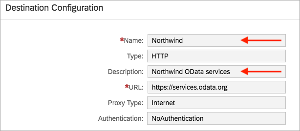

At this point you're not quite done. You've specified the destination, which points to the Northwind OData services URL root (<https://services.odata.org>), but you now must specify the rest of the URL to specify which version of which particular Northwind OData service to use.

In the input field that appears, with the **Please enter the relative URL ...** placeholder, specify `/V2/Northwind/Northwind.svc` and then select the **Test** button. This will cause the wizard to fetch and interpret the metadata document belonging to the OData service specified. This is a combination, then, of three parts:

- the root URL defined in the destination `https://services.odata.org`
- the relative URL defined just now `/V2/Northwind/Northwind.svc`
- the well-known `$metadata` suffix

In other words, it's this URL:

<https://services.odata.org/V2/Northwind/Northwind.svc/$metadata>

The result is a useful display of the entity sets defined in that metadata document:

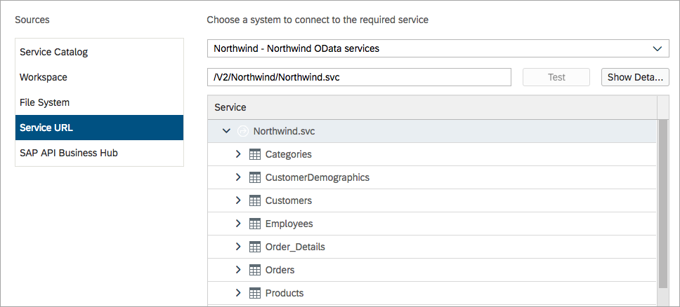

[VALIDATE_1]
[ACCORDION-END]

[ACCORDION-BEGIN [Step 5: ](Explore the OData service)]

Beyond showing simple list of entity sets in the OData service you specified, the SAP Web IDE offers a way to explore it in more detail.

Select the **Show Details** button to start the exploration.

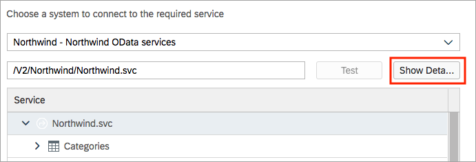

Initially, an overview of the service details is shown.

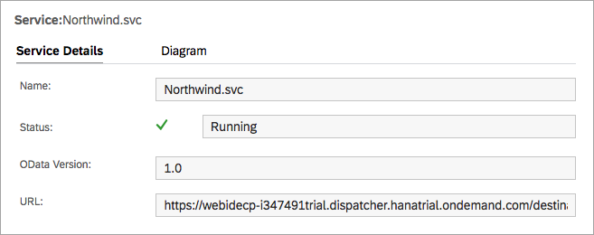

But selecting the **Diagram** tab, as shown, will display a small version of an entity relationship diagram. Choose the open full screen button (indicated) to get a better view.

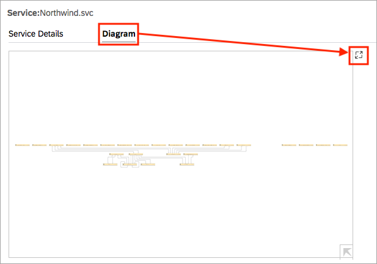

This will result in a large display of the entity relationship diagram that you can zoom in & out of and pan around, to inspect the detail of each entity type. Properties and navigation is included, with annotated relationships between the entity types where appropriate.

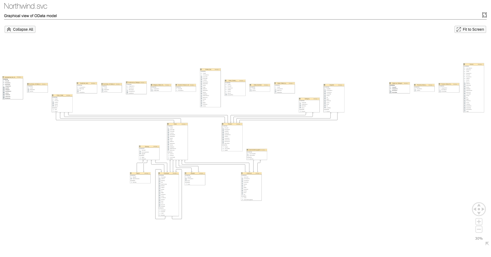

The entity relationship diagram feature is a great way to explore the OData service you're about to use in your app.

When you're ready, move on to the next step in the wizard.

[VALIDATE_2]
[ACCORDION-END]

[ACCORDION-BEGIN [Step 6: ](Customize the template)]

Now it's time to specify what data you want your app to display. This is done in the "Template Customization" step of the wizard.

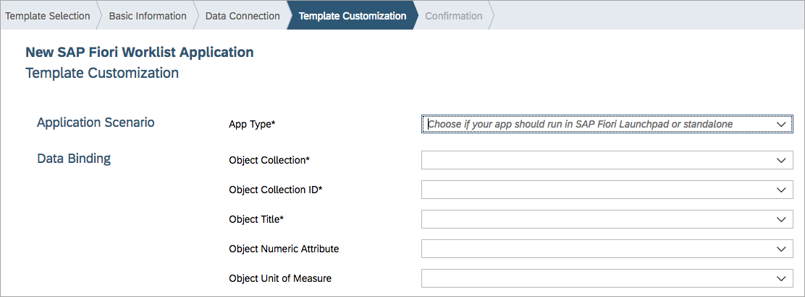

For **App Type** specify **`Standalone App`**; this keeps things simple at this stage. The alternative is to specify the app as an **`SAP Fiori Launchpad Component`**, which is often what you want when developing apps to run within an SAP Fiori launchpad, but it will only distract from the topic of this tutorial, so choosing a simple standalone `index.html` based app will be fine here.

The rest of the fields in this step are related to places in the actual worklist presentation of data in the app. You'll see a small, annotated display in this wizard step that shows where each of the pieces of data will appear when the app is run.

What's special about this step in the wizard is that the choices for each of the rest of the fields are determined from the SAP Web IDE's automatic interpretation of the OData metadata document.

First, the choices for the **Object Collection** field are the entity sets defined in the metadata: `Alphabetical_list_of_products`, `Categories`, `Category_Sales_for_1997`, and so on. Choose **`Products`**.

Following this, the value of `ProductID` is automatically inserted into the **Object Collection ID** field. This is because the `Product` entity type, upon which the selected `Products` entity set is based, has `ProductID` specified as the key property.

> In OData, the terms "entity set" and "collection" are used interchangeably.

Similarly, various values are presented as possible choices for the **Object Title** field. These values are the different properties from the `Product` entity type. Choose **`ProductName`**.

There are two other fields, **Object Numeric Attribute** and **Object Unit of Measure**, both optional. The values of the properties specified for these fields will appear on the right side of the app, as shown in the annotated display. For the **Object Numeric Attribute** field, choose the **`UnitPrice`** property, and leave the **Object Unit of Measure** blank, because in the definition of the `Product` entity type in this Northwind OData service there happens to be no relevant unit of measure property.

This is what you should end up with:

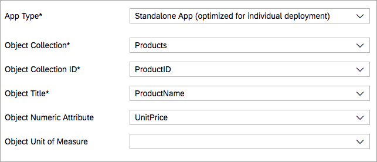

> If you had chosen a different template that expressed a relationship between two entity types, such as a Master-Detail template, you would also see the choice for the secondary object being restricted to those entity types that were related to the primary entity type chosen (e.g. `Order` and `Order_Detail`).

When you're ready, select **Finish** to end the wizard.

[DONE]
[ACCORDION-END]


[ACCORDION-BEGIN [Step 7: ](Modify the Worklist view)]

After the wizard completes, you should end up with a project folder called `ProductData` in your workspace.

> In mid-2018, the SAP Web IDE gained a [Workspace Manager](https://help.sap.com/viewer/825270ffffe74d9f988a0f0066ad59f0/CF/en-US/b62ec649f2aa443db047da72c3787b53.html) feature, allowing you to create, name and manage multiple workspaces. In screenshots here and elsewhere, the name of the workspace (at the root of the workspace tree) may differ from what you see in your own SAP Web IDE instance. The default name is `Workspace` whereas here the screenshots are from within the author's workspace called `ODataFoundations`.

Before running the app, add a unit of measure to the display of the `UnitPrice` property you specified in the previous step. Expand the files and folders in the newly created project to find the `Worklist.view.xml` file in the `webapp/view/` folder, and use the context menu to open it with the layout editor, as shown:

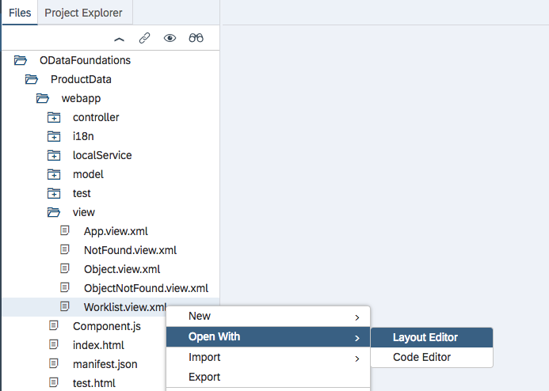

In the layout editor, identify the control where the `UnitPrice` property is specified, select it, and the properties for that control (which is an `ObjectNumber` control) appear on the right hand side. In the `Unit` property, enter the string **`USD`** as a currency.

> The Northwind data set is a good one for simple tutorials, but doesn't contain everything a real business service would do. Currency is one of the things that is missing, so we're just deciding here that it's US Dollars.

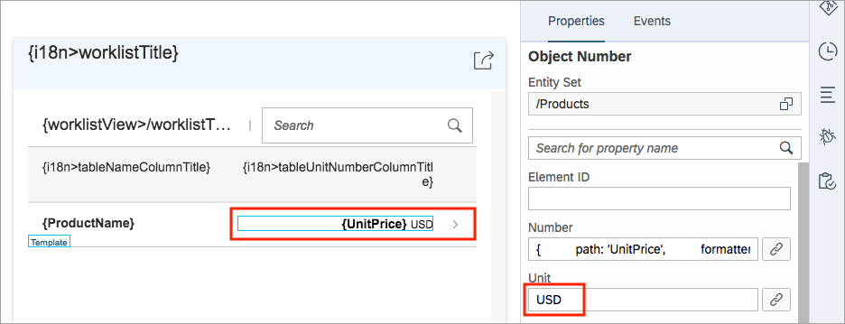

Save the file with **File** > **Save** menu path (or the **Save** icon in the top left, above the workspace display).

[DONE]
[ACCORDION-END]

[ACCORDION-BEGIN [Step 8: ](Change the batch mode of the OData mechanism)]

It's almost time to run the app, but there's one more thing to do so we can more easily examine the details of the OData calls that will be made.

OData supports so-called [Batch Processing](https://www.odata.org/documentation/odata-version-2-0/batch-processing/), which allows more than one OData operation to be sent with a single HTTP request. There's a special endpoint in an OData service for this, used for all batch requests. Batch requests are made with the HTTP POST method.

The endpoint is `$batch` and is related to the OData service document in the same way that `$metadata` is. In other words, the batch processing endpoint for the OData service used in this tutorial is:

`https://services.odata.org/V2/Northwind/Northwind.svc/$batch`

By default, when a UI5 based app is generated from a template in the SAP Web IDE, the version of the UI5 OData mechanism used is one that supports the use of batch processing, and has the option turned "on" by default (this is the [V2 version of the `ODataModel` mechanism](https://ui5.sap.com/#/api/sap.ui.model.odata.v2.ODataModel)).

One the one hand, the fact that batch processing is on by default is great, because sending multiple OData operations in a single HTTP POST request is good for performance. On the other hand, it makes it more difficult to see what's going on under the covers. So for the purposes of investigation, turn batch processing off, as described next.

In a similar way to how you found and opened the `Worklist.view.xml` file with the layout editor, find the `manifest.json` file in the `webapp/` folder, and open it with the code editor, via the context menu.

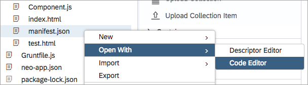

> This file contains JSON which has a very particular format, so please pay attention to formatting and syntax such as remembering commas, double quotes and so on.

In the `manifest.json` file, locate the `"models"` section within the `"sap.ui5"` section, and find the "default model" which is signified by an empty string ("") as the property. You can see this in line 69 of the screenshot.

Add the following to the value for this empty string:

```
"settings": {
    "useBatch": false
}
```

Remember to put a comma on the line preceding this, too.


Save your changes with `File -> Save` and you're done.

[VALIDATE_8]
[ACCORDION-END]

[ACCORDION-BEGIN [Step 9: ](Run the app and examine the OData calls made)]

Now it's time to actually run the app. Use the green **Run** icon near the top of the SAP Web IDE and in the dialog box **Choose the File to Run** that appears, select the **`index.html`** file name and then **OK**.

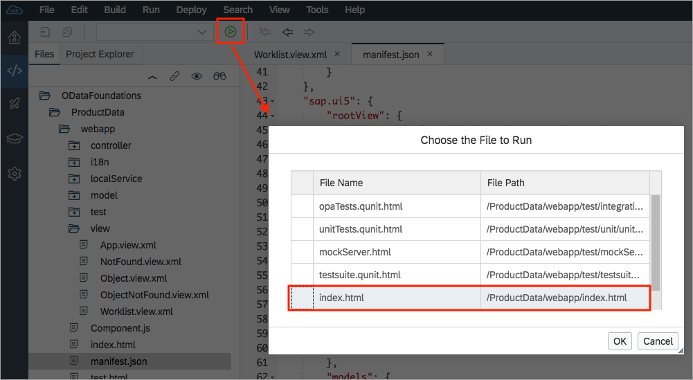

You should see the app appear in a new tab, showing product data like this:

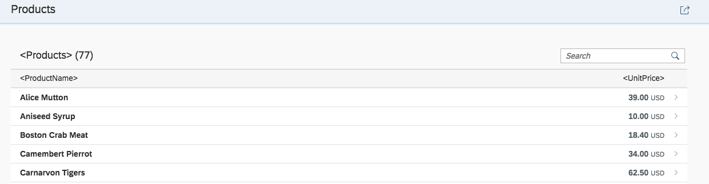

> Don't worry about the titles in angle brackets, such as `<Products>`, `<ProductName>` and `<UnitPrice>`. These are placeholders for the internationalization features, which are not the subject of this tutorial. If you do want to replace these placeholders with real titles, you can edit the file `i18n.properties` in the `webapp/i18n/` folder. (The term `i18n` is short for "internationalization").

Turn on the [Chrome Developer Tools](https://developers.google.com/web/tools/chrome-devtools/) ("dev tools" for short). You can do this with keyboard shortcut `Ctrl-Shift-I` (or `Cmd-Shift-I` on a Mac) or by simply right-clicking on any part of the app display and selecting "Inspect".

When the Chrome Developer Tools open, select the **Network** panel, as shown, and enter **`northwind`** into the Filter field, as shown. This will restrict the display of network requests to those containing that string, in other words, to the OData URLs. Ensure also that **All** is selected next to the filter.

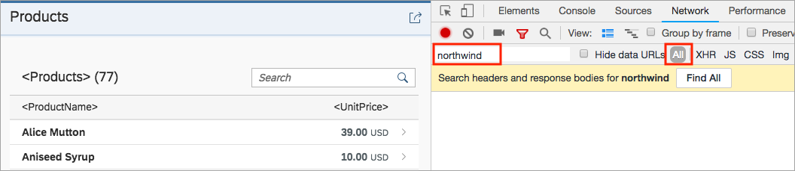

> The dev tools may open docked at the bottom of the app, or at the side. It doesn't really matter, but you can change your docking preferences with the dev tools menu in the upper right.

At this point there will probably be nothing displayed in the Network panel, because all of the calls to the OData service that were required in the app's startup have been made before the Network panel was opened. So refresh the app with the browser refresh button.

Now you should see a number of individual calls to the OData service, like this:


In this screenshot you can see three:

- the call to retrieve the `$metadata` document, so the OData mechanism in UI5 can understand the details of the service

- a call to the `$count` resource; this is caused by the UI5 Table control (which is what's used to display the products) so it can work out the scrolling calculations and display the status at the bottom (`More [20 / 77]` in the screenshot)

- a call to retrieve the first 20 entries in the `Products` entity set, via a combination of the system query options `$skip=0` and `$top=20`. You can also see that the `$orderby` system query option is being used; this is caused by the `sorter` specification in the binding of the `Products` entity to the Table control's "items" aggregation.

> If you want to investigate this `sorter` specification in the "items" binding, look in the `Worklist.view.xml` file (open it using the context menu to select the Code Editor rather than the Layout Editor) and search for the `<Table>` XML element.

Can you guess what will happen if you press the **More** button at the bottom of the products display?

Do it now.

Another OData call is made, similar to the previous one, but this time with a value of 20 for the `$skip` system query option, so that in combination with `$top=20`, the next 20 items are retrieved.

This has been a very brief glimpse into what happens with OData calls behind the scenes. Switching off batch mode and opening up the Network panel in the Chrome dev tools is a very useful way of getting a better feel for what is actually going on behind the scenes.

[VALIDATE_9]
[ACCORDION-END]
