## Prerequisites
 - **Tutorials:** [Enable SAP Web IDE Full-Stack](https://developers.sap.com/tutorials/webide-multi-cloud.html)
 - Select a Cloud Foundry space. See [Select a Cloud Foundry Space](https://help.sap.com/viewer/825270ffffe74d9f988a0f0066ad59f0/CF/en-US/98f49286ac05492f88428c603d146fc3.html)

## Details
### You will learn
- How to use CDS to define a data model
- What CDS can generate for you in terms of an OData service
- Where to look in the SAP Cloud Platform cockpit for your service instances and deployed apps

[Core Data & Services (CDS)](https://help.sap.com/viewer/65de2977205c403bbc107264b8eccf4b/Cloud/en-US/855e00bd559742a3b8276fbed4af1008.html) powers a significant part of the [Application Programming Model for SAP Cloud Platform](https://help.sap.com/viewer/65de2977205c403bbc107264b8eccf4b/Cloud/en-US/855e00bd559742a3b8276fbed4af1008.html). CDS has many features, and in this tutorial you'll encounter a couple of fundamental ones - the ability to declaratively define a data model and service, and to have those declarations turned into artefacts for a persistence layer (in this case a HANA database) and a running OData service (in this case a Java-based app).

You'll use SAP Web IDE, and a particular extension relating to building business apps with CDS.

The model and service you'll create is deliberately a very simple one, based on a small subset of something you've seen before if you've followed previous OData tutorials (in particular the [Learn about OData Fundamentals](https://developers.sap.com/tutorials/odata-01-intro-origins.html) tutorial) - the product information from the Northwind service.

> In this tutorial and others the general name "SAP Web IDE" is used. Specifically, the "Full-Stack" version is implied throughout.

---

[ACCORDION-BEGIN [Step 1: ](Start up the SAP Web IDE)]

Access SAP Web IDE from your trial SAP Cloud Platform cockpit. Use the details in the tutorial [Enable the SAP Web IDE Full Stack](https://developers.sap.com/tutorials/webide-multi-cloud.html) to find out how to access it, or simply invoke it using a URL which will look like this:

`https://webidecp-XYZ.dispatcher.hanatrial.ondemand.com/`

Here, `XYZ` represents your trial subaccount name, such as `p999999trial`.

You can find out more about accessing SAP Web IDE in the Help Portal, specifically in the [Open SAP Web IDE](https://help.sap.com/viewer/825270ffffe74d9f988a0f0066ad59f0/CF/en-US/51321a804b1a4935b0ab7255447f5f84.html) section.

[DONE]
[ACCORDION-END]

[ACCORDION-BEGIN [Step 2: ](Ensure the required extension is enabled)]

You'll make use of the SAP Cloud Platform Business Application Development Tools extension within SAP Web IDE in this tutorial. In SAP Web IDE, select the Preferences perspective either with the cog icon or via menu path **Tools** > **Preferences**. At the **Workspace Preferences** level, select **Extensions** and make sure that this extension is enabled:


[DONE]
[ACCORDION-END]

[ACCORDION-BEGIN [Step 3: ](Set CF and CDS preferences in SAP Web IDE)]

Before you begin, you'll need to check that you have appropriate preferences set for Cloud Foundry (CF) and CDS.

While still in the **Preferences** perspective, select the **Cloud Foundry** settings at the **Workspace Preferences** level and ensure you have followed the instructions in the relevant prerequisites for this tutorial. Your preferences should look something like this (you will have a different combination of API endpoint, organization and space details):

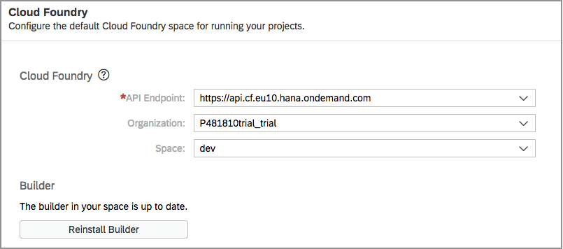

[DONE]
[ACCORDION-END]

[ACCORDION-BEGIN [Step 4: ](Check your CF quota)]

Before proceeding, it's worth checking that you have enough quota available for this tutorial. Go to the Cloud Foundry space for your trial account in your [SAP Cloud Platform cockpit](https://account.hanatrial.ondemand.com/cockpit#/home/trialhome) -- follow the Cloud Foundry Trial link, selecting your subaccount where you should then see the subaccount overview, which will look something like this:

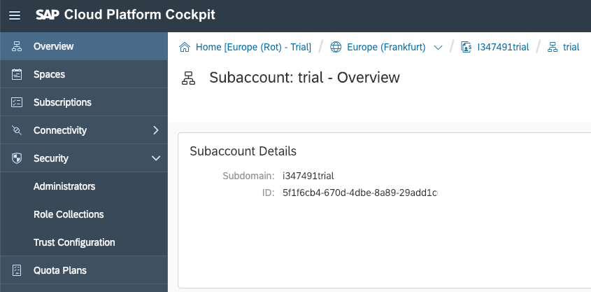

Select the **Spaces** menu item on the left to see the space(s) within the Cloud Foundry organization that's associated with it. If you've just started with a new Cloud Foundry trial on SAP Cloud Platform, you should see something similar to this:


In this example, there is 1GB memory free, which is more than enough for the OData service app that will be generated and deployed.

[DONE]
[ACCORDION-END]

[ACCORDION-BEGIN [Step 5: ](Open the SAP Web IDE console)]

So you can see what's going on throughout the rest of this tutorial, open the SAP Web IDE console with menu path **View** > **Console**. If there's already content displayed in it, you can clear it with menu path **View** > **Clear Console**.

> You may need to switch back from the Preferences perspective to the Development perspective first.

Notice there's also a **Run Console** option too -- you'll be switched to that automatically later in this tutorial when you execute the generated OData service for the first time.

> You can switch between the different views (Console, Problems, Run Console and Resource Manager) using the appropriate icons in the bottom right of the SAP Web IDE display.

[DONE]
[ACCORDION-END]

[ACCORDION-BEGIN [Step 6: ](Start a new project)]

Use the project wizard to start a new project, using menu path **File** > **New** > **Project from Template**. In the **Template Selection** step, find and choose the _SAP Cloud Business Application_ template -- you may have to choose _Cloud Foundry_ in the **Environment** filter and _All categories_ in the **Category** filter.

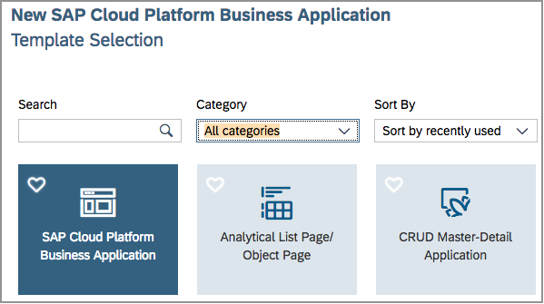

In the **Basic Information** step, enter **`Products`** for the project name.

In the **Project Details** step, ensure **`Java`** is selected for the Service, specify **`my.app`** for the Java Package, and ensure **`SAP HANA Database`** is selected for the Database.

When you finish the template wizard, you should have a project in your workspace that looks something like this:

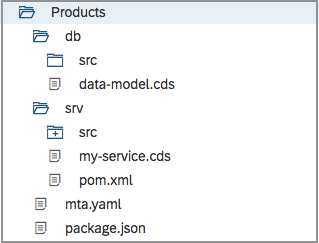

The two main folders within the project, `db` and `srv`, represent the modules where you'll complete the specification of the data model and the service definition respectively. If you want to take a brief look into the **`mta.yaml`** file (right-click on the filename and choose **Open MTA Editor**) you can see the two modules so defined:

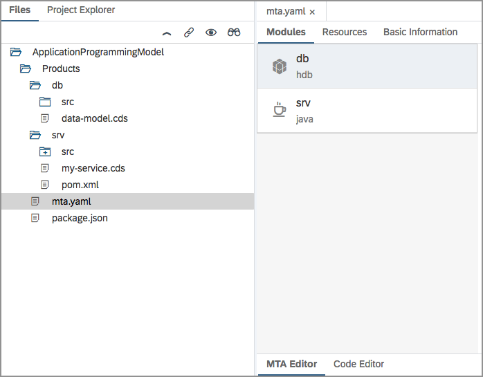

Finally, note the messages that have been written to the Console, they give you some idea of what's happened as a result of your use of the wizard to generate your project.

[VALIDATE_6]
[ACCORDION-END]

[ACCORDION-BEGIN [Step 7: ](Examine the Northwind products information)]

You're going to create a very simplified data model based on the Northwind product data, so remind yourself of what it looks like. Open up a new browser tab pointing to the [Northwind Products](https://services.odata.org/V3/Northwind/Northwind.svc/Products) entity set, specifying the properties you'll be using in your model, and asking for JSON, for minimal noise in the response:

<https://services.odata.org/V3/Northwind/Northwind.svc/Products?$format=json&$select=ProductID,ProductName,UnitsInStock>

The response should look something like this:

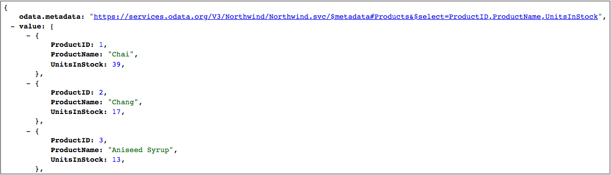

In the next step you'll create an entity definition that has these three properties.

> There's no magic or significance in the fact that we're using another OData service here -- it's just structured data that you're probably already familiar with.

[VALIDATE_7]
[ACCORDION-END]

[ACCORDION-BEGIN [Step 8: ](Define the data model)]

It's time to define the data model, declaring an entity with a few properties. You'll want to modify the service definition too, so be prepared *not* to save your changes just yet - you'll be saving them together with the service definition changes in the next step.

Open the **`data-model.cds`** file within the `db` folder. It should already contain some sample declarations. Replace the entire contents with the following:

```
namespace my.app;

entity Products {
  key ProductID : Integer;
  ProductName   : String;
  UnitsInStock  : Integer;
}
```

> You can either copy-paste the definition from here, or type it into the editor directly. In the latter case, you will see useful CDS specific autocomplete and syntax checking features provided by the SAP Cloud Platform Business Application Development Tools extension you enabled earlier.
>&nbsp;
> 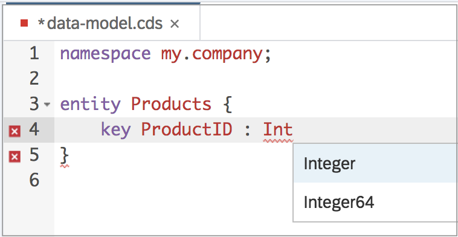

Remember - at this stage you should *not* save the file.

[DONE]
[ACCORDION-END]

[ACCORDION-BEGIN [Step 9: ](Specify the service definition)]

In a similar way to how you defined the data model, you should now define the service.

From within the `srv` folder, open the **`cat-service.cds`** file, and you'll see some default content, including some comment lines. Replace the entire content with this:

```
using my.app from '../db/data-model';

service CatalogService {
  entity Products as projection on app.Products;
}
```

The first line creates a reference to the information in the data model you defined earlier, and the service, which will be an OData service called `CatalogService`, has a single entity type `Products` which is based upon the `Products` entity definition in that data model.

At this point you should have two files open, **`data-model.cds`** and **`cat-service.cds`**, both with unsaved changes. It's now time to save both of them at the same time - use menu path **File** > **Save All** to do this.

[DONE]
[ACCORDION-END]

[ACCORDION-BEGIN [Step 10: ](Examine the build results)]

It's worth spending a bit of time looking at the build results in the Console. If you look at the details, you'll notice that various artifacts have been created not only in the `db` folder but also in the `srv` folder. The following screenshot depicts what you might see -- the files highlighted have just been generated.

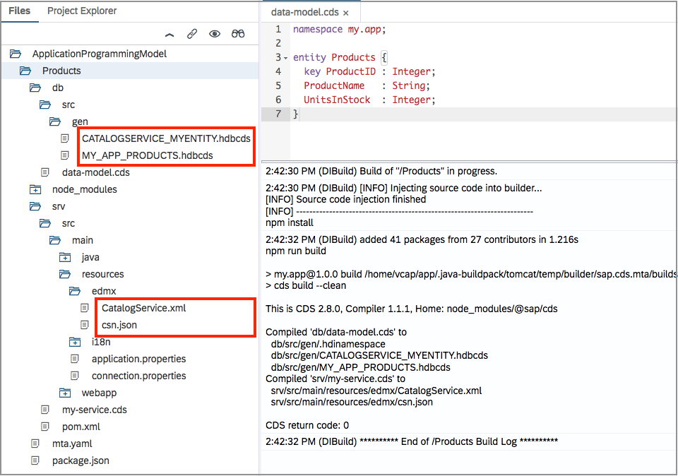

Indeed, if you open the `CatalogService.xml` file (in the `srv/src/main/resources/edmx/` folder), you'll see something that may feel familiar -- it's metadata, in XML format, for your fledgling OData service. It reflects your new service definition, and looks like this:

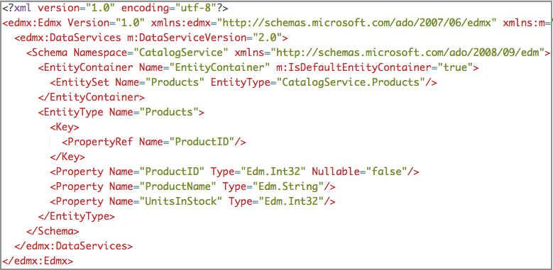

You can clearly see the entity type definition for `Products`, with the three properties you defined in the data model.

[VALIDATE_10]
[ACCORDION-END]


[ACCORDION-BEGIN [Step 11: ](Create the database)]

You're almost there -- you have the data definition and the service definition, there are artifacts generated for the SAP HANA database (as well as the OData metadata and the OData service itself). What's left is to create the database schema by deploying those artifacts.

Do this by using the context menu on the `db` folder and choosing **Build** > **Build**.

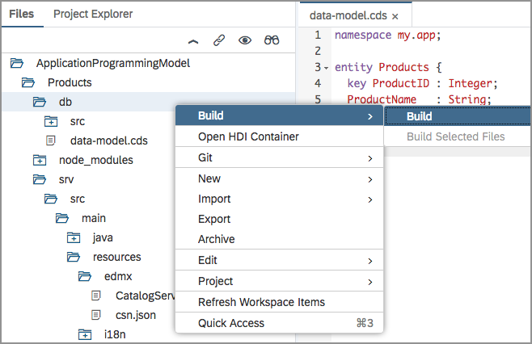

This will cause all sorts of informational messages to be written to the Console; keep an eye on them to get a feel for what's going on. Towards the end of the messages you'll notice a deployment taking place.

You may wish to check the results of this activity in the Cloud Foundry environment from the SAP Cloud Platform cockpit. Navigate there to your space (see earlier in this tutorial) and request a list of the service instances from the menu. You should see your database instance listed, something like this:

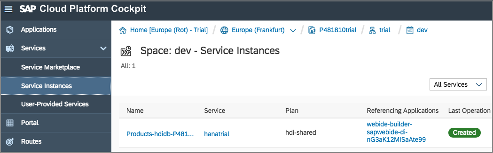

[DONE]
[ACCORDION-END]


[ACCORDION-BEGIN [Step 12: ](Start the OData service)]

It's now time to start up the OData service for the first time. There's no data in the database yet, so there are no products to show at this point, but you can at least look at the OData service and metadata documents.

Use the context menu on the `srv` folder and select **Run** > **Run as Java Application**.

The **Run Console** view should appear, and after a short time, you'll be notified that the service (in the form of a Java application, which is what it is) is running. In a similar way to the previous step, you can check in the Cloud Foundry area of the SAP Cloud Platform Cockpit to see the results of this -- there will be an entry in the **Applications** list that represents this service, looking something like this:

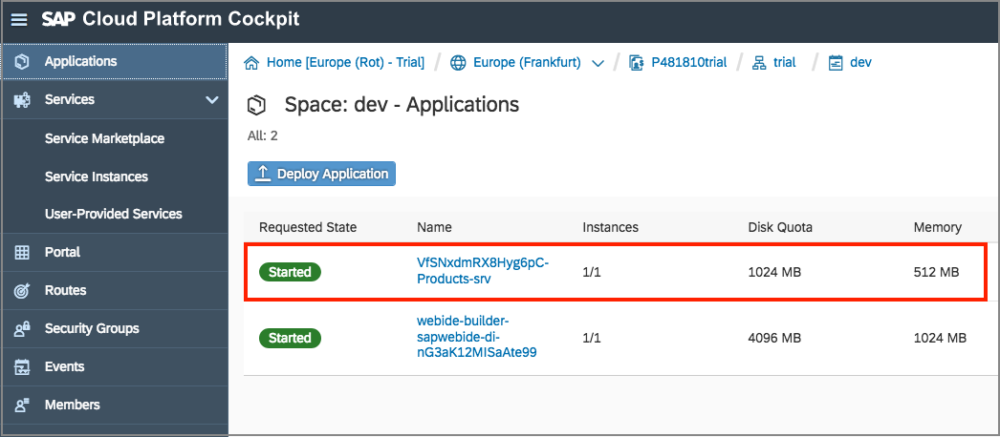

Use the URL shown in the detail of this app (select the app name to see the detail), or the URL shown at the top of the Run Console back in SAP Web IDE (see the screenshot below) to invoke the Java app to get to your OData service.

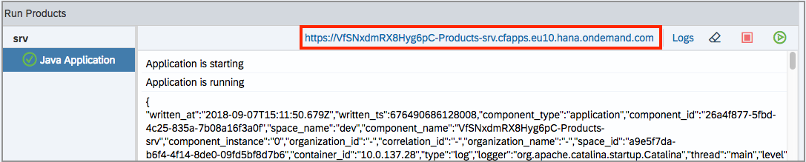

It should provide you with a link to the service document of your newly minted OData service. Open this link to see the service document, which should look something like this:

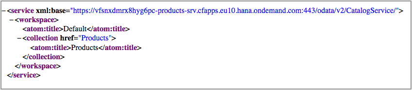

You can jump to the OData service metadata document simply by appending **`/$metadata`** to the end of the service document's URL, and it should look something like this:


Congratulations! You have your own SAP HANA backed OData service up and running!

[DONE]
[ACCORDION-END]

