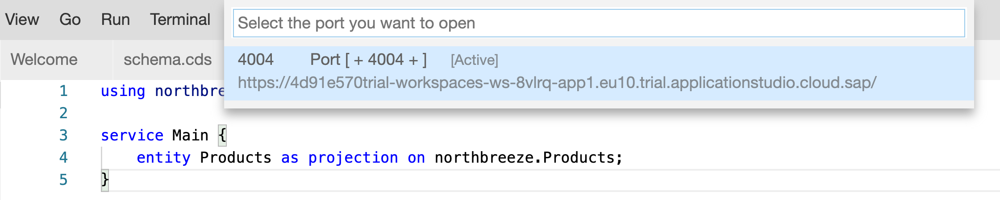
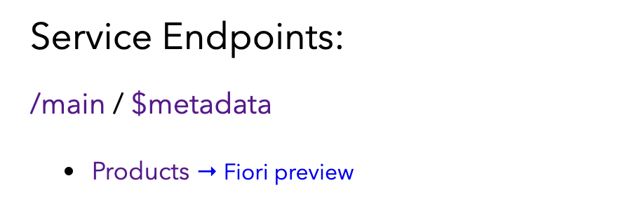

## Prerequisites
 - **Tutorials:** [Create a Dev Space for Business Applications](appstudio-devspace-create)

## Details
### You will learn
- How to use CDS to model entities and services
- How to seed your OData service with test data
- What CAP can do for you in terms of generating and servicing an OData service

[CDS](https://help.sap.com/viewer/65de2977205c403bbc107264b8eccf4b/Cloud/en-US/855e00bd559742a3b8276fbed4af1008.html) powers a significant part of [CAP](https://cap.cloud.sap). CDS has many features, and in this tutorial you'll encounter a couple of fundamental ones - the ability to declaratively define your data model, concentrating on the domain at hand, and to then be able to expose parts (or all) of that model in a service. You'll also learn how much CAP can do for you with respect to creating full CRUD+Q\* OData services almost from nothing. It's hard to remember how difficult it was to do that before the advent of CAP.

\*CRUD+Q is a common shorthand for referring to a fully formed OData service that sports Create, Read, Update, Delete, and Query operations.

You'll use the SAP Business Application Studio (App Studio), with a dev space for business applications, that you should already have ready and set up from the prerequisite tutorial.

The model and service you'll create is deliberately a very simple one, based on a small subset of something you have seen before if you have followed previous OData tutorials (in particular the [Learn about OData Fundamentals](odata-01-intro-origins) tutorial) - the product information from the Northwind service.

---


[ACCORDION-BEGIN [Step 1: ](Remind yourself of the Northwind product data)]

In the tutorial [Learn about OData Fundamentals](odata-01-intro-origins), you familiarized yourself with some of the structure and content of the [Northwind OData service](https://services.odata.org/V4/Northwind/Northwind.svc/). In this tutorial, you'll create your own simple OData service based on information in the Products entity set, so now's a good time look at that product data.

Jump to the Products entity set in the V4 version of the OData service, with this URL <https://services.odata.org/V4/Northwind/Northwind.svc/Products>.

In the [earlier tutorial](odata-01-intro-origins), we used the V3 version at <https://services.odata.org/V3/Northwind/Northwind.svc/Products>. This resource has a default resource representation of XML; more specifically, the value of the `Content-Type` header returned with this resource is `application/atom+xml;type=feed;charset=utf-8` (you can check this by using your browser's developer tools to inspect the request's response headers).

In this tutorial, we're using the V4 version. After all, OData version 4 has been around as an OASIS standard [since 2014](https://raw.githubusercontent.com/qmacro/odata-specs/master/overview.md). Notice that the default representation of OData V4 resources here is JSON; more specifically, the value of the `Content-Type` header in the response is `application/json;odata.metadata=minimal;odata.streaming=true;IEEE754Compatible=false;charset=utf-8`. This JSON representation is also used for OData service document resources in V4 too, whereas in earlier versions it was XML.

The representation of the `Products` entity set should look something like this:

```JSON
{
  "@odata.context": "https://services.odata.org/V4/Northwind/Northwind.svc/$metadata#Products",
  "value": [
    {
      "ProductID": 1,
      "ProductName": "Chai",
      "SupplierID": 1,
      "CategoryID": 1,
      "QuantityPerUnit": "10 boxes x 20 bags",
      "UnitPrice": 18,
      "UnitsInStock": 39,
      "UnitsOnOrder": 0,
      "ReorderLevel": 10,
      "Discontinued": false
    },
    {
      "ProductID": 2,
      "ProductName": "Chang",
      "SupplierID": 1,
      "CategoryID": 1,
      "QuantityPerUnit": "24 - 12 oz bottles",
      "UnitPrice": 19,
      "UnitsInStock": 17,
      "UnitsOnOrder": 40,
      "ReorderLevel": 25,
      "Discontinued": false
    }
  ]
}
```

This of course is just the data; to understand what you're looking at, look now at the definition of this entity set, in the OData service's metadata document at <https://services.odata.org/V4/Northwind/Northwind.svc/$metadata>.

Ignoring the navigation properties of the `Product` entity set for now, we see this set of property definitions:

```XML
<EntityType Name="Product">
  <Key>
    <PropertyRef Name="ProductID"/>
  </Key>
  <Property xmlns:p5="http://schemas.microsoft.com/ado/2009/02/edm/annotation" Name="ProductID" Type="Edm.Int32" Nullable="false" p5:StoreGeneratedPattern="Identity"/>
  <Property Name="ProductName" Type="Edm.String" Nullable="false" MaxLength="40"/>
  <Property Name="SupplierID" Type="Edm.Int32"/>
  <Property Name="CategoryID" Type="Edm.Int32"/>
  <Property Name="QuantityPerUnit" Type="Edm.String" MaxLength="20"/>
  <Property Name="UnitPrice" Type="Edm.Decimal" Precision="19" Scale="4"/>
  <Property Name="UnitsInStock" Type="Edm.Int16"/>
  <Property Name="UnitsOnOrder" Type="Edm.Int16"/>
  <Property Name="ReorderLevel" Type="Edm.Int16"/>
  <Property Name="Discontinued" Type="Edm.Boolean" Nullable="false"/>
</EntityType>
```

So, we know that the `ProductID` property is the only key field, and the types of other properties make sense to us too.

To find the right balance between realism and efficiency (no-one wants to type in a large amount of definition or data), the first entity definition in the OData service you'll create will be a cut down version of this `Product` entity, encompassing the following properties:

- `ProductID`
- `ProductName`
- `UnitsInStock`

Further entities will be cut down versions of entities in the Northwind OData service too; this suggests that a cut down name for your OData service is appropriate too, so we'll go with `Northbreeze`.

[DONE]
[ACCORDION-END]


[ACCORDION-BEGIN [Step 2: ](Start a new CAP project)]

To start creating your `Northbreeze` OData service, start by creating a new CAP project in your App Studio dev space using the "Start from Template" wizard available on the Welcome page (if you don't have the Welcome page open, you can recall it with menu path **Help** **&rarr;** **Welcome**).

In the "Select Template and Target Location" step, select the **CAP Project** template and then use the **Start** button to continue.


In the "CAP Project Details" step, enter `northbreeze` for the project name, ensure that "Node.js" is selected for the runtime, and leave all the other options as they are. Then select the **Finish** button to complete, and open up the generated project in a new workspace, as directed by the popup that should appear.

> It's better if you use the all-lowercase version of the name (`northbreeze`) as the name is used as the name of the NPM package that you're (indirectly) creating, and convention there dictates lowercase only.

Make yourself acquainted with the content of the generated project, by looking through the files and directories in the App Studio's Explorer. Among these, you should see three directories named `app/`, `db/`, and `srv/`. To understand what these are, and how they relate to what you're going to do in the rest of this tutorial, think of them in a vertical structure like this:

```
+------+
| app/ |
+------+
| srv/ |
+------+
| db/  |
+------+
```

At a high level this represents a typical full stack application, with the frontend represented by `app/`, the business logic represented by `srv/`, and the persistence layer represented by `db/`. CAP supports work in all of these layers.

In building your OData service, however, you won't need to make use of the `app/` layer. This is because an OData service is just that - a *service*. You'll be focusing your efforts at the persistence layer (in the `db/` directory) and the business logic layer (in the `srv/` directory).

While ultimately you'll have created an OData service, which is "flat", providing access to entity data through a uniform and well understood interface, it's best if you think about that service as being the combination of two things -- schema and service -- at two different levels, thus:

```
+------+
| app/ |
+------+
| srv/ | <-- service: combination(s) of entities focused on consumption
+------+
| db/  | <-- schema: basic level entity definitions
+------+
```

The OData service you'll be creating is simple and has a one-to-one mapping between schema and service; however, CAP's focus on and strong support for [domain modeling](https://cap.cloud.sap/docs/about/#domain-modeling) allows for flexible relationships to be constructed between these two layers, to fit your service consumption needs precisely.

[DONE]
[ACCORDION-END]


[ACCORDION-BEGIN [Step 3: ](Define the schema layer)]

The `db/` directory is where entities are defined, and relationships made. Think of it as the overall schema, independent of any intended consumption.

To keep things as simple as possible, you're going to define a single entity, with only a few properties, and (at least in this tutorial) no relationships to further entities.

Use the context menu on the `db/` node in the Explorer view to create a new file; give it the name `schema.cds`.

It's time to define your entity, reflecting a simplified version of the `Products` entity in the Northwind service. Here's the entire content that should go into `schema.cds`.

> Try to resist the temptation to copy/paste this content; instead, type it in and get to know the rich support for CAP that the App Studio sports, via the SAP CDS Language Support extension. When entering it, you don't have to worry about formatting either - the extension will do that for you too (just use the context menu or the Command Palette to invoke the "Format Document" facility).

```CDS
namespace northbreeze;

entity Products {
    key ProductID    : Integer;
        ProductName  : String;
        UnitsInStock : Integer;
}
```

Is this all that's needed for an OData service? Let's find out.

Open a terminal (menu path **Terminal** **&rarr;** **New Terminal**) and that should give you a Bash shell and put you automatically in the root directory of the project you have open in your workspace, that is, `northbreeze`. You'll see a prompt, which consists of your generic username in your App Studio's dev space, the most significant part of the name of the directory you're in (enter the command `pwd` to see the full name, if you're curious) and the traditional shell prompt character `$`.

```Shell/Bash
user: northbreeze $
```

App Studio dev spaces that have been created using the "SAP Cloud Business Application" type (as you'll have done in the prerequisite tutorial) automatically have the CAP development kit installed, including the main command line tool `cds`. One of the features in `cds`'s arsenal is the `watch` command, which will start the runtime and restart it when changes are detected. It will also automatically use an in-memory persistence layer provided by SQLite, which is enough for what we need here in our explorations.

At the prompt, enter `cds watch`, and observe the output, which should look something like this:

```Shell/Bash
user: northbreeze $ cds watch

cds serve all --with-mocks --in-memory?
( watching: cds,csn,csv,ts,mjs,cjs,js,json,properties,edmx,xml,env... )

[cds] - model loaded from 1 file(s):

  ../db/schema.cds

[cds] - using bindings from: { registry: '~/.cds-services.json' }
[cds] - connect to db > sqlite { database: ':memory:' }
/> successfully deployed to sqlite in-memory db


[cds] - launched in: 1634.029ms
[cds] - server listening on { url: 'http://localhost:4004' }
[ terminate with ^C ]


    No service definitions found in loaded models
    Waiting for some to arrive...
```

This tells us an awful lot already; most importantly for our question, however, is the line "No service definitions found in loaded models - Waiting for some to arrive...".

You have defined an entity, in a namespace, but not exposed it yet in a service definition. Moreover, if you navigate to the port 4004 that App Studio has prompted you to connect to, you'll see a welcome page describing what is being served, and the list of service endpoints is currently empty.

So, creating a service definition is next. You can leave the `cds watch` process running, and it will notice and react to anything you subsequently add or change.

[DONE]
[ACCORDION-END]

[ACCORDION-BEGIN [Step 4: ](Define the service layer)]

In this step, you'll create the simplest service definition exposing the entire `Products` entity (all three properties) in a service called `Main`.

Create a new file in the `srv/` directory, calling it `service.cds`. In the same fashion as in the previous step, type (rather than copy/paste) the following into it, exploring what features such as completion help are offered by the language support for CDS in the editor:

```CDS
using northbreeze from '../db/schema';

service Main {
    entity Products as projection on northbreeze.Products;
}
```

You should see some new output from the `cds watch` process in the terminal, that looks like this:

```
[cds] - model loaded from 2 file(s):

  ../db/schema.cds
  ../srv/service.cds

[cds] - using bindings from: { registry: '~/.cds-services.json' }
[cds] - connect to db > sqlite { database: ':memory:' }
/> successfully deployed to sqlite in-memory db

[cds] - serving Main { at: '/main' }

[cds] - launched in: 597.477ms
[cds] - server listening on { url: 'http://localhost:4004' }
```

This looks promising, in particular the message about the Main service being served.

If you have still got a browser tab open and looking at the service (or lack thereof), jump to that tab and hit refresh. If you haven't got such a browser tab open, use the Command Palette (call it up with menu path **View** **&rarr;** **Find Command...**) to invoke the "Ports: Preview" command, which should give you a link to connections to ports that are currently being exposed. It should look something like this:



Make the selection, and you should see a welcome page, this time listing a service endpoint, similar to this:



This tells us that you have your very own OData service, being served by the CAP runtime. Congratulations!

Let's pause for a moment to understand what we're seeing here. First, there are the two well-known URLs that are standard for any OData service - the service document, represented by the `main` hyperlink, and the metadata document, represented by the `$metadata` hyperlink. Note also that these two words are joined with slashes like this:

```
/main/$metadata
```

This denotes the relative path info for the URL of your OData service. In other words, independent of what host is to serve this service, `/main/` is the actual relative path for the service document.

Explore the service document and the metadata document now, by following the hyperlinks. There are some high-level observations that are worth making here:

- The service document faithfully reflects the fact that there is a single entity set `Products` available.
- The metadata document reflects exactly the details that you defined for the entity at the schema layer; this is because the service exposure (in `srv/service.cds`) was the simplest thing that could possibly work, that is, a "pass through" where no properties were filtered out, or added from elsewhere.
- The types in the entity definition (`Integer`, `String`) have been translated into OData types (`Edm.Int32`, `Edm.String`) in the `Property` elements within the `EntityType` element in the metadata document.
- The `ProductID` property has been correctly marked as being a key property.
- An entity set has been defined automatically for the `Products` entity definition, as can be seen within the `EntityContainer` element.

Note also that:

- In the root element (`Edmx`) there's a `Version` attribute that declares that the OData version is 4.0.

[VALIDATE_4]

Don't forget to leave the `cds watch` running, ready for the next step!

[ACCORDION-END]

[ACCORDION-BEGIN [Step 5: ](Add data)]

You have got a fully functioning OData service, but it's not as exciting as it could be - there's no data in it yet! If you had selected the `Products` hyperlink on the welcome page in the previous step, you'd have seen something like this:

```JSON
{
  "@odata.context": "$metadata#Products",
  "value": []
}
```

In this penultimate step, you're going to seed your fledgling OData service with data. This will allow you to better kick the tires and discover that yes, this really is a fully functional CRUD+Q OData service that you have created.

Add a new directory below the `db/` directory, called `data/`, and in there, create a comma-separated value (CSV) file. Given the right names, CSV files in this directory are automatically read, and the data within imported, into corresponding entities, and that data can then be served by the OData service.

In order for this to work, the names of the CSV files are important, and are based on a combination of namespace and entity name, separated by a dash.

So, create a file in the new `db/data/` directory called `northbreeze-Products.csv` and add the following records to it:

```CSV
ProductID,ProductName,UnitsInStock
1,Chai,39
2,Chang,17
3,Aniseed Syrup,13
```

As soon as the contents of this file are saved, you should notice the `cds watch` restart things, but there's also a new line in the output, that should look something like this:

```Shell/Bash
> filling northbreeze.Products from ../db/data/northbreeze-Products.csv
```

Great, your seed data is now part of your OData service.

Jump back to the service (via the welcome page in the previous step) and reselect the `Products` entity set resource. Rather than an empty array for the `value` property, you should now see something like this:

```JSON
{
  "@odata.context": "$metadata#Products",
  "value": [
    {
      "ProductID": 1,
      "ProductName": "Chai",
      "UnitsInStock": 39
    },
    {
      "ProductID": 2,
      "ProductName": "Chang",
      "UnitsInStock": 17
    },
    {
      "ProductID": 3,
      "ProductName": "Aniseed Syrup",
      "UnitsInStock": 13
    }
  ]
}
```

It's now time to finish this tutorial with a few OData operations.

[DONE]
[ACCORDION-END]

[ACCORDION-BEGIN [Step 6: ](Try some OData operations)]

There's plenty to explore now you have some data in your simple OData service. Try your own queries, or experiment with some of these. Each time, manipulate the path info and query string as appropriate, based on the URL in your browser. Remember that for the purposes of this tutorial, the URL can be thought of as being made up of three parts. If we take an example OData URL from App Studio, it might look something like this:

```
https://4291e542-workspaces-ws-0cafe-app1.eu10.trial.applicationstudio.cloud.sap/main/Products?$top=11
```

- The first part is the fully qualified host and domain name, all the way up to the first single slash.
- The second part is the path info, all the way up to the question mark.
- The third part is the query string, introduced by the question mark and made up of one or more `property=value` pairs, with URL encoded values where appropriate and joined together with & characters.

(There is another common part that we see in some URLs, and that's the hash path, introduced with the # character, but this part is not relevant for OData URL construction).

**Return just the first product**
`/main/Products?$top=1`

**Return a count of how many products are available**
`/main/Products/$count`

**Return a single product**
`/main/Products(2)`

**Return only those "highly stocked" products**
`/main/Products?$filter=UnitsInStock%20gt%2015`

Your OData service isn't read-only either - it supports all operations (Create, Read, Update, Delete, and Query) out of the box, with no effort on your part at all.

Try out some write operations now, by opening up a second terminal and using the command line user agent `curl` that's available automatically in all App Studio dev spaces. Here are a few for you to try; in each example, you'll see the prompt (`user: northbreeze $`), the actual invocation (with `curl`) and an indication of the expected output.

**Add a further product**

```Shell/Bash
user: northbreeze $ curl -H "Content-Type: application/json" -d '{"ProductID":77,"ProductName":"Original Frankfurter grüne Soße","UnitsInStock":32}' http://localhost:4004/main/Products
{"@odata.context":"$metadata#Products/$entity","ProductID":77,"ProductName":"Original Frankfurter grüne Soße","UnitsInStock":32}
```

Once you have added this new product, you can check its existence by going back to the query of the entire entity set:

`/main/Products`

**Reduce the number of units in stock for the Chang product**

```Shell/Bash
user: northbreeze $ curl -H "Content-Type: application/json" -d '{"UnitsInStock":1}' -X PATCH "http://localhost:4004/main/Products(1)"
{"@odata.context":"$metadata#Products/$entity","ProductID":1,"ProductName":"Chai","UnitsInStock":1}
```

**Remove the recently added product**

```Shell/Bash
user: northbreeze $ curl -X DELETE "http://localhost:4004/main/Products(77)"
```

At this point, you have exercised your OData service and tried out all five OData operation types.

Well done!

[DONE]
[ACCORDION-END]
