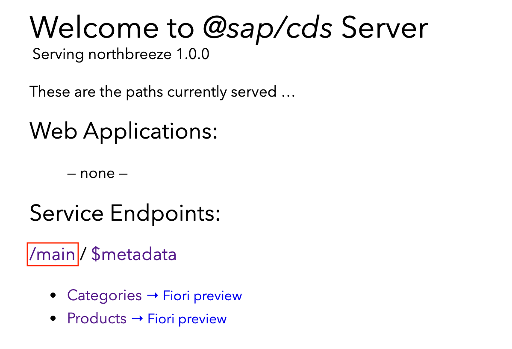

## Details
### You will learn
- How OData metadata navigation properties work
- How to define relationships between entities in CDS
- What those relationships look like in an OData context

This tutorial assumes you've completed the tutorial [Define a Simple Data Model and OData Service with CDS](odata-05-data-model-service). If you've done, you'll have a brand new OData service `Northbreeze` of your own to use. However, it's still rather simple, with just a single entity.

In this tutorial, you'll first study the relationship between products and categories in the Northwind OData V4 service. Then, in your own service, you'll add a second entity at the `db/` layer and define a relation between it and the first entity. You'll then expose this second entity at the `srv/` layer and examine what this looks like from an OData metadata and operations perspective. Finally, you'll build a relationship between those two entities, add some data, and check that everything works as intended.

Before you start, open up the workspace in the SAP Business Application Studio (App Studio) dev space you were using in the previous tutorial, ready to extend the CDS definitions you have so far.

---

[ACCORDION-BEGIN [Step N: ](Take a look at the Northwind Product / Category relationship)]

In the [previous tutorial in this group](odata-05-data-model-service), you added a cut down version of the `Product` entity type. If you examine [Northwind's metadata document](https://services.odata.org/V4/Northwind/Northwind.svc/$metadata), you should see that this entity type actually has relationships with three other entity types - look for the `NavigationProperty` elements in this extract from the metadata document (some of the `Property` elements have been omitted for brevity):

```XML
<EntityType Name="Product">
  <Key>
    <PropertyRef Name="ProductID"/>
  </Key>
  <Property xmlns:p5="http://schemas.microsoft.com/ado/2009/02/edm/annotation" Name="ProductID" Type="Edm.Int32" Nullable="false" p5:StoreGeneratedPattern="Identity"/>
  <Property Name="ProductName" Type="Edm.String" Nullable="false" MaxLength="40"/>
  <Property Name="SupplierID" Type="Edm.Int32"/>
  <Property Name="CategoryID" Type="Edm.Int32"/>
  <Property Name="UnitsInStock" Type="Edm.Int16"/>
  <NavigationProperty Name="Category" Type="NorthwindModel.Category" Partner="Products">
    <ReferentialConstraint Property="CategoryID" ReferencedProperty="CategoryID"/>
  </NavigationProperty>
  <NavigationProperty Name="Order_Details" Type="Collection(NorthwindModel.Order_Detail)" Partner="Product"/>
  <NavigationProperty Name="Supplier" Type="NorthwindModel.Supplier" Partner="Products">
    <ReferentialConstraint Property="SupplierID" ReferencedProperty="SupplierID"/>
  </NavigationProperty>
</EntityType>
```

Let's focus on the relationship to the `Category` entity type, defined in the corresponding `NavigationProperty` element. Here's what that looks like, with some added whitespace for readability:

```xml
<NavigationProperty
  Name="Category"
  Type="NorthwindModel.Category"
  Partner="Products">
  <ReferentialConstraint
    Property="CategoryID"
    ReferencedProperty="CategoryID"/>
</NavigationProperty>
```

Digging into the [Navigation Property section of the OData V4 standards document](http://docs.oasis-open.org/odata/odata/v4.0/errata03/os/complete/part3-csdl/odata-v4.0-errata03-os-part3-csdl-complete.html#_Toc453752536) we can better understand what this declaration is telling us. Here's what we can work out together, at a high level:

The navigation property

- is on the `Product` entity type
- is itself called `Category`
- leads to the `Category` entity type
- has a corresponding path back from a `Category` entity to entities of this `Product` entity type via a `Products` path (this is defined in the optional `Partner` attribute here)

Furthermore, the `ReferentialConstraint` element declares that the relationship between the two entities is built upon the `CategoryID` property in each case.

That's great to know from a theory perspective, but what does this mean in practical terms?

Well, for starters, it means that we can use the relationship defined to find out the details of the category for a product. For example, taking the first Northwind product, we can navigate to the corresponding category. We can even request the product _and_ category information together.

Here are three relative URLs, and the default JSON representations of those URLs, that demonstrate this:

A read of the first Northwind product, via <a href="https://services.odata.org/V4/Northwind/Northwind.svc/Products(1)">/Products(1)</a>:

```JSON
{
  "@odata.context": "https://services.odata.org/V4/Northwind/Northwind.svc/$metadata#Products/$entity",
  "ProductID": 1,
  "ProductName": "Chai",
  "SupplierID": 1,
  "CategoryID": 1,
  "QuantityPerUnit": "10 boxes x 20 bags",
  "UnitPrice": 18,
  "UnitsInStock": 39,
  "UnitsOnOrder": 0,
  "ReorderLevel": 10,
  "Discontinued": false
}
```

Here, we only see the value of the `CategoryID` property (`1`), but none of the details of the category itself.

We can ask to see all the information on the category for that product, with <a href="https://services.odata.org/V4/Northwind/Northwind.svc/Products(1)/Category">/Products(1)/Category</a>:

```JSON
{
  "@odata.context": "https://services.odata.org/V4/Northwind/Northwind.svc/$metadata#Categories/$entity",
  "CategoryID": 1,
  "CategoryName": "Beverages",
  "Description": "Soft drinks, coffees, teas, beers, and ales",
  "Picture": "FRwvAAIA..."
}
```

> From a path info perspective, this (`/Products(1)/Category`) is nothing special; it's just the same as specifying a normal (non-navigation) property, such as `ProductName`, like this: <a href="https://services.odata.org/V4/Northwind/Northwind.svc/Products(1)/ProductName">`/Products(1)/ProductName`</a>

And this is an example of a request for product _and_ category information to be returned in the same resource representation, using the OData system query option `$expand`: <a href="https://services.odata.org/V4/Northwind/Northwind.svc/Products(1)?$expand=Category">/Products(1)?$expand=Category</a>:

```JSON
{
  "@odata.context": "https://services.odata.org/V4/Northwind/Northwind.svc/$metadata#Products/$entity",
  "ProductID": 1,
  "ProductName": "Chai",
  "SupplierID": 1,
  "CategoryID": 1,
  "QuantityPerUnit": "10 boxes x 20 bags",
  "UnitPrice": 18,
  "UnitsInStock": 39,
  "UnitsOnOrder": 0,
  "ReorderLevel": 10,
  "Discontinued": false,
  "Category": {
    "CategoryID": 1,
    "CategoryName": "Beverages",
    "Description": "Soft drinks, coffees, teas, beers, and ales",
    "Picture": "FRwvAAIA..."
  }
}
```

[VALIDATE_1]
[ACCORDION-END]


[ACCORDION-BEGIN [Step N: ](Take a look at the Northwind Category -> Product relationship)]

To balance things out, let's take a brief look at the other entity type in this relationship - and that's the `Category` entity type. Here's what the definition looks like in the metadata document:

```XML
<EntityType Name="Category">
  <Key>
    <PropertyRef Name="CategoryID"/>
  </Key>
  <Property Name="CategoryID" Type="Edm.Int32" Nullable="false" p5:StoreGeneratedPattern="Identity" xmlns:p5="http://schemas.microsoft.com/ado/2009/02/edm/annotation"/>
  <Property Name="CategoryName" Type="Edm.String" Nullable="false" MaxLength="15"/>
  <Property Name="Description" Type="Edm.String" MaxLength="max"/>
  <Property Name="Picture" Type="Edm.Binary" MaxLength="max"/>
  <NavigationProperty
    Name="Products"
    Type="Collection(NorthwindModel.Product)"
    Partner="Category"/>
</EntityType>
```

Of course, our gaze falls immediately upon the single `NavigationProperty` here, which is `Products`, the "other end of the connection" to what we looked at in the previous step.

Notice here that in contrast to the type defined for the `NavigationProperty` in the previous step, the type defined for this one is a [built-in abstract type](http://docs.oasis-open.org/odata/odata/v4.0/errata03/os/complete/part3-csdl/odata-v4.0-errata03-os-part3-csdl-complete.html#_Toc453752518) - a collection of zero or more entities of the type `NorthwindModel.Product`.

Thinking about what this data model is about, this makes sense, of course. There are categories, and there are products that belong to categories. There may be many products belonging to a single category (say, <a href="https://services.odata.org/V4/Northwind/Northwind.svc/Categories(1)">Beverages</a>), and there may theoretically also be categories for which there are no products. Note also that a product can only belong to a single category here.

This is a relationship that might be commonly expressed like this:

```
+------------+                +------------+
| Categories | 1 ------- 0..N |  Products  |
+------------+                +------------+
```

Before moving on to start creating a relationship like this in our own `Northbreeze` OData service, let's just try out an OData query operation on Northwind that uses this `NavigationProperty` that we've been looking at, and that is a count of the products in the seventh category ("Produce"): <a href="https://services.odata.org/V4/Northwind/Northwind.svc/Categories(7)/Products/$count">/Categories(7)/Products/$count</a>. This should return a simple numeric value (which is 5, at the time of writing).

Staying with Northwind, let's look at the details for the seventh category next, including a list of products in that category <a href="https://services.odata.org/V4/Northwind/Northwind.svc/Categories(7)?$expand=Products">/Categories(7)?$expand=Products</a> (only a couple of the products are shown in this sample output, for brevity):

```JSON
{
  "@odata.context": "https://services.odata.org/V4/Northwind/Northwind.svc/$metadata#Categories/$entity",
  "CategoryID": 7,
  "CategoryName": "Produce",
  "Description": "Dried fruit and bean curd",
  "Picture": "FRwvA...",
  "Products": [
    {
      "ProductID": 7,
      "ProductName": "Uncle Bob's Organic Dried Pears",
      "SupplierID": 3,
      "CategoryID": 7,
      "QuantityPerUnit": "12 - 1 lb pkgs.",
      "UnitPrice": 30,
      "UnitsInStock": 15,
      "UnitsOnOrder": 0,
      "ReorderLevel": 10,
      "Discontinued": false
    },
    {
      "ProductID": 14,
      "ProductName": "Tofu",
      "SupplierID": 6,
      "CategoryID": 7,
      "QuantityPerUnit": "40 - 100 g pkgs.",
      "UnitPrice": 23.25,
      "UnitsInStock": 35,
      "UnitsOnOrder": 0,
      "ReorderLevel": 0,
      "Discontinued": false
    }
  ]
}
```

[DONE]
[ACCORDION-END]


[ACCORDION-BEGIN [Step N: ](Add a new Categories entity to your Northbreeze schema)]

Now, it's time to build out your own OData service to reflect a similar relationship. As it's a cut down version of Northwind, and we want to concentrate here on the relationships rather than anything else, you'll only include the category ID, name, and description properties.

Assuming you've your App Studio dev space already open at the workspace you were using in the previous tutorial (see the instructions at the top of this tutorial), open up a terminal (menu path **Terminal** > **New Terminal**) and start `cds watch`, whereupon you should see some familiar output like this:

```Shell/Bash
user: northbreeze $ cds watch

cds serve all --with-mocks --in-memory?
( watching: cds,csn,csv,ts,mjs,cjs,js,json,properties,edmx,xml,env... )

[cds] - model loaded from 2 file(s):

  ../db/schema.cds
  ../srv/service.cds

[cds] - using bindings from: { registry: '~/.cds-services.json' }
[cds] - connect to db > sqlite { database: ':memory:' }
 > filling northbreeze.Products from ../db/data/northbreeze-Products.csv
/> successfully deployed to sqlite in-memory db

[cds] - serving Main { at: '/main' }

[cds] - launched in: 1562.453ms
[cds] - server listening on { url: 'http://localhost:4004' }
[ terminate with ^C ]
```

Using `cds watch` gives you a lovely tight [feedback loop](https://martinfowler.com/articles/developer-effectiveness.html#FeedbackLoops) where you can make changes, observe their effects, make further changes, and experience the joy of learning-by-doing.

Now, your feedback loop is active, add a new `Categories` entity definition to your `db/schema.cds` file, so that the resulting entire contents looks like this:

```CDS
namespace northbreeze;

entity Products {
    key ProductID    : Integer;
        ProductName  : String;
        UnitsInStock : Integer;
}

entity Categories {
    key CategoryID   : Integer;
        CategoryName : String;
        Description  : String;
}
```

> Again, try to resist the temptation just to copy/paste this new definition, and type it in manually instead to learn more about the support for CDS that App Studio has (via the [SAP CDS Language Support extension](https://www.youtube.com/watch?v=eY7BTzch8w0)).

As soon as the file is saved, you'll see the `cds watch` process restart things. Take a look at the metadata definition to check if you can now see the `Categories` entity type. If you've previously closed the tab for this, remember that you can get to the list of ports that the App Studio is exposing for you in this dev space with the **Ports: Preview** command (use the Command Palette).

Following the link to the preview of port 4004 (which is where we find the CAP Welcome page), and from there the link to the `/main/$metadata` resource, you may be unsurprised to see that your new entity type isn't there:

```XML
<edmx:Edmx xmlns:edmx="http://docs.oasis-open.org/odata/ns/edmx" Version="4.0">
  <edmx:DataServices>
    <Schema xmlns="http://docs.oasis-open.org/odata/ns/edm" Namespace="Main">
      <EntityContainer Name="EntityContainer">
        <EntitySet Name="Products" EntityType="Main.Products"/>
      </EntityContainer>
      <EntityType Name="Products">
        <Key>
          <PropertyRef Name="ProductID"/>
        </Key>
        <Property Name="ProductID" Type="Edm.Int32" Nullable="false"/>
        <Property Name="ProductName" Type="Edm.String"/>
        <Property Name="UnitsInStock" Type="Edm.Int32"/>
      </EntityType>
    </Schema>
  </edmx:DataServices>
</edmx:Edmx>
```

You know why, don't you? Because you haven't yet exposed that entity definition at the **service layer**.

Do that now, by adding a second line to the definition details for the `Main` service in your `srv/service.cds` file, adding a reference to the `Categories` entity, so the entire file then looks like this:

```CDS
using northbreeze from '../db/schema';

service Main {
    entity Products as projection on northbreeze.Products;
    entity Categories as projection on northbreeze.Categories;
}
```

You should notice that `cds watch` restarts things - when that happens, re-request the metadata document in the other tab, and you should then see the new entity type:

```XML
<edmx:Edmx xmlns:edmx="http://docs.oasis-open.org/odata/ns/edmx" Version="4.0">
  <edmx:DataServices>
    <Schema xmlns="http://docs.oasis-open.org/odata/ns/edm" Namespace="Main">
      <EntityContainer Name="EntityContainer">
        <EntitySet Name="Categories" EntityType="Main.Categories"/>
        <EntitySet Name="Products" EntityType="Main.Products"/>
      </EntityContainer>
      <EntityType Name="Categories">
        <Key>
          <PropertyRef Name="CategoryID"/>
        </Key>
        <Property Name="CategoryID" Type="Edm.Int32" Nullable="false"/>
        <Property Name="CategoryName" Type="Edm.String"/>
        <Property Name="Description" Type="Edm.String"/>
      </EntityType>
      <EntityType Name="Products">
        <Key>
          <PropertyRef Name="ProductID"/>
        </Key>
        <Property Name="ProductID" Type="Edm.Int32" Nullable="false"/>
        <Property Name="ProductName" Type="Edm.String"/>
        <Property Name="UnitsInStock" Type="Edm.Int32"/>
      </EntityType>
    </Schema>
  </edmx:DataServices>
</edmx:Edmx>
```

So far so good, right? Well, let's see. Let's add some category data in the next step.

[DONE]
[ACCORDION-END]

[ACCORDION-BEGIN [Step N: ](Add data for the Categories entity)]

In the same way as in the [tutorial that precedes this](odata-05-data-model-service), you should now seed this entity with some data, using the same Comma-Separated Value (CSV) file-based technique as before.

In the `db/data/` directory, next to the existing `northbreeze-Products.csv` file, create a new file `northbreeze-Categories.csv` and save the following content into it (including the header line):

```CSV
CategoryID,CategoryName,Description
1,"Beverages","Soft drinks, coffees, teas, beers, and ales"
2,"Condiments","Sweet and savory sauces, relishes, spreads, and seasonings"
3,"Confections","Desserts, candies, and sweet breads"
4,"Dairy Products","Cheeses"
5,"Grains/Cereals","Breads, crackers, pasta, and cereal"
6,"Meat/Poultry","Prepared meats"
7,"Produce","Dried fruit and bean curd"
8,"Seafood","Seaweed and fish"
```

Back at the CAP Welcome page (the root resource on the exposed port 4004), you can now follow links to both the `Categories` and `Products` entity sets, and see some data for both.

But there's something missing - there's no way to get from a product to a category, or from a category to a list of products.

[DONE]
[ACCORDION-END]

[ACCORDION-BEGIN [Step N: ](Define relationships in your schema)]

While we can retrieve data for both entities, there's no connection yet between them. Let's address that in this step.

We understand what a (two-way) relationship looks like when expressed in OData metadata XML. Now, you're going to define such a relationship at the schema layer in your simple OData service, drawing a link between the `Products` and `Categories` entities. You're going to do this declaratively in CDS, using [Associations](https://cap.cloud.sap/docs/guides/domain-models#associations--structured-models).

Open up the `db/schema.cds` file and add a new property to each of the entities, so that the resulting contents look like this:

```CDS
namespace northbreeze;

entity Products {
    key ProductID    : Integer;
        ProductName  : String;
        UnitsInStock : Integer;
        Category     : Association to Categories;
}

entity Categories {
    key CategoryID   : Integer;
        CategoryName : String;
        Description  : String;
        Products     : Association to many Products
                           on Products.Category = $self;
}
```

> Like before, try to type in manually the definitions for these two new properties `Category` and `Products` to see what the SAP CDS Language Support extension offers here.

You've added a pair of pointers, effectively, but note that they're different:

- the `Category` property is a pointer to a single instance of the `Categories` entity
- the `Products` property is a pointer to zero or more instances of the `Products` entity, and has a qualifying expression to ensure the right relationships

These types of association you've added are "managed" associations, and allow you to remain at the "what you want" level rather than have to descend to the "how you need to achieve it" level. That said, we need to understand what these declarations mean in terms of OData metadata. Let's find out.

On saving this `db/schema.cds` file, you should notice that the `cds watch` process (that you should still have running in your terminal session) should restart things. At this point, go to the CAP Welcome page (served as usual on the exposed port 4004) and retrieve the metadata document again. It should now look something like this:

```XML
<?xml version="1.0"?>
<edmx:Edmx xmlns:edmx="http://docs.oasis-open.org/odata/ns/edmx" Version="4.0">
  <edmx:DataServices>
    <Schema xmlns="http://docs.oasis-open.org/odata/ns/edm" Namespace="Main">
      <EntityContainer Name="EntityContainer">
        <EntitySet Name="Categories" EntityType="Main.Categories">
          <NavigationPropertyBinding Path="Products" Target="Products"/>
        </EntitySet>
        <EntitySet Name="Products" EntityType="Main.Products">
          <NavigationPropertyBinding Path="Category" Target="Categories"/>
        </EntitySet>
      </EntityContainer>
      <EntityType Name="Categories">
        <Key>
          <PropertyRef Name="CategoryID"/>
        </Key>
        <Property Name="CategoryID" Type="Edm.Int32" Nullable="false"/>
        <Property Name="CategoryName" Type="Edm.String"/>
        <Property Name="Description" Type="Edm.String"/>
        <NavigationProperty Name="Products" Type="Collection(Main.Products)" Partner="Category"/>
      </EntityType>
      <EntityType Name="Products">
        <Key>
          <PropertyRef Name="ProductID"/>
        </Key>
        <Property Name="ProductID" Type="Edm.Int32" Nullable="false"/>
        <Property Name="ProductName" Type="Edm.String"/>
        <Property Name="UnitsInStock" Type="Edm.Int32"/>
        <NavigationProperty Name="Category" Type="Main.Categories" Partner="Products">
          <ReferentialConstraint Property="Category_CategoryID" ReferencedProperty="CategoryID"/>
        </NavigationProperty>
        <Property Name="Category_CategoryID" Type="Edm.Int32"/>
      </EntityType>
    </Schema>
  </edmx:DataServices>
</edmx:Edmx>
```

Excellent! We now not only have the definitions of the entity types `Products` and `Categories`, but these definitions also contain appropriate `NavigationProperty` elements describing the two-way relationship between them.

Our extended simple OData service's metadata is now what we want it to be, but there's one more thing to do. While we have an indication of a relationship in the metadata, there's no indication or evidence of that relationship in our (CSV-based) test data.

What do we need to do here? Well, take a closer look at the previous XML. The relationship is qualified by a referential constraint, that refers to a new property (which now also appears as a `Property` element within the `EntityType` definition). That property is `Category_CategoryID`. This has been generated by the managed association and is a clue for us as to what we need to do in the data to bring the actual relationships to life.

[DONE]
[ACCORDION-END]

[ACCORDION-BEGIN [Step N: ](Modify and extend the data for the Products entity)]

In fact, if you look at the `Products` entity set (follow the `Products` hyperlink from the CAP Welcome page), you'll see that this `Category_CategoryID` is indeed a new property, and there are currently no values for it in any of the entities:

```JSON
{
  "@odata.context": "$metadata#Products",
  "value": [
    {
      "ProductID": 1,
      "ProductName": "Chai",
      "UnitsInStock": 39,
      "Category_CategoryID": null
    },
    {
      "ProductID": 2,
      "ProductName": "Chang",
      "UnitsInStock": 17,
      "Category_CategoryID": null
    },
    {
      "ProductID": 3,
      "ProductName": "Aniseed Syrup",
      "UnitsInStock": 13,
      "Category_CategoryID": null
    }
  ]
}
```

Let's rectify that now, and also add more products.

We know that each entity in the [Products entity set in the original Northwind service](https://services.odata.org/V4/Northwind/Northwind.svc/Products) contains a value for the property `CategoryID`; so it's just a case of taking all that data and putting it into our `db/data/northbreeze-Products.csv` file. There's a file associated with this tutorial that's been prepared for you:

<https://raw.githubusercontent.com/SAPDocuments/Tutorials/master/tutorials/odata-06-extend-odata-service/northbreeze-Products.csv>

Open it and copy the entire contents - then use that to replace what you have in `db/data/northbreeze-Products.csv`.

After doing this, the contents of that file should look like this:

```CSV
ProductID,Category_CategoryID,ProductName,UnitsInStock
1,1,"Chai",39
2,1,"Chang",17
3,2,"Aniseed Syrup",13
4,2,"Chef Anton's Cajun Seasoning",53
5,2,"Chef Anton's Gumbo Mix",0
6,2,"Grandma's Boysenberry Spread",120
7,7,"Uncle Bob's Organic Dried Pears",15
8,2,"Northwoods Cranberry Sauce",6
9,6,"Mishi Kobe Niku",29
...
```

Note that in the header line, we've the property names - they should match the names of the properties in the entity; this includes the link to the `Categories` entity, that is, this new `Category_CategoryID` field.

On saving the file, you should again see the `cds watch` process restart things, and also (as before) a successful loading of data, indicated by these two lines in the log output:

```Shell/Bash
> filling northbreeze.Categories from ../db/data/northbreeze-Categories.csv
> filling northbreeze.Products from ../db/data/northbreeze-Products.csv
```

Go back to the `Products` entity set in your service that you were looking at in the previous step, and re-request it. You should now see not only more products, but also that there's a value for the `Category_CategoryID` properties in each of the entities. Here's a cut down version of what you should see:

```JSON
{
  "@odata.context": "$metadata#Products",
  "value": [
    {
      "ProductID": 1,
      "ProductName": "Chai",
      "UnitsInStock": 39,
      "Category_CategoryID": 1
    },
    {
      "ProductID": 2,
      "ProductName": "Chang",
      "UnitsInStock": 17,
      "Category_CategoryID": 1
    },
    {
      "ProductID": 3,
      "ProductName": "Aniseed Syrup",
      "UnitsInStock": 13,
      "Category_CategoryID": 2
    }
  ]
}
```

That looks good!

[DONE]
[ACCORDION-END]


[ACCORDION-BEGIN [Step N: ](Exercise the new relationships in your OData service)]

Let's use this final step to check if we can now explore the relationship between the two entities in our simple `Northbreeze` OData service. Why don't we use the same approach and set of requests from the first step in this tutorial?

All of these request URLs will be based on and relative to your `Northbreeze` OData service document - use the CAP Welcome page to get to that service document, and then append each of the relative path info examples onto that.

In other words, in the CAP Welcome page, select the "main" hyperlink from the `/main/$metadata` line directly following the "Service Endpoints" heading:



This should take you to the service document, with a URL that looks similar to this:

`https://workspaces-ws-0rval-app1.eu10.trial.applicationstudio.cloud.sap/main`

All paths you use in the rest of this step should be relative to (that is, appended to) this service document URL.

Let's start by requesting just the first `Northbreeze` product, via `/Products(1)`

```JSON
{
  @odata.context: "$metadata#Products/$entity",
  ProductID: 1,
  ProductName: "Chai",
  UnitsInStock: 39,
  Category_CategoryID: 1
}
```

Here, we only see the value of the `Category_CategoryID` property (`1`), but none of the details of the category itself.

We can ask to see all the information on the category for that product, with `/Products(1)/Category`:

```JSON
{
  @odata.context: "../$metadata#Categories/$entity",
  CategoryID: 1,
  CategoryName: "Beverages",
  Description: "Soft drinks, coffees, teas, beers, and ales"
}
```

And this is the product _and_ category example request again, a request where we expect information from both entities to be returned in the same resource representation, using the `$expand` OData system query option `/Products(1)?$expand=Category`:

```JSON
{
  "@odata.context": "$metadata#Products(Category())/$entity",
  "ProductID": 1,
  "ProductName": "Chai",
  "UnitsInStock": 39,
  "Category_CategoryID": 1,
  "Category": {
    "CategoryID": 1,
    "CategoryName": "Beverages",
    "Description": "Soft drinks, coffees, teas, beers, and ales"
  }
}
```

As you can see, your simple OData service is looking great. With just a few lines of declarative schema definitions, plus pass-through exposure of the entities in a minimal service definition, and some CSV based data, you've yourself a fully functioning OData service.

Congratulations!

[DONE]
[ACCORDION-END]
