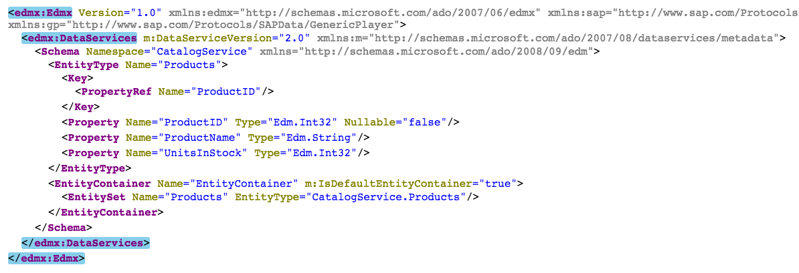
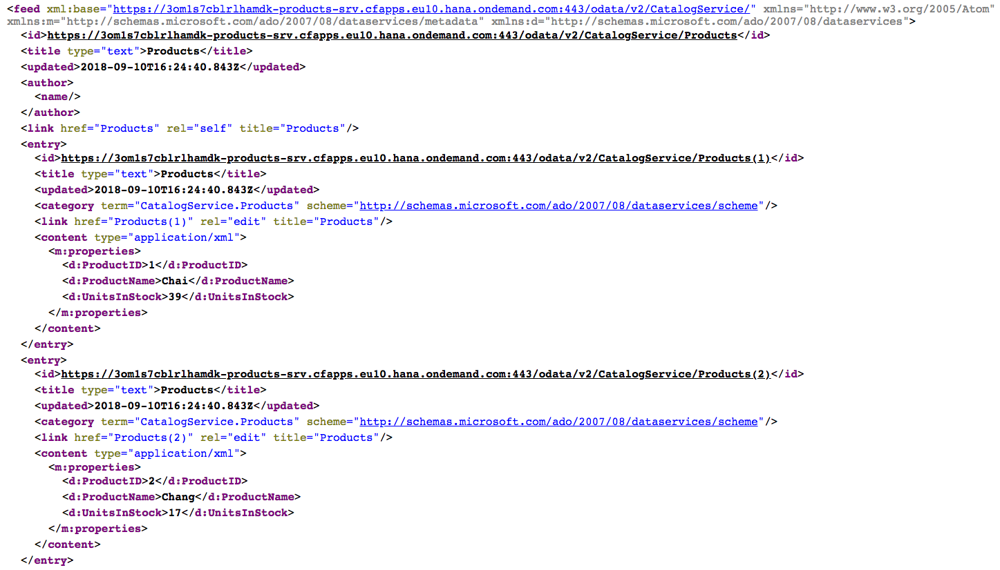

## Details
### You will learn
- How to use the SQL Console
- How to import data from a CSV source
- How your generated OData service supports standard OData query operation parameters

This tutorial assumes you've completed the tutorial [Add Data to your OData Service](https://developers.sap.com/tutorials/odata-06-add-data-odata-service.html). At this stage you have your generated OData service and you've populated it with some sample product data, either data of your own, or from the Northwind data set. It's now time to explore your OData service to see that it functions, out of the box, just like any other.

> In this tutorial and others the general name "SAP Web IDE" is used. Specifically, the "Full-Stack" version is implied throughout.

---

[ACCORDION-BEGIN [Step 1: ](Start up the SAP Web IDE)]

Access SAP Web IDE from your trial SAP Cloud Platform cockpit. Use the details in the tutorial [Enable the SAP Web IDE Full Stack](https://developers.sap.com/tutorials/webide-multi-cloud.html) to find out how to access it, or simply invoke it using a URL which will look like this:

`https://webidecp-XYZ.dispatcher.hanatrial.ondemand.com/`

Here, `XYZ` represents your trial subaccount name, such as `p999999trial`.

You can find out more about accessing the SAP Web IDE in the Help Portal, specifically in the "[Open SAP Web IDE](https://help.sap.com/viewer/825270ffffe74d9f988a0f0066ad59f0/CF/en-US/51321a804b1a4935b0ab7255447f5f84.html)" section.

[DONE]
[ACCORDION-END]

[ACCORDION-BEGIN [Step 2: ](Remove any existing data)]

It's quite likely that you've only entered a few products in the preceding prerequisite tutorial. In this case, the query operations you'll be carrying out won't return very much data. To make it more interesting, you will import all of Northwind's products in this step.

Before importing data, it's best to remove any existing data that you've entered.

Do this by using the **SQL Console** in the **Database Explorer** perspective. Use the **Open SQL Console** button as indicated, then enter the following statement into the console and execute it.

```
delete from my_app_products;
```


On execution, you should see a message similar to the following:

```
Statement 'delete from my_app_products'
executed in 2 ms - Rows Affected: 3
```

[DONE]
[ACCORDION-END]

[ACCORDION-BEGIN [Step 3: ](Import fresh Northwind data)]

You can import the Northwind product data by providing a couple of files -- a CSV file containing the data, and a file that defines the data source and how the fields map between the data source and the target table in the database.

Back in the Development perspective, within the `db/src` folder, find or create a new folder called **`csv`**. If the folder was already there, it may contain some CSV files (such as `my.bookshop-Authors.csv`). These were generated when you created the project; you don't need them so delete the existing CSV files before proceeding.

Import into this new folder the following two files:

- [`Products.csv`](https://raw.githubusercontent.com/SAPDocuments/Tutorials/master/tutorials/odata-07-explore-generated-odata-service/csv/Products.csv): Product data in CSV format
- [`Data.hdbtabledata`](https://raw.githubusercontent.com/SAPDocuments/Tutorials/master/tutorials/odata-07-explore-generated-odata-service/csv/Data.hdbtabledata): Definition of data source and field mappings

> Make sure you choose the `src` folder within the `db` folder, not the one within the `srv` folder.


When you've done this, you should see these files in the explorer, thus:


Now you can rerun the database build facility that will recognize the new artifacts and import the data automatically. To do this, use the context menu on the **`db`** folder and choose menu path **Build** > **Build**.

> If you check in the Console during or after this operation, you'll see references to the `Products.csv` and `Data.hdbtabledata` files being recognized and processed accordingly.

You should now have quite a few products in your table, plenty to explore with OData queries!

[VALIDATE_3]
[ACCORDION-END]


[ACCORDION-BEGIN [Step 4: ](Try out a few OData queries on your service)]

You're all set. Your OData service should respond to you in a way that feels completely familiar. In this step, put it through its paces by constructing some query operations.

Before you do, make sure the OData service, in the form of the Java app in the `srv` folder, is still running. Open the Run Console with menu path **View** > **Run Console**. If the service is running, you'll see the URL as before. If not, use the green **Run** button on the far right to restart it. What you'll see should look something like this:


Like you did in previous prerequisite tutorials, follow the URL to find your OData service's service document. The URL should look something like this:

`https://3om1s7cblrlhamdk-products-srv.cfapps.eu10.hana.ondemand.com/odata/v2/CatalogService`

> The first part of the URL is generated and will look different in your case.

### Service metadata

Append **`/$metadata`** to the end of the service document URL to look at the OData service's metadata:

`https://3om1s7cblrlhamdk-products-srv.cfapps.eu10.hana.ondemand.com/odata/v2/CatalogService/$metadata`

You should see something like this, where you can see that the name of the entity set is `Products`:



> In this case the name of the entity set is the same name as the entity type.


### Products

Ask for the `Products` entity set by **replacing `$metadata` with `Products`** in the URL:

`https://3om1s7cblrlhamdk-products-srv.cfapps.eu10.hana.ondemand.com/odata/v2/CatalogService/Products`

You should see an XML formatted list of products, like this:



Request the same resource but in a different representation -- JavaScript Object Notation (JSON) -- with the $format system query option:

`https://3om1s7cblrlhamdk-products-srv.cfapps.eu10.hana.ondemand.com/odata/v2/CatalogService/Products?$format=json`

### Low stock products

Ask to see those products where the stock is very low, with the $filter system query option:

`https://3om1s7cblrlhamdk-products-srv.cfapps.eu10.hana.ondemand.com/odata/v2/CatalogService/Products?$format=json&$filter=UnitsInStock lt 5`

> When you enter this in your browser, any spaces will be URL encoded into `%20` values.

Rather than read through the resulting payload to find out how many there are, ask directly, with `$count`:

`https://3om1s7cblrlhamdk-products-srv.cfapps.eu10.hana.ondemand.com/odata/v2/CatalogService/Products/$count?$filter=UnitsInStock lt 5`

> The `$format` system query option cannot be used with `$count` so it has been removed from this query.


### Product with largest stock

Ask to see the product with the largest amount of units in stock:

`https://3om1s7cblrlhamdk-products-srv.cfapps.eu10.hana.ondemand.com/odata/v2/CatalogService/Products?$orderby=UnitsInStock desc&$top=1`

As you can see, the OData service, for which you haven't had to write a single line of code, is performing as expected. Feel free to explore more standard OData features, perhaps those that you discovered in the [Learn about OData Fundamentals](https://developers.sap.com/tutorials/odata-01-intro-origins.html) tutorial. Good luck!

[VALIDATE_4]
[ACCORDION-END]

