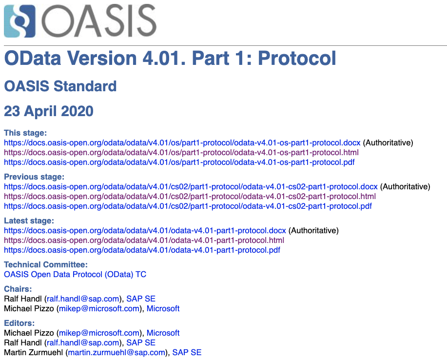

# Get to know the OData standards resources on the Web

<!-- description --> Get acquainted with the OData standards and how to navigate them.

## You will learn

- What the important Web based resources are for OData
- How to make sense of them

## Intro

There are myriad resources on the Web about OData. After all, it's a standard
that's been around since 2007. There are some key resources that are important
to know about, and in this tutorial, you'll find out about them and become more
comfortable navigating them.

---

### Understand OASIS and its role

OASIS is one of the world's foremost non-profit standards bodies, and is a
destination for the discussion, management and standardization of open
protocols, such as OData. Within OASIS there are various programmes, one of
which is the set of [Projects and Technical
Committees](https://www.oasis-open.org/projects-committees/).

Within the context of a Technical Committee, specifications are developed in
the open, following a lightweight process of review, feedback, approval and
publication. There is a Technical Committee in OASIS for OData - the [OASIS
Open Data Protocol (OData)
TC](https://groups.oasis-open.org/communities/tc-community-home2?CommunityKey=e7cac2a9-2d18-4640-b94d-018dc7d3f0e2).

### Take a first look at the technical work produced by the OData TC

The OData TC page lists various work products in the section titled "Technical
Work Produced by the Committee" on [the main OData TC
page](https://groups.oasis-open.org/communities/tc-community-home2?CommunityKey=e7cac2a9-2d18-4640-b94d-018dc7d3f0e2).

That list can be somewhat overwhelming at first, which is partly due to:

- OData's considerable core scope
- use of other adjacent standards
- a dedicated attention to detail
- the protocol's inherent extensibility

It is also due to the review, feedback, approval and publication process.
Although relatively lightweight, this process does mean that there are various
stages that documents can be in, defined briefly in the process's
[Specification
Lifecycle](https://docs.oasis-open.org/templates/TCHandbook/content/tcprocess/standardsapprovalprocess/specificationlifecycle.htm).
Such document stages are in this [OASIS
Documents](https://github.com/qmacro/odata-specs/blob/master/overview.md)
resource which attempts to show the stages and progress of key OData standards
documents over time.

In that resource one can see the various stages represented, such as "cs" for
Committee Specification, "cos" for Candidate OASIS Standard, "os" for OASIS
Standard, and so on, stage identifiers that form part of the work product
document's official name, such as:

<https://docs.oasis-open.org/odata/odata/v4.01/os/part1-protocol/odata-v4.01-os-part1-protocol.html>

Looking at this document as a typical example, what can we discern? Well:

- it is in an HTML format
- it represents part 1 of the OData standard
- that standard being at version 4.01 (the latest)
- that part being about the protocol (as opposed to the URL conventions, in
  this case)

We'll come back to this particular document later on in this tutorial.

### Get an overview of the OData standards documents

Going back to the list of work products, let's enumerate them and think
briefly about what they are. Doing this is important if we want to be able
to make sense of them, to navigate between and within them, and ultimately
to find whatever we're looking for.

Open up the [OData TC
page](https://groups.oasis-open.org/communities/tc-community-home2?CommunityKey=e7cac2a9-2d18-4640-b94d-018dc7d3f0e2)
in a window separate to this one and jump to the [Technical Work Produced by
the
Committee](https://groups.oasis-open.org/communities/tc-community-home2?CommunityKey=e7cac2a9-2d18-4640-b94d-018dc7d3f0e2#technical)
section, ready to scroll through it as you work through this section.

#### The main standard

There's the main standard itself, the "OData Version 4.01 OASIS Standard".
This comprises three distinct parts:

- OData Version 4.01 Part 1: Protocol
- OData Version 4.01 Part 2: URL Conventions
- ABNF components: OData ABNF Construction Rules Version 4.01 and OData ABNF
  Test Cases Version 4.01

The [Augmented Backus-Naur
form](https://en.wikipedia.org/wiki/Augmented_Backus%E2%80%93Naur_form) (ABNF)
resource is the formal grammar of the OData protocol as described, in a form
(ABNF) which is common for such protocol format descriptions. There's the
grammar itself in one file, and a series of test cases for the grammar in
another. It's rare that you'll need to consult this.

The other two documents that form the main standard, Parts 1 and 2, are where
most things in this OData mission, and most things that you'll encounter in
normal circumstances when working with OData, are described.

Notice that each of these documents is available in different formats:

- an authorititave source format
- other formats (downstream from the source format)

In this case, the authoritative source format for parts 1 and 2 is `.docx`, but
in other OData standards documents cases, it is sometimes `.md`. Practically,
one can use the `.html` format, as `.docx` is not compatible with the open Web.

#### CSDL as a supporting standard

Alongside the main standard there are supporting standards, the first one of
which is expressed in a pair of documents:

- OData Common Schema Definition Language (CSDL) JSON Representation Version
  4.01 OASIS Standard
- OData Common Schema Definition Language (CSDL) XML Representation Version
  4.01 OASIS Standard

These describe two representations of Common Schema Definition Language (CSDL),
and we might be most familiar with the XML representation of CSDL, in that it's
the EDMX in OData service metadata documents, such as [the one for the
Northwind service we looked at in the previous
tutorial](https://services.odata.org/V4/Northwind/Northwind.svc/$metadata).
Each of these documents is also available in multiple formats, again, the
`.docx` format being authoritative.

#### JSON format as a supporting standard

Next in the list of supporting standards is:

- OData JSON Format Version 4.01 OASIS Standard

This is the formal description of the JSON format used to represent resources
such as entities and entity sets transmitted and received in the context of
OData operations. In other words, it describes everything we need to know (and
more) about OData JSON payloads. In earlier versions of the OData standard, a
version of the XML-based Atom Syndication Format was used, but this has been
largely superseded by this JSON format.

#### Extension standards

The OData standard is extensible, and in that context, the next two standards
documents listed in the work products section are in this category:

- OData Extension for Data Aggregation Version 4.0 Committee Specification 03
- OData Extension for Temporal Data Version 4.0 Committee Specification 01

Note that in addition to the multiple formats available for each extension
standard, there are supplemental parts; as for the main OData standard, there's
a pair of ABNF components (grammar construction rules, and test cases), and
there's also a vocabulary, expressed in EDMX (and other formats) and containing
annotation definitions relating to the given extension, definitions to be used
in OData service metadata documents.

#### Other supporting standards

There is one more standard listed in the work products, that describes a method
for retrying unsafe requests without incurring unintended side-effects. This
is:

- Repeatable Requests Version 1.0 Committee Specification 01

By now, we know the drill. This is a standards document that is available in
various formats, and in the lifecycle it is at the first iteration of the
Committee Specification stage, i.e. "cs01".

#### Lifecycle stage identifiers

In each case, the URLs pointing to the standards resources contain a path info
section that indicates the stage that resource is in. The stage also appears in
the final "filename" section of the URL. Let's have a look at the relative path
info sections of the URLs representing the authoritative sources for each of
the standards we've seen.

First, there are the main standards:

- `/odata/odata/v4.01/os/part1-protocol/odata-v4.01-os-part1-protocol.docx`
- `/odata/odata/v4.01/os/part2-url-conventions/odata-v4.01-os-part2-url-conventions.docx`
- `/odata/odata/v4.01/os/abnf/`
- `/odata/odata-csdl-json/v4.01/os/odata-csdl-json-v4.01-os.docx`
- `/odata/odata-csdl-xml/v4.01/os/odata-csdl-xml-v4.01-os.docx`
- `/odata/odata-json-format/v4.01/os/odata-json-format-v4.01-os.docx`

These are all "OASIS Standard" documents, with the "os" stage identifier.

Here are the rest of the standards:

- `/odata/odata-data-aggregation-ext/v4.0/cs03/odata-data-aggregation-ext-v4.0-cs03.md`
- `/odata/odata-temporal-ext/v4.0/cs01/odata-temporal-ext-v4.0-cs01.docx`
- `/odata/repeatable-requests/v1.0/cs01/repeatable-requests-v1.0-cs01.docx`

All these are at various iteration levels of the "Committee Specification"
stage ("cs"), with the extension for data aggregation being at level 03, and
the other two being at level 01.

### Explore the document URL chains

We now know about the different technical work artifacts and how they are
manifested, with the document URLs, each of which:

- describes a specific part of the overall OData standard
- tied to a particular specification lifecycle stage
- is in a format indicated in the URL

Now, as a final step in learning about the OData standards resources, we should
make sure we understand the myriad specification URLs at the top of any given
document.

By way of an example, visit the (HTML version of the) [OData Version 4.01 Part
1:
Protocol](https://docs.oasis-open.org/odata/odata/v4.01/os/part1-protocol/odata-v4.01-os-part1-protocol.html).
The first section looks like this:



There are a lot of URLs here! But the pattern is straightforward, and discerning
it is straightforward given what we now know. We should start by noticing the three
groups:

- This stage
- Previous stage
- Latest stage

The URLs are there to allow the navigation forwards and backwards through time, through
the different specification lifecycle stages the given document has been through.

> We should ignore the `.docx` and `.pdf` formats for the purposes of this
> exploration, and focus only on the `.html` format, for easy navigation. Note
> that the screenshot shows these HTML links with the standard "visited" color
> purple (as opposed to the standard blue of "unvisited" links), indicating that
> these are indeed the key links that have been navigated, while this section of
> the tutorial being written.

The URLs for the "Latest stage" links do not contain any specification
lifecycle indicators, and so can and should be used to generically and
canonically refer to the latest stage version of the document in question.

The URLs for the links in the "This stage" and "Previous stage" sections do
contain specification lifecycle indicators, and as such, are pointers to
specific stage versions.

Thus requesting the resource at either of these two URLs ... will result in the
same resource content:

- <https://docs.oasis-open.org/odata/odata/v4.01/odata-v4.01-part1-protocol.html>
- <https://docs.oasis-open.org/odata/odata/v4.01/os/part1-protocol/odata-v4.01-os-part1-protocol.html>

Following the "Previous stage" HTML link:

- <https://docs.oasis-open.org/odata/odata/v4.01/cs02/part1-protocol/odata-v4.01-cs02-part1-protocol.html>

leads to an earlier specification lifecycle stage (Committee Specification 02),
which, in turn, via its own "Previous stage" link, leads to the next earliest,
which is at the specification lifecycle stage with the indicator "csprd06" -
Committee Specification / Public Review Draft 06:

- <https://docs.oasis-open.org/odata/odata/v4.01/csprd06/part1-protocol/odata-v4.01-csprd06-part1-protocol.html>

And so on, back in time.

We can visualize the "This", "Previous" and "Latest" link sets for the "OData
Version 4.01 Part 1: Protocol" document like this:

```text
+--------------+    +--------------------------------------+
|              |    |                                      |
|    Latest    |--->|           OASIS Standard             |
|    stage     |    |                                      |
|              |    |                                      |
+--------------+    +--------------------------------------+
                                       |
                                    previous
                                       V
                    +--------------------------------------+
                    |                                      |
                    |     Committee Specification 02       |
                    |                                      |
                    |                                      |
                    +--------------------------------------+
                                       |
                                    previous
                                       V
                    +--------------------------------------+
                    |                                      |
                    |   Committee Specification Draft 06   |
                    |      / Public Review Draft 06        |
                    |                                      |
                    +--------------------------------------+
                                       |
                                    previous
                                       V
                    +--------------------------------------+
                    |                                      |
                    |   Committee Specification Draft 05   |
                    |      / Public Review Draft 05        |
                    |                                      |
                    +--------------------------------------+
                                       |
                                    previous
                                       V
                    +--------------------------------------+
                    |                                      |
                    |     Committee Specification 01       |
                    |                                      |
                    |                                      |
                    +--------------------------------------+
                                       |
                                    previous
                                       V
                    +--------------------------------------+
                    |                                      |
                    |                 ...                  |
                    |                                      |
                    |                                      |
                    +--------------------------------------+
```

## Further info

- [Guidelines for Visualizing Links](https://www.nngroup.com/articles/guidelines-for-visualizing-links/)
- [OASIS document tree](https://github.com/qmacro/odata-specs/blob/master/overview.md)
- [OData Vocabularies](https://github.com/oasis-tcs/odata-vocabularies)
