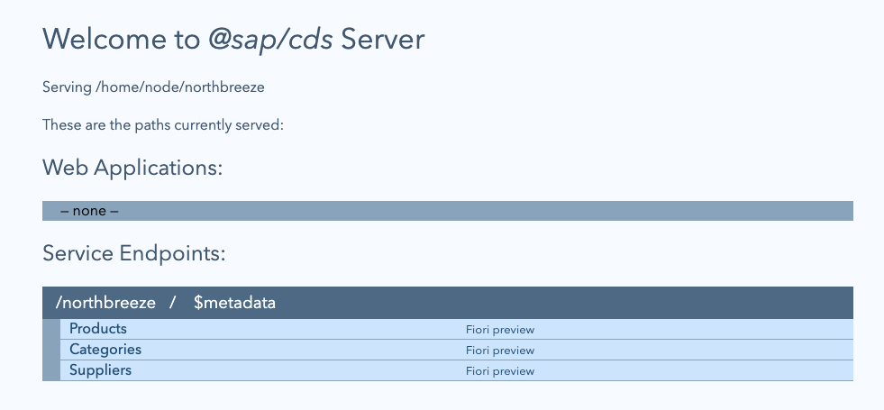

# Set up your own OData service

<!-- description --> Get your own OData service up and running.

## You will learn

- How CAP can effortlessly provide OData services

## Intro

In order to take you through various OData concepts in the [OData Deep Dive](https://developers.sap.com/mission.odata-deep-dive.html) mission, we'll need an OData service. Running your own instance of the OData service upon which subsequent tutorials in this mission are based means that you can explore & try out more than read-only concepts. The OData service is deliberately simple and is called Northbreeze, because it's based upon, and a cut down version, of the original [Northwind](https://services.odata.org/V4/Northwind/Northwind.svc/) service.

The service is provided by a CAP server, and the definition is in a publicly available repository, along with the definition of a container image.

You will need:

- A Docker engine (in the form of Docker Desktop, Podman, or similar)

> This tutorial is a work-in-progress; further updates need to include:
>
> - Making multi-arch images available
> - Running as a dev container in VS Code and GitHub Codespaces
> - Running in an SAP Business Application Studio dev space
>
> In the meantime, you can simply clone the repository that has the source for the container image and the CAP-based OData service and run it yourself, locally.

---

### Inspect the source for the OData service

The OData service is deliberately simple and contains a small handful of entities in the domain model, and a single service made available via the OData V4 protocol.

Head to <https://github.com/qmacro/northbreeze> and take a look around, especially in the CAP project directory [northbreeze](https://github.com/qmacro/odata-dd-server/tree/main/northbreeze).

### Run as a Docker container

Use the `docker` command line tool to pull the image which contains the Northbreeze CAP server, and run a container based upon it:

```shell
docker run \
  --rm \
  --tty \
  --publish 4004:4004 \
  ghcr.io/qmacro/northbreeze
```

This should first emit `docker` output:

```log
Unable to find image 'ghcr.io/qmacro/northbreeze:latest' locally
latest: Pulling from qmacro/northbreeze
c74c1b58c0fe: Pull complete
599d5b6b6766: Extracting [===>] ...
c9b629762372: ...
Digest: sha256:c2678197eb57da768edee4184901be3fa96d4c894a3396d09a2e5e36a1c91c42
Status: Downloaded newer image for ghcr.io/qmacro/northbreeze:latest
```

Then the CAP server output should appear:

```log
cds serve all --with-mocks --in-memory?
( live reload enabled for browsers )

        ___________________________

[cds] - loaded model from 2 file(s):

  northbreeze/srv/main.cds
  northbreeze/db/schema.cds

[cds] - using bindings from: { registry: '~/.cds-services.json' }
[cds] - connect to db > sqlite { database: ':memory:' }
  > init from northbreeze/db/data/northbreeze-Suppliers.csv
  > init from northbreeze/db/data/northbreeze-Products.csv
  > init from northbreeze/db/data/northbreeze-Categories.csv
/> successfully deployed to in-memory database.

[cds] - using auth strategy { kind: 'mocked' }
[cds] - serving Main {
  at: [ '/northbreeze' ],
  decl: 'northbreeze/srv/main.cds:4'
}
[cds] - server listening on { url: 'http://localhost:4004' }
[cds] - server v9.7.0 launched in 260 ms
[cds] - [ terminate with ^C ]
```

At this point, visit <http://localhost:4004>, where the default start page will be displayed:



Links to the Northbreeze OData service document, metadata document, and entitysets for the three available entities are shown.

### Visit the publicly available read-only service

In case you haven't yet got round to running your own instance of the Northbreeze service, there's a publicly available instance that is read-only. So you can try out any of the read-only activities in subsequent tutorials in this mission (for other activities you will have to set up and run your own, as described in this tutorial).

Head over to <https://odd.cfapps.eu10.hana.ondemand.com/> ("odd" is short for "OData Deep Dive") to see the start page, and take a look around.

## Further info

- [Capire](https://cap.cloud.sap/docs/) - the official CAP documentation
