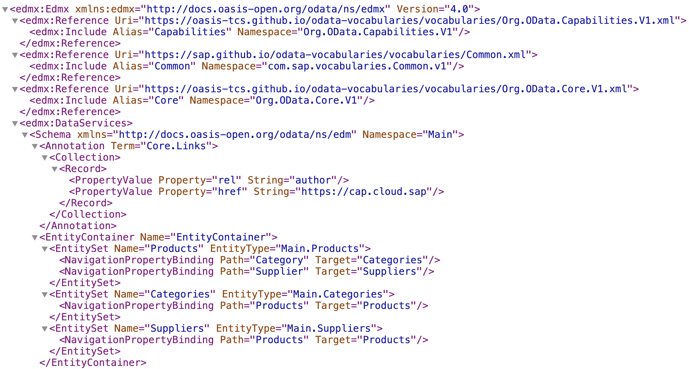

# Learn how to read OData metadata

<!-- description --> Take a tour of a simple metadata document and get to know its key sections.

## You will learn

- What the metadata document looks like
- What it describes
- How to navigate it

## Intro

A key resource in any OData service is its metadata document. In this tutorial you'll take a tour of a simple metadata document (the one for the Northbreeze service introduced in the [previous tutorial in this mission](https://developers.sap.com/tutorials/odata-dd-3-northbreeze.html)).

Throughout this tutorial you should endeavor to use your own instance of the Northbreeze service (see the [previous tutorial](https://developers.sap.com/tutorials/odata-dd-3-northbreeze.html)); for illustration purposes, URLs for the publicly available instance will be used here.

---

### Retrieve the Northbreeze metadata document

Head over to your Northbreeze service and request the metadata document resource. The URL is formed from the OData service root (where the service document is):

<https://odd.cfapps.eu10.hana.ondemand.com/northbreeze>

with `$metadata` added as a further path segment:

<https://odd.cfapps.eu10.hana.ondemand.com/northbreeze/$metadata>

### Take a first look at the content

Initially the content of this resource can be a little overwhelming. Here's what the first part looks like:



But if we [stare at it](https://qmacro.org/blog/posts/2017/02/19/the-beauty-of-recursion-and-list-machinery/#initial-recognition) for long enough, it becomes less overwhelming and we start to see the structure.

### Consider the high level XML structure 

Regard this drastically reduced version of the entire metadata document XML structure:

```xml
<?xml version="1.0" encoding="utf-8"?>
<edmx:Edmx Version="4.0" xmlns:edmx="http://docs.oasis-open.org/odata/ns/edmx">
  <edmx:Reference Uri="https://oasis-tcs.github.io/odata-vocabularies/vocabularies/Org.OData.Capabilities.V1.xml"></edmx:Reference>
  <edmx:Reference Uri="https://sap.github.io/odata-vocabularies/vocabularies/Common.xml"></edmx:Reference>
  <edmx:Reference Uri="https://oasis-tcs.github.io/odata-vocabularies/vocabularies/Org.OData.Core.V1.xml"></edmx:Reference>
  <edmx:DataServices>
    <Schema Namespace="Main" xmlns="http://docs.oasis-open.org/odata/ns/edm">
      <Annotation Term="Core.Links"></Annotation>
      <EntityContainer Name="EntityContainer">
        <EntitySet Name="Products" EntityType="Main.Products"></EntitySet>
        <EntitySet Name="Categories" EntityType="Main.Categories"></EntitySet>
        <EntitySet Name="Suppliers" EntityType="Main.Suppliers"></EntitySet>
      </EntityContainer>
      <EntityType Name="Products"></EntityType>
      <EntityType Name="Categories"></EntityType>
      <EntityType Name="Suppliers"></EntityType>
      <Annotations Target="Main.EntityContainer/Products">
        <Annotation Term="Capabilities.DeleteRestrictions"></Annotation>
      </Annotations>
    </Schema>
  </edmx:DataServices>
</edmx:Edmx>
```

It allows us to see the overall structure of this resource, and start to feel a bit more comfortable navigating it. Being XML, the first thing we see is the XML declaration (`<?xml ...?>` - see the [Key terminology](https://en.wikipedia.org/wiki/XML#Key_terminology) section of the XML page on Wikipedia), and then we have the document itself.

The outermost (or "root") element is `Edmx`, which has:

- a `Version` attribute which reflects the OData version
- a namespace declaration

It also contains, as children:

- a number of vocabulary references
- a single `DataServices` element

The primary area of interest to us in any metadata document is the content within the `DataServices` element, as that's [where the rubber meets the road](https://en.wiktionary.org/wiki/the_rubber_meets_the_road) with respect to what the OData service represents for us as architects or developers. But it helps if we are comfortable with the rest of the document, the "context" for the content of the `DataServices` element so to speak, if only to be able to mentally ignore it, to move past it and get to what we're looking for.

So we will look briefly at namespaces in the next step. We'll look at OData vocabularies, and OData annotations for that matter, in subsequent tutorials.

### Understand the XML namespaces

While not critical to getting to the heart of what the metadata document conveys, its worth dwelling for a moment on all those element name prefixes (such as the `edmx` part of `<edmx:Edmx>`, `<edmx:Reference>` and so on).

> There are actually two different types of namespaces at play in these OData metadata document resources:
>
> - the XML namespaces: the subject of this step
> - the OData namespaces: found in `Namespace` attributes of the `<edmx:Include>` and `<Schema>` elements, which we'll look at in a subsequent step

For the usual reasons, namespaces are used in XML to compartmentalize element and attribute names, which allow the use of various XML vocabularies (not to be confused with the OData vocabularies which we'll look at next) together in a single document, without element and attribute name collisions.

These XML namespaces are declared with `xmlns` attributes, which are either in the pure `xmlns` form, or in a `xmlns:prefix` form. The first form is how a default namespace is declared, the second is how non-default (named) namespaces are declared. Any element can be specified with a namespace prefix (such as `edmx:Reference`) or without (such as `<Schema>`). Elements without a specific namespace prefix are considered to belong to the default namespace.

So, if we look again at the entire XML structure, differently compacted this time:

```xml
<?xml version="1.0" encoding="utf-8"?>
<edmx:Edmx Version="4.0" xmlns:edmx="http://docs.oasis-open.org/odata/ns/edmx">
  <edmx:Reference Uri="https://oasis-tcs.github.io/odata-vocabularies/vocabularies/Org.OData.Capabilities.V1.xml">
    <edmx:Include Alias="Capabilities" Namespace="Org.OData.Capabilities.V1"/>
  </edmx:Reference>
  <edmx:DataServices>
    <Schema Namespace="Main" xmlns="http://docs.oasis-open.org/odata/ns/edm">
      <Annotation Term="Core.Links"> ... </Annotation>
      <EntityContainer Name="EntityContainer">
        <EntitySet Name="Products" EntityType="Main.Products"> ... </EntitySet>
      </EntityContainer>
      <EntityType Name="Products"> ... </EntityType>
    </Schema>
  </edmx:DataServices>
</edmx:Edmx>
```

we see that there are two XML namespaces at play, a named one (i.e. using a prefix) and a default one:

Namespace|Prefix|Covers
-|-|-
`http://docs.oasis-open.org/odata/ns/edmx`|`edmx`|`Edmx`, `Reference`, `Include`, `DataServices`
`http://docs.oasis-open.org/odata/ns/edm`|(default)|`Schema`, `EntityContainer`, `EntitySet`, `EntityType` etc

As the primary area of interest in such resources is what's in the `DataServices` section (the entity type definitions, the entitysets, annotations and so on) it makes sense to specify the namespace that encompasses the elements that are used for such definitions ... as the the default, affording clarity in such declarations (i.e. less "busy", as the element names aren't prefixed).

### Understand the DataServices context

To understand the context of the `DataServices` element, let's use what we now know from learning how to navigate the OData standards documents in the [Resources](https://developers.sap.com/tutorials/odata-dd-2-resources.html) tutorial in this mission.

We should refer to the OData standards document "OData Version 4.0. Part 3: Common Schema Definition Language (CSDL)", the latest version being available at the canonical URL <https://docs.oasis-open.org/odata/odata/v4.0/odata-v4.0-part3-csdl.html>, which brings us specifically to the "Plus Errata 03" version which has its own URL <https://docs.oasis-open.org/odata/odata/v4.0/errata03/os/complete/part3-csdl/odata-v4.0-errata03-os-part3-csdl-complete.html>. 

In this document, [section 3 Entity Model Wrapper](https://docs.oasis-open.org/odata/odata/v4.0/errata03/os/complete/part3-csdl/odata-v4.0-errata03-os-part3-csdl-complete.html#_Toc453752500) tells us all about this context:

- the root `edmx:Edmx` element (a) is mandatory and (b) must contain a single `edmx:DataServices` element
- that single `edmx:DataServices` element must contain one or more `edm:Schema` elements
- it is in these `edm:Schema` elements that our OData service schemas (service and entity detail) are defined

In our case, there's one schema, and therefore a single `edm:Schema` element.

> the `edm` prefix to the `Schema` element name here is from the documentation; in our particular metadata document the namespace represented by this prefix, `http://docs.oasis-open.org/odata/ns/edm`, is defined as the default (see the previous step). From now on, element names in the standards document that are prefixed with `edm` will be written here without the prefix, to stay close to our specific metadata document.

So we can now jump to [section 5 Schema](https://docs.oasis-open.org/odata/odata/v4.0/errata03/os/complete/part3-csdl/odata-v4.0-errata03-os-part3-csdl-complete.html#_Toc453752520) to know what to expect inside the `Schema`. The section tells us to expect one or more of the following elements:

- `Action`
- `Annotations`
- `Annotation`
- `ComplexType`
- `EntityContainer`
- `EntityType`
- `EnumType`
- `Function`
- `Term`
- `TypeDefinition`

If we inspect what's in our `Schema`, we see these elements at the next level:

- `Annotation` (and `Annotations`)
- `EntityContainer`
- `EntityType`

We'll cover annotations in a subseqent tutorial, so that leaves the `EntityContainer` and `EntityType` elements. Let's take these one at a time.


