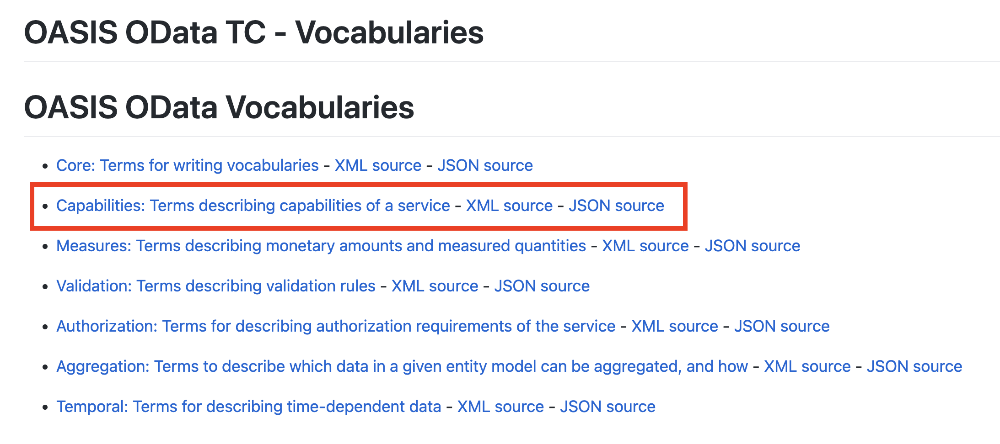

# Understand how annotations are used in OData metadata documents

<!-- description --> Annotations are like an extended form of metadata, organized into vocabularies.

## You will learn

- How annotations are organized into vocabularies
- How they're included within an OData metadata document
- How they're then used to extend the information in the schema

## Intro

The members of the OData Technical Committee have worked hard on OData as a robust, well-defined and extensible standard. In this tutorial we'll look at a key extensibility mechanism in the form of Vocabularies, and a dominant use thereof in the form of Annotations.

---

### Examine the rest of the entity model wrapper

In the previous [Metadata](https://developers.sap.com/tutorials/odata-dd-4-metadata.html) tutorial we saw how the schema was presented within a context. That context is called the [entity model wrapper](https://docs.oasis-open.org/odata/odata/v4.0/errata03/os/complete/part3-csdl/odata-v4.0-errata03-os-part3-csdl-complete.html#_Toc453752500). We left the examination of part of that wrapper - the references to vocabularies, to this tutorial. Let's start by digging into those now.

Here's what the relevant section of the wrapper looks like (with a little bit of whitespace to help readability):

```xml
<?xml version="1.0" encoding="utf-8"?>
<edmx:Edmx Version="4.0" xmlns:edmx="http://docs.oasis-open.org/odata/ns/edmx">
  <edmx:Reference
    Uri="https://oasis-tcs.github.io/odata-vocabularies/vocabularies/Org.OData.Capabilities.V1.xml">
    <edmx:Include Alias="Capabilities" Namespace="Org.OData.Capabilities.V1"/>
  </edmx:Reference>
  <edmx:Reference
    Uri="https://sap.github.io/odata-vocabularies/vocabularies/Common.xml">
    <edmx:Include Alias="Common" Namespace="com.sap.vocabularies.Common.v1"/>
  </edmx:Reference>
  <edmx:Reference
    Uri="https://oasis-tcs.github.io/odata-vocabularies/vocabularies/Org.OData.Core.V1.xml">
    <edmx:Include Alias="Core" Namespace="Org.OData.Core.V1"/>
  </edmx:Reference>
  ...
</edmx:Edmx>
```

What are these references? Well, section [3.3 Element edmx:Reference](https://docs.oasis-open.org/odata/odata/v4.0/errata03/os/complete/part3-csdl/odata-v4.0-errata03-os-part3-csdl-complete.html#_Toc453752504) of the CSDL standards document is helpful here (after section [3.1 Element edmx:Edmx](https://docs.oasis-open.org/odata/odata/v4.0/errata03/os/complete/part3-csdl/odata-v4.0-errata03-os-part3-csdl-complete.html#_Toc453752504) tells us that there can be zero or more of them).

Basically, `edmx:Reference` elements point to external CSDL documents, specific content from which (indicated by the `edmx:Include` elements within) is then added to the overall scope of the referring (OData metadata) document. Think of it like an "include" as found in various programming languages.

Note that each of the referenced external documents in our OData metadata document are resources in GitHub repositories:

- two belonging to OASIS in <https://oasis-tcs.github.io/odata-vocabularies/>
- one belongint to SAP in <https://sap.github.io/odata-vocabularies/>

Taking the first of the three `<edmx:Reference>` elements here, we see that:

- the reference points to an [XML representation](https://oasis-tcs.github.io/odata-vocabularies/vocabularies/Org.OData.Capabilities.V1.xml) of a CSDL document "Org.OData.Capabilities.V1"
- moving one level up from the document resource's location, there is an [overview page](https://oasis-tcs.github.io/odata-vocabularies/vocabularies/) listing each of the OASIS Technical Committee vocabularies (including this "Capabilities" one), and for each of these resources there are HTML, XML and JSON representations
- the HTML representation is especially useful for us as it describes the vocabulary's purpose in general, and gives details for each of the terms and types contained within it



If we look at the XML representation in CSDL (i.e. EDMX) form, we see this:

```xml
<?xml version="1.0" encoding="utf-8"?>
  ...

  Abstract:
  This document contains terms describing capabilities of an OData service.

-->
<edmx:Edmx xmlns:edmx="http://docs.oasis-open.org/odata/ns/edmx" Version="4.0">
  <edmx:Reference Uri="https://oasis-tcs.github.io/odata-vocabularies/vocabularies/Org.OData.Authorization.V1.xml">
    <edmx:Include Alias="Authorization" Namespace="Org.OData.Authorization.V1" />
  </edmx:Reference>
  <edmx:Reference Uri="https://oasis-tcs.github.io/odata-vocabularies/vocabularies/Org.OData.Core.V1.xml">
    <edmx:Include Alias="Core" Namespace="Org.OData.Core.V1" />
  </edmx:Reference>
  <edmx:Reference Uri="https://oasis-tcs.github.io/odata-vocabularies/vocabularies/Org.OData.Validation.V1.xml">
    <edmx:Include Alias="Validation" Namespace="Org.OData.Validation.V1" />
  </edmx:Reference>
  <edmx:DataServices>
    <Schema xmlns="http://docs.oasis-open.org/odata/ns/edm" Namespace="Org.OData.Capabilities.V1" Alias="Capabilities">
    ...
    </Schema>
  </edmx:DataServices>
</edmx:Edmx>
```
