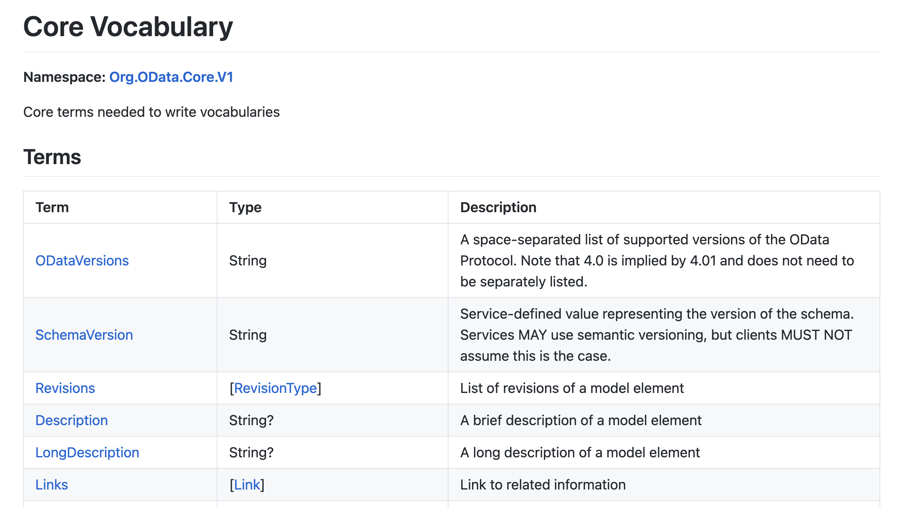
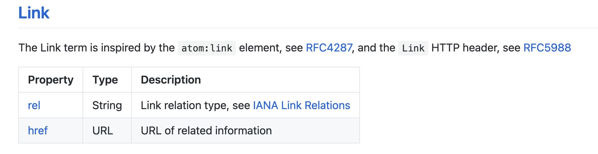
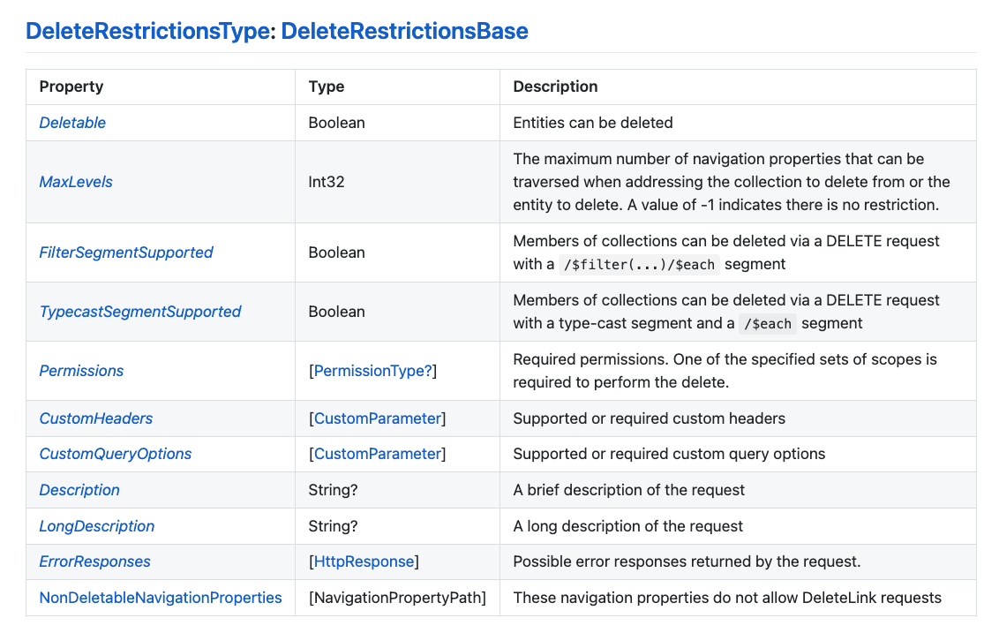

# Learn how to read annotations in OData metadata documents

<!-- description --> Annotations from different vocabularies can be found throughout OData metadata documents.

## You will learn

- How annotations are defined & structured
- How annotations are used to extend the information in the schema

## Intro

In all cases, annotations consist of two parts:

- the annotation term
- the annotation value

In this tutorial we'll examine the terms, along with their types and possible values, in our [Northbreeze OData metadata document](https://odd.cfapps.eu10.hana.ondemand.com/northbreeze/$metadata).

### Revisit the Core.Links annotation

One of the annotations we took a brief first look at in the previous tutorial was "Core.Links", where "Core" is the vocabulary alias, referring here to "Org.OData.Core.V1".

```xml
<Schema Namespace="Main" xmlns="http://docs.oasis-open.org/odata/ns/edm">
  <Annotation Term="Core.Links">
    <Collection>
      <Record>
        <PropertyValue Property="rel" String="author"/>
        <PropertyValue Property="href" String="https://cap.cloud.sap"/>
      </Record>
    </Collection>
  </Annotation>
  ...
</Schema>
```

The XML element structure contained within the `<Annotation>` element is the annotation term's value. [Staring at](https://qmacro.org/blog/posts/2017/02/19/the-beauty-of-recursion-and-list-machinery/#initial-recognition) this structure for a bit, we see that it's a [collection](https://docs.oasis-open.org/odata/odata/v4.0/errata03/os/complete/part3-csdl/odata-v4.0-errata03-os-part3-csdl-complete.html#_Toc453752651) of records, each of which have two properties (or fields) "rel" and "href", for which there are corresponding string values.

There's only a single record in the collection, and it looks like this:

rel|href
-|-
`author`|`https://cap.cloud.sap`

### Dig into the XML representation of the Core vocabulary

Let's first go the hard way round to understand what this term is, and how the value structure is defined. To do that, we should look at the [XML representation of the Org.OData.Core.V1 vocabulary](https://oasis-tcs.github.io/odata-vocabularies/vocabularies/Org.OData.Core.V1.xml), and search for the relevant term.

> As we search, we also will notice that the schema within this resource, specifically the "Org.OData.Core.V1" schema, is adorned with a "Core.Links" annotation itself, too! And it works because of the OData namespace "Core" provides a pointer to itself. Further beauty, which we'll see more of shortly, too.

Within the "Org.OData.Core.V1" schema, we find two elements, right next to each other, that are relevant to our search - a `<Term>` and a `<ComplexType>`:

```xml
<Term Name="Links" Type="Collection(Core.Link)" Nullable="false">
  <Annotation Term="Core.Description" String="Link to related information" />
</Term>

<ComplexType Name="Link">
  <Annotation Term="Core.Description" String="The Link term is inspired by the `atom:link` element, see [RFC4287](https://tools.ietf.org/html/rfc4287#section-4.2.7), and the `Link` HTTP header, see [RFC5988](https://tools.ietf.org/html/rfc5988)" />
  <Property Name="rel" Type="Edm.String" Nullable="false">
    <Annotation Term="Core.Description" String="Link relation type, see [IANA Link Relations](http://www.iana.org/assignments/link-relations/link-relations.xhtml)" />
  </Property>
  <Property Name="href" Type="Edm.String" Nullable="false">
    <Annotation Term="Core.IsURL" />
    <Annotation Term="Core.Description" String="URL of related information" />
  </Property>
</ComplexType>
```

This is where the "Links" term, in the "Core" namespace (representing the vocabulary), is defined, i.e. in a `<Term>` element. The `<Term>` element itself is defined in the OData standards document that has accompanied us on this journey of discovery: "OData Version 4.0. Part 3: Common Schema Definition Language (CSDL)", specifically in [section 14.1 Element edm:Term](https://docs.oasis-open.org/odata/odata/v4.0/errata03/os/complete/part3-csdl/odata-v4.0-errata03-os-part3-csdl-complete.html#_Toc453752620).

Here's what we can we discern from this `<Term>` element:

- the name is "Links"
- the type is defined as being a collection (an array) of individual "Core.Link" items
- it's annotated with a "Core.Description" term (which is a part of this very vocabulary, more beauty!) that tells us this term is for "links to related information"

The "Core.Link" item is defined with a corresponding `<ComplexType>` element, which:

- is annotated with a "Core.Description" term telling us more about it
- includes, in that description, a reference to the `atom` namespace and RFC 4287 (Atom Syndication Format) which we looked at in the first tutorial in this mission on the [Origins](https://developers.sap.com/tutorials/odata-dd-1-origins.html) of OData
- is defined as having two properties "rel" and "href", each of which has the type "edm.String" and each of which are also annotated with "Core.Description" (the latter is also annotated with "Core.IsURL")

Here's what that looks like, pictorally:

```text
Namespace: Core

    +-- Description: "Link to related information"
    |
    |               +-- Description: "The Link term (sic) is inspired by ..."
    V               |
+-------+    +------V----------------+ 
|       |    | +----------+          ++
| Links +--->| | Link     |          ||
|       |    | |          |          ||
+-------+    | +-+--------+          ||
             |   |     +----------+  ||
             |   +-----+ rel      |<---- Description: "Link relation type ..."
             |   |     | (String) |  ||
             |   |     +----------+  ||
             |   |     +----------+  ||
             |   +-----+ href     |<---- Description: "URL of related information ..."
             |         | (String) |<---- IsURL: true
             |         +----------+  ||
             ++----------------------+|
              +-----------------------+
                  (Collection)
```

### Explore the Core.IsURL annotation

As a bonus, and to help drive home how OData vocabularies and metadata metadata (yes, that is deliberately written twice) works, let's spend a moment of practice following the other annotation with which the "Core.Link" complex type's property "href" is annotated, namely "Core.IsURL".

Look again through the [Org.OData.Core.V1 schema XML](https://oasis-tcs.github.io/odata-vocabularies/vocabularies/Org.OData.Core.V1.xml) for the "IsURL" term. You should find this:

```xml
<Term Name="IsURL" Type="Core.Tag" Nullable="false" DefaultValue="true" AppliesTo="Property Term">
  <Annotation Term="Core.Description" String="Properties and terms annotated with this term MUST contain a valid URL" />
  <Annotation Term="Core.RequiresType" String="Edm.String" />
</Term>
```

Descend yet one level deeper to find out what the "Core.Tag" type is, whereupon you should find:

```xml
<TypeDefinition Name="Tag" UnderlyingType="Edm.Boolean">
  <Annotation Term="Core.Description" String="This is the type to use for all tagging terms" />
</TypeDefinition>
```

And with the definition of this type being a Boolean (in the "edm" namespace, see the [Metadata](https://developers.sap.com/tutorials/odata-dd-4-metadata.html) tutorial earlier in this mission), we've bottomed out our investigation.

Tracking back up to where we started this descent, in the schema in our [OData metadata document](https://odd.cfapps.eu10.hana.ondemand.com/northbreeze/$metadata), we can now confidently understand that:

Level 0 (our OData metadata)

- that schema is annotated with the "Links" term
- that "Links" term is in the Org.OData.Core.V1 vocabulary

Level 1 (the "Core" vocabulary)

- that vocabulary has the short alias "Core"
- within the "Core" vocabulary, the "Links" term is defined as a Collection of the "Link" complex type
- that "Link" complex type has two properties, "url" and "href"

Level 2 (annotations used for vocabulary content)

- the "Links" term, the "Link" complex type, and both properties are also themselves annotated with terms from "Core"
- the predominant term used in these (meta) annotations within the "Core" vocabulary is "Description"
- but there's also the term "IsURL", which is defined as being of type "Tag"

Level 3 (annotations used for building blocks of annotations)

- and the "Tag" type is defined as a Boolean
- as well as being annotated itself too (with the "Description" term)

Phew!

### Revisit the Core vocabulary via the HTML representation

Now that we've done the hard work of examining the XML representation of the "Core" vocabulary, let's take a breather and look at the HTML representation (we saw how these are related in the previous tutorial on [Vocabularies](https://developers.sap.com/tutorials/odata-dd-5-vocabularies.html)), at <https://oasis-tcs.github.io/odata-vocabularies/vocabularies/Org.OData.Core.V1.html>.

We see some familiar information that should help clarify and cement our understanding.



First, the description "Core terms needed to write vocabularies" explains why so many aspects of the "Core" vocabulary were indeed annotated themselves with terms from that very same vocabulary.

Next, in the list of terms, we see the "Links" term with its type defined as "[Link]", i.e. an array (`[...]`) or collection of "Link" types. Following the hyperlinked "Link" we are taken to the [Link](https://oasis-tcs.github.io/odata-vocabularies/vocabularies/Org.OData.Core.V1.html#Link) type definition:



The keen observers amongst you will realise that the descriptions in this HTML representation are taken directly from the values of the "Core.Description" terms that adorn the XML representation, suggesting that the HTML representation is generated from the XML representation too.

> In fact, [the source of the HTML representation is in Markdown format](https://github.com/oasis-tcs/odata-vocabularies/blob/main/vocabularies/Org.OData.Core.V1.md), which makes sense too, given that there is Markdown in some of the "Core.Description" string values ([the description for this "Core.Link" type](https://github.com/oasis-tcs/odata-vocabularies/blob/main/vocabularies/Org.OData.Core.V1.xml#L119) is a good example of this).

### Examine the other Capabilities annotations

Now we understand how to read, interpret and navigate annotations, let's turn our attention to the other annotations in our [Northbreeze OData metadata document](https://odd.cfapps.eu10.hana.ondemand.com/northbreeze/$metadata):

```xml
<Annotations Target="Main.EntityContainer/Categories">
  <Annotation Term="Capabilities.DeleteRestrictions">
    <Record Type="Capabilities.DeleteRestrictionsType">
      <PropertyValue Property="Deletable" Bool="false"/>
    </Record>
  </Annotation>
  <Annotation Term="Capabilities.InsertRestrictions">
    <Record Type="Capabilities.InsertRestrictionsType">
      <PropertyValue Property="Insertable" Bool="false"/>
    </Record>
  </Annotation>
  <Annotation Term="Capabilities.UpdateRestrictions">
    <Record Type="Capabilities.UpdateRestrictionsType">
      <PropertyValue Property="Updatable" Bool="false"/>
    </Record>
  </Annotation>
</Annotations>
```

From our first look at annotations in the previous tutorial on [Vocabularies](https://developers.sap.com/tutorials/odata-dd-5-vocabularies.html) we understand that these annotations are targeting the "Categories" entityset. XML has a reputation for being verbose, and that reputation is earned here.

However, with the ability we now have to read and understand annotation terms & values, we can see that all these annotation terms are from the [Capabilities](https://oasis-tcs.github.io/odata-vocabularies/vocabularies/Org.OData.Capabilities.V1.xml) vocabulary (Org.OData.Capabilities.V1) and they are all of the same theme of operational limitations, with the terms being "DeleteRestrictions", "InsertRestrictions" and "UpdateRestrictions".

The entityset is annotated with three terms, each of which has a record structure as its type. Let's dig in to the first occurring term which is "Capabilities.DeleteRestrictions".

> The way this works for the other terms (for insert and update operations) is very similar; digging into those is left as an exercise for you, dear reader.

Starting with the annotation target, which is "Main.EntityContainer/Categories", we see that the first of the three annotations that are being applied is "Capabilities.DeleteRestrictions":

```xml
<Annotations Target="Main.EntityContainer/Categories">
  <Annotation Term="Capabilities.DeleteRestrictions">
    <Record Type="Capabilities.DeleteRestrictionsType">
      <PropertyValue Property="Deletable" Bool="false"/>
    </Record>
  </Annotation>
  ...
</Annotations>
```

If we look at the [HTML representation of the Org.OData.Capabilities.V1 vocabulary](https://oasis-tcs.github.io/odata-vocabularies/vocabularies/Org.OData.Capabilities.V1.html) we see that "DeleteRestrictions" is indeed listed in the Terms section, and is defined as having the [DeleteRestrictionsType](https://oasis-tcs.github.io/odata-vocabularies/vocabularies/Org.OData.Capabilities.V1.html#DeleteRestrictionsType), which looks like this:



One of the properties in this type (this record structure, effectively) is the Boolean "Deletable", a value for which (`false`) is provided in the annotation for the entityset.

> Note that the "DeleteRestrictionsType" type is defined as being derived from [DeleteRestrictionsBase](https://oasis-tcs.github.io/odata-vocabularies/vocabularies/Org.OData.Capabilities.V1.html#DeleteRestrictionsBase). The difference between this base type and the derived type is that the derived type has one additional property [NonDeletableNavigationProperties](https://github.com/oasis-tcs/odata-vocabularies/blob/main/vocabularies/Org.OData.Capabilities.V1.xml#L876) which is a detail we don't have to worry over at this level of exploration.

Following these annotations terms, with their Boolean `false` values, we can see that the entityset is effectively read-only.

> If at this point you're still looking at the metadata document for the the publicly available read-only service (mentioned in the [Northbreeze](https://developers.sap.com/tutorials/odata-dd-3-northbreeze.html) tutorial) at <https://odd.cfapps.eu10.hana.ondemand.com/northbreeze/$metadata>, all the entitysets are read-only and you'll see the same `<Annotations Target="...">` pattern for the other entitysets.

By the way, this OData service is being served by a CAP Node.js server, where the entity projection(s) in the service definition have the simple CDS-level annotation `@readonly` assigned. This is translated into these triplets of "Capabilities" based delete, insert and update restriction annotations at the OData level.

### Further info

- the [@readonly](https://cap.cloud.sap/docs/guides/services/constraints#readonly) section of the Input Validation topic in Capire
- if you're wondering why there's a third vocabulary [com.sap.vocabularies.Common.v1](https://sap.github.io/odata-vocabularies/vocabularies/Common.xml) included in the references section of this OData service's metadata document, but there are no "Common" terms used, that's just because this is served by a CAP server, and the CAP compiler will by default always include references to both the "Core" and "Common" vocabularies (see the `csn2annotationEdm` function in `@sap/cds-compiler/lib/edm/annotations/genericTranslations.js` for details)
