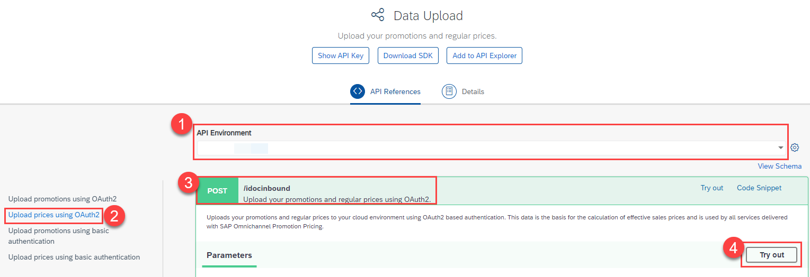
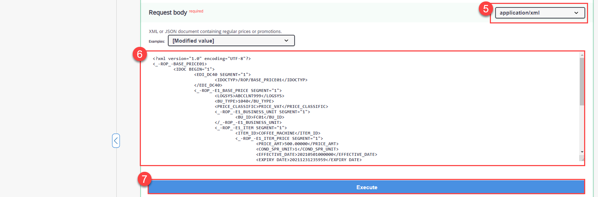
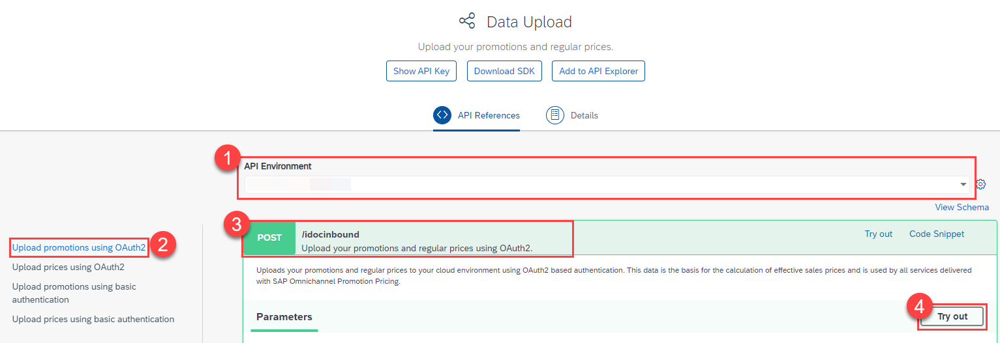
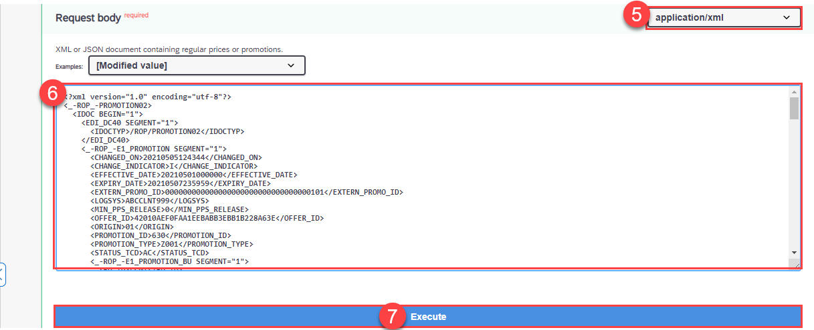
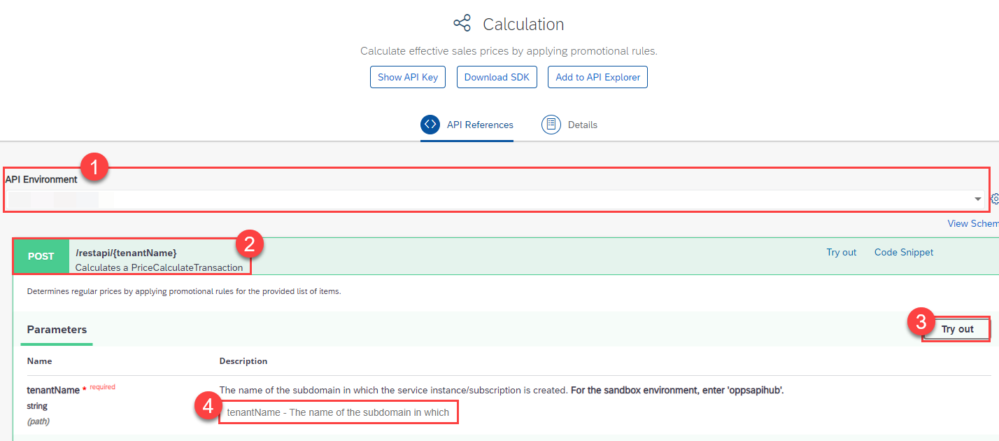
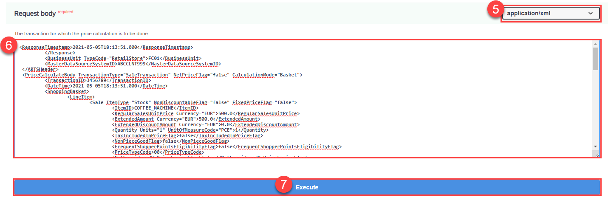

## Prerequisites
- You have completed the tutorial [Apply a Simple Promotion with SAP Omnichannel Promotion Pricing](opps-basic-scenario).
- You have registered for a trial account on [SAP BTP](hcp-create-trial-account).
- You should be familiar with the SAP BTP trial landscape and terminology (see [Take a Tour of SAP BTP Trial](cp-trial-quick-onboarding)).
- You have a subaccount in the Cloud Foundry environment, with Amazon Web Services (AWS) as provider and the Europe (Frankfurt) region.
- You have set up SAP Omnichannel Promotion Pricing as described in [Set Up SAP Omnichannel Promotion Pricing](opps-manual-setup).


## Details
### You will learn
- How to use the SAP Omnichannel Promotion Pricing trial on SAP BTP
- How to upload a **mix-and-match promotional rule** with the help of the SAP API Business Hub
- How to execute a calculation request to determine the effective sales price

---

[ACCORDION-BEGIN [Step 1: ](Get to know the business scenario)]

* Business goal: You are a household equipment vendor and you want to promote the product **coffee machine** in your **Heidelberg** store (business unit ID: `FC01`). You have created the following promotion: **Buy a coffee machine and get 3 packages of deluxe coffee for free.**
* Your promotion is valid from **May 1st, 2021 until May 7th, 2021**.
* The **regular sales price** for the **coffee machine** (material number: `COFFEE_MACHINE`) is **500 Euro**.
* The **regular sales price** for one package of **deluxe coffee** (material number: `DELUXE_COFFEE`) is **10 Euro**.
* A customer put one **coffee machine** and three packages of **deluxe coffee** in the shopping cart.
* You call the Calculation service with the shopping cart information (store, products, date, time).
* The Calculation service calculates the effective sales price by applying the mix-and-match promotional rule

[VALIDATE_1]
[ACCORDION-END]

<!-- [ACCORDION-BEGIN [Step 2: ](Set up SAP Omnichannel Promotion Pricing)]

To use the SAP Omnichannel Promotion Pricing trial, you need to:

1. Subscribe to SAP Omnichannel Promotion Pricing
2. Set Up Roles and Authorizations
3. Create Service Instances
4. Create Service Keys

For step-by-step instructions, go to the tutorial [Set Up SAP Omnichannel Promotion Pricing](opps-manual-setup).

[DONE]
[ACCORDION-END] -->


[ACCORDION-BEGIN [Step 2: ](Create environments in SAP API Business Hub)]

In order to continue with the next steps, you need to have already set up your trial environments for the Data Upload service, Data Access service, and Calculation service in the SAP API Business Hub. If you need guidance, have a look at step 2 of the tutorial [Apply a Simple Promotion with SAP Omnichannel Promotion Pricing](opps-basic-scenario).

[DONE]

[ACCORDION-END]

[ACCORDION-BEGIN [Step 3: ](Upload master data - regular sales prices)]

You can upload the master data with the Data Upload service. The uploaded master data serves as the basis for calculating the effective sales price with the Calculation service.

Navigate to the [Data Upload service of SAP Omnichannel Promotion Pricing on SAP API Business Hub](https://api.sap.com/api/DataUpload/resource). Log on with the same login information that you use for your SAP BTP account.

!
!


1. For **API Environment**, select the trial environment you have created for the Data Upload service.
2. On the left-hand side, choose **Upload prices using OAuth2**.
3. Open the **POST** request `/idocinbound`
4. Choose **Try Out**.
5. For the **Request body**, choose `application/xml`.
6. Copy the following raw data and paste it into the body:
```XML
<?xml version="1.0" encoding="UTF-8"?>
<_-ROP_-BASE_PRICE01>
	<IDOC BEGIN="1">
		<EDI_DC40 SEGMENT="1">
			<IDOCTYP>/ROP/BASE_PRICE01</IDOCTYP>
		</EDI_DC40>
		<_-ROP_-E1_BASE_PRICE SEGMENT="1">
			<LOGSYS>ABCCLNT999</LOGSYS>
			<BU_TYPE>1040</BU_TYPE>
			<PRICE_CLASSIFIC>PRICE_VAT</PRICE_CLASSIFIC>
			<_-ROP_-E1_BUSINESS_UNIT SEGMENT="1">
				<BU_ID>FC01</BU_ID>
			</_-ROP_-E1_BUSINESS_UNIT>
			<_-ROP_-E1_ITEM SEGMENT="1">
				<ITEM_ID>COFFEE_MACHINE</ITEM_ID>
				<_-ROP_-E1_ITEM_PRICE SEGMENT="1">
					<PRICE_AMT>500.00000</PRICE_AMT>
					<COND_SPR_UNIT>1</COND_SPR_UNIT>
					<EFFECTIVE_DATE>20210501000000</EFFECTIVE_DATE>
					<EXPIRY_DATE>20211231235959</EXPIRY_DATE>
					<UOM_ISO_CODE>PCE</UOM_ISO_CODE>
					<CURRENCY_ISO_CODE>EUR</CURRENCY_ISO_CODE>
				</_-ROP_-E1_ITEM_PRICE>
			</_-ROP_-E1_ITEM>
			<_-ROP_-E1_ITEM SEGMENT="1">
				<ITEM_ID>DELUXE_COFFEE</ITEM_ID>
				<_-ROP_-E1_ITEM_PRICE SEGMENT="1">
					<PRICE_AMT>10.00000</PRICE_AMT>
					<COND_SPR_UNIT>1</COND_SPR_UNIT>
					<EFFECTIVE_DATE>20210501000000</EFFECTIVE_DATE>
					<EXPIRY_DATE>20211231235959</EXPIRY_DATE>
					<UOM_ISO_CODE>PCE</UOM_ISO_CODE>
					<CURRENCY_ISO_CODE>EUR</CURRENCY_ISO_CODE>
				</_-ROP_-E1_ITEM_PRICE>
			</_-ROP_-E1_ITEM>
		</_-ROP_-E1_BASE_PRICE>
	</IDOC>
</_-ROP_-BASE_PRICE01>
```
7. Choose **Execute**.
8. Make sure you get the HTTP response **200**.

With this, you uploaded the regular sales price of **500 Euro** for the product **coffee machine** (material number: `COFFEE_MACHINE`, unit of measure: `PCE`) and the regular sales price of **10 Euro** for the product **deluxe coffee** (material number: `DELUXE_COFFEE`, unit of measure: `PCE`) for your **Heidelberg** store (business unit ID: `FC01`). Also, you defined that the validity period is **May 1st, 2021 to December 31st, 2021**.

[DONE]

[ACCORDION-END]

[ACCORDION-BEGIN [Step 4: ](Upload master data - promotional rule)]

!
!


1. For **API Environment**, select the trial environment you have created for the Data Upload service.
2. On the left-hand side, choose **Upload promotions using OAuth2**.
3. Open the **POST** request `/idocinbound`.
4. Choose **Try Out**.
5. For the **Request body**, choose `application/xml`.
6. Copy the following raw data and paste it into the body:
```XML
<?xml version="1.0" encoding="utf-8"?>
<_-ROP_-PROMOTION02>
  <IDOC BEGIN="1">
    <EDI_DC40 SEGMENT="1">
      <IDOCTYP>/ROP/PROMOTION02</IDOCTYP>
    </EDI_DC40>
    <_-ROP_-E1_PROMOTION SEGMENT="1">
      <CHANGED_ON>20210505124344</CHANGED_ON>
      <CHANGE_INDICATOR>I</CHANGE_INDICATOR>
      <EFFECTIVE_DATE>20210501000000</EFFECTIVE_DATE>
      <EXPIRY_DATE>20210507235959</EXPIRY_DATE>
      <EXTERN_PROMO_ID>000000000000000000000000000000000101</EXTERN_PROMO_ID>
      <LOGSYS>ABCCLNT999</LOGSYS>
      <MIN_PPS_RELEASE>0</MIN_PPS_RELEASE>
      <OFFER_ID>42010AEF0FAA1EEBABB3EBB1B228A63E</OFFER_ID>
      <ORIGIN>01</ORIGIN>
      <PROMOTION_ID>630</PROMOTION_ID>
      <PROMOTION_TYPE>Z001</PROMOTION_TYPE>
      <STATUS_TCD>AC</STATUS_TCD>
      <_-ROP_-E1_PROMOTION_BU SEGMENT="1">
        <BU_ID>FC01</BU_ID>
        <BU_TYPE>1040</BU_TYPE>
      </_-ROP_-E1_PROMOTION_BU>
      <_-ROP_-E1_PROMOTION_BU SEGMENT="1">
        <BU_ID>FC02</BU_ID>
        <BU_TYPE>1040</BU_TYPE>
      </_-ROP_-E1_PROMOTION_BU>
      <_-ROP_-E1_PROMOTION_RULE SEGMENT="1">
        <ELIGIBILITY_ID>631</ELIGIBILITY_ID>
        <ONLY_BASKET_MODE>X</ONLY_BASKET_MODE>
        <PRICE_RULE_ID>631</PRICE_RULE_ID>
        <PROMO_RULE_ID>631</PROMO_RULE_ID>
        <RESOLUTION>1</RESOLUTION>
        <SALE_RETURN_TCD>00</SALE_RETURN_TCD>
        <SEQUENCE>631</SEQUENCE>
        <_-ROP_-E1_ELIGIBILITY SEGMENT="1">
          <COMBINATION_CODE>&amp;&amp;</COMBINATION_CODE>
          <EFFECTIVE_DATE>20210501000000</EFFECTIVE_DATE>
          <ELIGIBILITY_ID>631</ELIGIBILITY_ID>
          <EXPIRY_DATE>20210507235959</EXPIRY_DATE>
          <INTERVAL_AMT>0.00000</INTERVAL_AMT>
          <INTERVAL_QTY>0.000</INTERVAL_QTY>
          <LIMIT_AMT>0.00000</LIMIT_AMT>
          <LIMIT_QTY>0.000</LIMIT_QTY>
          <MERCH_SET_ID>0</MERCH_SET_ID>
          <PARENT_ELIGIB_ID>631</PARENT_ELIGIB_ID>
          <PROMO_RULE_ID>631</PROMO_RULE_ID>
          <ROOT_ELIGIB_ID>631</ROOT_ELIGIB_ID>
          <STATUS_TCD>AC</STATUS_TCD>
          <THRESHOLD_AMT>0.00000</THRESHOLD_AMT>
          <THRESHOLD_QTY>0.000</THRESHOLD_QTY>
          <TRANS_TOTAL_AMT>0.00000</TRANS_TOTAL_AMT>
          <TYPE_CODE>COMB</TYPE_CODE>
        </_-ROP_-E1_ELIGIBILITY>
        <_-ROP_-E1_ELIGIBILITY SEGMENT="1">
          <EFFECTIVE_DATE>20210501000000</EFFECTIVE_DATE>
          <ELIGIBILITY_ID>632</ELIGIBILITY_ID>
          <EXPIRY_DATE>20210507235959</EXPIRY_DATE>
          <INTERVAL_AMT>0.00000</INTERVAL_AMT>
          <INTERVAL_QTY>1.000</INTERVAL_QTY>
          <ITEM_ID>COFFEE_MACHINE</ITEM_ID>
          <LIMIT_AMT>0.00000</LIMIT_AMT>
          <LIMIT_QTY>9999999999.000</LIMIT_QTY>
          <MERCH_SET_ID>0</MERCH_SET_ID>
          <PARENT_ELIGIB_ID>631</PARENT_ELIGIB_ID>
          <PROMO_RULE_ID>631</PROMO_RULE_ID>
          <ROOT_ELIGIB_ID>631</ROOT_ELIGIB_ID>
          <STATUS_TCD>AC</STATUS_TCD>
          <THRESHOLD_AMT>0.00000</THRESHOLD_AMT>
          <THRESHOLD_QTY>1.000</THRESHOLD_QTY>
          <THRESHOLD_TCD>QUTI</THRESHOLD_TCD>
          <TRANS_TOTAL_AMT>0.00000</TRANS_TOTAL_AMT>
          <TYPE_CODE>ITEM</TYPE_CODE>
          <UOM_ISO_CODE>PCE</UOM_ISO_CODE>
        </_-ROP_-E1_ELIGIBILITY>
        <_-ROP_-E1_ELIGIBILITY SEGMENT="1">
          <EFFECTIVE_DATE>20210501000000</EFFECTIVE_DATE>
          <ELIGIBILITY_ID>633</ELIGIBILITY_ID>
          <EXPIRY_DATE>20210507235959</EXPIRY_DATE>
          <INTERVAL_AMT>0.00000</INTERVAL_AMT>
          <INTERVAL_QTY>3.000</INTERVAL_QTY>
          <ITEM_ID>DELUXE_COFFEE</ITEM_ID>
          <LIMIT_AMT>0.00000</LIMIT_AMT>
          <LIMIT_QTY>9999999999.000</LIMIT_QTY>
          <MERCH_SET_ID>0</MERCH_SET_ID>
          <PARENT_ELIGIB_ID>631</PARENT_ELIGIB_ID>
          <PROMO_RULE_ID>631</PROMO_RULE_ID>
          <ROOT_ELIGIB_ID>631</ROOT_ELIGIB_ID>
          <STATUS_TCD>AC</STATUS_TCD>
          <THRESHOLD_AMT>0.00000</THRESHOLD_AMT>
          <THRESHOLD_QTY>3.000</THRESHOLD_QTY>
          <THRESHOLD_TCD>QUTI</THRESHOLD_TCD>
          <TRANS_TOTAL_AMT>0.00000</TRANS_TOTAL_AMT>
          <TYPE_CODE>ITEM</TYPE_CODE>
          <UOM_ISO_CODE>PCE</UOM_ISO_CODE>
        </_-ROP_-E1_ELIGIBILITY>
        <_-ROP_-E1_PRICE_RULE SEGMENT="1">
          <CALCULATION_BASE>00</CALCULATION_BASE>
          <CALC_BASE_SEQUENCE>1-</CALC_BASE_SEQUENCE>
          <COMBINATION_CODE>&amp;&amp;</COMBINATION_CODE>
          <CONSIDER_PREVIOUS_RULES>X</CONSIDER_PREVIOUS_RULES>
          <COUPON_VALIDITY>0</COUPON_VALIDITY>
          <CURRENCY_ISO_CODE>EUR</CURRENCY_ISO_CODE>
          <DISC_METHOD_TCD>00</DISC_METHOD_TCD>
          <EX_PRICE_RULE_ID>0000000000000000000</EX_PRICE_RULE_ID>
          <ITEM_METHOD>00</ITEM_METHOD>
          <MAM_LIMIT_CNT>0.000</MAM_LIMIT_CNT>
          <NEW_PRICE_AMT>0.00000</NEW_PRICE_AMT>
          <NEW_SET_PRCE_AMT>0.00000</NEW_SET_PRCE_AMT>
          <PRICE_MODIF_AMT>0.00000</PRICE_MODIF_AMT>
          <PRICE_MODIF_PERC>0.000</PRICE_MODIF_PERC>
          <PRICE_RULE_ID>631</PRICE_RULE_ID>
          <ROUNDING_METHOD>00</ROUNDING_METHOD>
          <ROUND_DECIMALS>2</ROUND_DECIMALS>
          <ROUND_DESTINATION>1</ROUND_DESTINATION>
          <RULE_CTRL_CODE>PO</RULE_CTRL_CODE>
          <STATUS_TCD>AC</STATUS_TCD>
          <SUBSEQ_NEW_PRICE_AMT>0.00000</SUBSEQ_NEW_PRICE_AMT>
          <SUBSEQ_PRICE_MODIF_AMT>0.00000</SUBSEQ_PRICE_MODIF_AMT>
          <SUBSEQ_PRICE_MODIF_PERC>0.000</SUBSEQ_PRICE_MODIF_PERC>
          <TYPE_CODE>MM</TYPE_CODE>
          <_-ROP_-E1_MIX_MATCH_ITEM SEGMENT="1">
            <ITEM_ID>DELUXE_COFFEE</ITEM_ID>
            <ITEM_TCD>IT</ITEM_TCD>
            <MAM_ITEM_ID>634</MAM_ITEM_ID>
            <MERCH_SET_ID>0</MERCH_SET_ID>
            <NEW_PRICE_AMT>0.00000</NEW_PRICE_AMT>
            <PMOD_ALLOC_PERC>0.000</PMOD_ALLOC_PERC>
            <PRICE_MODIF_AMT>0.00000</PRICE_MODIF_AMT>
            <PRICE_MODIF_CODE>PS</PRICE_MODIF_CODE>
            <PRICE_MODIF_PERC>0.000</PRICE_MODIF_PERC>
            <PRICE_RULE_ID>631</PRICE_RULE_ID>
            <REQUIRED_QTY>3.000</REQUIRED_QTY>
            <UOM_ISO_CODE>PCE</UOM_ISO_CODE>
          </_-ROP_-E1_MIX_MATCH_ITEM>
        </_-ROP_-E1_PRICE_RULE>
      </_-ROP_-E1_PROMOTION_RULE>
      <_-ROP_-E1_PROMOTION_TEXT SEGMENT="1">
        <DESCRIPTION>Buy one coffee machine and get 3 packages of deluxe coffee for free</DESCRIPTION>
        <NAME>Coffee Special Promotion</NAME>
        <SPRAS_ISO>EN</SPRAS_ISO>
      </_-ROP_-E1_PROMOTION_TEXT>
    </_-ROP_-E1_PROMOTION>
  </IDOC>
</_-ROP_-PROMOTION02>
```
7. Choose **Execute**.
8. Make sure you get the HTTP response **200**.

With this, you uploaded the promotional rule "Buy a coffee machine and get 3 packages of deluxe coffee for free" (promotion ID: `630`) for the **Heidelberg** store (business unit ID: `FC01`) and the validity period **May 1st, 2021 to May 7th, 2021**.

[VALIDATE_2]

[ACCORDION-END]

[ACCORDION-BEGIN [Step 5: ](Check uploaded master data)]

You can use the **Data Access** service for checking your uploaded data. If you need guidance, have a look at step 4 of the tutorial [Apply a Simple Promotion with SAP Omnichannel Promotion Pricing](opps-basic-scenario).

[DONE]
[ACCORDION-END]

[ACCORDION-BEGIN [Step 6: ](Calculate the effective sales price)]

You can now calculate the effective sales price based on the data you have uploaded in the previous steps.

**Scenario**: A customer has one **coffee machine** (material number: `COFFEE_MACHINE`) and three packages of **Deluxe coffee capsules** (material number: `DELUXE_COFFEE`) in the shopping cart. The customer wants to purchase it on **May 5th, 2021** in the **Heidelberg** store (business unit ID: `FC01`).

**Desired Result**: The effective sales price for the three packages of **Deluxe coffee capsules** should be **0 Euro**. The customer gets the coffee capsules for free because there is a coffee machine in the shopping cart.

Let's see if this is the case:

!
!


1. Navigate to the [Calculation service on the SAP API Business Hub](https://api.sap.com/api/PriceCalculation/resource).
2. For **API Environment**, select your trial environment for the Calculation service.
3. Open the **POST** request `/restapi/{tenantName}` and choose **Try Out**.
4. In the field `tenantName` enter the `identityzone` from the service key you have created for the Calculation service in your SAP BTP account.
>If you need more information about service keys, go to step 4 in the tutorial [Set Up SAP Omnichannel Promotion Pricing](opps-manual-setup).

5. For the **Request body**, choose `application/xml`.
6. Copy the following raw data and paste it into the body:

```XML
<PriceCalculate xmlns="http://www.sap.com/IXRetail/namespace/" InternalMajorVersion="2" InternalMinorVersion="1">
	<ARTSHeader ActionCode="Calculate" MessageType="Request">
		<MessageID>123456789</MessageID>
		<DateTime>2021-05-05T18:13:51.0</DateTime>
		<BusinessUnit TypeCode="RetailStore">FC01</BusinessUnit>    
        <MasterDataSourceSystemID>ABCCLNT999</MasterDataSourceSystemID>
	</ARTSHeader>
   <PriceCalculateBody TransactionType="SaleTransaction" NetPriceFlag="false">
	  <TransactionID>3456789</TransactionID>
	  <DateTime>2021-05-05T18:13:51.0</DateTime>
    <ShoppingBasket>
      <LineItem>
         <SequenceNumber>0</SequenceNumber>
         <Sale ItemType="Stock" NonDiscountableFlag="false" FixedPriceFlag="false">
            <TaxIncludedInPriceFlag>false</TaxIncludedInPriceFlag>
            <NonPieceGoodFlag>false</NonPieceGoodFlag>
            <PriceTypeCode>00</PriceTypeCode>
            <NotConsideredByPriceEngineFlag>false</NotConsideredByPriceEngineFlag>
            <ItemID>COFFEE_MACHINE</ItemID>   
            <Quantity Units="1" UnitOfMeasureCode="PCE">1</Quantity>
           </Sale>
      </LineItem>
      <LineItem>
         <SequenceNumber>1</SequenceNumber>
         <Sale ItemType="Stock" NonDiscountableFlag="false" FixedPriceFlag="false">
            <TaxIncludedInPriceFlag>false</TaxIncludedInPriceFlag>
            <NonPieceGoodFlag>false</NonPieceGoodFlag>
            <PriceTypeCode>00</PriceTypeCode>
            <NotConsideredByPriceEngineFlag>false</NotConsideredByPriceEngineFlag>
            <ItemID>DELUXE_COFFEE</ItemID>   
            <Quantity Units="1" UnitOfMeasureCode="PCE">3</Quantity>
           </Sale>
      </LineItem>
    </ShoppingBasket>  
   </PriceCalculateBody>
</PriceCalculate>
```

Make sure you get the HTTP response **200**.

The response should look similar to this:
```XML
<ResponseTimestamp>2021-05-05T18:13:51.000</ResponseTimestamp>
	 </Response>
	 <BusinessUnit TypeCode="RetailStore">FC01</BusinessUnit>
	 <MasterDataSourceSystemID>ABCCLNT999</MasterDataSourceSystemID>
 </ARTSHeader>
 <PriceCalculateBody TransactionType="SaleTransaction" NetPriceFlag="false" CalculationMode="Basket">
	 <TransactionID>3456789</TransactionID>
	 <DateTime>2021-05-05T18:13:51.000</DateTime>
	 <ShoppingBasket>
		 <LineItem>
			 <Sale ItemType="Stock" NonDiscountableFlag="false" FixedPriceFlag="false">
				 <ItemID>COFFEE_MACHINE</ItemID>
				 <RegularSalesUnitPrice Currency="EUR">500.0</RegularSalesUnitPrice>
				 <ExtendedAmount Currency="EUR">500.0</ExtendedAmount>
				 <ExtendedDiscountAmount Currency="EUR">0.0</ExtendedDiscountAmount>
				 <Quantity Units="1" UnitOfMeasureCode="PCE">1</Quantity>
				 <TaxIncludedInPriceFlag>false</TaxIncludedInPriceFlag>
				 <NonPieceGoodFlag>false</NonPieceGoodFlag>
				 <FrequentShopperPointsEligibilityFlag>false</FrequentShopperPointsEligibilityFlag>
				 <PriceTypeCode>00</PriceTypeCode>
				 <NotConsideredByPriceEngineFlag>false</NotConsideredByPriceEngineFlag>
				 <PromotionPriceDerivationRuleReference>
					 <PromotionID>630</PromotionID>
					 <PriceDerivationRuleID>631</PriceDerivationRuleID>
					 <ReferenceQuantity>1</ReferenceQuantity>
				 </PromotionPriceDerivationRuleReference>
			 </Sale>
			 <SequenceNumber>0</SequenceNumber>
		 </LineItem>
		 <LineItem>
			 <Sale ItemType="Stock" NonDiscountableFlag="false" FixedPriceFlag="false">
				 <ItemID>DELUXE_COFFEE</ItemID>
				 <RegularSalesUnitPrice Currency="EUR">10.0</RegularSalesUnitPrice>
				 <ExtendedAmount Currency="EUR">0.0</ExtendedAmount>
				 <ExtendedDiscountAmount Currency="EUR">30.0</ExtendedDiscountAmount>
				 <Quantity Units="1" UnitOfMeasureCode="PCE">3</Quantity>
				 <RetailPriceModifier>
					 <PriceDerivationRule ApplicationType="MixMatch">
						 <PriceDerivationRuleID>631</PriceDerivationRuleID>
						 <PromotionDescription>Buy one coffee machine and get 3 packages of deluxe coffee for free</PromotionDescription>
						 <PromotionDescriptionMultiLanguage Language="EN">Buy one coffee machine and get 3 packages of deluxe coffee for free</PromotionDescriptionMultiLanguage>
						 <PromotionPriceDerivationRuleSequence>631</PromotionPriceDerivationRuleSequence>
						 <PromotionPriceDerivationRuleResolution>1</PromotionPriceDerivationRuleResolution>
						 <TransactionControlBreakCode>PO</TransactionControlBreakCode>
						 <PromotionOriginatorTypeCode>01</PromotionOriginatorTypeCode>
						 <TriggerQuantity>0.0</TriggerQuantity>
						 <DiscountMethodCode>00</DiscountMethodCode>
						 <FrequentShopperPointsFlag>false</FrequentShopperPointsFlag>
						 <CustomerGroupLoyaltyPointsDefaultQuantity>0.0</CustomerGroupLoyaltyPointsDefaultQuantity>
						 <ProhibitPrintFlag>false</ProhibitPrintFlag>
						 <PointsConversionAmount Currency="EUR">0.01</PointsConversionAmount>
						 <NoEffectOnSubsequentPriceDerivationRulesFlag>false</NoEffectOnSubsequentPriceDerivationRulesFlag>
						 <ProhibitTransactionRelatedPriceDerivationRulesFlag>false</ProhibitTransactionRelatedPriceDerivationRulesFlag>
						 <ExclusiveFlag>false</ExclusiveFlag>
						 <AppliedCount>1.0</AppliedCount>
						 <ExternalPromotionID>000000000000000000000000000000000101</ExternalPromotionID>
						 <PrintoutValidityPeriod>0</PrintoutValidityPeriod>
						 <PromotionType>Z001</PromotionType>
						 <CalculationBaseSequence>1-</CalculationBaseSequence>
					 </PriceDerivationRule>
					 <ExtraAmount Currency="EUR">0.0</ExtraAmount>
					 <ExternalSystemOriginatorFlag>false</ExternalSystemOriginatorFlag>
					 <SequenceNumber>0</SequenceNumber>
					 <Amount Currency="EUR" Action="Subtract">30.0</Amount>
					 <Percent Action="Subtract">0.0</Percent>
					 <PreviousPrice Currency="EUR">30.0</PreviousPrice>
					 <NewPrice Currency="EUR">0.0</NewPrice>
					 <PromotionID>630</PromotionID>
					 <Quantity>3.0</Quantity>
					 <Rounding Currency="EUR">0.0</Rounding>
				 </RetailPriceModifier>
				 <TaxIncludedInPriceFlag>false</TaxIncludedInPriceFlag>
				 <NonPieceGoodFlag>false</NonPieceGoodFlag>
				 <FrequentShopperPointsEligibilityFlag>false</FrequentShopperPointsEligibilityFlag>
				 <PriceTypeCode>00</PriceTypeCode>
				 <NotConsideredByPriceEngineFlag>false</NotConsideredByPriceEngineFlag>
				 <PromotionPriceDerivationRuleReference>
					 <PromotionID>630</PromotionID>
					 <PriceDerivationRuleID>631</PriceDerivationRuleID>
					 <ReferenceQuantity>3</ReferenceQuantity>
				 </PromotionPriceDerivationRuleReference>
			 </Sale>
			 <SequenceNumber>1</SequenceNumber>
		 </LineItem>
	 </ShoppingBasket>
	 <RegularSalesUnitPriceRoundingRule RoundingMethod="Commercial" Multiple="0.01"/>
 </PriceCalculateBody>
</PriceCalculateResponse>
```

[VALIDATE_3]
[ACCORDION-END]

### Additional Information

* [Official Product Documentation](https://help.sap.com/viewer/product/OPP/Cloud/en-US)
* [Trial Documentation](https://help.sap.com/viewer/0c145d124b784b548b618cda8a5b2aba/Cloud/en-US/31b8aedc8ce14fcd9f6021ad4f6323c9.html)
* [SAP Omnichannel Promotion Pricing on the SAP API Business hub](https://help.sap.com/viewer/0c145d124b784b548b618cda8a5b2aba/Cloud/en-US/67a9da084cf84e058cb3a3911971bdd0.html)
* [Video: SAP Omnichannel Promotion Pricing in a nutshell](https://www.sap.com/assetdetail/2020/07/9060b3a5-a67d-0010-87a3-c30de2ffd8ff.html)

---
