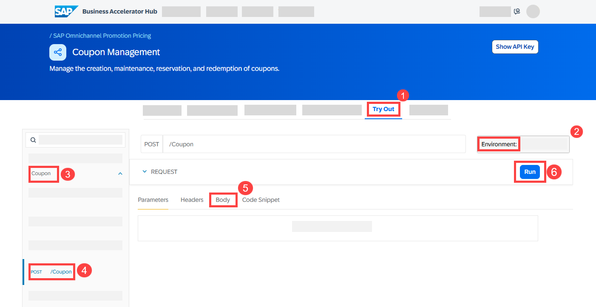
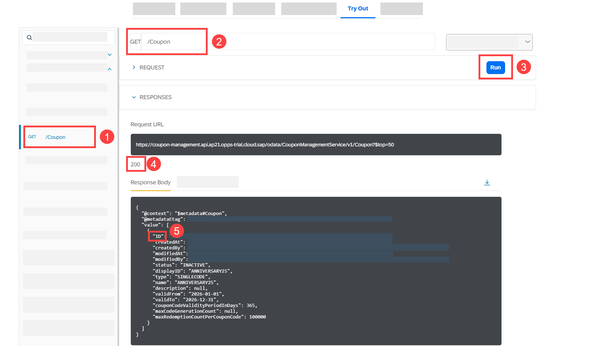
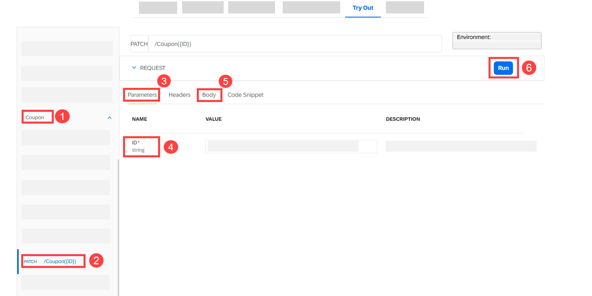
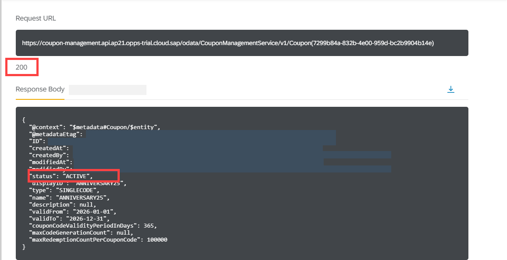
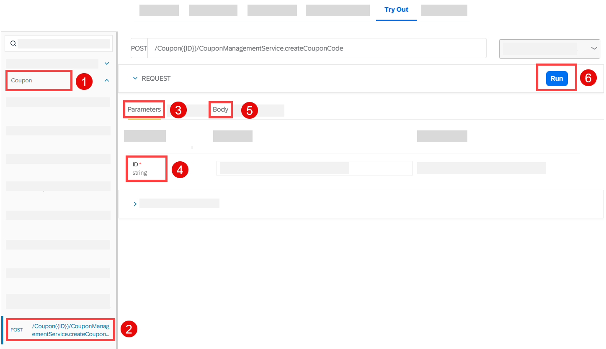
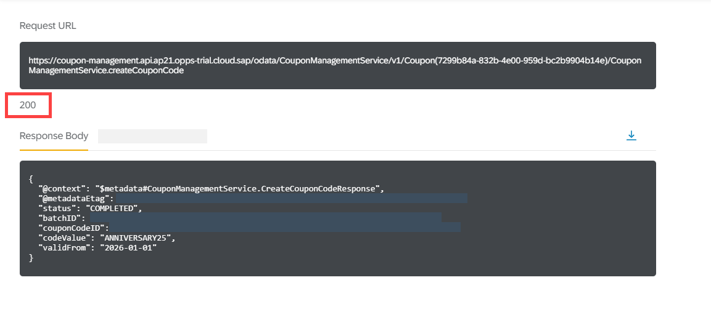

# Create a Single-Code Coupon with SAP Omnichannel Promotion Pricing

<!-- description --> Learn how to create a single-code coupon using the Coupon Management service of SAP Omnichannel Promotion Pricing.


## Prerequisites
- You have registered for a trial account on [SAP BTP](hcp-create-trial-account) in the Singapore - Azure region.
- You should be familiar with the SAP BTP trial landscape and terminology (see [Take a Tour of SAP BTP Trial](cp-trial-quick-onboarding)).
- You have a subaccount in the Cloud Foundry environment, with Microsoft Azure as provider and the Singapore region (AP21).
- You have set up SAP Omnichannel Promotion Pricing as described in [Set Up SAP Omnichannel Promotion Pricing](opps-manual-setup).
- You have set up your trial environments for the Coupon Management service, Data Upload service, Data Access service, and Calculation service as described in step 2 in [Apply a Simple Promotion with SAP Omnichannel Promotion Pricing](opps-basic-scenario).


## You will learn
- How to use the SAP Omnichannel Promotion Pricing services on SAP BTP trial 
- How to create a single-code coupon with the **Coupon Management** service


## Get to know the business scenario


* Business goal: You are a promotion planner. You are launching a promotional campaign for your customers to celebrate your company’s 25th anniversary. As part of the promotional campaign, you want to offer the **single-code coupon** `ANNIVERSARY25` to your customers. The coupon is **valid from January 1, 2026 to December 31, 2026**. 
* You distribute the coupon `ANNIVERSARY25` to your target customers. 
* You create a promotion: **Show coupon ANNIVERSARY25 and get 25% off.** 
* Because of the great collaboration between your company and SAP in the last years, you want to include SAP in your promotional campaign to celebrate together. So, you create another promotion: **Buy one or more products of brand SAP and spend more than EUR 100 to get 10% off.** For this promotion, you enable **promotion recommendations**.
* Both promotions are valid in your **web shop** (business unit: `ONLINE`) from **January 1, 2026 to December 31, 2026**.
* A few days after your promotional campaign launched, a customer that received the coupon `ANNIVERSARY25` browses through your web shop. Your customer selects a **hoodie** of brand **SAP**. The regular sales price for the hoodie is **EUR 80**. The customer enters the coupon `ANNIVERSARY25` when checking out and gets 25% off. 
* Since the shopping cart value is just **under** EUR 100, a **promotion recommendation** is displayed to the customer saying that if they add another product of brand SAP so that the shopping cart value is **over** EUR 100, they get an additional 10% off.   
* To think about this, the customer takes a short coffee break and afterwards browses through the web shop again. Since this took a few minutes, the coupon reservation needed to be **extended**.
* The customer adds another hoodie of brand SAP to the shopping cart. Since the shopping cart value is now over EUR 100, they get an additional 10% discount. They proceed to check out and finalize the payment of **EUR 108**. The coupon code is **redeemed** in the background.


### Create a single-code coupon object


At first, you create a single-code coupon object with the **Coupon Management** service.

Navigate to the [Coupon Management service of SAP Omnichannel Promotion Pricing on the SAP Business Accelerator Hub](https://api.sap.com/api/CouponManagementService/overview). Log on with the same information that you use for your SAP BTP trial account.

<!-- border -->

1. Navigate to the **Try Out** section.
2. On the right-hand side, select the trial environment you have created for the **Coupon Management** service.
3. On the left-hand side, choose **Coupon**.
4. Open the **POST** request `/Coupon`.
5. Copy the following raw data and paste it into the body:
```json
{ 
  "status": "INACTIVE",
  "displayID": "ANNIVERSARY25",
  "type": "SINGLECODE",
  "name": "ANNIVERSARY25",
  "validFrom": "2026-01-01",
  "validTo": "2026-12-31",
  "couponCodeValidityPeriodInDays": 365,
  "maxRedemptionCountPerCouponCode": 100000
}
```
1. Choose **Run**.
2. Make sure you get the HTTP response **201**.
3. From the response, note down the technical coupon ID (`ID`) as you will need it later.

The response should look like this:

<!-- border -->

With this, you have created a **single-code** coupon object with the name `ANNIVERSARY25` and a validity period from **January 1, 2026 to December 31, 2026**. The coupon can be redeemed **100,000 times**. 


**Optional**: If you want to check whether you have successfully created the single-code coupon `ANNIVERSARY25`, you can proceed with the following steps:

<!-- border -->

1. On the left-hand side, choose **Coupon**.
2. Open the **GET** request `/Coupon`.
3. Choose **Run**.
4. Make sure you get the HTTP response **200**. 
5. In the response body, you should see the coupon that you have created.  


### Change status of coupon object


When creating the coupon, you set the status of the coupon object to **inactive**. Now, change the status of the coupon object to **active**.

<!-- border -->

1. On the left-hand side, choose **Coupon**.
2. Open the **PATCH** request `/Coupon({ID})`.
3. Choose **Parameters**.
4. For **ID**, enter the technical coupon ID (`ID`) from the coupon object you have just created.
5. Copy the following raw data and paste it into the body.
```json
{ 
  "status": "ACTIVE"
}
```
1. Choose **Run**. 
2. Make sure you get the HTTP response **200**.

<!-- border -->


You have now successfully changed the status of the coupon object. 


### Create coupon codes


Now that you have created the coupon object and set it to active, you create the coupon code to be used in your promotional campaign.


<!-- border -->

1. On the left-hand side, choose **Coupon**.
2. Open the **POST** request `/Coupon({ID})/CouponManagementService.createCouponCode`.
3. Choose **Parameters**.
4. For **ID**, enter the technical coupon ID (`ID`) from the coupon object you have just created.
5. Copy the following data and paste it into the body:
```json
{ 
"codeValue": "ANNIVERSARY25", 
"validFrom": "2026-01-01" 
}
```
6. Choose **Run**.
7. Make sure you get the HTTP response **200**.

<!-- border -->

With this, you have created the coupon code `ANNIVERSARY25`. Your marketing system can now read the coupon information from the Coupon Management service and drive your promotional campaign, for example by distributing the coupon code to your target customers.


### What to do next

You can now continue with the next tutorial [Use the SAP Omnichannel Promotion Pricing Apps for Maintaining Promotions and Generic Attributes](opps-advanced-scenario-singlecode-coupon-ui) where you will use the SAP Omnichannel Promotion Pricing apps to make configurations, to maintain a generic attribute, and to upload promotions. You then associate the single-code coupon with a promotion.


### Additional information

* [Official Product Documentation](https://help.sap.com/docs/OPP)
* [Trial Documentation](https://help.sap.com/docs/OPP/0c145d124b784b548b618cda8a5b2aba/31b8aedc8ce14fcd9f6021ad4f6323c9.html)
* [SAP Omnichannel Promotion Pricing on the SAP Business Accelerator Hub](https://help.sap.com/docs/OPP/7c87270e23c64c2aa922ce297a6df23d/67a9da084cf84e058cb3a3911971bdd0.html?version=Cloud)

---