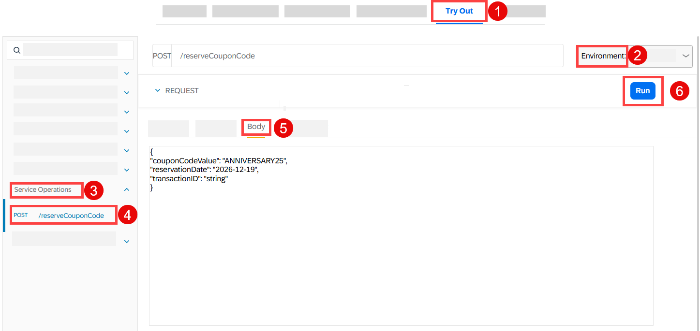
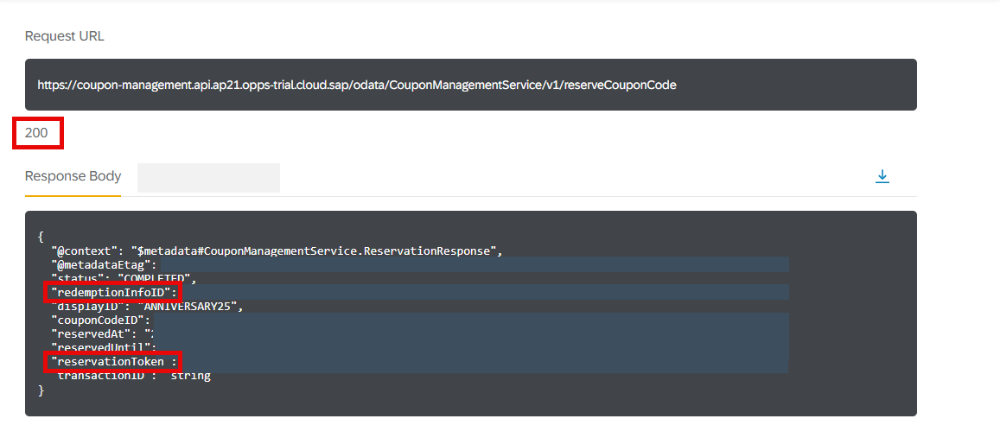
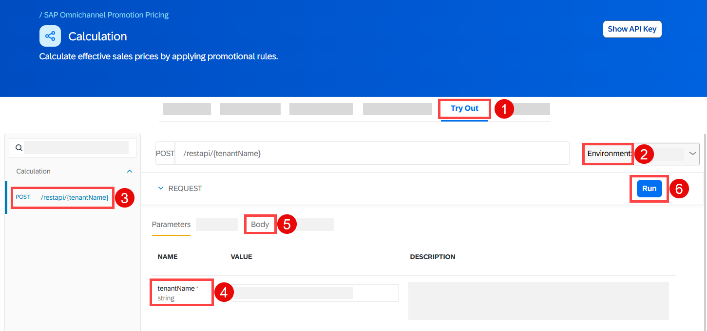
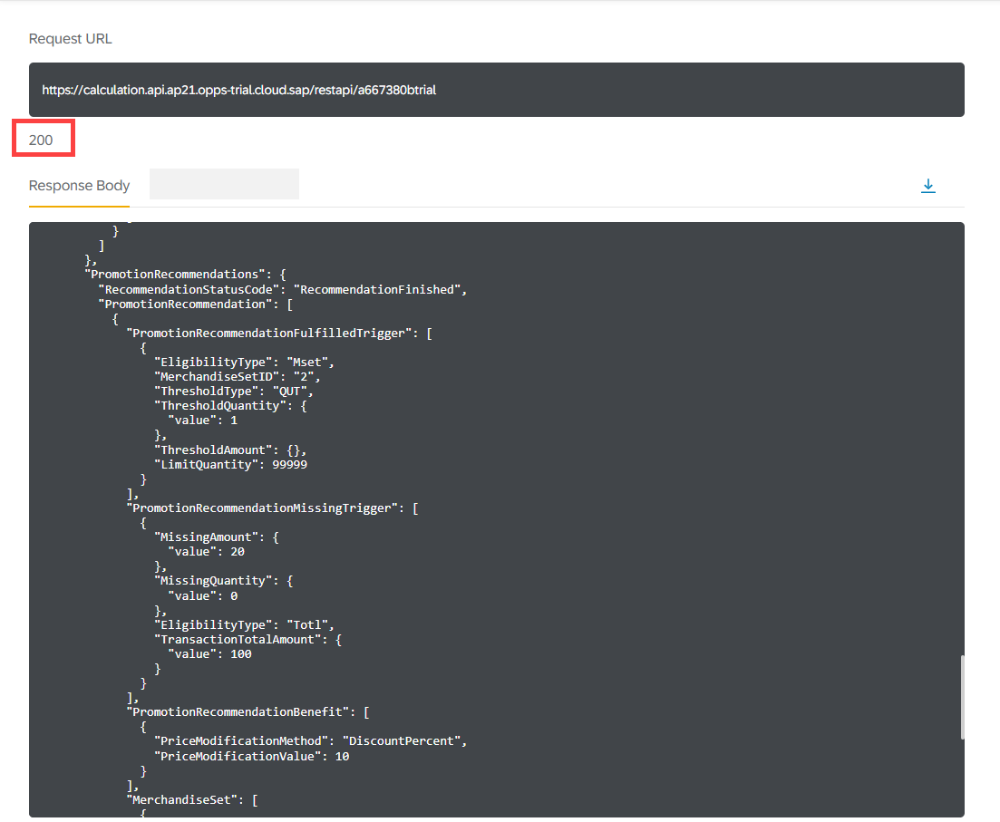
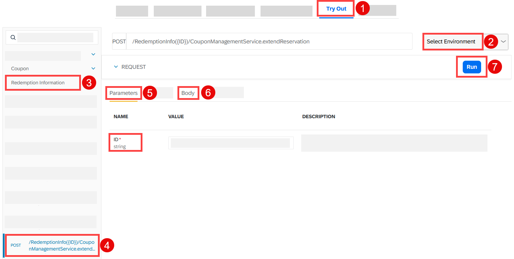
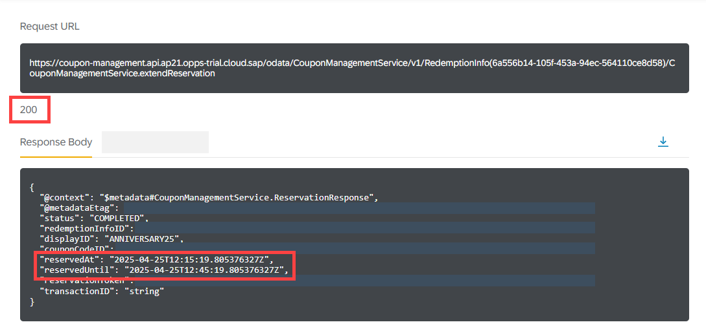
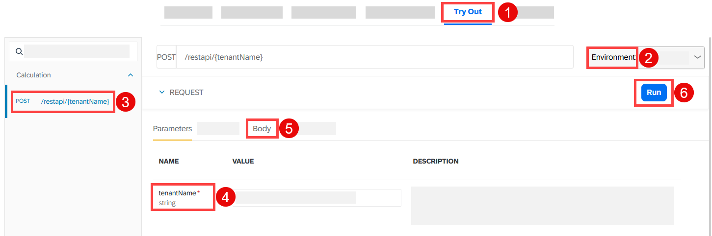
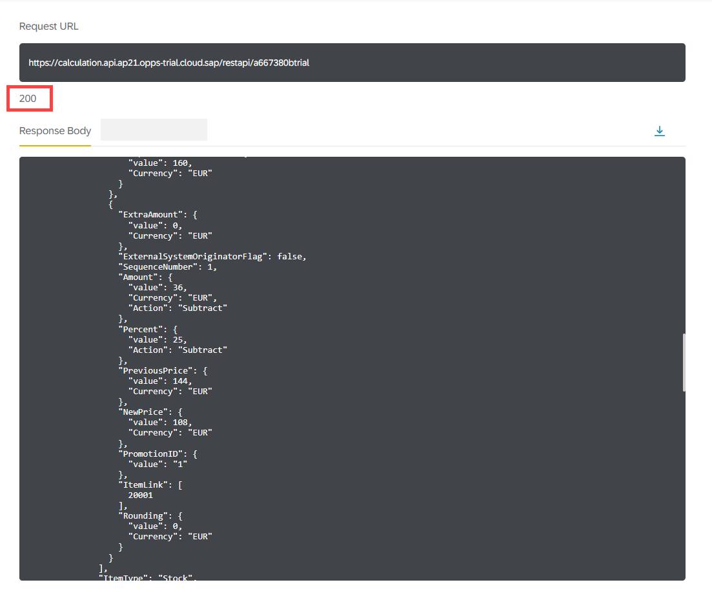
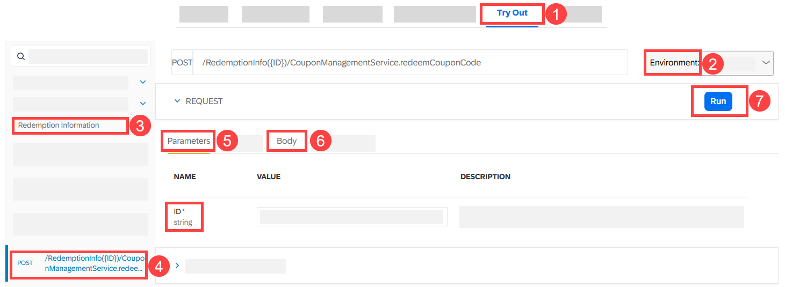
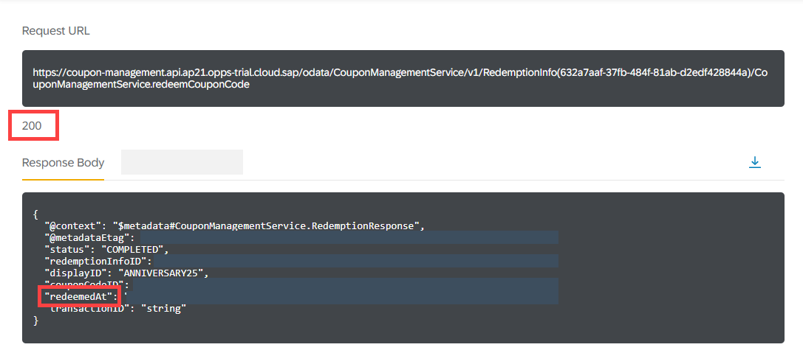

# Reserve, Extend, and Redeem a Single-Code Coupon with SAP Omnichannel Promotion Pricing

<!-- description --> Learn how to reserve, extend, and redeem a single-code coupon as well as how to calculate the effective sales price.  

## Prerequisites
- You have registered for a trial account on [SAP BTP](hcp-create-trial-account) in the Singapore - Azure region.
- You should be familiar with the SAP BTP trial landscape and terminology (see [Take a Tour of SAP BTP Trial](cp-trial-quick-onboarding)).
- You have a subaccount in the Cloud Foundry environment, with Microsoft Azure as provider and the Singapore region (AP21).
- You have set up SAP Omnichannel Promotion Pricing as described in [Set Up SAP Omnichannel Promotion Pricing](opps-manual-setup).
- You have set up your trial environments for the Coupon Management service, Data Upload service, Data Access service, and Calculation service as described in step 2 in [Apply a Simple Promotion with SAP Omnichannel Promotion Pricing](opps-basic-scenario).
- You have completed the tutorial [Create a Single-Code Coupon with SAP Omnichannel Promotion Pricing](opps-advanced-scenario-singlecode-coupon-create). With this, you have already created a single-code coupon that will be used in a promotion in this tutorial.
- You have completed the tutorial [Use the SAP Omnichannel Promotion Pricing Apps for Maintaining Promotions and Generic Attributes](opps-advanced-scenario-singlecode-coupon-ui). With this, you have created the promotions that are used in this tutorial. The promotions include the single-code coupon, a promotion recommendation, and a generic attribute. 


## You will learn
- How to use the SAP Omnichannel Promotion Pricing services on SAP BTP trial 
- How to reserve, extend, and redeem a coupon code with the **Coupon Management** service
- How to calculate the effective sales price in a sales transaction with the **Calculation** service of SAP Omnichannel Promotion Pricing by applying a coupon


## Get to know the business scenario (repeated)


* Business goal: You are a promotion planner. You are launching a promotional campaign for your customers to celebrate your company’s 25th anniversary. As part of the promotional campaign, you want to offer the **single-code coupon** `ANNIVERSARY25` to your customers. The coupon is **valid from January 1, 2026 to December 31, 2026**. 
* You distribute the coupon `ANNIVERSARY25` to your target customers. 
* You create a promotion: **Show coupon ANNIVERSARY25 and get 25% off.** 
* Because of the great collaboration between your company and SAP in the last years, you want to include SAP in your promotional campaign to celebrate together. So, you create another promotion: **Buy one or more products of brand SAP and spend more than EUR 100 to get 10% off.** For this promotion, you enable **promotion recommendations**.
* Both promotions are valid in your **web shop** (business unit: `ONLINE`) from **January 1, 2026 to December 31, 2026**.
* A few days after your promotional campaign launched, a customer that received the coupon `ANNIVERSARY25` browses through your web shop. Your customer selects a **hoodie** of brand **SAP**. The regular sales price for the hoodie is **EUR 80**. The customer enters the coupon `ANNIVERSARY25` when checking out and gets 25% off. 
* Since the shopping cart value is just **under** EUR 100, a **promotion recommendation** is displayed to the customer saying that if they add another product of brand SAP so that the shopping cart value is **over** EUR 100, they get an additional 10% off.   
* To think about this, the customer takes a short coffee break and afterwards browses through the web shop again. Since this took a few minutes, the coupon reservation needed to be **extended**.
* The customer adds another hoodie of brand SAP to the shopping cart. Since the shopping cart value is now over EUR 100, they get an additional 10% discount. They proceed to check out and finalize the payment of **EUR 108**. The coupon code is **redeemed** in the background.


### Reserve a coupon code


Now we jump back to the SAP Business Accelerator Hub. Here, you can now reserve a coupon code for the single-code coupon `ANNIVERSARY25` using the Coupon Management service. 

**Scenario**: On December 19th, 2026, your customer has selected a hoodie (material number: `HOODIE`, regular sales price: EUR 80) of brand SAP in your web shop. At the time of checkout, the customer enters the coupon code for the single-code coupon `ANNIVERSARY25`. The web shop calls the Coupon Management service to reserve the coupon code.  

**Desired Result**: The coupon code is reserved.     

Let's see if this is the case:

Navigate to the [Coupon Management service of SAP Omnichannel Promotion Pricing on SAP Business Accelerator Hub](https://api.sap.com/api/CouponManagementService/overview). Log on with the same login information that you use for your SAP BTP account.


<!-- border -->

1. Navigate to the **Try Out** section.
2. On the right-hand side, select the trial environment you have created for the **Coupon Management** service.
3. On the left-hand side, choose **Service Operation**.
4. Open the **POST** request `/reserveCouponCode`.
5. Copy the following data and paste it into the body:
```json
{ 
"couponCodeValue": "ANNIVERSARY25", 
"reservationDate": "2026-12-19",
"transactionID": "string"
}
```
1. Choose **Run**.
2. Make sure you get the HTTP response **200**.
3. From the response, note down the `redemptionInfoID` and the `reservationToken`.

The response should look like this:

<!-- border -->

With this, you have reserved the coupon code for 30 minutes. It is also possible to extend the reservation by 30 minutes.


### Calculate the effective sales price (Part 1)


You can now calculate the effective sales price using the **Calculation** service. 

**Scenario**: On December 19th, 2026, your customer has selected a hoodie (material number: `HOODIE`, regular sales price: EUR 80) of brand SAP in your web shop. At the time of checkout, the customer enters the coupon code for the single-code coupon `ANNIVERSARY25`. 

**Desired Result**: The effective sales price for one product should be **EUR 60** as the customer is eligible for the promotion *Show coupon ANNIVERSARY25 and get 25%*. In the response, a **promotion recommendation** is displayed. If they add another product of brand SAP and spend more than EUR 100, they get an additional 10% off. 

Let’s see if this is the case: 

Navigate to the [Calculation service of SAP Omnichannel Promotion Pricing on SAP Business Accelerator Hub](https://api.sap.com/api/PriceCalculation/overview). Log on with the same login information that you use for your SAP BTP account.

<!-- border -->

1. Navigate to the **Try Out** section.
2. On the right-hand side, select the trial environment you have created for the **Calculation** service.
3. Open the **POST** request `/restapi/{tenantname}`.
4. For the **tenantName**, enter the `identityzone` from the service key you have created for the **Calculation** service in your SAP BTP account. If you need assistance, see step 4 of the tutorial [Set Up SAP Omnichannel Promotion Pricing](https://developers.sap.com/tutorials/opps-manual-setup.html) .  
5. In the body, choose content type **XML**. Copy the following data and paste it into the body.
```XML
<PriceCalculate
               xmlns="http://www.sap.com/IXRetail/namespace/" InternalMajorVersion="16" InternalMinorVersion="0">
               <ARTSHeader ActionCode="Calculate" MessageType="Request">
                               <MessageID>9a89f2edfd1e413ea147e334b9c2ed4b</MessageID>
                               <DateTime>2026-12-19T10:00:00.427-05:00</DateTime>
                               <BusinessUnit TypeCode="RetailStore">ONLINE</BusinessUnit>
                               <MasterDataSourceSystemID>ABC123</MasterDataSourceSystemID>
               </ARTSHeader>
               <PriceCalculateBody TransactionType="SaleTransaction" NetPriceFlag="true" RecommendationMode="CalcAndRec">
                               <TransactionID>9a89f2edfd1e413ea147e334b9c2ed4b</TransactionID>
                               <DateTime>2026-12-19T10:00:00.000-00:00</DateTime>
                               <ShoppingBasket>
                                               <LineItem>
                                                               <SequenceNumber>0</SequenceNumber>
                                                               <Sale ItemType="Stock" NonDiscountableFlag="false" FixedPriceFlag="true">
                                                                               <ItemID>HOODIE</ItemID>
                                                                               <Quantity Units="1" UnitOfMeasureCode="EA">1</Quantity>
                                                                               <LineItemAttribute name="BRAND" custom="true">SAP</LineItemAttribute>
                                                                               <RegularSalesUnitPrice Currency="EUR">80</RegularSalesUnitPrice>
                                                               </Sale>
                                               </LineItem>
                                                <LineItem>
                               <SequenceNumber>1</SequenceNumber>
                               <Coupon>
                                               <PrimaryLabel>ANNIVERSARY25</PrimaryLabel>
                                               <Quantity>1</Quantity>
                               </Coupon>
                                               </LineItem>  
                               </ShoppingBasket>
               </PriceCalculateBody>
</PriceCalculate>
```
1. Choose **Run**.
2. Make sure you get the HTTP response **200**.

The response should look like this:

<!-- border -->

With this, the **Calculation** service has calculated the effective sales price of **EUR 60** for one SAP hoodie by applying the first promotion. It also returns a **promotion recommendation** saying that if you add another EUR 20 to the shopping cart, you'll get an additional 10% discount.


### Extend the reservation of the coupon code


**Scenario**: After your customer has entered the single-code coupon `ANNIVERSARY25`, they get a message recommending them to add further products of brand SAP to the shopping cart to get an additional 10% off. This is because you have enabled promotion recommendations and created the promotion *Buy one or more products of brand SAP and spend more than EUR 100 to get 10% off.* As the customer needs to think about this and spends more time in your web store, the reservation of the coupon code must be **extended**. 

Navigate to the [Coupon Management service of SAP Omnichannel Promotion Pricing on SAP Business Accelerator Hub](https://api.sap.com/api/CouponManagementService/overview). Log on with the same login information that you use for your SAP BTP account.

<!-- border -->

1. Navigate to the **Try Out** section.
2. On the right-hand side, select the trial environment you have created for the **Coupon Management** service.
3. On the left-hand side, choose **Redemption Information**.
4. Open the **POST** request `/RedemptionInfo({ID})/CouponManagementService.extendReservation`.
5. Under **Parameters**, enter the `redemptionInfoID` which you noted down when you reserved the coupon code.
6. Copy the following data and paste it into the body. Make sure to enter the `reservationToken` that you have noted down in the previous tutorial.
```json
{ 
"reservationToken": "string", 
"reservationDate": "2026-12-19"
}
```
7. Choose **Run**.
8. Make sure you get the HTTP response **200**.

The response should look like this:

<!-- border -->

With this, you have extended the reservation of the coupon code for another 30 minutes. 


### Calculate the effective sales price (Part 2)


You can now calculate the effective sales price using the **Calculation** service. 

**Scenario**: Your customer has entered the single-code coupon `ANNIVERSARY25`, and added another product of brand SAP to the shopping cart to get an additional 10% off. The shopping cart now contains two hoodies of brand SAP (material number: `HOODIE`, regular sales price: EUR 80). 

**Desired Result**: The effective sales price for both products should be **EUR 108** as the customer is now eligible for two promotions: 
* *Show coupon ANNIVERSARY25 and get 25%*
* *Buy one or more product of brand SAP and spend more than EUR 100 to get 10% off.*

Let’s see if this is the case: 

Navigate to the [Calculation service of SAP Omnichannel Promotion Pricing on SAP Business Accelerator Hub](https://api.sap.com/api/PriceCalculation/overview). Log on with the same login information that you use for your SAP BTP account.

<!-- border -->

1. Navigate to the **Try Out** section.
2. On the right-hand side, select the trial environment you have created for the **Calculation** service.
3. Open the **POST** request `/restapi/{tenantname}`.
4. For the **tenantName**, enter the `identityzone` from the service key you have created for the **Calculation** service in your SAP BTP account. If you need assistance, see step 4 of the tutorial [Set Up SAP Omnichannel Promotion Pricing](https://developers.sap.com/tutorials/opps-manual-setup.html) .  
5. In the body, choose content type **XML**. Copy the following data and paste it into the body.
```XML
<PriceCalculate
               xmlns="http://www.sap.com/IXRetail/namespace/" InternalMajorVersion="16" InternalMinorVersion="0">
               <ARTSHeader ActionCode="Calculate" MessageType="Request">
                               <MessageID>9a89f2edfd1e413ea147e334b9c2ed4b</MessageID>
                               <DateTime>2026-12-19T10:00:00.427-05:00</DateTime>
                               <BusinessUnit TypeCode="RetailStore">ONLINE</BusinessUnit>
                               <MasterDataSourceSystemID>ABC123</MasterDataSourceSystemID>
               </ARTSHeader>
               <PriceCalculateBody TransactionType="SaleTransaction" NetPriceFlag="true" RecommendationMode="CalcAndRec">
                               <TransactionID>9a89f2edfd1e413ea147e334b9c2ed4b</TransactionID>
                               <DateTime>2026-12-19T10:00:00.000-00:00</DateTime>
                               <ShoppingBasket>
                                               <LineItem>
                                                               <SequenceNumber>0</SequenceNumber>
                                                               <Sale ItemType="Stock" NonDiscountableFlag="false" FixedPriceFlag="true">
                                                                               <ItemID>HOODIE</ItemID>
                                                                               <Quantity Units="1" UnitOfMeasureCode="EA">2</Quantity>
                                                                               <LineItemAttribute name="BRAND" custom="true">SAP</LineItemAttribute>
                                                                               <RegularSalesUnitPrice Currency="EUR">80</RegularSalesUnitPrice>
                                                               </Sale>
                                               </LineItem>
                                                <LineItem>
                               <SequenceNumber>1</SequenceNumber>
                               <Coupon>
                                               <PrimaryLabel>ANNIVERSARY25</PrimaryLabel>
                                               <Quantity>1</Quantity>
                               </Coupon>
                                               </LineItem>  
                               </ShoppingBasket>
               </PriceCalculateBody>
</PriceCalculate>
```
1. Choose **Run**.
2. Make sure you get the HTTP response **200**.

The response should look like this:

<!-- border -->

With this, the **Calculation** service has calculated the effective sales price of **EUR 108** for the two SAP hoodies by applying two promotions. It then returns the effective sales price to the web shop.


### Redeem the coupon code


You can now redeem the coupon code for the single-code coupon `ANNIVERSARY25` using the **Coupon Management** service. 

**Scenario**: The customer has completed the purchase of two SAP hoodies for which they used the coupon `ANNIVERSARY25`. The web shop calls the **Coupon Management** service to redeem the coupon code. The redemption information is returned to the system which then confirms the completion of the purchase. 

**Desired Result**: The coupon code is redeemed. 

Let’s see if this is the case:

Navigate to the [Coupon Management service of SAP Omnichannel Promotion Pricing on SAP Business Accelerator Hub](https://api.sap.com/api/CouponManagementService/overview). Log on with the same login information that you use for your SAP BTP account.

<!-- border -->

1. Navigate to the **Try Out** section.
2. On the right-hand side, select the trial environment you have created for the **Coupon Management** service.
3. On the left-hand side, choose **Redemption Information**.
4. Open the **POST** request `/RedemptionInfo({ID})/CouponManagementService.redeemCouponCode`.
5. Under **Parameters**, enter the `redemptionInfoID` which you noted down when you reserved the coupon code.
6. In the body, replace `string` with the `reservationToken` which you noted down when you reserved the coupon code.
7. Choose **Run**.
8. Make sure you get the HTTP response **200**.

The response should look like this:

<!-- border -->

With this, you have successfully redeemed the coupon code. The redemption information is returned to the web shop, which then confirms the completion of payment. Your customer has now successfully purchased two SAP hoodies at a discounted price. Your promotional campaign is a success as you made a customer very happy!

### Additional information

* [Official Product Documentation](https://help.sap.com/docs/OPP)
* [Trial Documentation](https://help.sap.com/docs/OPP/0c145d124b784b548b618cda8a5b2aba/31b8aedc8ce14fcd9f6021ad4f6323c9.html)
* [SAP Omnichannel Promotion Pricing on the SAP Business Accelerator Hub](https://help.sap.com/docs/OPP/7c87270e23c64c2aa922ce297a6df23d/67a9da084cf84e058cb3a3911971bdd0.html?version=Cloud)

---