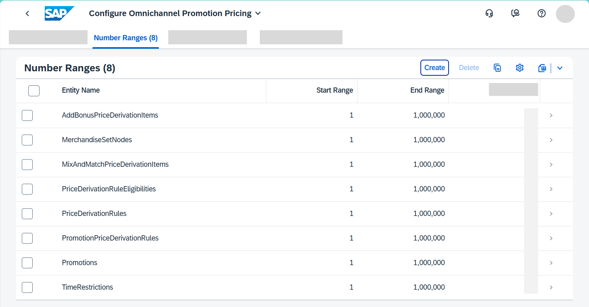
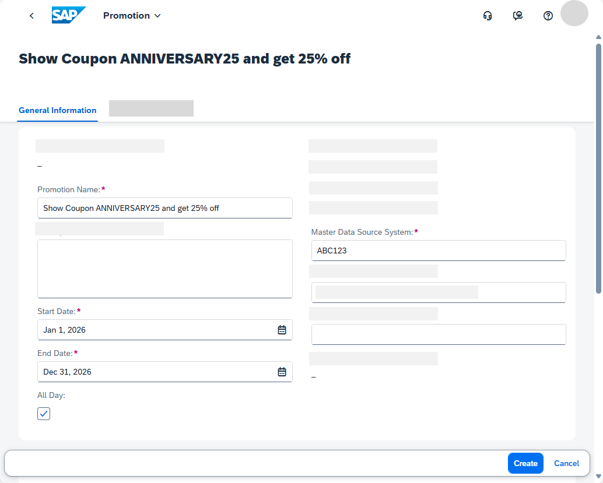
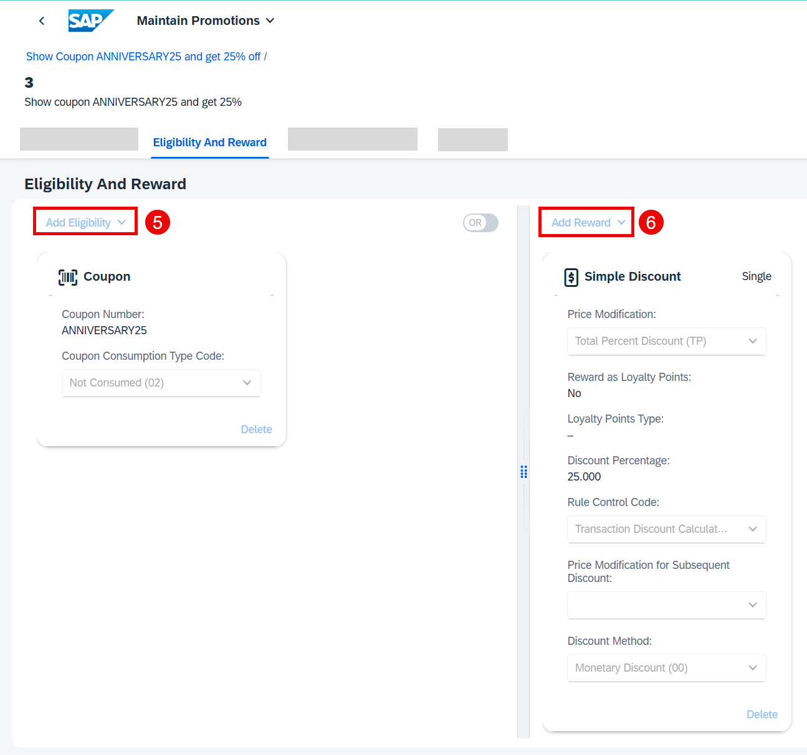
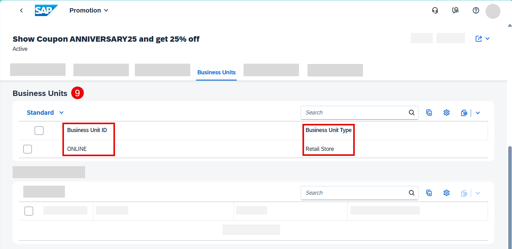
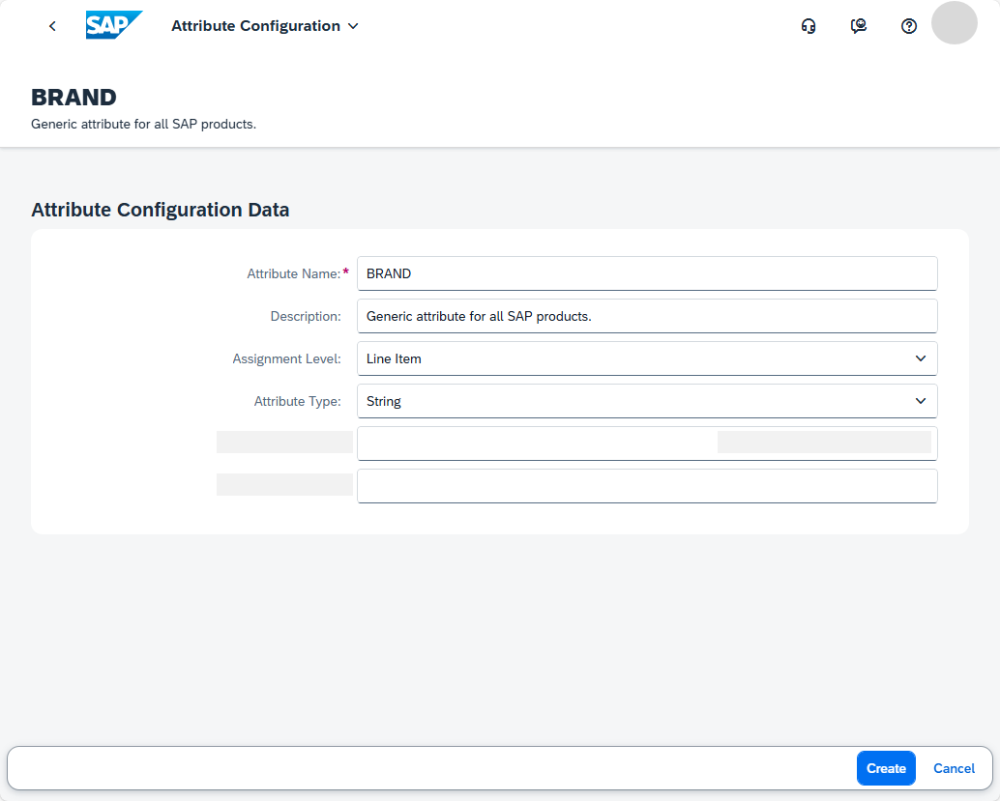
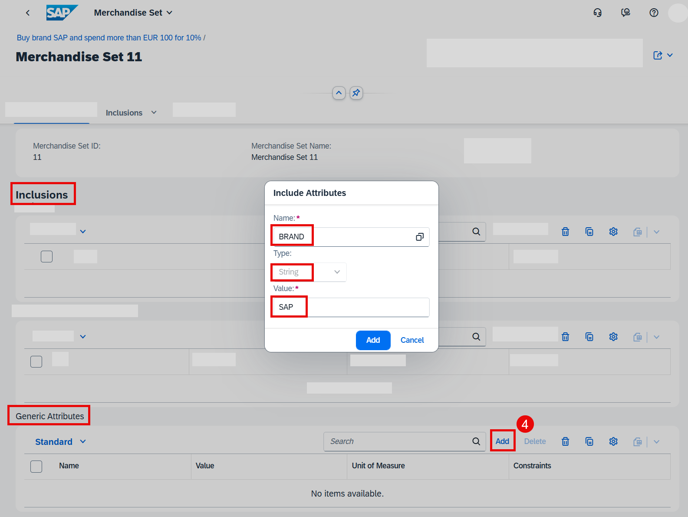
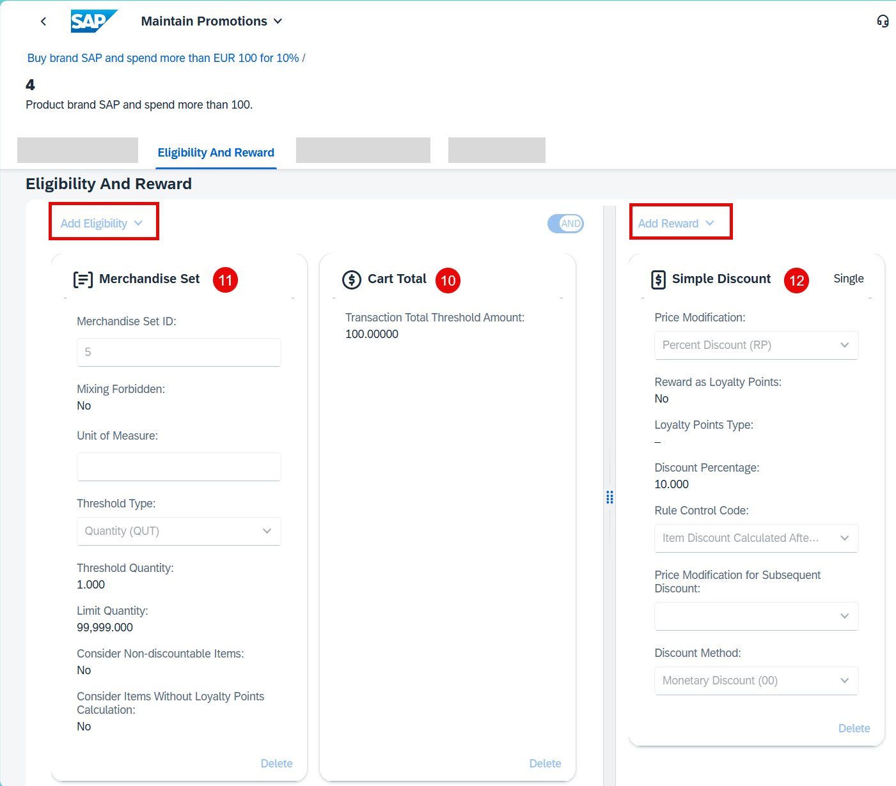
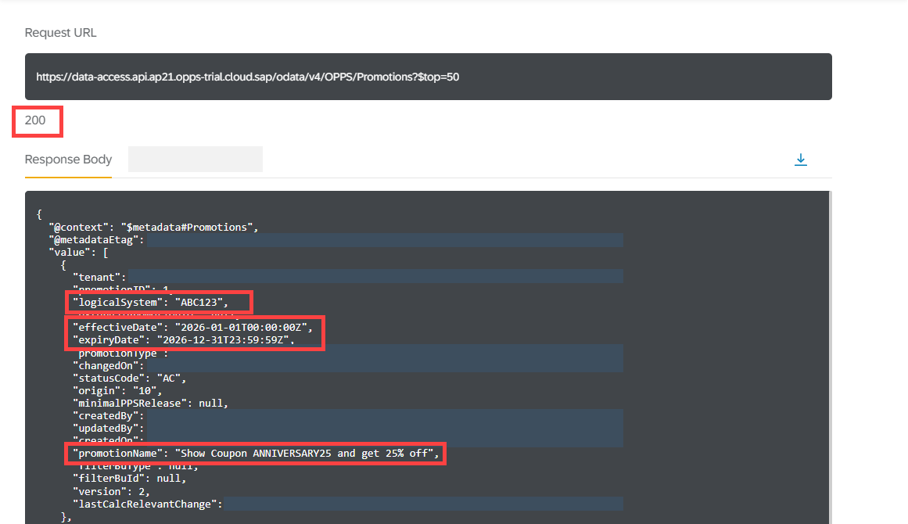
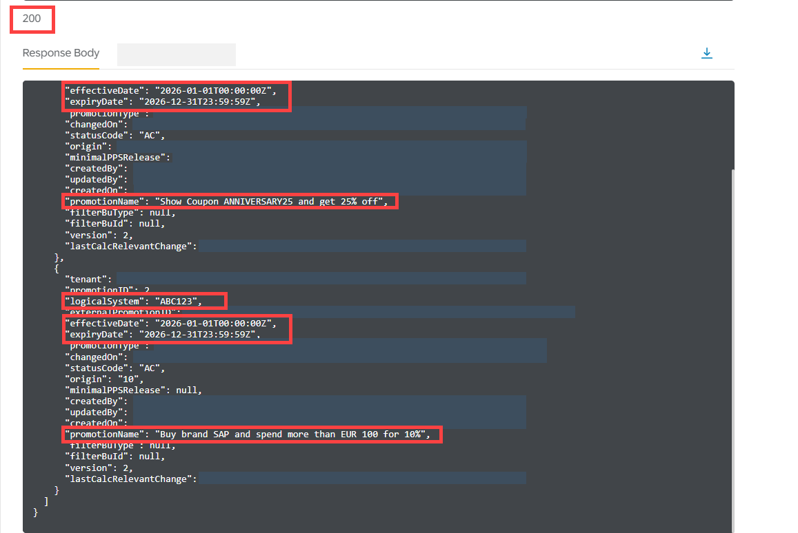

# Use the SAP Omnichannel Promotion Pricing Apps for Maintaining Promotions and Generic Attributes

<!-- description --> Learn how to associate a single-code coupon with a promotion that considers a promotion recommendation and a generic attribute. 

## Prerequisites
- You have registered for a trial account on [SAP BTP](hcp-create-trial-account) in the Singapore - Azure region.
- You should be familiar with the SAP BTP trial landscape and terminology (see [Take a Tour of SAP BTP Trial](cp-trial-quick-onboarding)).
- You have a subaccount in the Cloud Foundry environment, with Microsoft Azure as provider and the Singapore region (AP21).
- You have set up SAP Omnichannel Promotion Pricing as described in [Set Up SAP Omnichannel Promotion Pricing](opps-manual-setup).
- You have set up your trial environments for the Coupon Management service, Data Upload service, Data Access service, and Calculation service as described in step 2 in [Apply a Simple Promotion with SAP Omnichannel Promotion Pricing](opps-basic-scenario).
- You have completed the tutorial [Create a Single-Code Coupon with SAP Omnichannel Promotion Pricing](opps-advanced-scenario-singlecode-coupon-create). With this, you have already created a single-code coupon that will be used in a promotion in this tutorial.

## You will learn
- How to use the SAP Omnichannel Promotion Pricing services and apps on SAP BTP trial 
- How to maintain a line item-related generic attribute in the **Configure Generic Attributes** app
- How to create a promotion that includes a single-code coupon, a promotion recommendation, and a generic attribute in the **Maintain Promotions** app 

## Get to know the business scenario (repeated)

* Business goal: You are a promotion planner. You are launching a promotional campaign for your customers to celebrate your company’s 25th anniversary. As part of the promotional campaign, you want to offer the **single-code coupon** `ANNIVERSARY25` to your customers. The coupon is **valid from January 1, 2026 to December 31, 2026**. 
* You distribute the coupon `ANNIVERSARY25` to your target customers. 
* You create a promotion: **Show coupon ANNIVERSARY25 and get 25% off.** 
* Because of the great collaboration between your company and SAP in the last years, you want to include SAP in your promotional campaign to celebrate together. So, you create another promotion: **Buy one or more products of brand SAP and spend more than EUR 100 to get 10% off.** For this promotion, you enable **promotion recommendations**.
* Both promotions are valid in your **web shop** (business unit: `ONLINE`) from **January 1, 2026 to December 31, 2026**.
* A few days after your promotional campaign launched, a customer that received the coupon `ANNIVERSARY25` browses through your web shop. Your customer selects a **hoodie** of brand **SAP**. The regular sales price for the hoodie is **EUR 80**. The customer enters the coupon `ANNIVERSARY25` when checking out and gets 25% off. 
* Since the shopping cart value is just **under** EUR 100, a **promotion recommendation** is displayed to the customer saying that if they add another product of brand SAP so that the shopping cart value is **over** EUR 100, they get an additional 10% off.   
* To think about this, the customer takes a short coffee break and afterwards browses through the web shop again. Since this took a few minutes, the coupon reservation needed to be **extended**.
* The customer adds another hoodie of brand SAP to the shopping cart. Since the shopping cart value is now over EUR 100, they get an additional 10% discount. They proceed to check out and finalize the payment of **EUR 108**. The coupon code is **redeemed** in the background.

### Use the Configure SAP Omnichannel Promotion Pricing app

You now make configuration settings that are required for using the SAP Omnichannel Promotion Pricing apps. Note that we will not go into detail but simply use default configuration values.

1. Log on to the SAP BTP cockpit of your trial. 
2. In the navigation pane, choose **Services > Instances and Subscriptions**. 
3. Under **Application**, next to **SAP Omnichannel Promotion Pricing**, choose the three dot symbol °°° and **Go to Application**. 
4. Choose the **Configure Omnichannel Promotion Pricing** app. 
5. On the **Configurations** tab, create a new configuration. 
6. Use **`Jan 1, 2026`** as the valid-from date. Leave all other fields empty. The default values are drawn automatically. 
7. Navigate back to the **Number Ranges** tab. 
8. Create a new number range for the **Promotions** entity. Use a start range of **`1`** and end range of **`1,000,000`**.
9. Create a number range with the same start and end range for **all** remaining entity names. Your number ranges should look like this:

    <!-- border -->

10. Navigate back to the home screen by choosing the SAP logo.

### Create the first promotion in the Maintain Promotions app

You now want to maintain the first promotion *Show coupon ANNIVERSARY25 and get 25% off* using the app. 

1. Choose the **Maintain Promotions** app.
2. Create a new promotion with the following information:

    <!-- border -->

    |  Field Name                       | Value
    |  :-------------                   | :-------------
    |  Promotion Name                   | **`Show Coupon ANNIVERSARY25 and get 25% off`** 
    |  Start Date                       | **`Jan 1, 2026`**
    |  End Date                         | **`Dec 31, 2026`**
    |  All Day                          | Enable this option.
    |  Master Data Source System        | **`ABC123`**

3. Create a **promotional rule**. Enter a rule name, for example **`Show coupon ANNIVERSARY25 and get 25%`**. You can skip the advanced rule settings. The default values are drawn automatically.
4. Edit the rule you have just created.
   
    <!-- border -->

5. On the **Eligibility** side, add a **Coupon** with the following values:
    
    |  Field Name                       | Value
    |  :-------------                   | :-------------
    |  Coupon Number                    | **`ANNIVERSARY25`**
    |  Coupon Consumption Type Code     | **`Not Consumed (02)`**
    
6. On the **Reward** side, add a single reward of type **Simple Discount** with the following values. You can leave out the other options. 
    
    |  Field Name                       | Value
    |  :-------------                   | :-------------
    |  Price Modification               | **`Total Percent Discount (TP)`** 
    |  Discount Percentage              | **`25`**
    |  Rule Control Code                | **`Transaction Discount Calculated After Subtotal (SU)`**
    |  Discount Method                  | **`Monetary Discount (00)`** 
    
7. Save your changes.
8. Navigate back to the promotion.
9.  On the **Business Units** tab, create a business unit with the following values:
    
    <!-- border -->
    
    |  Field Name                       | Value
    |  :-------------                   | :-------------
    |  Business Unit Type               | **`Retail Store`** 
    |  Business Unit ID                 | **`ONLINE`**
    
10. Navigate back to the promotion and **activate** your promotion. 
11. Navigate back to the home screen by choosing the SAP logo. 

### Use the Configure Generic Attribute app

You now maintain a line item-related generic attribute that can be used in your promotions in order to offer discounts on all products of brand SAP.  

1. Choose the **Configure Generic Attributes** app.
2. Create a new generic attribute with the following information:

    <!-- border -->
    
    |  Field Name                       | Value
    |  :-------------                   | :-------------
    |  Attribute Name                   | **`BRAND`** 
    |  Description                      | **`Generic attribute for all SAP products.`**
    |  Assignment Level                 | **`Line Item`**
    |  Attribute Type                   | **`String`** 
    |  Maximum Length                   | Skip this option. 
    |  Regular Expression               | Skip this option. 
    
3. Save your changes.
4. Navigate back to the home screen by choosing the SAP logo. 

### Create the second promotion in the Maintain Promotions app

You now want to maintain the second promotion *Buy one or more products of brand SAP and spend more than EUR 100 to get 10% off* that includes the line item-related generic attribute.  

1. Choose the **Maintain Promotions** app. 
2. Create a new promotion with the following information:
    
    |  Field Name                       | Value
    |  :-------------                   | :-------------
    |  Promotion Name                   | **`Buy brand SAP and spend more than EUR 100 for 10%`**  
    |  Start Date                       | **`Jan 1, 2026`**
    |  End Date                         | **`Dec 31, 2026`**
    |  All Day                          | Enable this option. 
    |  Master Data Source System        | **`ABC123`**

3. Skip the **Promotional Rules** tab for now and directly go to the **Merchandise Sets** tab.
4. Create a new merchandise set. The merchandise set will be used for the line item-related generic attribute **`BRAND`**. On the **Inclusion** side of the merchandise set, add a generic attribute with the following values:

    <!-- border -->
    
    |  Field Name        | Value
    |  :-------------    | :-------------
    |  Name              | Use the search help and select the attribute name **BRAND** that you have created previously.
    |  Type              | **`String`**    
    |  Value             | **`SAP`**
    
5. Note down the merchandise set ID.
6. Navigate back to the promotion.
7. On the **Business Units** tab, create a business unit with the following values:
    
    |  Field Name                       | Value
    |  :-------------                   | :-------------
    |  Business Unit Type               | **`Retail Store`** 
    |  Business Unit ID                 | **`ONLINE`**

8. Now, on the **Promotional Rules** tab, create a promotional rule with the following information. Enter a rule name, for example **`Product brand SAP and spend more than 100.`** You can skip the advanced rule settings. The default values are drawn automatically.
9.  Edit the rule you have just created.

    <!-- border -->

10. On the **Eligibility** side, add a **Cart Total** with a **Transaction Total Threshold Amount** of **`100`**.
11. Also on the **Eligibility** side, add the merchandise set ID that you have created previously. Use the search help. The values are drawn automatically.
12. On the **Reward** side, add a single reward of type **Simple Discount** with the following values. You can leave out the other options.
    
    |  Field Name                       | Value
    |  :-------------                   | :-------------
    |  Price Modification               | **`Percent Discount (RP)`** 
    |  Discount Percentage              | **`10`**
    |  Rule Control Code                | **`Item Discount Calculated After Subtotal (PC)`**
    |  Discount Method                  | **`Monetary Discount`**

13. Scroll down to the **Advanced Rule Settings** tab, enable the **Available for Promotion Recommendations** option. Enter a **Threshold Percentage for Promotion Recommendations** of **`50`**. This means that if 50% of the respective eligibility is fulfilled, a promotion recommendation is given.

    <!-- border -->

14. Save your changes.
15. Navigate back to the promotion and **activate** your promotion.

With this, you have maintained all promotions and you can start your promotional campaign by circulating the coupon `ANNIVERSARY25` to your target customers.

### Check master data (Optional)

You can use the **Data Access** service for checking your data stored in the database. If you need guidance, have a look at **step 5** of the tutorial [Apply a Simple Promotion with SAP Omnichannel Promotion Pricing](opps-basic-scenario).

<!-- border -->

<!-- border -->

With this, you are all set to launch your promotional campaign. 

### What to do next

You can now continue with the next tutorial [Reserve, Extend, and Redeem a Single-Code Coupon with SAP Omnichannel Promotion Pricing](opps-advanced-scenario-singlecode-coupon-redeem) where you will use the SAP Omnichannel Promotion Pricing service to reserve, extend, and redeem a coupon code with the Coupon Management service and calculate the effective sales price.

### Additional information

* [Official Product Documentation](https://help.sap.com/docs/OPP)
* [Trial Documentation](https://help.sap.com/docs/OPP/0c145d124b784b548b618cda8a5b2aba/31b8aedc8ce14fcd9f6021ad4f6323c9.html)
* [SAP Omnichannel Promotion Pricing on the SAP Business Accelerator Hub](https://help.sap.com/docs/OPP/7c87270e23c64c2aa922ce297a6df23d/67a9da084cf84e058cb3a3911971bdd0.html?version=Cloud)

---