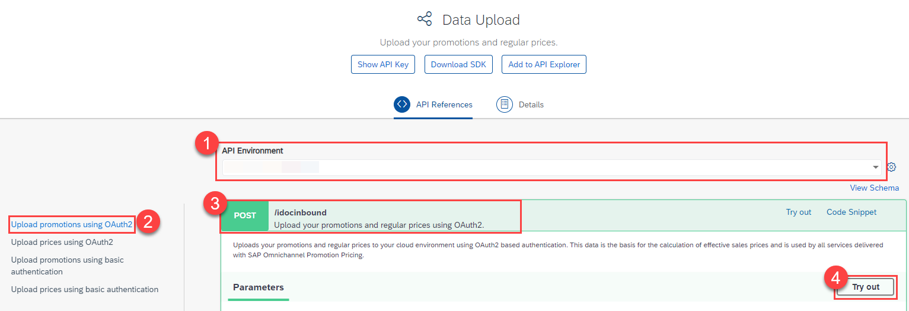

## Prerequisites
- You have completed the tutorials [Apply a Simple Promotion with SAP Omnichannel Promotion Pricing](opps-basic-scenario) and [Apply a Mix-and-Match Promotion with SAP Omnichannel Promotion Pricing](opps-advanced-scenario-mixandmatch).
- You have registered for a trial account on [SAP BTP](hcp-create-trial-account).
- You should be familiar with the SAP BTP trial landscape and terminology (see [Take a Tour of SAP BTP Trial](cp-trial-quick-onboarding)).
- You have a subaccount in the Cloud Foundry environment, with Amazon Web Services (AWS) as provider and the Europe (Frankfurt) region.
- You have set up SAP Omnichannel Promotion Pricing as described in [Set Up SAP Omnichannel Promotion Pricing](opps-manual-setup).


## Details
### You will learn
- How to use the SAP Omnichannel Promotion Pricing trial on SAP BTP
- How to upload a **promotional rule with a discount on transaction level** with the help of the SAP API Business Hub
- How to execute a calculation request to determine the effective sales price that includes the discount on transaction level

---

[ACCORDION-BEGIN [Step 1: ](Get to know the business scenario)]

* Business goal: You are a household equipment vendor and you want to celebrate the 25th anniversary of your **Heidelberg** store (business unit ID: `FC01`). For this, you have created the following promotion: **Spend 800 Euro and get 25% off.**
* Your promotion is valid from **May 1st, 2021 until May 7th, 2021**.
* The **regular sales price** for the **coffee machine** (material number: `COFFEE_MACHINE`) is **500 Euro**.
* A customer put two **coffee machines** in the shopping cart.
* You call the Calculation service with the shopping cart information (store, products, date, time).
* The Calculation service calculates the effective sales price by applying the transactional promotional rule

[VALIDATE_1]
[ACCORDION-END]

<!-- [ACCORDION-BEGIN [Step 2: ](Set up SAP Omnichannel Promotion Pricing)]

To use the SAP Omnichannel Promotion Pricing trial, you need to:

1. Subscribe to SAP Omnichannel Promotion Pricing
2. Set Up Roles and Authorizations
3. Create Service Instances
4. Create Service Keys

For step-by-step instructions, go to the tutorial [Set Up SAP Omnichannel Promotion Pricing](opps-manual-setup).

[DONE]
[ACCORDION-END] -->


[ACCORDION-BEGIN [Step 2: ](Create environments in SAP API Business Hub)]

In order to continue with the next steps, you need to have already set up your trial environments for the Data Upload service, Data Access service, and Calculation service in the SAP API Business Hub. If you need guidance, have a look at step 3 of the tutorial [Apply a Simple Promotion with SAP Omnichannel Promotion Pricing](opps-basic-scenario).

[DONE]

[ACCORDION-END]

[ACCORDION-BEGIN [Step 3: ](Upload promotional rule)]

You can now upload the promotional rule for the transactional discount with the Data Upload service.

Navigate to the [Data Upload service of SAP Omnichannel Promotion Pricing on SAP API Business Hub](https://api.sap.com/api/DataUpload/resource). Log on with the same login information that you use for your SAP BTP account.

!
!


1. For **API Environment**, select the trial environment you have created for the Data Upload service.
2. On the left-hand side, choose **Upload promotions using OAuth2**.
3. Open the **POST** request `/idocinbound`.
4. Choose **Try Out**.
5. For the **Request body**, choose `application/xml`.
6. Copy the following raw data and paste it into the body:
```XML
<?xml version="1.0" encoding="utf-8"?>
<_-ROP_-PROMOTION02>
  <IDOC BEGIN="1">
    <EDI_DC40 SEGMENT="1">
      <IDOCTYP>/ROP/PROMOTION02</IDOCTYP>
    </EDI_DC40>
    <_-ROP_-E1_PROMOTION SEGMENT="1">
      <CHANGED_ON>20210505112451</CHANGED_ON>
      <CHANGE_INDICATOR>I</CHANGE_INDICATOR>
      <EFFECTIVE_DATE>20210501000000</EFFECTIVE_DATE>
      <EXPIRY_DATE>20210507235959</EXPIRY_DATE>
      <EXTERN_PROMO_ID>000000000000000000000000000000000121</EXTERN_PROMO_ID>
      <LOGSYS>ABCCLNT999</LOGSYS>
      <MIN_PPS_RELEASE>0</MIN_PPS_RELEASE>
      <OFFER_ID>42010AEF0FAA1EEBAFF4E5F2348A36B8</OFFER_ID>
      <ORIGIN>01</ORIGIN>
      <PROMOTION_ID>641</PROMOTION_ID>
      <PROMOTION_TYPE>Z001</PROMOTION_TYPE>
      <STATUS_TCD>AC</STATUS_TCD>
      <_-ROP_-E1_PROMOTION_BU SEGMENT="1">
        <BU_ID>FC01</BU_ID>
        <BU_TYPE>1040</BU_TYPE>
      </_-ROP_-E1_PROMOTION_BU>
      <_-ROP_-E1_PROMOTION_RULE SEGMENT="1">
        <ELIGIBILITY_ID>642</ELIGIBILITY_ID>
        <ONLY_BASKET_MODE>X</ONLY_BASKET_MODE>
        <PRICE_RULE_ID>642</PRICE_RULE_ID>
        <PROMO_RULE_ID>642</PROMO_RULE_ID>
        <RESOLUTION>0</RESOLUTION>
        <SALE_RETURN_TCD>00</SALE_RETURN_TCD>
        <SEQUENCE>642</SEQUENCE>
        <_-ROP_-E1_ELIGIBILITY SEGMENT="1">
          <CURRENCY_ISO_CODE>EUR</CURRENCY_ISO_CODE>
          <EFFECTIVE_DATE>20210501000000</EFFECTIVE_DATE>
          <ELIGIBILITY_ID>642</ELIGIBILITY_ID>
          <EXPIRY_DATE>20210507235959</EXPIRY_DATE>
          <INTERVAL_AMT>0.00000</INTERVAL_AMT>
          <INTERVAL_QTY>0.000</INTERVAL_QTY>
          <LIMIT_AMT>0.00000</LIMIT_AMT>
          <LIMIT_QTY>0.000</LIMIT_QTY>
          <MERCH_SET_ID>0</MERCH_SET_ID>
          <PARENT_ELIGIB_ID>642</PARENT_ELIGIB_ID>
          <PROMO_RULE_ID>642</PROMO_RULE_ID>
          <ROOT_ELIGIB_ID>642</ROOT_ELIGIB_ID>
          <STATUS_TCD>AC</STATUS_TCD>
          <THRESHOLD_AMT>0.00000</THRESHOLD_AMT>
          <THRESHOLD_QTY>0.000</THRESHOLD_QTY>
          <TRANS_TOTAL_AMT>800.00000</TRANS_TOTAL_AMT>
          <TYPE_CODE>TOTL</TYPE_CODE>
        </_-ROP_-E1_ELIGIBILITY>
        <_-ROP_-E1_PRICE_RULE SEGMENT="1">
          <CALCULATION_BASE>00</CALCULATION_BASE>
          <CALC_BASE_SEQUENCE>1-</CALC_BASE_SEQUENCE>
          <CONSIDER_PREVIOUS_RULES>X</CONSIDER_PREVIOUS_RULES>
          <COUPON_VALIDITY>0</COUPON_VALIDITY>
          <CURRENCY_ISO_CODE>EUR</CURRENCY_ISO_CODE>
          <DISC_METHOD_TCD>00</DISC_METHOD_TCD>
          <EX_PRICE_RULE_ID>0000000000000000000</EX_PRICE_RULE_ID>
          <ITEM_METHOD>00</ITEM_METHOD>
          <MAM_LIMIT_CNT>0.000</MAM_LIMIT_CNT>
          <NEW_PRICE_AMT>0.00000</NEW_PRICE_AMT>
          <NEW_SET_PRCE_AMT>0.00000</NEW_SET_PRCE_AMT>
          <PRICE_MODIF_AMT>0.00000</PRICE_MODIF_AMT>
          <PRICE_MODIF_CODE>TP</PRICE_MODIF_CODE>
          <PRICE_MODIF_PERC>25.000</PRICE_MODIF_PERC>
          <PRICE_RULE_ID>642</PRICE_RULE_ID>
          <ROUNDING_METHOD>00</ROUNDING_METHOD>
          <ROUND_DECIMALS>2</ROUND_DECIMALS>
          <ROUND_DESTINATION>1</ROUND_DESTINATION>
          <RULE_CTRL_CODE>SU</RULE_CTRL_CODE>
          <STATUS_TCD>AC</STATUS_TCD>
          <SUBSEQ_NEW_PRICE_AMT>0.00000</SUBSEQ_NEW_PRICE_AMT>
          <SUBSEQ_PRICE_MODIF_AMT>0.00000</SUBSEQ_PRICE_MODIF_AMT>
          <SUBSEQ_PRICE_MODIF_PERC>0.000</SUBSEQ_PRICE_MODIF_PERC>
          <TYPE_CODE>RB</TYPE_CODE>
        </_-ROP_-E1_PRICE_RULE>
      </_-ROP_-E1_PROMOTION_RULE>
      <_-ROP_-E1_PROMOTION_TEXT SEGMENT="1">
        <DESCRIPTION>Spend 800 Euro and get 25% off.</DESCRIPTION>
        <NAME>Spend 800 Euro and get 25% off.</NAME>
        <SPRAS_ISO>EN</SPRAS_ISO>
      </_-ROP_-E1_PROMOTION_TEXT>
    </_-ROP_-E1_PROMOTION>
  </IDOC>
</_-ROP_-PROMOTION02>
```
7. Choose **Execute**.
8. Make sure you get the HTTP response **200**.

With this, you uploaded the promotional rule "Spend 800 Euro and get 25% off" (promotion ID: `641`) for the **Heidelberg** store (business unit ID: `FC01`) and the validity period **May 1st, 2021 to May 7th, 2021**.

>In this tutorial, you only upload the promotional rule for the transactional discount. You have already uploaded the regular sales price of **500 Euro** for the product **coffee machine** (material number: `COFFEE_MACHINE`, unit of measure: `PCE`) with the validity period **May 1st, 2021 to December 31st, 2021** in step 3 of the previous tutorial [Apply a Mix-and-Match Promotion with SAP Omnichannel Promotion Pricing](opps-advanced-scenario-mixandmatch).

[VALIDATE_2]

[ACCORDION-END]

[ACCORDION-BEGIN [Step 4: ](Check uploaded master data)]

You can use the **Data Access** service for checking your uploaded data. If you need guidance, have a look at step 5 of the tutorial [Apply a Simple Promotion with SAP Omnichannel Promotion Pricing](opps-basic-scenario).

[DONE]
[ACCORDION-END]

[ACCORDION-BEGIN [Step 5: ](Calculate the effective sales price)]

You can now calculate the effective sales price based on the data you have uploaded.

**Scenario**: A customer has two **coffee machines** (material number: `COFFEE_MACHINE`) in the shopping cart with a regular sales price of **500 Euro** per piece. The customer wants to purchase them on **May 5th, 2021** in the **Heidelberg** store (business unit ID: `FC01`).

**Desired Result**: The customer should get a 25% discount on the shopping cart total of 1.000 Euro, as more than 800 Euro are spent.

Let's see if this is the case:

!
!


1. Navigate to the [Calculation service on the SAP API Business Hub](https://api.sap.com/api/PriceCalculation/resource).
2. For **API Environment**, select your trial environment for the Calculation service.
3. Open the **POST** request `/restapi/{tenantName}` and choose **Try Out**.
4. In the field `tenantName` enter the `identityzone` from the service key you have created for the Calculation service in your SAP BTP account.
>If you need more information about service keys, go to step 4 in the tutorial [Set Up SAP Omnichannel Promotion Pricing](opps-manual-setup).

5. For the **Request body**, choose `application/xml`.
6. Copy the following raw data and paste it into the body:

```XML
<PriceCalculate xmlns="http://www.sap.com/IXRetail/namespace/" InternalMajorVersion="2" InternalMinorVersion="1">
	<ARTSHeader ActionCode="Calculate" MessageType="Request">
		<MessageID>123456789</MessageID>
		<DateTime>2021-05-05T18:13:51.0</DateTime>
		<BusinessUnit TypeCode="RetailStore">FC01</BusinessUnit>    
        <MasterDataSourceSystemID>ABCCLNT999</MasterDataSourceSystemID>
	</ARTSHeader>
   <PriceCalculateBody TransactionType="SaleTransaction" NetPriceFlag="false">
	  <TransactionID>3456789</TransactionID>
	  <DateTime>2021-05-05T18:13:51.0</DateTime>
    <ShoppingBasket>
      <LineItem>
         <SequenceNumber>0</SequenceNumber>
         <Sale ItemType="Stock" NonDiscountableFlag="false" FixedPriceFlag="false">
            <TaxIncludedInPriceFlag>false</TaxIncludedInPriceFlag>
            <NonPieceGoodFlag>false</NonPieceGoodFlag>
            <PriceTypeCode>00</PriceTypeCode>
            <NotConsideredByPriceEngineFlag>false</NotConsideredByPriceEngineFlag>
            <ItemID>COFFEE_MACHINE</ItemID>   
            <Quantity Units="1" UnitOfMeasureCode="PCE">2</Quantity>
           </Sale>
      </LineItem>
    </ShoppingBasket>  
   </PriceCalculateBody>
</PriceCalculate>
```

Make sure you get the HTTP response **200**.

[VALIDATE_3]
[ACCORDION-END]

### Additional Information

* [Official Product Documentation](https://help.sap.com/viewer/product/OPP/Cloud/en-US)
* [Trial Documentation](https://help.sap.com/viewer/0c145d124b784b548b618cda8a5b2aba/Cloud/en-US/31b8aedc8ce14fcd9f6021ad4f6323c9.html)
* [SAP Omnichannel Promotion Pricing on the SAP API Business hub](https://help.sap.com/viewer/0c145d124b784b548b618cda8a5b2aba/Cloud/en-US/67a9da084cf84e058cb3a3911971bdd0.html)
* [Video: SAP Omnichannel Promotion Pricing in a nutshell](https://www.sap.com/assetdetail/2020/07/9060b3a5-a67d-0010-87a3-c30de2ffd8ff.html)

---
