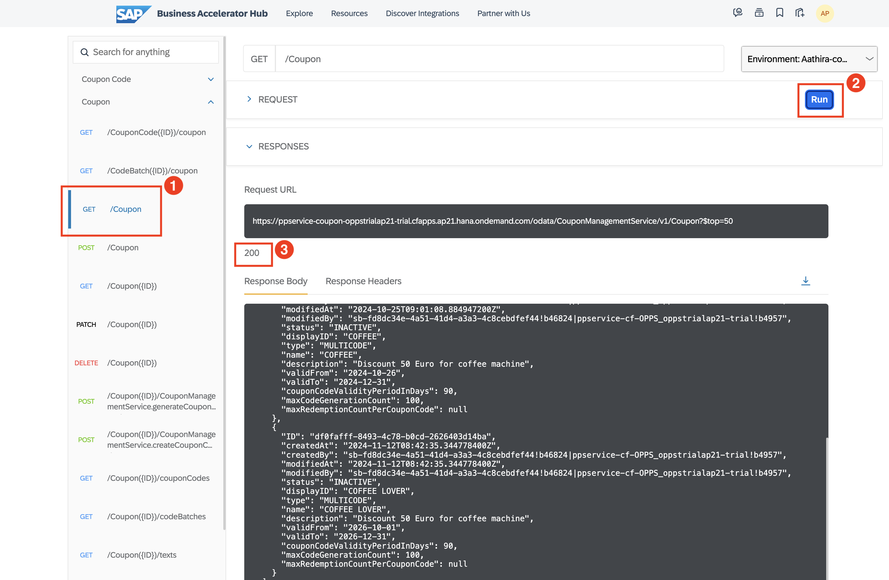
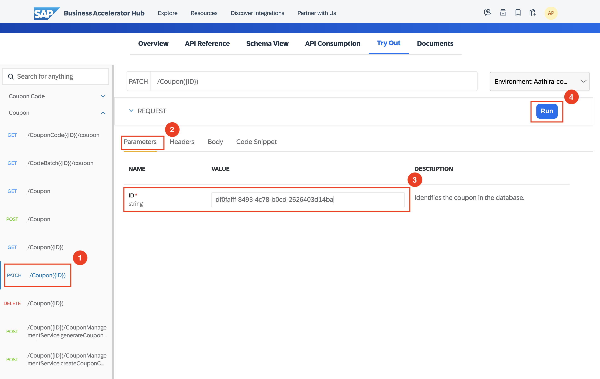
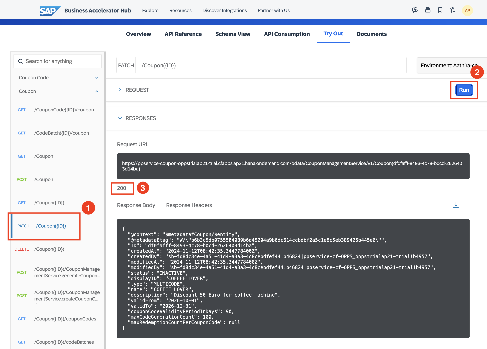
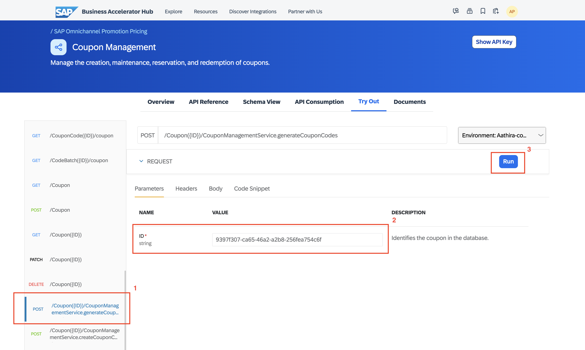
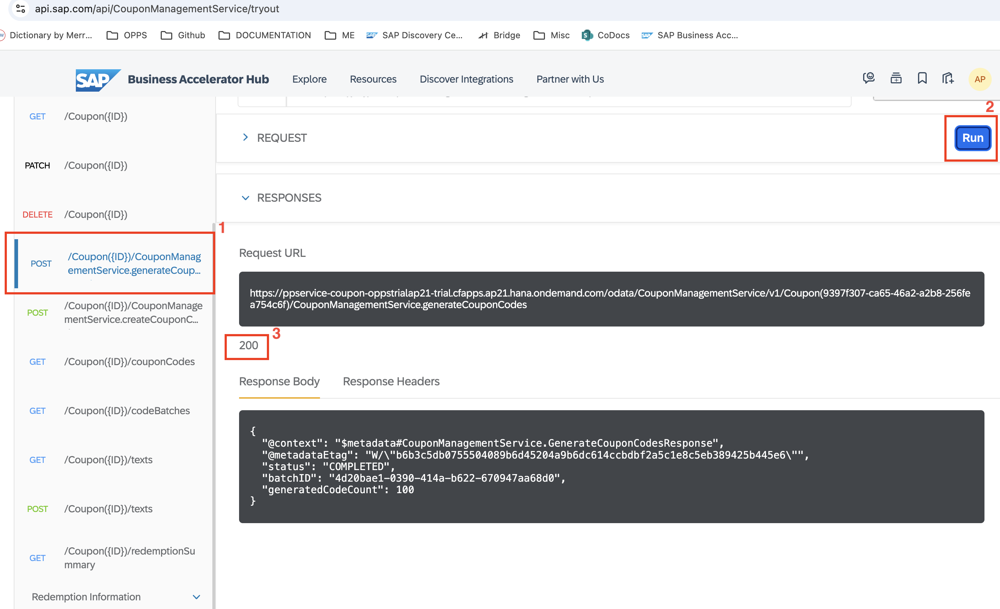
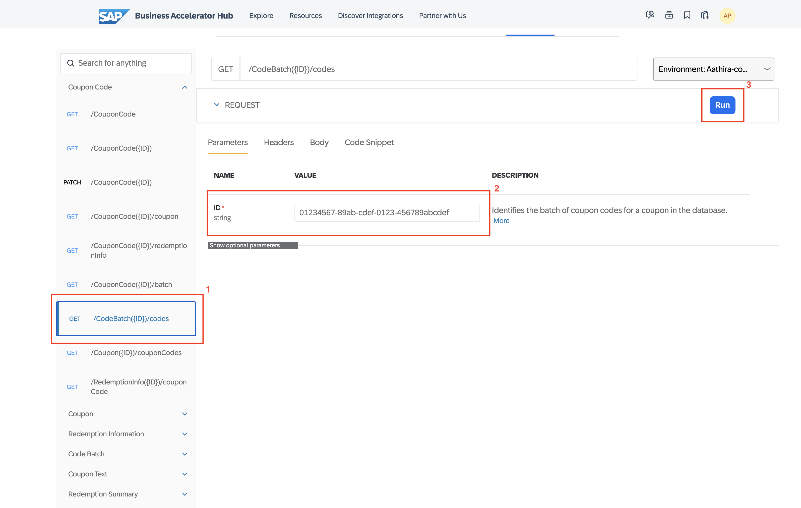

# Create Multi-Code Coupons with SAP Omnichannel Promotion Pricing
<!-- description --> Learn how to use SAP Omnichannel Promotion Pricing for creating multi-code coupons in your promotions.


## You will learn
- How to use the **Coupon Management** service of SAP Omnichannel Promotion Pricing in your trial environment on SAP BTP. 
- How to **create and read coupon codes** with the **Coupon Management** service that can be used by marketing channels to drive promotional campaigns. 
- How to upload a promotional rule into **SAP Omnichannel Promotion Pricing** database with the help of the **Data Upload** service. 


## Prerequisites
- You have registered for a trial account on [SAP BTP](hcp-create-trial-account) in the Singapore - Azure region.
- You should be familiar with the SAP BTP trial landscape and terminology (see [Take a Tour of SAP BTP Trial](cp-trial-quick-onboarding)).
- You have a subaccount in the Cloud Foundry environment, with Microsoft Azure as provider and the Singapore region (AP21).
- You have set up SAP Omnichannel Promotion Pricing as described in [Set Up SAP Omnichannel Promotion Pricing](opps-manual-setup).


---

### Get to know the business scenario


* Business goal: You are a promotion planner working for a coffee machine vendor. As sales has slowed down, you plan a promotional campaign to increase revenue and reduce stock. Therefore, you create a promotional campaign for your target group **coffee lovers** in the **Heidelberg** store. You plan to send to this target group a coupon that gives a **50 EUR** discount on the purchase of coffee machines.
* In the **Coupon Management** service, you create a multi-code coupon with the ID **COFFEELOVER**. The coupon is valid from **October 1, 2026 until December 31, 2026**.
* As the target group **coffee lovers** in the **Heidelberg** region consists of **100** contacts, you create **100 unique coupon codes** for those customers, each of which can be **redeemed only once** by a customer. Once the unique coupon codes are created, your marketing system can read and distribute them to the customers that are part of the promotional campaign.
* You create the following promotion for your **Heidelberg** store (business unit ID: `FC01`): **Buy a coffee machine and show the coupon COFFEELOVER to get 50 Euro off**. 
* Your promotion is valid from **October 1, 2026 until December 31, 2026**.


### Create environments in SAP Business Accelerator Hub


In order to continue with the next steps, you need to have already set up your trial environments for the **Coupon Management service, Data Upload service and Data Access service** in the **SAP Business Accelerator Hub**. If you need guidance, have a look at step 2 of the tutorial [Apply a Simple Promotion with SAP Omnichannel Promotion Pricing](opps-basic-scenario). The same is applicable for the Coupon Management service too. 


### Create Multi-Code Coupon Object


You can now create a multi-code coupon object with the Coupon Management service. 

<!-- border -->![Create coupon(create_coupon.png)]

Navigate to the [Coupon Management service of SAP Omnichannel Promotion Pricing on SAP Business Accelerator Hub](https://api.sap.com/api/CouponManagementService/overview). Log on with the same login information that you use for your SAP BTP account.

1. For **API Environment**, select the trial environment you have created for the **Coupon Management** service.
2. On the left-hand side, choose **Coupon**.
3. Open the **POST** request `/Coupon`.
4. Choose **Try Out**.
5. For the **Request body**, copy the following raw data and paste it into the body:
```json
{ 
  "status": "INACTIVE",
  "displayID": "COFFEELOVER",
  "type": "MULTICODE",
  "name": "COFFEELOVER",
  "description": "Discount 50 Euro for coffee machine",
  "validFrom": "2026-10-01",
  "validTo": "2026-12-31",
  "couponCodeValidityPeriodInDays": 90,
  "maxCodeGenerationCount": 100
}
```
6. Choose **Run**.
7. Make sure you get the HTTP response **201**.

The response should look like this:

<!-- border -->


8. From the response, note down the technical coupon ID as you will use it later.

With this, you have created a multi-code coupon with the ID **COFFEELOVER** and validity period **October 1, 2026 to December 31, 2026**.


**Optional**: If you want to check whether you have successfully created the multi-code coupon **COFFEELOVER**, you can proceed with the following steps:

<!-- border -->

1. On the left-hand side, choose **Coupon**.
2. Open the **GET** request `/Coupon`.
3. Choose **Run**.
4. Make sure you get the HTTP response **200**. 
5. In the response body, you should see the coupon that you have created.  


### Change status of coupon object


When creating the coupon, the **status** of the coupon was set as **inactive** because it cannot be created in the **active** status. To generate the coupon codes, you must first change the **status** of the coupon object from **INACTIVE** to **ACTIVE**.

<!-- border -->

1. On the left-hand side, choose **Coupon**.
2. Open the **PATCH** request `/Coupon({ID})`.
3. Choose **Parameters**.
4. For ID, enter the **technical coupon ID** from the coupon object you just created.
5. For the **Request body**, choose `application/json`.
6. Copy the following raw data and paste it into the body.
```json
{ 
  "status": "ACTIVE"
}
```
7. Choose **Run**. 
8. Make sure you get the HTTP response **200**.

<!-- border -->

You have now successfully changed the status of the coupon code. 


### Generate coupon codes


Now that you have created the multi-code coupon object and set it to active, you can generate a batch of 100 coupon codes to be used in the promotional campaign.

<!-- border -->

1. On the left-hand side, choose **Coupon**.
2. Open the **POST** request `/Coupon({ID})/CouponManagementService.generateCouponCodes`.
3. Choose **Parameters**.
4. For ID, enter the **technical coupon ID** from the coupon object you just created.
5. Copy the following raw data and paste it into the body:
```json
{ 
"generatedCodeCount": 100, 
"validFrom": "2026-10-01" 
}
```
6. Choose **Run**.
7. Make sure you get the HTTP response **200**.

<!-- border -->

With this, you have now created a batch of **100** unique codes for the coupon **COFFEELOVER**. You must note down the batch ID to read the coupon codes.


### Read coupon codes


You can now read the coupon codes created using the Coupon Management service to circulate the coupon information to the target group as part of your promotional campaign. 

1. On the left-hand side, choose **Code Batch**.
2. Open the **GET** request `/CodeBatch({ID})/codes`.
3. Choose **Parameters**.
4. Enter the **Batch ID** noted down at the time of generation of coupon codes. 
5. Choose **Run**.
6. Make sure you get the HTTP response **200**.

<!-- border -->

With this, you can read the coupon codes generated for the multi-code coupon **COFFEELOVER**. This is the coupon code value to be communicated to the target group members as part of your promotional campaign. 

You must note down a coupon code value as it will be used for redeeming the coupon.


### Create a promotion for multi-code coupon

To finalize your promotional campaign, you want to set up the following promotion for your **Heidelberg** store (business unit ID **FC01**):
* Buy a coffee machine and show the coupon **COFFEELOVER to get 50 Euro off**.  
* The promotion is valid from October 1st, 2026 to December 31st, 2026.
You can do so either using the **Maintain Promotions** app or the **Data Upload** service.
In this tutorial, we will use the **Data Upload** service.


Navigate to the [Data Upload service of SAP Omnichannel Promotion Pricing on SAP Business Accelerator Hub](https://api.sap.com/api/DataUpload/tryout). Log on with the same login information that you use for your SAP BTP account.

<!-- border -->
<!-- border -->


1. For **API Environment**, select the trial environment you have created for the Data Upload service.
2. On the left-hand side, choose **Upload promotions using OAuth2**.
3. Open the **POST** request `/idocinbound`.
4. Choose **Try Out**.
5. For the **Request body**, choose `application/xml`.
6. Copy the following raw data and paste it into the body:

```XML
<?xml version="1.0" encoding="UTF-8"?> 
<_-ROP_-PROMOTION02> 
<IDOC BEGIN="1"> 
<EDI_DC40 SEGMENT="1"> 
<IDOCTYP>/ROP/PROMOTION02</IDOCTYP> 
</EDI_DC40> 
<_-ROP_-E1_PROMOTION> 
<PROMOTION_ID>2401</PROMOTION_ID> 
<OFFER_ID>27DB2B4C00F61EEF9CB76E606FF07D88</OFFER_ID>	
<EXTERN_PROMO_ID>000000000000000000000000000000000821</EXTERN_PROMO_ID> 
<EFFECTIVE_DATE>20261001000000</EFFECTIVE_DATE> 
<EXPIRY_DATE>20261231235959</EXPIRY_DATE> 
<CHANGED_ON>20250913103445</CHANGED_ON> 
<STATUS_TCD>AC</STATUS_TCD> 
<CHANGE_INDICATOR>I</CHANGE_INDICATOR> 
<LOGSYS>RS9CLNT990</LOGSYS> 
<ORIGIN>01</ORIGIN> 
<MIN_PPS_RELEASE>0</MIN_PPS_RELEASE> 
<CREATED_ON>20250913103431</CREATED_ON > 
<PROMOTION_NAME> Coffee lover special </PROMOTION_NAME> 
<_-ROP_-E1_PROMOTION_BU> 
<BU_ID>FC01</BU_ID> 
<BU_TYPE>1040</BU_TYPE> 
</_-ROP_-E1_PROMOTION_BU> 
<_-ROP_-E1_PROMOTION_BU> 
<BU_ID>1000202</BU_ID> 
<BU_TYPE>1040</BU_TYPE> 
</_-ROP_-E1_PROMOTION_BU> 
<_-ROP_-E1_PROMOTION_RULE> 
<PROMO_RULE_ID>2402</PROMO_RULE_ID> 
<PRICE_RULE_ID>2402</PRICE_RULE_ID> 
<ELIGIBILITY_ID>2402</ELIGIBILITY_ID> 
<SEQUENCE>2402</SEQUENCE> 
<RESOLUTION>0</RESOLUTION> 
<SALE_RETURN_TCD>00</SALE_RETURN_TCD> 
<ONLY_BASKET_MODE>X</ONLY_BASKET_MODE> 
<PROMO_REC_THRES_PERC>0</PROMO_REC_THRES_PERC> 
<_-ROP_-E1_PRICE_RULE> 
<PRICE_RULE_ID>2402</PRICE_RULE_ID> 
<TYPE_CODE>RB</TYPE_CODE> 
<PRICE_MODIF_CODE>RT</PRICE_MODIF_CODE> 
<PRICE_MODIF_AMT>50.00000</PRICE_MODIF_AMT> 
<PRICE_MODIF_PERC>0.000</PRICE_MODIF_PERC> 
<NEW_PRICE_AMT>0.00000</NEW_PRICE_AMT> 
<CURRENCY_ISO_CODE>EUR</CURRENCY_ISO_CODE> 
<MAM_LIMIT_CNT>0.000</MAM_LIMIT_CNT> 
<NEW_SET_PRCE_AMT>0.00000</NEW_SET_PRCE_AMT> 
<STATUS_TCD>AC</STATUS_TCD> 
<EX_PRICE_RULE_ID>0000000000000000000</EX_PRICE_RULE_ID> 
<COUPON_VALIDITY>0</COUPON_VALIDITY> 
<RULE_CTRL_CODE>PO</RULE_CTRL_CODE> 
<ROUND_DECIMALS>2</ROUND_DECIMALS> 
<ROUNDING_METHOD>00</ROUNDING_METHOD> 
<ROUND_DESTINATION>1</ROUND_DESTINATION> 
<ITEM_METHOD>00</ITEM_METHOD> 
<CALCULATION_BASE>00</CALCULATION_BASE> 
<DISC_METHOD_TCD>00</DISC_METHOD_TCD> 
<CONSIDER_PREVIOUS_RULES>X</CONSIDER_PREVIOUS_RULES> 
<CALC_BASE_SEQUENCE>1-</CALC_BASE_SEQUENCE> 
<SUBSEQ_PRICE_MODIF_AMT>0.00000</SUBSEQ_PRICE_MODIF_AMT> 
<SUBSEQ_PRICE_MODIF_PERC>0.000</SUBSEQ_PRICE_MODIF_PERC> 
<SUBSEQ_NEW_PRICE_AMT>0.00000</SUBSEQ_NEW_PRICE_AMT> 
<TO_BE_DISCOUNTED_QTY>0.000</TO_BE_DISCOUNTED_QTY> 
<PRORATION_MODE>0</PRORATION_MODE> 
</_-ROP_-E1_PRICE_RULE> 
<_-ROP_-E1_ELIGIBILITY> 
<ELIGIBILITY_ID>2402</ELIGIBILITY_ID> 
<TYPE_CODE>COMB</TYPE_CODE> 
<ROOT_ELIGIB_ID>2402</ROOT_ELIGIB_ID> 
<PARENT_ELIGIB_ID>2402</PARENT_ELIGIB_ID> 
<THRESHOLD_QTY>0.000</THRESHOLD_QTY> 
<THRESHOLD_AMT>0.00000</THRESHOLD_AMT> 
<COMBINATION_CODE>&amp;&amp;</COMBINATION_CODE> 
<PROMO_RULE_ID>2402</PROMO_RULE_ID> 
<TRANS_TOTAL_AMT>0.00000</TRANS_TOTAL_AMT> 
<EFFECTIVE_DATE>20261001000000</EFFECTIVE_DATE> 
<EXPIRY_DATE>20261231235959</EXPIRY_DATE> 
<STATUS_TCD>AC</STATUS_TCD> 
<LIMIT_QTY>0.000</LIMIT_QTY> 
<LIMIT_AMT>0.00000</LIMIT_AMT> 
<INTERVAL_QTY>0.000</INTERVAL_QTY> 
<INTERVAL_AMT>0.00000</INTERVAL_AMT> 
<MERCH_SET_ID>0</MERCH_SET_ID> 
</_-ROP_-E1_ELIGIBILITY> 
<_-ROP_-E1_ELIGIBILITY> 
<ELIGIBILITY_ID>2403</ELIGIBILITY_ID> 
<TYPE_CODE>COUP</TYPE_CODE> 
<ROOT_ELIGIB_ID>2402</ROOT_ELIGIB_ID> 
<PARENT_ELIGIB_ID>2402</PARENT_ELIGIB_ID> 
<THRESHOLD_QTY>0.000</THRESHOLD_QTY> 
<THRESHOLD_AMT>0.00000</THRESHOLD_AMT> 
<COUPON_NUMBER>COFFEELOVER</COUPON_NUMBER> 
<CONSUMPTION_TCD>00</CONSUMPTION_TCD> 
<PROMO_RULE_ID>2402</PROMO_RULE_ID> 
<TRANS_TOTAL_AMT>0.00000</TRANS_TOTAL_AMT> 
<EFFECTIVE_DATE>20261001000000</EFFECTIVE_DATE> 
<EXPIRY_DATE>20261231235959</EXPIRY_DATE> 
<STATUS_TCD>AC</STATUS_TCD> 
<LIMIT_QTY>0.000</LIMIT_QTY> 
<LIMIT_AMT>0.00000</LIMIT_AMT> 
<INTERVAL_QTY>0.000</INTERVAL_QTY> 
<INTERVAL_AMT>0.00000</INTERVAL_AMT> 
<MERCH_SET_ID>0</MERCH_SET_ID> 
</_-ROP_-E1_ELIGIBILITY> 
<_-ROP_-E1_ELIGIBILITY> 
<ELIGIBILITY_ID>2404</ELIGIBILITY_ID> 
<TYPE_CODE>MSTR</TYPE_CODE> 
<ROOT_ELIGIB_ID>2402</ROOT_ELIGIB_ID> 
<PARENT_ELIGIB_ID>2402</PARENT_ELIGIB_ID> 
<THRESHOLD_TCD>QUTI</THRESHOLD_TCD> 
<THRESHOLD_QTY>1.000</THRESHOLD_QTY> 
<THRESHOLD_AMT>0.00000</THRESHOLD_AMT> 
<NODE_ID>COFFEEMACHINES</NODE_ID> 
<HIER_ID_QLF>R3</HIER_ID_QLF> 
<PROMO_RULE_ID>2402</PROMO_RULE_ID> 
<TRANS_TOTAL_AMT>0.00000</TRANS_TOTAL_AMT> 
<EFFECTIVE_DATE>20261001000000</EFFECTIVE_DATE> 
<EXPIRY_DATE>20261231235959</EXPIRY_DATE> 
<STATUS_TCD>AC</STATUS_TCD> 
<UOM_ISO_CODE>EA</UOM_ISO_CODE> 
<LIMIT_QTY>9999999999.000</LIMIT_QTY> 
<LIMIT_AMT>0.00000</LIMIT_AMT> 
<INTERVAL_QTY>1.000</INTERVAL_QTY> 
<INTERVAL_AMT>0.00000</INTERVAL_AMT> 
<MERCH_SET_ID>0</MERCH_SET_ID> 
</_-ROP_-E1_ELIGIBILITY> 
</_-ROP_-E1_PROMOTION_RULE> 
<_-ROP_-E1_PROMOTION_TEXT> 
<SPRAS_ISO>EN</SPRAS_ISO> 
<DESCRIPTION>Buy a coffee machine and show coupon COFFEELOVER and get 50 Euro discount.</DESCRIPTION> 
<NAME>Coffee lover special</NAME> 
</_-ROP_-E1_PROMOTION_TEXT> 
</_-ROP_-E1_PROMOTION> 
</IDOC> 
</_-ROP_-PROMOTION02> 
```
7. Choose **Run**.
8. Make sure you get the HTTP response **200**.

<!-- border -->

With this, you uploaded the promotional rule "Buy a coffee machine and show coupon COFFEELOVER to get Euro 50 off" for the **Heidelberg** store (business unit ID: `FC01`) and the validity period **October 1st, 2026 to December 31st, 2026**. 


### Check uploaded master data


You can use the **Data Access** service for checking your uploaded data. If you need guidance, have a look at step 4 of the tutorial [Apply a Simple Promotion with SAP Omnichannel Promotion Pricing](opps-basic-scenario).

With this, you are all set to launch your promotional campaign. 


### What to Do Next

 Navigate to the intermediate group [Set up Complex Promotions with SAP Omnichannel Promotion Pricing](group.opps-complex-promotion) and continue with the next tutorial [Reserve and Redeem a Multi-Code Coupon with SAP Omnichannel Promotion Pricing].


### Additional Information

* [Official Product Documentation](https://help.sap.com/docs/OPP)
* [Coupon Management](https://help.sap.com/docs/omnichannel-promotion-pricing/service-guide/coupon-management)
* [Trial Documentation](https://help.sap.com/docs/OPP/0c145d124b784b548b618cda8a5b2aba/31b8aedc8ce14fcd9f6021ad4f6323c9.html)
* [SAP Omnichannel Promotion Pricing on the SAP Business Accelerator Hub](https://help.sap.com/docs/OPP/7c87270e23c64c2aa922ce297a6df23d/67a9da084cf84e058cb3a3911971bdd0.html?version=Cloud)
* [Video: SAP Omnichannel Promotion Pricing in a nutshell](https://www.sap.com/assetdetail/2020/07/9060b3a5-a67d-0010-87a3-c30de2ffd8ff.html)

---
