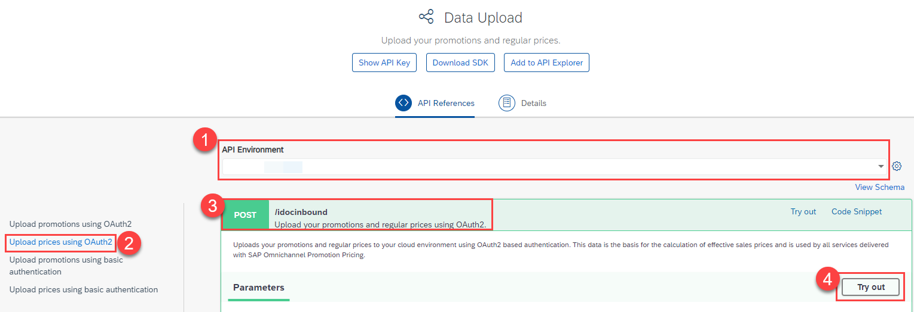

## Prerequisites
- You have registered for a trial account on [SAP BTP](hcp-create-trial-account).
- You should be familiar with the SAP BTP trial landscape and terminology (see [Take a Tour of SAP BTP Trial](cp-trial-quick-onboarding)).
- You have a subaccount in the Cloud Foundry environment, with Amazon Web Services (AWS) as provider and the Europe (Frankfurt) region.
- You have set up SAP Omnichannel Promotion Pricing as described in [Set Up SAP Omnichannel Promotion Pricing](opps-manual-setup)


## Details
### You will learn
- How to use the SAP Omnichannel Promotion Pricing trial on SAP BTP
- How to upload master data (regular sales prices and promotional rules) with the help of the SAP API Business Hub
- How to view the uploaded master data
- How to create a calculation request to determine the effective sales price

---

[ACCORDION-BEGIN [Step 1: ](Get to know the business scenario)]
Use the Calculation service of SAP Omnichannel Promotion Pricing in your sales channel applications to calculate effective sales prices by applying promotional rules. These rules can be applied to single products, product combinations and transactions. With this, you can drive a seamless buying experience because you provide the same calculation based on the same promotion and price data across all sales channels.

* Business goal: You want to promote the product **sunglasses** (material number: `CHA2111010`) in your **Heidelberg** store (business unit ID: `FC01`) to free up space for the next season. You have created the following promotion: **Buy sunglasses and get 40% off.**
* The regular sales price for the sunglasses is **10 Euro**.
* Your promotion is valid from **January 1st, 2021 until January 7th, 2021**.
* Your customer put **sunglasses** in the shopping cart.
* You call the Calculation service with the shopping cart information (store, product, date, time).
* The Calculation service calculates the effective sales price (regular sales price minus promotional discount) for the sunglasses.


[DONE]
[ACCORDION-END]

<!-- [ACCORDION-BEGIN [Step 2: ](Set up SAP Omnichannel Promotion Pricing)]

To use the SAP Omnichannel Promotion Pricing trial, you need to:

1. Subscribe to SAP Omnichannel Promotion Pricing
2. Set Up Roles and Authorizations
3. Create Service Instances
4. Create Service Keys

For step-by-step instructions, go to the tutorial [Set Up SAP Omnichannel Promotion Pricing](opps-manual-setup).

[DONE]
[ACCORDION-END] -->


[ACCORDION-BEGIN [Step 2: ](Create environments in SAP API Business Hub)]

<!-- Now that you have created the service instances and corresponding credentials, you can set up the environments in the SAP API Business Hub for each SAP Omnichannel Promotion Pricing service. -->
With the service instances and corresponding credentials that you set up (as described in [Set Up SAP Omnichannel Promotion Pricing](opps-manual-setup) ), you can set up the environments in the SAP API Business Hub for each SAP Omnichannel Promotion Pricing service.

### Data Upload service
1. Navigate to [SAP Omnichannel Promotion Pricing on SAP API Business Hub](https://api.sap.com/package/OPPS?section=Artifacts). Log on with the same login information you use for your SAP BTP account.

2. Select **Data Upload**.  

    !

3. Choose the **Configure Environment** icon.

    !

4. Choose **Create New Environment**.

    !

5. In the following screen, enter the information from the table below:

    
    


|  Field Name                                | Value
|  :-------------                            | :-------------
|  Starting URL                              | **`https://ppservice-inbound-cf-oppstrial-trial.cfapps.eu10.hana.ondemand.com/`**
|  Display Name for Environments             | Enter any name, for example **`OPPS trial data upload`**.
|  Authentication Type                       | **`Application Flow`**
|  Client Id                                 | **`clientid`** **
|  Secret                                    | **`clientsecret`** **
|  Identity Zone                            | **`identityzone`** **
|  region                                    | **`eu10`**
|  Apply this environment to all APIs in this package that are not yet configured                                   |Please make sure that this is NOT selected.

* Select **Save this environment for future sessions**.
* Choose **Save**.

>** From the service key that you have created for the Data Upload service in your SAP BTP account. For a detailed description, go to step 4 in the tutorial [Set Up SAP Omnichannel Promotion Pricing](opps-manual-setup).


You have now created the trial environment for the **Data Upload** service in the SAP API Business Hub. Repeat the sub-steps 1-5 for the **Data Access** service and the **Calculation** service, using the credentials from their respective service keys.

[VALIDATE_1]

[ACCORDION-END]

[ACCORDION-BEGIN [Step 3: ](Upload master data)]

Having created the trial environments in the SAP API Business Hub, you can now start uploading the master data with the Data Upload service. The uploaded master data serves as the basis for calculating the effective sales price in step 5 of this tutorial.

Navigate to the [Data Upload service of SAP Omnichannel Promotion Pricing on SAP API Business Hub](https://api.sap.com/api/DataUpload/resource). Log on with the same login information that you use for your SAP BTP account.

### Upload regular sales price ###

!
!

1. For **API Environment**, select the trial environment you have just created for the Data Upload service.
2. On the left-hand side, choose **Upload prices using OAuth2**.
3. Open the **POST** request `/idocinbound`
4. Choose **Try Out**.
5. For the **Request body**, choose `application/xml`.
6. Copy the following raw data and paste it into the body:
```XML
<?xml version="1.0" encoding="UTF-8"?>
<_-ROP_-BASE_PRICE01>
	<IDOC BEGIN="1">
		<EDI_DC40 SEGMENT="1">
			<IDOCTYP>/ROP/BASE_PRICE01</IDOCTYP>
		</EDI_DC40>
		<_-ROP_-E1_BASE_PRICE SEGMENT="1">
			<LOGSYS>ABCCLNT999</LOGSYS>
			<BU_TYPE>1040</BU_TYPE>
			<PRICE_CLASSIFIC>PRICE_VAT</PRICE_CLASSIFIC>
			<_-ROP_-E1_BUSINESS_UNIT SEGMENT="1">
				<BU_ID>FC01</BU_ID>
			</_-ROP_-E1_BUSINESS_UNIT>
			<_-ROP_-E1_ITEM SEGMENT="1">
				<ITEM_ID>CHA2111010</ITEM_ID>
				<_-ROP_-E1_ITEM_PRICE SEGMENT="1">
					<PRICE_AMT>10.00000</PRICE_AMT>
					<COND_SPR_UNIT>1</COND_SPR_UNIT>
					<EFFECTIVE_DATE>20200908000000</EFFECTIVE_DATE>
					<EXPIRY_DATE>20210910235959</EXPIRY_DATE>
					<UOM_ISO_CODE>PCE</UOM_ISO_CODE>
					<CURRENCY_ISO_CODE>EUR</CURRENCY_ISO_CODE>
				</_-ROP_-E1_ITEM_PRICE>
			</_-ROP_-E1_ITEM>
		</_-ROP_-E1_BASE_PRICE>
	</IDOC>
</_-ROP_-BASE_PRICE01>
```
7. Choose **Execute**.
8. Make sure you get the HTTP response **200**.

!

With this, you uploaded the regular sales price of **10 Euro** for the product **sunglasses** (material number: `CHA2111010`) for the **Heidelberg** store (business unit ID: `FC01`) and the validity period **September 8th, 2020 to September 10th, 2021**.

### Upload promotional rule ###

!

!

1. For **API Environment**, select the trial environment you have just created for the Data Upload service.
2. On the left-hand side, choose **Upload promotions using OAuth2**.
3. Open the **POST** request `/idocinbound`.
4. Choose **Try Out**.
5. For the **Request body**, choose `application/xml`.
6. Copy the following raw data and paste it into the body:
```XML
<?xml version="1.0" encoding="UTF-8"?>
<_-ROP_-PROMOTION02>
	<IDOC BEGIN="1">
		<EDI_DC40 SEGMENT="1">
			<IDOCTYP>/ROP/PROMOTION02</IDOCTYP>
		</EDI_DC40>
		<_-ROP_-E1_PROMOTION SEGMENT="1">
			<CHANGED_ON>20200717080000</CHANGED_ON>
			<CHANGE_INDICATOR>U</CHANGE_INDICATOR>
			<EFFECTIVE_DATE>20210101000000</EFFECTIVE_DATE>
			<EXPIRY_DATE>20210107235959</EXPIRY_DATE>
			<EXTERN_PROMO_ID>000000000000000000000000000000000006</EXTERN_PROMO_ID>
			<LOGSYS>ABCCLNT999</LOGSYS>
			<MIN_PPS_RELEASE>0</MIN_PPS_RELEASE>
			<OFFER_ID>6CAE8B74B1721EE5AD8B6CF0A5B310A9</OFFER_ID>
			<ORIGIN>01</ORIGIN>
			<PROMOTION_ID>1429</PROMOTION_ID>
			<PROMOTION_TYPE>01</PROMOTION_TYPE>
			<STATUS_TCD>AC</STATUS_TCD>
			<_-ROP_-E1_PROMOTION_BU SEGMENT="1">
				<BU_ID>FC01</BU_ID>
				<BU_TYPE>1040</BU_TYPE>
			</_-ROP_-E1_PROMOTION_BU>
			<_-ROP_-E1_PROMOTION_RULE SEGMENT="1">
				<ELIGIBILITY_ID>1180547</ELIGIBILITY_ID>
				<PRICE_RULE_ID>1180547</PRICE_RULE_ID>
				<PROMO_RULE_ID>1180547</PROMO_RULE_ID>
				<RESOLUTION>0</RESOLUTION>
				<SALE_RETURN_TCD>00</SALE_RETURN_TCD>
				<SEQUENCE>10</SEQUENCE>
				<_-ROP_-E1_ELIGIBILITY SEGMENT="1">
					<EFFECTIVE_DATE>20210101000000</EFFECTIVE_DATE>
					<ELIGIBILITY_ID>1180547</ELIGIBILITY_ID>
					<EXPIRY_DATE>20210107235959</EXPIRY_DATE>
					<INTERVAL_AMT>0.00000</INTERVAL_AMT>
					<INTERVAL_QTY>1.000</INTERVAL_QTY>
					<ITEM_ID>CHA2111010</ITEM_ID>
					<LIMIT_AMT>0.00000</LIMIT_AMT>
					<LIMIT_QTY>9999999999.000</LIMIT_QTY>
					<MERCH_SET_ID>0</MERCH_SET_ID>
					<PARENT_ELIGIB_ID>1180547</PARENT_ELIGIB_ID>
					<PROMO_RULE_ID>1180547</PROMO_RULE_ID>
					<ROOT_ELIGIB_ID>1180547</ROOT_ELIGIB_ID>
					<STATUS_TCD>AC</STATUS_TCD>
					<THRESHOLD_AMT>0.00000</THRESHOLD_AMT>
					<THRESHOLD_QTY>1.000</THRESHOLD_QTY>
					<THRESHOLD_TCD>QUTI</THRESHOLD_TCD>
					<TRANS_TOTAL_AMT>0.00000</TRANS_TOTAL_AMT>
					<TYPE_CODE>ITEM</TYPE_CODE>
					<UOM_ISO_CODE>PCE</UOM_ISO_CODE>
				</_-ROP_-E1_ELIGIBILITY>
				<_-ROP_-E1_PRICE_RULE SEGMENT="1">
					<CALCULATION_BASE>00</CALCULATION_BASE>
					<CALC_BASE_SEQUENCE>1-</CALC_BASE_SEQUENCE>
					<CONSIDER_PREVIOUS_RULES>X</CONSIDER_PREVIOUS_RULES>
					<COUPON_VALIDITY>0</COUPON_VALIDITY>
					<CURRENCY_ISO_CODE>EUR</CURRENCY_ISO_CODE>
					<DISC_METHOD_TCD>00</DISC_METHOD_TCD>
					<EX_PRICE_RULE_ID>0000000000000000000</EX_PRICE_RULE_ID>
					<ITEM_METHOD>00</ITEM_METHOD>
					<MAM_LIMIT_CNT>0.000</MAM_LIMIT_CNT>
					<NEW_PRICE_AMT>0.00000</NEW_PRICE_AMT>
					<NEW_SET_PRCE_AMT>0.00000</NEW_SET_PRCE_AMT>
					<PRICE_MODIF_AMT>0.00000</PRICE_MODIF_AMT>
					<PRICE_MODIF_CODE>RP</PRICE_MODIF_CODE>
					<PRICE_MODIF_PERC>40.000</PRICE_MODIF_PERC>
					<PRICE_RULE_ID>1180547</PRICE_RULE_ID>
					<ROUNDING_METHOD>00</ROUNDING_METHOD>
					<ROUND_DECIMALS>2</ROUND_DECIMALS>
					<ROUND_DESTINATION>1</ROUND_DESTINATION>
					<RULE_CTRL_CODE>PO</RULE_CTRL_CODE>
					<STATUS_TCD>AC</STATUS_TCD>
					<TYPE_CODE>RB</TYPE_CODE>
				</_-ROP_-E1_PRICE_RULE>
			</_-ROP_-E1_PROMOTION_RULE>
			<_-ROP_-E1_PROMOTION_TEXT SEGMENT="1">
				<DESCRIPTION>Buy product sunglasses for 40% off.</DESCRIPTION>
				<NAME>CHA_EXAMPLE1</NAME>
				<SPRAS_ISO>EN</SPRAS_ISO>
			</_-ROP_-E1_PROMOTION_TEXT>
		</_-ROP_-E1_PROMOTION>
	</IDOC>
</_-ROP_-PROMOTION02>
```
7. Choose **Execute**.
8. Make sure you get the HTTP response **200**.

With this you uploaded the promotional rule "Buy sunglasses and get 40% off" (promotion ID: `1429`) for the **Heidelberg** store (business unit ID: `FC01`) and the validity period **January 1st, 2021 to January 7th, 2021**.

[DONE]
[ACCORDION-END]

[ACCORDION-BEGIN [Step 4: ](Check uploaded master data (Optional))]

You can use the **Data Access** service for checking your uploaded data.

Navigate to the [Data Access service of SAP Omnichannel Promotion Pricing on the SAP API business Hub](https://api.sap.com/api/OData/resource).

### Check uploaded regular sales price ###

!

!

1. For **API Environment**, select your trial environment for the Data Access service.
2. On the left-hand side, choose `BasePrices` to read the list of regular sales prices.
3. Select **Try Out**.
4. Choose **Execute**.
5. Make sure you get the HTTP response **200**.
6. Check the data in the **Response Body**. For this, scroll down in the response body until you find the respective entry.

!

### Check uploaded promotional rule ###

!

!

1. For **API Environment**, select your trial environment for the Data Access service.
2. On the left-hand side, choose `PromotionTexts`.
3. Select **Try Out**.
4. Choose **Execute**.
5. Make sure you get the HTTP response **200**.
6. Check the data in the **Response Body**. For this, scroll down in the response body until you find the respective entry.

!

[DONE]
[ACCORDION-END]

[ACCORDION-BEGIN [Step 5: ](Calculate the effective sales price)]

You can now calculate the effective sales price based on the data you have uploaded in the previous steps.

**Scenario**: A customer has one pair of **sunglasses** (material number: `CHA2111010`) in the shopping cart. The customer wants to purchase it on **January 5th, 2021** in the **Heidelberg** store (business unit ID: `FC01`).

**Desired Result**: The effective sales price for the sunglasses should be **6 Euro**: 10 Euro (regular sales price) minus 40% discount, as the customer is eligible for the promotion "Buy sunglasses and get 40% off".

Let's check if this is the case:

!

!

1. Navigate to the [Calculation service on the SAP API Business Hub](https://api.sap.com/api/PriceCalculation/resource).
2. For **API Environment**, select your trial environment for the Calculation service.
3. Open the **POST** request `/restapi/{tenantName}` and choose **Try Out**.
4. In the field `tenantName` enter the `identityzone` from the service key you have created for the Calculation service in your SAP BTP account.
>If you need a more detailed description, go to step 4 in the tutorial [Set Up SAP Omnichannel Promotion Pricing](opps-manual-setup).

5. For the **Request body**, choose `application/xml`.
6. Copy the following raw data and paste it into the body:

```XML
<PriceCalculate xmlns="http://www.sap.com/IXRetail/namespace/" InternalMajorVersion="2" InternalMinorVersion="1">
	<ARTSHeader ActionCode="Calculate" MessageType="Request">
		<MessageID>123456789</MessageID>
		<DateTime>2016-05-04T18:13:51.0</DateTime>
		<BusinessUnit TypeCode="RetailStore">FC01</BusinessUnit>    
        <MasterDataSourceSystemID>ABCCLNT999</MasterDataSourceSystemID>
	</ARTSHeader>

   <PriceCalculateBody TransactionType="SaleTransaction" NetPriceFlag="false">
	  <TransactionID>3456789</TransactionID>
	  <DateTime>2021-01-05T00:00:00.0</DateTime>
    <ShoppingBasket>
      <LineItem>
         <SequenceNumber>0</SequenceNumber>
         <Sale ItemType="Stock" NonDiscountableFlag="false" FixedPriceFlag="false">
            <TaxIncludedInPriceFlag>false</TaxIncludedInPriceFlag>
            <NonPieceGoodFlag>false</NonPieceGoodFlag>
            <PriceTypeCode>00</PriceTypeCode>
            <NotConsideredByPriceEngineFlag>false</NotConsideredByPriceEngineFlag>
            <ItemID>CHA2111010</ItemID>   
            <Quantity Units="1" UnitOfMeasureCode="PCE">1</Quantity>
           </Sale>
      </LineItem>
    </ShoppingBasket>  
   </PriceCalculateBody>
</PriceCalculate>
```

Make sure you get the HTTP response **200**.

The response should look similar to this:
```JSON
{
  "ARTSHeader": {
    "MessageID": {
      "value": " "
    },
    "DateTime": [
      {
        "value": " "
      }
    ],
    "Response": {
      "RequestID": "123456789",
      "ResponseTimestamp": " ",
      "ResponseCode": "OK"
    },
    "BusinessUnit": [
      {
        "value": "FC01",
        "TypeCode": "RetailStore"
      }
    ],
    "MasterDataSourceSystemID": "ABCCLNT999",
    "ActionCode": "Calculate",
    "MessageType": "Response"
  },
  "PriceCalculateBody": [
    {
      "TransactionID": {
        "value": "3456789"
      },
      "DateTime": {
        "value": "2021-01-05T00:00:00.000"
      },
      "ShoppingBasket": {
        "LineItem": [
          {
            "Sale": {
              "ItemID": [
                {
                  "value": "CHA2111010"
                }
              ],
              "RegularSalesUnitPrice": {
                "value": 10,
                "Currency": "EUR"
              },
              "ExtendedAmount": {
                "value": 6,
                "Currency": "EUR"
              },
              "ExtendedDiscountAmount": {
                "value": 4,
                "Currency": "EUR"
              },
              "Quantity": [
                {
                  "value": 1,
                  "Units": 1,
                  "UnitOfMeasureCode": "PCE"
                }
              ],
              "RetailPriceModifier": [
                {
                  "PriceDerivationRule": [
                    {
                      "PriceDerivationRuleID": "1180547",
                      "PromotionDescription": "Buy product sunglasses for 40% off.",
                      "PromotionDescriptionMultiLanguage": [
                        {
                          "value": "Buy product sunglasses for 40% off.",
                          "Language": "EN"
                        }
                      ],
                      "PromotionPriceDerivationRuleSequence": 10,
                      "PromotionPriceDerivationRuleResolution": 0,
                      "TransactionControlBreakCode": "PO",
                      "PromotionOriginatorTypeCode": "01",
                      "TriggerQuantity": 0,
                      "DiscountMethodCode": "00",
                      "FrequentShopperPointsFlag": false,
                      "CustomerGroupLoyaltyPointsDefaultQuantity": 0,
                      "ProhibitPrintFlag": false,
                      "PointsConversionAmount": {
                        "value": 0.01,
                        "Currency": "EUR"
                      },
                      "NoEffectOnSubsequentPriceDerivationRulesFlag": false,
                      "ProhibitTransactionRelatedPriceDerivationRulesFlag": false,
                      "ExclusiveFlag": false,
                      "AppliedCount": 1,
                      "ExternalPromotionID": "000000000000000000000000000000000006",
                      "PrintoutValidityPeriod": 0,
                      "PromotionType": "01",
                      "CalculationBaseSequence": "1-",
                      "ApplicationType": "DiscountPercent"
                    }
                  ],
                  "ExtraAmount": {
                    "value": 0,
                    "Currency": "EUR"
                  },
                  "ExternalSystemOriginatorFlag": false,
                  "SequenceNumber": 0,
                  "Amount": {
                    "value": 4,
                    "Currency": "EUR",
                    "Action": "Subtract"
                  },
                  "Percent": {
                    "value": 40,
                    "Action": "Subtract"
                  },
                  "PreviousPrice": {
                    "value": 10,
                    "Currency": "EUR"
                  },
                  "NewPrice": {
                    "value": 6,
                    "Currency": "EUR"
                  },
                  "PromotionID": {
                    "value": "1429"
                  },
                  "Quantity": {
                    "value": 1
                  },
                  "Rounding": {
                    "value": 0,
                    "Currency": "EUR"
                  }
                }
              ],
              "ItemType": "Stock",
              "NonDiscountableFlag": false,
              "FixedPriceFlag": false,
              "TaxIncludedInPriceFlag": false,
              "NonPieceGoodFlag": false,
              "FrequentShopperPointsEligibilityFlag": false,
              "PriceTypeCode": "00",
              "NotConsideredByPriceEngineFlag": false,
              "PromotionPriceDerivationRuleReference": [
                {
                  "PromotionID": "1429",
                  "PriceDerivationRuleID": "1180547",
                  "ReferenceQuantity": 1
                }
              ]
            },
            "SequenceNumber": [
              0
            ]
          }
        ]
      },
      "RegularSalesUnitPriceRoundingRule": {
        "RoundingMethod": "Commercial",
        "Multiple": 0.01
      },
      "TransactionType": "SaleTransaction",
      "NetPriceFlag": false,
      "CalculationMode": "Basket"
    }
  ],
  "InternalMajorVersion": 2,
  "InternalMinorVersion": 1
}
```

[VALIDATE_2]
[ACCORDION-END]

### Additional Information

* [Official Product Documentation](https://help.sap.com/viewer/product/OPP/Cloud/en-US)
* [Trial Documentation](https://help.sap.com/viewer/0c145d124b784b548b618cda8a5b2aba/Cloud/en-US/31b8aedc8ce14fcd9f6021ad4f6323c9.html)
* [SAP Omnichannel Promotion Pricing on the SAP API Business hub](https://help.sap.com/viewer/0c145d124b784b548b618cda8a5b2aba/Cloud/en-US/67a9da084cf84e058cb3a3911971bdd0.html)
* [Video: SAP Omnichannel Promotion Pricing in a nutshell](https://www.sap.com/assetdetail/2020/07/9060b3a5-a67d-0010-87a3-c30de2ffd8ff.html)

---
