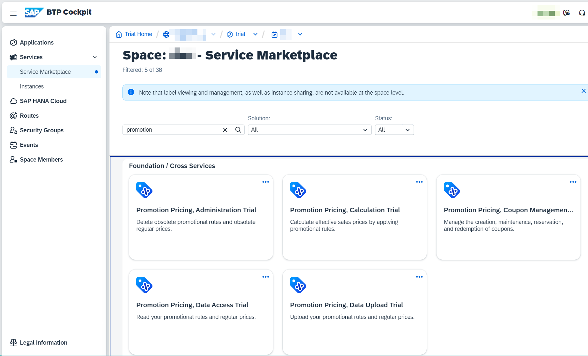
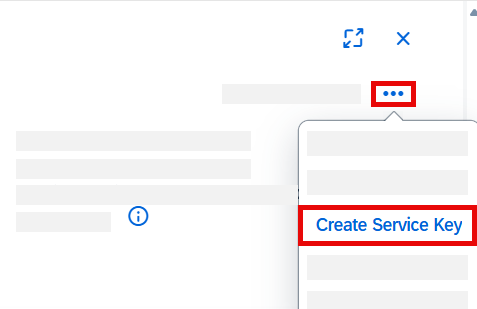
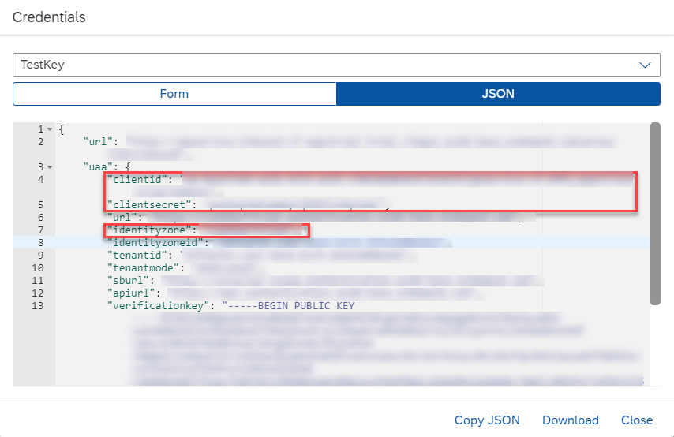

# Set Up SAP Omnichannel Promotion Pricing
<!-- description --> Learn how to set up a fully-functional trial for SAP Omnichannel Promotion Pricing and how to create roles for your users.

## Prerequisites
 - You have registered for a trial account on [SAP BTP](hcp-create-trial-account) in the Singapore - Azure region.
 - You should be familiar with the SAP BTP trial landscape and terminology (see [Take a Tour of SAP BTP Trial](cp-trial-quick-onboarding)). 
 - You have a subaccount in the Cloud Foundry environment, with Microsoft Azure as provider and the Singapore region (AP21). 

## You will learn
  - How to subscribe to SAP Omnichannel Promotion Pricing trial on SAP BTP
  - How to set up roles and authorizations
  - How to create service instances and service keys

  In this tutorial, you will learn how to set up SAP Omnichannel Promotion Pricing including its services.
  With SAP Omnichannel Promotion Pricing, you can calculate effective sales prices in your sales channel applications by applying promotional rules. You drive a seamless buying experience because you provide the same calculation based on the same promotion and price data across all sales channels.

---

### Subscribe to SAP Omnichannel Promotion Pricing trial

1. In the [SAP BTP trial](https://account.hanatrial.ondemand.com), enter your trial account. You trial account must be in the Singapore - Azure region.

2. Navigate to your subaccount. It is usually named `trial`.

If you plan to use the trial subaccount that was initially created when setting up your SAP BTP trial account, please proceed with the following steps: 

1. In the navigation pane, open **Services > Service Marketplace**.

2. Search for **SAP Omnichannel Promotion Pricing (Trial)** and click on the tile.

3. Choose **Create**.

4. In the popup, the service and plan are preselected for you. Choose **Create** to subscribe to the application.

<!-- The subscription process is finished once the status icon changes from **Processing** to **Subscribed**. -->

<!--
In case you plan to use a manually created subaccount or want to add new services not present at the time of creating your subaccount, please proceed with the following steps:

1. In the navigation pane, open **Entitlements**.

2. Choose **Edit**.

3. Choose **Add Service Plans**.

4. Search for SAP Omnichannel Promotion Pricing.

5. Select SAP Omnichannel Promotion Pricing as Available Plan.

6. Choose **Add Service Plans**.

7. Choose **Save**.

8. Repeat sub-steps 2-7 with Promotion Pricing, Administration Trial, Promotion Pricing, Calculation Trial, Promotion Pricing, Data Access Trial, Promotion Pricing, Data Upload Trial, Promotion Pricing, Coupon Management Trial.  

9. Navigate back to your subaccount.

10. In the navigation pane open **Services > Service Marketplace**.

11. In the notification box shown in the header choose **Enable Cloud Foundry**.

12. Navigate back to your subaccount and choose **Create Space**.
-->

### Set up roles and authorizations

In order to use the apps provided with SAP Omnichannel Promotion Pricing, you must create a role collection and assign users to it. With the **Configure Omnichannel Promotion Pricing** app, you can maintain various parameters to influence the behavior of the **Calculation service**. With the **Maintain Promotions** app, you can create promotional rules and define, for example, eligibilities and rewards. Using the apps is optional and currently not described in the tutorials for the SAP Omnichannel Promotion Pricing trial.

1. Navigate back to your subaccount.

2. In the navigation pane, choose **Security > Role Collections**.

3. Choose **Create** to create a new role collection.

4. Enter a name and description and choose **Create**.

5. Select the role collection you've just created from the list and choose **Edit**.

6. Under **Role Name**, select **`Configure_OPPS`** and **`Maintain_OPPS_Promotions`** from the dropdown list.

7. Assign yourself as a **User** or assign a **User Groups** to your role collection and choose **Save**. 

Optional: Once you have set up the roles and authorizations, you can check out our apps as follows: 

1. Navigate back to your subaccount. 

2. Choose **Services > Instances and Subscriptions**. 

3. In Application, next to SAP Omnichannel Promotion Pricing, choose the three dot symbol **°°°** and  **Go to Application**.  

4. In the **Application Plans** section you can make configuration settings in the **Configure Omnichannel Promotion Pricing** app and you can maintain promotions in the **Maintain Promotions** app.  <!-- Using the app is optional and not part of the basic tutorial but is included in our advanced tutorial.-->
<!-- Add link to advanced tutorial once available -->

### Create service instances

1. Navigate to your subaccount and the **space** in which you want to create the service instances.
> To save you some clicks, do the following steps in your space. You can also do this in your subaccount but then you have to provide further information.

2. In the navigation pane, choose **Services > Service Marketplace**.

3. Search for **`promotion`**. This will display all **Promotion Pricing** services. The following services are offered with SAP Omnichannel Promotion Pricing:

    <!-- border -->

4. Choose the tile of the **Promotion Pricing, Calculation** service.

5. Choose **Create**.

6. In the popup, most options are already preselected for you. Just enter a name for your instance and choose **Create**.

7. Repeat substeps 3 - 6 with the **Promotion Pricing, Data Access**, **Promotion Pricing, Data Upload** and **Promotion Pricing, Coupon Management** services.
>You can skip the **Promotion Pricing, Administration** service. It is not needed in a trial scenario.

### Create service keys

1. Navigate to the space in which you have created your service instances.

2. In the navigation pane, choose **Services > Instances**.

3. Select the instance you have just created.

4. Choose the three dot symbol **°°°**  and **Create Service Key**.

      <!-- border -->

5. In the popup, enter a name for the service key. 

6. Choose **Create**.

7. Repeat the above substeps for the remaining Promotion Pricing services.

After you have created the service key, click the three dot symbol **°°°** next to the name of your service key and choose **View**. This displays the parameters of the service key, which you need to configure the SAP Business Accelerator Hub to fill the solution with your data (see highlighted areas in the screenshot). This step is part of the basic tutorial.

>Service keys contain authentication- and authorization-related content and have to be handled securely.

Your service key will look something like this:

<!-- border -->

You have now successfully set up your SAP Omnichannel Promotion Pricing trial on SAP BTP. You can proceed with the [basic tutorial](opps-basic-scenario) to apply a simple promotion with SAP Omnichannel Promotion Pricing to calculate the effective sales price.

---

### Additional information

* Basic Tutorial: [Apply a Simple Promotion with SAP Omnichannel Promotion Pricing](opps-basic-scenario)
* [Official Product Documentation](https://help.sap.com/docs/OPP)
* [Trial Documentation](https://help.sap.com/docs/OPP/0c145d124b784b548b618cda8a5b2aba/31b8aedc8ce14fcd9f6021ad4f6323c9.html)
