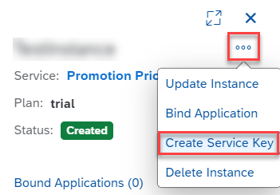

## Prerequisites
 - You have registered for a trial account on [SAP BTP](hcp-create-trial-account).
 - You should be familiar with the SAP BTP trial landscape and terminology (see [Take a Tour of SAP BTP Trial](cp-trial-quick-onboarding)).
 - You have a subaccount in the Cloud Foundry environment, with Amazon Web Services (AWS) as provider and the Europe (Frankfurt) region.

## Details
### You will learn
  - How to subscribe to SAP Omnichannel Promotion Pricing trial on SAP BTP
  - How to set up roles and authorizations
  - How to create service instances and service keys

  In this tutorial, you will learn how to set up SAP Omnichannel Promotion Pricing including its services.
  With SAP Omnichannel Promotion Pricing, you can calculate effective sales prices in your sales channel applications by applying promotional rules. You drive a seamless buying experience because you provide the same calculation based on the same promotion and price data across all sales channels.

---

[ACCORDION-BEGIN [Step 1: ](Subscribe to SAP Omnichannel Promotion Pricing trial)]

1. In the [SAP BTP trial](https://account.hanatrial.ondemand.com), enter your trial account.

2. Navigate to your subaccount. It is usually named `trial`.

3. In the navigation pane, open **Services > Service Marketplace**.

4. Search for **SAP Omnichannel Promotion Pricing (Trial)** and click on the tile.

5. Choose **Create**.

6. In the popup, the service and plan are preselected for you. Choose **Create** to subscribe to the application.

<!-- The subscription process is finished once the status icon changes from **Processing** to **Subscribed**. -->

Once the subscription is finished, you can choose the three dot symbol **°°°** and  **Go to Application** in the **Application Plans** section to make configuration settings in the **Configure Omnichannel Promotion Pricing** app. <!-- Using the app is optional and not part of the basic tutorial but is included in our advanced tutorial.-->
<!-- Add link to advanced tutorial once available -->

[VALIDATE_7]

[ACCORDION-END]

[ACCORDION-BEGIN [Step 2: ](Set up roles and authorizations)]

In order to use the **Configure Omnichannel Promotion Pricing** app, you have to create a role collection and assign users to it. With the configuration app, you can maintain various parameters to influence the behavior of the **Calculation service**. <!-- Using the app is not part of the basic tutorial. -->

1. Navigate back to your subaccount.

2. In the navigation pane, choose **Security > Role Collections**.

3. Select the **+** icon to create a new role collection.

4. Enter a name and description and choose **Create**.

5. Select the role collection you've just created from the list and choose **Edit**.

6. Under **Role Name**, select **`Configure_OPPS`** from the dropdown list.

7. Assign **User** or **User Groups** to your role collection and choose **Save**.

<!-- Should we explain Step 7 a bit more?
COS has already implemented a role collection for trial, should we do sth similar? -->

[DONE]
[ACCORDION-END]

[ACCORDION-BEGIN [Step 3: ](Create service instances)]

1. Navigate to your subaccount and the space in which you want to create the service instances.

2. In the navigation pane, choose **Services > Service Marketplace**.

3. Search for **`promotion`**. This will display all four **Promotion Pricing** services. The following services are offered with SAP Omnichannel Promotion Pricing:

    !

4. Choose the tile of the **Promotion Pricing, Calculation** service.

5. Choose **Create**.

6. In the popup, most options are already preselected for you. Just enter a name for your instance and choose **Create**.

7. Repeat substeps 3 - 6 with the **Promotion Pricing, Data Access** and **Promotion Pricing, Data Upload** services.
>You can skip the **Promotion Pricing, Administration** service. It is not needed in a trial scenario.

[VALIDATE_1]

[ACCORDION-END]

[ACCORDION-BEGIN [Step 4: ](Create service keys)]

1. Navigate to the space in which you have created your service instances.

2. In the navigation pane, choose **Services > Service Instances**.

3. Select the instance you have just created.

4. Choose the three dot symbol **°°°**  and **Create Service Key**.

      !

5. In the popup, enter a name for the service key and choose **Create**.

6. Repeat the above substeps for the remaining Promotion Pricing services.

After you have created the service key, click the three dot symbol **°°°** next to the name of your service key and choose **View**. This displays the parameters of the service key, which you need to configure the SAP API Business Hub to fill the solution with your data (see highlighted areas in the screenshot). This step is part of the basic tutorial.

>Service keys contain authentication- and authorization-related content and have to be handled securely.

Your service key will look something like this:

!

You have now successfully set up your SAP Omnichannel Promotion Pricing trial on SAP BTP. You can proceed with **Step 3** in the [basic tutorial](opps-basic-scenario) to apply a simple promotion with SAP Omnichannel Promotion Pricing to calculate the effective sales price.

[DONE]
[ACCORDION-END]

---

### Additional Information

* Basic Tutorial: [Apply a Simple Promotion with SAP Omnichannel Promotion Pricing](opps-basic-scenario)
* [Official Product Documentation](https://help.sap.com/viewer/product/OPP/Cloud/en-US)
* [Trial Documentation](https://help.sap.com/viewer/0c145d124b784b548b618cda8a5b2aba/Cloud/en-US/31b8aedc8ce14fcd9f6021ad4f6323c9.html)
* [Video: SAP Omnichannel Promotion Pricing in a Nutshell](https://www.sap.com/assetdetail/2020/07/9060b3a5-a67d-0010-87a3-c30de2ffd8ff.html)
