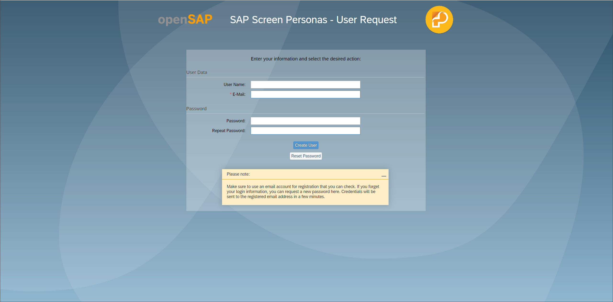
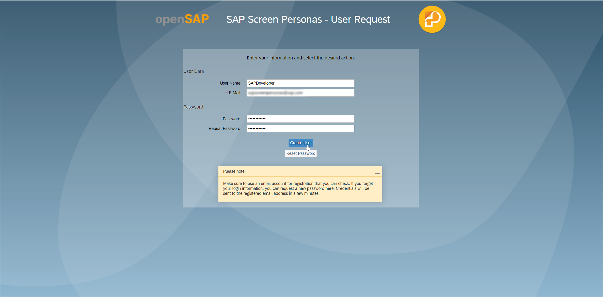
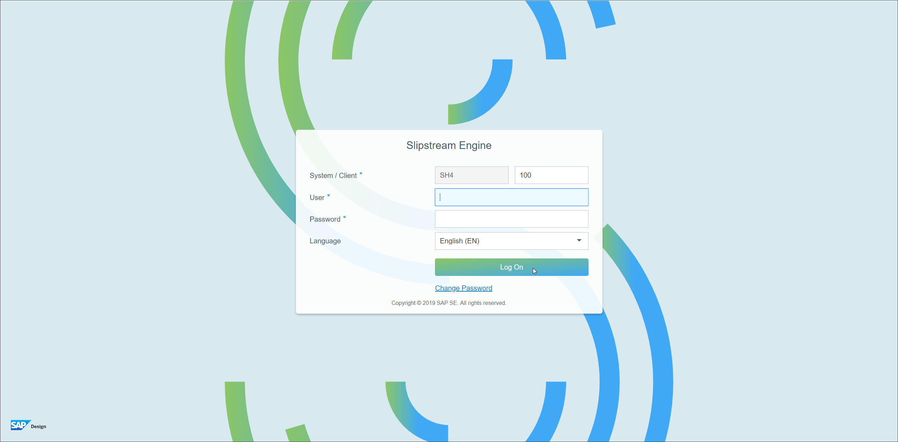
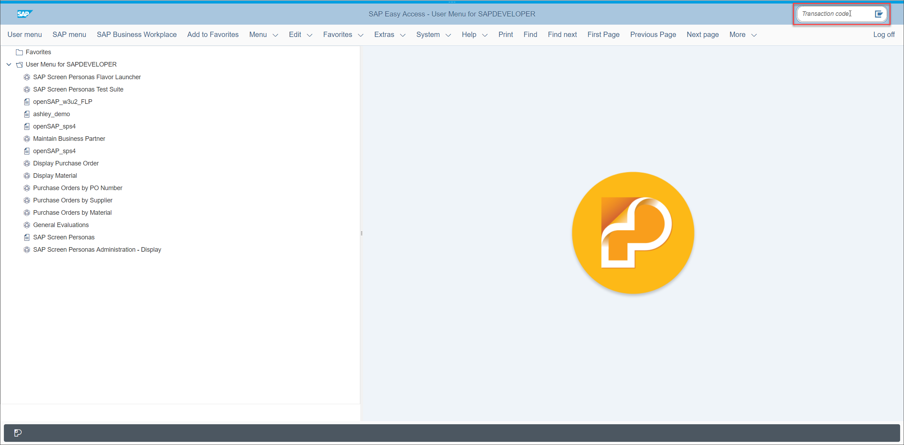

## Details
### You will learn
  - Where to create a user for the SAP Screen Personas training system
  - How to log on to the training system

The SAP Screen Personas team provides a training system at no cost for the purpose of allowing learners to get hands-on time with the product. Users have access to the transactions required to execute the tutorials on this site. In order to provide the best possible learning experience and minimize the risk disruption to the system, **users do not have access to the Administration transaction or other administrative features.**

>While the SAP Screen Personas team intends to allow around-the-clock access to the system, it cannot be guaranteed. Planned or unplanned downtime could occur at any time.

---

[ACCORDION-BEGIN [Step 1: Create a user](Create a user)]

In order to access the training system, you must first create a user. You can do so here: <http://link.personas.help/opensap/userrequest>

Clicking on that link opens the following page:

Next, enter your desired user name, email address, and password and click **Create User**. Your email address will only be used to contact you if you require a password reset.

With your user created, you can now log on to the training system.

[DONE]
[ACCORDION-END]

[ACCORDION-BEGIN [Step 2: Log on to the training system](Log on to the training system)]

Click the following link to access the training system: <http://link.personas.help/opensap/se>

You may bookmark that link for more convenient access later on. Clicking the link will open to the following screen:

Enter your credentials and click **Log On**. This will open the `SMEN` transaction. From here, you can navigate to other transactions using the **Transaction Code** field at the top right of the screen.

[VALIDATE_1]
[ACCORDION-END]
