## Prerequisites
 - SAP Screen Personas SP06 or higher

## Details
### You will learn
  - How to hide unneeded fields with SAP Screen Personas
  - How to modify the properties of an object on screen
  - How to insert additional objects into a screen
  - How to create a dashboard in SAP Screen Personas

**SAP Screen Personas** is a software product, included with your existing ERP license, that allows you to personalize **SAP screens**, automate business processes, and run them on your phone, tablet, or desktop. It provides a simple drag and drop approach to modify most **SAP GUI** screens to improve usability and visual appeal.

A screen or set of related screens personalized for an SAP user/role using SAP Screen Personas is called a **flavor**. By the end of this tutorial, you will have created a flavor for transaction IW51 (Create Service Notification) that will greatly simplify the creation of Service Notifications for your users on both desktop and mobile devices. This tutorial will focus on creating the initial screen: a dashboard that launches the main screen of IW51. The next tutorial will cover simplifying that screen and including additional functionality.

---

[ACCORDION-BEGIN [Step 1: Access IW51](Access IW51)]
To begin, you must log on to your system and then navigate to IW51. Enter your credentials and then enter **`IW51`** into the transaction code field. Press **`Enter`**.

[DONE]
[ACCORDION-END]

[ACCORDION-BEGIN [Step 2: Create the flavor](Create the flavor)]
To create a flavor, open the flavor bar by clicking on the SAP Screen Personas icon that appears when you hover over the thin blue line at the top of the screen. This line indicates SAP Screen Personas is available to your user.

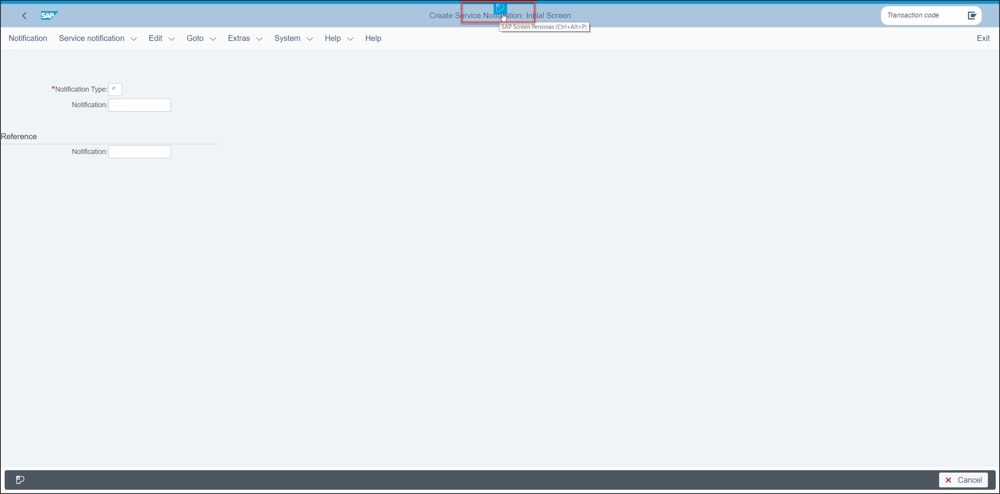

The flavor bar will then display all of the flavors available to your user for this transaction. Since you have not created a flavor yet, the only flavor tile available will be for the **Original Screen**. It will be highlighted in blue to indicate that you are currently using it.

Click the **Add Flavor** button, illustrated as a plus sign (+) on the right side of the flavor bar, to create your flavor.

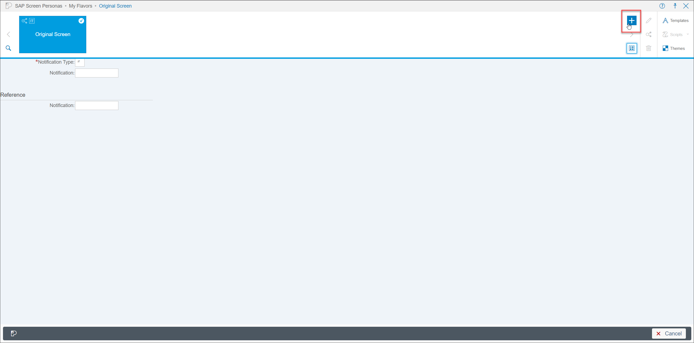

Enter a name and a description for your flavor and then press **Create**.

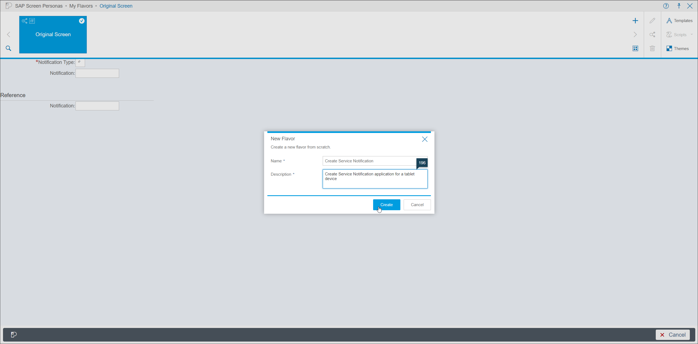

This will open the **flavor editor**.

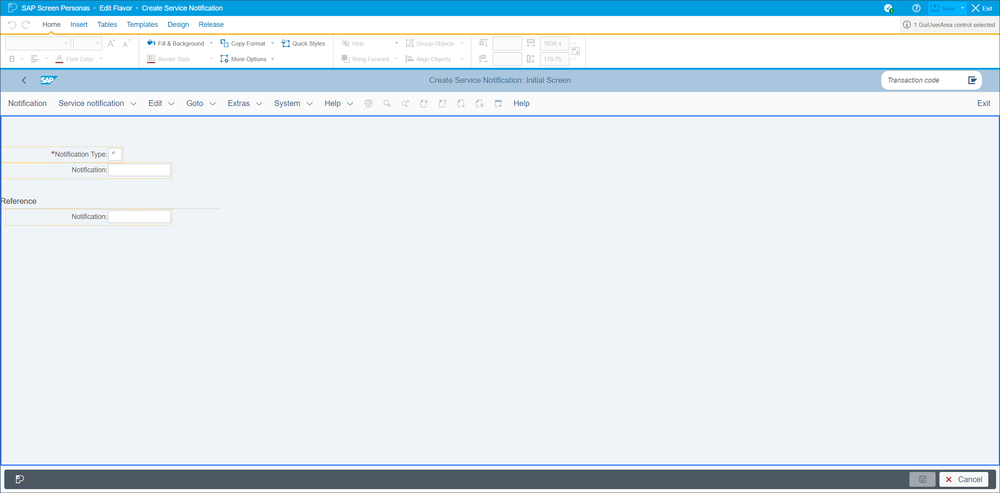

[DONE]
[ACCORDION-END]

[ACCORDION-BEGIN [Step 3: Simplify the initial screen](Simplify the initial screen)]
To begin simplifying the flavor, you will set a default value for the notification type. Double click the **Notification Type** field and enter **`S3`** into the **Data** field in the pop up window. Then click **Done** to set the value.

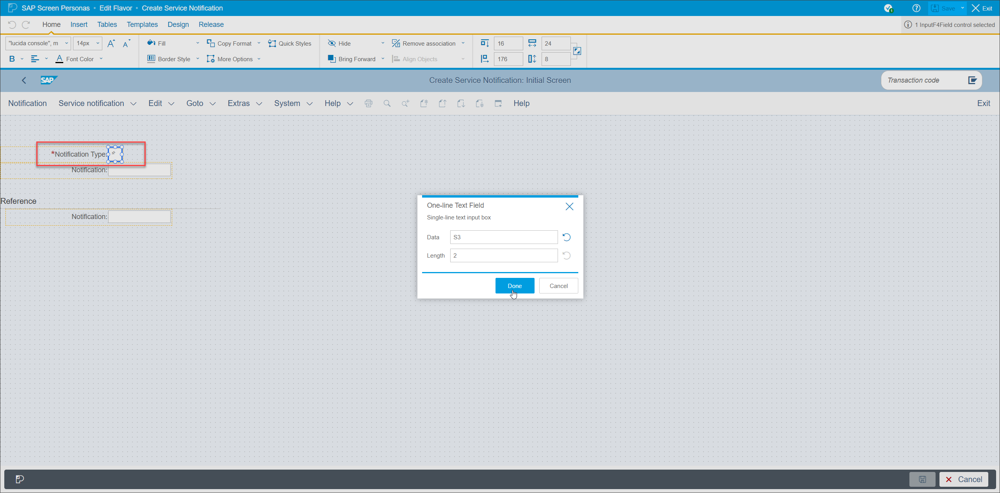

Now that the default value for the Notification Type is set for this flavor, you do not need any of the fields on screen. Select all of the fields and labels. You can multi-select by holding **``CTRL``** while clicking on objects. Alternatively, you can use the lasso tool by holding **``Shift``** and then clicking and dragging your mouse over the objects to select them. Whatever method you choose, hide the objects by pressing the hide button.

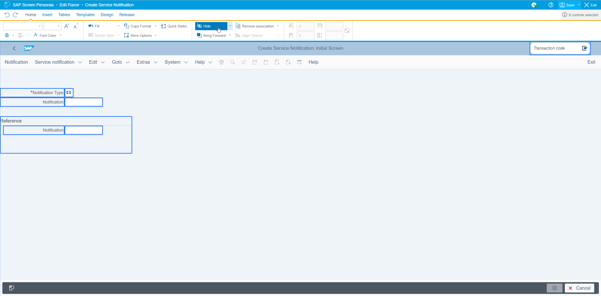

Your screen should then look like this:

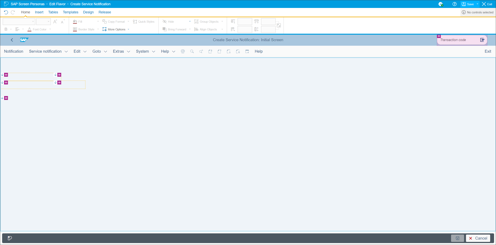

[DONE]
[ACCORDION-END]

[ACCORDION-BEGIN [Step 4: Create the dashboard](Create the dashboard)]

Next, you will create buttons that will allow users to create a notification and log off of the system.

To give users a **Create Notification** button, select the **Notification** button from the toolbar and drag it to the user area.

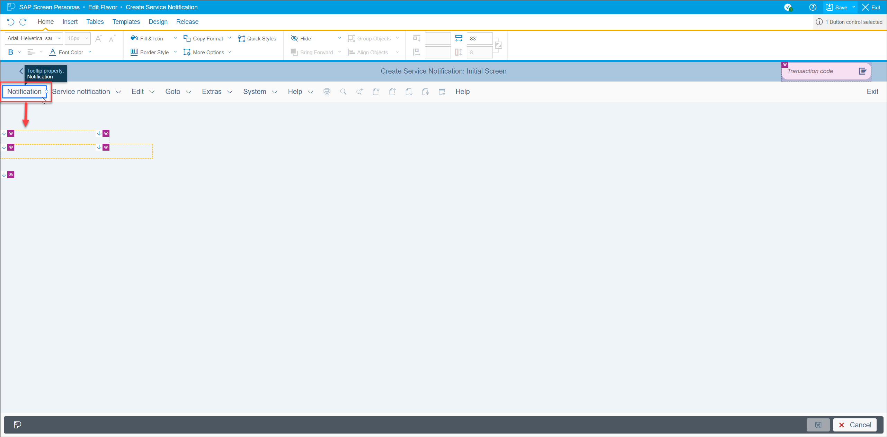

>If the hidden object placeholders distract you, you can hide them by selecting the **Hide All Placeholders** option under the **Hide** button.

Your screen should now look like this:

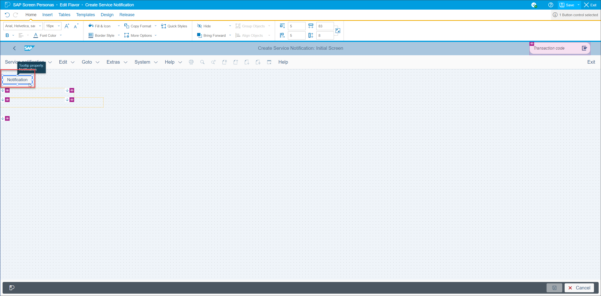

Next, enlarge the button so that it is easy to press for users on a mobile device. To do that, select the button and modify its height and width properties in the home tab. Give the button the following dimensions: **`150pt`** wide and **`25pt`** tall.

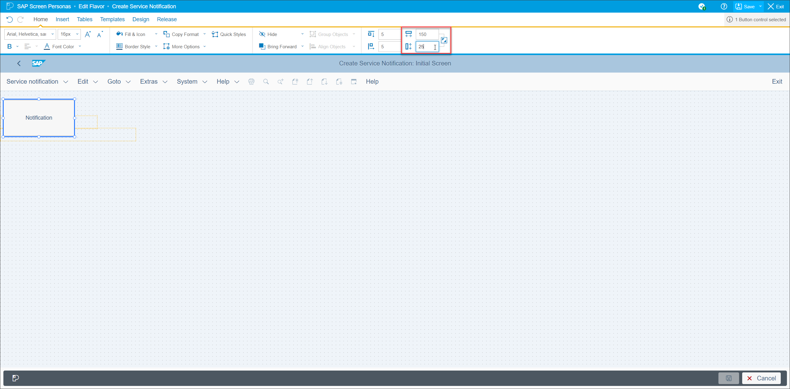

Now, double click the button to bring up the **Text Editor**. Change the text on the button to better reflect its function: **``Create Notification``**. Click **Done** to confirm your change.

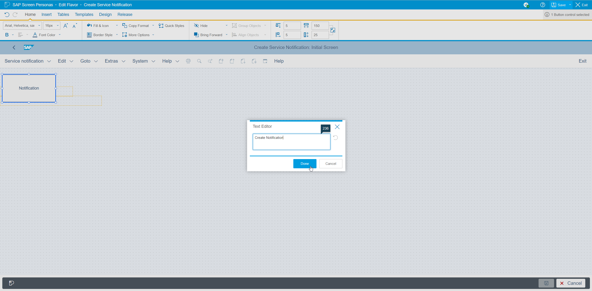

Now you are going to add the **Log off** button to your screen. Click on the **Insert tab** to display the different objects that can be inserted into your flavor. Then select **Menu Items Button** from the toolbar.

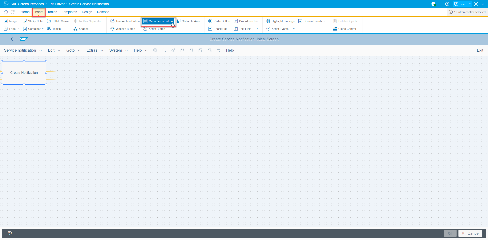

This will open a pop up where you will set the label and function for the button. Set the label name as **``Log Off``**. Under the **Menu Item** dropdown menu, select **System/Log Off** and click **Done** to confirm your selection.

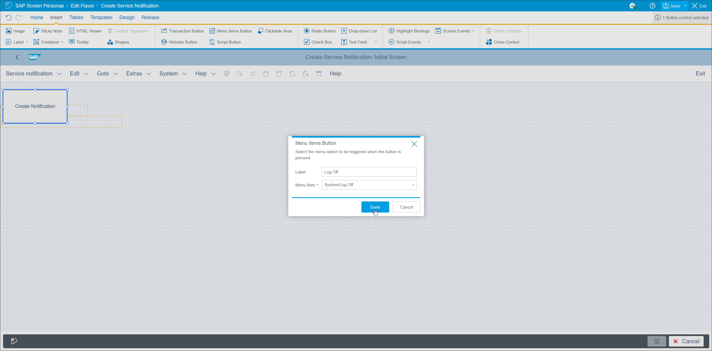

The button will then be inserted into the flavor. Move it next to the **Create Notification** button and give it similar dimensions (**`150pt`** wide and **`25pt`** tall) using the control in the **Home tab**. Your screen should look like this:

Now it is time to put the finishing touches on the screen. Since your users will not need the other functions in the toolbar: hide it. Clicking the empty space on the toolbar should allow you to select the entire toolbar without having select individual buttons.

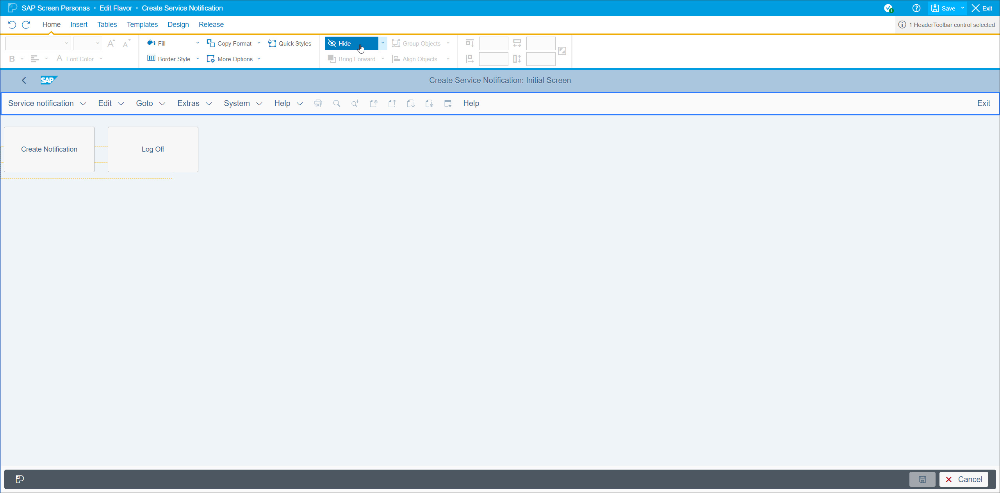

In order to make it easier for users to differentiate between the two buttons at a glance, select the **Create Notification** button and change its fill color to a light blue. Fill color can be changed using the **Fill & Icon** button in the **Home tab**.

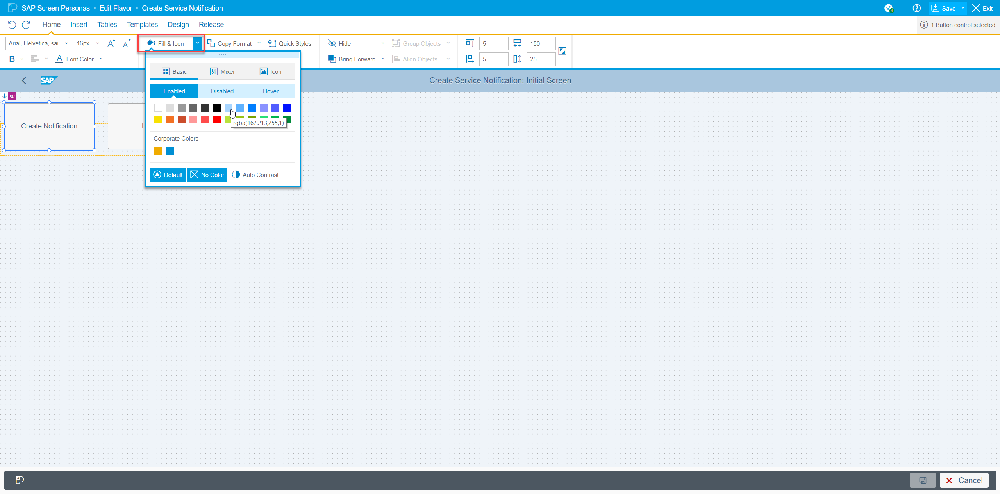

[DONE]
[ACCORDION-END]

[ACCORDION-BEGIN [Step 5: View the completed screen ](View the completed screen)]

You have now finished personalizing this initial screen. To view it as your end-user would, save and exit the **Flavor Editor** using the **Save** and **Exit** buttons at the top right corner of the screen.

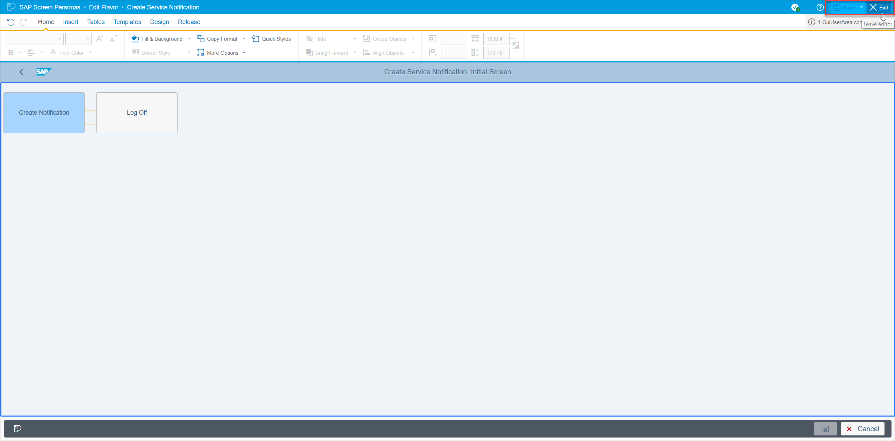

You should now see the end product of this tutorial without the **Flavor Editor**: a simple dashboard for creating a service notification.

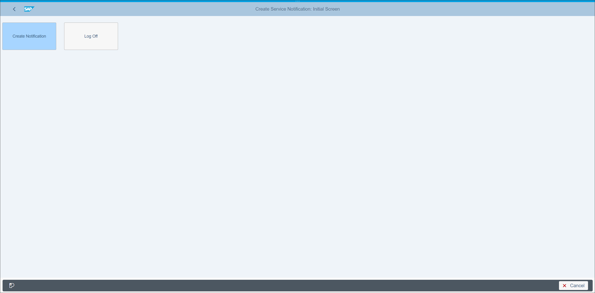

[VALIDATE_1]

[ACCORDION-END]

---
