## Prerequisites
 - SAP Screen Personas SP06 or higher
 - A flavor rendered with Slipstream Engine

## Details
### You will learn
  - How to create adaptive versions of your flavor for use on different devices

The focus of this tutorial is on making your Create Service Notification application available to users on different devices. You will take the flavor you built in the previous tutorial and optimize it for tablet and mobile phone screens. This involves using the **Adaptive Flavor** feature in SAP Screen Personas to rearrange the screen in order to provide the best possible experience for your users. You will resize and organize screen objects so that users do not have to scroll to input the required information on their device.

By the end of this tutorial, you will have a group of flavors called an **adaptive stack**, which contains all of your differently sized flavor variations. SAP Screen Personas will then automatically select between these flavors, depending on your users' screen size, to provide the best possible user experience.

---

[ACCORDION-BEGIN [Step 1: Create the tablet flavor](Create the tablet flavor)]

In the past two tutorials, you have focused on building a flavor for a generic tablet device. In order to gain experience with **adaptive flavors**, you will now optimize your flavor for an Apple iPad. Just as in previous tutorials, you will begin on the main screen of your IW51 flavor.

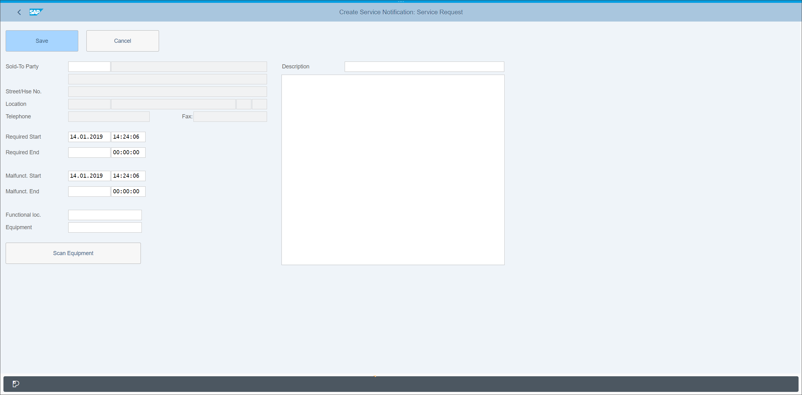

To create an adaptive flavor, open the flavor bar. Your flavor tile should be blue, indicating that your flavor is selected. Click the **Show Adaptive Flavors** button (**1**) and then **Add Adaptive Flavor** (**2**).

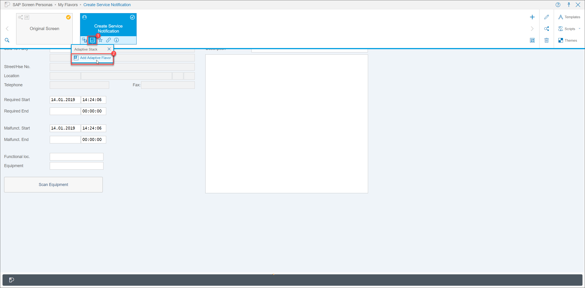

This will open a pop-up window where you can enter the adaptive flavor name, description, and size. Since this flavor is meant to be used in portrait orientation, indicate so in the name and description. If you know the desired width of your flavor, you can enter it in the field. Otherwise, you can also search for the device and SAP Screen Personas will set the appropriate width. In this case, search for and select **`Apple iPad`**, which will set the flavor width to 768. Click **Create** to open the flavor editor and begin building your adaptive flavor.

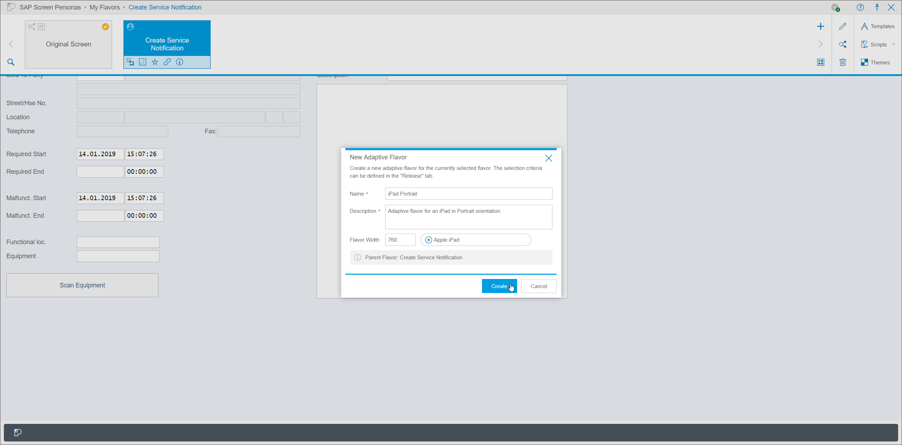

[DONE]
[ACCORDION-END]

[ACCORDION-BEGIN [Step 2: Build the tablet flavor](Build the tablet flavor)]

Toward the center of the screen, there is a pink line indicating the furthest right point of the tablet screen. Anything past that line will require your user to scroll for access. As your goal is to provide a simple, scroll-free user experience, you will begin modifying flavor to keep all of your screen objects within that boundary.

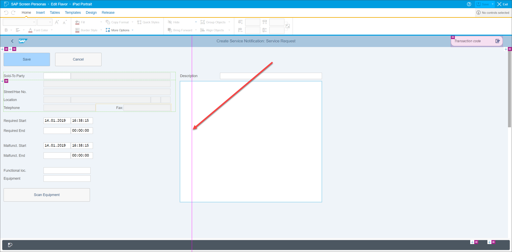

To begin, you will change the order of the fields on the screen to facilitate filling out the form and maximize the use of horizontal space. Multi-select the **Required Start** and **Required End** fields and labels and move them to the coordinates **`95pt`** down and **`300pt`** right. This will clear the space required for the **Functional Location** and **Equipment** fields.

Next, multi-select the **Functional Location** and **Equipment** fields and labels and give them the following coordinates: **`70pt`** down and **`10pt`** right.

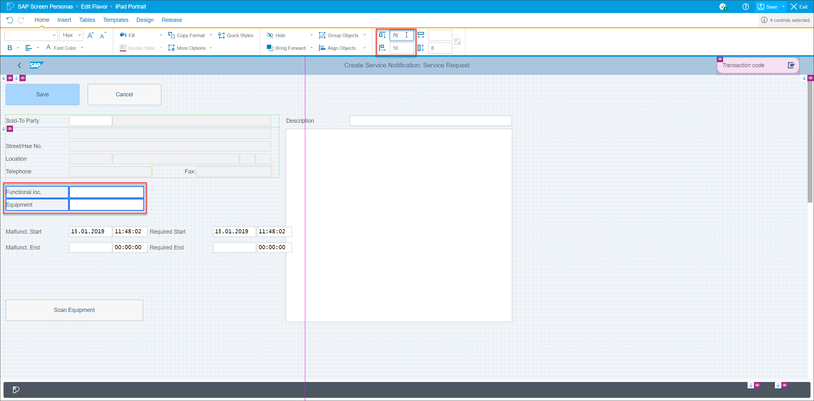

Once those fields are in place, select the **Scan Equipment** button and move it to **`70pt`** down and **`300pt`** right. Change its dimensions to the following: **`245pt`** wide and **`16pt`** tall.

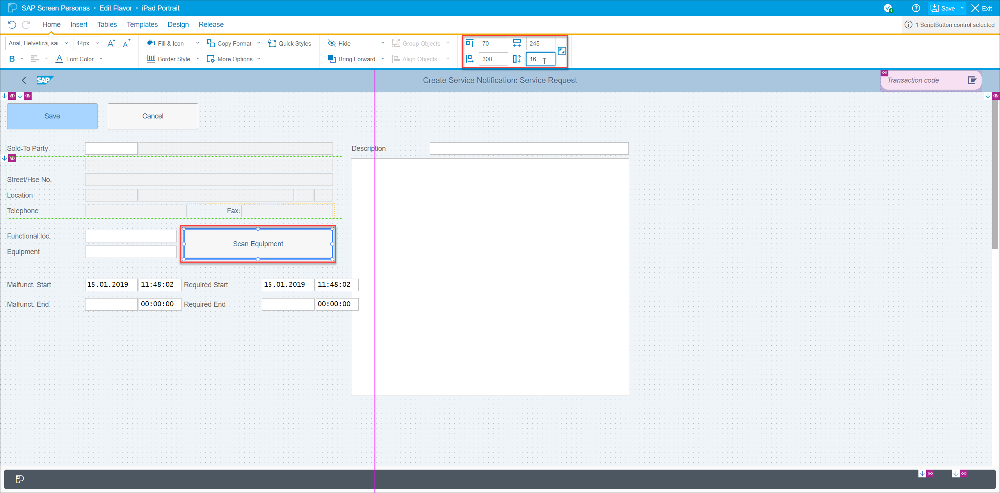

Now you will move the **Description** label and fields into place. Multi-select them and give them the coordinates **`90pt`** down and **`10pt`** right. Change the dimensions of the short text box to **`405pt`** wide and **`8pt`** tall.

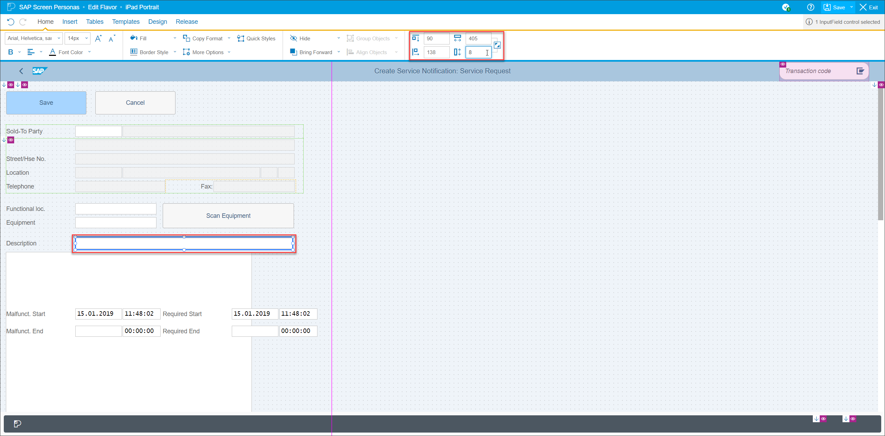

Now change the dimensions of the long text box: **`532pt`** wide and **`30pt`** tall.

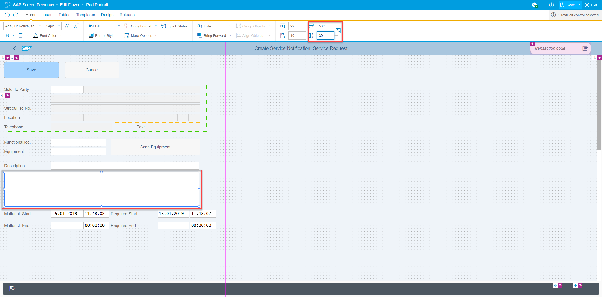

To conclude the modifications to the flavor, you will finish aligning the **Required Start/End** and **Malfunction Start/End** fields and labels. Multi-select all of them and give them the coordinates **`133pt`** down and **`10pt`** right.
>You can multi-select a large group of objects using the lasso feature. Hold the **'Shift'** key while clicking and dragging your mouse over the objects. Release the mouse to select.

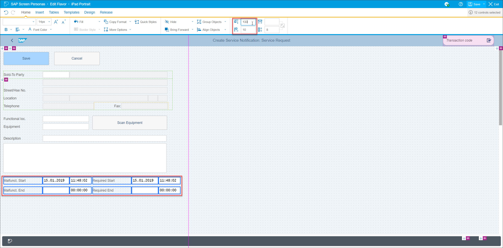

Multi-select the **Malfunction Start** and **Malfunction End** fields and shift them to the left, giving them the coordinates **`133pt`** down and **`91pt`** right.

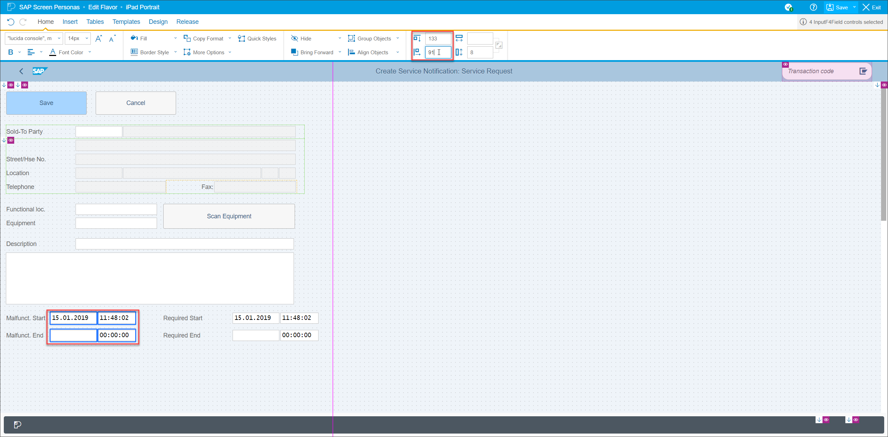

Do the same to the **Required Start** and **Required End** fields, multi-selecting them and then shifting them to **`133pt`** down and **`381pt`** right.

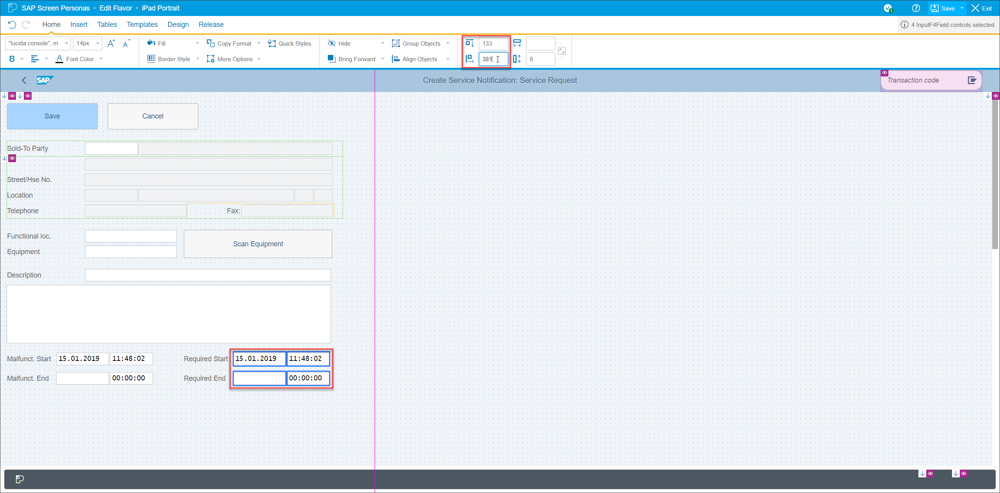

Your iPad flavor for Portrait orientation is now complete.

[DONE]
[ACCORDION-END]

[ACCORDION-BEGIN [Step 3: Inspect the flavor with Device Preview](Inspect the flavor with Device Preview)]

Now that your flavor is complete, you can get a sense for what it looks like using the **Device Preview** feature. Open the **Design** tab and click **Device Preview**.

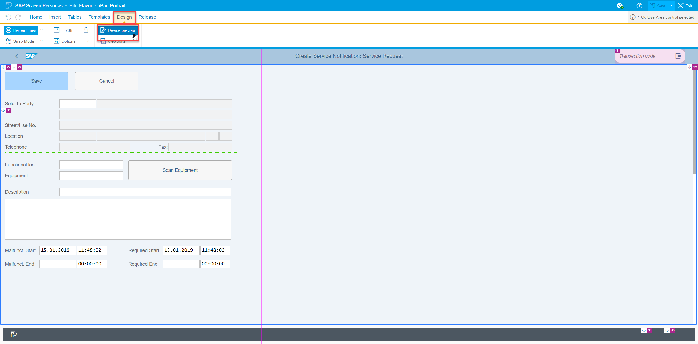

This will open a pop-up window. Select your device, in this case an Apple iPad. You can see that all of the required fields are accessible to the user without scrolling, which means this flavor is designed successfully.

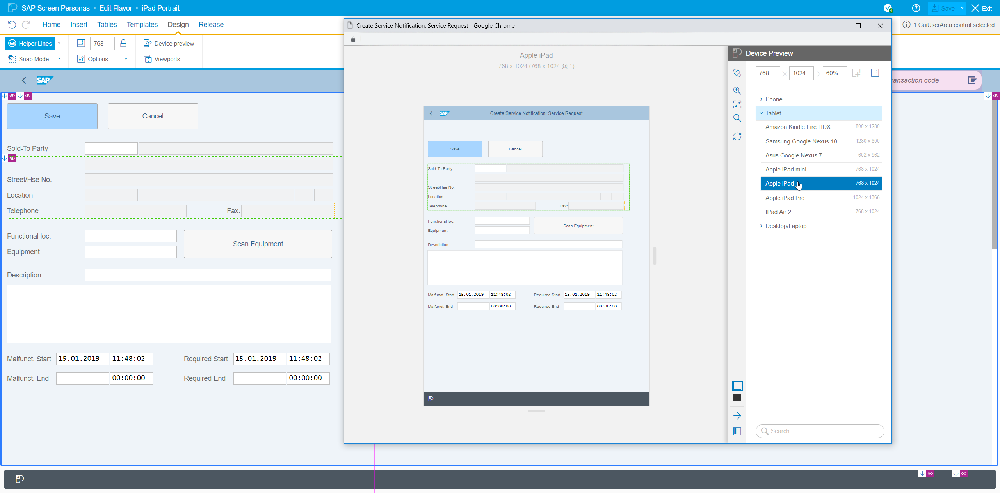

You can also test the flavor in Landscape orientation:

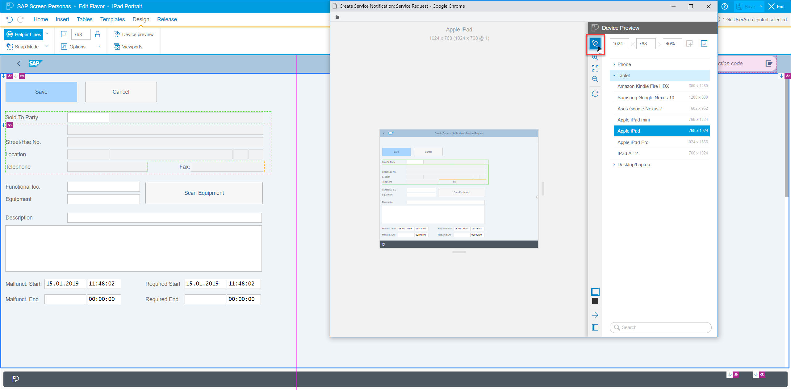

You can see that all of the required fields are easily accessible, so there is no need to create a Landscape flavor for this device. In the event that this is not the case, or if you would like to give users additional functionality or a different screen layout in Landscape orientation, you can create another adaptive flavor. For now, you are finished building your tablet flavor.

[DONE]
[ACCORDION-END]

[ACCORDION-BEGIN [Step 4: Build mobile phone flavors](Build mobile phone flavors)]

If desired for extra practice, you can also build adaptive versions of your flavor for mobile phones in Portrait and Landscape orientation. The process is the same as the above but, rather than selecting **`Apple iPad`** as your device during the creation of the adaptive flavor, you will select the mobile device of your choice. You will then have to rearrange the objects on screen to fit within the bounds of the new screen size, just as before.

[VALIDATE_1]
[ACCORDION-END]
