## Prerequisites
 - SAP Screen Personas SP06 or higher

## Details
### You will learn
  - How to access your SAP Screen Personas flavor on a mobile device

The focus of this tutorial is on testing your adaptive flavor(s) on a mobile device. The screenshots used will feature a mobile phone, but the same process applies to a tablet.

---

[ACCORDION-BEGIN [Step 1: Download the SAP Fiori Client on your device](Download the SAP Fiori Client on your device)]

At this time, the use of native device functionality (such as a camera to use the barcode scanner) requires that you access your flavor through the SAP Fiori Client app. To do so, you can download it from the relevant app store for your Apple or Android device:

[Google Play Market](https://play.google.com/store/apps/details?id=com.sap.fiori.client&hl=enhttps://play.google.com/store/apps/details?id=com.sap.fiori.client&hl=en)

[Apple App Store](https://apps.apple.com/us/app/sap-fiori-client/id824997258)

[DONE]
[ACCORDION-END]

[ACCORDION-BEGIN [Step 2: Set up SAP Fiori Client](Set up SAP Fiori Client)]

Once downloaded, open the SAP Fiori Client. Tap **Log In**.

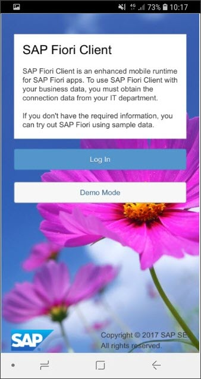

This will lead to a screen where you are prompted to **`Enter SAP Fiori URL or work email`**. You can manually enter the URL of your flavor if you like. You can also use the **Scan** button to expedite this process. Tap the **Scan** button next to the URL field.

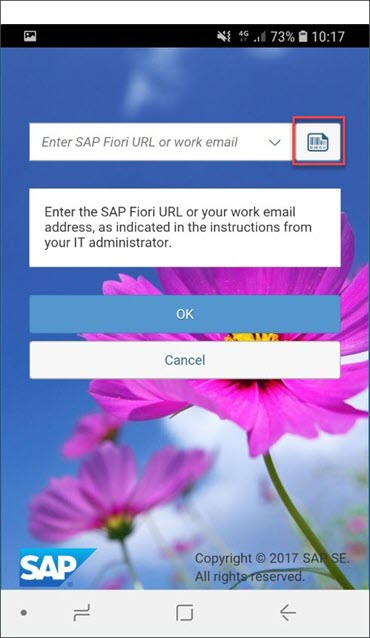

On the desktop you used to create this flavor, navigate to transaction **`IW51`** and open the **flavor bar**. Click on your flavor tile, select **Direct Access Link** and then click **Generate QR Code**.

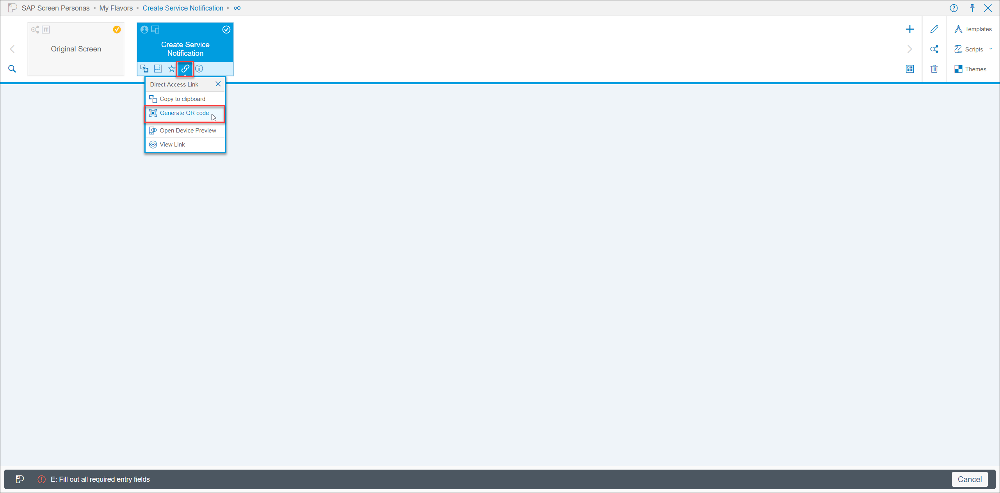

This will open a QR code that you can scan with your mobile device.

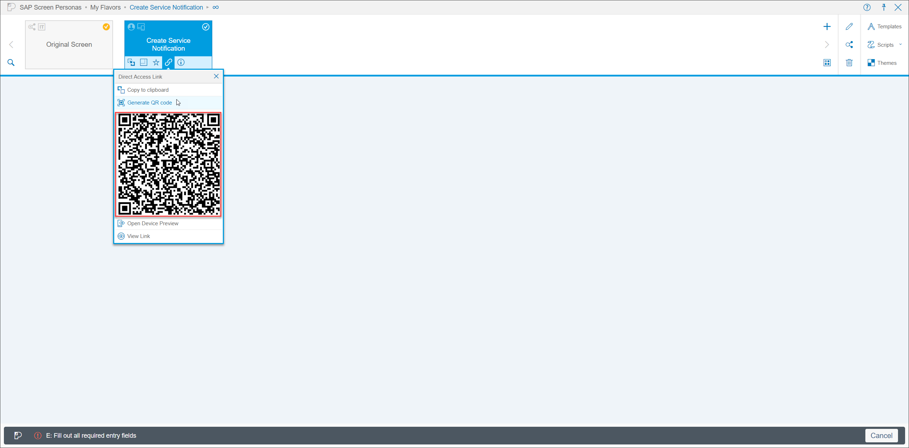

Next, scan the QR code with your device.

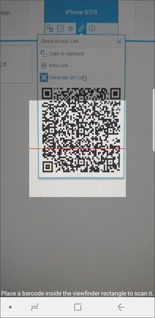

You will then be presented with a screen giving you an option to set a passcode. In this case, you do not need one. Select **Disable Passcode**.

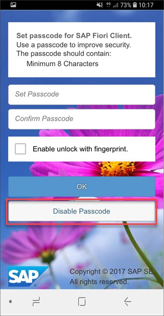

This will open to a Tip screen. Tap **Continue** to move on.

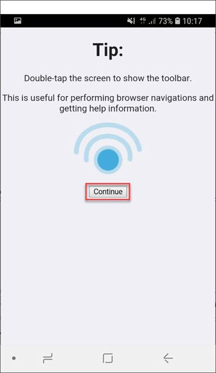

[DONE]
[ACCORDION-END]

[ACCORDION-BEGIN [Step 3: Test your flavor](Test your flavor)]

Enter your credentials and tap **Log On** to begin testing your flavor.

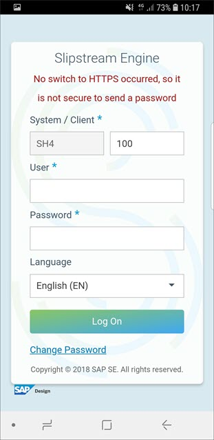

The adaptive flavor for your device will then open. Click **Create Notification** to navigate to the main screen of your flavor.

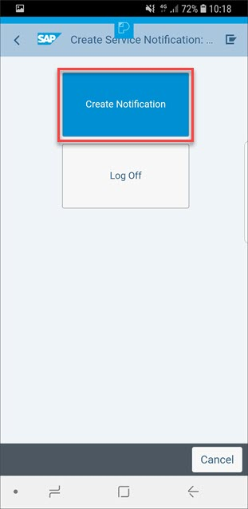

You should then seen the simplified screen for your mobile device. If you have built different flavors to account for device orientation, you can test them by rotating your device. The flavor will automatically switch to account for the different screen size.

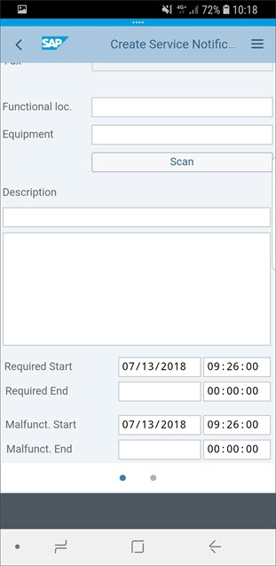

[DONE]
[ACCORDION-END]

[ACCORDION-BEGIN [Step 4: Optional: Test your barcode scanner](Optional: Test your barcode scanner)]

If desired, you can also test the barcode scanner within you flavor. You will need to generate a QR code that represents a valid equipment number in your system. If you are using the training system provided by the SAP Screen Personas team, you can use the following **`210100019`**, **`210100024`**, or **`210100013`**.

You can use <www.the-qrcode-generator.com/> to generate a QR code. Select **Free Text** and enter your equipment number.

Tap **Scan Equipment** on your flavor and then scan your QR code.

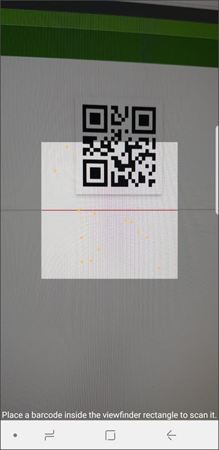

Your **Functional Location** and **Equipment** fields should then automatically be filled in.

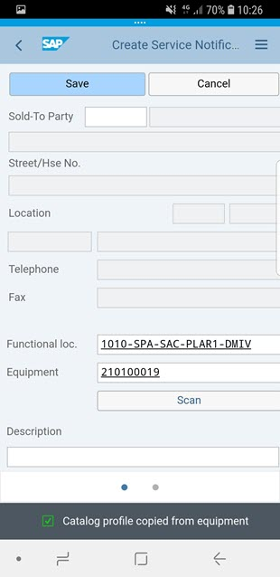

Congratulations, you have a built a working mobile flavor with SAP Screen Personas!

[VALIDATE_1]
[ACCORDION-END]
