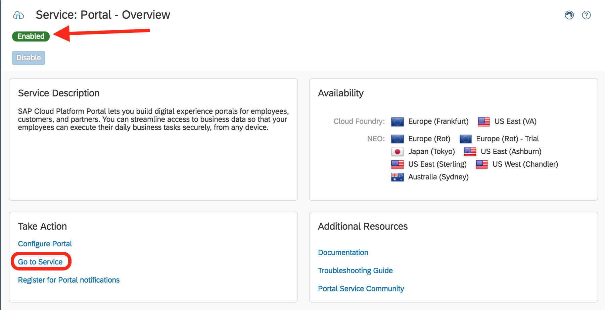
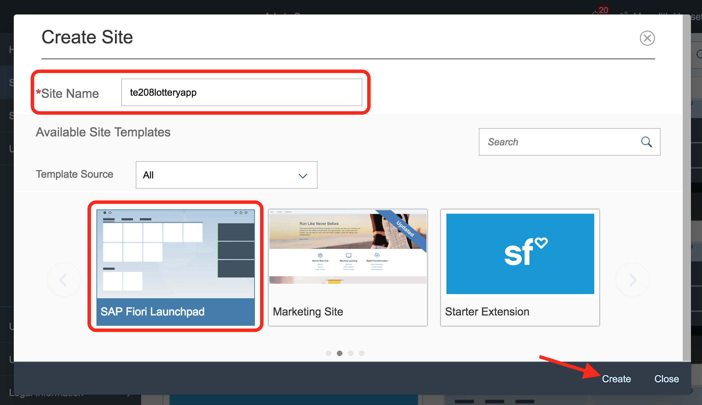
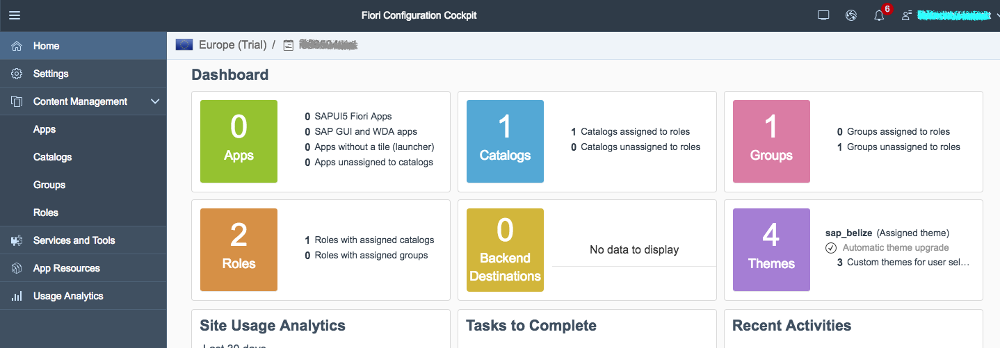

## Prerequisites  
 - **Proficiency:** Beginner

## Details
### You will learn  
Enable your SAP Portal service to create your very own Fiori Launchpad. Your Launchpad can be used with Web IDE to host apps that are deployed to the SAP Cloud Platform and registered with Fiori.

### Time to Complete
**10 Min**

---

[ACCORDION-BEGIN [Step 1: ](Go to Services)]

Back in your SAP Cloud Platform cockpit, go to the **Services** page.

In the search menu, search for **Fiori**.

[DONE]
[ACCORDION-END]

[ACCORDION-BEGIN [Step 2: ](Open the Portal service)]

From the filtered down list of services, find the **Portal** service under the **User Experience** group.

**Click** on the tile for the Portal Service.

Make sure to enable the service if is not already enabled. Once you see the green Enabled status, click **Go to service** in the Take Action section to launch the Fiori Launchpad Portal.

This will load the **Fiori Launchpad Portal**.

[DONE]
[ACCORDION-END]

[ACCORDION-BEGIN [Step 3: ](Create a new site)]

On the Fiori Launchpad Portal, click on the **Create New Site** button.

[DONE]
[ACCORDION-END]

[ACCORDION-BEGIN [Step 4: ](Set the site properties)]

Set the **Site Name** to **`te208lotteryapp`**.

Select the **SAP Fiori Launchpad** as the **Template Source**.

Click **Create**.

[DONE]
[ACCORDION-END]

[ACCORDION-BEGIN [Step 5: ](Fiori Configuration dashboard)]

Your Fiori Launchpad Configuration Cockpit will load.

[DONE]
[ACCORDION-END]

[ACCORDION-BEGIN [Step 6: ](Validate your Fiori Launchpad)]

In your **Fiori Launchpad Cockpit dashboard**, copy the **URL up to the ?** and paste it in the below box.

[VALIDATE_6]
[ACCORDION-END]

[ACCORDION-BEGIN [Step 7: ](Explore your Fiori Configuration Cockpit)]

On your cockpit dashboard, you can find summary details about all the apps your have deployed to your Fiori Launchpad. As you add apps, don't forget to come back here to configure more security and monitor performance.

[DONE]
[ACCORDION-END]

---
