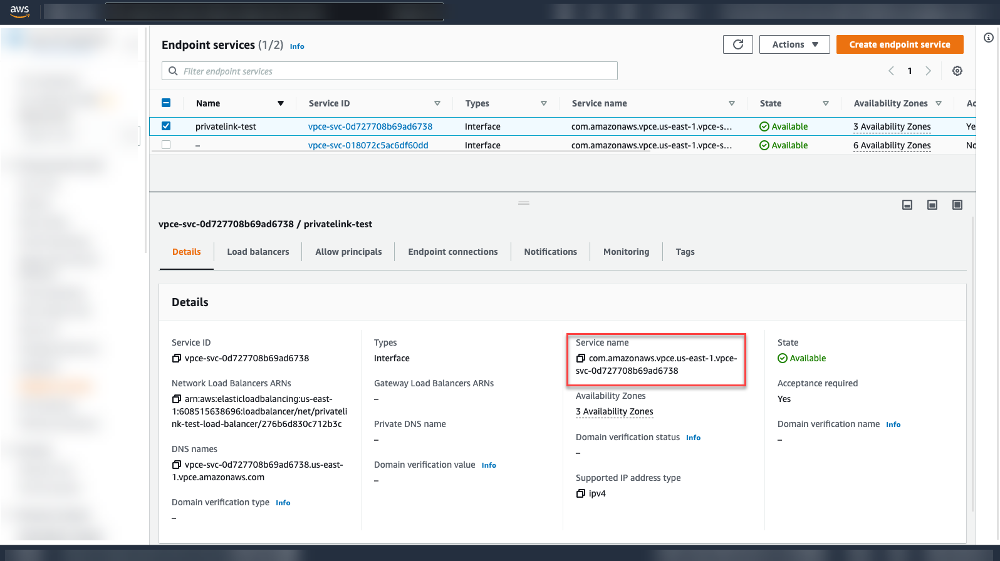

# Connect SAP Private Link Service to AWS Private Link Service
<!-- description --> Connect SAP Private Link Service to AWS Private Link Service with Cloud Foundry CLI and bind the service instance to your app or create a service key.

## Prerequisites
 - You have a global account and subaccount on SAP Business Technology Platform with SAP Private Link Service entitlement: [Set Up SAP Private Link Service on Amazon Web Services (Beta)](private-link-service-onboarding-aws)
 - You have created an AWS Endpoint Service in the Amazon VPC Console. [Create a service powered by AWS Private Link](https://docs.aws.amazon.com/vpc/latest/privatelink/create-endpoint-service.html)
 - When creating the Endpoint Service, make sure you allowlist the SAP BTP CF AWS Account IDs as described in [Only allow requests from SAP BTP CF's AWS account](https://help.sap.com/docs/PRIVATE_LINK/42acd88cb4134ba2a7d3e0e62c9fe6cf/e0455888a6e44eb2bda8b8edb13dc55a.html?locale=en-US&version=CLOUD)
 - You have installed Cloud Foundry CLI. See [Install the Cloud Foundry Command Line Interface (CLI)](cp-cf-download-cli)

## You will learn
  - How to create an SAP Private Link instance to connect to your AWS Private Link Service using Cloud Foundry CLI
  - How to bind the service instance to your application using Cloud Foundry CLI

## Intro
SAP Private Link Service establishes a private connection between applications running on SAP BTP and selected services in your own IaaS provider accounts. By reusing the private link functionality of our partner IaaS providers, you can access your services through private network connections to avoid data transfer via the public internet.

<!-- border -->

---

### Check offerings of Private Link Service


After you've logged in to the BTP Cloud Foundry region as described in [Install the Cloud Foundry Command Line Interface (CLI)](cp-cf-download-cli), please access the **Service Marketplace** of SAP BTP. To do this, open a command prompt on your computer and type in the following:

``Shell/Bash
cf marketplace
``

```Shell/Bash
 cf Marketplace
  Getting all service offerings from marketplace in org... / xy... trial as admin...

  offering       plans       description
  privatelink    beta    Link service establishes a private connection between selected SAP BTP services and selected services in your own IaaS provider accounts.
```

Make sure you can see `privatelink` in the sample output.


### Get service name for AWS Endpoint Service


To create and enable a private link, you need to define the connection to the service first. To do so, you need the service name of the endpoint service that you created as part of the prerequisites:

1. Go to the AWS VPC console.
<!-- border -->

2. Navigate to the **Endpoint Services**.
3. Search for the endpoint service you want to connect, select it and copy the Service name from the **Details** tab. You need it in the next step.

<!-- border -->

[VALIDATE_1]


### Create private link


Currently, you do not have any service instances enabled. Therefore, you need to create one. To create a new private link, you need the following information:

- service offering (`private link`),
- service plan (`beta`),
- a unique name (for instance, `privatelink-test`),
- service name from AWS (for example, `com.amazonaws.vpce.us-east-1.<service-id>`).

Enter `cf create-service` and add that information. Your command should look like this:

```Shell/Bash
cf create-service privatelink beta privatelink-test -c '{"serviceName":"ServiceName"}'
```

> **Example**:
`cf create-service privatelink beta privatelink-test -c '{"serviceName": "com.amazonaws.vpce.us-east-1.<service-id>"}'
`

If the creation of the service instance was accepted, you receive a success message telling you to proceed.


### Check status of private link


To check the current status of the newly created service instance, you need the name of your service instance (in this example `privatelink-test`). Type in the following:

```Shell/Bash
cf service privatelink-test
```

Under "message", you can see the current status. Please renew the command after approximately one minute. You should see the following message:

```Shell/Bash
Showing status of last operation:

status:     create in progress
message:    Connection from VPC Endpoint ID 'vpce-047f057f38a2e27e1' not yet approved to service 'com.amazonaws.vpc.us-east-1.vpce-svc-0d727708b69ad6738'. Waiting for approval.
```

> Execute this command again, if there's no change in the current status. If you receive an error message, go back to the previous steps.

Copy the VPC Endpoint ID from the success message. You need it in the next step.

> **Security Info**: In a scenario in which the initiator of the private link connection doesn't have access to the VPC Console to approve the new private endpoint connection themselves, please reach out to the person responsible for approving the connection on your side and share the endpoint ID responsibly.


### Approve connection in AWS


Return to the AWS VPC console:

1. Navigate to the **Endpoint Services**.
2. Select the endpoint service you want to connect to.
3. Go to **Endpoint Connections**.
4. Search for the endpoint ID and select the connection request.
5. Accept the endpoint connection request by pressing on **Actions > Accept endpoint connection request**.

<!-- border -->


You should now receive a success message that the approval is pending.

>**Security Info**: In a scenario in which the person that approves the endpoint connection wasn't the one that created the Private Link Service in the first place, please verify that the connection originated from a trustworthy origin (for instance, a colleague asking for approval via e-mail). This verification process prevents malicious misuse of resource ids.


 ### Check status of private link

To check the current status of the newly created service instance, you need the name of your service instance (in this example `privatelink-test`). Type in the following:

```Shell/Bash
  cf service privatelink-test
```

  You should see the following success message:

```Shell/Bash
  status:     create succeeded

  message:    Connection from VPC Endpoint ID 'vpce-047f057f38a2e27e1' to service 'com.amazonaws.vpce.us-east-1.vpce-svc-0d727708b69ad6738' is established.
  started:    <date>
  updated:    <date>
```


### Bind application to service instance


Upon the creation of a binding between a CF application and an SAP Private Link Service instance, SAP Private Link Service creates a space-scoped [Cloud Foundry application security group](https://docs.cloudfoundry.org/concepts/asg.html) that enables network access to the IP address associated with the private endpoint.

To bind the service instance to your application, you need to know the name of your application and your service instance (in this example `privatelink-test`). Then, execute the following command:

```Shell/Bash
cf bind-service "<appname>" "privatelink-test"
```
For more information, see [Binding Credentials](https://help.sap.com/docs/PRIVATE_LINK/d5fcaf2c5262485a87c6143b61b2c76b/6d1453baa5fa4e8fb3297e53ceb96bf6.html?locale=en-US&state=DRAFT#binding-credentials).

>If you do not have an app that you'd like to bind to your service instance, you can create a service key by running `cf create-service-key`<service-instance-name> <key-name>.

After the creation of your service binding, your application receives the information on how to connect via the binding credentials. See the following example for binding credentials:

> ```JSON
{
    "privatelink": [
        {
            "binding_guid": "0bfa43f4-39b7-4c7d-b0d3-d55eec0f0597",
            "binding name": "null,
            "credentials": {
                "hostname": "<private-link hostname>"
            },
            "instance_guid": "b506c523-3758-4ba6-bea6-f93418c82795",
            "instance_name": "privatelink-test"
            "label": "privatelink",
            "name": "privatelink-test",
            "plan": "beta",
            "provider": null,
            "syslog_drain_url": null,
            "tags": [
              "privatelink",
              "privatelinkservice"
            ],
            "volume_mounts": []
          }
      ]
}
```


---

Congratulations! You have successfully completed the tutorial.

---
