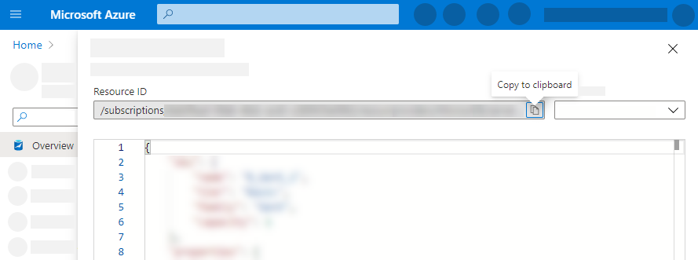

# Connect SAP Private Link Service to Microsoft Azure Private Link Service
<!-- description --> Connect SAP Private Link service to Microsoft Azure Private Link Service with Cloud Foundry CLI and bind the service instance to your app or create a service key.

## Prerequisites
- You have a global account and subaccount on SAP Business Technology Platform with SAP Private Link service entitlement: [Set Up SAP Private Link service ](private-link-onboarding).
- You have created a Microsoft Azure Private Link Service in the Azure Portal. You only have to create the Load Balancer resources (pool and rules) and the private link service. The section "Create a private endpoint" can be skipped, as SAP Private Link service will establish the connection for you. See [Create a Private Link service by using the Azure portal](https://docs.microsoft.com/en-us/azure/private-link/create-private-link-service-portal).
When creating the Azure Private Link service, make sure you allowlist the SAP BTP CF Subscription IDs as described in [Only allow requests from SAP BTP CF's Azure subscription](https://help.sap.com/docs/PRIVATE_LINK/42acd88cb4134ba2a7d3e0e62c9fe6cf/844bca7a51f04a15be865b9a6c1867b0.html?locale=en-US&version=CLOUD).
- You have installed Cloud Foundry CLI. See [Install the Cloud Foundry Command Line Interface (CLI)](cp-cf-download-cli).

## You will learn
  - How to create a SAP Private Link service instance to connect to your Microsoft Azure Private Link Service using Cloud Foundry CLI
  - How to bind the service instance to your application using Cloud Foundry CLI

 SAP Private Link service establishes a private connection between applications running on SAP BTP and selected services in your own IaaS provider accounts. By reusing the private link functionality of our partner IaaS providers, you can access your services through private network connections to avoid data transfer via the public internet.

## Intro
<!-- border -->

---

### Check offerings of Private Link service


After you've logged in as described in [Install the Cloud Foundry Command Line Interface (CLI)](cp-cf-download-cli), access the **Service Marketplace** of SAP BTP. Open a command prompt on your computer and type in the following:

```Shell/Bash
cf marketplace
```

You can now see the offering, the plan, and the description, as is shown in this example:

```Shell/Bash
$ cf marketplace
Getting all service offerings from marketplace in org ... / xy… trial as admin...

offering      plans      description                                                                                                                                                    
privatelink   standard    Link service establishes a private connection between selected SAP BTP services and selected services in your own IaaS provider accounts.
```

Make sure you can see `privatelink` in the sample output.


### Get Resource-ID for Azure Private Link Service


To create and enable a private link, you need to define the connection to the service first. To do so, you need the Resource-ID Azure service:

1. Go to the Azure portal.
2. Navigate to the Azure resource for which you want to find out the Resource ID, for example: **Private Link Center** > **Private link services**.
3. Click on **Overview** in the menu on the left side of your screen.

    <!-- border -->

4. Click on **JSON View** in the upper right corner of the overview page.
5. Search for the Resource ID in a field at the top of the resulting view in a text box labelled **Resource ID**.

    <!-- border -->


### Create private link service


Currently, you do not have any service instances enabled. Therefore, you need to create one. To create a new private link, you need the following information:

- offering (`privatelink`),
- plans (`standard`),
- a unique name (for instance, `privatelink-test`),
- and the Resource-ID from Microsoft Azure (for example, `/subscriptions/<subscription>/resourceGroups/<rg>/providers/Microsoft.Network/privateLinkServices/<my-private-link-service>`).

Enter `cf create-service` and add that information. Your command should look like this:

```Shell/Bash
cf create-service privatelink standard privatelink-test -c '{"resourceId": "Resource-ID"}'
```

> **Example**:
`cf create-service privatelink standard privatelink-test -c '{"resourceId":"/subscriptions/<subscription>/resourceGroups/<rg>/providers/Microsoft.Network/privateLinkServices/<privatelink-test>"}'`

If the creation of the service instance was accepted, you receive a success message telling you to proceed.

> **Tip**: You can add an optional description to your CF CLI `cf create service` command, for example `"requestMessage": "Please approve ASAP."` to provide some extra context.


### Check status of private link


To check the current status of the newly created service instance, you need the name of your service instance (in this example `privatelink-test`). Type in the following:

```Shell/Bash
cf service privatelink-test
```

Under "message", you can see the current status. Renew the command after approximately one minute. You should see the following message:

```Shell/Bash
Showing status of last operation from service verify-privatelink...

status:    create in progress
message:   Please approve the connection for Private Endpoint 'privatelink-test' in your Azure portal
```

>  Execute this command again, in case there's no change in the current status. If you receive an error message, go back to the previous steps.

Copy the *endpoint-name* from the success message. You need it in the next step.

> **Security Info**: In a scenario in which the initiator of the private link connection doesn't have access to the Azure Portal to approve the newly private endpoint connection him- or herself, please reach out to the person responsible for approving the connection and share the endpoint name responsibly.


### Approve connection in Azure


Return to Microsoft Azure portal:

1. Select **Settings > Private endpoint connections**.
2. Search for the name of the private endpoint you received from the success message in the previous step.
3. Select the private end point and click **Approve**.

<!-- border -->

You should now receive a success message that the approval is pending.

> **Security Info**: In a scenario in which the person that approves the private endpoint connection wasn't the one that created the Private Link service in the first place, please verify that the connection originated from a trustworthy origin (for instance, a colleague asking for approval via e-mail). This verification process prevents malicious misuse of resource ids. See also [Best Practices for Secure Endpoint Approval](https://help.sap.com/products/PRIVATE_LINK/42acd88cb4134ba2a7d3e0e62c9fe6cf/844bca7a51f04a15be865b9a6c1867b0.html?locale=en-US&version=CLOUD).


### Check status of private link


To check the current status of the newly created service instance, you need the name of your service instance (in this example `privatelink-test`). Type in the following:

```Shell/Bash
cf service privatelink-test
```

You should see the following success message:

```Shell/Bash
status:    create succeeded

message:    Private Endpoint 'privatelink-test' to ResourceID 'resource-id' successfully provisioned, ready for binding.
started:   <date>
updated:   <date>
```


### Bind application to service instance


Upon the creation of a binding between a CF application and a private link service instance, Private Link service creates a space-scoped [Cloud Foundry application security group](https://docs.cloudfoundry.org/concepts/asg.html) that enables network access to the IP address associated with the Private Endpoint.

To bind the service instance to your application, You need to know the name of your application and your service instance (in this example ```privatelink-test```). Then, execute the following command:

```Shell/Bash
cf bind-service "app-name" "privatelink-test"
```

> If you do not have an app that you'd like to bind to your service instance, you can create a service key by running ```cf create-service-key <service-instance-name> <key-name>```.
 After the creation of your service binding, your application receives the information on how to connect via the binding credentials. See the following example for binding credentials:

> ```JSON
{
    "privatelink": [
        {
            "instance_name": "privatelink-test",
            "label": "privatelink", // can be used to look up the bound instance programmatically
            "credentials": {
                "hostname": "<private-link hostname>", // internal hostname to connect to the service
                "additionalHostname": "<private-link additional hostname>" // additional internal hostname to connect to the service
            },
            "tags": [
                "privatelink",
                "privatelinkservice"
            ]
        }
    ]
}
```


---

Congratulations! You have successfully completed the tutorial.

---
