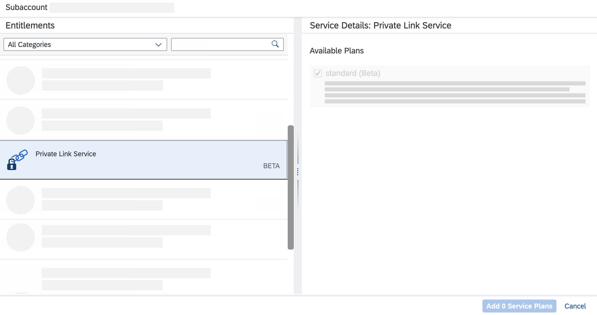

# Set Up SAP Private Link Service
<!-- description --> Get onboarded to use SAP Private Link service in SAP BTP.

## Prerequisites
- You have a global account and subaccount on SAP Business Technology Platform. See [Getting Started with SAP Business Technology Platform](https://help.sap.com/viewer/65de2977205c403bbc107264b8eccf4b/Cloud/en-US/144e1733d0d64d58a7176e817fa6aeb3.html).

## You will learn
  - How to start with SAP Private Link service
  - How to enable SAP Private Link service in BTP cockpit

## Intro
SAP Private Link service establishes a private connection between applications running on SAP BTP and selected services in your own IaaS provider accounts. By reusing the private link functionality of our partner IaaS providers, you can access your services through private network connections to avoid data transfer via the public internet.

<!-- border -->

---

### Set entitlements

To be able to use the functionalities of SAP Private Link service, you first need to set the entitlements in your subaccount. For more information, see [Configure Entitlements and Quotas for Subaccounts](https://help.sap.com/viewer/65de2977205c403bbc107264b8eccf4b/Cloud/en-US/5ba357b4fa1e4de4b9fcc4ae771609da.html).

If you have a Feature Set B account, you can use directories to group subaccounts. In order to assign a service to a subaccount that is part of a directory that handles entitlements, you have to assign it to the directory first. For more information, see [Cloud Management Tools - Feature Set Overview](https://help.sap.com/docs/btp/sap-business-technology-platform/cloud-management-tools-feature-set-overview).

1. Navigate to your **global account** of SAP BTP cockpit and select **Account Explorer**.

    <!-- border -->

2. From the list, choose the respective **subaccount** for which you would like to enable SAP Private Link service.
3. Navigate to **Entitlements** in the left hand navigation bar. You can now see all the existing service assignments for this respective subaccount.  
4. Select **Configure Entitlements**.

    <!-- border -->  

5. To add a new service assignment, select **Add Service Plans**. You see now all the offerings available to this specific subaccount.

6. Select **SAP Private Link service**, **standard** (from Available Plans) and then **Add 1 Service Plan**.

    <!-- border -->

### Define quota in your subaccount

You can distribute entitlements and quotas across subaccounts within a global account. Under **Remaining Global Quota**, you can see how much quota is still available across your global account. See also [Manage Entitlements Using the Cockpit](btp-cockpit-entitlements).

Use **+** and **-** to increase or decrease the quota of the SAP Private Link service plan according to your needs.

<!-- border -->

> One unit equals one Private Link endpoint.

### Enable Cloud Foundry runtime

Navigate to the **Overview** tab of your subaccount and check whether you've already enabled **Cloud Foundry runtime**. By default, Cloud Foundry runtime is not enabled.

1. To enable Cloud Foundry runtime, select **Enable Cloud Foundry**.

    <!-- border -->

2. Enter the following details:

    - **Plan**: `standard`
    - **Instance Name**: Choose a unique name, for example `privatelink-test`.
    - **Org Name**: Choose a name relating back to the instance, for example `privatelink-test`

3. Select **Create**.

> Enabling **Cloud Foundry runtime** may take a couple of minutes.

Once Cloud Foundry runtime has been enabled, you get the information on your API endpoint you need to connect to your org in SAP BTP.

<!-- border -->

> Before you proceed, make sure that **Cloud Foundry runtime** has been assigned adequate quota. If you have not done so already, go back to Step 2 and define the quota accordingly for Cloud Foundry runtime.

Congratulations! You have successfully completed the onboarding of SAP Private Link service. Continue with [Connect SAP Private Link Service to Microsoft Azure Private Link Service with Cloud Foundry CLI](private-link-microsoft-azure).

---
