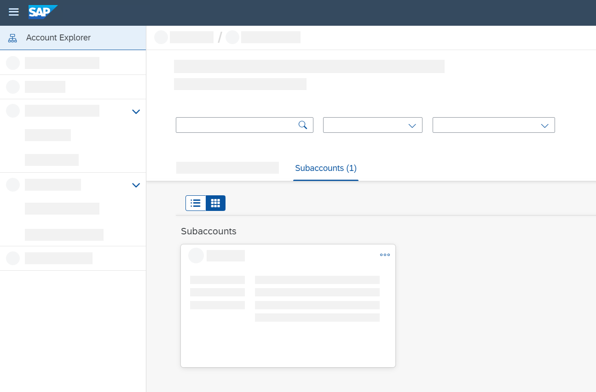
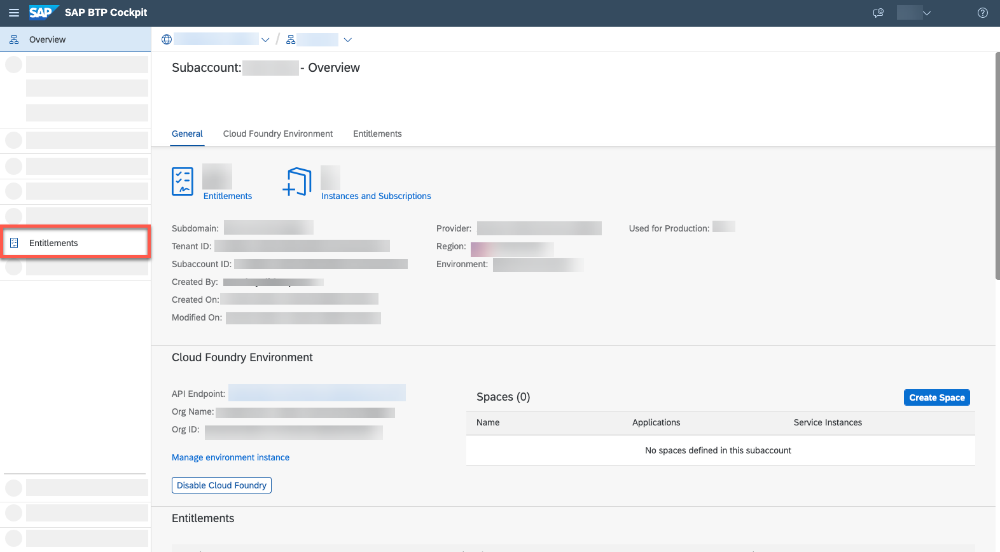
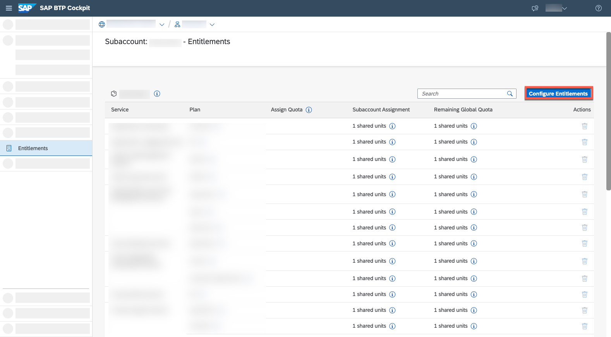
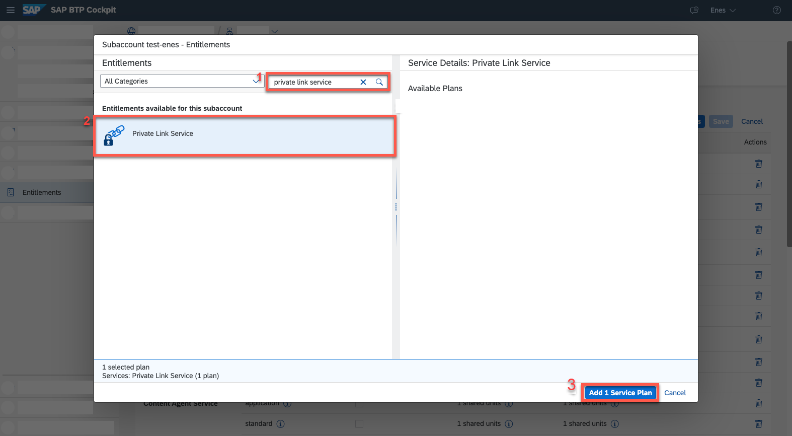
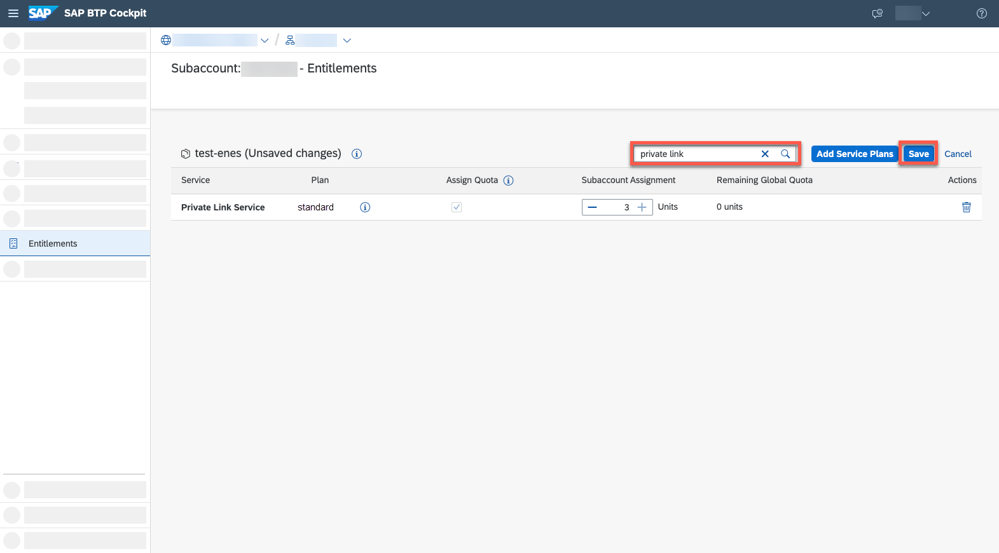
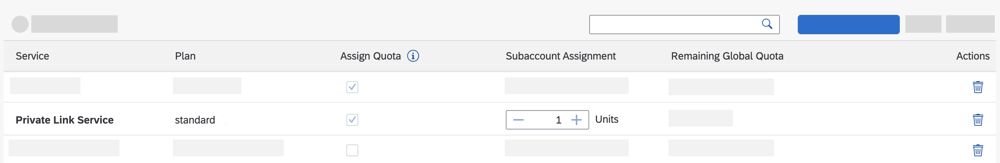
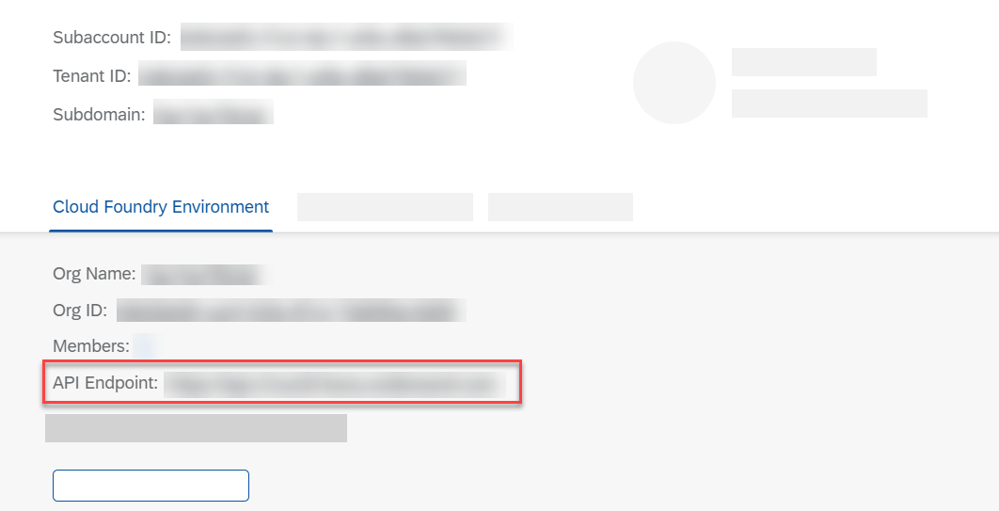

## Prerequisites
- You have a global account and subaccount on SAP Business Technology Platform. See [Getting Started with SAP Business Technology Platform](https://help.sap.com/viewer/65de2977205c403bbc107264b8eccf4b/Cloud/en-US/144e1733d0d64d58a7176e817fa6aeb3.html).
- You have enabled beta features for your subaccount. See [Create Subaccount](https://help.sap.com/products/BTP/65de2977205c403bbc107264b8eccf4b/05280a123d3044ae97457a25b3013918.html?q=create%20subaccount) or [Change Subaccount Details](https://help.sap.com/products/BTP/65de2977205c403bbc107264b8eccf4b/567d4a84bfdc428f8f3640e07261f73a.html?q=subaccount%20details).

## Details
### You will learn
  - How to start with SAP Private Link service on Amazon Web Services (Beta)
  - How to enable SAP Private Link service in BTP cockpit

SAP Private Link service establishes a private connection between applications running on SAP BTP and selected services in your own IaaS provider accounts. By reusing the private link functionality of our partner IaaS providers, you can access your services through private network connections to avoid data transfer via the public internet.

!

---

[ACCORDION-BEGIN [Step 1: ](Select Subaccount)]
To be able to use the functionalities of SAP Private Link service, you first need to set the entitlements in your subaccount. For more information, see [Configure Entitlements and Quotas for Subaccounts](https://help.sap.com/viewer/65de2977205c403bbc107264b8eccf4b/Cloud/en-US/5ba357b4fa1e4de4b9fcc4ae771609da.html).

1. Navigate to your **global account** of SAP BTP cockpit and select **Account Explorer**.

    !

2. From the list, choose the respective **subaccount** for which you would like to enable SAP Private Link service or create a new subaccount. Beta Features need to be enabled.
3. Navigate to **Entitlements** in the left hand navigator bar. You can now see all the existing service assignments for this respective subaccount.  

    !

4. Select **Configure Elements**.

     !

5. To add a new service assignment, select **Add Service Plans**. You see now all the offerings available to this specific subaccount.
6. Search for "private link service" and select **SAP Private Link Service, beta (Beta)** and then **Add 1 Service Plan**.

     !

7. Save the changes by clicking on **Save** and then search for "private link" to see the entitlement assignments

     !

[VALIDATE_1]
[ACCORDION-END]

[ACCORDION-BEGIN [Step 2: ](Enable Cloud Foundry runtime)]

Navigate to the **Overview** tab of your subaccount and check whether you've already enabled **Cloud Foundry runtime**. By default, Cloud Foundry runtime is not enabled.

1. To enable Cloud Foundry runtime, select **Enable Cloud Foundry**.

    !

2. Enter the following details:

    - **Plan**: `standard`
    - **Instance Name**: Choose a unique name, for example `privatelink-test`.
    - **Org Name**: Choose a name relating back to the instance, for example `privatelink-test`

3. Select **Create**.

> Enabling **Cloud Foundry runtime** may take a couple of minutes.

Once Cloud Foundry runtime has been enabled, you get the information on your API endpoint you need to connect to your org in SAP BTP.

!

> Before you proceed, make sure that **Cloud Foundry runtime** has been assigned adequate quota. If you have not done so already, go back to Step 2 and define the quota accordingly for Cloud Foundry runtime.

Congratulations! You have successfully completed the onboarding of SAP Private Link service. Continue with [Connect SAP Private Link Service to AWS Private Link Service](https://developers.sap.com/tutorials/private-link-aws.html).

[DONE]
[ACCORDION-END]

---
