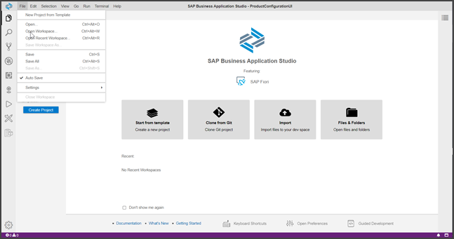
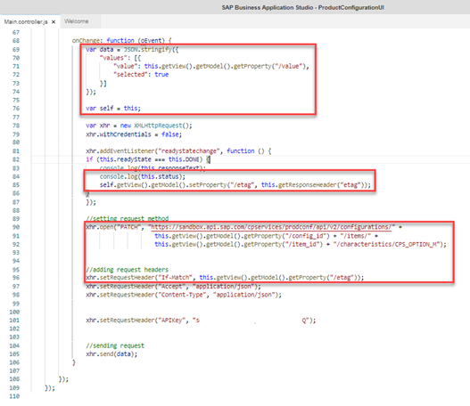
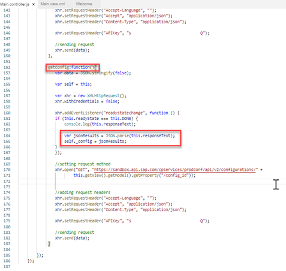

# Create an SAPUI5 Application for SAP Variant Configuration and Pricing
<!-- description --> Build a basic UI5 application that loads a configuration and changes the value of one characteristic using the SAP Variant Configuration and Pricing APIs from SAP API Business Hub.

## Prerequisites
 Complete this tutorial: (https://developers.sap.com/tutorials/hcp-create-trial-account.html)

## You will learn
  - How to use SAP API Business Hub's productivity tools for developers (like sandbox environment and code snippet generator) to easily test cloud services
  - How to use SAP Business Technology Platform's trial environment and SAP Business Application Studio to build a small SAPUI5 application
  - How to orchestrate and use the different APIs of the variant configuration and pricing services

---

### Create an SAPUI5 application


1. Go to the [SAP Business Application Studio](https://triallink.eu10.trial.applicationstudio.cloud.sap/). Accept the SAP Business Application Studio Trial Privacy Statement when it pops up. Click on **Create Dev Space**.

    <!-- border -->

    In the name field, enter **`ProductConfigurationUI`**, choose **SAP Fiori**, and then choose **Create Dev Space**.

    <!-- border -->

2. When the status changes to **Running**, click on the space name created. Accept the SAP Business Application Studio Trial Privacy Statement when it pops up.

    <!-- border -->

3. In the **Create Dev Space**, create a new project from the template via menu **File** > **New Project from Template**.

    <!-- border -->

    Choose the template **SAP Fiori application** and then **Start**.

    Choose **Application Type** **SAPUI5 freestyle** and the **SAPUI5 Application floor plan**, then choose **Next**.

    <!-- border -->

    Choose Data source **None**, and then **Next**.

    <!-- border -->

    You may want to rename the initial View name as **Main**, then choose **Next**.

    <!-- border -->

    Provide the following:

      - **Module name**: such as **`product_configuration_api_tutorial`**

      - **Application title**: such as **`Product Configuration API Tutorial`**

      - **Application namespace** such as **`sap.tutorial`**

      - **Description** such as **`Product Configuration API Tutorial`**

    Keep the default for the other parameters, then choose **Finish**.

    <!-- border -->

    Choose the project you created and click **Open**.

4. The application is now created. It can be opened via the menu **File** > **Open Workspace…**.

    <!-- border -->

    Choose the project you created and click **Open**.

    <!-- border -->

5. The application will call the Variant Configuration service during the initialization of the form. The controller, can be found at **`ProductConfigurationAPITutorial`** > **`webapp`** > **controller** > **Main.controller.js**, in which the service APIs will be called.

    <!-- border -->

    You will call the following cloud service APIs:

    -	`POST /api/v2/configurations` to create a new product configuration.
    -	`GET /api/v2/knowledgebases/{kbId}` to read static master data for display (descriptions of a characteristic and its values in our example).
    -	`PATCH /api/v2/configurations/{configurationId}/items/{itemId}/characteristics/{characteristicId}` to change a characteristic value.
    -	`GET /api/v2/configurations/{configurationId}` to read and displayed the changed configuration results.
    - `POST /api/v1/statelesspricing` to get the price based on the chosen characteristic value.


### Get pre-generated code


1. In the [API Business Hub] (https://api.sap.com/) search for SAP Variant Configuration, find the **SAP Variant Configuration and Pricing** API Package and choose it.

    <!-- border -->


2. Once on the API package page, choose **Variant Configuration service**.

    <!-- border -->

3. In the Test View find the `POST /api/v2/configurations` method and click on the **Code Snippet** link.

    <!-- border -->

Click on the **JavaScript** tab and copy the code.


### Load configuration in your application


1. Back in SAP Business Application Studio, add the copied code from the API Business Hub to your `onInit` function.

2. Replace in the code the `data` variable by using the example input JSON found for the service on API Hub.

    <!-- border -->

3. Remove `xhr.setRequestHeader("DataServiceVersion", "2.0"`; from the `onInit` function because configuration and pricing service does not allow this header field and it is blocked by CORS policy. Make sure to remove it from the copied snippets.

    <!-- border -->

    > An API Key is used as an authentication method. Each time an API is called, the API Key needs to be sent in the http request header. Make sure you are logged in SAP API Business Hub to get your API Key.


4. Click on **Show API Key**.

    <!-- border -->

    This will show the API key in pop up view. Click on the button **Copy Key and Close**.

    <!-- border -->

    Add the API key as a request header to the copied code in your `onInit` function as `xhr.setRequestHeader("APIKey", "<API-Key>")`

    <!-- border -->

    > ESLINT errors caused by console statement or hard-coded URL can be switched off in project settings or by inserting Java /* eslint-disable */ in the first line.


### Run your application


Run your new application to test it.

1. Open the Run Configurations view.

    <!-- border -->

2. Expand the run configuration and hover over the run configuration and choose the **Run Module** icon.

    <!-- border -->

    If you are running the app for the first time, the button of the notification will say **Expose and Open**. Otherwise, it will say **Open in New Tab**.

3. You should see a blank application with the title `opened in a new tab`. The pre-generated code puts the results of the API in the browser console. To find the result, open your browser's developer tools and go to the **Console** tab.

    <!-- border -->

    Which field in the response body of service endpoint `/api/v2/configurations` returns the unique identifier of the configuration? This identifier must be provided as input field `configurationId` to the subsequent calls to the other endpoints, e.g. to change a characteristic value.


### Display characteristic value


The result from the API consists of the configuration, characteristics, and characteristic values.

1. Add a `ComboBox` to display characteristic **`CPS_OPTION_M`** value. Open your main view and add a `ComboBox`. The `ComboBox` items and selected item will be set from the result of the API call.

    <!-- border -->

    ```JavaScript
    <mvc:View controllerName="sap.tutorial.ProductConfigurationAPITutorial.controller.Main" xmlns:html="http://www.w3.org/1999/xhtml" xmlns:mvc="sap.ui.core.mvc" xmlns:core="sap.ui.core"  displayBlock="true" xmlns="sap.m">
            <App id="app">
                <pages>
                    <Page title="{i18n>title}">
                        <content>
                            <ComboBox items="{/possible_values}" selectedKey="{/value}">
                                <core:Item key="{valueLow}" text="{valueLow}"/>
                            </ComboBox>
                        </content>
                    </Page>
                </pages>
            </App>
    </mvc:View>
    ```

    >Ensure that core namespace is declared via `xmlns:core="sap.ui.core"`

2. Back in the controller file, you will need to define the model used in the view. You need to add the
`JSONModel` library to your controller. In the `define` at the top of the controller, add the `JSONModel` library by adding **`sap/ui/model/json/JSONModel`** and defining the `JSONModel` in the controller function.

    <!-- border -->

    ```JavaScript
    sap.ui.define([
        "sap/ui/core/mvc/Controller",
        "sap/ui/model/json/JSONModel"
    ], function (Controller, JSONModel) {
    ```


3. In the `onInit` function, you need to save the current version so that you can access the view associated
with the controller in the API call response. Create a new variable called **self** and set it to **this**.

    ```JavaScript
    var self = this;
    ```

4. Additionally, you need to create a new `JSONModel` to house the results of the API call. Bind a new empty `JSONModel` to the view.

    ```JavaScript
    this.getView().setModel(new JSONModel({}));
    ```

5. To actually bind the result to the model, you need to parse the API response in the `xhr.addEventListener` function. The result from the API comes back as text, so you need to parse it to JSON.

    ```JavaScript
    var jsonResults = JSON.parse(this.responseText);
    ```

6. Then, you can set the relevant properties into the model. The `ComboBox` needs `CPS_OPTION_M` possible values and its initial value.

    ```JavaScript
    var CPS_OPTION_M = jsonResults.rootItem.characteristics.find(function (i) { return i.id === "CPS_OPTION_M"; });
    self.getView().getModel().setProperty("/possible_values", CPS_OPTION_M.possibleValues);
    if (CPS_OPTION_M.values.length > 0) {
      self.getView().getModel().setProperty("/value", CPS_OPTION_M.values[0].value);
    } else {
      self.getView().getModel().setProperty("/value", "");
    }
    ```

    >The used find() statement is not supported by Internet Explorer 11.

      <!-- border -->

7. Save the changes. If you execute the application, you will see a `ComboBox` filled with `CPS_OPTION_M` characteristic possible values, having the selected value be the default value for this characteristic.

    <!-- border -->


### Change characteristic value


1. Update the configuration if the user changes the value of the `ComboBox`. First, you need to declare a new event on the `ComboBox` control in the view.

    <!-- border -->

    ```JavaScript
<mvc:View controllerName="sap.tutorial.ProductConfigurationAPITutorial.controller.Main" xmlns:html="http://www.w3.org/1999/xhtml" xmlns:mvc="sap.ui.core.mvc" xmlns:core="sap.ui.core"  displayBlock="true" xmlns="sap.m">
       <App id="app">
           <pages>
               <Page title="{i18n>title}">
                   <content>
                       <ComboBox items="{/possible_values}" selectedKey="{/value}" selectionChange="onChange">
                            <core:Item key="{valueLow}" text="{valueLow}"/>
                        </ComboBox>
                    </content>
                </Page>
            </pages>
        </App>
</mvc:View>
```

2. Back to the main controller, create an empty `onChange` function.

    ```JavaScript
onChange: function (oEvent) {
}
```
As in step 3, head over to SAP API Business Hub, locate the PATCH **`/api/v2/configurations/{configurationId}/items/{itemId}/characteristics/{characteristicId}`** API under **Test View** and copy the JavaScript code.


    <!-- border -->


3. Add the copied `JavaScript` code from API Business Hub to the newly created `onChange` function. Make sure to remove `xhr.setRequestHeader("DataServiceVersion", "2.0");` and add API Key.


    <!-- border -->


4. Change the data variable declaration to assign the value from the value property of the view model, which is bound to the `ComboBox` value.

    ```JavaScript
var data = JSON.stringify({
    "values": [{
        "value": this.getView().getModel().getProperty("/value"),
        "selected": true
    }]
});
```

    Since this API PATCH method does not return a response body, in the `xhr.addEventListener` call of the `onChange` function, you may change the console log so that the response code is logged instead of the response text.

    ```JavaScript
console.log(this.status);
```

5. To fill out all parameters for this API method, you need to add a few fields in the view model, namely `configuration id` and `item id`. Add these new properties on the model in the `xhr.addEventListener` call of the `onInit` function so that the model is filled when the configuration is loaded.

    ```JavaScript
self.getView().getModel().setProperty("/config_id", jsonResults.id);
self.getView().getModel().setProperty("/item_id", jsonResults.rootItem.id);
```

6. Once they are added in the model, replace hard-coded `{configurationID}` and `{itemID}` in the generated `url` in the `onChange` function by the values in the model. Likewise, replace hard-coded `{characteristidID}` by `CPS_OPTION_M`.

    ```JavaScript
xhr.open("PATCH",
    "https://sandbox.api.sap.com/cpservices/prodconf/api/v2/configurations/" +
    this.getView().getModel().getProperty("/config_id") + "/items/" +
    this.getView().getModel().getProperty("/item_id") + "/characteristics/CPS_OPTION_M "
);
```

    Almost done! The variant configuration API uses HTTP header fields `etag` and `If-Match` as an optimistic lock. You need to capture the `etag` header in the model from the HTTP response when loading the configuration and send back that value in the `If-Match HTTP` header when updating the configuration. In the **`xhr.addEventListener`** call of the `onInit` function, set the `etag` property of the model with the `etag` value of the response header.

    ```JavaScript
self.getView().getModel().setProperty("/etag", this.getResponseHeader("etag"));
```

    You also you need to capture the `etag` value of the characteristic change response in case the user wants to update the value multiple times. Add the same line in the **`xhr.addEventListener`** call of the `onChange` function.
     Back in the `onChange` function, fill the `If-Match` request header value with the `etag` value of the model.

    ```JavaScript
xhr.setRequestHeader("If-Match", this.getView().getModel().getProperty("/etag"));
```

    <!-- border -->
&nbsp;
    <!-- border -->

    >Do not forget variable `self` in this and the coming new functions.

7. Run your application. You should see a `ComboBox` filled with the possible values of characteristic `CPS_OPTION_M`, having the selected value be the default value for this characteristic. If you change the value of the `ComboBox`, the call is made to the API to change the value, and you can see the response code in the JavaScript console, which should be 200.

    <!-- border -->

    By how much is the `eTag` value in the service response header increased with each change to the characteristic `CPS_OPTION_M?` Check the  development tools of your browser.


### Use value description

Currently, the value keys are displayed in the interface. In a real-world scenario, you might want to provide the value descriptions to the user and add a label to the `combo box`. This can be achieved by getting the knowledge base details.

1. Create a new method `readKb` in the controller that takes a knowledge base id as parameter.

    When creating a configuration (Step 3), the knowledge base id is returned from the API. To get the `KB` details, another API needs to be called. Go to the API Business Hub (as in step 2), locate the `GET/api/v2/knowledgebases/{kbId}` method, copy the JavaScript code then paste it in the `readKb` function.

    <!-- border -->

    Modify the URL of the request to include the knowledge base ID function parameter.


    ```JavaScript
    xhr.open("GET", "https://sandbox.api.sap.com/cpservices/prodconf/api/v2/knowledgebases/" + kbId + "?$select=products,classes,characteristics,characteristicSpecifics,bomItems,description");
    ```

    Make sure to remove `xhr.setRequestHeader("DataServiceVersion", "2.0");` and add **API Key**.

2. You need to bind the possible values to the model by parsing the response text to JSON then retrieving the `possible_values` property of `CPS_OPTION_M`. Also, add the characteristic name to a new model property `/name`.

    ```JavaScript
    var jsonResults = JSON.parse(this.responseText);
    var CPS_OPTION_M = jsonResults.characteristics.find(function (i) {
    return i.id === "CPS_OPTION_M";
    });
    self.getView().getModel().setProperty("/possible_values", CPS_OPTION_M.possibleValues);
    self.getView().getModel().setProperty("/name", CPS_OPTION_M.name);
    ```

    <!-- border -->

    Remember to remove the assignment of `possible_values` to the model in the `addEventListener` function of the `onInit` function.

3. Now, you need to call the new function `readKb` when the configuration is created with the knowledge base id, at the `addEventListener` of the `onInit` function.

    <!-- border -->

    In the view, add a `SimpleForm` which contains the previous `ComboBox` and a new Label. Set the label text to the new model property `/name`.

4. Finally, adjust the `ComboBox` control in the view so that elements `id` and `name` of `possible_values` are used as key and text respectively.

    <!-- border -->

    ```xml
    <sap.ui.layout.form:SimpleForm xmlns:sap.ui.layout.form="sap.ui.layout.form" editable="true" layout="ResponsiveGridLayout" id="form0">
    <sap.ui.layout.form:content>
    <Label text="{/name}" id="label"/>
    <ComboBox items="{/possible_values}" selectedKey="{/value}" selectionChange="onChange">
    <core:Item key="{id}" text="{name}"/>
    </ComboBox>
    </sap.ui.layout.form:content>
    </sap.ui.layout.form:SimpleForm>
    ```

    Run your application. The value descriptions are provided by the `ComboBox`, and the label text comes from the knowledge base.

    <!-- border -->


### Calculate pricing

In addition to the configuration, SAP Variant Configuration and Pricing also provides a way to calculate the pricing.

In the Burger model, the price is influenced by the menu option. By changing the menu option values, we should see a difference in the calculated price.

For the pricing API to correctly reflect the status of the configuration, the variant condition `characteristic values` needs to be provided. Which means that the configuration needs to be read after updating it in the app.

1. Locate the GET `/api/v2/configurations/{configurationId}` in the SAP API Business Hub, copy the JavaScript code and paste it in a new method `_getConfig`.
   Modify the URL of the request to include the configuration ID from the model.

    ```JavaScript
    xhr.open("GET", "https://sandbox.api.sap.com/cpservices/prodconf/api/v2/configurations/" + this.getView().getModel().getProperty("/config_id"));
    ```

    Make sure to remove `xhr.setRequestHeader("DataServiceVersion", "2.0");` and add API Key.

2. In the `xhr.addEventListener` function, assign the configuration JSON in a new attribute `self._config`.

    <!-- border -->

    Call this new method from the `xhr.addEventListener` function of the `onChange` method, so that the configuration is read again as soon as it is modified.

    <!-- border -->

3. Next, add new read-only fields that will be used to show the base price and selected options as well as a button to calculate the price.

    <!-- border -->

    ```JavaScript
    <mvc:View controllerName="sap.tutorial.ProductConfigurationAPITutorial.controller.Main" xmlns:html="http://www.w3.org/1999/xhtml" xmlns:mvc="sap.ui.core.mvc" xmlns:core="sap.ui.core"  displayBlock="true" xmlns="sap.m">
            <App id="app">
                <pages>
                    <Page title="{i18n>title}">
                        <content>
                            <sap.ui.layout.form:SimpleForm xmlns:sap.ui.layout.form="sap.ui.layout.form" editable="true" layout="ResponsiveGridLayout" id="form0">
                            <sap.ui.layout.form:content>
                                <Label text="{/name}" id="label"/>
                                <ComboBox items="{/possible_values}" selectedKey="{/value}" selectionChange="onChange">
                                    <core:Item key="{id}" text="{name}"/>
                                </ComboBox>
                                <Label text="{i18n>basePrice}"/>
                                <Input value="{/base_price}" editable="false"/>
                                <Label text="{i18n>selectedOptions}"/>
                                <Input value="{/selected_options}" editable="false"/>
                                <Label text="{i18n>price}"/>
                                <Input value="{/price}" editable="false"/>
                            </sap.ui.layout.form:content>
                            </sap.ui.layout.form:SimpleForm>
                        <Button text="{i18n>getPrice}" type="Accept" press="onPrice"/>
                        </content>
                    </Page>
                </pages>
            </App>
    </mvc:View>
    ```

    Do not forget to update your **`i18n`** file with the new labels!

    ```JavaScript
basePrice=Base price
selectedOptions=Selected options
price=Price
getPrice=Get pricing
```

    <!-- border -->

4. Next, go to the SAP API Business Hub, locate the `/api/v1/statelesspricing` method in the Pricing service, copy the JavaScript code and paste it in a new method `onPrice`.

    <!-- border -->

    &nbsp;

    <!-- border -->

    There are a lot of parameters in this API that you would fill out in a real-world application. But for this tutorial, hard code all values except for the `KOMP-VARCOND` attribute of the item 000010.
    Get the variant condition values from the configuration and assign them to the `KOMP-VARCOND` attribute in the request data.

    ```JavaScript
    var varCond = this._config.rootItem.characteristics.find(function (i) {
        return i.id === "CPS_VARCOND";
    });
    var varCondValues = [];
    for (var i = 0; i < varCond.values.length; i++) {
        varCondValues.push(varCond.values[i].value);
    }
    ```

    ```JavaScript
    var data = JSON.stringify({
                        "docCurrency": "EUR",
                        "locCurrency": "EUR",
                        "pricingProcedure": "ZPRC03",
                        "groupCondition": false,
                        "itemConditionsRequired": true,
                        "items": [
                            {
                            "itemId": "000010",
                            "externalId": "000010",
                            "quantity": {
                                "value": 1,
                                "unit": "PCE"
                            },
                            "grossWeight": {
                                "value": 0,
                                "unit": "KGM"
                            },
                            "netWeight": {
                                "value": 0,
                                "unit": "KGM"
                            },
                            "volume": {
                                "value": 0,
                                "unit": ""
                            },
                            "exchRateType": "M",
                            "exchRateDate": "2018-05-04",
                            "productDetails": {
                                "productId": "CPS_BURGER",
                                "baseUnit": "PCE",
                                "alternateProductUnits": [
                                {
                                    "alternateUnitName": "PCE",
                                    "numerator": 1,
                                    "denominator": 1
                                }
                                ]
                            },
                            "attributes": [
                                {
                                "name": "KOMK-HWAER",
                                "values": [
                                    "EUR"
                                ]
                                },
                                {
                                "name": "KOMK-KONDA",
                                "values": [
                                    "01"
                                ]
                                },
                                {
                                "name": "KOMK-KUNNR",
                                "values": [
                                    "0000010052"
                                ]
                                },
                                {
                                "name": "KOMK-PLTYP",
                                "values": [
                                    ""
                                ]
                                },
                                {
                                "name": "KOMK-VKORG",
                                "values": [
                                    "0001"
                                ]
                                },
                                {
                                "name": "KOMK-VTWEG",
                                "values": [
                                    "01"
                                ]
                                },
                                {
                                "name": "KOMK-WAERK",
                                "values": [
                                    "EUR"
                                ]
                                },
                                {
                                "name": "KOMP-KONDM",
                                "values": [
                                    ""
                                ]
                                },
                                {
                                "name": "KOMP-PMATN",
                                "values": [
                                    "CPS_BURGER"
                                ]
                                },
                                {
                                "name": "KOMP-PRSFD",
                                "values": [
                                    "X"
                                ]
                                },
                                {
                                "name": "KOMP-VARCOND",
                                "values": varCondValues
                                },
                                {
                                "name": "PRSFD",
                                "values": [
                                    "X"
                                ]
                                }
                            ],
                            "accessDateList": [
                                {
                                "name": "KOMK-PRSDT",
                                "value": "2018-05-04"
                                },
                                {
                                "name": "KOMK-FBUDA",
                                "value": "2018-05-04"
                                }
                            ],
                            "variantConditions": [],
                            "statistical": false
                            }]
           });
    ```

    <!-- border -->

    &nbsp;

    <!-- border -->

5. In the `xhr.addEventListener` function of the `onPrice` function, get the net value as well as the value of the condition purposes `ZSS1` and `ZSS2`, which in this test model means **Base Price** and **Selected** Options, and assign them to the JSON model.

    ```JavaScript
var jsonResults = JSON.parse(this.responseText);
self.getView().getModel().setProperty("/price", jsonResults.netValue);
self.getView().getModel().setProperty("/base_price", jsonResults.conditionsWithPurpose.find(function (i) {
    return i.purpose === "ZSS1";
}).value);
self.getView().getModel().setProperty("/selected_options", jsonResults.conditionsWithPurpose.find(function (i) {
    return i.purpose === "ZSS2";
}).value);
```

    <!-- border -->

    Make sure to remove `xhr.setRequestHeader("DataServiceVersion", "2.0");` and add **API Key**.

6. Run your application. The selected options and price values will change depending on the menu option you choose. The below result is excluding the `External Conditions` in the input for stateless pricing API. If the `External Conditions` are included then the results may vary.

    <!-- border -->

**Congratulations!** You have successfully completed the tutorial. We hope that you find it useful and it helps you to start discovering our services.


>In the example above, possible values of the characteristic are read at the end only from the knowledge base. List of possible values can change during runtime, therefore in a real world example possible values from configuration results must be considered.

>The sandbox environment of the API Hub is used with an API key when calling the services. In the productive environment, OAuth authentication with client credentials would be used.

>Finally, the configuration service is called without providing session context. For optimal performance and resource consumption, please ensure that the cookie retrieved with each configuration creation (implementation in the `onInit` event listener of the function in our example) is used when calling the other configuration service APIs for the same configuration session (functions `onChange`, `readKB`, and `getConfig` in our example).

> ```JavaScript
 self.getView().getModel().setProperty("/cookie", this.getResponseHeader("set-cookie"));
 xhr.setRequestHeader("Cookie", this.getView().getModel().getProperty("/cookie"));
```  

Please read the development guide (https://help.sap.com/viewer/f2b349b522ff40f0918e1e7ada320799/Cloud/en-US/98b0e7f7ba8d46f4976c884177daebdd.html) for more information about how to use the services.


---
