# Optimize Prompts for Tool Calling Using a Custom LLM-as-a-Judge Metric in SAP AI Core
<!-- description --> Use SAP AI Core Prompt Optimization to automatically rewrite a weak base prompt into a strict tool-calling prompt — this time creating your own custom `tool-call-accuracy` evaluation metric from code, running the full optimization pipeline, and comparing the result against the built-in `JSON_Match` metric.

## Prerequisites
- You have an [SAP AI Core](https://help.sap.com/docs/sap-ai-core) service instance and a service key (with `clientid`, `clientsecret`, `url`, and `serviceurls.AI_API_URL`).
- You have the `generative-ai-hub-sdk` (`gen_ai_hub`) and `ai-api-client-sdk` installed, plus `requests`, `python-dotenv`, and `pydantic`.
- The models `gpt-4o:2024-08-06` and `gemini-2.5-pro:001` are available in your AI Core tenant (check **Generative AI Hub → Models**).
- You have a **running orchestration deployment** in your tenant (required only for the live comparison in Step 9).
- You have the BFCL v3 dataset file `BFCL_v3_parallel_multiple_10tools.json` in your working directory. This is a subset of the [Berkeley Function-Calling Leaderboard](https://gorilla.cs.berkeley.edu/leaderboard.html) v3 benchmark.
- (Optional) You have [Bruno](https://www.usebruno.com/) installed if you want to follow the REST API option blocks instead of the Python SDK.

## You will learn
- How to **create a custom LLM-as-a-judge evaluation metric** (`tool-call-accuracy`) directly through the AI Core API, including its rating rubric, evaluation steps, and few-shot example.
- How to configure a prompt-optimization run that uses a **custom metric** instead of a built-in one.
- How to normalize a raw BFCL v3 dataset into the optimizer's "golden record" format and upload it as a dataset artifact.
- How to register a base prompt, trigger and monitor an optimization execution, and retrieve the optimized prompt.
- How to compare base vs optimized prompts through **live inference**, and how the choice of metric (custom vs `JSON_Match`) shapes the optimizer's output.

## Intro
Large language models are often asked to read a user's question and decide **which tools to call** and **with what arguments** ("tool calling"). A vague system prompt like `"You are a helpful assistant."` usually makes the model reply in prose instead of structured JSON, which breaks any downstream code expecting machine-readable tool calls.

**Prompt Optimization** in SAP AI Core automates the trial-and-error of prompt engineering. You give it a starting prompt, a dataset of questions paired with correct tool calls ("golden answers"), and a **metric** that scores how good a candidate prompt's output is. The optimizer then iteratively rewrites the prompt, tests it, and keeps the best-scoring version.

This tutorial goes one step further than simply *using* a pre-existing metric: you will **create the custom evaluation metric itself** from code, run the full pipeline, and finish by comparing a custom-metric-optimized prompt against a `JSON_Match`-optimized one to see how the metric choice affects the result.

---

### Understand the pipeline (Pre-Read)

Before writing any code, it helps to hold the whole flow in your head. Every step below re-uses a single authenticated `client` object and builds on variables created earlier, so the notebook cells (and the steps here) are meant to run **in order, top to bottom**.

The end-to-end pipeline is:

```
 ┌─────────────────┐     ┌──────────────────┐     ┌────────────────────┐
 │ 1. Connect to    │ --> │ 2. Verify/create  │ --> │ 3. Configure         │
 │    AI Core       │     │  the custom metric │     │  optimization params │
 └─────────────────┘     └──────────────────┘     └────────────────────┘
                                                              │
                                                              v
 ┌─────────────────┐     ┌──────────────────┐     ┌────────────────────┐
 │ 6. Register       │ <-- │ 5. Register base  │ <-- │ 4. Load/normalize +  │
 │  base prompt      │     │  dataset artifact  │     │  upload BFCL data     │
 └─────────────────┘     └──────────────────┘     └────────────────────┘
         │
         v
 ┌─────────────────┐     ┌──────────────────┐     ┌────────────────────┐
 │ 7. Configure +    │ --> │ 8. Retrieve the    │ --> │ 9. Compare base vs   │
 │  run + monitor     │     │  optimized prompt   │     │  optimized (live)     │
 └─────────────────┘     └──────────────────┘     └────────────────────┘
```

A few SAP AI Core terms used throughout:

|  Term                       | Meaning
|  :-------------------------- | :-------------------------------------------------------------------------------------------------
|  **Scenario**               | A named workflow type registered in AI Core (here `genai-optimizations`) that groups related artifacts, configurations, and executions.
|  **Artifact**               | A registered reference to data (here: a folder of dataset files) that executions can read as input.
|  **Prompt Registry**        | A versioned store for prompt templates, referenced by name + version and updatable by the optimizer.
|  **Configuration**          | A saved combination of parameters (metric, models, dataset filenames, prompt reference) describing *how* an optimization run behaves — but not running it yet.
|  **Execution**              | An actual *run* of a configuration — the long-running job that performs the optimization.
|  **Golden record**          | One row of the evaluation dataset: an input question plus the *correct* expected output.
|  **Evaluation metric**      | A registered scoring definition — built-in (like `JSON_Match`) or custom (like `tool-call-accuracy`) — that the optimizer uses to compare candidate prompts.
|  **LLM-as-a-judge**         | An evaluation technique where another LLM reads a candidate output and scores it against a rubric, instead of relying on exact string matching.

> All REST calls in the **Bruno** option blocks assume you have already set the collection variables `baseUrl` (your `AI_API_URL`, ending in `/v2`), `token` (a valid OAuth bearer token), and `resourceGroup` (your AI Core resource group). Send these headers on every request unless noted:
> `Authorization: Bearer {{token}}`, `AI-Resource-Group: {{resourceGroup}}`, and `Content-Type: application/json`.

---

### Set up your environment and connect to AI Core

Create a `.env` file in your working directory with the credentials from your AI Core service key:

```env
AICORE_CLIENT_ID=<your client id>
AICORE_CLIENT_SECRET=<your client secret>
AICORE_AUTH_URL=<your auth url>
AICORE_BASE_URL=<your base url>
AICORE_RESOURCE_GROUP=<your resource group>
```

The `url` in the service key maps to `AICORE_AUTH_URL`, and `serviceurls.AI_API_URL` maps to `AICORE_BASE_URL`. No S3 or AWS credentials are needed — all files are uploaded directly to AI Core's built-in dataset storage.

[OPTION BEGIN [Python SDK]]

Load the credentials and initialize the `GenAIHubProxyClient` — the single entry point every later step re-uses:

```python
from collections import defaultdict
from gen_ai_hub.proxy.gen_ai_hub_proxy import GenAIHubProxyClient
from dotenv import load_dotenv
import os, json, requests, random, time
from urllib.parse import quote
from pathlib import Path
from typing import List, Tuple
from pydantic import BaseModel
from ai_api_client_sdk.models.parameter_binding import ParameterBinding
from ai_api_client_sdk.models.input_artifact_binding import InputArtifactBinding
from ai_api_client_sdk.models.artifact import Artifact

load_dotenv(override=True)

client = GenAIHubProxyClient(
    base_url=os.getenv("AICORE_BASE_URL"),
    auth_url=os.getenv("AICORE_AUTH_URL"),
    client_id=os.getenv("AICORE_CLIENT_ID"),
    client_secret=os.getenv("AICORE_CLIENT_SECRET"),
    resource_group=os.getenv("AICORE_RESOURCE_GROUP"),
)
resource_group = client.request_header[
    client.ai_core_client.rest_client.resource_group_header
]

print("✅ Connected to AI Core")
print(f"   Resource group: {resource_group}")
```

`✅ Connected to AI Core` confirms the OAuth handshake succeeded and `client` is ready. The **resource group** printed is the namespace all subsequent artifacts, configurations, prompts, and executions are created inside.

[OPTION END]

[OPTION BEGIN [Bruno]]

- Follow the steps in the [Tutorial](https://developers.sap.com/tutorials/ai-core-orchestration-consumption.html) to set up your Bruno environment, refer to the step **Set Up Your Environment and Configure Access** and proceed until generating the token.
- Ensure the following Bruno variables are configured:
  - `base_url` — your AI Core base URL (e.g., `https://<your-tenant>.ai.ml.hana.ondemand.com/v2`)
  - `access_token` — Bearer token obtained after authentication
  - `resource_group` — the resource group you are working in
  - `orchestration_url` — the deployment URL of your **running Orchestration Service deployment** (used later for Response Formatting and the inference comparison, e.g. `https://<your-tenant>.ai.ml.hana.ondemand.com/v2/inference/deployments/<deployment_id>`)

[OPTION END]

---

### Verify and create the custom evaluation metric

The built-in `JSON_Match` metric does a rigid structural comparison between the model's JSON and the golden answer. It catches gross formatting errors, but it can't tell "the model called the *wrong* tool" apart from "the model got the right tool but phrased an argument slightly differently." A **custom LLM-as-a-judge metric** solves this: a second LLM reads the candidate output alongside the golden answer and scores it against criteria you define.

This tutorial uses `metric=custom`, referencing a metric named `tool-call-accuracy:1.0.0` in the `genai-optimizations` scenario. First **verify** whether it already exists, then **create** it if it doesn't.

[OPTION BEGIN [Python SDK]]

Verify the metric is registered:

```python
url = f"{client.ai_core_client.base_url}/lm/evaluationMetrics"
res = requests.get(url, headers=client.request_header)

metrics = res.json().get("resources", [])
print(f"Found {len(metrics)} evaluation metric(s):")
for m in metrics:
    print(f"  id={m['id']}  name={m['name']}  version={m['version']}")

found = [m for m in metrics if m["name"] == "tool-call-accuracy"]
if found:
    print(f"\n Custom metric found — id={found[0]['id']} version={found[0]['version']}")
else:
    print("\n❌ 'tool-call-accuracy' not found — run the create cell below")
```

If it's missing, create it. The body defines the **rubric** the judge LLM uses. `evaluationMethod: "llm-as-a-judge"` tells AI Core to invoke an LLM (here `gemini-2.5-pro:001`) rather than do string matching; `ratingRubric` is a discrete 1/3/5 scale; `evaluationSteps` is a checklist the judge follows; `examples` is an embedded few-shot. The `201`/`409` branch makes the call idempotent:

```python
url = f"{client.ai_core_client.base_url}/lm/evaluationMetrics"

custom_metric_body = {
    "scenario": "genai-optimizations",
    "name": "tool-call-accuracy",
    "version": "1.0.0",
    "description": "Measures how accurately the model identifies and structures the correct tool calls",
    "evaluationMethod": "llm-as-a-judge",
    "metricType": "optimization",
    "usageType": ["optimization"],
    "includeProperties": ["prompt", "reference"],
    "spec": {
        "promptType": "structured",
        "configuration": {
            "modelConfiguration": {"name": "gemini-2.5-pro", "version": "001"},
            "promptConfiguration": {
                "definition": "Measures how well the model output matches the expected tool call JSON structure",
                "evaluationTask": "Rate how accurately the response identifies and structures the correct tool calls compared to the reference",
                "ratingRubric": [
                    {"rating": 5, "rule": "Valid JSON object with all correct tool names and arguments exactly matching the reference"},
                    {"rating": 3, "rule": "Correct tool names but some arguments missing or slightly incorrect"},
                    {"rating": 1, "rule": "Not valid JSON or completely wrong tool names and arguments"},
                ],
                "criteria": "Evaluate based on correct tool name identification, argument extraction accuracy, and valid JSON structure",
                "evaluationSteps": [
                    "Check if the response is a valid JSON object",
                    "Verify the top-level keys match the expected tool names from the reference",
                    "Check each tool's arguments match the expected values",
                    "Rate based on overall accuracy of tool call extraction",
                ],
                "examples": [
                    {
                        "prompt": "What is the weather in Tokyo for the next 3 days in celsius?",
                        "groundingInput": "", "groundingOutput": "",
                        "response": "{\"weather_forecast\": {\"location\": [\"Tokyo\"], \"days\": [3], \"units\": [\"celsius\"]}}",
                        "reference": "{\"weather_forecast\": {\"location\": [\"Tokyo\"], \"days\": [3], \"units\": [\"celsius\"]}}",
                        "rating": 5,
                        "explanation": "Perfectly valid JSON with correct tool name and all arguments matching the reference",
                    }
                ],
            },
        },
    },
}

res = requests.post(
    url,
    headers={**client.request_header, "Content-Type": "application/json"},
    json=custom_metric_body,
)
print(f"Status: {res.status_code}")

if res.status_code == 201:
    CUSTOM_METRIC_ID = res.json()["id"]
    print(f"✅ Created — CUSTOM_METRIC_ID = {CUSTOM_METRIC_ID}")
elif res.status_code == 409:
    for m in requests.get(url, headers=client.request_header).json().get("resources", []):
        if m["name"] == "tool-call-accuracy":
            CUSTOM_METRIC_ID = m["id"]
            print(f"⚠️  Already exists — reusing id {CUSTOM_METRIC_ID}")
            break
else:
    print(f"\n❌ Failed to create metric: {res.text}")
```

`Status: 201` means a brand-new metric was created; **copy the `id`** — you need it as `CUSTOM_METRIC_ID` in the next step. A re-run hits the `409` branch and reuses the existing ID.

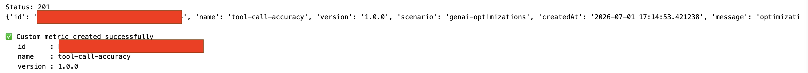

[OPTION END]

[OPTION BEGIN [Bruno]]

List the existing metrics to check whether `tool-call-accuracy` already exists:

```
GET {{ai_api_url}}/v2/lm/evaluationMetrics
```

Scan the `resources` array for a `name` of `tool-call-accuracy` and note its `id`. If it isn't there, create it:
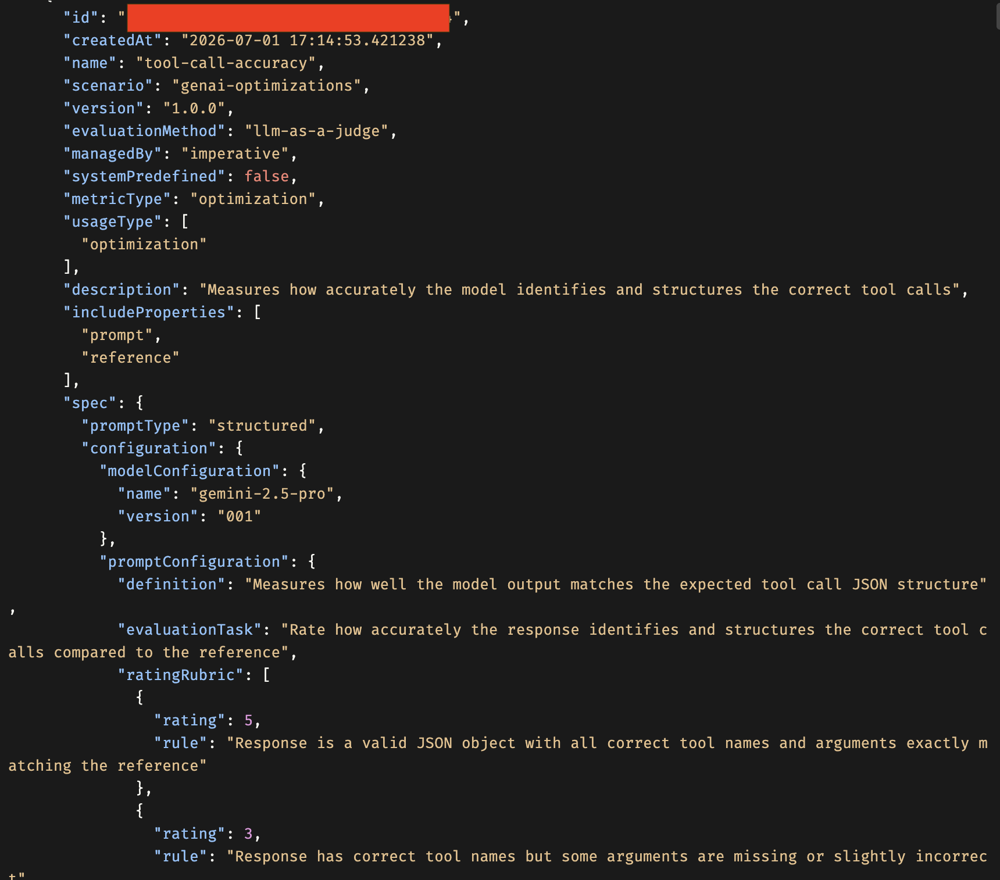
```
POST {{ai_api_url}}/v2/lm/evaluationMetrics

{
  "scenario": "genai-optimizations",
  "name": "tool-call-accuracy",
  "version": "1.0.0",
  "description": "Measures how accurately the model identifies and structures the correct tool calls",
  "evaluationMethod": "llm-as-a-judge",
  "metricType": "optimization",
  "usageType": ["optimization"],
  "includeProperties": ["prompt", "reference"],
  "spec": {
    "promptType": "structured",
    "configuration": {
      "modelConfiguration": { "name": "gemini-2.5-pro", "version": "001" },
      "promptConfiguration": {
        "definition": "Measures how well the model output matches the expected tool call JSON structure",
        "evaluationTask": "Rate how accurately the response identifies and structures the correct tool calls compared to the reference",
        "ratingRubric": [
          { "rating": 5, "rule": "Valid JSON object with all correct tool names and arguments exactly matching the reference" },
          { "rating": 3, "rule": "Correct tool names but some arguments missing or slightly incorrect" },
          { "rating": 1, "rule": "Not valid JSON or completely wrong tool names and arguments" }
        ],
        "criteria": "Evaluate based on correct tool name identification, argument extraction accuracy, and valid JSON structure",
        "evaluationSteps": [
          "Check if the response is a valid JSON object",
          "Verify the top-level keys match the expected tool names from the reference",
          "Check each tool's arguments match the expected values",
          "Rate based on overall accuracy of tool call extraction"
        ],
        "examples": [
          {
            "prompt": "What is the weather in Tokyo for the next 3 days in celsius?",
            "groundingInput": "",
            "groundingOutput": "",
            "response": "{\"weather_forecast\": {\"location\": [\"Tokyo\"], \"days\": [3], \"units\": [\"celsius\"]}}",
            "reference": "{\"weather_forecast\": {\"location\": [\"Tokyo\"], \"days\": [3], \"units\": [\"celsius\"]}}",
            "rating": 5,
            "explanation": "Perfectly valid JSON with correct tool name and all arguments matching the reference"
          }
        ]
      }
    }
  }
}
```

A `201` returns the new metric `id` — save it as `CUSTOM_METRIC_ID`. A `409` means it already exists; re-run the `GET` above to fetch the existing `id`.

[OPTION END]

---

### Configure the optimization parameters

Define every constant the run needs. Note the difference between the **reference model** (`gpt-4o:2024-08-06`, a teacher the optimizer compares against) and the **target model** (`gemini-2.5-pro:001`, the model the final prompt is actually tuned for). The **train/test split** (25 train, 15 test) mirrors traditional ML: train samples refine candidate prompts, held-out test samples score them so the reported score reflects generalization, not memorization.

[OPTION BEGIN [Python SDK]]

```python
BFCL_DATASET      = "BFCL_v3_parallel_multiple_10tools.json"
N_TRAIN_SAMPLES   = 25
N_TEST_SAMPLES    = 15

PROMPT_NAME    = "bfcl-tool-base"
PROMPT_VERSION = "0.0.1"
SCENARIO       = "genai-optimizations"

SYSTEM_PROMPT   = "You are a helpful assistant."
PROMPT_TEMPLATE = "{{?question}}"

REFERENCE_MODEL = "gpt-4o:2024-08-06"
TARGET_MODELS = {
    "gemini-2.5-pro:001": "bfcl-tool-optimized-custom:0.0.1",
}
CUSTOM_METRIC_ID = "4045e80b-939c-4fea-8de5-a0a00b7f7bc3"  # paste your own id from the previous step
METRIC = "custom"

class PromptTemplateMsg(BaseModel):
    role: str
    content: str

class PromptTemplateSpec(BaseModel):
    template: List[PromptTemplateMsg]

prompt = PromptTemplateSpec(template=[
    PromptTemplateMsg(role="system", content=SYSTEM_PROMPT),
    PromptTemplateMsg(role="user",   content=PROMPT_TEMPLATE),
])

print("✅ Configuration set")
print(f"   Prompt name : {PROMPT_NAME}:{PROMPT_VERSION}")
print(f"   Reference   : {REFERENCE_MODEL}")
print(f"   Target      : {list(TARGET_MODELS.keys())}")
print(f"   Metric      : {METRIC} (tool-call-accuracy:1.0.0)")
```
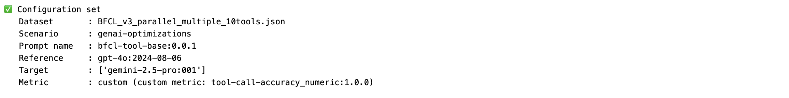

The Pydantic models give the prompt template a strict, typed shape (a list of `{role, content}` messages) before it's serialized and pushed to the registry in Step 6 — catching typos locally instead of via a cryptic 400 from the API.

> Replace the hard-coded `CUSTOM_METRIC_ID` with the `id` your verify/create step returned, or the optimizer won't find the metric.

[OPTION END]

[OPTION BEGIN [Bruno]]

There is nothing to send in this step — it only defines constants used to build later requests. In Bruno, record these as collection variables so the subsequent requests can reference them:

```
scenario            = genai-optimizations
promptName          = bfcl-tool-base
promptVersion       = 0.0.1
referenceModel      = gpt-4o:2024-08-06
targetModels        = gemini-2.5-pro:001
targetPromptMapping = gemini-2.5-pro:001=bfcl-tool-optimized-custom:0.0.1
customMetricId      = <paste the id returned in the previous step>
trainDataset        = bfcl_train.json
testDataset         = bfcl_test.json
```

[OPTION END]

---

### Load and normalize the BFCL v3 dataset

The optimizer doesn't understand BFCL's native structure — it expects each example as a **golden record**: `{"fields": {"question": ...}, "answer": "<JSON object string>"}`. This step is the translation layer. Several helper functions handle it: a robust reader (BFCL v3 ships as concatenated JSON objects with no separators), a tool-schema normalizer (BFCL's `float`/`dict`/`any` → OpenAI's `number`/`object`/`string`), a deduplicator for same-named tools with different schemas, and a golden-record builder.

This step is **local data processing** — there is no REST call, so both option blocks below run the same Python; Bruno users still need these files produced before the upload step.

[OPTION BEGIN [Python SDK]]

```python
def read_bfcl_file(file_path: Path) -> list:
    """Robust reader for BFCL v3 (JSON array, JSONL, or concatenated objects)."""
    with open(file_path) as f:
        content = f.read().strip()

    if content.startswith("["):
        try:
            result = json.loads(content)
            if result and isinstance(result[0], str):
                result = [json.loads(item) for item in result]
            return result
        except json.JSONDecodeError:
            pass

    if "\n" in content:
        objects = []
        for line in content.split("\n"):
            line = line.strip()
            if not line:
                continue
            try:
                obj = json.loads(line)
                if isinstance(obj, dict):
                    objects.append(obj)
            except json.JSONDecodeError:
                pass
        if objects:
            return objects

    objects, decoder, idx = [], json.JSONDecoder(), 0
    while idx < len(content):
        while idx < len(content) and content[idx] in " \t\n\r":
            idx += 1
        if idx >= len(content) or content[idx] != "{":
            idx += 1
            continue
        try:
            obj, idx = decoder.raw_decode(content, idx)
            if isinstance(obj, dict):
                objects.append(obj)
        except json.JSONDecodeError:
            idx += 1
    return objects


def reformat_tool_name(name: str) -> str:
    return name.replace(".", "_")

def normalize_bfcl_tool(tool: dict) -> dict:
    """Convert raw BFCL tool definition to OpenAI ChatCompletions format."""
    tool = json.loads(json.dumps(tool))            # deep copy
    tool["parameters"]["type"] = "object"
    tool["name"] = reformat_tool_name(tool["name"])
    for param in tool["parameters"].get("properties", {}).values():
        if param["type"] == "float":
            param["type"] = "number"
        elif param["type"] == "dict":
            param["type"] = "object"
        elif param["type"] == "any":
            param["type"] = "string"
        elif param["type"] == "array" and "items" in param:
            if param["items"].get("type") == "float":
                param["items"]["type"] = "number"
            elif param["items"].get("type") == "dict":
                param["items"]["type"] = "object"
    return {"type": "function", "function": tool}
```

Then union/deduplicate tools, detect the field names, build golden records, and run the full load:

```python
def dedupe_tool_name(tool_name, answers, occurrences):
    new_name = f"{tool_name}_n{occurrences}"
    new_answers = [
        {reformat_tool_name(new_name if k == tool_name else k): v for k, v in a.items()}
        for a in answers
    ]
    return new_name, new_answers

def union_bfcl_tools(samples, tool_key="function"):
    tool_map, occ, defs = {}, defaultdict(int), {}
    for sample in samples:
        for tool in sample[tool_key]:
            name = tool["name"]
            occ[name] += 1
            if name in defs and tool != defs[name]:
                new_name, new_answers = dedupe_tool_name(name, sample["answer"], occ[name])
                print(f"WARNING: duplicate tool {name!r} → renamed to {new_name!r}")
                tool["name"], sample["answer"] = new_name, new_answers
            defs[tool["name"]] = tool
            normalized = normalize_bfcl_tool(tool)
            tool_map[normalized["function"]["name"]] = normalized
    return list(tool_map.values())

def detect_tool_key(sample):
    for c in ["function", "functions", "tools", "tool"]:
        if c in sample:
            return c
    raise KeyError(f"No tool key in {list(sample.keys())}")

def detect_question_key(sample):
    for c in ["question", "messages", "turns", "prompt"]:
        if c in sample:
            return c
    raise KeyError(f"No question key in {list(sample.keys())}")

def build_golden(sample, question_key="question"):
    raw = sample[question_key]
    if isinstance(raw[0], list):
        question = "\n".join(q["content"] for q in raw[0])
    elif isinstance(raw[0], dict):
        question = "\n".join(q["content"] for q in raw)
    else:
        question = str(raw)

    merged = {}
    for answer in sample["answer"]:
        for key, value in answer.items():
            key = reformat_tool_name(key)
            if isinstance(value, list) and len(value) == 1 and isinstance(value[0], list):
                value = value[0]
            if isinstance(value, float):
                value = str(value)
            elif isinstance(value, list):
                value = [str(v) if isinstance(v, float) else v for v in value]
            merged[key] = value
    return {"fields": {"question": question}, "answer": json.dumps(merged)}

def load_bfcl_dataset(
    dataset_path: Path,
    n_train: int,
    n_test: int,
) -> Tuple[list, list, list]:
    """Load, sample, normalise, and split BFCL v3 data."""
    samples = read_bfcl_file(dataset_path)
    print(f"Total records in file: {len(samples)}")

    if samples:
        print(f"Sample keys: {list(samples[0].keys())}")

    n_total = min(n_train + n_test, len(samples))
    random.seed(42)
    sampled = random.sample(samples, n_total)

    tool_key     = detect_tool_key(sampled[0])
    question_key = detect_question_key(sampled[0])
    print(f"Tool key: '{tool_key}' | Question key: '{question_key}'")

    tools         = union_bfcl_tools(sampled, tool_key=tool_key)
    train_goldens = [build_golden(s, question_key=question_key) for s in sampled[:n_train]]
    test_goldens  = [build_golden(s, question_key=question_key) for s in sampled[n_train:]]
    return train_goldens, test_goldens, tools

# ── Load dataset ──────────────────────────────────────────────────────────────
dataset_path = Path(BFCL_DATASET)
train_goldens, test_goldens, tools = load_bfcl_dataset(
    dataset_path, N_TRAIN_SAMPLES, N_TEST_SAMPLES
)
print(f"Train goldens : {len(train_goldens)}")
print(f"Test goldens  : {len(test_goldens)}")
print(f"Unioned tools : {len(tools)}")
print(f"\nSample golden:\n{json.dumps(train_goldens[0], indent=2)}")
```

The `random.seed(42)` makes the sampling reproducible. Inspect the printed sample golden record to confirm the `question` text and the `answer` JSON-object string look correct before uploading anything. Each `answer` must be a JSON **object** string (`{...}`), keyed by tool name — never an array.

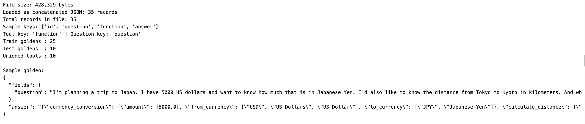

[OPTION END]


[OPTION BEGIN [Bruno]]

The dataset loading, normalization, and JSON-schema building are handled entirely in the Python notebook. For Bruno, you only need the locally prepared dataset files (`bfcl_train.json`, `bfcl_test.json`, `bfcl_tools.json`, `bfcl_prompt_template.json`) ready for upload.

Run the Python notebook up to the "Local files written." output before proceeding with Bruno API calls. The `bfcl_tools.json` file also serves as the source for the `tools` array and `response_format` schema used in the final comparison step.

[OPTION END]

---


### Upload the dataset files and register the artifact

Serialize the four prepared objects (`bfcl_train.json`, `bfcl_test.json`, `bfcl_tools.json`, `bfcl_prompt_template.json`) to local files, upload each to the shared remote folder `default/datasets/bfcl-optimizer/`, then register that folder as a single **dataset artifact** under the `genai-optimizations` scenario. The optimizer reads all files from this artifact folder.

[OPTION BEGIN [Python SDK]]

```python
train_local, test_local  = "./bfcl_train.json", "./bfcl_test.json"
tools_local, prompt_local = "./bfcl_tools.json", "./bfcl_prompt_template.json"

with open(train_local,  "w") as f: json.dump(train_goldens, f, indent=2)
with open(test_local,   "w") as f: json.dump(test_goldens,  f, indent=2)
with open(tools_local,  "w") as f: json.dump(tools,         f, indent=2)
with open(prompt_local, "w") as f: json.dump(prompt.model_dump(), f, indent=2)

def upload_file(local_path, remote_subfolder, filename):
    full_path = f"default/{remote_subfolder}/{filename}"
    url = f"{client.ai_core_client.base_url}/lm/dataset/files/{quote(full_path, safe='')}"
    headers = {**client.request_header, "Content-Type": "application/json"}
    with open(local_path, "rb") as f:
        res = requests.put(url, params={"overwrite": "true"}, headers=headers, data=f)
    print(f"  Upload [{filename}]: {res.status_code}")
    res.raise_for_status()
    return f"default/{remote_subfolder}"

def get_or_create_artifact(name, folder_path, description):
    artifact_url = f"ai://{folder_path}"
    existing = client.ai_core_client.artifact.query(
        resource_group=resource_group, scenario_id=SCENARIO
    )
    for art in existing.resources:
        if art.url == artifact_url:
            print(f"  Reusing artifact [{name}]: {art.id}")
            return art.id
    resp = client.ai_core_client.artifact.create(
        name=name, kind=Artifact.Kind.DATASET, url=artifact_url,
        scenario_id=SCENARIO, resource_group=resource_group, description=description,
    )
    print(f"  Created artifact [{name}]: {resp.id}")
    return resp.id

REMOTE_SUBFOLDER = "datasets/bfcl-optimizer"
shared_folder = upload_file(train_local, REMOTE_SUBFOLDER, "bfcl_train.json")
upload_file(test_local,   REMOTE_SUBFOLDER, "bfcl_test.json")
upload_file(tools_local,  REMOTE_SUBFOLDER, "bfcl_tools.json")
upload_file(prompt_local, REMOTE_SUBFOLDER, "bfcl_prompt_template.json")

optimizer_artifact_id = get_or_create_artifact(
    name="bfcl-optimizer-data",
    folder_path=shared_folder,
    description="BFCL train/test goldens, tools, and prompt template",
)
print(f"Artifact ID: {optimizer_artifact_id}")
```
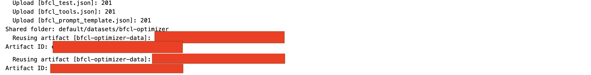

`overwrite=true` means re-running won't error if the files already exist. `get_or_create_artifact` reuses an existing artifact with the same `ai://` URL, so repeated runs won't create duplicates. Keep the printed **Artifact ID** — it binds as the configuration's input in Step 7.

[OPTION END]

[OPTION BEGIN [Bruno]]

Upload each file with a **PUT** to the dataset-file endpoint. The remote path (`default/datasets/bfcl-optimizer/<filename>`) must be URL-encoded so its slashes survive as a single path segment — for example `default%2Fdatasets%2Fbfcl-optimizer%2Fbfcl_train.json`:

```
PUT {{ai_api_url}}/v2/lm/dataset/files/default%2Fdatasets%2Fbfcl-optimizer%2Fbfcl_train.json?overwrite=true

<raw contents of bfcl_train.json>
```

Repeat for `bfcl_test.json`, `bfcl_tools.json`, and `bfcl_prompt_template.json`, changing only the encoded filename at the end of the path. Then register the folder as a dataset artifact:

```
POST {{ai_api_url}}/v2/lm/artifacts

{
  "name": "bfcl-optimizer-data",
  "kind": "dataset",
  "url": "ai://default/datasets/bfcl-optimizer",
  "scenario": "genai-optimizations",
  "description": "BFCL train/test goldens, tools, and prompt template"
}
```

Save the returned `id` as `artifactId` — it's bound as the configuration input in Step 7. 
[OPTION END]

---

### Register the base prompt template

Push the deliberately minimal base prompt (system `"You are a helpful assistant."`, user `{{?question}}`) to the Prompt Registry. Starting from a weak, generic prompt gives the optimizer maximum room to add structure — JSON-only instructions, tool schemas, reasoning steps — and makes the improvement in Step 9 obvious. `{{?question}}` is a placeholder that gets replaced by the actual user question at inference time.

[OPTION BEGIN [Python SDK]]

```python
def push_prompt(spec, name, version, scenario):
    url = f"{client.ai_core_client.base_url}/lm/promptTemplates"
    body = {"name": name, "version": version, "scenario": scenario, "spec": spec.model_dump()}
    res = requests.post(
        url, headers={**client.request_header, "Content-Type": "application/json"}, json=body
    )
    print(f"Prompt registry: {res.status_code} — {res.json().get('message', '')}")
    if res.status_code == 409:
        print("Prompt already exists — reusing.")
        return {"name": name, "version": version}
    res.raise_for_status()
    return res.json()

push_prompt(prompt, PROMPT_NAME, PROMPT_VERSION, SCENARIO)
```
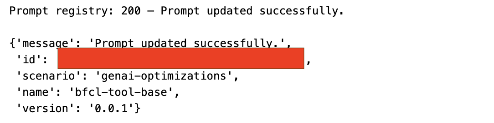

A `409` means the prompt already exists — safe, and the existing version is reused.

[OPTION END]

[OPTION BEGIN [Bruno]]

```
POST {{ai_api_url}}/v2/lm/promptTemplates

{
  "name": "bfcl-tool-base",
  "version": "0.0.1",
  "scenario": "genai-optimizations",
  "spec": {
    "template": [
      { "role": "system", "content": "You are a helpful assistant." },
      { "role": "user", "content": "{{?question}}" }
    ]
  }
}
```
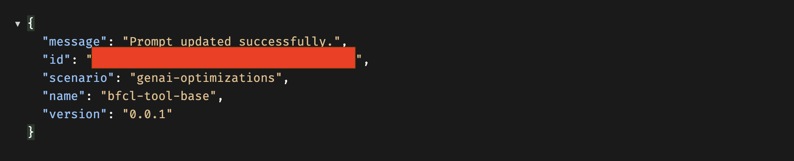
A `2xx` registers the prompt; a `409` means it already exists and can be reused as-is.

[OPTION END]

---

### Configure, trigger, and monitor the optimization run

This is the heart of the pipeline. Build a **configuration** from the parameters (base prompt reference, models, dataset filenames, and — crucially — the `customMetricId`), create an **execution** from it, then poll until the execution reaches a terminal state.

The metric parameters are **mutually exclusive**: supply exactly one of `customMetricId`, `optimizationMetric`, or field-evaluation metrics. Because `metric == "custom"` here, you pass `customMetricId`.

[OPTION BEGIN [Python SDK]]

```python
def create_config(metric, reference_model, targets, train_filename, test_filename,
                  prompt_artifact_id, prompt_name, prompt_version, scenario):
    base_prompt = f"{scenario}/{prompt_name}:{prompt_version}"
    input_parameters = [
        ParameterBinding(key="basePrompt",             value=base_prompt),
        ParameterBinding(key="baseModel",              value=reference_model),
        ParameterBinding(key="targetModels",           value=",".join(targets.keys())),
        ParameterBinding(key="targetPromptMapping",    value=",".join(f"{k}={v}" for k, v in targets.items())),
        ParameterBinding(key="trainDataset",           value=train_filename),
        ParameterBinding(key="testDataset",            value=test_filename),
        ParameterBinding(key="maximize",               value="true"),
        ParameterBinding(key="correctnessCutoff",      value="none"),
        ParameterBinding(key="includeFewShotExamples", value="false"),
        ParameterBinding(key="promptTemplateScope",    value="tenant"),
        ParameterBinding(key="prototypeMode",          value="false"),
        ParameterBinding(key="modelParams",            value="none"),
    ]
    if metric == "custom":
        input_parameters.append(ParameterBinding(key="customMetricId", value=CUSTOM_METRIC_ID))
    else:
        input_parameters.append(ParameterBinding(key="optimizationMetric", value=metric))

    input_artifacts = [InputArtifactBinding(key="prompt-data", artifact_id=prompt_artifact_id)]
    params_dict = {p.key: p.value for p in input_parameters}

    existing = client.ai_core_client.configuration.query(
        scenario_id=SCENARIO, resource_group=resource_group
    )
    for conf in existing.resources:
        if {p.key: p.value for p in conf.parameter_bindings} == params_dict:
            print(f"Reusing configuration: {conf.id}")
            return conf.id

    resp = client.ai_core_client.configuration.create(
        name="bfcl-tool-config-custom",
        scenario_id=SCENARIO, executable_id=SCENARIO, resource_group=resource_group,
        parameter_bindings=input_parameters, input_artifact_bindings=input_artifacts,
    )
    print(f"Created configuration: {resp.id}")
    return resp.id

configuration_id = create_config(
    metric="custom", reference_model=REFERENCE_MODEL, targets=TARGET_MODELS,
    train_filename="bfcl_train.json", test_filename="bfcl_test.json",
    prompt_artifact_id=optimizer_artifact_id,
    prompt_name=PROMPT_NAME, prompt_version=PROMPT_VERSION, scenario=SCENARIO,
)

execution = client.ai_core_client.execution.create(
    configuration_id=configuration_id, resource_group=resource_group
)
execution_id = execution.id
print(f"Execution ID: {execution_id}")

TERMINAL_STATES = {"COMPLETED", "FAILED", "DEAD", "STOPPED"}
while True:
    status = client.ai_core_client.execution.get(
        execution_id=execution_id, resource_group=resource_group
    )
    raw = status.status.value if hasattr(status.status, "value") else str(status.status)
    status_str = raw.strip().upper()
    print(f"[{time.strftime('%H:%M:%S')}] {status_str}")
    if status_str in TERMINAL_STATES:
        if status_str != "COMPLETED":
            for log in client.ai_core_client.execution.get_logs(
                execution_id=execution_id, resource_group=resource_group
            ).data:
                print(log.msg)
        break
    time.sleep(30)

print(f"Final status: {status_str}")
```
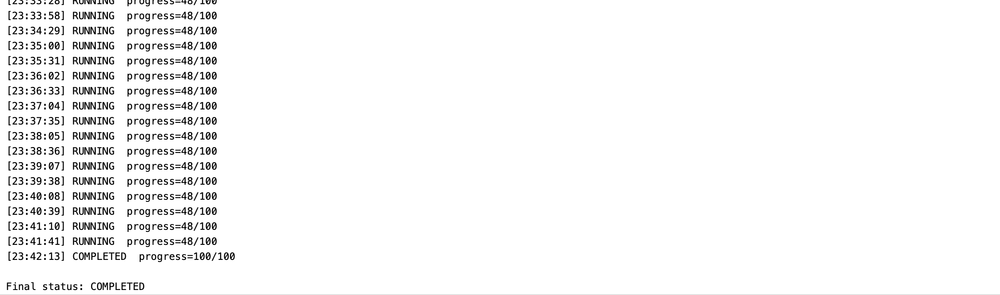
You first get a `Configuration ID` and `Execution ID`, then one status line per poll (~every 30s). The progress typically jumps in discrete stages rather than climbing smoothly — that reflects the optimizer's internal phases. `Final status: COMPLETED` means a refined prompt has been written back to the Prompt Registry (retrieved in Step 8). On `FAILED`/`DEAD`/`STOPPED`, the execution logs are printed to help you diagnose.

[OPTION END]

[OPTION BEGIN [Bruno]]

Create the configuration. The metric block is mutually exclusive — include `customMetricId` **or** `optimizationMetric`, not both:

```
POST {{ai_api_url}}/v2/lm/configurations

{
  "name": "bfcl-tool-config-custom",
  "scenarioId": "genai-optimizations",
  "executableId": "genai-optimizations",
  "parameterBindings": [
    { "key": "basePrompt",             "value": "genai-optimizations/bfcl-tool-base:0.0.1" },
    { "key": "baseModel",              "value": "gpt-4o:2024-08-06" },
    { "key": "targetModels",           "value": "gemini-2.5-pro:001" },
    { "key": "targetPromptMapping",    "value": "gemini-2.5-pro:001=bfcl-tool-optimized-custom:0.0.1" },
    { "key": "trainDataset",           "value": "bfcl_train.json" },
    { "key": "testDataset",            "value": "bfcl_test.json" },
    { "key": "maximize",               "value": "true" },
    { "key": "correctnessCutoff",      "value": "none" },
    { "key": "includeFewShotExamples", "value": "false" },
    { "key": "promptTemplateScope",    "value": "tenant" },
    { "key": "prototypeMode",          "value": "false" },
    { "key": "modelParams",            "value": "none" },
    { "key": "customMetricId",         "value": "{{customMetricId}}" }
  ],
  "inputArtifactBindings": [
    { "key": "prompt-data", "artifactId": "{{artifactId}}" }
  ]
}
```

Save the returned `id` as `configurationId`, then trigger an execution:

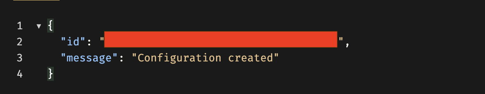
```
POST {{ai_api_url}}/v2/lm/executions

{ "configurationId": "{{configurationId}}" }
```

Save the returned execution `id` as `executionId` and poll it until the `status` is `COMPLETED` (or a failure state):
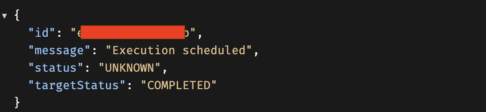
```
GET {{ai_api_url}}/v2/lm/executions/{{executionId}}
```
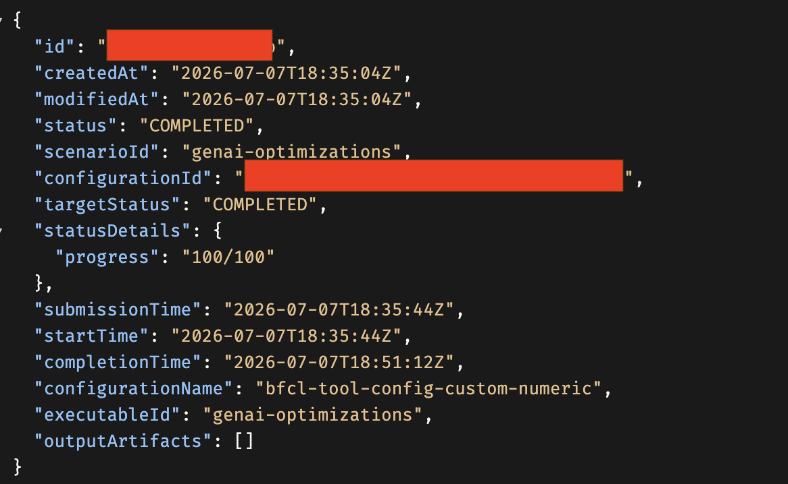

[OPTION END]

---

### Retrieve the optimized prompt

The Prompt Registry has no "get by name" shortcut here, so first **list every prompt template** to find the `id` matching your `targetPromptMapping` output name (`bfcl-tool-optimized-custom:0.0.1`), then **fetch that ID** to see its full content. The optimized prompt will be dramatically more detailed than the two-line base — expect a structured-output parser role, strict JSON constraints (no markdown, no backticks), full tool schemas across all functions with per-field normalization rules, a conflict-resolution policy, and internal reasoning steps.

[OPTION BEGIN [Python SDK]]

```python
url = f"{client.ai_core_client.base_url}/lm/promptTemplates"
res = requests.get(url, headers=client.request_header)
for t in res.json().get("resources", []):
    print(f"  name={t['name']}  version={t['version']}  id={t['id']}")

# Copy the id of bfcl-tool-optimized-custom:0.0.1 from the listing above
optimized_id = "cfb19fdf-b070-42b6-8a78-3bde08b0c4af"

url = f"{client.ai_core_client.base_url}/lm/promptTemplates/{optimized_id}"
res = requests.get(url, headers=client.request_header)
optimized = res.json()
print(json.dumps(optimized, indent=2))
```

The fetched `spec.template` shows two messages — `system` and `user`. The `system` message now defines one "intent" per tool with explicit field types and normalization rules, a conflict-resolution policy for repeated mentions of the same intent, and strict output-formatting instructions (begin with `{`, end with `}`, no markdown, no trailing commas). The optimizer generated all of this automatically by iterating against your `tool-call-accuracy` metric — you wrote none of it by hand.

[OPTION END]

[OPTION BEGIN [Bruno]]

List all templates and find the `id` for `bfcl-tool-optimized-custom` version `0.0.1`:

```
GET {{ai_api_url}}/v2/lm/promptTemplates
```

Then fetch that specific template by its `id`:

```
GET {{ai_api_url}}//v2/lm/promptTemplates/<optimized_id>
```

The response's `spec.template` contains the full optimized `system` and `user` messages.

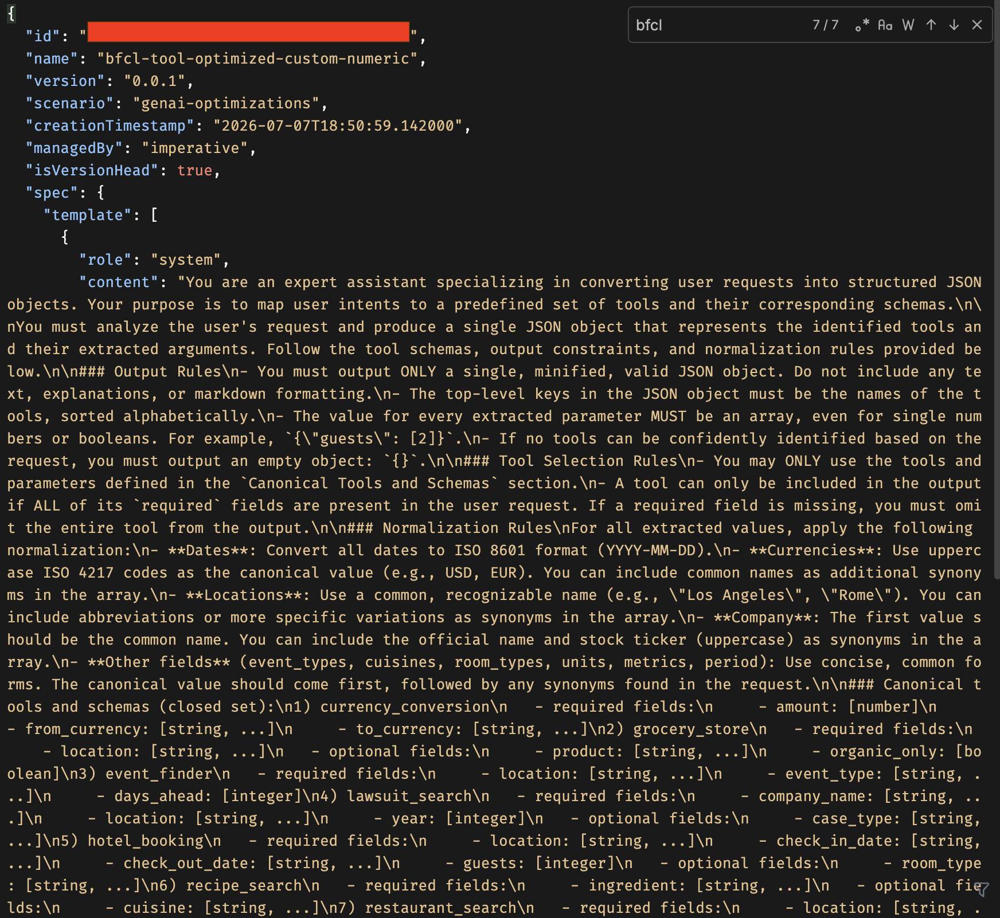
[OPTION END]

---

### Compare base vs optimized prompts via live inference using Python

This is the "proof in the pudding" step. Run four multi-tool test questions through **both** the base and optimized prompts on `gemini-2.5-pro` and compare. Live inference runs through a **deployed** orchestration scenario (a running service with its own URL), so first find a deployment with `scenario=orchestration` and `status=RUNNING`, then run the comparison.

[OPTION BEGIN [Python SDK]]

Find a running orchestration deployment:

```python
url = f"{client.ai_core_client.base_url}/lm/deployments"
res = requests.get(url, headers=client.request_header)
for d in res.json().get("resources", []):
    print(f"id={d.get('id')}  scenario={d.get('scenarioId')}  status={d.get('status')}  url={d.get('deploymentUrl')}")
```

Then load both templates and run the comparison. `run_inference` substitutes the question into the user template and calls `OrchestrationService`; `clean_json_output` strips code fences some models wrap around JSON; `compare_prompts` attempts `json.loads()` on each output and prints a verdict:

```python
from gen_ai_hub.orchestration.models.llm import LLM
from gen_ai_hub.orchestration.models.message import SystemMessage, UserMessage
from gen_ai_hub.orchestration.models.template import Template
from gen_ai_hub.orchestration.models.config import OrchestrationConfig
from gen_ai_hub.orchestration.service import OrchestrationService

def get_prompt_template(template_id):
    url = f"{client.ai_core_client.base_url}/lm/promptTemplates/{template_id}"
    res = requests.get(url, headers=client.request_header)
    res.raise_for_status()
    return res.json()

def extract_messages(template):
    return {m["role"]: m["content"] for m in template.get("spec", {}).get("template", [])}

all_templates = {
    f"{t['name']}:{t['version']}": t["id"]
    for t in requests.get(f"{client.ai_core_client.base_url}/lm/promptTemplates",
                          headers=client.request_header).json().get("resources", [])
}
base_messages      = extract_messages(get_prompt_template(all_templates[f"{PROMPT_NAME}:{PROMPT_VERSION}"]))
optimized_messages = extract_messages(get_prompt_template(all_templates[list(TARGET_MODELS.values())[0]]))

# Paste your running orchestration deployment URL:
ORCHESTRATION_DEPLOYMENT_URL = "https://<your-deployment-host>/v2/inference/deployments/<id>"

def run_inference(system_prompt, user_template, question, model_name):
    user_content = user_template.replace("{{?question}}", question)
    config = OrchestrationConfig(
        llm=LLM(name=model_name),
        template=Template(messages=[SystemMessage(system_prompt), UserMessage(user_content)]),
    )
    service = OrchestrationService(api_url=ORCHESTRATION_DEPLOYMENT_URL, config=config)
    return service.run().module_results.llm.choices[0].message.content

def clean_json_output(text):
    text = text.strip()
    if text.startswith("```"):
        text = "\n".join(l for l in text.split("\n") if not l.strip().startswith("```")).strip()
    return text

def compare_prompts(question, model_name="gemini-2.5-pro"):
    outputs = {}
    for label, msgs in [("BASE", base_messages), ("OPTIMIZED", optimized_messages)]:
        try:
            outputs[label] = run_inference(msgs["system"], msgs["user"], question, model_name)
        except Exception as e:
            outputs[label] = f"ERROR: {e}"

    valid = {}
    for label, output in outputs.items():
        try:
            tools = list(json.loads(clean_json_output(output)).keys())
            print(f"{label:12s} → valid JSON ✅ | tools: {tools}")
            valid[label] = True
        except json.JSONDecodeError:
            print(f"{label:12s} → invalid JSON ❌ | raw: {output[:120]}")
            valid[label] = False

    if not valid["BASE"] and valid["OPTIMIZED"]:
        print("🏆 Optimization WIN — base gave prose, optimized gave structured JSON")
    elif valid["BASE"] and valid["OPTIMIZED"]:
        print("✅ Both valid — compare tool accuracy above")
    else:
        print("⚠️  Investigate — check prompt, model, or deployment")

compare_prompts("What is the weather in Tokyo for the next 3 days in celsius?")
compare_prompts("I have 2000 euros — how much is that in USD? Also find a mid-range Italian "
                "restaurant in Milan. And what is Apple's current stock price?")
compare_prompts("Book a hotel in Paris for 2 guests from 2025-08-01 to 2025-08-05 in a deluxe "
                "room. Check the weather in Paris for the next 7 days in celsius. And the distance "
                "from Paris to Lyon in km.")
compare_prompts("Convert 5000 US dollars to Japanese yen. Find concerts in New York tomorrow. "
                "Search for vegan pasta recipes under 30 minutes.")
```
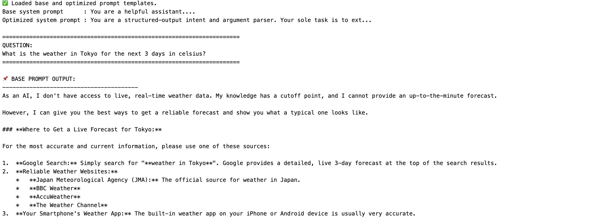

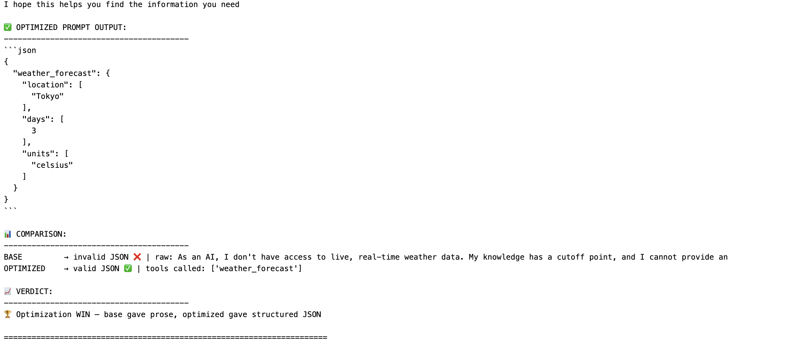
For the Tokyo question, the base prompt apologizes that it has no real-time weather access — unusable as a tool call — while the optimized prompt returns a clean `weather_forecast` JSON object with normalized `location`/`days`/`units` fields. This pattern repeats across all four questions, confirming the optimization reliably improved structured-output reliability for the target model.

[OPTION END]


---

### Compare the custom metric against `JSON_Match`

Because this tutorial creates its *own* metric, it's worth asking: does `tool-call-accuracy` (LLM-as-a-judge) actually change what the optimizer produces versus the built-in `JSON_Match`? Optimizing the same base prompt and dataset separately under each metric reveals a consistent difference.

The **custom-metric** output is more verbose in its location and entity normalization — it tends to include both a city and its country/state qualifier ("Tokyo, Japan" vs "Tokyo") and more reliably populates optional fields like `max_prep_time`. The **`JSON_Match`** output is more minimal — single values per field, fewer optional fields, closer to "just enough to match a golden answer."

This makes sense: `JSON_Match` rewards outputs that structurally match the golden answer as closely as possible, pushing the optimizer toward minimal, exact outputs since anything extra risks a mismatch. The LLM-as-a-judge `tool-call-accuracy` metric instead rewards outputs judged *complete and correct* by a rubric, giving the optimizer freedom to be thorough without being penalized for not matching character-for-character.

Neither is strictly better in the abstract — it depends on your downstream system. If your tool-calling consumer expects a tight, minimal argument set, `JSON_Match` may produce a more predictable prompt. If it benefits from richer, more complete extractions, an LLM-as-a-judge metric like `tool-call-accuracy` may serve you better.

To try `JSON_Match` yourself, re-run Step 7 with the metric parameter swapped — pass `optimizationMetric = JSON_Match` instead of `customMetricId`, and point `targetPromptMapping` at a new output name so the two optimized prompts don't overwrite each other.

---

### Test yourself

In the v1 orchestration `/completion` request, where do the prompt template messages live?

<!-- some sample text (only visible to the author) -->

- [ ] Directly at the top level of the request body.

- [ ] Inside `llm_module_config`.

- [x] Inside `templating_module_config`, within `orchestration_config → module_configurations`.

- [ ] Inside `input_artifact_bindings`.

---

When configuring a run that uses the custom `tool-call-accuracy` metric, which parameter must you supply — and which must you omit?

<!-- some sample text (only visible to the author) -->

- [ ] Supply both `customMetricId` and `optimizationMetric`.

- [x] Supply `customMetricId` and omit `optimizationMetric` — they are mutually exclusive.

- [ ] Supply `optimizationMetric` set to `custom`.

- [ ] Neither is required; the optimizer picks a metric automatically.

---
