# Prompt Optimization with Tool Calling and Response Formatting
<!-- description --> This tutorial demonstrates how to use Prompt Optimization in SAP AI Core for tool calling scenarios using a BFCL v3 dataset, and pairs it with SAP AI Core's **Response Formatting** feature so you can enforce structured output in two complementary ways. The process loads and normalizes a BFCL v3 parallel-multiple dataset, splits it into train and test sets, uploads all files to AI Core's built-in dataset storage, registers a dataset artifact, pushes a base prompt template to the Prompt Registry, and runs an optimization execution targeting Gemini 2.5 Pro with GPT-4o as the reference model using the `JSON_Match` metric. Alongside the optimizer, it introduces the Orchestration Service `response_format` parameter (`text`, `json_object`, `json_schema`) — an API-level way to guarantee valid JSON independent of prompt wording — and builds a JSON Schema from the unioned tool definitions. After completion, the optimized prompt is retrieved and compared against the base prompt through live inference, both with and without a `response_format` schema attached.

## You will learn
- How to load and normalize BFCL v3 parallel-multiple data into the SAP optimizer golden format.
- How Response Formatting works (`text`, `json_object`, `json_schema`) and how it complements prompt optimization.
- How to build a `json_schema` `response_format` from the unioned BFCL tool definitions.
- How to upload train, test, tools, and prompt template files to AI Core dataset storage.
- How to register a dataset artifact linking the uploaded folder to the `genai-optimizations` scenario.
- How to create and register a base prompt template in the Prompt Registry.
- How to configure and run prompt optimization via Python SDK and Bruno.
- How to monitor execution progress and retrieve the optimized prompt.
- How to compare base vs optimized prompt outputs through live inference, with and without a `response_format` schema.

## Prerequisites
1. **BTP Account**  
   Set up your SAP Business Technology Platform (BTP) account.  
   [Create a BTP Account](https://developers.sap.com/group.btp-setup.html)
2. **For SAP Developers or Employees**  
   Internal SAP stakeholders should refer to the following documentation: [How to create BTP Account For Internal SAP Employee](https://me.sap.com/notes/3493139), [SAP AI Core Internal Documentation](https://help.sap.com/docs/sap-ai-core)
3. **For External Developers, Customers, or Partners**  
   Follow this tutorial to set up your environment and entitlements: [External Developer Setup Tutorial](https://developers.sap.com/tutorials/btp-cockpit-entitlements.html), [SAP AI Core External Documentation](https://help.sap.com/docs/sap-ai-core?version=CLOUD)
4. **Create BTP Instance and Service Key for SAP AI Core**  
   Follow the steps to create an instance and generate a service key for SAP AI Core:  
   [Create Service Key and Instance](https://help.sap.com/docs/sap-ai-core/sap-ai-core-service-guide/create-service-key?version=CLOUD)
5. **AI Core Setup Guide**  
   Step-by-step guide to set up and get started with SAP AI Core:  
   [AI Core Setup Tutorial](https://developers.sap.com/tutorials/ai-core-setup.html)
6. An Extended SAP AI Core service plan is required, as the Generative AI Hub is not available in the Free or Standard tiers. For more details, refer to  
   [SAP AI Core Service Plans](https://help.sap.com/docs/sap-ai-core/sap-ai-core-service-guide/service-plans?version=CLOUD)
7. You have access to the `genai-optimizations` scenario and have the required roles such as `genai_manager` or `custom_evaluation`.
8. A BFCL v3 dataset file (e.g., `BFCL_v3_parallel_multiple_10tools.json`) is available locally.
9. A **running Orchestration Service deployment** in your resource group. Response Formatting and the live inference comparison are executed through the Orchestration `/completion` endpoint, so you need its deployment URL. See [Create a Deployment for Orchestration](https://help.sap.com/docs/sap-ai-core/sap-ai-core-service-guide/orchestration).

### Pre-Read
Before starting this tutorial, ensure that you:
- Understand the basics of Generative AI workflows in SAP AI Core.
- Are familiar with function calling / tool calling concepts in LLMs.
- Are familiar with creating and managing prompt templates and artifacts in SAP AI Core.
- Understand, at a high level, that there are two complementary ways to push a model toward structured output:
  - **Prompt optimization** — automate the trial-and-error of prompt engineering so the model's *reasoning* reliably produces the right structure.
  - **Response Formatting** — an Orchestration Service parameter that constrains the model's output at the *API level*, independent of prompt wording.
- Have completed the Quick Start tutorial or equivalent setup for SAP AI Core access.

### Architecture Overview

- Prompt Optimization for tool calling connects the Prompt Registry, AI Core Dataset Storage, and ML Tracking Service to form an end-to-end optimization workflow. Response Formatting sits on the Orchestration Service and is applied at inference time.
- A BFCL v3 dataset is loaded, normalized, and split into train and test sets. All four files (train goldens, test goldens, tool definitions, and prompt template) are uploaded to a shared folder in AI Core's built-in dataset storage.
- The shared folder is registered as a single artifact under the `genai-optimizations` scenario.
- The base prompt template is pushed to the Prompt Registry.
- An optimization configuration links the artifact, base prompt, reference model (`gpt-4o:2024-08-06`), target model (`gemini-2.5-pro:001`), and the `JSON_Match` metric.
- During execution, the optimizer iteratively refines the prompt. Metrics are tracked in the ML Tracking Service, and the optimized prompt is saved back to the Prompt Registry.
- Separately, a JSON Schema is built from the unioned tool definitions. At inference time it can be attached as a `response_format` to the Orchestration call to guarantee the wire format is valid JSON — regardless of prompt wording.
- After completion, the base and optimized prompts are fetched and compared via live inference, both with and without the `response_format` schema.


### Notebook Reference

For hands-on execution and end-to-end reference, use the accompanying notebook `Prompt_Optimization_With_Tool_Calling_And_Response_Formatting.ipynb`. It runs the entire pipeline top to bottom — from loading the BFCL dataset and uploading files, through configuration creation, execution, monitoring, and the inference comparison — and includes a Response Formatting primer right after the connection step.

💡 Run the cells **in order, top to bottom** — later cells depend on variables created earlier (`client`, `configuration_id`, `execution_id`, `tool_call_schema`, etc.). Configure your `.env` file and BFCL dataset path before executing.

**To use the notebook:**
- Download and open `Prompt_Optimization_With_Tool_Calling_And_Response_Formatting.ipynb` in your preferred environment (e.g., VS Code, JupyterLab).
- Place your BFCL v3 dataset file (e.g., `BFCL_v3_parallel_multiple_10tools.json`) in the same directory.
- Configure your `.env` file with your AI Core credentials.
- Execute the cells in order to reproduce the complete prompt optimization with tool calling and response formatting workflow.

---

### Environment Variables Setup

[OPTION BEGIN [Python SDK]]

- Open **Visual Studio Code or Jupyter Notebook**. Create a new file with the `.ipynb` extension (e.g., `Prompt_Optimization_With_Tool_Calling_And_Response_Formatting.ipynb`).
- Create a **`.env`** file in the root directory of your project.
- Add your **AI Core** credentials as shown below.

```env
# AICORE CREDENTIALS
AICORE_CLIENT_ID=<AICORE CLIENT ID>
AICORE_CLIENT_SECRET=<AICORE CLIENT SECRET>
AICORE_AUTH_URL=<AICORE AUTH URL>
AICORE_BASE_URL=<AICORE BASE URL>
AICORE_RESOURCE_GROUP=<AICORE RESOURCE GROUP>
```

**Note:** Replace placeholders (e.g., `CLIENT_ID`, `CLIENT_SECRET`, etc.) with your actual environment credentials. These values come from the **service key** of your AI Core service instance in the SAP BTP cockpit — the JSON service key contains `clientid`, `clientsecret`, the OAuth `url` (→ `AICORE_AUTH_URL`), and the API `serviceurls.AI_API_URL` (→ `AICORE_BASE_URL`). This tutorial uploads files directly to AI Core's built-in dataset storage — no S3 or external object store credentials are required.


#### Install Dependencies and Connect to AI Core

Install the required packages and initialize the AI Core client. Every later step re-uses this single `client` object (either directly, or via `client.ai_core_client.base_url` / `client.request_header` to build raw REST calls):

```python
from collections import defaultdict
from gen_ai_hub.proxy.gen_ai_hub_proxy import GenAIHubProxyClient
from dotenv import load_dotenv
import os
import json
import requests
import random
from urllib.parse import quote
from pathlib import Path
from typing import List, Tuple
import time
from ai_api_client_sdk.models.parameter_binding import ParameterBinding
from ai_api_client_sdk.models.input_artifact_binding import InputArtifactBinding
from pydantic import BaseModel
from ai_api_client_sdk.models.artifact import Artifact

load_dotenv(override=True)

# ── SAP AI Core client ────────────────────────────────────────────────────────
client = GenAIHubProxyClient(
    base_url=os.getenv("AICORE_BASE_URL"),
    auth_url=os.getenv("AICORE_AUTH_URL"),
    client_id=os.getenv("AICORE_CLIENT_ID"),
    client_secret=os.getenv("AICORE_CLIENT_SECRET"),
    resource_group=os.getenv("AICORE_RESOURCE_GROUP")
)
resource_group = client.request_header[
    client.ai_core_client.rest_client.resource_group_header
]

print("✅ Connected to AI Core")
print(f"   Resource group: {resource_group}")
```

`✅ Connected to AI Core` confirms the OAuth handshake succeeded and `client` is ready to use. The printed **resource group** is the namespace all subsequent artifacts, configurations, prompts, and executions will be created inside.

[OPTION END]

[OPTION BEGIN [Bruno]]

- Follow the steps in the [Tutorial](https://developers.sap.com/tutorials/ai-core-orchestration-consumption.html) to set up your Bruno environment, refer to the step **Set Up Your Environment and Configure Access** and proceed until generating the token.
- Ensure the following Bruno variables are configured:
  - `base_url` — your AI Core base URL (e.g., `https://<your-tenant>.ai.ml.hana.ondemand.com/v2`)
  - `access_token` — Bearer token obtained after authentication
  - `resource_group` — the resource group you are working in
  - `orchestration_url` — the deployment URL of your **running Orchestration Service deployment** (used later for Response Formatting and the inference comparison, e.g. `https://<your-tenant>.ai.ml.hana.ondemand.com/v2/inference/deployments/<deployment_id>`)

[OPTION END]

---

### Configure Optimization Parameters

Before running the pipeline, define the key configuration constants used throughout the notebook.

- The **reference model** (`REFERENCE_MODEL`, e.g. `gpt-4o:2024-08-06`) acts as a *teacher* the optimizer compares against while searching for a better prompt.
- The **target model(s)** (`TARGET_MODELS`) are the model(s) the final optimized prompt is actually tuned *for*.
- **Train samples** (`N_TRAIN_SAMPLES = 25`) are used to *generate and refine* candidate prompts; **test samples** (`N_TEST_SAMPLES = 15`) are held out and only used to *score* each candidate, so the reported score reflects genuine generalization.
- **`JSON_Match`** does a structural comparison between the candidate's JSON output and the golden answer — simpler to set up than a custom LLM-as-a-judge metric and well suited to exact structural correctness.

[OPTION BEGIN [Python SDK]]

```python
# ── Configuration ─────────────────────────────────────────────────────────────
BFCL_DATASET      = "BFCL_v3_parallel_multiple_10tools.json"
BFCL_DATASET_MODE = "parallel_multiple"
N_TRAIN_SAMPLES   = 25
N_TEST_SAMPLES    = 15

PROMPT_NAME    = "bfcl-tool-base"
PROMPT_VERSION = "0.0.1"
SCENARIO       = "genai-optimizations"

SYSTEM_PROMPT   = "You are a helpful assistant."
PROMPT_TEMPLATE = "{{?question}}"
FIELDS          = ["question"]

# Use a model confirmed available in your region
REFERENCE_MODEL = "gpt-4o:2024-08-06"
TARGET_MODELS = {
    "gemini-2.5-pro:001": "bfcl-tool-optimized-gemini25:0.0.1",
}
METRIC = "JSON_Match"
```

Also define the Pydantic models for the prompt template. `PromptTemplateMsg` and `PromptTemplateSpec` give the prompt template a strict, typed shape (a list of `{role, content}` messages) before it is serialized to JSON and pushed to the Prompt Registry, catching typos/shape errors locally instead of returning a cryptic 400 from the API:

```python
# ── Pydantic models ───────────────────────────────────────────────────────────
class PromptTemplateMsg(BaseModel):
    role: str
    content: str

class PromptTemplateSpec(BaseModel):
    template: List[PromptTemplateMsg]

prompt = PromptTemplateSpec(template=[
    PromptTemplateMsg(role="system", content=SYSTEM_PROMPT),
    PromptTemplateMsg(role="user",   content=PROMPT_TEMPLATE),
])
```

[OPTION END]

[OPTION BEGIN [Bruno]]

These parameters are defined in the Python notebook. For Bruno, the equivalent values will be used directly in the request bodies of each step:

| Parameter | Value |
|---|---|
| Scenario | `genai-optimizations` |
| Base Prompt Name | `bfcl-tool-base` |
| Base Prompt Version | `0.0.1` |
| Reference Model | `gpt-4o:2024-08-06` |
| Target Model | `gemini-2.5-pro:001` |
| Optimized Prompt Name | `bfcl-tool-optimized-gemini25:0.0.1` |
| Metric | `JSON_Match` |

[OPTION END]

---

### Load and Normalize the BFCL v3 Dataset

The BFCL v3 dataset contains parallel and multi-tool function calling samples. The notebook uses a robust reader that handles three file formats — JSON array, standard JSONL, and concatenated JSON objects — before normalizing samples into the SAP optimizer golden format. The optimizer expects each example as a **golden record**: `{"fields": {"question": ...}, "answer": "<JSON string>"}`.

[OPTION BEGIN [Python SDK]]

**BFCL v3 File Reader**

BFCL v3's native format is a stream of back-to-back JSON objects with no separators (`{...}{...}{...}`), which trips up a plain `json.load()`. The reader tries three strategies in order and falls back gracefully:

```python
def read_bfcl_file(file_path: Path) -> list:
    """Robust reader for BFCL v3 files (concatenated JSON objects)."""
    with open(file_path, "r") as f:
        content = f.read().strip()

    print(f"File size: {len(content):,} bytes")

    # Format 1: JSON array [ {...}, {...} ]
    if content.startswith("["):
        try:
            result = json.loads(content)
            if result and isinstance(result[0], str):
                print("Detected double-encoded strings — decoding...")
                result = [json.loads(item) for item in result]
            print(f"Loaded as JSON array: {len(result)} records")
            return result
        except json.JSONDecodeError:
            pass

    # Format 2: Standard JSONL — one complete object per line
    if "\n" in content:
        objects = []
        for line in content.split("\n"):
            line = line.strip()
            if not line:
                continue
            try:
                obj = json.loads(line)
                if isinstance(obj, dict):
                    objects.append(obj)
            except json.JSONDecodeError:
                pass
        if objects:
            print(f"Loaded as JSONL: {len(objects)} records")
            return objects

    # Format 3: Concatenated JSON objects — use raw_decode to scan through
    objects = []
    decoder = json.JSONDecoder()
    idx = 0
    while idx < len(content):
        while idx < len(content) and content[idx] in " \t\n\r":
            idx += 1
        if idx >= len(content):
            break
        if content[idx] != "{":
            idx += 1
            continue
        try:
            obj, end_idx = decoder.raw_decode(content, idx)
            if isinstance(obj, dict):
                objects.append(obj)
            idx = end_idx
        except json.JSONDecodeError:
            idx += 1
            continue

    print(f"Loaded as concatenated JSON: {len(objects)} records")
    return objects
```

**Tool Normalization**

BFCL tool definitions use non-standard types (`float`, `dict`, `any`) that must be normalized to OpenAI ChatCompletions format (`number`, `object`, `string`) before they can be used. These normalized tool schemas are also exactly the kind of thing you'd feed into a `json_schema` `response_format` from the primer above:

```python
def reformat_tool_name(name: str) -> str:
    return name.replace(".", "_")

def normalize_bfcl_tool(tool: dict) -> dict:
    """Convert raw BFCL tool definition to OpenAI ChatCompletions format."""
    tool = json.loads(json.dumps(tool))       # deep copy
    tool["parameters"]["type"] = "object"     # BFCL uses 'dict'
    tool["name"] = reformat_tool_name(tool["name"])
    for param in tool["parameters"].get("properties", {}).values():
        if param["type"] == "float":
            param["type"] = "number"
        elif param["type"] == "dict":
            param["type"] = "object"
        elif param["type"] == "any":
            param["type"] = "string"
        elif param["type"] == "array" and "items" in param:
            if param["items"].get("type") == "float":
                param["items"]["type"] = "number"
            elif param["items"].get("type") == "dict":
                param["items"]["type"] = "object"
    return {"type": "function", "function": tool}
```

**Deduplicate Tools and Detect Field Names**

A single dataset file can define the *same-named* tool slightly differently across samples. `union_bfcl_tools` renames genuine collisions (`dedupe_tool_name` appends a suffix like `_n2`) so both variants coexist, and prints a `WARNING` whenever this happens. `detect_tool_key` / `detect_question_key` avoid hard-coding key names so the loader survives differently-named BFCL variants:

```python
def dedupe_tool_name(tool_name: str, answers: list, occurrences: int):
    new_name = f"{tool_name}_n{occurrences}"
    new_answers = []
    for answer in answers:
        new_answer = {}
        for k, v in answer.items():
            new_answer[reformat_tool_name(new_name if k == tool_name else k)] = v
        new_answers.append(new_answer)
    return new_name, new_answers

def union_bfcl_tools(samples: list, tool_key: str = "function") -> list:
    """Union and deduplicate all tools across samples into one normalized list."""
    tool_map = {}
    tool_name_occurrences = defaultdict(int)
    tool_name_to_definition = {}
    for sample in samples:
        for tool in sample[tool_key]:
            tool_name = tool["name"]
            tool_name_occurrences[tool_name] += 1
            is_duplicate = (
                tool_name in tool_name_to_definition and
                tool != tool_name_to_definition[tool_name]
            )
            if is_duplicate:
                new_name, new_answers = dedupe_tool_name(
                    tool_name, sample["answer"], tool_name_occurrences[tool_name]
                )
                print(f"WARNING: duplicate tool {tool_name!r} → renamed to {new_name!r}")
                tool["name"]     = new_name
                sample["answer"] = new_answers
            tool_name_to_definition[tool["name"]] = tool
            normalized = normalize_bfcl_tool(tool)
            tool_map[normalized["function"]["name"]] = normalized
    return list(tool_map.values())

def detect_tool_key(sample: dict) -> str:
    """Detect which key holds the tool definitions in a BFCL sample."""
    for candidate in ["function", "functions", "tools", "tool"]:
        if candidate in sample:
            return candidate
    raise KeyError(
        f"Cannot find tool key in sample. Available keys: {list(sample.keys())}"
    )

def detect_question_key(sample: dict) -> str:
    """Detect which key holds the question/messages in a BFCL sample."""
    for candidate in ["question", "messages", "turns", "prompt"]:
        if candidate in sample:
            return candidate
    raise KeyError(
        f"Cannot find question key in sample. Available keys: {list(sample.keys())}"
    )
```

**Golden Record Builder and Full Load**

Each BFCL sample is converted to a SAP optimizer golden record. Multiple tool calls are merged into a single flat JSON object, and `load_bfcl_dataset` ties everything together (read → sample with a fixed `random.seed(42)` → detect keys → union tools → build train/test splits):

```python
def build_golden(sample: dict, question_key: str = "question") -> dict:
    """Convert one BFCL sample to a SAP optimizer golden record."""
    raw_question = sample[question_key]
    if isinstance(raw_question[0], list):
        question = "\n".join(q["content"] for q in raw_question[0])
    elif isinstance(raw_question[0], dict):
        question = "\n".join(q["content"] for q in raw_question)
    else:
        question = str(raw_question)

    # Merge all tool calls into a single flat dict
    # e.g. [{"weather": {...}}, {"hotel": {...}}] → {"weather": {...}, "hotel": {...}}
    merged_answer = {}
    for answer in sample["answer"]:
        for key, value in answer.items():
            key = reformat_tool_name(key)
            # Flatten nested single-element arrays (BFCL quirk)
            if isinstance(value, list) and len(value) == 1 and isinstance(value[0], list):
                value = value[0]
            # Float → string to match normalized tool schema
            if isinstance(value, float):
                value = str(value)
            elif isinstance(value, list):
                value = [str(v) if isinstance(v, float) else v for v in value]
            merged_answer[key] = value

    # answer must be a JSON object string, not a JSON array string
    return {
        "fields": {"question": question},
        "answer": json.dumps(merged_answer)   # "{...}" not "[{...}]"
    }

def load_bfcl_dataset(dataset_path: Path, n_train: int, n_test: int) -> Tuple[list, list, list]:
    """Load, sample, normalise, and split BFCL v3 data."""
    samples = read_bfcl_file(dataset_path)
    print(f"Total records in file: {len(samples)}")

    n_total = min(n_train + n_test, len(samples))
    random.seed(42)
    sampled = random.sample(samples, n_total)

    tool_key     = detect_tool_key(sampled[0])
    question_key = detect_question_key(sampled[0])
    print(f"Tool key: '{tool_key}' | Question key: '{question_key}'")

    tools         = union_bfcl_tools(sampled, tool_key=tool_key)
    train_goldens = [build_golden(s, question_key=question_key) for s in sampled[:n_train]]
    test_goldens  = [build_golden(s, question_key=question_key) for s in sampled[n_train:]]
    return train_goldens, test_goldens, tools

dataset_path = Path(BFCL_DATASET)
train_goldens, test_goldens, tools = load_bfcl_dataset(
    dataset_path, N_TRAIN_SAMPLES, N_TEST_SAMPLES
)
print(f"Train goldens : {len(train_goldens)}")
print(f"Test goldens  : {len(test_goldens)}")
print(f"Unioned tools : {len(tools)}")
print(f"\nSample golden:\n{json.dumps(train_goldens[0], indent=2)}")
```

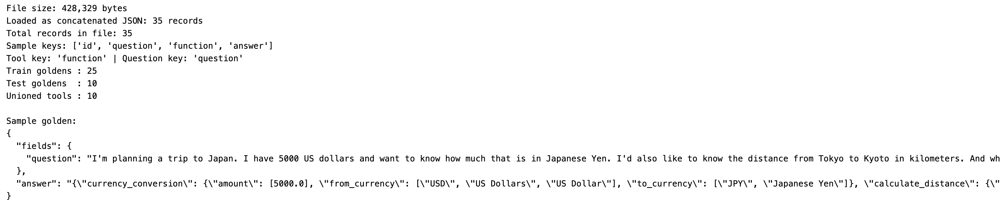


**Build a JSON Schema for Response Formatting**

The same unioned tool definitions are turned into a JSON Schema that mirrors the golden-answer shape (a JSON object keyed by tool name). This `tool_call_schema` is what you attach as a `response_format` in the final comparison step to enforce structured output at the API level:

```python
def build_tool_call_json_schema(tools: list) -> dict:
    """
    Build a JSON Schema for ResponseFormatJsonSchema from the unioned BFCL tool
    definitions. Mirrors the golden-answer shape used throughout this notebook:
    a JSON object whose keys are tool names, and whose values are that tool's
    arguments object.
    """
    properties = {}
    for entry in tools:
        fn = entry["function"]
        properties[fn["name"]] = {
            "type": "object",
            "description": fn.get("description", ""),
            "properties": fn["parameters"].get("properties", {}),
        }

    return {
        "title": "ToolCallResponse",
        "type": "object",
        "description": "One or more tool calls, keyed by tool name.",
        "properties": properties,
        "minProperties": 1,
    }

tool_call_schema = build_tool_call_json_schema(tools)
print(f"Built JSON schema with {len(tool_call_schema['properties'])} tool properties.")
```


[OPTION END]

[OPTION BEGIN [Bruno]]

The dataset loading, normalization, and JSON-schema building are handled entirely in the Python notebook. For Bruno, you only need the locally prepared dataset files (`bfcl_train.json`, `bfcl_test.json`, `bfcl_tools.json`, `bfcl_prompt_template.json`) ready for upload.

Run the Python notebook up to the "Local files written." output before proceeding with Bruno API calls. The `bfcl_tools.json` file also serves as the source for the `tools` array and `response_format` schema used in the final comparison step.

[OPTION END]

---

### Upload Files and Register Dataset Artifact

All four files — train goldens, test goldens, tool definitions, and the prompt template — are serialized locally and then uploaded to a shared folder in AI Core's dataset storage. The shared folder is then registered as a single artifact.

[OPTION BEGIN [Python SDK]]

**Serialize Files Locally**

```python
train_local  = "./bfcl_train.json"
test_local   = "./bfcl_test.json"
tools_local  = "./bfcl_tools.json"
prompt_local = "./bfcl_prompt_template.json"

with open(train_local,  "w") as f: json.dump(train_goldens,    f, indent=2)
with open(test_local,   "w") as f: json.dump(test_goldens,     f, indent=2)
with open(tools_local,  "w") as f: json.dump(tools,            f, indent=2)
with open(prompt_local, "w") as f: json.dump(prompt.model_dump(), f, indent=2)
print("Local files written.")
```

**Upload Files to AI Core Dataset Storage**

```python
def upload_file(local_path: str, remote_subfolder: str, filename: str) -> str:
    """Upload file to AI Core dataset storage. Returns folder path 'default/<subfolder>'."""
    full_path    = f"default/{remote_subfolder}/{filename}"
    encoded_path = quote(full_path, safe="")
    url          = f"{client.ai_core_client.base_url}/lm/dataset/files/{encoded_path}"
    headers      = {**client.request_header, "Content-Type": "application/json"}
    with open(local_path, "rb") as f:
        res = requests.put(url, params={"overwrite": "true"}, headers=headers, data=f)
    print(f"  Upload [{filename}]: {res.status_code}")
    res.raise_for_status()
    return f"default/{remote_subfolder}"

REMOTE_SUBFOLDER = "datasets/bfcl-optimizer"
print("Uploading files...")
shared_folder = upload_file(train_local,  REMOTE_SUBFOLDER, "bfcl_train.json")
upload_file(test_local,   REMOTE_SUBFOLDER, "bfcl_test.json")
upload_file(tools_local,  REMOTE_SUBFOLDER, "bfcl_tools.json")
upload_file(prompt_local, REMOTE_SUBFOLDER, "bfcl_prompt_template.json")
print(f"Shared folder: {shared_folder}")
```

**Register Dataset Artifact**

The shared folder is registered as a single artifact. The helper checks for an existing artifact at the same URL before creating a new one:

```python
def get_or_create_artifact(name: str, folder_path: str, description: str) -> str:
    """Register folder as artifact. Returns artifact_id."""
    artifact_url = f"ai://{folder_path}"
    existing = client.ai_core_client.artifact.query(
        resource_group=resource_group, scenario_id=SCENARIO
    )
    for art in existing.resources:
        if art.url == artifact_url:
            print(f"  Reusing artifact [{name}]: {art.id}")
            return art.id
    resp = client.ai_core_client.artifact.create(
        name=name, kind=Artifact.Kind.DATASET,
        url=artifact_url, scenario_id=SCENARIO,
        resource_group=resource_group, description=description
    )
    print(f"  Created artifact [{name}]: {resp.id}")
    return resp.id

optimizer_artifact_id = get_or_create_artifact(
    name="bfcl-optimizer-data",
    folder_path=shared_folder,
    description="BFCL train/test goldens, tools, and prompt template"
)
print(f"Artifact ID: {optimizer_artifact_id}")
```

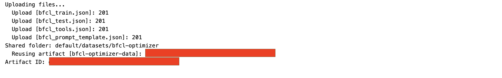

[OPTION END]

[OPTION BEGIN [Bruno]]

Upload each file using a `PUT` request to the AI Core dataset files endpoint.

**URL pattern (repeat for each file):**

```bash
PUT {{ai_api_url}}/v2/lm/dataset/files/default%2Fdatasets%2Fbfcl-optimizer%2F<File Name>?overwrite=true
```

**Headers:**

```
Authorization: Bearer {{access_token}}
Content-Type: application/json
ai-resource-group: {{resource_group}}
```

Upload the following four files in sequence, replacing `<filename>` each time:
- `bfcl_train.json`
- `bfcl_test.json`
- `bfcl_tools.json`
- `bfcl_prompt_template.json`

A successful response for each file:

```json
{
  "message": "File default/datasets/bfcl-optimizer/bfcl_train.json created successfully.",
  "url": "ai://default/datasets/bfcl-optimizer/bfcl_train.json"
}
```

**Register the Artifact**

After uploading all files, register the shared folder as a single artifact:

**URL:**

```bash
POST {{ai_api_url}}/v2/lm/artifacts
```

**Headers:**

```
Authorization: Bearer {{access_token}}
Content-Type: application/json
ai-resource-group: {{resource_group}}
```

**Body (JSON):**

```json
{
  "name": "bfcl-optimizer-data",
  "kind": "dataset",
  "url": "ai://default/datasets/bfcl-optimizer",
  "scenarioId": "genai-optimizations",
  "description": "BFCL train/test goldens, tools, and prompt template"
}
```

💡 Save the returned artifact `id` — it is required when creating the optimization configuration.

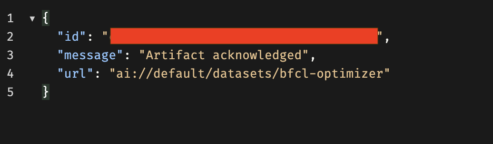

[OPTION END]

---

### Create and Register the Base Prompt Template

The base prompt template is pushed to the Prompt Registry. It is intentionally minimal — system `"You are a helpful assistant."` and user `{{?question}}` — so the optimizer has maximum room to add structure (JSON-only output instructions, tool schemas, reasoning steps) and you can clearly see the value it adds in the final comparison.

[OPTION BEGIN [Python SDK]]

```python
def push_prompt(spec: PromptTemplateSpec, name: str, version: str, scenario: str):
    url  = f"{client.ai_core_client.base_url}/lm/promptTemplates"
    body = {"name": name, "version": version, "scenario": scenario, "spec": spec.model_dump()}
    res  = requests.post(
        url,
        headers={**client.request_header, "Content-Type": "application/json"},
        json=body
    )
    print(f"Prompt registry: {res.status_code} — {res.json().get('message', '')}")
    if res.status_code == 409:
        print("Prompt already exists — reusing.")
        return {"name": name, "version": version}
    res.raise_for_status()
    return res.json()

push_prompt(prompt, PROMPT_NAME, PROMPT_VERSION, SCENARIO)
```

A successful registration returns HTTP `200` with message `Prompt updated successfully.` (or `Prompt created successfully.` on first push). A `409` means the prompt already exists and is reused as-is.

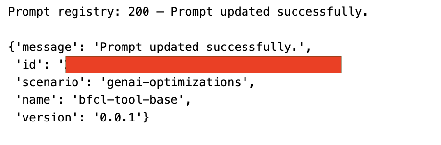

[OPTION END]

[OPTION BEGIN [Bruno]]

**URL:**

```bash
POST {{ai_api_url}}/v2/lm/promptTemplates
```

**Headers:**

```
Authorization: Bearer {{access_token}}
Content-Type: application/json
ai-resource-group: {{resource_group}}
```

**Body (JSON):**

```json
{
  "name": "bfcl-tool-base",
  "version": "0.0.1",
  "scenario": "genai-optimizations",
  "spec": {
    "template": [
      {
        "role": "system",
        "content": "You are a helpful assistant."
      },
      {
        "role": "user",
        "content": "PLACEHOLDER"
      }
    ]
  }
}
```

A successful response:

```json
{
  "message": "Prompt created successfully.",
  "id": "<PROMPT_ID>",
  "scenario": "genai-optimizations",
  "name": "bfcl-tool-base",
  "version": "0.0.1"
}
```

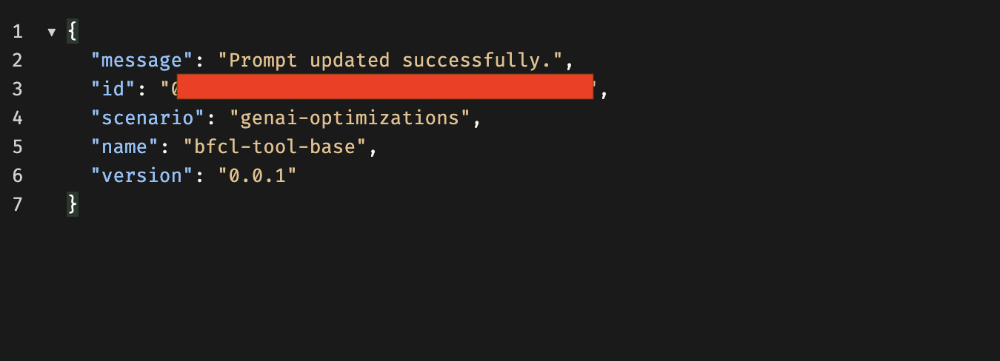

[OPTION END]

---

### Register an Optimization Configuration

The optimization configuration links the artifact, base prompt, reference model, target model, and metric into one executable setup. Creating a configuration does not run anything yet — think of it as saving a recipe.

[OPTION BEGIN [Python SDK]]

```python
def create_config(
    metric: str,
    reference_model: str,
    targets: dict,
    train_filename: str,
    test_filename: str,
    prompt_artifact_id: str,
    prompt_name: str,
    prompt_version: str,
    scenario: str,
) -> str:
    base_prompt = f"{scenario}/{prompt_name}:{prompt_version}"

    input_parameters = [
        ParameterBinding(key="optimizationMetric",     value=metric),
        ParameterBinding(key="basePrompt",             value=base_prompt),
        ParameterBinding(key="baseModel",              value=reference_model),
        ParameterBinding(key="targetModels",           value=",".join(targets.keys())),
        ParameterBinding(
            key="targetPromptMapping",
            value=",".join(f"{k}={v}" for k, v in targets.items())
        ),
        ParameterBinding(key="trainDataset",           value=train_filename),
        ParameterBinding(key="testDataset",            value=test_filename),
        ParameterBinding(key="maximize",               value="true"),
        ParameterBinding(key="correctnessCutoff",      value="none"),
        ParameterBinding(key="includeFewShotExamples", value="false"),
        ParameterBinding(key="promptTemplateScope",    value="tenant"),
        ParameterBinding(key="prototypeMode",          value="false"),
        ParameterBinding(key="fieldEvaluationMetrics", value="none"),
        ParameterBinding(key="modelParams",            value="none"),
        ParameterBinding(key="customMetricId",         value="none"),
    ]

    input_artifacts = [
        InputArtifactBinding(key="prompt-data", artifact_id=prompt_artifact_id)
    ]

    params_dict = {p.key: p.value for p in input_parameters}

    try:
        existing = client.ai_core_client.configuration.query(
            scenario_id=SCENARIO, resource_group=resource_group
        )
        for conf in existing.resources:
            if {p.key: p.value for p in conf.parameter_bindings} == params_dict:
                print(f"Reusing configuration: {conf.id}")
                return conf.id
    except Exception as e:
        print(f"Could not query configs: {e}")

    resp = client.ai_core_client.configuration.create(
        name="bfcl-tool-config",
        scenario_id=SCENARIO,
        executable_id=SCENARIO,
        resource_group=resource_group,
        parameter_bindings=input_parameters,
        input_artifact_bindings=input_artifacts,
    )
    print(f"Created configuration: {resp.id}")
    return resp.id

configuration_id = create_config(
    metric=METRIC,
    reference_model=REFERENCE_MODEL,
    targets=TARGET_MODELS,
    train_filename="bfcl_train.json",
    test_filename="bfcl_test.json",
    prompt_artifact_id=optimizer_artifact_id,
    prompt_name=PROMPT_NAME,
    prompt_version=PROMPT_VERSION,
    scenario=SCENARIO,
)
print(f"Configuration ID: {configuration_id}")
```

💡 The `create_config` function checks for an existing configuration with identical parameters before creating a new one, preventing duplicates. The dataset is passed separately as an `InputArtifactBinding` (referencing the `artifact_id` from the upload step); the configuration only knows *filenames* and resolves them against the bound artifact folder at execution time.


[OPTION END]

[OPTION BEGIN [Bruno]]

**URL:**

```bash
POST {{ai_api_url}}/v2/lm/configurations
```

**Headers:**

```
Authorization: Bearer {{access_token}}
Content-Type: application/json
Accept: application/json
ai-resource-group: {{resource_group}}
```

**Body (JSON):**

```json
{
  "name": "bfcl-tool-config",
  "scenarioId": "genai-optimizations",
  "executableId": "genai-optimizations",
  "parameterBindings": [
    { "key": "optimizationMetric",     "value": "JSON_Match" },
    { "key": "basePrompt",             "value": "genai-optimizations/bfcl-tool-base:0.0.1" },
    { "key": "baseModel",              "value": "gpt-4o:2024-08-06" },
    { "key": "targetModels",           "value": "gemini-2.5-pro:001" },
    { "key": "targetPromptMapping",    "value": "gemini-2.5-pro:001=bfcl-tool-optimized-gemini25:0.0.1" },
    { "key": "trainDataset",           "value": "bfcl_train.json" },
    { "key": "testDataset",            "value": "bfcl_test.json" },
    { "key": "maximize",               "value": "true" },
    { "key": "correctnessCutoff",      "value": "none" },
    { "key": "includeFewShotExamples", "value": "false" },
    { "key": "promptTemplateScope",    "value": "tenant" },
    { "key": "prototypeMode",          "value": "false" },
    { "key": "fieldEvaluationMetrics", "value": "none" },
    { "key": "modelParams",            "value": "none" },
    { "key": "customMetricId",         "value": "none" }
  ],
  "inputArtifactBindings": [
    { "key": "prompt-data", "artifactId": "<ARTIFACT_ID>" }
  ]
}
```

💡 Save the returned configuration `id` — it is used in the next step to trigger the execution.

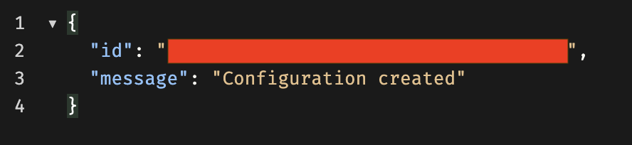

[OPTION END]

⚠️ **Note:** Model availability and versions (for example, `gpt-4o:2024-08-06`, `gemini-2.5-pro:001`) may vary across SAP AI Core tenants. Always verify available models in Generative AI Hub → Models before use.  
For the latest updates, refer to [SAP Note 3437766](https://me.sap.com/notes/3437766) – Model Availability and Support for Generative AI Hub.

---

### Run the Prompt Optimization Execution

After registering the configuration, trigger the optimization execution. The optimizer iteratively refines the base prompt using the train goldens and evaluates candidate prompts against the test goldens using the `JSON_Match` metric.

[OPTION BEGIN [Python SDK]]

```python
execution = client.ai_core_client.execution.create(
    configuration_id=configuration_id,
    resource_group=resource_group,
)
execution_id = execution.id
print(f"Execution ID: {execution_id}")
```


[OPTION END]

[OPTION BEGIN [Bruno]]

**URL:**

```bash
POST {{ai_api_url}}/v2/lm/executions
```

**Headers:**

```
Authorization: Bearer {{access_token}}
Content-Type: application/json
Accept: application/json
ai-resource-group: {{resource_group}}
```

**Body (JSON):**

```json
{
  "configurationId": "<CONFIGURATION_ID>"
}
```

A successful response returns the execution `id`:

```json
{
  "id": "<EXECUTION_ID>",
  "message": "Execution created successfully.",
  "status": "UNKNOWN"
}
```

💡 Save the returned `id` — you will use it in the next step to monitor status.

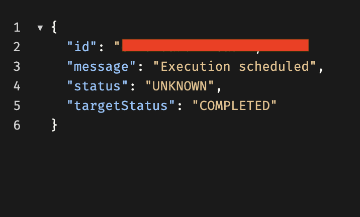

[OPTION END]

---

### Monitor Optimization Progress

After triggering the execution, monitor its status. The execution transitions through `UNKNOWN` → `RUNNING` (with progress updates) → `COMPLETED`. Expect roughly 20–30 minutes for 25 train + 15 test samples. The notebook also fetches logs automatically if the execution fails.

[OPTION BEGIN [Python SDK]]

```python
TERMINAL_STATES = {"COMPLETED", "FAILED", "DEAD", "STOPPED"}

while True:
    status = client.ai_core_client.execution.get(
        execution_id=execution_id, resource_group=resource_group
    )
    status_str = status.status.value if hasattr(status.status, "value") else str(status.status)
    print(f"[{time.strftime('%H:%M:%S')}] {status_str}", end="")

    if hasattr(status, "status_details") and status.status_details:
        progress = status.status_details.get("progress", "")
        print(f"  progress={progress}", end="")
    print()

    if status_str in TERMINAL_STATES:
        if status_str != "COMPLETED":
            try:
                logs = client.ai_core_client.execution.get_logs(
                    execution_id=execution_id, resource_group=resource_group
                )
                print("── Execution logs ──")
                for log in logs.data:
                    print(log.msg)
            except Exception as e:
                print(f"Could not fetch logs: {e}")
        break

    time.sleep(30)

print(f"\nFinal status: {status_str}")
```

`Final status: COMPLETED` means the optimizer finished and a refined prompt was written back to the Prompt Registry. If you see `FAILED`/`DEAD`/`STOPPED`, read the printed logs — common culprits include a model not available in your region, a malformed dataset file, or a metric misconfiguration.

The execution continues running server-side even if you interrupt the polling loop (`Kernel → Interrupt`), so you can re-poll `execution_id` later instead of re-running the whole cell.

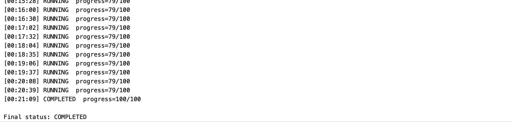

[OPTION END]

[OPTION BEGIN [Bruno]]

**Get execution status by ID:**

**URL:**

```bash
GET {{ai_api_url}}/v2/lm/executions/{{execution_id}}
```

**Headers:**

```
Authorization: Bearer {{access_token}}
ai-resource-group: {{resource_group}}
```

A completed execution response:

```json
{
  "id": "<EXECUTION_ID>",
  "status": "COMPLETED",
  "scenarioId": "genai-optimizations",
  "configurationId": "<CONFIGURATION_ID>",
  "targetStatus": "COMPLETED",
  "submissionTime": "2025-11-06T06:48:53Z",
  "startTime": "...",
  "completionTime": "..."
}
```

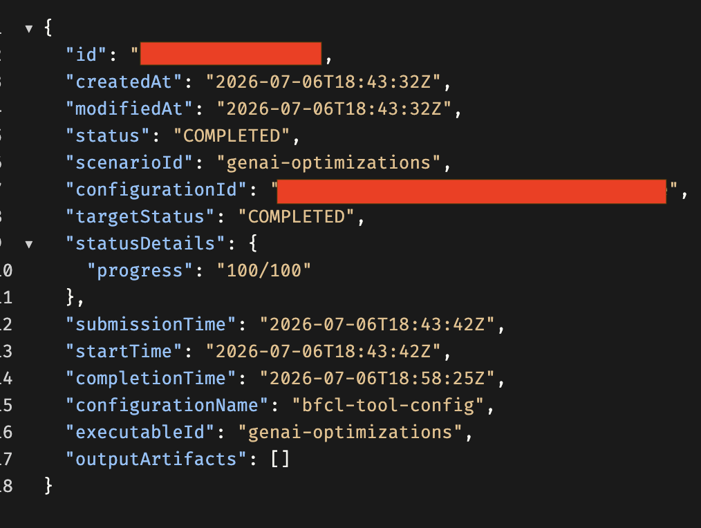

[OPTION END]

---

### Review Optimization Results

Once the execution completes, the optimized prompt is stored in the Prompt Registry. Retrieve it by its ID to inspect how the optimizer refined the base prompt.

[OPTION BEGIN [Python SDK]]

List all prompt templates to find the optimized one's ID, then fetch it directly:

```python
url = f"{client.ai_core_client.base_url}/lm/promptTemplates"
res = requests.get(url, headers=client.request_header)
templates = res.json()
for t in templates.get("resources", []):
    print(f"  name={t['name']}  version={t['version']}  id={t['id']}")
```

```python
# Replace with the actual ID of bfcl-tool-optimized-gemini25 from the listing above
optimized_id = "<OPTIMIZED_PROMPT_ID>"

url = f"{client.ai_core_client.base_url}/lm/promptTemplates/{optimized_id}"
res = requests.get(url, headers=client.request_header)
print(f"Status: {res.status_code}")
optimized = res.json()
print(json.dumps(optimized, indent=2))
```

Look for the entry `name=bfcl-tool-optimized-gemini25  version=0.0.1`. The optimized prompt will be far more detailed than the base `"You are a helpful assistant."` — a structured-output parser role, last-of-type selection rules for duplicate calls, strict JSON constraints (no markdown, no backticks), full tool schemas, and reasoning steps.

💡 Notice that the optimizer achieves structured output purely through *prompt wording* — instructions like "no markdown, no backticks" are model-facing suggestions, not API-enforced constraints. For an API-level guarantee, pair this exact prompt with a `response_format=json_schema` built from `bfcl_tools.json` — that is exactly what the next step demonstrates.

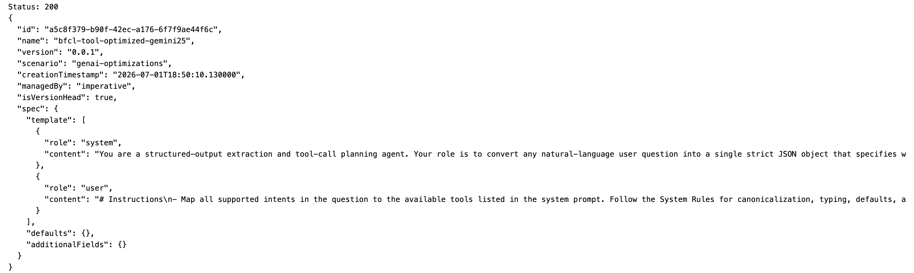

[OPTION END]

[OPTION BEGIN [Bruno]]

**List all prompt templates:**

**URL:**

```bash
GET {{ai_api_url}}/v2/lm/promptTemplates
```

**Headers:**

```
Authorization: Bearer {{access_token}}
ai-resource-group: {{resource_group}}
```

Look for the optimized prompt in the response:

```json
{
  "name": "bfcl-tool-optimized-gemini25",
  "version": "0.0.1",
  "scenario": "genai-optimizations"
}
```

**Fetch by ID:**

**URL:**

```bash
GET {{base_url}}/lm/promptTemplates/{{optimized_prompt_id}}
```

**Headers:**

```
Authorization: Bearer {{access_token}}
ai-resource-group: {{resource_group}}
```

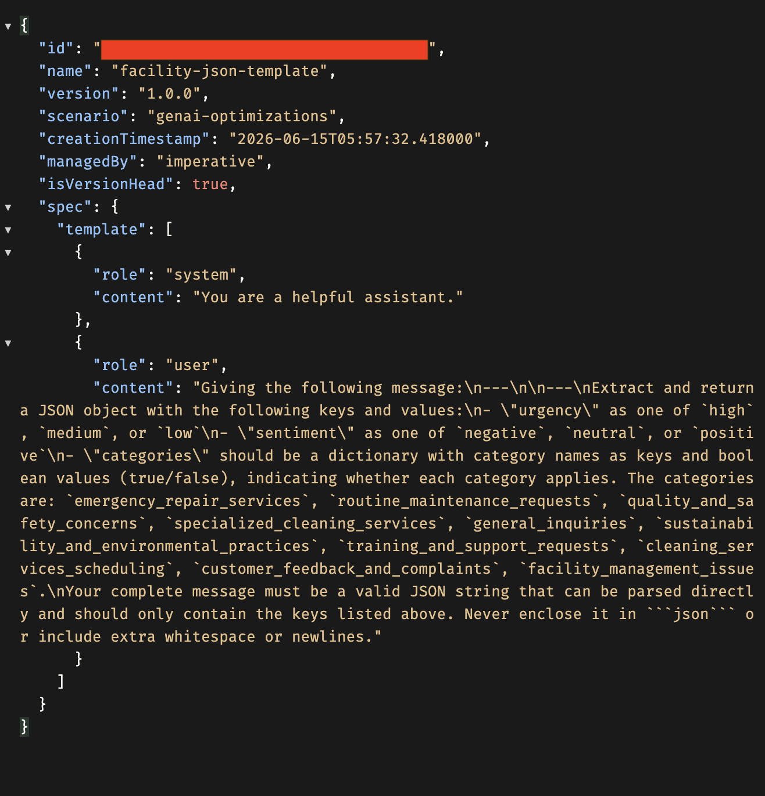

[OPTION END]

---

### Compare Base vs Optimized Prompt via Live Inference (with Response Formatting)

After retrieving both prompt templates, run live inference on the same test questions to compare output quality between the base and optimized prompts — and, additionally, demonstrate what `response_format=json_schema` adds on top of the optimized prompt.

[OPTION BEGIN [Python SDK]]

**Load both prompt templates and build the inference helper**

Live inference runs through the Orchestration Service. The `run_inference` helper takes an optional `use_response_format` flag — when `True`, it attaches the `tool_call_schema` (built earlier from the unioned tools) as a `ResponseFormatJsonSchema`, guaranteeing the wire format is valid JSON regardless of prompt wording:

```python
from gen_ai_hub.orchestration.models.llm import LLM
from gen_ai_hub.orchestration.models.message import SystemMessage, UserMessage
from gen_ai_hub.orchestration.models.template import Template, TemplateValue
from gen_ai_hub.orchestration.models.config import OrchestrationConfig
from gen_ai_hub.orchestration.service import OrchestrationService
from gen_ai_hub.orchestration.models.response_format import ResponseFormatJsonSchema

# ── Load base + optimized templates from the registry ─────────────────────────
def get_prompt_template(template_id: str) -> dict:
    url = f"{client.ai_core_client.base_url}/lm/promptTemplates/{template_id}"
    res = requests.get(url, headers=client.request_header)
    res.raise_for_status()
    return res.json()

def extract_messages(template: dict) -> dict:
    messages = {}
    for msg in template.get("spec", {}).get("template", []):
        messages[msg["role"]] = msg["content"]
    return messages

url = f"{client.ai_core_client.base_url}/lm/promptTemplates"
res = requests.get(url, headers=client.request_header)
all_templates = {
    f"{t['name']}:{t['version']}": t["id"]
    for t in res.json().get("resources", [])
}

base_id      = all_templates.get("bfcl-tool-base:0.0.1")
optimized_id = all_templates.get("bfcl-tool-optimized-gemini25:0.0.1")

base_messages      = extract_messages(get_prompt_template(base_id))
optimized_messages = extract_messages(get_prompt_template(optimized_id))
print("✅ Loaded base and optimized prompt templates.")

# ── Inference helper (optionally with response_format) ────────────────────────
# Paste your orchestration deployment URL here
ORCHESTRATION_DEPLOYMENT_URL = "<YOUR_ORCHESTRATION_DEPLOYMENT_URL>"

def run_inference(system_prompt: str, user_template: str, question: str, model_name: str,
                  use_response_format: bool = False) -> str:
    user_content = user_template.replace("{{?question}}", question)

    template_kwargs = {
        "messages": [
            SystemMessage(system_prompt),
            UserMessage(user_content),
        ]
    }

    if use_response_format:
        template_kwargs["response_format"] = ResponseFormatJsonSchema(
            name="tool_call_response",
            description="Structured tool call output, keyed by tool name.",
            schema=tool_call_schema,
        )

    config = OrchestrationConfig(
        llm=LLM(name=model_name),
        template=Template(**template_kwargs),
    )

    service  = OrchestrationService(api_url=ORCHESTRATION_DEPLOYMENT_URL, config=config)
    response = service.run()
    return response.module_results.llm.choices[0].message.content
```

**Compare base vs optimized**

The `compare_prompts` function runs both prompts and evaluates whether each output is valid JSON:

```python
def clean_json_output(text: str) -> str:
    """Strip markdown code fences that models sometimes wrap around JSON."""
    text = text.strip()
    if text.startswith("```"):
        lines = text.split("\n")
        lines = [l for l in lines if not l.strip().startswith("```")]
        text = "\n".join(lines).strip()
    return text


def compare_prompts(question: str, model_name: str = "gemini-2.5-pro"):
    print("\n" + "=" * 70)
    print(f"QUESTION:\n{question}")
    print("=" * 70)

    print("\n📌 BASE PROMPT OUTPUT:")
    base_output = run_inference(
        system_prompt=base_messages["system"],
        user_template=base_messages["user"],
        question=question,
        model_name=model_name,
    )
    print(base_output)

    print("\n✅ OPTIMIZED PROMPT OUTPUT:")
    optimized_output = run_inference(
        system_prompt=optimized_messages["system"],
        user_template=optimized_messages["user"],
        question=question,
        model_name=model_name,
    )
    print(optimized_output)

    print("\n📊 COMPARISON:")
    for label, output in [("BASE", base_output), ("OPTIMIZED", optimized_output)]:
        cleaned = clean_json_output(output)
        try:
            parsed = json.loads(cleaned)
            print(f"{label:12s} → valid JSON ✅ | tools called: {list(parsed.keys())}")
        except json.JSONDecodeError:
            print(f"{label:12s} → invalid JSON ❌ | raw: {output[:120]}")

    return base_output, optimized_output

compare_prompts("What is the weather in Tokyo for the next 3 days in celsius?")
```

**Optimized prompt: without vs with `response_format`**

Finally, run the *same* optimized prompt twice — once relying on prompt wording alone, and once with the JSON Schema attached — to see the defense-in-depth effect:

```python
question = "What is the weather in Tokyo for the next 3 days in celsius?"

without_rf = run_inference(
    system_prompt=optimized_messages["system"],
    user_template=optimized_messages["user"],
    question=question,
    model_name="gemini-2.5-pro",
    use_response_format=False,
)

with_rf = run_inference(
    system_prompt=optimized_messages["system"],
    user_template=optimized_messages["user"],
    question=question,
    model_name="gemini-2.5-pro",
    use_response_format=True,
)

print("WITHOUT response_format:\n", without_rf)
print("\nWITH response_format:\n", with_rf)
```

A typical result showing the optimization WIN, and the added guarantee from response formatting:

```
BASE         → invalid JSON ❌ | raw: Of course! I can help with all three of your requests...
OPTIMIZED    → valid JSON ✅ | tools called: ['currency_conversion', 'event_finder', 'recipe_search']

📈 VERDICT:
----------------------------------------
🏆 Optimization WIN — base gave prose, optimized gave structured JSON
```

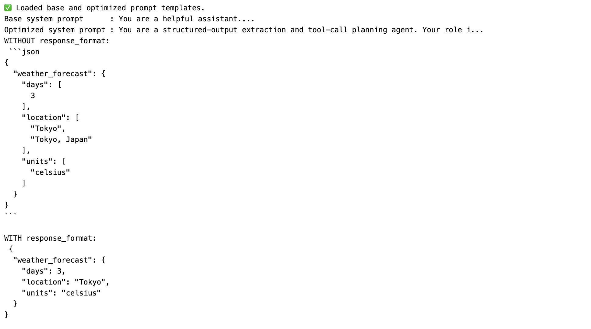

[OPTION END]

---

### Summary

In this tutorial, you optimized a function-calling prompt using SAP AI Core with a BFCL v3 dataset, and paired it with Response Formatting for API-level structured-output guarantees:

1. **Learned Response Formatting** — the three `response_format` modes (`text`, `json_object`, `json_schema`) and how they complement prompt optimization by constraining output at the API level rather than through prompt wording.
2. **Loaded and normalized the BFCL v3 dataset** — using a robust multi-format reader and normalizing tool definitions to OpenAI ChatCompletions format.
3. **Split the dataset** into 25 train goldens and 15 test goldens, built a union of all tool definitions, and derived a `json_schema` `response_format` from those tools.
4. **Uploaded four files** (train, test, tools, prompt template) to a shared folder in AI Core's built-in dataset storage via the `/lm/dataset/files` endpoint.
5. **Registered a dataset artifact** linking the shared folder to the `genai-optimizations` scenario.
6. **Pushed the base prompt template** (`bfcl-tool-base:0.0.1`) to the Prompt Registry.
7. **Created an optimization configuration** with 15 parameter bindings including the `JSON_Match` metric, reference model (`gpt-4o:2024-08-06`), and target model (`gemini-2.5-pro:001`).
8. **Triggered and monitored the execution** — tracking real-time progress from `UNKNOWN` through `RUNNING` to `COMPLETED`.
9. **Retrieved the optimized prompt** (`bfcl-tool-optimized-gemini25:0.0.1`) from the Prompt Registry.
10. **Compared base vs optimized prompts** via live inference — confirming the optimization WIN — and demonstrated the optimized prompt with and without a `response_format` schema, showing how prompt optimization and Response Formatting combine for defense-in-depth structured output.
