# Prompt Optimization with Tool Calling
<!-- description --> This tutorial demonstrates how to use Prompt Optimization in SAP AI Core for tool calling scenarios using a BFCL v3 dataset. The process loads and normalizes a BFCL v3 parallel-multiple dataset, splits it into train and test sets, uploads all files to AI Core's built-in dataset storage, registers a dataset artifact, pushes a base prompt template to the Prompt Registry, and runs an optimization execution targeting Gemini 2.5 Pro with GPT-4o as the reference model using the `JSON_Match` metric. After completion, the optimized prompt is retrieved from the registry and compared against the base prompt through live inference via the Orchestration Service.

## You will learn
- How to load and normalize BFCL v3 parallel-multiple data into the SAP optimizer golden format.
- How to upload train, test, tools, and prompt template files to AI Core dataset storage.
- How to register a dataset artifact linking the uploaded folder to the `genai-optimizations` scenario.
- How to create and register a base prompt template in the Prompt Registry.
- How to configure and run prompt optimization via Python SDK and Bruno.
- How to monitor execution progress and retrieve the optimized prompt.
- How to compare base vs optimized prompt outputs through live inference via the Orchestration Service.

## Prerequisites
1. **BTP Account**  
   Set up your SAP Business Technology Platform (BTP) account.  
   [Create a BTP Account](https://developers.sap.com/group.btp-setup.html)
2. **For SAP Developers or Employees**  
   Internal SAP stakeholders should refer to the following documentation: [How to create BTP Account For Internal SAP Employee](https://me.sap.com/notes/3493139), [SAP AI Core Internal Documentation](https://help.sap.com/docs/sap-ai-core)
3. **For External Developers, Customers, or Partners**  
   Follow this tutorial to set up your environment and entitlements: [External Developer Setup Tutorial](https://developers.sap.com/tutorials/btp-cockpit-entitlements.html), [SAP AI Core External Documentation](https://help.sap.com/docs/sap-ai-core?version=CLOUD)
4. **Create BTP Instance and Service Key for SAP AI Core**  
   Follow the steps to create an instance and generate a service key for SAP AI Core:  
   [Create Service Key and Instance](https://help.sap.com/docs/sap-ai-core/sap-ai-core-service-guide/create-service-key?version=CLOUD)
5. **AI Core Setup Guide**  
   Step-by-step guide to set up and get started with SAP AI Core:  
   [AI Core Setup Tutorial](https://developers.sap.com/tutorials/ai-core-setup.html)
6. An Extended SAP AI Core service plan is required, as the Generative AI Hub is not available in the Free or Standard tiers. For more details, refer to  
   [SAP AI Core Service Plans](https://help.sap.com/docs/sap-ai-core/sap-ai-core-service-guide/service-plans?version=CLOUD)
7. You have access to the `genai-optimizations` scenario and have the required roles such as `mloperations_editor` or `genai_manager`.
8. A BFCL v3 dataset file (e.g., `BFCL_v3_parallel_multiple_10tools.json`) is available locally.

### Pre-Read
Before starting this tutorial, ensure that you:
- Understand the basics of Generative AI workflows in SAP AI Core.
- Are familiar with function calling / tool calling concepts in LLMs.
- Are familiar with creating and managing prompt templates and artifacts in SAP AI Core.
- Have completed the Quick Start tutorial or equivalent setup for SAP AI Core access.

### Architecture Overview

- Prompt Optimization for tool calling connects the Prompt Registry, AI Core Dataset Storage, and ML Tracking Service to form an end-to-end optimization workflow.
- A BFCL v3 dataset is loaded, normalized, and split into train and test sets. All four files (train goldens, test goldens, tool definitions, and prompt template) are uploaded to a shared folder in AI Core's built-in dataset storage.
- The shared folder is registered as a single artifact under the `genai-optimizations` scenario.
- The base prompt template is pushed to the Prompt Registry.
- An optimization configuration links the artifact, base prompt, reference model (`gpt-4o:2024-08-06`), target model (`gemini-2.5-pro:001`), and the `JSON_Match` metric.
- During execution, the optimizer iteratively refines the prompt. Metrics are tracked in the ML Tracking Service, and the optimized prompt is saved back to the Prompt Registry.
- After completion, the base and optimized prompts are compared via live inference through the Orchestration Service.


### Notebook Reference

For hands-on execution and end-to-end reference, use the accompanying notebook `bffcl23.ipynb`. It is a single self-contained notebook that runs the entire pipeline — from loading the BFCL dataset and uploading files, to configuration creation, execution, monitoring, and inference comparison.

💡 Even though this tutorial provides stepwise code snippets for clarity, the notebook contains all required imports, object initializations, and helper functions to run the flow seamlessly in one place.

**To use the notebook:**
- Download and open `Prompt Optimisation with Tool Calling.ipynb` in your preferred environment (e.g., VS Code, JupyterLab).
- Place your BFCL v3 dataset file (e.g., `BFCL_v3_parallel_multiple_10tools.json`) in the same directory.
- Configure your `.env` file with your AI Core credentials.
- Execute each cell in order to reproduce the complete prompt optimization with tool calling workflow.

---

### Environment Variables Setup

[OPTION BEGIN [Python SDK]]

- Open **Visual Studio Code or Jupyter Notebook**. Create a new file with the `.ipynb` extension (e.g., `bffcl23.ipynb`).
- Create a **`.env`** file in the root directory of your project.
- Add your **AI Core** credentials as shown below.

```env
# AICORE CREDENTIALS
AICORE_CLIENT_ID=<AICORE CLIENT ID>
AICORE_CLIENT_SECRET=<AICORE CLIENT SECRET>
AICORE_AUTH_URL=<AICORE AUTH URL>
AICORE_BASE_URL=<AICORE BASE URL>
AICORE_RESOURCE_GROUP=<AICORE RESOURCE GROUP>
# AWS CREDENTIALS
AWS_ACCESS_KEY=<AWS ACCESS KEY>
AWS_BUCKET_ID=<AWS BUCKET ID>
AWS_REGION=<AWS REGION>
AWS_SECRET_ACCESS_KEY=<AWS SECRET ACCESS KEY> 

# ORCHESTRATION DEPLOYMENT URL
DEPLOYMENT_URL=<DEPLOYMENT URL>
```

**Note:** Replace placeholders (e.g., `CLIENT_ID`, `CLIENT_SECRET`, etc.) with your actual environment credentials. Unlike the standard prompt optimization flow, this tutorial uploads files directly to AI Core's built-in dataset storage — no S3 or external object store credentials are required.

Refer to the screenshot below for clarity:

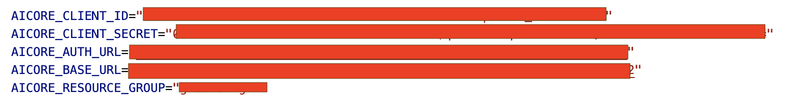

#### Connect to AI Core Instance

Once the environment variables are set and dependencies are installed, run the following code to connect to your instance:

```python
from collections import defaultdict
from gen_ai_hub.proxy.gen_ai_hub_proxy import GenAIHubProxyClient
from dotenv import load_dotenv
import os
import json
import requests
import random
from urllib.parse import quote
from pathlib import Path
from typing import List, Tuple
import time
from ai_api_client_sdk.models.parameter_binding import ParameterBinding
from ai_api_client_sdk.models.input_artifact_binding import InputArtifactBinding
from pydantic import BaseModel
from ai_api_client_sdk.models.artifact import Artifact

load_dotenv(override=True)

# ── SAP AI Core client ────────────────────────────────────────────────────────
client = GenAIHubProxyClient(
    base_url=os.getenv("AICORE_BASE_URL"),
    auth_url=os.getenv("AICORE_AUTH_URL"),
    client_id=os.getenv("AICORE_CLIENT_ID"),
    client_secret=os.getenv("AICORE_CLIENT_SECRET"),
    resource_group=os.getenv("AICORE_RESOURCE_GROUP")
)
resource_group = client.request_header[
    client.ai_core_client.rest_client.resource_group_header
]

print("✅ Connected to AI Core")
print(f"   Resource group: {resource_group}")
```

[OPTION END]

[OPTION BEGIN [Bruno]]

- Follow the steps in the [Tutorial](https://developers.sap.com/tutorials/ai-core-orchestration-consumption.html) to set up your Bruno environment — refer to the step **Set Up Your Environment and Configure Access** and proceed until generating the token.
- Ensure the following Bruno variables are configured in your environment:

| Variable | Description |
|---|---|
| `ai_auth_url` | Your AI Core auth URL e.g. `https://<tenant>.authentication.eu11.hana.ondemand.com` |
| `ai_api_url` | Your AI Core API URL e.g. `https://api.ai.<tenant>.aws.ml.hana.ondemand.com` |
| `client_id` | Your service key client ID |
| `client_secret` | Your service key client secret |
| `resource_group` | The resource group you are working in |
| `access_token` | Populated automatically after running `get_token` |

Run the `get_token` request first. It automatically sets `access_token` in your environment via the post-response script so all subsequent requests are authenticated.

[OPTION END]

---

### Configure Optimization Parameters

Before running the pipeline, define the key configuration constants used throughout the notebook.

[OPTION BEGIN [Python SDK]]

```python
# ── Configuration ─────────────────────────────────────────────────────────────
BFCL_DATASET      = "BFCL_v3_parallel_multiple_10tools.json"
BFCL_DATASET_MODE = "parallel_multiple"
N_TRAIN_SAMPLES   = 25
N_TEST_SAMPLES    = 15

PROMPT_NAME    = "bfcl-tool-base"
PROMPT_VERSION = "0.0.1"
SCENARIO       = "genai-optimizations"

SYSTEM_PROMPT   = "You are a helpful assistant."
PROMPT_TEMPLATE = "{{?question}}"
FIELDS          = ["question"]

# Use a model confirmed available in your region
REFERENCE_MODEL = "gpt-4o:2024-08-06"
TARGET_MODELS = {
    "gemini-2.5-pro:001": "bfcl-tool-optimized-gemini25:0.0.1",
}
METRIC = "JSON_Match"

# ── Pydantic models ───────────────────────────────────────────────────────────
class PromptTemplateMsg(BaseModel):
    role: str
    content: str

class PromptTemplateSpec(BaseModel):
    template: List[PromptTemplateMsg]

prompt = PromptTemplateSpec(template=[
    PromptTemplateMsg(role="system", content=SYSTEM_PROMPT),
    PromptTemplateMsg(role="user",   content=PROMPT_TEMPLATE),
])

print("✅ Configuration set")
print(f"   Dataset       : {BFCL_DATASET}")
print(f"   Scenario      : {SCENARIO}")
print(f"   Prompt name   : {PROMPT_NAME}:{PROMPT_VERSION}")
print(f"   Reference     : {REFERENCE_MODEL}")
print(f"   Target        : {list(TARGET_MODELS.keys())}")
print(f"   Metric        : {METRIC}")
```

[OPTION END]

[OPTION BEGIN [Bruno]]

These parameters are defined in the Python notebook. For Bruno, the equivalent values are used directly in the request bodies across each step:

| Parameter | Value |
|---|---|
| Scenario | `genai-optimizations` |
| Base Prompt Name | `bfcl-tool-base` |
| Base Prompt Version | `0.0.1` |
| Reference Model | `gpt-4o:2024-08-06` |
| Target Model | `gemini-2.5-pro:001` |
| Optimized Prompt Name | `bfcl-tool-optimized-gemini25:0.0.1` |
| Metric | `JSON_Match` |

[OPTION END]

---

### Load and Normalize the BFCL v3 Dataset

The BFCL v3 dataset contains parallel and multi-tool function calling samples. The notebook uses a robust reader that handles three file formats — JSON array, standard JSONL, and concatenated JSON objects — before normalizing samples into the SAP optimizer golden format.

[OPTION BEGIN [Python SDK]]

**BFCL v3 File Reader**

```python
def read_bfcl_file(file_path: Path) -> list:
    """Robust reader for BFCL v3 files (concatenated JSON objects)."""
    with open(file_path, "r") as f:
        content = f.read().strip()

    print(f"File size: {len(content):,} bytes")

    # Format 1: JSON array [ {...}, {...} ]
    if content.startswith("["):
        try:
            result = json.loads(content)
            if result and isinstance(result[0], str):
                print("Detected double-encoded strings — decoding...")
                result = [json.loads(item) for item in result]
            print(f"Loaded as JSON array: {len(result)} records")
            return result
        except json.JSONDecodeError:
            pass

    # Format 2: Standard JSONL — one complete object per line
    if "\n" in content:
        objects = []
        for line in content.split("\n"):
            line = line.strip()
            if not line:
                continue
            try:
                obj = json.loads(line)
                if isinstance(obj, dict):
                    objects.append(obj)
            except json.JSONDecodeError:
                pass
        if objects:
            print(f"Loaded as JSONL: {len(objects)} records")
            return objects

    # Format 3: Concatenated JSON objects — use raw_decode to scan through
    objects = []
    decoder = json.JSONDecoder()
    idx = 0
    while idx < len(content):
        while idx < len(content) and content[idx] in " \t\n\r":
            idx += 1
        if idx >= len(content):
            break
        if content[idx] != "{":
            idx += 1
            continue
        try:
            obj, end_idx = decoder.raw_decode(content, idx)
            if isinstance(obj, dict):
                objects.append(obj)
            idx = end_idx
        except json.JSONDecodeError:
            idx += 1
            continue

    print(f"Loaded as concatenated JSON: {len(objects)} records")
    return objects
```

**Tool Normalization**

BFCL tool definitions use non-standard types that must be normalized to OpenAI ChatCompletions format:

```python
def reformat_tool_name(name: str) -> str:
    return name.replace(".", "_")

def normalize_bfcl_tool(tool: dict) -> dict:
    """Convert raw BFCL tool definition to OpenAI ChatCompletions format."""
    tool = json.loads(json.dumps(tool))
    tool["parameters"]["type"] = "object"
    tool["name"] = reformat_tool_name(tool["name"])
    for param in tool["parameters"].get("properties", {}).values():
        if param["type"] == "float":
            param["type"] = "number"
        elif param["type"] == "dict":
            param["type"] = "object"
        elif param["type"] == "any":
            param["type"] = "string"
        elif param["type"] == "array" and "items" in param:
            if param["items"].get("type") == "float":
                param["items"]["type"] = "number"
            elif param["items"].get("type") == "dict":
                param["items"]["type"] = "object"
    return {"type": "function", "function": tool}

def dedupe_tool_name(tool_name: str, answers: list, occurrences: int):
    new_name = f"{tool_name}_n{occurrences}"
    new_answers = []
    for answer in answers:
        new_answer = {}
        for k, v in answer.items():
            new_answer[reformat_tool_name(new_name if k == tool_name else k)] = v
        new_answers.append(new_answer)
    return new_name, new_answers

def union_bfcl_tools(samples: list, tool_key: str = "function") -> list:
    """Union and deduplicate all tools across samples into one normalized list."""
    tool_map = {}
    tool_name_occurrences = defaultdict(int)
    tool_name_to_definition = {}
    for sample in samples:
        for tool in sample[tool_key]:
            tool_name = tool["name"]
            tool_name_occurrences[tool_name] += 1
            is_duplicate = (
                tool_name in tool_name_to_definition and
                tool != tool_name_to_definition[tool_name]
            )
            if is_duplicate:
                new_name, new_answers = dedupe_tool_name(
                    tool_name, sample["answer"], tool_name_occurrences[tool_name]
                )
                print(f"WARNING: duplicate tool {tool_name!r} → renamed to {new_name!r}")
                tool["name"]     = new_name
                sample["answer"] = new_answers
            tool_name_to_definition[tool["name"]] = tool
            normalized = normalize_bfcl_tool(tool)
            tool_map[normalized["function"]["name"]] = normalized
    return list(tool_map.values())

def detect_tool_key(sample: dict) -> str:
    """Detect which key holds the tool definitions in a BFCL sample."""
    for candidate in ["function", "functions", "tools", "tool"]:
        if candidate in sample:
            return candidate
    raise KeyError(
        f"Cannot find tool key in sample. Available keys: {list(sample.keys())}"
    )

def detect_question_key(sample: dict) -> str:
    """Detect which key holds the question/messages in a BFCL sample."""
    for candidate in ["question", "messages", "turns", "prompt"]:
        if candidate in sample:
            return candidate
    raise KeyError(
        f"Cannot find question key in sample. Available keys: {list(sample.keys())}"
    )


```

**Golden Record Builder**

Each BFCL sample is converted to a SAP optimizer golden record. Multiple tool calls are merged into a single flat JSON object:

```python
def build_golden(sample: dict, question_key: str = "question") -> dict:
    """Convert one BFCL sample to a SAP optimizer golden record."""
    raw_question = sample[question_key]
    if isinstance(raw_question[0], list):
        question = "\n".join(q["content"] for q in raw_question[0])
    elif isinstance(raw_question[0], dict):
        question = "\n".join(q["content"] for q in raw_question)
    else:
        question = str(raw_question)

    merged_answer = {}
    for answer in sample["answer"]:
        for key, value in answer.items():
            key = reformat_tool_name(key)
            if isinstance(value, list) and len(value) == 1 and isinstance(value[0], list):
                value = value[0]
            if isinstance(value, float):
                value = str(value)
            elif isinstance(value, list):
                value = [str(v) if isinstance(v, float) else v for v in value]
            merged_answer[key] = value

    return {
        "fields": {"question": question},
        "answer": json.dumps(merged_answer)
    }
```

**Load and Split**

```python
dataset_path = Path(BFCL_DATASET)
train_goldens, test_goldens, tools = load_bfcl_dataset(
    dataset_path, N_TRAIN_SAMPLES, N_TEST_SAMPLES
)
print(f"Train goldens : {len(train_goldens)}")
print(f"Test goldens  : {len(test_goldens)}")
print(f"Unioned tools : {len(tools)}")
print(f"\nSample golden:\n{json.dumps(train_goldens[0], indent=2)}")
```

A sample golden record looks like:

```json
{
  "fields": {
    "question": "I'm planning a trip to Japan. I have 5000 US dollars and want to know how much that is in Japanese Yen..."
  },
  "answer": "{\"currency_conversion\": {\"amount\": [5000.0], \"from_currency\": [\"USD\"]}, \"calculate_distance\": {\"origin\": [\"Tokyo\"], \"destination\": [\"Kyoto\"], \"unit\": [\"km\"]}}"
}
```


[OPTION END]

[OPTION BEGIN [Bruno]]

The dataset loading and normalization is handled entirely in the Python notebook. Run the notebook up to the **"Local files written."** output to generate the four required files before proceeding with Bruno:

- `bfcl_train.json`
- `bfcl_test.json`
- `bfcl_tools.json`
- `bfcl_prompt_template.json`

[OPTION END]

---

### Upload Dataset Files to AI Core Storage

All four files are uploaded to a shared folder in AI Core's built-in dataset storage via the `/lm/dataset/files` endpoint. No S3 or external object store is required.

[OPTION BEGIN [Python SDK]]

**Serialize Files Locally**

```python
train_local  = "./bfcl_train.json"
test_local   = "./bfcl_test.json"
tools_local  = "./bfcl_tools.json"
prompt_local = "./bfcl_prompt_template.json"

with open(train_local,  "w") as f: json.dump(train_goldens,      f, indent=2)
with open(test_local,   "w") as f: json.dump(test_goldens,       f, indent=2)
with open(tools_local,  "w") as f: json.dump(tools,              f, indent=2)
with open(prompt_local, "w") as f: json.dump(prompt.model_dump(), f, indent=2)
print("Local files written.")
```

**Upload to AI Core Dataset Storage**

```python
def upload_file(local_path: str, remote_subfolder: str, filename: str) -> str:
    """Upload file to AI Core dataset storage. Returns folder path 'default/<subfolder>'."""
    full_path    = f"default/{remote_subfolder}/{filename}"
    encoded_path = quote(full_path, safe="")
    url          = f"{client.ai_core_client.base_url}/lm/dataset/files/{encoded_path}"
    headers      = {**client.request_header, "Content-Type": "application/json"}
    with open(local_path, "rb") as f:
        res = requests.put(url, params={"overwrite": "true"}, headers=headers, data=f)
    print(f"  Upload [{filename}]: {res.status_code}")
    res.raise_for_status()
    return f"default/{remote_subfolder}"
```
[OPTION END]

[OPTION BEGIN [Bruno]]

Upload each file using a `PUT` request. Repeat for all four files, replacing the filename each time.

**Upload Train File**

**Method:** `PUT`

**URL:**
```
{{ai_api_url}}/v2/lm/dataset/files/default%2Fdatasets%2Fbfcl-optimizer%2Fbfcl_train.json?overwrite=true
```

**Headers:**
```
Authorization: Bearer {{access_token}}
AI-Resource-Group: {{resource_group}}
```

**Body:** Select **Binary** and attach `bfcl_train.json`.

Repeat the same request for the remaining three files:

| File | URL path suffix |
|---|---|
| `bfcl_test.json` | `default%2Fdatasets%2Fbfcl-optimizer%2Fbfcl_test.json` |
| `bfcl_tools.json` | `default%2Fdatasets%2Fbfcl-optimizer%2Fbfcl_tools.json` |
| `bfcl_prompt_template.json` | `default%2Fdatasets%2Fbfcl-optimizer%2Fbfcl_prompt_template.json` |

> **Note:** Every `/` in the file path must be URL-encoded as `%2F`. A `404` response typically means a `/` was left unencoded in the path.

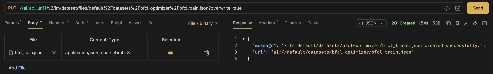

[OPTION END]

---

### Register Dataset Artifact

After all four files are uploaded to the same shared folder, register that folder as a single artifact. The optimizer reads all files from this artifact folder.

[OPTION BEGIN [Python SDK]]

```python
def get_or_create_artifact(name: str, folder_path: str, description: str) -> str:
    """Register folder as artifact. Returns artifact_id."""
    artifact_url = f"ai://{folder_path}"
    existing = client.ai_core_client.artifact.query(
        resource_group=resource_group, scenario_id=SCENARIO
    )
    for art in existing.resources:
        if art.url == artifact_url:
            print(f"  Reusing artifact [{name}]: {art.id}")
            return art.id
    resp = client.ai_core_client.artifact.create(
        name=name, kind=Artifact.Kind.DATASET,
        url=artifact_url, scenario_id=SCENARIO,
        resource_group=resource_group, description=description
    )
    print(f"  Created artifact [{name}]: {resp.id}")
    return resp.id
REMOTE_SUBFOLDER = "datasets/bfcl-optimizer"
print("Uploading files...")
shared_folder = upload_file(train_local,  REMOTE_SUBFOLDER, "bfcl_train.json")
upload_file(test_local,   REMOTE_SUBFOLDER, "bfcl_test.json")
upload_file(tools_local,  REMOTE_SUBFOLDER, "bfcl_tools.json")
upload_file(prompt_local, REMOTE_SUBFOLDER, "bfcl_prompt_template.json")
print(f"Shared folder: {shared_folder}")
optimizer_artifact_id = get_or_create_artifact(
    name="bfcl-optimizer-data",
    folder_path=shared_folder,
    description="BFCL train/test goldens, tools, and prompt template"
)
print(f"Artifact ID: {optimizer_artifact_id}")
```

💡 The helper checks for an existing artifact at the same URL before creating a new one, preventing duplicates across runs.


[OPTION END]

[OPTION BEGIN [Bruno]]

Register the shared upload folder as a single dataset artifact.

**Method:** `POST`

**URL:**
```
{{ai_api_url}}/v2/lm/artifacts
```

**Headers:**
```
Authorization: Bearer {{access_token}}
Content-Type: application/json
AI-Resource-Group: {{resource_group}}
```

**Body (JSON):**
```json
{
  "name": "bfcl-optimizer-data",
  "kind": "dataset",
  "url": "ai://default/datasets/bfcl-optimizer",
  "scenarioId": "genai-optimizations",
  "description": "BFCL train/test goldens, tools, and prompt template"
}
```

A successful response returns HTTP `201`:

```json
{
  "id": "<ARTIFACT_ID>",
  "name": "bfcl-optimizer-data",
  "message": "Artifact created successfully."
}
```

💡 Save the `id` — it is required as `artifactId` in the configuration step.


[OPTION END]

---

### Create and Register the Base Prompt Template

The base prompt template is pushed to the Prompt Registry. The optimizer uses this as the starting point and iteratively refines it to improve tool-calling accuracy.

[OPTION BEGIN [Python SDK]]

```python
def push_prompt(spec: PromptTemplateSpec, name: str, version: str, scenario: str):
    url  = f"{client.ai_core_client.base_url}/lm/promptTemplates"
    body = {"name": name, "version": version, "scenario": scenario, "spec": spec.model_dump()}
    res  = requests.post(
        url,
        headers={**client.request_header, "Content-Type": "application/json"},
        json=body
    )
    print(f"Prompt registry: {res.status_code} — {res.json().get('message', '')}")
    if res.status_code == 409:
        print("Prompt already exists — reusing.")
        return {"name": name, "version": version}
    res.raise_for_status()
    return res.json()

push_prompt(prompt, PROMPT_NAME, PROMPT_VERSION, SCENARIO)
```

A successful registration returns HTTP `200` with `"Prompt created successfully."`. A `409` means the prompt already exists from a previous run and is safe to ignore.

**Notes**

- The placeholder `{{?question}}` is automatically substituted with each record's `question` field during optimization.
- The resulting optimized prompt is saved back to the Prompt Registry under the name specified in `targetPromptMapping`.
- Ensure you use the same prompt name (`bfcl-tool-base`) in the optimization configuration.

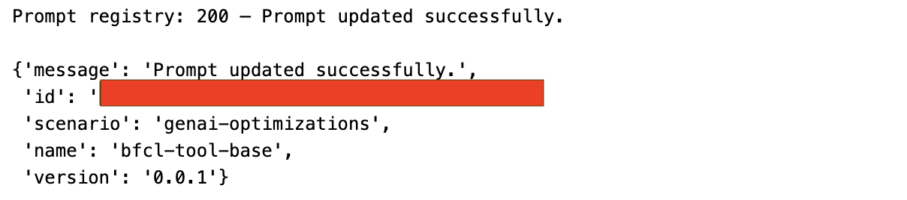

[OPTION END]

[OPTION BEGIN [Bruno]]

**Method:** `POST`

**URL:**
```
{{ai_api_url}}/v2/lm/promptTemplates
```

**Headers:**
```
Authorization: Bearer {{access_token}}
Content-Type: application/json
AI-Resource-Group: {{resource_group}}
```

**Body (JSON):**
```json
{
  "name": "bfcl-tool-base",
  "version": "0.0.1",
  "scenario": "genai-optimizations",
  "spec": {
    "template": [
      {
        "role": "system",
        "content": "You are a helpful assistant."
      },
      {
        "role": "user",
        "content": "PLACEHOLDER"
      }
    ]
  }
}
```

A successful response returns HTTP `200`:

```json
{
  "message": "Prompt updated successfully.",
  "id": "<PROMPT_ID>",
  "scenario": "genai-optimizations",
  "name": "bfcl-tool-base",
  "version": "0.0.1"
}
```

> **Note:** A `409 Conflict` means the prompt already exists in the registry — this is safe to ignore and you can proceed to the next step. If you receive a `500 Internal Server Error`, verify the `genai-optimizations` scenario is available in your tenant by calling `GET {{ai_api_url}}/v2/lm/scenarios`.

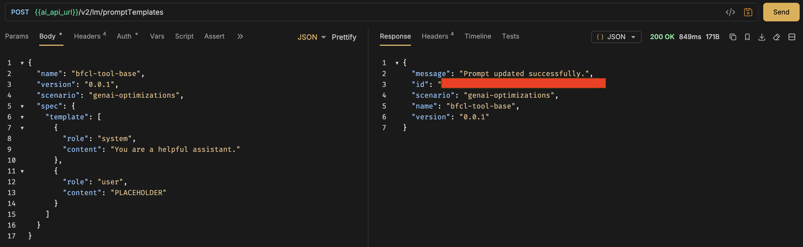

[OPTION END]

---

### Register an Optimization Configuration

The optimization configuration links all required inputs — the artifact, base prompt, reference model, target model, and metric — into one executable setup.

**Key Parameters**

| Parameter | Value | Description |
|---|---|---|
| `optimizationMetric` | `JSON_Match` | Metric used to evaluate tool call accuracy |
| `basePrompt` | `genai-optimizations/bfcl-tool-base:0.0.1` | Registered base prompt template |
| `baseModel` | `gpt-4o:2024-08-06` | Reference model used for evaluation |
| `targetModels` | `gemini-2.5-pro:001` | Target model to optimize the prompt for |
| `targetPromptMapping` | `gemini-2.5-pro:001=bfcl-tool-optimized-gemini25:0.0.1` | Output prompt name in the registry |
| `trainDataset` | `bfcl_train.json` | Train file name within the artifact folder |
| `testDataset` | `bfcl_test.json` | Test file name within the artifact folder |
| `maximize` | `true` | Maximize the metric score |
| `includeFewShotExamples` | `false` | Do not inject few-shot examples |

[OPTION BEGIN [Python SDK]]

```python
def create_config(
    metric: str,
    reference_model: str,
    targets: dict,
    train_filename: str,
    test_filename: str,
    prompt_artifact_id: str,
    prompt_name: str,
    prompt_version: str,
    scenario: str,
) -> str:
    base_prompt = f"{scenario}/{prompt_name}:{prompt_version}"

    input_parameters = [
        ParameterBinding(key="optimizationMetric",     value=metric),
        ParameterBinding(key="basePrompt",             value=base_prompt),
        ParameterBinding(key="baseModel",              value=reference_model),
        ParameterBinding(key="targetModels",           value=",".join(targets.keys())),
        ParameterBinding(
            key="targetPromptMapping",
            value=",".join(f"{k}={v}" for k, v in targets.items())
        ),
        ParameterBinding(key="trainDataset",           value=train_filename),
        ParameterBinding(key="testDataset",            value=test_filename),
        ParameterBinding(key="maximize",               value="true"),
        ParameterBinding(key="correctnessCutoff",      value="none"),
        ParameterBinding(key="includeFewShotExamples", value="false"),
        ParameterBinding(key="promptTemplateScope",    value="tenant"),
        ParameterBinding(key="prototypeMode",          value="false"),
        ParameterBinding(key="fieldEvaluationMetrics", value="none"),
        ParameterBinding(key="modelParams",            value="none"),
        ParameterBinding(key="customMetricId",         value="none"),
    ]

    input_artifacts = [
        InputArtifactBinding(key="prompt-data", artifact_id=prompt_artifact_id)
    ]

    params_dict = {p.key: p.value for p in input_parameters}

    # Check for existing config with identical parameters
    try:
        existing = client.ai_core_client.configuration.query(
            scenario_id=SCENARIO, resource_group=resource_group
        )
        for conf in existing.resources:
            if {p.key: p.value for p in conf.parameter_bindings} == params_dict:
                print(f"Reusing configuration: {conf.id}")
                return conf.id
    except Exception as e:
        print(f"Could not query configs: {e}")

    resp = client.ai_core_client.configuration.create(
        name="bfcl-tool-config",
        scenario_id=SCENARIO,
        executable_id=SCENARIO,
        resource_group=resource_group,
        parameter_bindings=input_parameters,
        input_artifact_bindings=input_artifacts,
    )
    print(f"Created configuration: {resp.id}")
    return resp.id

configuration_id = create_config(
    metric=METRIC,
    reference_model=REFERENCE_MODEL,
    targets=TARGET_MODELS,
    train_filename="bfcl_train.json",
    test_filename="bfcl_test.json",
    prompt_artifact_id=optimizer_artifact_id,
    prompt_name=PROMPT_NAME,
    prompt_version=PROMPT_VERSION,
    scenario=SCENARIO,
)
print(f"Configuration ID: {configuration_id}")
```

💡 Save the `configuration_id` — it is required in the next step to trigger the execution.

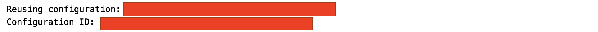

[OPTION END]

[OPTION BEGIN [Bruno]]

**Method:** `POST`

**URL:**
```
{{ai_api_url}}/v2/lm/configurations
```

**Headers:**
```
Authorization: Bearer {{access_token}}
Content-Type: application/json
Accept: application/json
AI-Resource-Group: {{resource_group}}
```

**Body (JSON):**
```json
{
  "name": "bfcl-tool-config",
  "scenarioId": "genai-optimizations",
  "executableId": "genai-optimizations",
  "parameterBindings": [
    { "key": "optimizationMetric",     "value": "JSON_Match" },
    { "key": "basePrompt",             "value": "genai-optimizations/bfcl-tool-base:0.0.1" },
    { "key": "baseModel",              "value": "gpt-4o:2024-08-06" },
    { "key": "targetModels",           "value": "gemini-2.5-pro:001" },
    { "key": "targetPromptMapping",    "value": "gemini-2.5-pro:001=bfcl-tool-optimized-gemini25:0.0.1" },
    { "key": "trainDataset",           "value": "bfcl_train.json" },
    { "key": "testDataset",            "value": "bfcl_test.json" },
    { "key": "maximize",               "value": "true" },
    { "key": "correctnessCutoff",      "value": "none" },
    { "key": "includeFewShotExamples", "value": "false" },
    { "key": "promptTemplateScope",    "value": "tenant" },
    { "key": "prototypeMode",          "value": "false" },
    { "key": "fieldEvaluationMetrics", "value": "none" },
    { "key": "modelParams",            "value": "none" },
    { "key": "customMetricId",         "value": "none" }
  ],
  "inputArtifactBindings": [
    { "key": "prompt-data", "artifactId": "<ARTIFACT_ID>" }
  ]
}
```

Replace `<ARTIFACT_ID>` with the `id` saved from the Register Dataset Artifact step.

A successful response returns HTTP `201`:

```json
{
  "id": "<CONFIGURATION_ID>",
  "message": "Configuration created successfully."
}
```

💡 Save the `id` — it is used in the next step to trigger the execution.

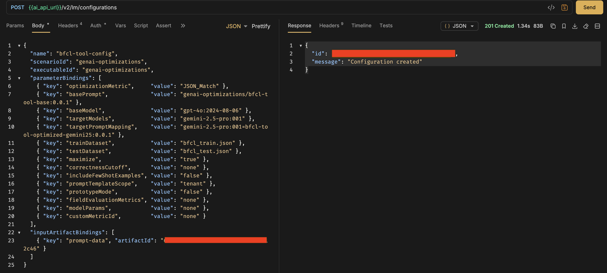

[OPTION END]

⚠️ **Note:** Model availability and versions (for example, `gpt-4o:2024-08-06`, `gemini-2.5-pro:001`) may vary across SAP AI Core tenants. Always verify available models in Generative AI Hub → Models before use.  
For the latest updates, refer to [SAP Note 3437766](https://me.sap.com/notes/3437766) – Model Availability and Support for Generative AI Hub.

---

### Run the Prompt Optimization Execution

After registering the configuration, trigger the optimization run. The optimizer iteratively refines the base prompt using the train goldens and evaluates candidate prompts against the test goldens using the `JSON_Match` metric.

[OPTION BEGIN [Python SDK]]

```python
execution = client.ai_core_client.execution.create(
    configuration_id=configuration_id,
    resource_group=resource_group,
)
execution_id = execution.id
print(f"Execution ID: {execution_id}")
```


[OPTION END]

[OPTION BEGIN [Bruno]]

**Method:** `POST`

**URL:**
```
{{ai_api_url}}/v2/lm/executions
```

**Headers:**
```
Authorization: Bearer {{access_token}}
Content-Type: application/json
Accept: application/json
AI-Resource-Group: {{resource_group}}
```

**Body (JSON):**
```json
{
  "configurationId": "<CONFIGURATION_ID>"
}
```

Replace `<CONFIGURATION_ID>` with the `id` saved from the previous step.

A successful response returns HTTP `202`:

```json
{
  "id": "<EXECUTION_ID>",
  "message": "Execution scheduled",
  "status": "UNKNOWN",
  "targetStatus": "COMPLETED"
}
```

💡 `status: UNKNOWN` and `message: Execution scheduled` is the expected starting state — the job has been accepted and queued. Save the `id` and proceed to monitor progress.

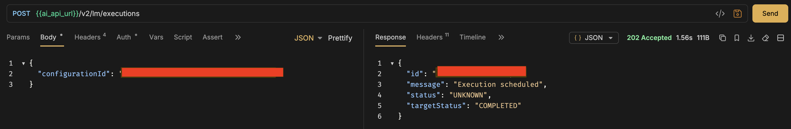

[OPTION END]

---

### Monitor and View Optimization Progress

After triggering the execution, monitor its status until it reaches `COMPLETED`. The execution transitions through `UNKNOWN` → `RUNNING` → `COMPLETED`.

[OPTION BEGIN [Python SDK]]

```python
TERMINAL_STATES = {"COMPLETED", "FAILED", "DEAD", "STOPPED"}

while True:
    status = client.ai_core_client.execution.get(
        execution_id=execution_id, resource_group=resource_group
    )
    # Safely convert enum to string
    status_str = status.status.value if hasattr(status.status, "value") else str(status.status)
    print(f"[{time.strftime('%H:%M:%S')}] {status_str}", end="")

    if hasattr(status, "status_details") and status.status_details:
        progress = status.status_details.get("progress", "")
        print(f"  progress={progress}", end="")
    print()

    if status_str in TERMINAL_STATES:
        if status_str != "COMPLETED":
            try:
                logs = client.ai_core_client.execution.get_logs(
                    execution_id=execution_id, resource_group=resource_group
                )
                print("── Execution logs ──")
                for log in logs.data:
                    print(log.msg)
            except Exception as e:
                print(f"Could not fetch logs: {e}")
        break

    time.sleep(30)

print(f"\nFinal status: {status_str}")
```


[OPTION END]

[OPTION BEGIN [Bruno]]

Poll the following request every 30 seconds until `status` is `COMPLETED`.

**Method:** `GET`

**URL:**
```
{{ai_api_url}}/v2/lm/executions/<EXECUTION_ID>
```

**Headers:**
```
Authorization: Bearer {{access_token}}
AI-Resource-Group: {{resource_group}}
```

The status transitions through the following states:

| Status | Meaning |
|---|---|
| `UNKNOWN` | Execution queued, not yet picked up |
| `RUNNING` | Optimization actively running |
| `COMPLETED` | Optimization finished successfully |
| `FAILED` / `DEAD` | Execution encountered an error |

**Expected final response:**

```json
{
  "id": "<EXECUTION_ID>",
  "status": "COMPLETED",
  "scenarioId": "genai-optimizations",
  "configurationId": "<CONFIGURATION_ID>",
  "targetStatus": "COMPLETED",
  "submissionTime": "2025-11-06T06:48:53Z",
  "startTime": "...",
  "completionTime": "..."
}
```

> **Note:** The optimization typically takes 20–30 minutes to complete. If you receive `FAILED` or `DEAD`, verify the artifact ID in the configuration is correct and all four files were uploaded successfully.

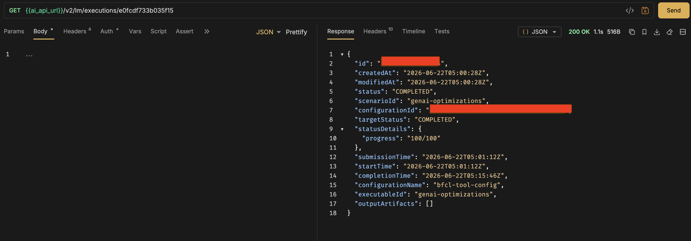

[OPTION END]

---

### Review Optimization Results

Once the execution completes, the optimized prompt is stored in the Prompt Registry under the name you specified in `targetPromptMapping`. Retrieve it to inspect how the optimizer refined the base prompt.

[OPTION BEGIN [Python SDK]]

List all prompt templates and find the optimized one:

```python
url = f"{client.ai_core_client.base_url}/lm/promptTemplates"
res = requests.get(url, headers=client.request_header)
templates = res.json()
for t in templates.get("resources", []):
    print(f"  name={t['name']}  version={t['version']}  id={t['id']}")
```

Fetch the full optimized prompt by its ID:

```python
optimized_id = "<OPTIMIZED_PROMPT_ID>"
url = f"{client.ai_core_client.base_url}/lm/promptTemplates/{optimized_id}"
res = requests.get(url, headers=client.request_header)
optimized = res.json()
print(json.dumps(optimized, indent=2))
```

Look for the entry `name=bfcl-tool-optimized-gemini25  version=0.0.1`. The optimized system prompt will be significantly more detailed than the base `"You are a helpful assistant."` — it will contain strict JSON output rules, tool schemas, normalization instructions, and reasoning steps tailored specifically for Gemini 2.5 Pro's tool-calling behavior.

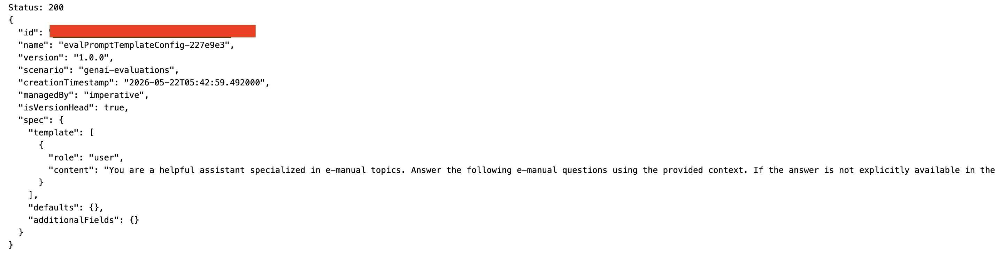

[OPTION END]

[OPTION BEGIN [Bruno]]

**List all prompt templates:**

**Method:** `GET`

**URL:**
```
{{ai_api_url}}/v2/lm/promptTemplates
```

**Headers:**
```
Authorization: Bearer {{access_token}}
AI-Resource-Group: {{resource_group}}
```

Look for the optimized prompt in the response with `name=bfcl-tool-optimized-gemini25` and `version=0.0.1`. Note down its `id`.

**Fetch the full optimized prompt by ID:**

**Method:** `GET`

**URL:**
```
{{ai_api_url}}/v2/lm/promptTemplates/<OPTIMIZED_PROMPT_ID>
```

**Headers:**
```
Authorization: Bearer {{access_token}}
AI-Resource-Group: {{resource_group}}
```

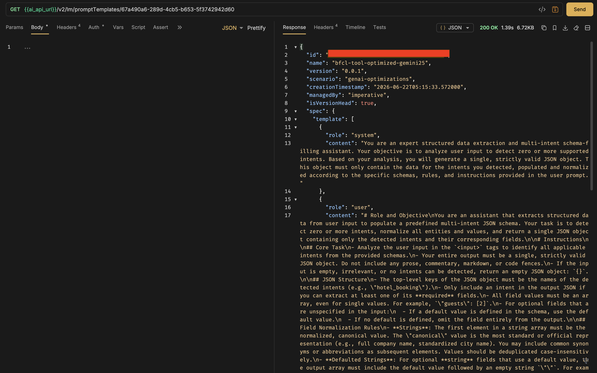

[OPTION END]

---

### Compare Base vs Optimized Prompt via Orchestration Service

After retrieving both prompt templates, use the Orchestration Service to run live inference and compare output quality between the base and optimized prompts.

[OPTION BEGIN [Python SDK]]


# Find the running orchestration deployment URL
```python
url = f"{client.ai_core_client.base_url}/lm/deployments"
res = requests.get(url, headers=client.request_header)
for d in res.json().get("resources", []):
    print(f"id={d.get('id')}  scenario={d.get('scenarioId'):30s}  status={d.get('status'):10s}  url={d.get('deploymentUrl')}")
```

```python
from gen_ai_hub.orchestration.models.llm import LLM
from gen_ai_hub.orchestration.models.message import SystemMessage, UserMessage
from gen_ai_hub.orchestration.models.template import Template, TemplateValue
from gen_ai_hub.orchestration.models.config import OrchestrationConfig
from gen_ai_hub.orchestration.service import OrchestrationService

# ── Step 1: Fetch both prompt templates from the registry ─────────────────────
def get_prompt_template(template_id: str) -> dict:
    url = f"{client.ai_core_client.base_url}/lm/promptTemplates/{template_id}"
    res = requests.get(url, headers=client.request_header)
    res.raise_for_status()
    return res.json()

def extract_messages(template: dict) -> dict:
    messages = {}
    for msg in template.get("spec", {}).get("template", []):
        messages[msg["role"]] = msg["content"]
    return messages

# Look up IDs by name from the registry
url = f"{client.ai_core_client.base_url}/lm/promptTemplates"
res = requests.get(url, headers=client.request_header)
all_templates = {
    f"{t['name']}:{t['version']}": t["id"]
    for t in res.json().get("resources", [])
}

base_id      = all_templates.get("bfcl-tool-base:0.0.1")
optimized_id = all_templates.get("bfcl-tool-optimized-gemini25:0.0.1")

base_template      = get_prompt_template(base_id)
optimized_template = get_prompt_template(optimized_id)

base_messages      = extract_messages(base_template)
optimized_messages = extract_messages(optimized_template)

print("✅ Loaded base and optimized prompt templates.")
print(f"Base system prompt      : {base_messages['system'][:80]}...")
print(f"Optimized system prompt : {optimized_messages['system'][:80]}...")


# ── Step 2: run_inference using OrchestrationService ────────────────────────
# Paste your orchestration deployment URL here
ORCHESTRATION_DEPLOYMENT_URL = ""

def run_inference(system_prompt: str, user_template: str, question: str, model_name: str) -> str:
    user_content = user_template.replace("{{?question}}", question)

    config = OrchestrationConfig(
        llm=LLM(name=model_name),
        template=Template(messages=[
            SystemMessage(system_prompt),
            UserMessage(user_content),
        ]),
    )

    service  = OrchestrationService(api_url=ORCHESTRATION_DEPLOYMENT_URL, config=config)
    response = service.run()
    return response.module_results.llm.choices[0].message.content
# ── Step 3: Compare prompts ───────────────────────────────────────────────────
def clean_json_output(text: str) -> str:
    """Strip markdown code fences that models sometimes wrap around JSON."""
    text = text.strip()
    if text.startswith("```"):
        lines = text.split("\n")
        lines = [l for l in lines if not l.strip().startswith("```")]
        text = "\n".join(lines).strip()
    return text


def compare_prompts(question: str, model_name: str = "gemini-2.5-pro"):
    print("\n" + "=" * 70)
    print(f"QUESTION:\n{question}")
    print("=" * 70)

    print("\n📌 BASE PROMPT OUTPUT:")
    print("-" * 40)
    try:
        base_output = run_inference(
            system_prompt=base_messages["system"],
            user_template=base_messages["user"],
            question=question,
            model_name=model_name,
        )
        print(base_output)
    except Exception as e:
        base_output = f"ERROR: {e}"
        print(base_output)

    print("\n✅ OPTIMIZED PROMPT OUTPUT:")
    print("-" * 40)
    try:
        optimized_output = run_inference(
            system_prompt=optimized_messages["system"],
            user_template=optimized_messages["user"],
            question=question,
            model_name=model_name,
        )
        print(optimized_output)
    except Exception as e:
        optimized_output = f"ERROR: {e}"
        print(optimized_output)

    print("\n📊 COMPARISON:")
    print("-" * 40)
    for label, output in [("BASE", base_output), ("OPTIMIZED", optimized_output)]:
        cleaned = clean_json_output(output)
        try:
            parsed = json.loads(cleaned)
            tools  = list(parsed.keys())
            print(f"{label:12s} → valid JSON ✅ | tools called: {tools}")
        except json.JSONDecodeError:
            print(f"{label:12s} → invalid JSON ❌ | raw: {output[:120]}")

    print("\n📈 VERDICT:")
    print("-" * 40)
    base_valid      = True
    optimized_valid = True
    try:
        json.loads(clean_json_output(base_output))
    except Exception:
        base_valid = False
    try:
        json.loads(clean_json_output(optimized_output))
    except Exception:
        optimized_valid = False

    if not base_valid and optimized_valid:
        print("🏆 Optimization WIN — base gave prose, optimized gave structured JSON")
    elif base_valid and optimized_valid:
        print("✅ Both valid JSON — compare tool accuracy above")
    elif base_valid and not optimized_valid:
        print("⚠️  Base was valid but optimized was not — check prompt")
    else:
        print("❌ Both invalid — check model or deployment")

    return base_output, optimized_output


# ── Step 4: Run all comparisons ───────────────────────────────────────────────
compare_prompts("What is the weather in Tokyo for the next 3 days in celsius?")

compare_prompts(
    "I have 2000 euros and want to know how much that is in USD. "
    "Also find me a mid-range Italian restaurant in Milan. "
    "And what is Apple's current stock price?"
)

compare_prompts(
    "Book a hotel in Paris for 2 guests from 2025-08-01 to 2025-08-05 "
    "in a deluxe room. Also check the weather in Paris for the next 7 days "
    "in celsius. And find me the distance from Paris to Lyon in km."
)

compare_prompts(
    "Convert 5000 US dollars to Japanese yen. "
    "Find concerts in New York tomorrow. "
    "Search for vegan pasta recipes under 30 minutes."
)
```

A typical result showing optimization WIN:

```
BASE         → invalid JSON ❌ | raw: Of course! I can help with all three of your requests...
OPTIMIZED    → valid JSON ✅ | tools called: ['currency_conversion', 'restaurant_search', 'get_stock_info']

📈 VERDICT:
🏆 Optimization WIN — base gave prose, optimized gave structured JSON
```

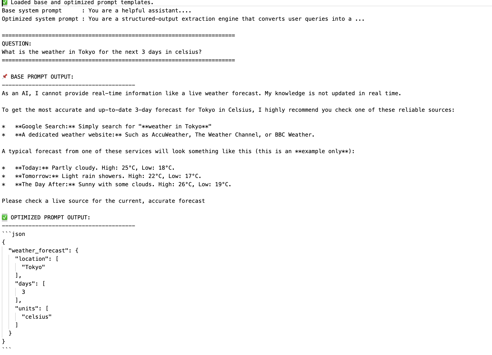

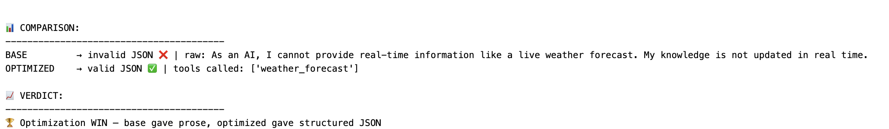
[OPTION END]

[OPTION BEGIN [Bruno]]

First create an orchestration configuration and deployment if you do not already have one running.

**Create Orchestration Configuration**

**Method:** `POST`

**URL:**
```
{{ai_api_url}}/v2/lm/configurations
```

**Headers:**
```
Authorization: Bearer {{access_token}}
Content-Type: application/json
AI-Resource-Group: {{resource_group}}
```

**Body (JSON):**
```json
{
  "name": "orchestration-config",
  "executableId": "orchestration",
  "scenarioId": "orchestration"
}
```

**Create Orchestration Deployment**

**Method:** `POST`

**URL:**
```
{{ai_api_url}}/v2/lm/deployments
```

**Body (JSON):**
```json
{
  "ttl": "24H",
  "configurationId": "<ORCHESTRATION_CONFIG_ID>"
}
```

Poll `GET {{ai_api_url}}/v2/lm/deployments/<DEPLOYMENT_ID>` until `status` is `RUNNING`. Save the `deploymentUrl` as `orchestration_service_url`.

**Run Inference with Optimized Prompt**

**Method:** `POST`

**URL:**
```
{{orchestration_service_url}}/completion
```

**Headers:**
```
Authorization: Bearer {{access_token}}
Content-Type: application/json
AI-Resource-Group: {{resource_group}}
```

**Body (JSON):**
```json
{
  "orchestration_config": {
    "module_configurations": {
      "templating_module_config": {
        "template": [
          {
            "role": "system",
            "content": "<paste optimized system prompt here>"
          },
          {
            "role": "user",
            "content": "{{ ?question }}"
          }
        ],
        "defaults": {
          "question": "What is the weather in Tokyo for the next 3 days in celsius?"
        }
      },
      "llm_module_config": {
        "model_name": "gemini-2.5-pro",
        "model_params": {},
        "model_version": "001"
      }
    }
  },
  "input_params": {
    "question": "What is the weather in Tokyo for the next 3 days in celsius?"
  }
}
```

Run the same request a second time with `"content": "You are a helpful assistant."` as the system prompt to compare the base prompt output side by side.

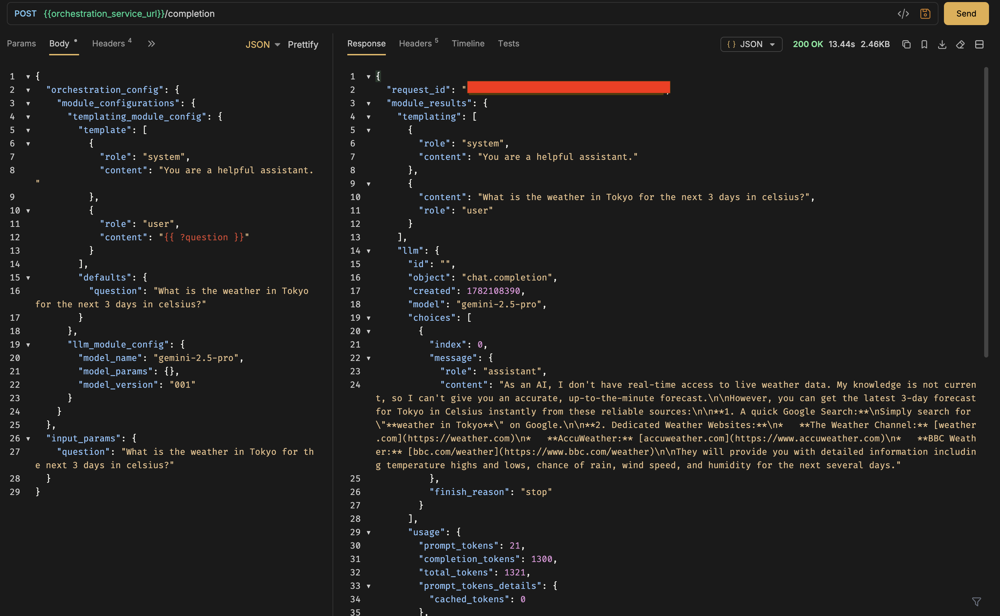


[OPTION END]

---

### Summary

In this tutorial, you completed the following steps to optimize a function-calling prompt using SAP AI Core with a BFCL v3 dataset:

1. **Loaded and normalized the BFCL v3 dataset** — using a robust multi-format reader and normalizing tool definitions to OpenAI ChatCompletions format.
2. **Split the dataset** into 25 train goldens and 15 test goldens, and built a union of all tool definitions across samples.
3. **Uploaded four files** (train, test, tools, prompt template) to a shared folder in AI Core's built-in dataset storage via the `/lm/dataset/files` endpoint.
4. **Registered a dataset artifact** linking the shared folder to the `genai-optimizations` scenario.
5. **Pushed the base prompt template** (`bfcl-tool-base:0.0.1`) to the Prompt Registry.
6. **Created an optimization configuration** with 15 parameter bindings including the `JSON_Match` metric, reference model (`gpt-4o:2024-08-06`), and target model (`gemini-2.5-pro:001`).
7. **Triggered and monitored the execution** — tracking progress from `UNKNOWN` through `RUNNING` to `COMPLETED`.
8. **Retrieved the optimized prompt** (`bfcl-tool-optimized-gemini25:0.0.1`) from the Prompt Registry.
9. **Compared base vs optimized prompts** via live inference through the Orchestration Service — confirming the optimization WIN where the base returned prose and the optimized prompt returned structured JSON tool calls.
