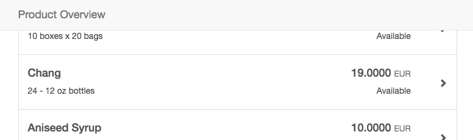
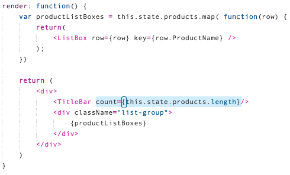
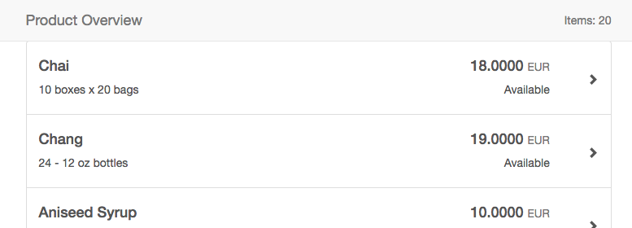
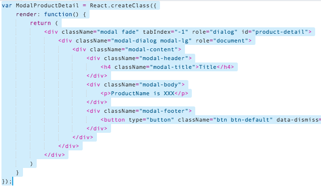
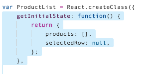
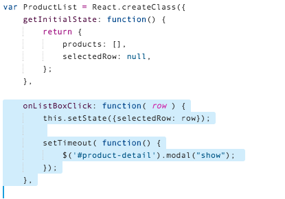
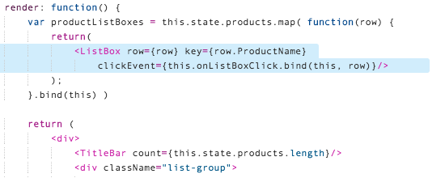
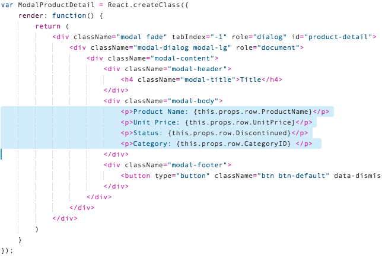
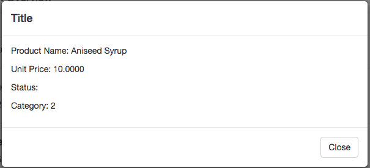

## Prerequisites  
 - **Proficiency:** Beginner 
 - **Tutorial:** [Step 6 - Add REST OData retrieval](http://www.sap.com/developer/tutorials/react-add-odata.html)

## Next Steps
 - **Tutorial:** [Step 8 - Create child components](http://www.sap.com/developer/tutorials/react-child-components.html)


## Details
### You will learn  
In this tutorial series, we will explore another technology for Single Page Application (SPA) development - React.  React is another popular web framework, and is used by many companies for both internal and client-facing systems.  These tutorials will parallel our SAPUI5 tutorials, building a visual interface using Angular, and connecting it to an OData back end service.

### Time to Complete
**20 Min**.

---

#### REACT tutorial series
**Step 7**: Extend the current application in two areas:  First, add a header to the list of products.  The header will eventually contain dynamic items for the entire list.  Second, add a modal dialog box with product details.  When the user clicks on a row, the application will show this detail.

These are the steps:

1.  Add a header component to the list
2.  Add a dialog box with product details
 
---

### Add a header component to the list

The list on the screen is nice, but it would be better if it had a header describing the data below.  We can add that header bar using Bootstrap to create bar, and a new REACT component to hold the HTML and code. 

1.  Open the `main.js` file, and add the following REACT component at the very top (above the `ListBox` component):

    ```javascript
    var TitleBar = React.createClass({
    	render: function() {
    		return (
    			<nav className="navbar navbar-default navbar-fixed-top">
    				<div className="container">
    					<div className="navbar-header">
    						<div className="navbar-brand">Product Overview</div>
    					</div>
    				</div>
    			</nav>	
    		)	
    	}
    });
    ```
    
    

2.  To display the new `TitleBar` component, add it to the `ProductList` component below.  

    **Replace** the JavaScript in to the `render` function with this new code:
    
    ```javascript
    <div>
        <TitleBar />
        <div className="list-group">
            {productListBoxes}
        </div>
    </div>
    ```

    > **NOTE**
    >
    > Why did we add an additional `<div>` tag around everything?  
    >
    > HTML elements, like XML, use a tree hierarchy.  Normally, you can have several elements at the same level.  But, there is always a single **outer** element that encapsulates everything.  The same thing is true with the JMX pre-processor.  Every section of JMX code must be wrapped in a single outer element.
    >
    > In this case, we use a blank `<div>` tag as our outermost element.

    

3.  Run the application.  The navigation bar appears at the top.

    Unfortunately, that navigation bar covers the first row of the list.

    

4.  To fix the title bar, so it no longer covers the list, modify the CSS file to push the list down the screen.  

    Open your `main.css` file, and this CSS to the top.  (Don't forget to save!)
        
    ```css
    body {
       padding-top: 50px;
    }
    ```
    
    
    
5.  Run the application.  The header should now appear at the top, and the first row directly beneath.

    

6.  Now that the header bar is in place, we can add additional dynamic content to it.  Start by adding a count of the number of products displayed.  

    Open your `main.js` file again, and scroll to the `TitleBar` component.  Add the following JavaScript JMX to the `render` method, inside the `<div className="container">` section:
    
    
    ```javascript
    <div className="nav navbar-nav navbar-right">
        <p className="navbar-text">Items: {this.props.count}</p>
    </div>
    ```

    

7.  To send the data from the application to the `TitleBar`, modify the `ProductList` component.  **Add** the following property to the `<TitleBar />` component:

    ```javascript
    count={this.state.products.length}
    ```

    > The `length` property is a JavaScript property found on every array.
    
    
    
8.  Run the application, and you will see the item count in the navigation bar.

    


---

### Add a dialog box with product details

When you click on a product, the application should respond with the details of that product.  In this example, and to showcase the Bootstrap options, a [modal dialog box]((https://getbootstrap.com/javascript/#modals)) will be used to display product details.


1.  First, we need to add a [Bootstrap Modal dialog box](https://getbootstrap.com/javascript/#modals) to our HTML page.  

    > A modal dialog box looks complicated, but it's not.  It's broken up in to three sections:  the header, the body, and the footer.  We will add the HTML for all three at the same time, and then modify it.
    > 
    > Like all other REACT components, this dialog box will be part of the JavaScript code as a REACT component.  
    
    To start, open the `main.js` file and add the following JavaScript component to the top of the file:
    
    ```javascript
    var ModalProductDetail = React.createClass({
        render: function() {
            return (
                <div className="modal fade" tabIndex="-1" role="dialog" id="product-detail">
                	<div className="modal-dialog modal-lg" role="document">
                		<div className="modal-content">
                			<div className="modal-header">
                				<h4 className="modal-title">Title</h4>
                			</div>
                			<div className="modal-body">
                				<p>Modal body</p>
                			</div>
                			<div className="modal-footer">
                				<button type="button" className="btn btn-default" data-dismiss="modal">Close</button>
                			</div>
                		</div>
                	</div>
                </div>
            )
        }
    });
    ```
    
    
    
2.  Next, add the code to handle the event, and open the dialog box.

    > In order to activate the modal when the row is clicked, the REACT code requires two things.  First, a function is defined to handle the event call.  Second, the corresponding tag for the event is linked to the JavaScript function.  
    >
    > The exact location of these two elements is a little tricky.  In order to have a single modal that handles all rows, the dialog box is defined in the `ProductList` component.  So the method that handles the modal, and assigns the values to the modal, should be at the `ProductList` level.
    > 
    > The link to the browser event, however, is in the `<button>` tag.  This tag is defined in the `ListBox` element.  
    > 
    > To hook the two together, we will create the function to handle the event, and then pass a pointer to this function down to each `ListBox` element.  

    First, the selected product must be stored in the component state.  We will define this in `getInitialState`.  In the `main.js` file, scroll to the `ProductList` component, and **replace** the `getInitialState:` attribute with this new code:
    
    ```javascript
    getInitialState: function() {
    	return {
    		products: [],
    		selectedRow: null,
    	};
    },
    ```
    
    

3.  Second, create a function to handle the click event on a row.  This function will set the state, and then open the modal.  

    After the `getInitialState:` code, **add** the following JavaScript:
    
    ```javascript
    onListBoxClick: function( row ) {
        this.setState({selectedRow: row});
        
        setTimeout( function() {
        	$('#product-detail').modal("show");
        });
    },
    ```

    > **Set Timeout?**  To make our modal work, the REACT code needs to do the following:  handle the click event, then render the modal, then display the modal.  In the click event, above, the state of the component is changed.  This will trigger a render event in REACT.  After that render event is completed, the dialog box should be displayed.
    >
    > In order to place the "display" part of that work at the very end of the processing chain, use the JavaScript `setTimeout()` method.  This places the function in to the event queue, at the end.  After all the other work is done, this event will be processed.  Then the modal will be shown.

    


4.  Third, pass the click handler event on to the `ListBox` component.  Scroll to the `render:` event in the `ProductList` component, and **replace** the `<ListBox />` JMX with the following code:

    ```javascript
    <ListBox row={row} key={row.ProductName} clickEvent={this.onListBoxClick.bind(this, row)}/>
    ```

    > This is a good example of the `bind()` JavaScript method.  The bind method attaches additional variables to the clickEvent.  This allows us to pass the current row to the clickEvent directly.
    
    
    
5.  Fourth, the `ModalProductDetail` component should be added to the web page.

    > The modal dialog box has one problem.  If there is no current row selected, all the fields that should be displayed are not defined.  It is possible to modify the `ModalProductDetail` box with lots of if/then checks to avoid any undefined variable warnings.  
    >
    > The easier way is to only render the component if there is a valid value for the current row.  This is easy to do.  Simply place a ternary operator in the row that displays the `ModalDialogBox`
    
    Scroll down to the `return(` section of the `render:` method, and add the following JavaScript code before the final `</div>` tag.
    
    ```javascript
    {this.state.selectedRow == null ? null : <ModalProductDetail row={this.state.selectedRow} /> }
    ```
    
    
    
6.  Now, the data is being sent to the `ModalProductDetail` component.  The only remaining step is to display the data inside the modal box.

    Scroll up to the `ModalProductDetail` component, and replace the text inside the `<div className="modal-body">` section with the following new JMX:
    
    ```javascript
    <p>Product Name: {this.props.row.ProductName}</p>
    <p>Unit Price: {this.props.row.UnitPrice}</p>
    <p>Status: {this.props.row.Discontinued}</p>
    <p>Category: {this.props.row.CategoryID} </p> 
    ```

    
    
    
7.  Run the application.  Click on a row, and the dialog box will display with the product information for that row inside.

    


It doesn't look great, yet.  The next tutorial will update the modal with a Bootstrap Form, and make it much more presentable. 
    
  
---  
   
## Additional Information

#### Bootstrap

- [`navbar`](https://getbootstrap.com/components/#navbar) - Put a navigation bar on the page
- [`modal`](https://getbootstrap.com/javascript/#modals) - to display a modal dialog.

#### JavaScript

- [Using the `setTimeout()` method](http://www.w3schools.com/jsref/met_win_settimeout.asp)
- [Adding additional parameters with the `bind()` method](https://developer.mozilla.org/en-US/docs/Web/JavaScript/Reference/Global_Objects/Function/bind)

---

## Final Code

The only file modified was `main.js`.  This it the final code:

```javascript
var ModalProductDetail = React.createClass({
	render: function() {
		return (
			<div className="modal fade" tabIndex="-1" role="dialog" id="product-detail">
				<div className="modal-dialog modal-lg" role="document">
					<div className="modal-content">
						<div className="modal-header">
							<h4 className="modal-title">Title</h4>
						</div>
						<div className="modal-body">
							<p>Product Name: {this.props.row.ProductName}</p>
							<p>Unit Price: {this.props.row.UnitPrice}</p>
							<p>Status: {this.props.row.Discontinued}</p>
							<p>Category: {this.props.row.CategoryID} </p>
						</div>
						<div className="modal-footer">
							<button type="button" className="btn btn-default" data-dismiss="modal">Close</button>
						</div>
					</div>
				</div>
			</div>
		)
	}
});

var TitleBar = React.createClass({
	render: function() {
		return (
			<nav className="navbar navbar-default navbar-fixed-top">
				<div className="container">
					<div className="navbar-header">
						<div className="navbar-brand">Product Overview</div>
					</div>
					
					<div className="nav navbar-nav navbar-right">
						<p className="navbar-text">Items: {this.props.count}</p>
					</div>
				</div>
			</nav>	
		)	
	}
});

var ListBox = React.createClass({
    render: function() {
        return (
			<button type="button" className="list-group-item" id="product-list" 
					onClick={this.props.clickEvent} >
				<div className="row vertical-align">
					<div className="col-sm-8 top">
						<h4>{this.props.row.ProductName}</h4>
						<p> {this.props.row.QuantityPerUnit}</p>
					</div>
					<div className="col-sm-3 text-right top">
						<h4>
							{this.props.row.UnitPrice}
							<small className="text-muted"> EUR</small>
						</h4>
						<p>{this.props.row.Discontinued ? "Discontinued" : "Available"}</p>
					</div>
					<div className="col-sm-1 center">
						<span className="glyphicon glyphicon-chevron-right pull-right" aria-hidden="true"></span>
					</div>
				</div>
			</button>
		);
    }
});

var ProductList = React.createClass({
	getInitialState: function() {
		return {
			products: [],
			selectedRow: null,
		};
	},

	onListBoxClick: function( row ) {
		this.setState({selectedRow: row});
		
		setTimeout( function() {
			$('#product-detail').modal("show");	
		});
	},
	
	componentDidMount: function() {
		var odataUrl = "/Northwind/V3/Northwind/Northwind.svc/";
		
		$.ajax({
			url: odataUrl + "Products" ,
			dataType: 'json',
			cache: false
		})
		.done( function( data, textStatus, jqXHR ) {
				this.setState( {products: data.value } )
			}.bind(this)
		)
		.fail( function( jqXHR, textStatus, errorThrown ) {
			console.log("Error", jqXHR, textStatus, errorThrown );
			alert( "An arror occurred while retrieving data from the server: " + textStatus );
		});
	},
  
	render: function() {
		var productListBoxes = this.state.products.map( function(row) {
			return(
				<ListBox row={row} key={row.ProductName} 
					clickEvent={this.onListBoxClick.bind(this, row)}/>		
			);
		}.bind(this) )

		return (
			<div>
				<TitleBar count={this.state.products.length}/>
				<div className="list-group">
					{productListBoxes}
				</div>
				{this.state.selectedRow == null ? null : 
					<ModalProductDetail row={this.state.selectedRow} /> }
			</div>
		)
	}	
});

ReactDOM.render(
    <ProductList />,
    document.getElementById('product-list')
);
```

## Next Steps
 - **Tutorial:** [Step 8 - Create child components](http://www.sap.com/developer/tutorials/react-child-components.html)
