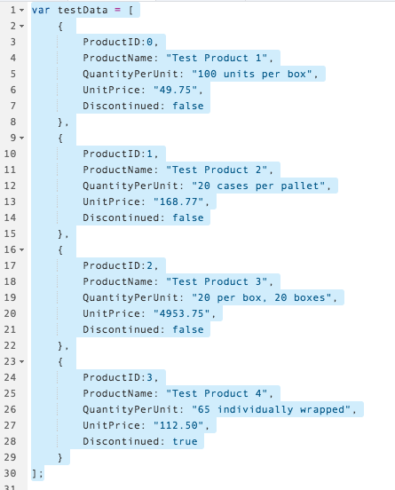
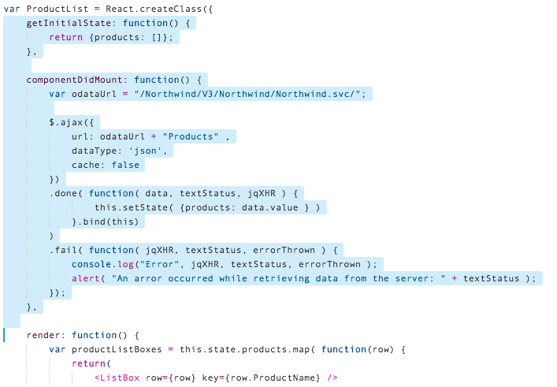
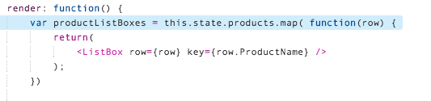
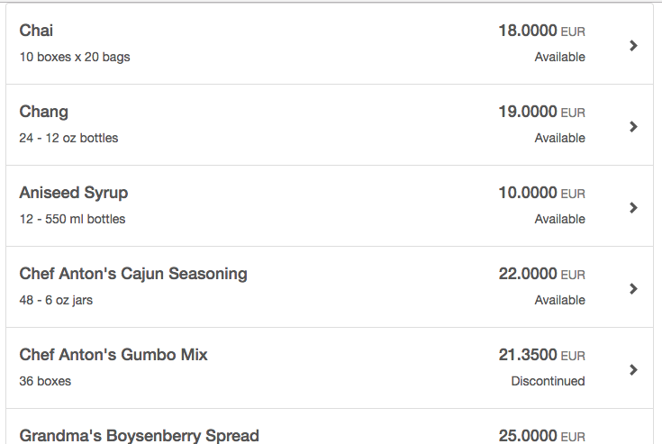

## Prerequisites  
 - **Proficiency:** Beginner 
 - **Northwind Destination** [Set up the Northwind service destination in the HCP cockpit](http://www.sap.com/developer/tutorials/hcp-create-destination.html)
 - **Tutorial:** [Step 5 - Convert components from static to dynamic](http://www.sap.com/developer/tutorials/react-dynamic-components.html)

## Next Steps
 - **Tutorial:** [Step 7 - Add a header and a detail modal dialog](http://www.sap.com/developer/tutorials/react-add-header-detail-dialog.html)


## Details
### You will learn  
In this tutorial series, we will explore another technology for Single Page Application (SPA) development - React.  React is another popular web framework, and is used by many companies for both internal and client-facing systems.  These tutorials will parallel our SAPUI5 tutorials, building a visual interface using Angular, and connecting it to an OData back end service.

### Time to Complete
**10 Min**.

---

#### REACT tutorial series
**Step 6**: Convert the React components to pull data from a web based [OData reference](http://www.odata.org/odata-services/) service.  The data source is called `Northwind`, and appears under the `ODAta v3` tab.  

**NOTE** If you have not yet set up the Northwind destination in the HANA Cloud Platform cockipt, you must do that first.  Follow the steps below, in the *Warning* dialog box, to make sure this is set up correctly.

The steps for this tutorial are:

1.  Configure the Northwind Test data in Web IDE
2.  Change the test data to the OData source
 
---

### Configure the Northwind Test data in Web IDE.

> Warning
> 
> If you have not configured the Northwind service in HANA Cloud Platform, you must do that first.  To verify that you have configured HANA Cloud Platform correctly, do the following:
> 
> - Open a new browser page to the **[HANA Cloud Platform Cockpit](https://account.hanatrial.ondemand.com/cockpit)**
> - In the right hand navigation, select **Connectivity**, then select **Destinations**
> - Look for the Destination called `Northwind`.
> 
> If you do not see a Destination called `Northwind`, go to the **[Create a Destination](http://www.sap.com/developer/tutorials/hcp-create-destination.html)** tutorial.  When you are finished, return here.
> 

1.  Create a new file in your project.  Select the `HelloReact` project, and then right click.  Choose **New** --> **File**.

    

2. Enter the name `neo-app.json`, and then click OK.

    

    > **IMPORTANT**
    > 
    > The new file should be in the `HelloAngular` directory, as shown here:
    > 
    > 
    > 

3.  Add the following code to the `neo-app.json` file, and then click **Save**

    ```xml
    {
    	"routes": [{
    		"path": "/Northwind",
    		"target": {
    			"type": "destination",
    			"name": "Northwind"
    		},
    		"description": "Northwind ODATA service"
    	}]
    }
    ```
    
    

---

### Change the test data to the OData source

1.  Remove the test data from the JavaScript file.

    In the `main.js` file, select all of the test data (starting with `var testData =`, and delete it.
    
    >Don't forget to save your file.
 
       
    
2.  Scroll down to the `ProductList` component.  This component will set the initial state to an empty array.  After it is placed on the screen, it will call the OData server and request the information.  When that information comes back, this component will then update the list.

    **Add** the following JavaScript code to the top of the `ProductList` component:
    
    ```javascript
    getInitialState: function() {
    	return {products: []};
    },
    
    componentDidMount: function() {
    	var odataUrl = "/Northwind/V3/Northwind/Northwind.svc/";
    	
    	$.ajax({
    		url: odataUrl + "Products" ,
    		dataType: 'json',
    		cache: false
    	})
    	.done( function( data, textStatus, jqXHR ) {
    			this.setState( {products: data.value } )
    		}.bind(this)
    	)
    	.fail( function( jqXHR, textStatus, errorThrown ) {
    		console.log("Error", jqXHR, textStatus, errorThrown );
    		alert( "An error occurred while retrieving data from the server: " + textStatus );
    	});
    },
    ```

    

3.  Next, update the `render:` function, to use the new state data.

    select the line `var productListBoxes = testData.map( function(row) {` and **replace** it with:

    ```javascript
    var productListBoxes = this.state.products.map( function(row) {
    ```

    

4.  Run your application.  20 rows of data should be displayed, coming from the OData test server.

    


---

## Additional Information

#### jQuery functions

- [AJAX functions](https://api.jquery.com/jquery.ajax/) - to retrieve the data from the OData server

#### Northwind OData test service

- This tutorial uses the demo data available on <http://www.odata.org>.  Specifically, we use the [Northwind V3 service](http://services.odata.org/V3/Northwind/Northwind.svc/).  The OData web site also provides several other samples, please check out the [complete list](http://www.odata.org/odata-services/).

#### Using HANA Cloud Platform Destinations

The sample application uses the [HANA Cloud Platform (HCP) destinations](https://help.hana.ondemand.com/help/frameset.htm?e4f1d97cbb571014a247d10f9f9a685d.html) to access the sample data.  

We do this using the `neo-app.json` file.  This is the [Application Descriptor File](https://help.hana.ondemand.com/help/frameset.htm?aed1ffa3f3e741b3a4573c9e475aa2a4.html), and can be used to configure your application running inside HCP.

**Why doesn't the sample application just connect directly to the OData test service?**

Normally, you can do this.  In fact, it's the recommended method.  But we are working around a bug.  

There are two things happening here.  First, all the major web browsers prevent you from loading insecure data in to a secure page.  That is called [Mixed Content](https://developer.mozilla.org/en-US/docs/Web/Security/Mixed_content).  If the original web page is secure, the browser will demand all data is secure as well.  So, the browser automatically uses HTTPS connections for all data.

Second, when the browser attempts to get data from <https://services.odata.org/>, it runs in to another problem.  The OData test site has an invalid SSL certificate.  When the browser attempts to get the data, using HTTPS, the invalid certificate generates an error.

We work around this by having HANA Cloud Platform talk to <http://services.odata.org/> directly.  This avoids the HTTPS connection, and works around the bug.

---

## Final Code

The only code we have modified in this tutorial is `main.js`.  Here is the current state of that file:

```javascript
var ListBox = React.createClass({
    render: function() {
        return (
			<button type="button" className="list-group-item" id="product-list">
				<div className="row vertical-align">
					<div className="col-sm-8 top">
						<h4>{this.props.row.ProductName}</h4>
						<p> {this.props.row.QuantityPerUnit}</p>
					</div>
					<div className="col-sm-3 text-right top">
						<h4>
							{this.props.row.UnitPrice}
							<small className="text-muted"> EUR</small>
						</h4>
						<p>{this.props.row.Discontinued ? "Discontinued" : "Available"}</p>
					</div>
					<div className="col-sm-1 center">
						<span className="glyphicon glyphicon-chevron-right pull-right" aria-hidden="true"></span>
					</div>
				</div>
			</button>
		);
    }
});

var ProductList = React.createClass({
	getInitialState: function() {
		return {products: []};
	},
	
	componentDidMount: function() {
		var odataUrl = "/Northwind/V3/Northwind/Northwind.svc/";
		
		$.ajax({
			url: odataUrl + "Products" ,
			dataType: 'json',
			cache: false
		})
		.done( function( data, textStatus, jqXHR ) {
				this.setState( {products: data.value } )
			}.bind(this)
		)
		.fail( function( jqXHR, textStatus, errorThrown ) {
			console.log("Error", jqXHR, textStatus, errorThrown );
			alert( "An arror occurred while retrieving data from the server: " + textStatus );
		});
	},
  
	render: function() {
		var productListBoxes = this.state.products.map( function(row) {
			return(
				<ListBox row={row} key={row.ProductName} />		
			);
		})
		
		return (
			<div className="list-group">
				{productListBoxes}
			</div>
		)
	}	
});

ReactDOM.render(
    <ProductList />,
    document.getElementById('product-list')
);
```

## Next Steps
 - **Tutorial:** [Step 7 - Add a header and a detail modal dialog](http://www.sap.com/developer/tutorials/react-add-header-detail-dialog.html)
