## Prerequisites  
- **Proficiency:** Beginner
- **Tutorial:** [Getting started with REACT](https://www.sap.com/developer/tutorials/react-getting-started.html)

## Next Steps
- **Tutorial:** [Add the React JavaScript](https://www.sap.com/developer/tutorials/react-add-javascript.html)


## Details
### You will learn  
In this tutorial series, we will explore another technology for Single Page Application (SPA) development - REACT.  REACT is another popular web framework, and is used by many companies for both internal and client-facing systems.  These tutorials will parallel our SAPUI5 tutorials, building a visual interface using Angular, and connecting it to an OData back end service.

### Time to Complete
**15 Min**.

---

#### REACT tutorial series
**Step 2**: Set up a template using [Bootstrap](https://getbootstrap.com/), a very popular open source layout system from Twitter.  Bootstrap makes it easy to create good looking web forms without manually writing a lot of CSS, and also has JavaScript tools for creating dialog boxes and other screen elements.  

In these tutorials [Bootstrap](https://getbootstrap.com/) will be used for all page layout.  

The tutorial also uses [jQuery](https://jquery.com/), a popular web toolkit.  jQuery provides a number of great tools to help change web pages in JavaScript.  jQuery is required in order to use Bootstrap properly, so we will load it first.

The steps are:

1. Set up Bootstrap
2. Understanding the Bootstrap layout system
3. Setting up the page template
4. Add custom CSS elements to the page

---

[ACCORDION-BEGIN [Step 1: ](Add jQuery reference)] 

Instead of downloading the Bootstrap files directly, we will use a set of HTML tags to automatically download the entire framework when we need it.

Open your `index.html` file.

First, we will need the jQuery toolkit.  Add the following line to your `index.html` file, between the two `<head>` tags:

```html
<script src="https://code.jquery.com/jquery-3.1.0.min.js" integrity="sha256-cCueBR6CsyA4/9szpPfrX3s49M9vUU5BgtiJj06wt/s=" crossorigin="anonymous"></script>
```

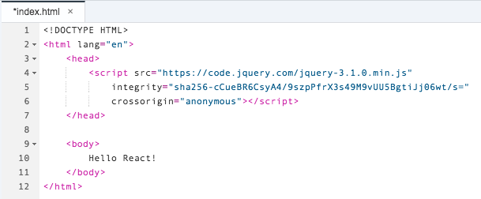


[ACCORDION-END]

[ACCORDION-BEGIN [Step 2: ](Add Bootstrap reference)] 

Next, we will add the Bootstrap framework.  Add the following lines to your `index.html` file, under the previous jQuery line:

>**Don't forget to save your file!**

```HTML
<link   href="https://maxcdn.bootstrapcdn.com/bootstrap/3.3.7/css/bootstrap.min.css"
rel="stylesheet"
integrity="sha384-BVYiiSIFeK1dGmJRAkycuHAHRg32OmUcww7on3RYdg4Va+PmSTsz/K68vbdEjh4u"
crossorigin="anonymous">
<script src="https://maxcdn.bootstrapcdn.com/bootstrap/3.3.7/js/bootstrap.min.js"
integrity="sha384-Tc5IQib027qvyjSMfHjOMaLkfuWVxZxUPnCJA7l2mCWNIpG9mGCD8wGNIcPD7Txa"
crossorigin="anonymous"></script>
```


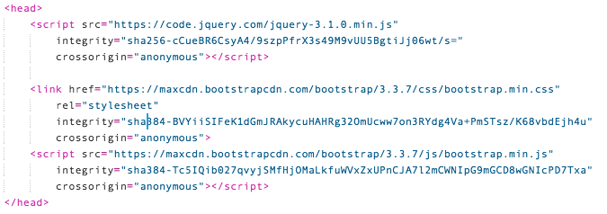


[ACCORDION-END]

[ACCORDION-BEGIN [Step 3: ](Replace HTML tag)] 

Now, we will start to use the HTML in our project.  First, we will need to change the `<html>` tag at the top of the page.  Replace that tag with this HTML:

```html
<html lang="en">
```


[ACCORDION-END]

[ACCORDION-BEGIN [Step 4: ](Replace body)] 

Next, select the line `Hello React!` in between our two `<body>` tags, and replace it with this HTML:

```html
<div class="container">
<div class="row">
<div class="col-sm-6">
<p>This is the "first" column.</p>
<p>Lorem ipsum dolor sit amet, consectetur adipiscing elit, sed do eiusmod tempor incididunt ut labore et dolore magna aliqua. Ut enim ad minim veniam, quis nostrud exercitation ullamco laboris nisi ut aliquip ex ea commodo consequat. Duis aute irure dolor in reprehenderit in voluptate velit esse cillum dolore eu fugiat nulla pariatur. Excepteur sint occaecat cupidatat non proident, sunt in culpa qui officia deserunt mollit anim id est laborum.</p>
</div>
<div class="col-sm-6">
<p>And this is the "second" column.</p>
<p>Lorem ipsum dolor sit amet, consectetur adipiscing elit, sed do eiusmod tempor incididunt ut labore et dolore magna aliqua. Ut enim ad minim veniam, quis nostrud exercitation ullamco laboris nisi ut aliquip ex ea commodo consequat. Duis aute irure dolor in reprehenderit in voluptate velit esse cillum dolore eu fugiat nulla pariatur. Excepteur sint occaecat cupidatat non proident, sunt in culpa qui officia deserunt mollit anim id est laborum.</p>
</div>
</div>
</div>
```

> Some of the text may run off the side of the editor.  That's fine, we are just using it to display the features of our layout.


[ACCORDION-END]

[ACCORDION-BEGIN [Step 5: ](Run the application)] 

Run the application, and you will see the following screen:

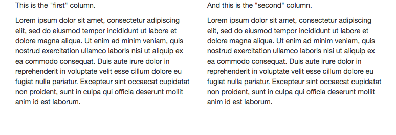


[ACCORDION-END]

[ACCORDION-BEGIN [Step 6: ](Review Bootstrap functionality)] 

Bootstrap has several benefits that we are using here.  

First, it offers a column layout system.  This allows us to align text on the page, and keep it organized.  In many applications, developers has to use tables to do this effectively.  Bootstrap allows us to use the same table alignments, but without having a lot of table html elements (like `<tr>` and `<td>`) cluttering up the page.  

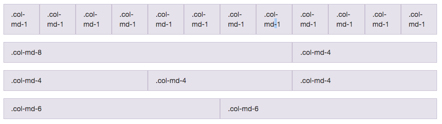

Even better, the column layouts can be used to specify a different layout on different screen sizes, but all in a single page.  This allows developers to create both laptop and mobile pages in one place.  (We will demonstrate this in a later tutorial.)


[Check out an overview of the Bootstrap Grid System here](https://getbootstrap.com/css/#grid)

Second, Bootstrap offers a clean form design.  Each form element is clearly defined in the HTML, and Bootstrap will take care of alignment, fonts, and all the design elements to make it look professional.  Here is an example of a Horizontal Form.


[Bootstrap documentation on Forms](https://getbootstrap.com/css/#forms)

There are a lot of additional capabilities, like dialog boxes, alerts, and other elements that can also be used to make your page.  Check out the [Bootstrap CSS](https://getbootstrap.com/css/), [Bootstrap Components](https://getbootstrap.com/components/), and [Bootstrap JavaScript](https://getbootstrap.com/javascript/) pages for more details.


[ACCORDION-END]

[ACCORDION-BEGIN [Step 7: ](Add a list-group to the page)] 

So, now that we have Bootstrap, let's set up the template for our application.  

We want to start by creating a list on the screen, for our list of products.  To do that, we will add a `.list-group` to the page.  

Starting with the `<div class="container">` tag, replace the existing HTML with this new code:

```html
<div class="list-group">
<button type="button" class="list-group-item">
<h4>Product A</h4>
</button>
</div>
```

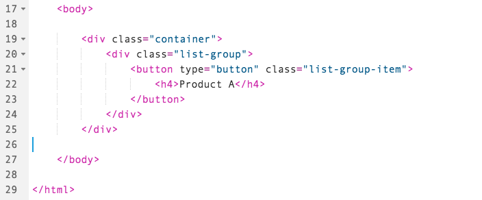

When you run your application, it should look like this:

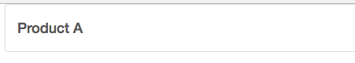


[ACCORDION-END]

[ACCORDION-BEGIN [Step 8: ](Add fields)] 

Now that we have the basic framework for a list, let's add in more details in to each row.

For each row, we would like to display the following information:

* Product Name
* Packaging Description
* Price (including currency)
* Availability

Let's add them to the box.  Copy the following html code, and add it between the `<h4>` and `<button>` tags:

```html
<p>Description</p>
<p>Price in Euros</p>
<p>Available?</p>
```


Run your application, and you will see the following screen:

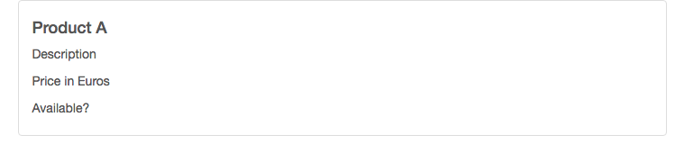


[ACCORDION-END]

[ACCORDION-BEGIN [Step 9: ](Embed a row in existing element)] 

Now we have the fields, but the box doesn't look very organized.  So, lets use Bootstrap again to organize the box.  To do this, we are going to use the nesting feature to embed a row **inside** of an existing element.  

To do this, let's split the box in to two sides, left and right, and move the elements inside the box.

Change the code inside the `<button>` tag to the following:

```html
<div class="row">
<div class="col-sm-8">
<h4>Top label</h4>
<p>Description</p>
</div>
<div class="col-sm-3 text-right">
<p>Price in Euros</p>
<p>Available</p>
</div>
</div>
```


Run your application:


[ACCORDION-END]

[ACCORDION-BEGIN [Step 10: ](Edit row styles)] 

Now, let's make the text look better, and also add in the currency to the box.  Change the HTML inside the `<div class="row">` tags to this:

```html
<div class="col-sm-8">
<h4>Top label</h4>
<p>10 boxes at 20 bags</p>
</div>
<div class="col-sm-3 text-right">
<h4>
99.99
<small class="text-muted">EUR</small>
</h4>
<p class="available">Available</p>
</div>
```


Now run your application:

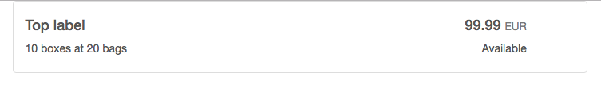


[ACCORDION-END]

[ACCORDION-BEGIN [Step 11: ](Add chevron)] 

Hey, that looks better!  But one more element.  We want the user to know they can click on the list (which is why we made each list element a button in the first place), to get more details about this item.  To make this clear, we will add a chevron to the end of the row.

Add the following HTML under your last `</div>` tag in the button:

```html
<div class="col-sm-1">
<span class="glyphicon glyphicon-chevron-right pull-right" aria-hidden="true"></span>
</div>
```


Run your application, and it should look like this:


[ACCORDION-END]

[ACCORDION-BEGIN [Step 12: ](Add custom CSS)] 

The chevron, however, is now on the top of the box.  What if we wanted to center it?  We can do that as well.  To do this, we will introduce CSS directly in to the components.  

The CSS allows us to add (or override) any layout decisions on the page.  CSS is how Bootstrap builds the page, so we are working in the same language to change or modify the look and feel.  

Normally, CSS is put in a separate file, but to make things easier, we will add it to our HTML page directly.

Start by adding this code to your `<head>` element, at the end

```html
<style>
.vertical-align {
display: flex;
align-items: baseline;
}

.vertical-align .top {
align-self: baseline;
}

.vertical-align .center {
align-self: center;
}
</style>
```

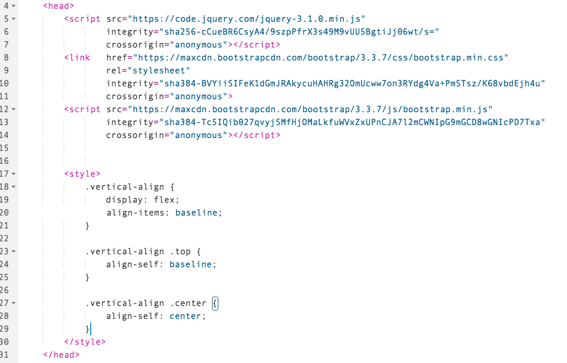


[ACCORDION-END]

[ACCORDION-BEGIN [Step 13: ](Add styles)] 

Now, change the HTML in your `<button>` tags, adding the following text to each `class=` attribute.

Add the CSS style `vertical-align` to the `<div class="row">` tag:


Add the CSS style `top` to each of the first two `<div class="col-sm-__">` tags:


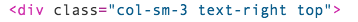

Finally, add the CSS style `center` to the last `<div class-"col-sm-1">` tag.  

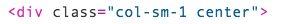

Your code should now look like this:


[ACCORDION-END]

[ACCORDION-BEGIN [Step 14: ](Test the application)] 

Run your application.  The chevron should now be in the center of the box:

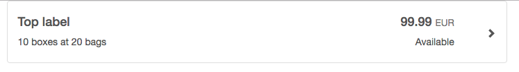


[ACCORDION-END]

[ACCORDION-BEGIN [Step 15: ](Edit colros)] 

Finally, we will add in a touch of color.  When a product is available, we will use the color green.  When it is discontinued, we will change the color to red.

Add the following CSS to the inside of your `<style>` tag at the top:

```html
.available {
color: green;
font-weight: bold;
}

.discontinued {
color: red;
font-weight: bold;
}
```


[ACCORDION-END]

[ACCORDION-BEGIN [Step 16: ](Run the application)] 

Now, run your application.  You will see the word *Available* is now in green


[ACCORDION-END]

[ACCORDION-BEGIN [Step 17: ](Review additional information)] 

- [Bootstrap](https://getbootstrap.com/) - get more information about Bootstrap.
- [jQuery](https://jquery.com/) - a toolkit to easily manipulate web pages.


[ACCORDION-END]

[ACCORDION-BEGIN [Step 18: ](Review final code)] 

Just as a reference, your `index.html` file should now look like this:

```html
<!DOCTYPE HTML>
<html lang="en">
<head>
<script src="https://code.jquery.com/jquery-3.1.0.min.js"
integrity="sha256-cCueBR6CsyA4/9szpPfrX3s49M9vUU5BgtiJj06wt/s="
crossorigin="anonymous"></script>

<link href="https://maxcdn.bootstrapcdn.com/bootstrap/3.3.7/css/bootstrap.min.css"
rel="stylesheet"
integrity="sha384-BVYiiSIFeK1dGmJRAkycuHAHRg32OmUcww7on3RYdg4Va+PmSTsz/K68vbdEjh4u"
crossorigin="anonymous">
<script src="https://maxcdn.bootstrapcdn.com/bootstrap/3.3.7/js/bootstrap.min.js"
integrity="sha384-Tc5IQib027qvyjSMfHjOMaLkfuWVxZxUPnCJA7l2mCWNIpG9mGCD8wGNIcPD7Txa"
crossorigin="anonymous"></script>

<style>
.vertical-align {
display: flex;
align-items: baseline;
}

.vertical-align .top {
align-self: baseline;
}

.vertical-align .center {
align-self: center;
}

.available {
color: green;
font-weight: bold;
}

.discontinued {
color: red;
font-weight: bold;
}
</style>

</head>

<body>

<div class="container">
<div class="list-group">
<button type="button" class="list-group-item">
<div class="row vertical-align">
<div class="col-sm-8 top">
  	<h4>Top label</h4>
  	<p>10 boxes at 20 bags</p>
  </div>
  <div class="col-sm-3 text-right top">
  	<h4>
  		99.99
  		<small class="text-muted">EUR</small>
  	</h4>
  	<p class="available">Available</p>
  </div>
  <div class="col-sm-1 center">
      <span class="glyphicon glyphicon-chevron-right pull-right" aria-hidden="true"></span>
  </div>
</div>
</button>
</div>
</div>

</body>
</html>
```


[ACCORDION-END]

