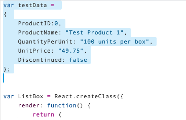
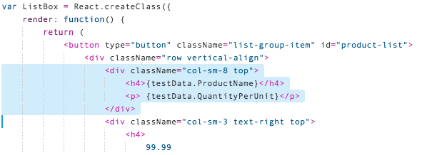
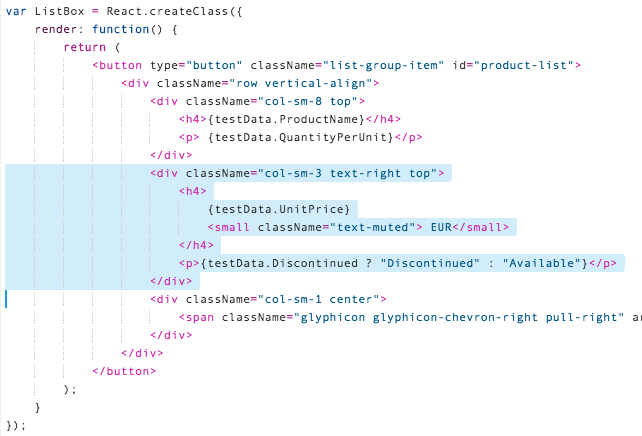
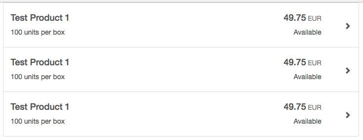
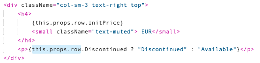
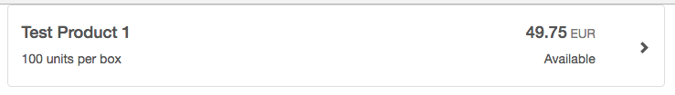
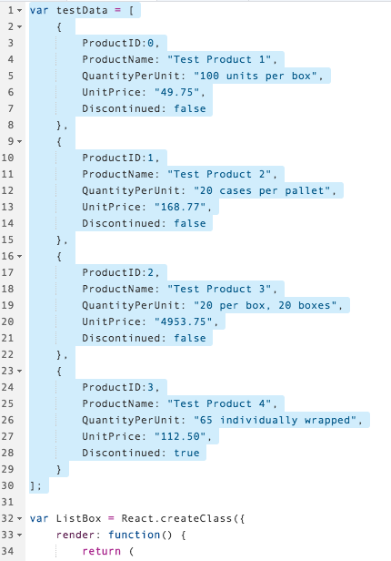
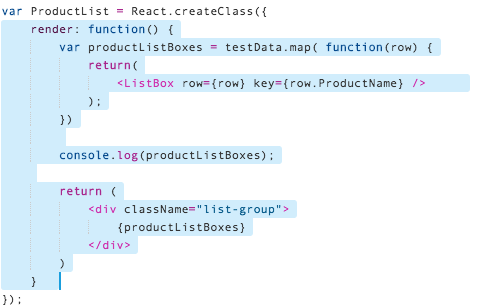
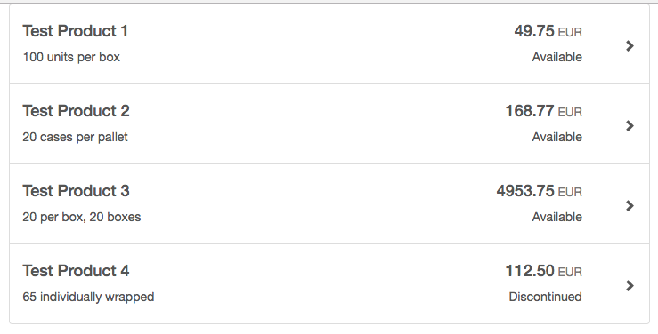

## Prerequisites  
 - **Proficiency:** Beginner 
 - **Tutorial:** [Step 4 - Separate the files](http://go.sap.com/developer/tutorials/react-separate-files.html)

## Next Steps
 - **Tutorial:** [Step 6 - Add REST OData call](http://go.sap.com/developer/tutorials/react-add-odata.html)


## Details
### You will learn  
In this tutorial series, we will explore another technology for Single Page Application (SPA) development - React.  React is another popular web framework, and is used by many companies for both internal and client-facing systems.  These tutorials will parallel our SAPUI5 tutorials, building a visual interface using Angular, and connecting it to an OData back end service.

### Time to Complete
**10 Min**.

---

#### REACT tutorial series
**Step 5**: Take the static REACT components that have been created, and convert them into dynamic components that read data directly from a server.  

(For now, the server data will be simulated by a JavaScript variable.  This will be replaced with a dynamic server call in a later tutorial.)

These are the steps:

1.  Convert the list item to use dynamic data
2.  Pass properties from the parent to the child
3.  Add a loop and pass each row to the list
 
---

### Convert the list item to use dynamic data

The main goal of REACT is to take data from the Model (using the MVC design philosophy) and display it on the screen.  REACT handles this by using curly braces `{}` to mark variables (instead of static text).  The first goal is to modify the list to show variables.


1.  Open the `main.js` file, and add some test data to the top.  Add the following JavaScript to the top of the file:

    ```javascript
    var testData = 
    { 
    	ProductID:0,
    	ProductName: "Test Product 1",
    	QuantityPerUnit: "100 units per box",
    	UnitPrice: "49.75",
    	Discontinued: false
    };
    ```

    

2.  Now, scroll down to the `ListBox` component.  There are four data pieces we need to modify.  Start by selecting the first `<div className="col-sm-8 top">` section, and replace it with the following JavaScript:

    > The pre-compiler looks for items surrounded by curly brackets.  Those items are treated as JavaScript variables, instead of static text.  

    ```javascript
    <div className="col-sm-8 top">
        <h4>{testData.ProductName}</h4>
        <p> {testData.QuantityPerUnit}</p>
    </div>
    ```

    

3.  Next, select the next `<div>` tag, and replace it with the following JavaScript

    ```javascript
    <div className="col-sm-3 text-right top">
        <h4>
            {testData.UnitPrice}
            <small className="text-muted"> EUR</small>
        </h4>
        <p>{testData.Discontinued ? "Discontinued" : "Available"}</p>
    </div>
    ```

    

4.  Run your application.  There will be three list boxes, and the data will now match the `testData` variable we added to our code.

    


---

### Pass properties from the parent to the child

> Up to this point, our REACT components have used static data to display on the screen.  In order to display dynamic data, the components must be modified to recognize local variables.
> 
> In REACT, data can be one of two different types.  
>
> - The properties values (or `props`) is data that is passed to the component as read-only.  This is a one way transmission of data from the parent to the child, and there is no expectation that the data will change after it is rendered.  This is useful when sending data to be rendered that will not be modified
> - The state values (or `state`).  State values are designed to be updated dynamically (hence the name "state").  These values can be changed by both the parent or child, and these values can change during runtime.
> 
> Our data will eventually come from a server, but the components that display the data will always have static copies of that data.  In this case, our `ListBox` will use properties.  Eventually, our `ProductList` component will use state data.  That is coming up in a later tutorial.


1.  Open the `main.js` file, and scroll down to the `ProductList` component.  Select **all three** `ListBox` components inside the `render` method, and replace them with this JavaScript:

    ```javascript
    <ListBox row={testData} />
    ```

    

2.  Scroll up to the `ListBox` component.  **Replace** each instance of the word `testData` with the following text:

    ```javascript
    this.props.row
    ```

    

    

    

    

3.  Now run the application.  There will be only one row, and the row will still have the test data inside it.

    
    
---

### Add a loop and pass each row to the list

To display multiple rows of data, the `ProductList` component will need to be modified to loop through data and use a `ListBox` for each row.  


1.  Start by replacing the `testData` with an array of test data.  Select the `testData` variable, and **replace** it with the following JavaScript:

    ```javascript
    var testData = [
        { 
          ProductID: 0,
        	ProductName: "Test Product 1",
        	QuantityPerUnit: "100 units per box",
        	UnitPrice: "49.75",
        	Discontinued: false
        },
        { 
          ProductID: 1,
        	ProductName: "Test Product 2",
        	QuantityPerUnit: "20 cases per pallet",
        	UnitPrice: "168.77",
        	Discontinued: false
        },
        { 
          ProductID: 2,
        	ProductName: "Test Product 3",
        	QuantityPerUnit: "20 per box, 20 boxes",
        	UnitPrice: "4953.75",
        	Discontinued: false
        },
        { 
          ProductID: 3,
        	ProductName: "Test Product 4",
        	QuantityPerUnit: "65 individually wrapped",
        	UnitPrice: "112.50",
        	Discontinued: true
        }
    ];
    ```

    

2.  In order to work through the array, we could use a `for()` loop.  Instead, JavaScript has a more powerful method called `map()`, which can transform an entire array at one time.    

    Scroll down to the `ProductList` component.  Select the entire `return()` function, and **replace** it with the following JavaScript:
    
    ```javascript
    render: function() {
    	var productListBoxes = testData.map( function(row) {
    		return(
    			<ListBox row={row} key={row.ProductName} />		
    		);
    	})
    	
    	console.log(productListBoxes);
    
    	return (
    		<div className="list-group">
    			{productListBoxes}
    		</div>
    	)
    }	
    ```

    

3.  Run the application.  Four rows of data will be displayed, each corresponding to a row in our `testData` variable.

    


### Final Code

This tutorial has only modified the `main.js` file.  Here is the final code for that file:

```javascript
var testData = [
	{ 
		ProductID:0,
		ProductName: "Test Product 1",
		QuantityPerUnit: "100 units per box",
		UnitPrice: "49.75",
		Discontinued: false
	},
	{ 
		ProductID:1,
		ProductName: "Test Product 2",
		QuantityPerUnit: "20 cases per pallet",
		UnitPrice: "168.77",
		Discontinued: false
	},
	{ 
		ProductID:2,
		ProductName: "Test Product 3",
		QuantityPerUnit: "20 per box, 20 boxes",
		UnitPrice: "4953.75",
		Discontinued: false
	},
	{ 
		ProductID:3,
		ProductName: "Test Product 4",
		QuantityPerUnit: "65 individually wrapped",
		UnitPrice: "112.50",
		Discontinued: true
	}
];

var ListBox = React.createClass({
    render: function() {
        return (
			<button type="button" className="list-group-item" id="product-list">
				<div className="row vertical-align">
					<div className="col-sm-8 top">
						<h4>{this.props.row.ProductName}</h4>
						<p> {this.props.row.QuantityPerUnit}</p>
					</div>
					<div className="col-sm-3 text-right top">
						<h4>
							{this.props.row.UnitPrice}
							<small className="text-muted"> EUR</small>
						</h4>
						<p>{this.props.row.Discontinued ? "Discontinued" : "Available"}</p>
					</div>
					<div className="col-sm-1 center">
						<span className="glyphicon glyphicon-chevron-right pull-right" aria-hidden="true"></span>
					</div>
				</div>
			</button>
		);
    }
});

var ProductList = React.createClass({
	render: function() {
		var productListBoxes = testData.map( function(row) {
			return(
				<ListBox row={row} key={row.ProductName} />		
			);
		})
		
		console.log(productListBoxes);
	
		return (
			<div className="list-group">
				{productListBoxes}
			</div>
		)
	}	
});

ReactDOM.render(
    <ProductList />,
    document.getElementById('product-list')
);
```


## Additional Information

#### JavaScript

- Instead of a `for()` loop, this tutorial used the [JavaScript array map() function](https://developer.mozilla.org/en-US/docs/Web/JavaScript/Reference/Global_Objects/Array/map)


## Next Steps
 - **Tutorial:** [Step 6 - Add REST OData call](http://go.sap.com/developer/tutorials/react-add-odata.html)


 
