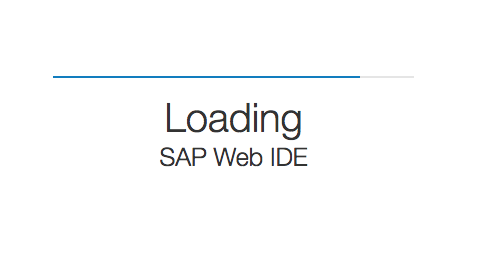
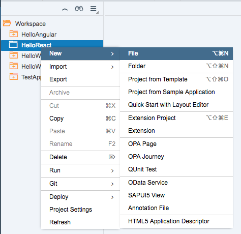
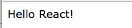

## Prerequisites  
 - **Proficiency:** Beginner
 - **Trial Account** You will need a SAP Cloud Platform trial account for this tutorial series.  [Create an SAP Cloud Platform Trial Account](http://www.sap.com/developer/tutorials/hcp-create-trial-account.html)


## Next Steps
- **Tutorial** [Create the Bootstrap Template](http://www.sap.com/developer/tutorials/react-bootstrap-template.html)

## Details
### You will learn  
In this tutorial series, we will explore another technology for Single Page Application (SPA) development - REACT.  REACT is another popular web framework, and is used by many companies for both internal and client-facing systems.  These tutorials will parallel our SAPUI5 tutorials, building a visual interface using Angular, and connecting it to an OData back end service.

### Time to Complete
**10 Min**.

---

#### REACT tutorial series
**Step 1**: Welcome to the tutorial series on React JS.  React is a great front end development tool for building Single Page Applications (SPA).  It is one of several possible options to build Views (using the [Model View Controller paradigm) in HTML5 browsers that will run in SAP Cloud Platform.

This first tutorial will start by opening the IDE and getting the basic parts of the project configured.  Here are the detailed steps:

1.  Connect to the SAP Web IDE
2.  Set up a new empty web project

---


[ACCORDION-BEGIN [Step 1: ](Open SAP Cloud Platform console)]

Open the [SAP Cloud Platform console](https://account.hanatrial.ondemand.com/)

> **Can not create a developer account?**
>
> If you have trouble logging in to your SAP Cloud Platform Cockpit, and you are using a company account (one provided by your employer), it is possible that the Cloud access has been locked.  Create a new FREE trial account by clicking the link above, and use your personal email address to set up the new account.


[DONE]
[ACCORDION-END]


[ACCORDION-BEGIN [Step 2: ](Enable SAP Web IDE)]

You should now be in the SAP Cloud Platform Cockpit, as shown below.  Click on the **Services** menu item on the left.  

Next, click on the **SAP Web IDE** box.  You may need to scroll down to find this box.

>**Enabled**
>
> If the box does **NOT** say Enabled, click the **Not Enabled** button to enable this feature.  In the screen that appears, click the **Enable** button at the top of the page to confirm this feature is set up.


[DONE]
[ACCORDION-END]


[ACCORDION-BEGIN [Step 3: ](Open SAP Web IDE)]

In the SAP Web IDE screen, you will see a paragraph called *Service Description*.  At the bottom of the paragraph, there is a link called **Open SAP Web IDE**.  Click this link


A new tab (or window) will open, and the Web IDE will load.




[DONE]
[ACCORDION-END]


[ACCORDION-BEGIN [Step 4: ](Bookmark the page)]

Bookmark this page in your browser.  **You will need this link later, to reopen the Web IDE**.

>**Bookmark.  Bookmark bookmark bookmark!!!**
>
> Bookmark the Web IDE in your browser.  If you close this window, you will need to follow all these steps to open it again, or you can just click the bookmark.  Make your life easier!!

[DONE]
[ACCORDION-END]


[ACCORDION-BEGIN [Step 5: ](Create new project)]

Go to the **File** menu, and then choose **New** --> **Project From Template**.


[DONE]
[ACCORDION-END]


[ACCORDION-BEGIN [Step 6: ](Choose SAPUI5 Application)]

Choose *SAPUI5 Application*, and then click **Next**.


[DONE]
[ACCORDION-END]


[ACCORDION-BEGIN [Step 7: ](Name the project)]

Enter `HelloReact` as a project name, and then click **Finish**.


[DONE]
[ACCORDION-END]


[ACCORDION-BEGIN [Step 8: ](Delete existing files)]

Finally, we will be removing *all* of the files from your application.  Select the folder `webapp`, and the files `.project.json` and `neo-app.json`, then right click and choose **Delete**.

>**Why are we deleting ALL the files?**
>
> For this AngularJS application, we will not need the files to support SAPUI5.  We will only be using the editor, and the built-in web server, for our application.  Everything else is downloaded directly from the web.


[DONE]
[ACCORDION-END]


[ACCORDION-BEGIN [Step 9: ](Confirm deletion)]

In the dialog box, choose **OK**.


[DONE]
[ACCORDION-END]


[ACCORDION-BEGIN [Step 10: ](Create new file)]

Now, select the folder `HelloReact`, right click, and select **New** --> **File**.



[DONE]
[ACCORDION-END]


[ACCORDION-BEGIN [Step 11: ](Name the file)]

Name the file `index.html`, and then click **OK**


[DONE]
[ACCORDION-END]


[ACCORDION-BEGIN [Step 12: ](Add the HTML and save)]

The editor will open.  Copy and paste the following HTML in to the editor, then click the **Save**  button at the top.

```html
<!DOCTYPE HTML>
<html lang="en">
    <head>
    </head>

    <body>
        Hello React!
    </body>
</html>
```


[DONE]
[ACCORDION-END]


[ACCORDION-BEGIN [Step 13: ](Run the app)]

Now try out your new web application!  Click on the *Run*  icon at the top of the page (or go to the **Run** menu, and choose **`Run index.html`**).



[DONE]
[ACCORDION-END]


### Additional Information
#### Why are we using SAP Web IDE?  Can I use another development tool?

Yes, you can.   We are using Web IDE because it provides an unlimited, free, developer account.  It also has a built-in web front end, so that you can test your code immediately.  And, it has a pretty good HTML and JavaScript editing system.  But there are plenty of other development IDE's, including Eclipse, that would work as well.  Feel free to use the one that your company is using, or try out a new one.

## Next Steps
 - **Tutorial** [Create the Bootstrap Template](http://www.sap.com/developer/tutorials/react-bootstrap-template.html)
