## Prerequisites  
 - **Proficiency:** Beginner
 - **Tutorials:** [Core Data  Services, Preparing views for Associations/Joins]

## Next Steps
[Creating OData-Service based on `CDS-view`](http://www.sap.com/developer/tutorials/s4hana-cds-creating-odata-service.html)


## Details
### You will learn  
How to join many views together.

### Time to Complete
**15-20 Min**

---


[ACCORDION-BEGIN [Step 1: ](Check basic view)]

Make sure that the basic view from the previous tutorials of this series is available

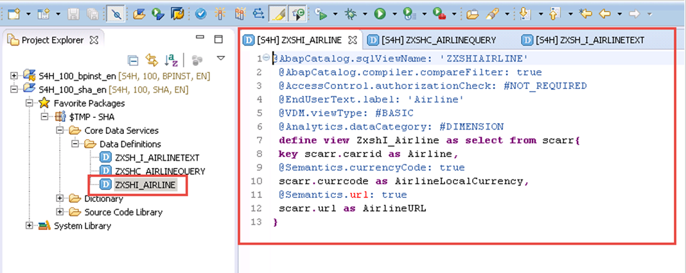

[DONE]
[ACCORDION-END]

[ACCORDION-BEGIN [Step 2: ](Enhancing the basic view)]

Let's consider the coding of the view `ZXSHI_AIRLINE` again. We will enhance that code by inserting new annotations:

The following is an annotation to make the view usable for BW by inserting the line below after line 6.

``` abap
@Analytics.dataExtraction.enabled: true  
```


Here is the new line, completed.


Here you can enable the Joins by inserting the line below after line 7.

``` abap
@ObjectModel.representativeKey: 'Airline'
```

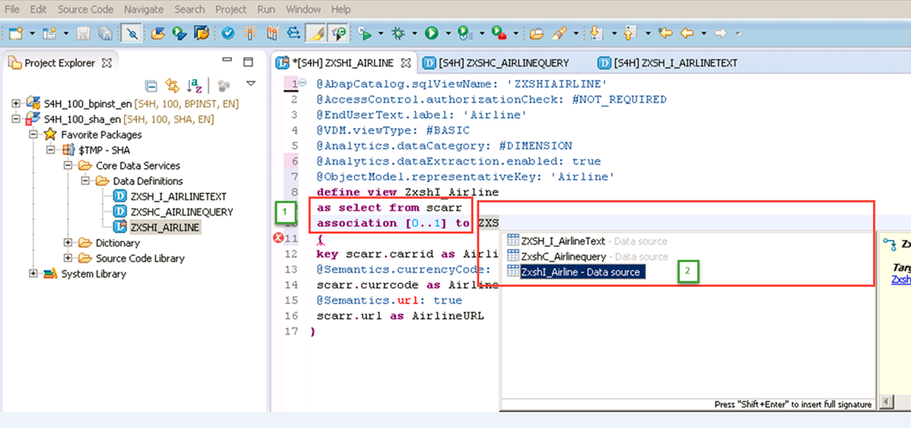

Here is the new line, completed.


[DONE]
[ACCORDION-END]

[ACCORDION-BEGIN [Step 3: ](Remove the filter from the code)]

Since we do not use any filter, we will delete line 2 ( `@AbapCatalog.compiler.compareFilter: true`) from the code.

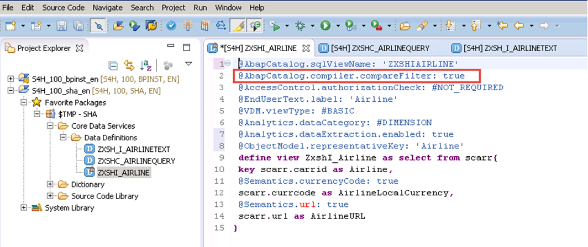

Here is the code after the deletion.


[DONE]
[ACCORDION-END]

[ACCORDION-BEGIN [Step 4: ](Add association annotations)]


Here you will enhance the code to make it capable for joins. To achieve this the following line will be inserted after line 8 in the code.

```abap
...as select from scarr association [0..1] to ZXSH_I_AirlineText
```


Here is the new line, completed.

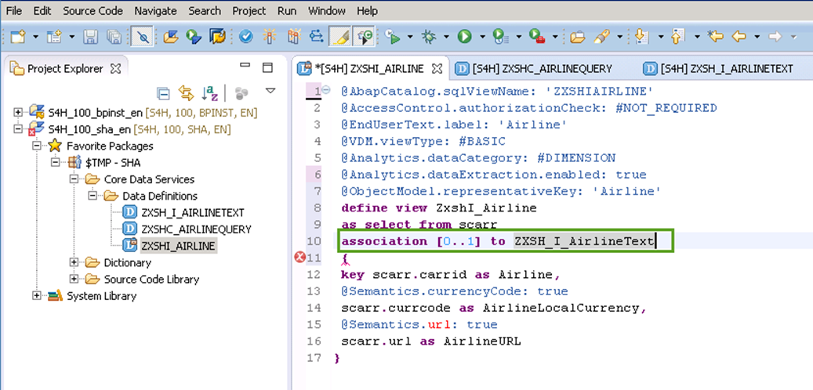

[DONE]
[ACCORDION-END]

[ACCORDION-BEGIN [Step 5: ](Insert the alias text)]

To display the Carrier name, insert the alias `_Text`

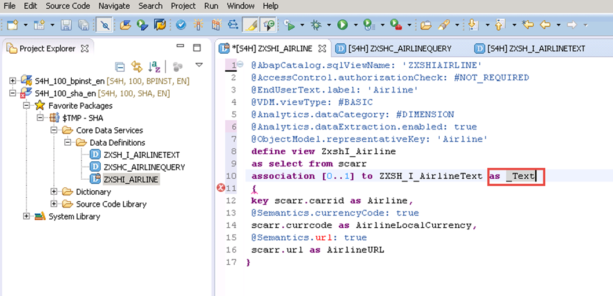

[DONE]
[ACCORDION-END]

[ACCORDION-BEGIN [Step 6: ](Define the Join projection)]

Further enhancement is necessary (in projection capacity) to make the view joinable. To achieve this,  extend the above alias insertion with `on $projection.Airline = _Text.Airline`.


> If you hover the icon on the line 10 the following message will be displayed:  `Association _Text is not used`

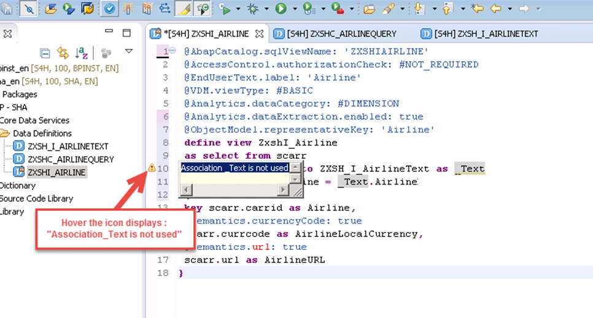

The alias `_Text` must be declared (see number 2 in the screen shot below) and the comma (number 1 in the screen shot) at the end of line 17 must not be omitted. Next, save and activate the code.

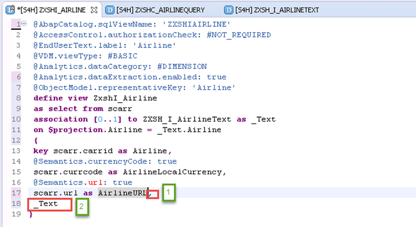

[DONE]
[ACCORDION-END]

[ACCORDION-BEGIN [Step 7: ](Preview the content of the view)]

You can now preview the content of the  view **`ZXSHI_AIRLINE`**. On the left panel, select and right-click on the view **`ZXSHI_AIRLINE`**, select **Open Data Preview** and then press **Enter**.

   

Below is the data preview.

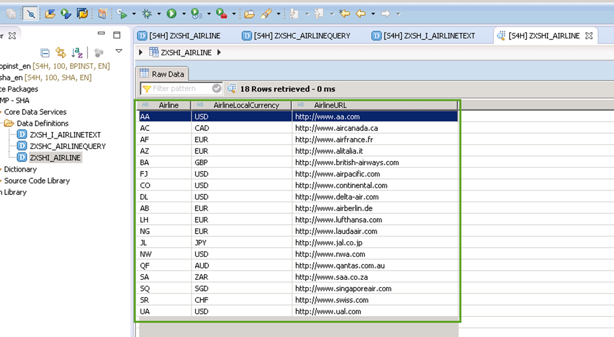

> As you may have noticed, the Airline Name is not visible on the preview screen.

Now change line 18 of the code as follows: `_Text.AirlineName`.

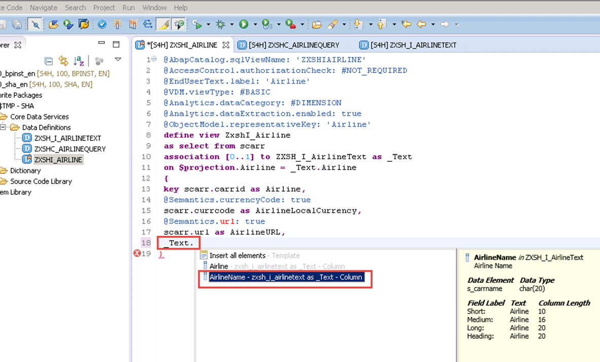

Here you see the change added.

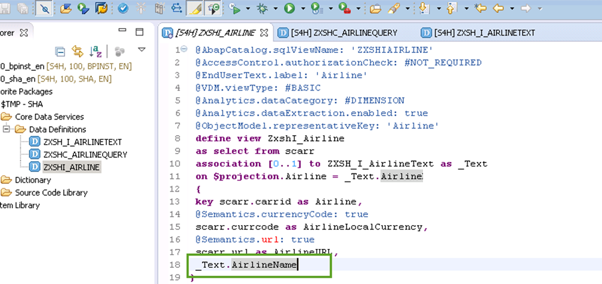

Save the change, activate it and preview the view's content again.

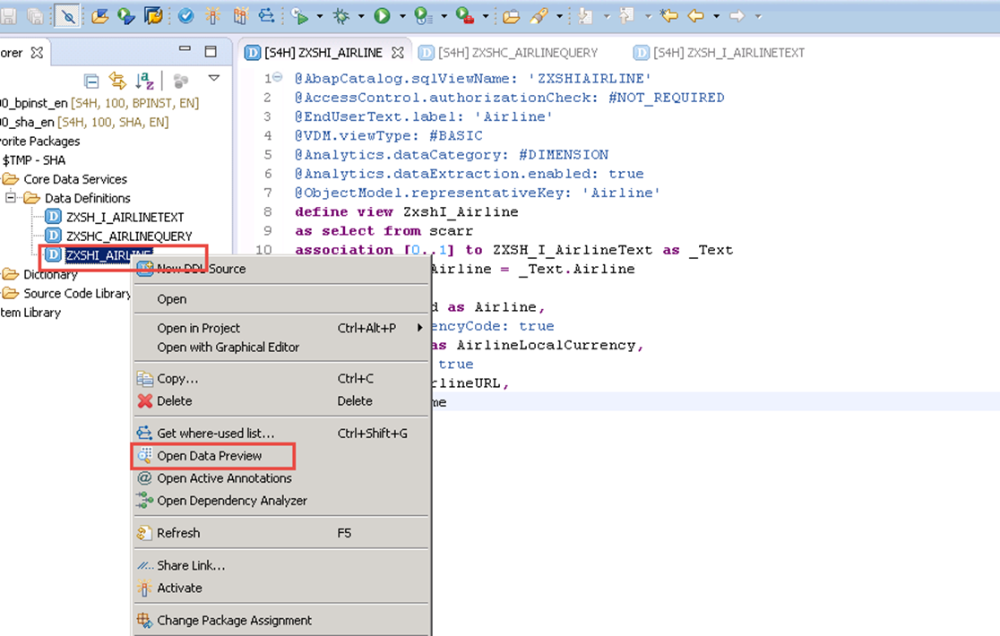

> In the preview screen you will see now a new column labeled with `AirlineName` displaying the Carrer name.

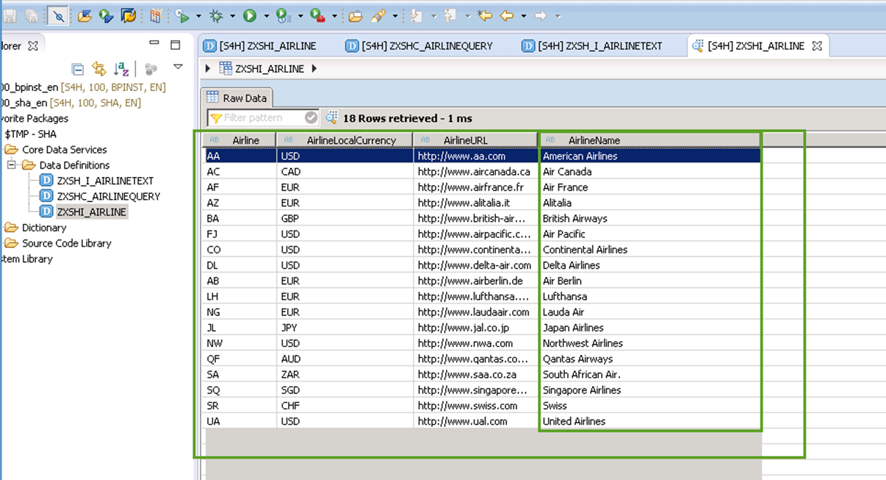

[DONE]
[ACCORDION-END]

[ACCORDION-BEGIN [Step 8: ](Final changes)]

To handle the next exercise of this series , we will modify  the line 18 again by removing the extension `AirlineName` from `_Text.AirlineName` to have `_Text`. We will now have to save and activate our change.


You can copy this content from here and paste it to the code editor of your ABAP perspective as well, instead of enhancing the generated code and typing on your own:
``` abap
@AbapCatalog.sqlViewName: 'ZXSHIAIRLINE'
@AccessControl.authorizationCheck: #NOT_REQUIRED
@EndUserText.label: 'Airline'
@VDM.viewType: #BASIC
@Analytics.dataCategory: #DIMENSION
@Analytics.dataExtraction.enabled: true
@ObjectModel.representativeKey: 'Airline'
define view ZxshI_Airline
as select from scarr
association [0..1] to ZXSH_I_AirlineText as _Text
on $projection.Airline = _Text.Airline
{
key scarr.carrid as Airline,
@Semantics.currencyCode: true
scarr.currcode as AirlineLocalCurrency,
@Semantics.url: true
scarr.url as AirlineURL,  
_Text

}
```

[DONE]
[ACCORDION-END]

### Notes

Although SAP offers trial editions for free you will still have to cover the costs for running these trial editions on AWS. This tutorial is part of the S/4HANA Core Data Services. More information is available here:

- [Amazon Web Services](http://aws.amazon.com/)
- [SAP Cloud Appliance Library (CAL)](https://scn.sap.com/community/cloud-appliance-library)
- [Alternative AWS Deployment for SAP Trials provided as Virtual Appliance](https://scn.sap.com/docs/DOC-46908)
- [Virtual Private Cloud with VPN Access for SAP Trials provided as Virtual Appliance](https://scn.sap.com/docs/DOC-46629)
