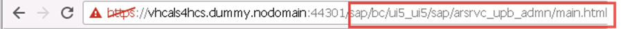
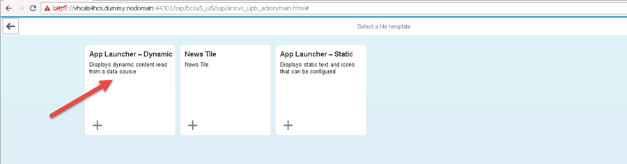
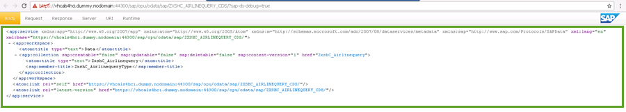
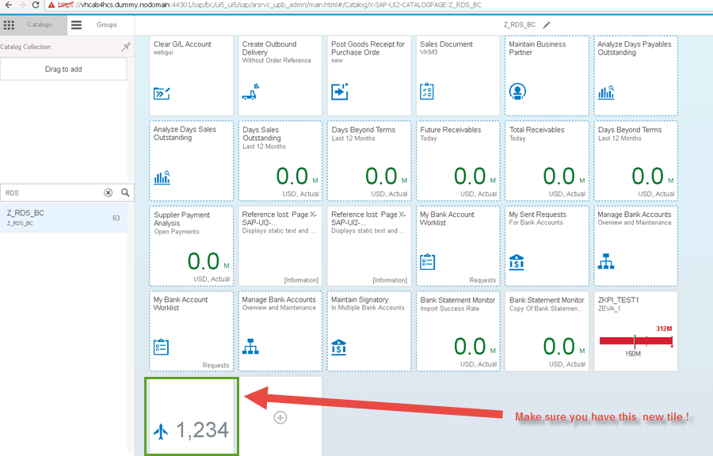
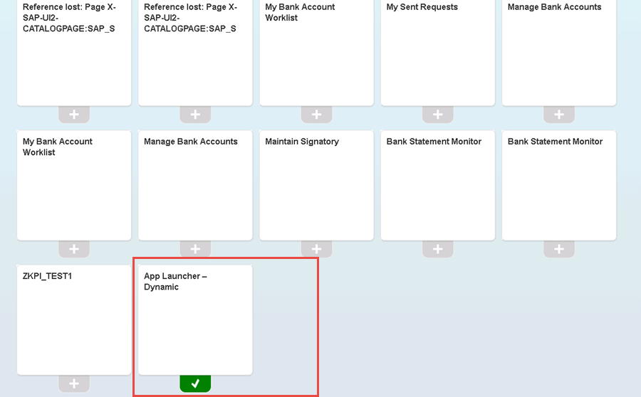

## Prerequisites  
 - **Proficiency:** Intermediate
 - **Tutorials:** [Do this tutorial first](http://sap.com/developer/tutorials/s4hana-cds-launchpad-designer-fiori-role.html)

## Next Steps
 - Select a tutorial from the [Tutorial Navigator](http://sap.com/developer/tutorial-navigator.html) or the [Tutorial Catalog](http://sap.com/developer/tutorials.html)

## Details
### You will learn  
- How to create a tile within Fiori Launchpad.
### Time to Complete
**15-20 Min**.

---

1. The tile to build will be added to the group `Z_RDBC_BCG`
    
To achieve that you need to logon to Fiori Launchpad Designer as shown in the previous tutorial(http://sap.com/developer/tutorials/s4hana-cds-launchpad-designer-fiori-role.html) and extend the `url` with: `sap/bc/ui5_ui5/sap/arsrvc_upb_admn/main.html/`
    

2. In the Launchpad Designer you have on the left panel two areas: Catalogs and Groups (1)
        
Groups can contain titles from more catalogs. Groups and catalogs can be customized by end users within SAP FIORI Launchpad Designer.
To create a new tile or add a new tile to a group.
Navigate to the group, choose `Z_RDS_BCG` and click on the plus button

    
After the click on the plus button you will have something like this:

    
You have a different types of template you can select from. As you will be creating a dynamic tile , select the template labeled with `App Launcher - Dynamic`

    
After the selection of the appropriated template, you will have the following screen that you should maintain.
    
From here you will use the Airline Query you created in the previous tutorial (http://sap.com/developer/tutorials/s4hana-cds-creating-odata-service.html) To achieve this, you will open Eclipse to access the airline query.

   
  Next, here you have the OData to be publish as depicted on the below screenshot.
  Click on the spherical and the on the link displayed in the window. Doing so will open a web browser where the details of the `oData` are shown.
    
  
    
    To get the syntax you need for creating your tile you have to add  the name of the query of the CDS(`Zxshc_Airlinequery`) at the end of the `url`  
    

  To have the number of the returned rows , you only have to add the following at the end of the previous `url`: `$count` and execute.
  You will now start to maintain  following fields of the configuration of the tile:
  **Dynamic Data**
  Service URL: `sap/opu/odata/sap/ZXSHC_AIRLINEQUERY_CDS_Zxshc_Airlinequery/$count`
  Refresh Interval in Seconds: `0`
    
     
    **General**
    Icon:(1) (2)
       
     
    **Navigation**
    Use semantic object navigation: `uncheck the box`
    
    and press the save button in the lower corner and hit the OK button on the confirmation window.
    Now you have a new tile configure(tile with the plane icon !)
     
    
     
    Add now this tile to the `Z_RDS_CBG` group. For achieving that  enter `Z_RDS_BCG`(2) in the search field from the tab Group(1) on the left area and hit enter from your keyboard
    
     
    Click on the plus button as shown on the below screenshot to add the title.
    
     
   Now press the `F4-Help` as on the screenshot(1) and in the search field on the  Catalogs window  enter RDS (2),select `Z_RDS_BC`(3) and hit enter from your keyboard.
        
  The newly added title should be visible and checked with a green icon on as on the screenshot. In your case the one labeled with App Launcher-Dynamic
  
   
To verify if the title has been created correctly, you will need to go back to the FIORI Launchpad and log on. Once within the Fiori Launchpad,click on group on the left area and choose `Z_RDS_BCG`(1). Afterwards, when looking at the right side of the screen as shown on the screenshot you will see the newly created tile with an Flight icon (2) and labeled with 18 as well.

  

## Next Steps
 - Select a tutorial from the [Tutorial Navigator](http://go.sap.com/developer/tutorial-navigator.html) or the [Tutorial Catalog](http://go.sap.com/developer/tutorials.html)
