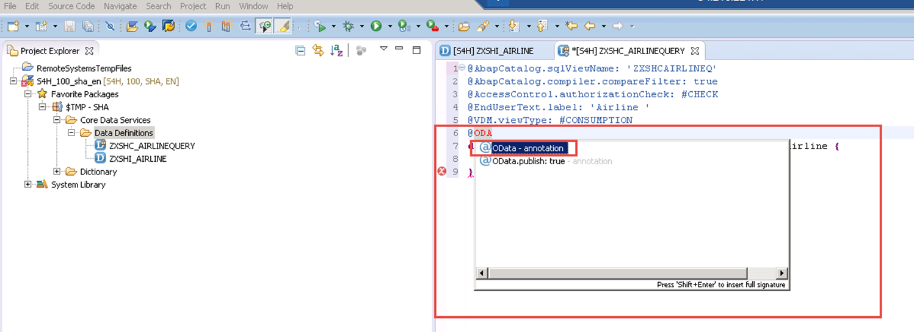

## Prerequisites  
  - [Creating basic/interface views in Open Core Data Services ](https://developers.sap.com/tutorials/s4hana-cds-creating-basic-view.html)

## Next Steps
[Preparing view association based on consumption view. ](https://developers.sap.com/tutorials/s4hana-cds-preparing-views-associations.html)


## Details
### You will learn
- How to use Core Data Services
- How to create a consumption views on top of interface views.


---

[ACCORDION-BEGIN [Step 1: ](Prepare the ABAP perspective)]

Make sure that your Eclipse Framework is opened in the ABAP perspective and that you are in the project explorer tab. From there expand the folder `$TMP-SHA` (see 1 in the screenshot). Next, expand the subfolder **Data Core Services** and select **Data Definitions**. From there,  right-click on **Data Definitions**, and in the opened  ABAP Repository Object window, select **DDL Source** and click **Enter**.  


In the new window **DDL Source** (Create a DDL Source), the Project is called `S4H_100_sha_en` and the Package is called`$TMP`  (see 1 in the screenshot below). Enter  `ZXSHC_AIRLINEQUERY` as the Name (2 in the screenshot),  Airline `Query, public view, VDM consumption view` (3 in the screenshot) as Description and press **Finish**.


In the new window **DDL Source** (**Templates Select one of the available templates**), select **Define View** and click **Finish**


[ACCORDION-END]

[ACCORDION-BEGIN [Step 2: ](Generate code for the view)]


Code for the new created view named `ZXSHC_AIRLINEQUERY` is generated:


In the generated code, we will replace `data source name` `(2)` with  `zxshI_Airline`, `#CHECK`  `(3)` with `NOT_REQUIRED`, `sql_view_name` `(4)`
 with `ZXSCHAIRLINEEQ` and `Airline Query ...` `(6)` with `Airline`. Save the changes.


[ACCORDION-END]

[ACCORDION-BEGIN [Step 3: ](Add annotations)]


Insert two new annotations: a VDM Annotation and an OData Annotation
to the generated code:

First, insert a new line after line 4 with the following text:
   `@VDM.ViewType: #CONSUMPTION`


Insert a  new line after line 5 with the following text:
   `@OData.publish: true`



Finally,  save the changes.


[ACCORDION-END]

[ACCORDION-BEGIN [Step 4: ](Insert all columns of the interface view)]


Next, enhance the code by inserting the interface view (`zxshI_Airline`) columns. To achieve this, position the mouse pointer before the bracket near the view name `zxshI_Airline`, press **Ctrl + Space bar**. Within the displayed window select **insert all elements** and press **Enter**.


Save and activate the modifications.


[ACCORDION-END]

[ACCORDION-BEGIN [Step 5: ](Resolve error)]

After the activation , an error is shown on the coding editor  due to a missing key.


If you hover on the error a window with the error cause will be displayed.


To resolve the error, define a key.


Save and activate the changes and then hover again as shown below.


[ACCORDION-END]

[ACCORDION-BEGIN [Step 6: ](Check complete code)]

You can copy this content from here and paste it to the code editor of your ABAP perspective as well, instead of enhancing the generated code and typing it on your own:

```abap
    @AbapCatalog.sqlViewName: 'ZXSHCAIRLINEQ'
    @AccessControl.authorizationCheck: #NOT_REQUIRED
    @EndUserText.label: 'Airline'
    @VDM.viewType: #CONSUMPTION
    @OData.publish: true
    define view ZxshC_Airlinequery as select from ZxshI_Airline {
    key ZxshI_Airline.Airline,
    ZxshI_Airline.AirlineLocalCurrency,
    ZxshI_Airline.AirlineURL
    }
```      


[ACCORDION-END]


### Notes
Although SAP offers trial editions for free you will still have to cover the costs for running these trial editions on AWS.

For more information, visit these resources:    

- [Amazon Web Services](http://aws.amazon.com/)
- [SAP Cloud Appliance Library (CAL)](https://scn.sap.com/community/cloud-appliance-library)
- [Alternative AWS Deployment for SAP Trials provided as Virtual Appliance](https://scn.sap.com/docs/DOC-46908)
- [Virtual Private Cloud with VPN Access for SAP Trials provided as Virtual Appliance](https://scn.sap.com/docs/DOC-46629)
