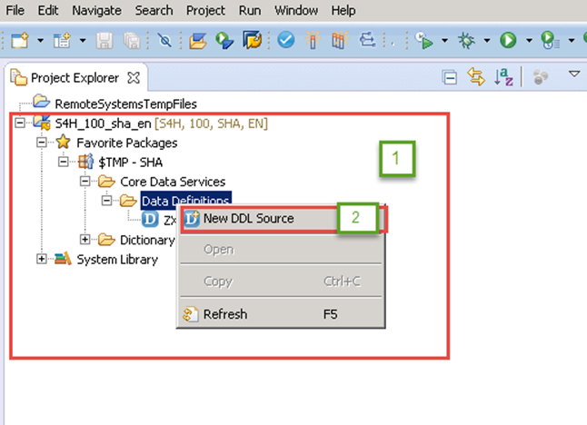
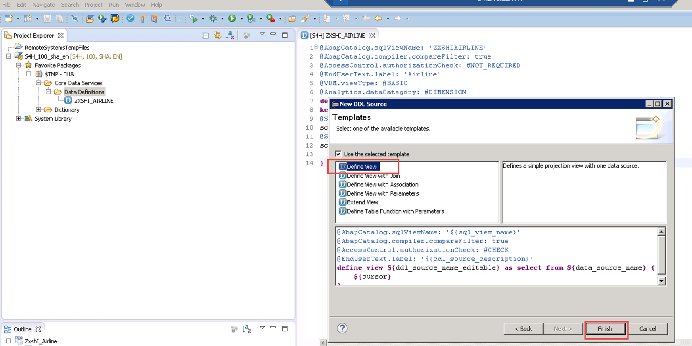
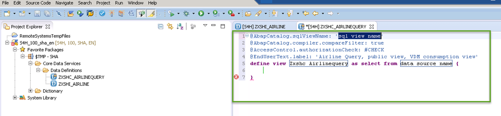
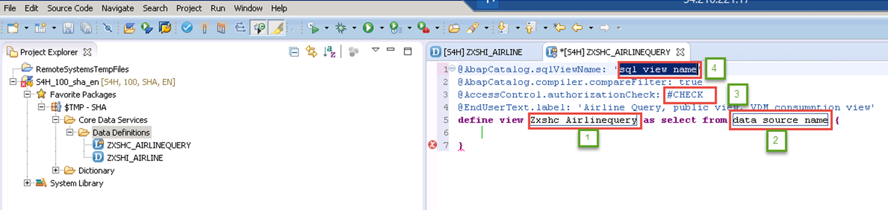
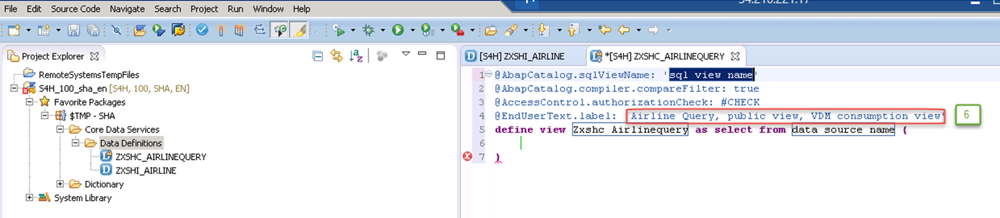
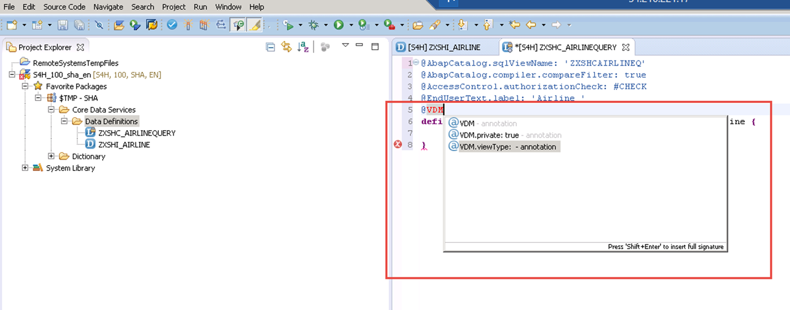
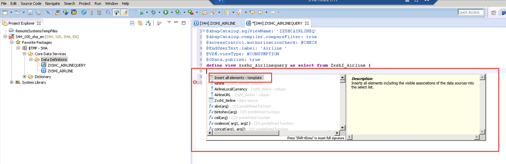
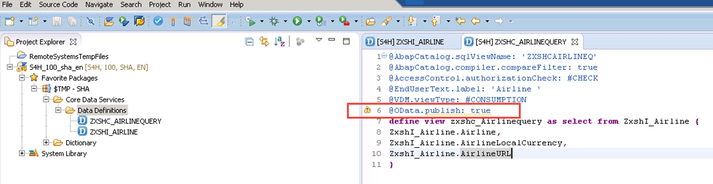
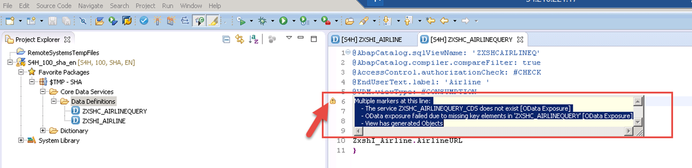
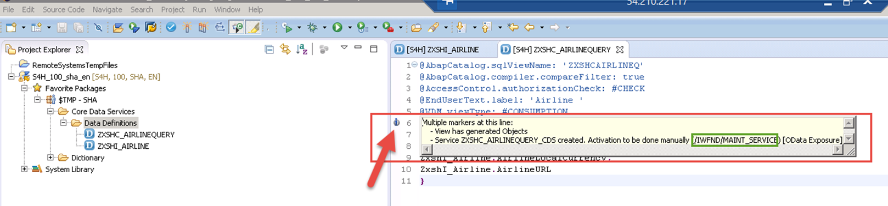

## Prerequisites  
 - **Proficiency:** Beginner
 - **Tutorials:** [Creating basic/interface views in Open Core Data Services ](http://go.sap.com/developer/tutorial-navigator.html)

## Next Steps
[Preparing view association based on consumption view. ](http://go.sap.com/developer/tutorials/s4hana-cds-preparing-views-associations.html)


## Details
You will learn  
- How to use Core Data Services
- How to create a consumption views on top of interface views.


### Time to Complete
Beginners might take **15-20 minutes** to execute this tutorial.

---

**Preparing the ABAP perspective**

- Make sure that your Eclipse Framework is opened in the ABAP perspective and that you are in the project explorer tab. From there expand `(1)` the folder `$TMP-SHA` After you have done that, expand this time the subfolder Data Core Services and select `Data Definitions`. From there,    right-click on the selected subfolder Data Definitions, in the opened  ABAP Repository Object window, select DDL Source and press `Enter`.  

    

- In the new window DDL Source (Create a DDL Source), Project and Package are name respectively as `S4H_100_sha_en` and `$TMP`  (`1`). Enter  `ZXSHC_AIRLINEQUERY` as Name (`2`),  Airline `Query, public view, VDM consumption view` (`3`) as Description and press `Finish`.
    

- In the new window DDL Source (Templates Select one of the available templates), select `Define View` and press `Finish`

     

**Generating a Code for the view**

- A code for the new created view named `ZXSHC_AIRLINEQUERY` is generated:

     

- In the generated code, we will replace `data source name` `(2)` with  `zxshI_Airline`, `#CHECK`  `(3)` with `NOT_REQUIRED`, `sql_view_name` `(4)`
 with `ZXSCHAIRLINEEQ` and `Airline Query ...` `(6)` with `Airline` Afterwards save the changes.

    

    

**Enhance the generated view with VDM Annotation and OData Annotation**

- We will enhance the code by inserting two new annotations:
   - Insert a new line after line 4 with the following text:
   `@VDM.ViewType: #CONSUMPTION`

      

   - Insert a  new line after line 5 with the following text:
   `@OData.publish: true`

      

Afterwards save the changes.

**Insert all columns of the interface view**

- We will enhance the code by inserting the interface view(`zxshI_Airline`)columns. To achieve this, position the mouse pointer before the bracket near the view name `zxshI_Airline`, press `Ctrl + Space bar`. Within the displayed window select `insert all elements` and press enter.

   

- Save and activate the modifications.

     

**Error Message due to missing key**

- After the activation , an error is shown on the coding editor.

    

- If you hover on the error a window with the error cause will be displayed.

    

- To resolve the error we will define a key.

    

- Save and activate the changes and then hover again as shown below.

    

  **Help:** You can copy this content from here and paste it to the code editor of your ABAP perspective as well, instead of enhancing the generated code and typing it on your own:

  ```abap
      @AbapCatalog.sqlViewName: 'ZXSHCAIRLINEQ'
      @AccessControl.authorizationCheck: #NOT_REQUIRED
      @EndUserText.label: 'Airline'
      @VDM.viewType: #CONSUMPTION
      @OData.publish: true
      define view ZxshC_Airlinequery as select from ZxshI_Airline {
      key ZxshI_Airline.Airline,
      ZxshI_Airline.AirlineLocalCurrency,
      ZxshI_Airline.AirlineURL
      }
  ```      

**Notes**
> Although SAP offers trial editions for free you will still have to cover the costs for running these trial editions on AWS!    

## Related Information
This tutorial is part of the S/4HANA Core Data Services

1. [Amazon Web Services](http://aws.amazon.com/)
2. [SAP Cloud Appliance Library (CAL)](https://scn.sap.com/community/cloud-appliance-library)
3. [Alternative AWS Deployment for SAP Trials provided as Virtual Appliance](https://scn.sap.com/docs/DOC-46908)
4. [Virtual Private Cloud with VPN Access for SAP Trials provided as Virtual Appliance](https://scn.sap.com/docs/DOC-46629)
