## Prerequisites  
 - [Core Data Services, creating Associations (Joins)](https://developers.sap.com/tutorials/s4hana-cds-associations.html)

## Details
### You will learn
  - How to create OData Services based on the exposure of consumption views

---

[ACCORDION-BEGIN [Step 1: ](Preview the consumption view)]

In this step you will preview the content of the consumption view `ZXSHC_AIRLINEQUERY`**

Make sure that your Eclipse Framework is open in the ABAP perspective. In the project explorer tab select  `ZXSHC_AIRLINEQUERY` in the sub folder **Core Definitions**.  Right-click on that folder, select **Open With** and then **Data Preview**. In the open  tab on the right side, the content of the consumption view will be displayed.

Switch back to the tab **`ZXSHC_AIRLINEQUERY`** of the code editor. Mouse over the small icon preceding line 6. In the new displayed embedded window  the following text is displayed: `...Service ZXSHC_AIRLINEQUERY is created. Activation to be done manually(/IWFND/MAINT_SERVICE/)[OData Exposure] ...` . The command `/IWFND/MAINT_SERVICE` has to be executed in the ERP System for the service Exposure.

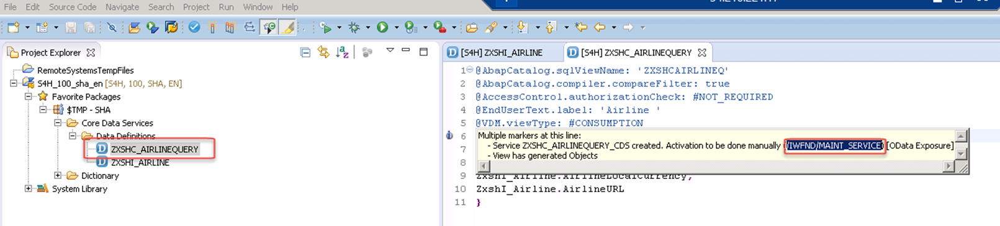

[ACCORDION-END]

[ACCORDION-BEGIN [Step 2: ](Service registration OData activation and OData Exposure)]

Open the ERP System SHA from the SAP Log on, enter the command (transaction) `/IWFND/MAINT_SERVICE` and execute it.

The **Activate and Maintain Services** window will be displayed. This is where you register the consumption view and expose it as OData.

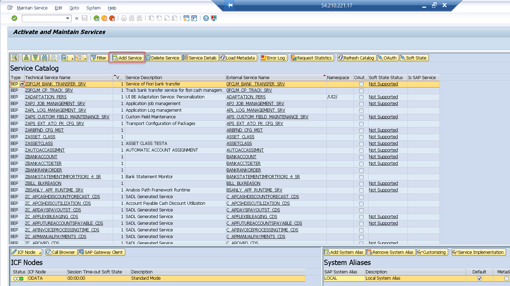

[ACCORDION-END]

[ACCORDION-BEGIN [Step 3: ](Add service)]

On the **Activate and Maintain Services** window , click the **Add Service** icon.  

A new window, **Add Selected Services** will open. In that window, maintain the System Alias by pressing the **`F4-Help`** and selecting **`LOCAL_PGW`** in the system alias pop-up window.

Enter `ZXSHC_AIRLINEQUERY_CDS` as the Technical Service Name (the name of the service).

Press the icon **Get Services**, then select **Add Selected Services**. Then click **Enter** to complete this step.

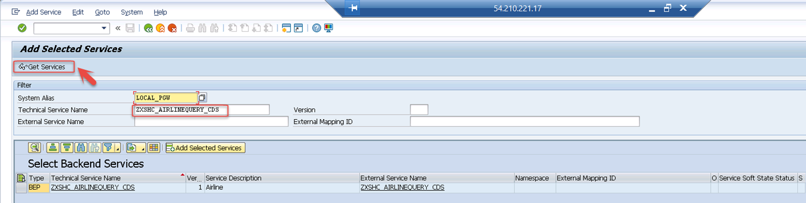

[ACCORDION-END]

[ACCORDION-BEGIN [Step 4: ](Set package assignment)]

The pop-up window **Add Service** is opened with pre-filled information; therefore, you don't need to make any change. Click **Local Object** icon to fill the package assignment (this will be filled with $TMP) and press **Enter** to continue. An information pop-up with the information `Service 'ZXSHC_AIRLINEQUERY_CDS' was created and it metadata was loaded successfully` will appear. Click **Enter** to complete the step.

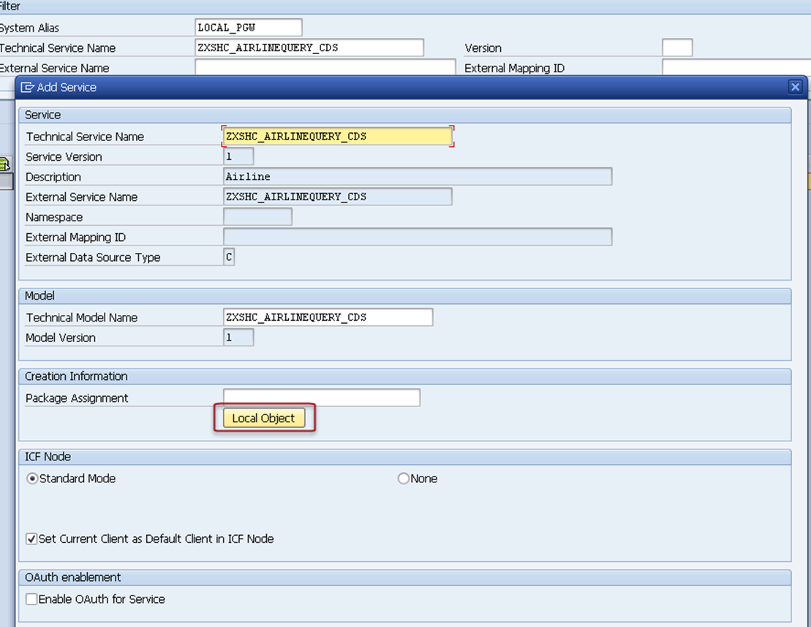

[ACCORDION-END]

[ACCORDION-BEGIN [Step 5: ](Verify OData association)]

Switch back to the ABAP perspective. Now if you hover the icon (number 1 in the screenshot below) on the code editor you will see in the pop-up window that the view has been exposed as OData. Furthermore, if you press the **Check ABAP Developer Object** icon (number 2 in the screenshot).

then hover the icon on the code editor a new pop-up window will confirm that the OData service has been generated.

In the pop-up window on the code editor, click on the link labeled `OData-Service`

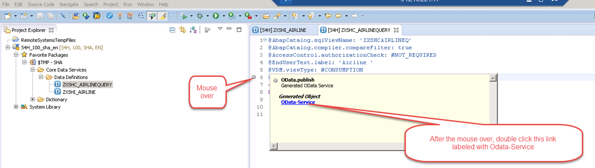

Your default browser will be launched.

  

[ACCORDION-END]

[ACCORDION-BEGIN [Step 6: ](Log in)]

You are now requested to log in. Enter **SHA** for the user name. Use your current ERP System password. Click **Enter**.

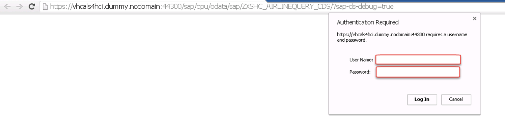

If you get this screen, everything is working properly and the service has been correctly exposed.

If you replace the URL extension `?sap-ds-debug=true` with `$metadata`  and press `Enter` , detailed information about the service will be displayed.

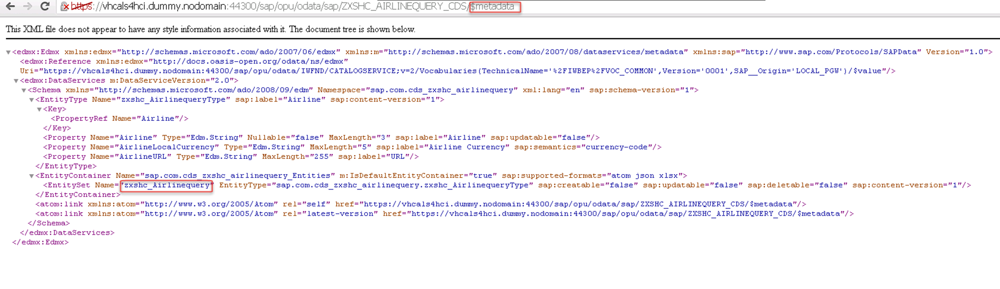

[ACCORDION-END]

[ACCORDION-BEGIN [Step 7: ](Check complete code)]

If you now replace the above URL extension with  the query data name `zxshc_Airlinequery` followed by `/` , more detailed information as well as service entities will be displayed

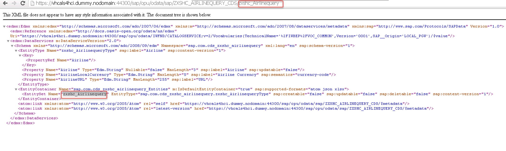

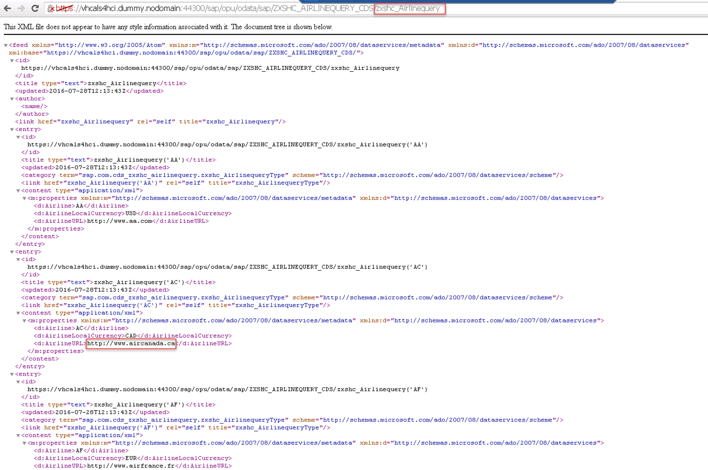

If you replace the URL with `$count`  and click **Enter**, the number of entries will be displayed.

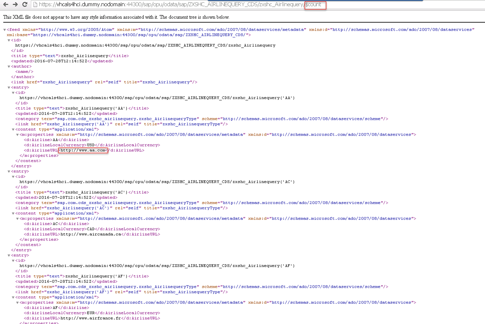

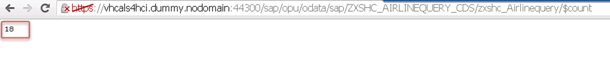

[ACCORDION-END]

### Notes

Although SAP offers trial editions for free you will still have to cover the costs for running these trial editions on AWS.    
This tutorial is part of the S/4HANA Core Data Services. If you want to learn more about the OData, see the [OData documentation](http://www.odata.org/documentation/).

